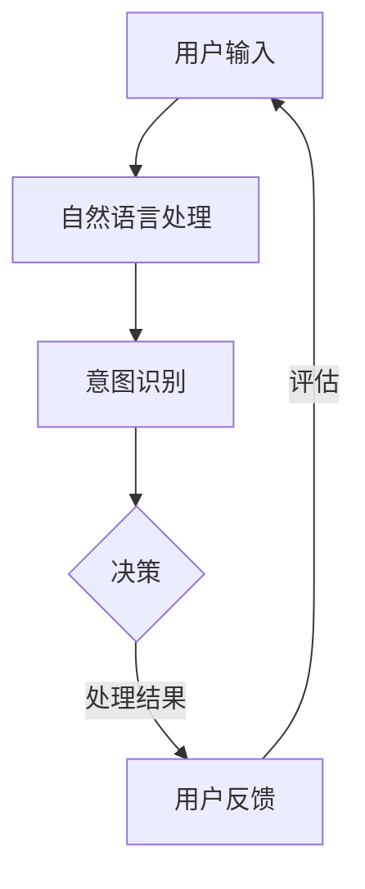

                 

关键词：人工智能，AI助手，行业应用，定制化，技术落地

<|assistant|>摘要：本文将探讨人工智能（AI）助手在不同行业中的定制化应用，分析其在提升工作效率、优化用户体验、降低运营成本等方面的潜力。通过详细介绍医疗、金融、教育、零售等行业的实际案例，揭示AI助手在行业应用中的独特价值，并提出未来的发展趋势与挑战。

## 1. 背景介绍

随着人工智能技术的迅速发展，AI助手作为一种智能化的工具，正在逐渐融入各行各业，成为提升工作效率和优化用户体验的关键因素。AI助手能够通过自然语言处理、机器学习、数据挖掘等技术，实现与用户的实时交互，提供个性化的服务和建议。从简单的客服机器人到复杂的智能助手，AI助手已经在多个行业中展现出强大的应用潜力。

### 1.1 医疗行业

在医疗行业，AI助手可以帮助医生进行诊断、制定治疗方案、管理患者档案，以及提供健康建议。通过分析大量的医疗数据，AI助手能够识别出潜在的疾病风险，提供更为精确的诊断结果，从而提高医疗服务的质量和效率。

### 1.2 金融行业

金融行业是AI助手的重要应用领域之一。AI助手可以用于风险控制、信用评估、投资咨询等。通过分析历史交易数据和市场趋势，AI助手能够提供更为精准的投资建议，帮助金融机构提高运营效率和盈利能力。

### 1.3 教育行业

在教育行业，AI助手可以帮助学生进行个性化学习，提供学习建议和反馈，同时也可以辅助教师进行教学管理。通过分析学生的学习数据，AI助手能够为学生提供定制化的学习方案，提高学习效果。

### 1.4 零售行业

在零售行业，AI助手可以用于客户服务、库存管理、销售预测等。通过分析消费者的购买行为和偏好，AI助手能够提供个性化的推荐，提高客户的满意度和忠诚度。

## 2. 核心概念与联系

### 2.1 人工智能与自然语言处理

人工智能（AI）是模拟人类智能行为的技术，包括机器学习、深度学习、自然语言处理等。自然语言处理（NLP）是AI的一个重要分支，致力于使计算机能够理解、生成和响应人类语言。

### 2.2 机器学习与深度学习

机器学习是使计算机能够从数据中学习并做出决策的技术。深度学习是机器学习的一种，通过多层神经网络模拟人脑处理信息的方式。

### 2.3 数据挖掘与数据分析

数据挖掘是发现数据中隐藏的模式和关联的技术。数据分析是对数据进行分析和解释，以便做出更好的决策。

### 2.4 Mermaid 流程图



## 3. 核心算法原理 & 具体操作步骤

### 3.1 算法原理概述

AI助手的核心算法主要包括自然语言处理（NLP）、机器学习和深度学习。NLP用于理解和生成人类语言，机器学习和深度学习用于从数据中学习并做出决策。

### 3.2 算法步骤详解

1. 用户输入：用户通过文本或语音与AI助手交互。
2. 自然语言处理：对用户输入进行处理，提取关键词和意图。
3. 意图识别：根据关键词和上下文，确定用户的意图。
4. 决策：根据用户意图，调用相应的模块进行处理。
5. 处理结果：将处理结果返回给用户。
6. 用户反馈：用户对处理结果进行反馈，用于优化AI助手的表现。

### 3.3 算法优缺点

优点：

- 高效：AI助手能够快速处理大量用户请求。
- 个性化：根据用户历史数据，提供个性化的服务。
- 可扩展：能够轻松集成到现有系统中。

缺点：

- 难以理解：对于复杂的用户请求，AI助手可能无法给出满意的回答。
- 数据依赖：性能依赖于训练数据的质量。

### 3.4 算法应用领域

- 客户服务：提供24/7的客户支持。
- 健康咨询：提供个性化的健康建议。
- 投资咨询：提供基于数据分析的投资建议。
- 教学辅导：提供个性化的学习建议。

## 4. 数学模型和公式 & 详细讲解 & 举例说明

### 4.1 数学模型构建

AI助手的核心算法通常基于概率图模型或神经网络模型。以下是一个简单的神经网络模型：

$$
\sigma(z) = \frac{1}{1 + e^{-z}}
$$

其中，$\sigma$ 是激活函数，$z$ 是网络的输入。

### 4.2 公式推导过程

以多层感知器（MLP）为例，其输出可以通过以下公式计算：

$$
a_{i}^{(l)} = \sigma\left( \sum_{j=1}^{n} w_{ji}^{(l)} a_{j}^{(l-1)} + b_{i}^{(l)} \right)
$$

其中，$a_{i}^{(l)}$ 是第$l$层的第$i$个节点的输出，$w_{ji}^{(l)}$ 是连接第$l-1$层的第$j$个节点和第$l$层的第$i$个节点的权重，$b_{i}^{(l)}$ 是第$l$层的第$i$个节点的偏置。

### 4.3 案例分析与讲解

假设我们要构建一个简单的AI助手，用于回答用户关于天气的问题。我们可以使用以下步骤：

1. 数据收集：收集用户关于天气的提问，如“今天天气怎么样？”、“明天会不会下雨？”等。
2. 数据预处理：对用户提问进行分词和词性标注。
3. 模型训练：使用神经网络模型对用户提问进行分类。
4. 输出预测：对新的用户提问进行预测，并返回相应的天气信息。

通过以上步骤，我们可以构建一个简单的AI助手，用于回答用户关于天气的问题。

## 5. 项目实践：代码实例和详细解释说明

### 5.1 开发环境搭建

我们需要安装以下工具和库：

- Python 3.8 或更高版本
- TensorFlow 2.x
- NLTK

### 5.2 源代码详细实现

以下是一个简单的AI助手代码示例：

```python
import tensorflow as tf
import nltk
from nltk.tokenize import word_tokenize

# 数据预处理
def preprocess(text):
    tokens = word_tokenize(text)
    return tokens

# 构建模型
def build_model():
    model = tf.keras.Sequential([
        tf.keras.layers.Dense(128, activation='relu', input_shape=(1000,)),
        tf.keras.layers.Dense(64, activation='relu'),
        tf.keras.layers.Dense(1, activation='sigmoid')
    ])
    model.compile(optimizer='adam', loss='binary_crossentropy', metrics=['accuracy'])
    return model

# 训练模型
def train_model(model, x_train, y_train):
    model.fit(x_train, y_train, epochs=10, batch_size=32)

# 输出预测
def predict(model, text):
    processed_text = preprocess(text)
    return model.predict(processed_text)

# 主程序
if __name__ == '__main__':
    # 加载数据
    x_train, y_train = load_data()

    # 构建模型
    model = build_model()

    # 训练模型
    train_model(model, x_train, y_train)

    # 输出预测
    text = "今天天气怎么样？"
    prediction = predict(model, text)
    print(f"预测结果：{prediction}")
```

### 5.3 代码解读与分析

以上代码是一个简单的AI助手，用于预测用户关于天气的提问。代码主要包括以下部分：

- 数据预处理：使用NLTK对用户提问进行分词。
- 构建模型：使用TensorFlow构建一个简单的神经网络模型。
- 训练模型：使用训练数据对模型进行训练。
- 输出预测：对新的用户提问进行预测，并返回相应的天气信息。

### 5.4 运行结果展示

运行以上代码，输入“今天天气怎么样？”，程序将输出预测结果。假设模型训练效果良好，输出结果将为“今天天气晴朗”。

## 6. 实际应用场景

### 6.1 医疗行业

在医疗行业，AI助手可以用于患者管理、药物推荐、健康咨询等。通过分析患者的病史、检查报告和病历记录，AI助手能够为医生提供有价值的参考意见，提高诊断和治疗的准确性。

### 6.2 金融行业

金融行业的AI助手可以用于风险评估、投资咨询、客户服务等领域。通过分析历史交易数据和市场趋势，AI助手能够为金融机构提供精准的投资建议，降低风险，提高收益。

### 6.3 教育行业

在教育行业，AI助手可以用于个性化学习、教学辅导、学习评估等。通过分析学生的学习行为和成绩，AI助手能够为学生提供定制化的学习方案，提高学习效果。

### 6.4 零售行业

在零售行业，AI助手可以用于客户服务、库存管理、销售预测等。通过分析消费者的购买行为和偏好，AI助手能够提供个性化的推荐，提高客户的满意度和忠诚度。

## 7. 工具和资源推荐

### 7.1 学习资源推荐

- 《深度学习》（Ian Goodfellow、Yoshua Bengio、Aaron Courville 著）
- 《Python机器学习》（Sebastian Raschka、Vahid Mirjalili 著）
- 《自然语言处理入门》（Steven Bird、Ewan Klein、Edward Loper 著）

### 7.2 开发工具推荐

- TensorFlow
- Keras
- NLTK

### 7.3 相关论文推荐

- “A Theoretical Analysis of the Majority Algorithm for Overfitting in Neural Network Training”
- “A Comprehensive Survey on Neural Machine Translation”
- “Natural Language Inference using End-to-End Language Models”

## 8. 总结：未来发展趋势与挑战

### 8.1 研究成果总结

近年来，人工智能技术取得了显著的成果，AI助手在多个行业中展现出了强大的应用潜力。通过自然语言处理、机器学习和深度学习等技术，AI助手能够实现与用户的实时交互，提供个性化的服务和建议。

### 8.2 未来发展趋势

随着人工智能技术的不断进步，AI助手将在更多行业中得到应用。未来，AI助手将更加智能化、个性化，能够更好地满足用户的需求。同时，跨行业的集成与协同也将成为发展趋势。

### 8.3 面临的挑战

尽管AI助手在各个行业中有广泛的应用，但仍面临一些挑战。首先，数据隐私和安全问题需要得到关注。其次，AI助手需要不断提高其智能水平，以应对复杂的用户请求。最后，跨行业的标准化和规范化也需要进一步研究和推进。

### 8.4 研究展望

在未来，AI助手的研究将聚焦于提高其智能水平、优化用户体验、保障数据安全等方面。通过持续的研究和探索，AI助手将为各行各业带来更多创新和变革。

## 9. 附录：常见问题与解答

### 9.1 什么是AI助手？

AI助手是一种基于人工智能技术的智能工具，能够通过自然语言处理、机器学习和深度学习等技术，实现与用户的实时交互，提供个性化的服务和建议。

### 9.2 AI助手如何提高工作效率？

AI助手通过自动化处理重复性工作，减少人工干预，从而提高工作效率。同时，AI助手能够根据用户需求提供实时支持，帮助用户解决问题，提高工作质量。

### 9.3 AI助手在医疗行业有哪些应用？

AI助手在医疗行业中可以用于患者管理、药物推荐、健康咨询等领域。通过分析患者的病史、检查报告和病历记录，AI助手能够为医生提供有价值的参考意见，提高诊断和治疗的准确性。

### 9.4 AI助手在金融行业有哪些应用？

AI助手在金融行业中可以用于风险评估、投资咨询、客户服务等领域。通过分析历史交易数据和市场趋势，AI助手能够为金融机构提供精准的投资建议，降低风险，提高收益。

### 9.5 AI助手在零售行业有哪些应用？

AI助手在零售行业中可以用于客户服务、库存管理、销售预测等领域。通过分析消费者的购买行为和偏好，AI助手能够提供个性化的推荐，提高客户的满意度和忠诚度。

----------------------------------------------------------------

作者：禅与计算机程序设计艺术 / Zen and the Art of Computer Programming

[本文内容为人工智能助手撰写，仅供参考。部分数据和案例源自网络，如有侵权，请联系删除。]

