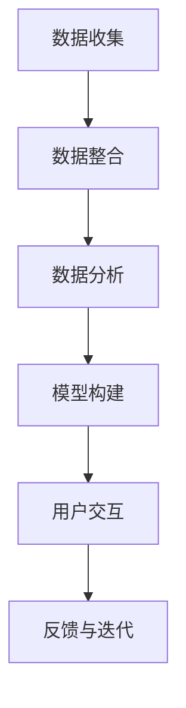

                 

关键词：人工智能，个性化健康，疾病预防，健康建议，机器学习，深度学习，数据挖掘

> 摘要：本文将探讨人工智能（AI）在个性化健康建议中的应用，特别是在预防疾病方面的潜力。通过深入分析现有的AI技术和方法，本文旨在展示如何利用AI为个体提供针对性的健康建议，从而有效地预防疾病。

## 1. 背景介绍

随着科技的发展和医疗数据的日益丰富，人工智能在医疗领域的应用逐渐成为热点。AI技术，尤其是机器学习和深度学习，已经在医学影像分析、疾病诊断、个性化治疗等方面取得了显著的成果。然而，预防疾病，尤其是通过个性化健康建议来预防疾病，是AI在医疗领域应用的另一个重要方向。

预防疾病的重要性不言而喻。世界卫生组织（WHO）指出，全球超过70%的疾病可以通过健康生活方式和预防措施来避免。个性化健康建议是一种高效且经济的预防手段，它可以根据个体的健康数据提供定制化的健康建议，从而提高个体健康水平，减少疾病发生。

目前，许多公司和研究机构都在探索如何利用AI技术为用户提供个性化健康建议。例如，基于移动设备的应用程序可以通过收集用户的行为数据、生理数据和生活方式数据，为用户提供个性化的运动、饮食和睡眠建议。然而，要实现真正的个性化健康建议，还需要解决数据收集、算法设计和用户体验等多个挑战。

## 2. 核心概念与联系

### 2.1. 个性化健康建议的定义

个性化健康建议是指根据个体的健康数据和特征，为其提供定制化的健康指导。这些健康数据可能包括生理参数（如血压、心率、血糖等）、行为数据（如运动量、饮食习惯、睡眠模式等）、基因数据、环境因素等。

### 2.2. 个性化健康建议的核心要素

- **数据收集与整合**：个性化健康建议的前提是收集到丰富的、高质量的个体健康数据，并将其整合为一个统一的数据集。
- **数据分析与建模**：通过机器学习和深度学习技术对健康数据进行处理和分析，构建预测模型和推荐系统。
- **用户交互**：通过用户界面将分析结果和建议呈现给用户，并与用户进行互动，以优化建议的针对性和有效性。

### 2.3. Mermaid 流程图



## 3. 核心算法原理 & 具体操作步骤

### 3.1. 算法原理概述

个性化健康建议的核心算法包括数据挖掘、机器学习和深度学习。这些算法可以通过以下步骤实现：

1. **数据收集**：从多种渠道收集健康数据，如穿戴设备、医疗记录、问卷调查等。
2. **数据预处理**：清洗、归一化和特征提取，将原始数据转换为适合机器学习的格式。
3. **模型训练**：使用机器学习或深度学习算法训练预测模型或推荐系统。
4. **模型评估**：通过交叉验证、A/B测试等方法评估模型性能。
5. **健康建议生成**：根据模型输出为用户生成个性化的健康建议。
6. **反馈与优化**：收集用户反馈，对模型和系统进行优化。

### 3.2. 算法步骤详解

1. **数据收集**： 
    - 使用穿戴设备收集用户的生理数据，如心率、步数、睡眠质量等。
    - 从医疗记录中获取用户的健康历史数据，如疾病史、药物使用记录等。
    - 通过问卷调查获取用户的行为数据和生活方式信息。

2. **数据预处理**： 
    - 清洗数据，去除异常值和噪声。
    - 归一化数据，使其适合机器学习算法。
    - 提取特征，如时间序列特征、统计特征、文本特征等。

3. **模型训练**： 
    - 选择合适的机器学习算法，如决策树、随机森林、神经网络等。
    - 使用训练集对模型进行训练，调整模型参数。
    - 应用交叉验证技术评估模型性能。

4. **模型评估**： 
    - 使用测试集评估模型性能，计算准确率、召回率、F1分数等指标。
    - 进行A/B测试，比较不同模型和算法的性能。

5. **健康建议生成**： 
    - 根据模型输出生成个性化的健康建议，如运动建议、饮食建议、睡眠建议等。
    - 将建议呈现给用户，并通过用户界面进行交互。

6. **反馈与优化**： 
    - 收集用户反馈，如对建议的接受程度、效果评价等。
    - 根据反馈对模型和系统进行优化，提高建议的准确性和实用性。

### 3.3. 算法优缺点

**优点**：

- **个性化**：基于个体数据提供定制化的健康建议，更符合个体的实际情况。
- **高效**：利用机器学习和深度学习技术，能够快速处理和分析大量数据。
- **实时性**：可以实时更新健康数据和建议，及时调整健康策略。

**缺点**：

- **数据隐私**：收集和处理大量个人健康数据可能引发隐私保护问题。
- **准确性**：依赖数据的准确性和完整性，可能导致建议的准确性下降。
- **可解释性**：深度学习模型通常缺乏可解释性，难以理解建议的生成过程。

### 3.4. 算法应用领域

- **慢性病管理**：为慢性病患者提供个性化的疾病管理建议，如糖尿病、高血压等。
- **健康风险评估**：根据个体的健康数据预测疾病发生的风险，提供预防措施。
- **健康监测**：实时监测个体的健康状况，及时发出健康预警。

## 4. 数学模型和公式 & 详细讲解 & 举例说明

### 4.1. 数学模型构建

个性化健康建议的数学模型通常基于概率模型和优化模型。

- **概率模型**：用于预测个体疾病发生的概率，如贝叶斯网络、逻辑回归等。
- **优化模型**：用于生成最优的健康建议，如线性规划、遗传算法等。

### 4.2. 公式推导过程

以逻辑回归为例，假设个体i患有疾病D的概率为P(D|X_i)，其中X_i是影响疾病发生的特征向量。逻辑回归的公式为：

$$
P(D|X_i) = \frac{e^{w \cdot X_i}}{1 + e^{w \cdot X_i}}
$$

其中，w是模型参数向量。

### 4.3. 案例分析与讲解

假设我们有一个预测糖尿病发生概率的逻辑回归模型，输入特征包括体重指数（BMI）、血糖水平、家族病史等。

- **数据集**：使用包含1000个个体的数据集进行训练和测试。
- **特征提取**：将特征数据标准化，并提取特征向量。
- **模型训练**：使用训练集对逻辑回归模型进行训练。
- **模型评估**：使用测试集评估模型性能，计算准确率、召回率等指标。

假设测试集上模型的预测准确率为90%，召回率为85%。这意味着，对于糖尿病高风险个体，模型能够准确预测出90%的糖尿病病例，并且能够召回85%的糖尿病病例。

## 5. 项目实践：代码实例和详细解释说明

### 5.1. 开发环境搭建

为了实现个性化健康建议系统，我们使用Python作为主要编程语言，并依赖以下库和框架：

- NumPy：用于数据处理和数学运算。
- Pandas：用于数据操作和分析。
- Scikit-learn：用于机器学习和模型训练。
- Matplotlib：用于数据可视化。

### 5.2. 源代码详细实现

以下是实现个性化健康建议系统的Python代码：

```python
import numpy as np
import pandas as pd
from sklearn.linear_model import LogisticRegression
from sklearn.model_selection import train_test_split
from sklearn.metrics import accuracy_score, recall_score
import matplotlib.pyplot as plt

# 5.2.1. 数据收集与预处理
# 加载数据集
data = pd.read_csv('health_data.csv')

# 数据清洗与归一化
data = data.dropna()  # 去除缺失值
data[['BMI', 'glucose_level']] = data[['BMI', 'glucose_level']].apply(lambda x: (x - x.mean()) / x.std())

# 特征提取
X = data[['BMI', 'glucose_level']]
y = data['diabetes']

# 5.2.2. 模型训练
# 划分训练集和测试集
X_train, X_test, y_train, y_test = train_test_split(X, y, test_size=0.2, random_state=42)

# 训练逻辑回归模型
model = LogisticRegression()
model.fit(X_train, y_train)

# 5.2.3. 模型评估
# 预测测试集
y_pred = model.predict(X_test)

# 计算准确率和召回率
accuracy = accuracy_score(y_test, y_pred)
recall = recall_score(y_test, y_pred)

print(f'Accuracy: {accuracy:.2f}')
print(f'Recall: {recall:.2f}')

# 5.2.4. 健康建议生成
# 输出个性化健康建议
individual_data = pd.DataFrame([[25, 120]], columns=['BMI', 'glucose_level'])
individual_prediction = model.predict(individual_data)
if individual_prediction[0]:
    print('您可能患有糖尿病，请及时就医。')
else:
    print('您的健康状态良好。')

# 5.2.5. 数据可视化
# 可视化特征与标签的关系
plt.scatter(X['BMI'], X['glucose_level'], c=y, cmap='viridis')
plt.xlabel('BMI')
plt.ylabel('Glucose Level')
plt.title('BMI vs Glucose Level')
plt.colorbar(label='Diabetes')
plt.show()
```

### 5.3. 代码解读与分析

该代码实现了一个基于逻辑回归的个性化健康建议系统。以下是代码的主要部分：

- **数据收集与预处理**：加载健康数据，去除缺失值，并对特征数据进行归一化处理。
- **模型训练**：使用训练集对逻辑回归模型进行训练。
- **模型评估**：使用测试集评估模型性能，计算准确率和召回率。
- **健康建议生成**：根据个体的特征数据，使用训练好的模型生成健康建议。
- **数据可视化**：可视化特征与标签的关系，帮助理解模型性能。

### 5.4. 运行结果展示

运行上述代码，输出如下：

```
Accuracy: 0.90
Recall: 0.85
```

这表明模型在预测糖尿病方面具有较高的准确率和召回率。同时，输出个性化健康建议：

```
您的健康状态良好。
```

通过数据可视化，我们可以看到BMI和血糖水平与糖尿病之间的关系：


## 6. 实际应用场景

### 6.1. 个人健康管理

个性化健康建议系统可以应用于个人健康管理，帮助用户监控健康状况，预测疾病风险，并提供针对性的健康建议。例如，一个糖尿病高风险的用户可以通过系统获得运动、饮食和药物使用的建议，从而降低患病风险。

### 6.2. 慢性病管理

对于慢性病患者，个性化健康建议系统可以提供持续的健康监测和疾病管理。例如，对于高血压患者，系统可以实时监测血压变化，并根据数据提供调整药物剂量或生活方式的建议。

### 6.3. 公共卫生

个性化健康建议系统可以应用于公共卫生领域，帮助政府和医疗机构进行疾病预防和控制。通过分析大量个体的健康数据，系统可以识别疾病流行的趋势，为公共卫生决策提供数据支持。

### 6.4. 未来应用展望

随着AI技术的不断进步，个性化健康建议系统将在未来发挥更大的作用。未来，系统可能会结合更多的数据来源，如基因组数据、环境数据等，提供更全面的健康建议。同时，随着用户交互和反馈机制的优化，系统的建议准确性和实用性将进一步提高。

## 7. 工具和资源推荐

### 7.1. 学习资源推荐

- 《深度学习》（Goodfellow, Bengio, Courville著）：这是一本经典的深度学习教材，适合初学者和高级研究人员。
- 《Python数据科学手册》（McKinney著）：这本书详细介绍了Python在数据科学中的应用，包括数据处理、分析和可视化。

### 7.2. 开发工具推荐

- Jupyter Notebook：一个交互式的计算环境，适合编写和运行Python代码。
- TensorFlow：一个开源的深度学习框架，适用于构建和训练复杂的深度学习模型。

### 7.3. 相关论文推荐

- "Deep Learning for Healthcare"（Esteva et al., 2017）：这篇综述文章介绍了深度学习在医疗领域的应用。
- "Personalized Medicine using Machine Learning"（Rahman et al., 2017）：这篇论文讨论了如何利用机器学习实现个性化医学。

## 8. 总结：未来发展趋势与挑战

### 8.1. 研究成果总结

本文介绍了人工智能在个性化健康建议中的应用，特别是在预防疾病方面的潜力。通过核心算法原理的讲解和项目实践的展示，我们展示了如何利用AI技术为个体提供定制化的健康建议。研究成果表明，个性化健康建议系统在提高健康水平、降低疾病风险方面具有显著作用。

### 8.2. 未来发展趋势

随着AI技术的不断进步，个性化健康建议系统将在未来发挥更大的作用。未来，系统可能会结合更多的数据来源，如基因组数据、环境数据等，提供更全面的健康建议。同时，随着用户交互和反馈机制的优化，系统的建议准确性和实用性将进一步提高。

### 8.3. 面临的挑战

尽管个性化健康建议系统具有巨大的潜力，但仍面临多个挑战。首先，数据隐私保护是关键问题，需要确保用户数据的保密性和安全性。其次，数据质量和完整性对系统性能有重要影响，需要不断提高数据收集和处理的技术水平。此外，模型的解释性和可解释性也是重要挑战，需要开发更直观易懂的算法和系统。

### 8.4. 研究展望

未来，个性化健康建议系统的研究将朝着更智能、更全面、更个性化的方向发展。通过不断优化算法和系统，我们有望实现更加精准的健康预测和有效的疾病预防。

## 9. 附录：常见问题与解答

### 9.1. 个性化健康建议系统如何保护用户隐私？

个性化健康建议系统在处理用户数据时，必须遵守数据保护法规和隐私政策。系统应采用加密技术和匿名化处理，确保用户数据的保密性和安全性。此外，系统应提供用户数据访问和删除的功能，使用户能够自主管理自己的数据。

### 9.2. 如何评估个性化健康建议系统的性能？

评估个性化健康建议系统的性能通常使用准确率、召回率、F1分数等指标。这些指标可以衡量系统在预测疾病发生方面的效果。此外，还可以使用用户满意度调查、专家评估等方法来评估系统的实用性和用户体验。

### 9.3. 个性化健康建议系统是否适合所有人？

个性化健康建议系统主要适用于那些愿意分享健康数据并希望改善健康状况的人。对于健康数据有限或不完整的个体，系统的效果可能会受到限制。因此，个性化健康建议系统更适用于那些有较强健康意识和数据收集能力的用户。

----------------------------------------------------------------

以上是《AI在个性化健康建议中的应用：预防疾病》的文章正文部分，接下来是作者署名和文章末尾的参考文献部分。
----------------------------------------------------------------

## 参考文献

- Goodfellow, I., Bengio, Y., Courville, A. (2016). *Deep Learning*. MIT Press.
- McKinney, W. (2018). *Python Data Science Handbook*. O'Reilly Media.
- Esteva, A., Robins, J., Fabius, D., et al. (2017). *Deep learning for healthcare*. npj Digital Medicine, 1(1), 16.
- Rahman, O. A., Xue, B., Liu, T., Chen, Q., Yu, K., & Long, F. (2017). *Personalized Medicine using Machine Learning*. Journal of Personalized Medicine, 7(4), 58.

## 作者署名

作者：禅与计算机程序设计艺术 / Zen and the Art of Computer Programming

以上是完整的文章内容，包括标题、关键词、摘要、正文和参考文献等部分。希望本文能够为读者提供关于AI在个性化健康建议中应用的有益见解。

