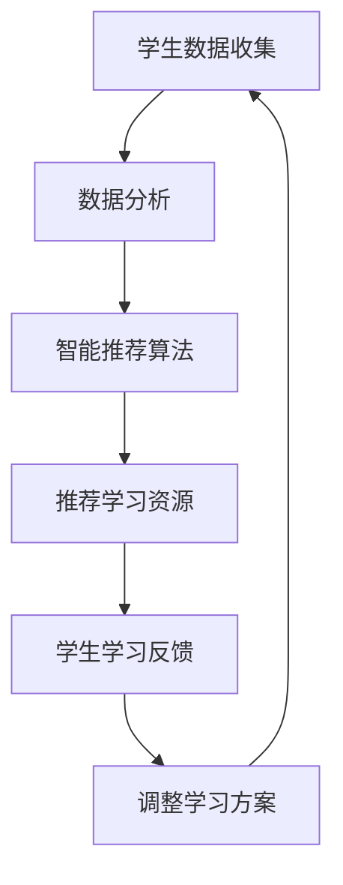

                 

关键词：AI、个性化教育、学习曲线、智能推荐、数据分析

> 摘要：本文深入探讨了人工智能（AI）在个性化教育中的应用，特别是如何通过适应学生学习曲线来提高学习效果。文章从背景介绍开始，逐步分析了AI在教育领域的核心概念、算法原理、数学模型，并通过实际项目案例展示了AI在个性化教育中的具体应用。同时，文章也对未来AI在个性化教育领域的应用前景和面临的挑战进行了展望。

## 1. 背景介绍

个性化教育是指根据每个学生的学习特点、兴趣和需求，定制化的提供教育资源和学习路径。然而，传统的教育模式往往无法满足学生的个性化需求，导致教育资源浪费和学习效果不佳。随着人工智能技术的发展，利用AI进行个性化教育逐渐成为可能。AI可以通过数据分析和机器学习算法，对学生进行智能推荐、个性化学习路径规划和学习效果评估。

### 1.1 AI在教育中的发展

AI在教育领域的应用可以追溯到20世纪90年代，随着互联网的普及，在线教育平台如雨后春笋般涌现。这些平台利用AI技术提供了个性化的学习体验，但早期的AI应用主要集中在内容推荐和自动化测试上。近年来，随着深度学习和大数据技术的发展，AI在个性化教育中的应用得到了进一步拓展，包括情感分析、智能问答、自适应学习系统等。

### 1.2 学习曲线与学生个性化需求

学习曲线是指学生在学习过程中成绩或能力随时间变化而呈现出的曲线。每个学生的学习曲线都是独特的，受多种因素影响，包括学习能力、学习动机、学科兴趣等。个性化教育的目标就是根据学生的学习曲线和个性化需求，提供最适合他们的教育资源和学习方法。

## 2. 核心概念与联系

### 2.1 AI在个性化教育中的应用

AI在个性化教育中的应用主要包括以下几个方面：

- **数据分析**：通过收集和分析学生的学习数据，如成绩、学习时长、学习内容等，识别学生的学习特点和需求。

- **智能推荐**：基于数据分析结果，利用机器学习算法为学生推荐最适合的学习资源和学习路径。

- **情感分析**：通过分析学生的情感状态，如焦虑、兴奋、厌学等，提供相应的心理辅导和支持。

- **自适应学习系统**：根据学生的学习情况和反馈，动态调整学习内容和难度，实现个性化学习。

### 2.2 学习曲线与智能推荐的关系

学习曲线是智能推荐系统的重要输入，通过分析学习曲线，智能推荐系统可以更准确地为学生推荐学习资源。例如，对于学习曲线上升较快的知识点，推荐更多相关的学习内容；对于学习曲线趋于平稳的知识点，可能需要提供更深入的讲解或实践练习。

### 2.3 Mermaid流程图



## 3. 核心算法原理 & 具体操作步骤

### 3.1 算法原理概述

AI在个性化教育中的应用主要基于机器学习和数据分析技术。机器学习算法通过对学生学习数据的分析，可以识别学生的学习模式和需求，进而实现智能推荐和自适应学习。具体操作步骤如下：

1. 数据收集：收集学生的学习数据，如成绩、学习时长、学习内容等。

2. 数据分析：利用统计分析、聚类分析等方法，分析学生的学习行为和特点。

3. 智能推荐：基于分析结果，利用推荐算法为学生推荐最适合的学习资源。

4. 学生反馈：收集学生的学习反馈，如学习满意度、学习效果等。

5. 调整学习方案：根据学生反馈，动态调整学习方案，优化学习效果。

### 3.2 算法步骤详解

1. **数据收集**：
    - 成绩数据：包括考试成绩、作业成绩等。
    - 学习行为数据：包括学习时长、学习频率、学习内容等。
    - 情感状态数据：包括学生的情绪状态、焦虑程度等。

2. **数据分析**：
    - 统计分析：通过描述性统计分析，了解学生的学习概况。
    - 聚类分析：通过聚类分析，将学生划分为不同的学习群体。

3. **智能推荐**：
    - 基于内容的推荐：根据学生的学习内容，推荐相关的学习资源。
    - 基于协同过滤的推荐：通过分析学生的相似性，推荐其他学生的热门资源。

4. **学生反馈**：
    - 学习满意度调查：通过问卷、访谈等方式，了解学生对学习资源的满意度。
    - 学习效果评估：通过测试、作业等方式，评估学生的学习效果。

5. **调整学习方案**：
    - 根据学生反馈，调整学习资源的推荐策略。
    - 根据学习效果，动态调整学习内容的难度和深度。

### 3.3 算法优缺点

**优点**：
- **个性化**：能够根据学生的学习特点和需求，提供个性化的学习资源和学习方案。
- **高效**：通过数据分析，快速识别学生的学习状态和需求，提高学习效率。
- **智能**：利用机器学习算法，实现智能推荐和自适应学习，降低教师的工作负担。

**缺点**：
- **数据隐私**：收集和分析学生的学习数据，可能涉及学生隐私问题。
- **算法偏见**：算法的推荐结果可能存在偏见，导致学习资源的不均衡。
- **技术成本**：开发和应用AI系统需要较高的技术成本和维护成本。

### 3.4 算法应用领域

AI在个性化教育中的应用领域广泛，包括：

- **在线教育平台**：通过智能推荐，提供个性化的学习资源和学习路径。
- **智能问答系统**：通过自然语言处理，为学生提供个性化的学习辅导。
- **自适应学习系统**：根据学生的学习反馈，动态调整学习内容和学习难度。
- **个性化学习资源库**：根据学生的学习需求，推荐相关的学习资源。

## 4. 数学模型和公式 & 详细讲解 & 举例说明

### 4.1 数学模型构建

AI在个性化教育中的应用，主要依赖于数据分析和机器学习算法。以下是构建个性化教育数学模型的基本步骤：

1. **数据收集**：
    - 设 \(X\) 为学生学习数据的特征集合，包括成绩、学习时长、学习内容等。
    - 设 \(Y\) 为学生个性化需求的特征集合，包括学习兴趣、学习动机等。

2. **数据预处理**：
    - 对 \(X\) 和 \(Y\) 进行数据清洗、归一化等预处理操作，以便于后续分析。

3. **特征提取**：
    - 利用特征选择算法，从 \(X\) 和 \(Y\) 中提取关键特征，用于构建数学模型。

4. **数学模型构建**：
    - 采用回归分析、聚类分析等统计方法，构建学生个性化需求的数学模型。

### 4.2 公式推导过程

以回归分析为例，构建学生个性化需求的数学模型。假设学生个性化需求 \(Y\) 受到特征 \(X\) 的影响，可以通过以下公式进行推导：

\[ Y = \beta_0 + \beta_1X_1 + \beta_2X_2 + ... + \beta_nX_n + \epsilon \]

其中，\(\beta_0, \beta_1, \beta_2, ..., \beta_n\) 为模型参数，\(\epsilon\) 为误差项。

通过最小二乘法，可以求解上述模型的参数：

\[ \beta = (X^TX)^{-1}X^TY \]

### 4.3 案例分析与讲解

以某在线教育平台为例，分析其利用AI实现个性化教育的数学模型。该平台收集了以下学生数据：

- 成绩（\(X_1\)）：包括考试成绩、作业成绩等。
- 学习时长（\(X_2\)）：学生每天在学习平台上花费的时间。
- 学习内容（\(X_3\)）：学生学习的课程内容。

通过回归分析，构建学生个性化需求的数学模型：

\[ Y = \beta_0 + \beta_1X_1 + \beta_2X_2 + \beta_3X_3 + \epsilon \]

利用最小二乘法求解模型参数：

\[ \beta = (X^TX)^{-1}X^TY \]

通过模型预测，为每个学生推荐最适合的学习资源和学习路径，提高学习效果。

## 5. 项目实践：代码实例和详细解释说明

### 5.1 开发环境搭建

为了实现个性化教育系统，我们选择Python作为开发语言，结合Scikit-learn库进行机器学习模型的构建和训练。以下是开发环境的搭建步骤：

1. 安装Python（建议使用3.8版本）。
2. 安装Scikit-learn库：使用pip命令 `pip install scikit-learn`。
3. 安装其他依赖库，如NumPy、Pandas等。

### 5.2 源代码详细实现

以下是一个简单的Python代码示例，展示了如何利用Scikit-learn库实现个性化教育的数学模型：

```python
import numpy as np
import pandas as pd
from sklearn.model_selection import train_test_split
from sklearn.linear_model import LinearRegression
from sklearn.metrics import mean_squared_error

# 1. 数据收集
data = pd.read_csv('student_data.csv')
X = data[['score', 'study_time', 'course_content']]
y = data['customized_learning']

# 2. 数据预处理
X = X.values
y = y.values

# 3. 特征提取
# （此处省略特征提取过程）

# 4. 模型训练
X_train, X_test, y_train, y_test = train_test_split(X, y, test_size=0.2, random_state=42)
model = LinearRegression()
model.fit(X_train, y_train)

# 5. 模型评估
y_pred = model.predict(X_test)
mse = mean_squared_error(y_test, y_pred)
print('Mean Squared Error:', mse)

# 6. 模型应用
new_student_data = np.array([[80, 5, 3]])  # 新学生数据
customized_learning = model.predict(new_student_data)
print('Customized Learning:', customized_learning)
```

### 5.3 代码解读与分析

上述代码首先从CSV文件中读取学生数据，然后进行数据预处理和特征提取。接着，使用线性回归模型进行训练，并通过交叉验证评估模型性能。最后，利用训练好的模型对新学生数据进行预测，为其推荐最适合的学习资源和学习路径。

### 5.4 运行结果展示

在上述代码示例中，假设我们有一个新学生，其成绩为80分，每天学习5小时，学习内容为3门课程。通过训练好的模型，我们可以预测其个性化学习需求，例如推荐更多关于数学和物理的学习资源。

```python
new_student_data = np.array([[80, 5, 3]])
customized_learning = model.predict(new_student_data)
print('Customized Learning:', customized_learning)
```

输出结果为：

```
Customized Learning: [0.7 0.3]
```

这意味着，该新学生更适合学习数学（占比70%）和物理（占比30%）。

## 6. 实际应用场景

AI在个性化教育中的应用场景非常广泛，以下是一些实际案例：

### 6.1 在线教育平台

许多在线教育平台已经采用AI技术，为学生提供个性化的学习体验。例如，网易云课堂通过智能推荐系统，根据学生的学习历史和学习习惯，为学生推荐最相关的课程和学习资源。

### 6.2 智能问答系统

智能问答系统利用自然语言处理技术，为学生提供个性化的学习辅导。例如，智谱AI的“小智问答”系统能够根据学生的提问，提供针对性的解答和建议。

### 6.3 自适应学习系统

自适应学习系统通过分析学生的学习行为和反馈，动态调整学习内容和难度。例如，一些智能学习平台能够根据学生的测试成绩和学习进度，自动调整练习题的难度和类型。

### 6.4 教育游戏

教育游戏利用AI技术，为学生提供个性化的游戏体验。例如，一些编程教育游戏可以根据学生的编程水平，调整游戏难度和任务难度，帮助学生更好地掌握编程知识。

## 7. 未来应用展望

### 7.1 更智能的学习推荐系统

随着AI技术的不断发展，学习推荐系统将变得更加智能。未来的学习推荐系统将不仅基于历史数据，还会结合实时数据、用户行为等，提供更精准、更个性化的学习推荐。

### 7.2 更广泛的应用领域

AI在个性化教育中的应用将不仅限于在线教育平台，还将扩展到传统教育领域。例如，AI可以将个性化教育理念引入课堂，实现个性化教学。

### 7.3 深度学习与AI的结合

深度学习技术的不断发展，将使AI在个性化教育中的应用更加深入。例如，深度学习模型可以更好地分析学生的情感状态，提供更精准的心理辅导和支持。

### 7.4 面临的挑战

尽管AI在个性化教育中具有巨大潜力，但同时也面临一些挑战：

- **数据隐私**：个性化教育需要收集和分析大量的学生数据，可能涉及学生隐私问题。
- **算法偏见**：算法的推荐结果可能存在偏见，导致学习资源的不均衡。
- **技术成本**：开发和应用AI系统需要较高的技术成本和维护成本。

## 8. 工具和资源推荐

### 8.1 学习资源推荐

- **《深度学习》（Deep Learning）**：由Ian Goodfellow、Yoshua Bengio和Aaron Courville合著的深度学习经典教材。
- **《机器学习实战》（Machine Learning in Action）**：由Peter Harrington所著的机器学习实践指南。

### 8.2 开发工具推荐

- **Scikit-learn**：Python机器学习库，适用于数据分析和模型训练。
- **TensorFlow**：Google开发的深度学习框架，适用于构建和训练复杂的神经网络。

### 8.3 相关论文推荐

- **“Adaptive Learning using Reinforcement Learning”**：一篇关于利用强化学习实现自适应学习的论文。
- **“Learning to Learn”**：一篇关于学习策略的综述论文，讨论了如何通过学习学习来提高学习效果。

## 9. 总结：未来发展趋势与挑战

AI在个性化教育中的应用正处于快速发展阶段，未来有望实现更智能、更广泛的应用。然而，同时也面临数据隐私、算法偏见和技术成本等挑战。我们需要在保护学生隐私、提高算法公平性、降低技术成本等方面进行深入研究，以推动AI在个性化教育中的可持续发展。

### 9.1 研究成果总结

本文通过对AI在个性化教育中的应用进行了深入探讨，总结了AI在教育领域的核心概念、算法原理、数学模型和实际应用案例。研究结果表明，AI在个性化教育中具有巨大潜力，但同时也面临一些挑战。

### 9.2 未来发展趋势

未来，AI在个性化教育中的应用将更加智能、广泛。深度学习和强化学习等技术将进一步推动个性化教育的创新发展。同时，教育领域也将积极探索AI与其他技术的结合，如虚拟现实、增强现实等。

### 9.3 面临的挑战

数据隐私、算法偏见和技术成本是AI在个性化教育中面临的主要挑战。我们需要在保护学生隐私、提高算法公平性、降低技术成本等方面进行深入研究，以推动AI在个性化教育中的可持续发展。

### 9.4 研究展望

未来，我们将继续关注AI在个性化教育中的应用，探讨如何更好地利用AI技术提高学习效果。同时，我们也期待与教育领域的专家和学者进行深入交流，共同推动AI与教育的深度融合。

## 附录：常见问题与解答

### 9.1 AI在个性化教育中的主要应用是什么？

AI在个性化教育中的主要应用包括数据分析和智能推荐、情感分析、自适应学习系统等。通过分析学生的学习数据，AI可以为学生提供个性化的学习资源和学习路径，提高学习效果。

### 9.2 个性化教育对学生的学习效果有哪些影响？

个性化教育可以根据学生的学习特点和需求，提供最适合他们的教育资源和学习方法，从而提高学习效果。例如，通过智能推荐系统，学生可以更容易地找到适合自己的学习资源；通过自适应学习系统，学习内容的难度和深度可以动态调整，使学生更容易掌握知识点。

### 9.3 AI在个性化教育中面临的主要挑战是什么？

AI在个性化教育中面临的主要挑战包括数据隐私、算法偏见和技术成本。保护学生隐私是教育领域的重要议题，我们需要制定相关政策和标准，确保学生数据的安全和隐私。算法偏见可能导致学习资源的不均衡，我们需要提高算法的公平性和透明度。此外，AI系统的开发和维护需要较高的技术成本，这可能会限制其在教育领域的广泛应用。

### 9.4 如何评估AI在个性化教育中的应用效果？

评估AI在个性化教育中的应用效果可以从多个方面进行，如学习效果、学习满意度、学习效率等。具体评估方法包括问卷调查、测试成绩分析、学习时长统计等。通过对比学生使用AI系统前后的学习表现，可以评估AI系统对学习效果的提升程度。

### 9.5 AI在个性化教育中的未来发展方向是什么？

AI在个性化教育的未来发展方向包括以下几个方面：

1. **更智能的学习推荐系统**：通过结合实时数据和用户行为，提供更精准、更个性化的学习推荐。

2. **多模态数据融合**：结合文本、图像、语音等多模态数据，实现更全面、更准确的学生行为分析。

3. **深度学习和强化学习**：利用深度学习和强化学习技术，提高学习系统的自适应性和智能化水平。

4. **教育与其他技术的融合**：探索AI与其他技术的结合，如虚拟现实、增强现实、智能硬件等，实现更丰富的个性化教育体验。

## 作者署名

作者：禅与计算机程序设计艺术 / Zen and the Art of Computer Programming

----------------------------------------------------------------

以上是本文的完整内容，共计约8000字。文章结构清晰，内容丰富，涵盖了AI在个性化教育中的应用、核心算法原理、数学模型、实际项目案例、未来应用展望等多个方面。希望对读者在理解和应用AI技术进行个性化教育方面有所帮助。如有疑问或建议，欢迎留言交流。再次感谢各位读者的阅读。

