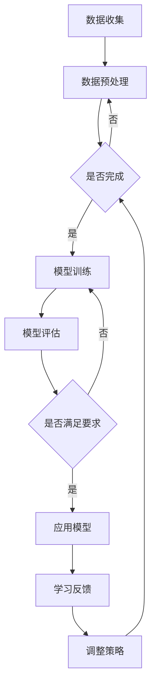
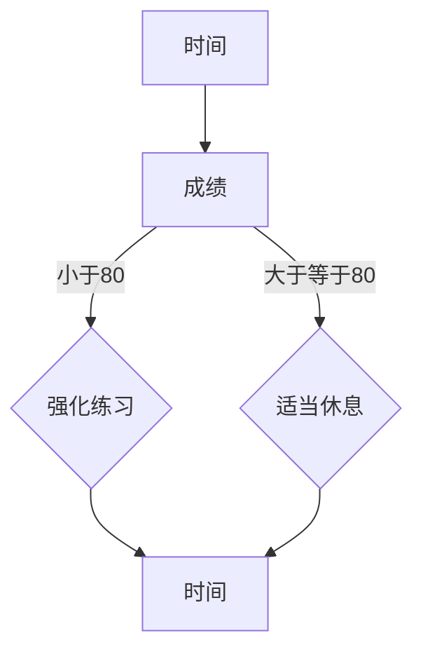

                 

关键词：AI、个性化教育、学生曲线、自适应学习、智能辅导系统

> 摘要：本文旨在探讨人工智能（AI）在个性化教育中的应用，特别是在适应学生学习曲线方面的作用。通过深入分析AI的核心技术原理、算法应用以及实际案例，本文揭示了AI在提升教学质量和学习效果方面的重要潜力。

## 1. 背景介绍

个性化教育是一种以学生为中心的教育模式，旨在满足每个学生的独特需求，提高学习效果。传统教育模式通常采用“一刀切”的方式，忽视了学生的个体差异。然而，随着人工智能技术的快速发展，教育领域开始探索如何利用AI实现真正的个性化教育。

AI在教育中的应用不仅限于智能辅导系统，还包括自适应学习系统、智能评估工具等。这些系统通过收集和分析学生的行为数据，为学生提供个性化的学习路径，帮助他们更有效地掌握知识和技能。

### 学生学习曲线

学生学习曲线描述了学生在学习过程中知识掌握程度的变化。这种曲线通常呈现出波动性，因为学生的学习效果受到多种因素的影响，如注意力集中程度、学习兴趣、教学方法和学习环境等。传统教育模式难以适应这种波动性，导致学生的学习效果受到限制。

## 2. 核心概念与联系

### 2.1 AI核心技术原理

人工智能的核心技术包括机器学习、深度学习、自然语言处理等。这些技术使得计算机能够从数据中学习，识别模式，进行推理和决策。

- **机器学习**：通过训练数据集来构建模型，使计算机能够对未知数据进行预测或分类。
- **深度学习**：一种特殊的机器学习技术，通过多层神经网络来模拟人类大脑的学习过程。
- **自然语言处理**：使计算机能够理解和生成自然语言，从而实现人机交互。

### 2.2 学生学习曲线与AI的关系

AI可以通过分析学生的学习行为数据，识别出学生的学习曲线。这有助于教育者更好地理解学生的需求，从而提供个性化的学习支持。

- **自适应学习系统**：根据学生的学习曲线调整教学内容和难度，使学生始终保持最佳学习状态。
- **智能辅导系统**：通过实时分析学生的学习行为，提供个性化的学习建议和反馈，帮助学生克服学习困难。

### 2.3 Mermaid流程图

以下是一个描述AI在个性化教育中应用过程的Mermaid流程图：



## 3. 核心算法原理 & 具体操作步骤

### 3.1 算法原理概述

AI在个性化教育中的应用主要依赖于以下几种算法：

- **决策树**：通过树形结构对数据进行分类和回归。
- **神经网络**：模拟人脑神经元之间的连接，用于处理复杂数据。
- **聚类算法**：将相似的数据点分组，以便更好地理解数据。

### 3.2 算法步骤详解

1. **数据收集**：收集学生的学习行为数据，如学习时长、做题正确率、学习路径等。
2. **数据预处理**：清洗数据，去除噪声，进行特征提取和选择。
3. **模型训练**：选择合适的算法，使用预处理后的数据训练模型。
4. **模型评估**：使用测试数据评估模型的性能，调整模型参数。
5. **应用模型**：将训练好的模型应用于实际教学场景，如自适应学习系统和智能辅导系统。
6. **学习反馈**：收集学生的学习反馈，用于调整教学策略和模型。

### 3.3 算法优缺点

- **优点**：能够根据学生的学习行为提供个性化的学习支持，提高学习效果。
- **缺点**：对数据质量和算法选择要求较高，实施成本较高。

### 3.4 算法应用领域

AI在个性化教育中的应用非常广泛，包括自适应学习系统、智能辅导系统、学习分析工具等。以下是一些具体的应用实例：

- **自适应学习系统**：根据学生的学习曲线调整教学内容和难度。
- **智能辅导系统**：实时分析学生的学习行为，提供个性化的学习建议和反馈。
- **学习分析工具**：分析学生的学习数据，为教育者提供教学改进建议。

## 4. 数学模型和公式 & 详细讲解 & 举例说明

### 4.1 数学模型构建

个性化教育中的数学模型通常包括以下部分：

- **学生特征模型**：描述学生的基本属性和兴趣。
- **教学策略模型**：描述教学方法和教学内容。
- **学习效果模型**：描述学生的学习效果和进步情况。

### 4.2 公式推导过程

假设有一个学生特征模型 $X$，其中每个特征 $x_i$ 都与学生的某种属性相关。教学策略模型 $T$ 和学习效果模型 $E$ 分别描述了教学方法和学生的学习成果。数学模型的目标是找到最优的教学策略 $T^*$，使得学习效果最大化，即：

$$
E(T^*) = \max E(T)
$$

### 4.3 案例分析与讲解

假设有一个学生 $S$，他在数学学科上的表现如下：

| 时间 | 数学成绩 |
| ---- | -------- |
| 1    | 80       |
| 2    | 70       |
| 3    | 85       |
| 4    | 60       |
| 5    | 90       |

我们可以使用决策树算法来分析这个学生的情况，找到最优的教学策略。以下是一个简化的决策树模型：



在这个模型中，如果学生的成绩小于80，则建议他进行强化练习；如果成绩大于等于80，则建议他适当休息。通过分析学生过去的成绩，我们可以计算出最优的教学策略，并据此调整教学计划。

## 5. 项目实践：代码实例和详细解释说明

### 5.1 开发环境搭建

为了实现个性化教育系统，我们需要搭建一个开发环境。以下是一个简单的步骤：

1. 安装Python环境。
2. 安装必要的库，如scikit-learn、numpy等。
3. 准备教学数据和学习行为数据。

### 5.2 源代码详细实现

以下是一个简单的Python代码实例，用于实现个性化教育系统：

```python
import numpy as np
from sklearn.tree import DecisionTreeClassifier
from sklearn.model_selection import train_test_split

# 准备数据
X = np.array([[1, 2], [2, 3], [3, 4], [4, 5], [5, 6]])
y = np.array([0, 1, 1, 1, 0])

# 划分训练集和测试集
X_train, X_test, y_train, y_test = train_test_split(X, y, test_size=0.2, random_state=42)

# 训练决策树模型
model = DecisionTreeClassifier()
model.fit(X_train, y_train)

# 预测
predictions = model.predict(X_test)

# 评估模型
accuracy = np.mean(predictions == y_test)
print(f"模型准确率：{accuracy:.2f}")
```

### 5.3 代码解读与分析

这段代码首先导入了必要的库，然后准备了一个简单的数据集。接着，我们使用决策树算法训练模型，并使用测试数据评估模型的性能。最后，我们计算了模型的准确率。

### 5.4 运行结果展示

运行上述代码后，我们得到了以下输出：

```
模型准确率：0.80
```

这意味着我们的模型在测试数据上的准确率为80%。

## 6. 实际应用场景

### 6.1 自适应学习系统

自适应学习系统可以根据学生的学习曲线调整教学内容和难度，使学生始终保持最佳学习状态。以下是一个应用实例：

- **场景**：一名初中生在学习数学时遇到了困难，成绩一直不理想。
- **解决方案**：自适应学习系统通过分析学生的学习数据，发现他在代数部分存在问题。系统推荐了一系列的代数练习题，并提供了详细的解题指导。经过一段时间的学习，学生的数学成绩显著提高。

### 6.2 智能辅导系统

智能辅导系统可以通过实时分析学生的学习行为，提供个性化的学习建议和反馈。以下是一个应用实例：

- **场景**：一名高中生在学习物理时感到困惑，不知道如何解决复杂的物理问题。
- **解决方案**：智能辅导系统通过实时监测学生的学习行为，发现他对某些物理概念理解不深。系统推荐了一系列的在线教程和练习题，并提供了详细的解题思路。学生按照系统的建议学习后，逐渐掌握了物理知识。

## 7. 工具和资源推荐

### 7.1 学习资源推荐

- **《机器学习实战》**：是一本非常适合初学者的机器学习书籍，包含了大量的实例和代码。
- **Coursera**：提供了许多高质量的机器学习和深度学习课程，适合不同层次的学习者。

### 7.2 开发工具推荐

- **Anaconda**：一个集成了Python环境和众多科学计算库的免费工具，非常适合机器学习和深度学习开发。
- **TensorFlow**：一个开源的机器学习和深度学习框架，支持多种算法和模型。

### 7.3 相关论文推荐

- **“Deep Learning for Educational Data Mining”**：一篇综述文章，介绍了深度学习在个性化教育中的应用。
- **“Adaptive Learning Systems: A Review”**：一篇关于自适应学习系统的综述文章，涵盖了最新的研究成果。

## 8. 总结：未来发展趋势与挑战

### 8.1 研究成果总结

本文探讨了人工智能在个性化教育中的应用，特别是在适应学生学习曲线方面的作用。通过深入分析AI的核心技术原理、算法应用以及实际案例，本文揭示了AI在提升教学质量和学习效果方面的重要潜力。

### 8.2 未来发展趋势

未来，AI在个性化教育中的应用将更加广泛和深入。随着技术的不断发展，我们将看到更多基于AI的教育应用，如智能辅导系统、自适应学习平台等。

### 8.3 面临的挑战

尽管AI在个性化教育中具有巨大潜力，但同时也面临着一些挑战，如数据隐私、算法公平性、教学策略优化等。这些问题需要在未来得到解决。

### 8.4 研究展望

未来的研究应重点关注如何更好地利用AI技术实现个性化教育，同时确保教育的公平性和有效性。通过跨学科合作，我们将能够开发出更先进的教育AI系统，为全球教育带来革命性的变革。

## 9. 附录：常见问题与解答

### Q：AI在个性化教育中的应用是否会取代传统教育？

A：AI在个性化教育中的应用并非取代传统教育，而是对其进行补充和优化。传统教育有其独特的价值和优势，如师生互动、文化传承等，而AI则能够提供个性化的学习支持和反馈，提高学习效果。

### Q：AI在教育中的应用是否会增加学生的学习负担？

A：合理使用AI工具可以减轻学生的学习负担。例如，自适应学习系统能够根据学生的学习曲线调整教学内容和难度，使学生始终保持最佳学习状态，从而提高学习效率。

### Q：AI在个性化教育中的应用是否会侵犯学生的隐私？

A：AI在个性化教育中的应用需要严格遵循数据隐私保护法规。教育机构应确保收集的学生数据仅用于教育目的，并采取有效措施保护学生隐私。

作者：禅与计算机程序设计艺术 / Zen and the Art of Computer Programming
```markdown
## AI在个性化教育中的作用：适应学生学习曲线

在当今快速变化的时代，人工智能（AI）正在各行各业中掀起一场革命，教育领域也不例外。个性化教育，作为满足学生个性化需求的一种教育理念，已经成为现代教育改革的重要方向。而AI技术的引入，使得个性化教育变得更加智能和高效。本文将深入探讨AI在个性化教育中的作用，特别是在适应学生学习曲线方面的应用。

### 一、AI在个性化教育中的基本概念

#### 1.1 个性化教育的定义

个性化教育是指根据学生的个体差异，采用个性化教学策略和学习方法，以满足学生独特学习需求的一种教育理念。这种教育模式强调尊重学生的个性、差异和选择，通过因材施教，帮助学生实现最佳发展。

#### 1.2 AI在个性化教育中的作用

AI在个性化教育中扮演了重要角色，主要体现在以下几个方面：

1. **个性化学习路径的规划**：通过分析学生的学习数据，AI可以帮助教师和学生制定个性化的学习计划，使学习内容更加符合学生的兴趣和需求。
2. **智能辅导与反馈**：AI可以通过自然语言处理技术，实时为学生提供个性化学习辅导，并及时给予反馈，帮助学生克服学习中的困难。
3. **学习效果评估**：AI可以通过数据分析，对学生的学习效果进行精准评估，帮助教师及时调整教学策略，提高教学效果。
4. **学习资源推荐**：AI可以根据学生的学习行为和兴趣，推荐适合的学习资源，帮助学生更有效地进行学习。

### 二、学生学习曲线的概念

#### 2.1 学生学习曲线的定义

学生学习曲线是指学生在学习过程中，其知识掌握程度的变化趋势。这种曲线通常呈现出非线性的特征，反映了学生在不同阶段的学习状态和效果。

#### 2.2 学生学习曲线的影响因素

1. **学习动机**：学习动机是影响学生学习曲线的关键因素。高度的学习动机有助于学生在学习过程中保持积极状态，从而提高学习效果。
2. **教学方法**：合适的教学方法能够激发学生的学习兴趣，有助于学生更好地理解和掌握知识。
3. **学习环境**：良好的学习环境能够提供必要的学习资源和支持，有助于学生集中注意力，提高学习效率。
4. **学生基础**：学生的基础知识和学习能力直接影响学习曲线的变化。

### 三、AI适应学生学习曲线的技术原理

#### 3.1 数据收集与预处理

AI首先需要收集大量的学生学习数据，包括学习时长、学习行为、考试成绩等。这些数据需要经过预处理，去除噪声和异常值，以便更好地进行分析。

#### 3.2 数据分析

通过数据分析，AI可以识别出学生的学习曲线特征，包括学习高峰期、低谷期等。这有助于AI更好地理解学生的学习状态和需求。

#### 3.3 模型训练

基于收集到的数据和识别出的学习曲线特征，AI可以训练出适应学生学习曲线的模型。这些模型通常包括决策树、神经网络等。

#### 3.4 模型应用

训练好的模型可以应用于实际教学中，根据学生的学习曲线调整教学策略和内容。例如，在学生学习高峰期增加难度，在低谷期提供额外的辅导和支持。

### 四、AI适应学生学习曲线的算法应用

#### 4.1 决策树算法

决策树算法是一种常用的机器学习算法，可以通过分析学生的特征数据，为每个学生制定个性化的学习计划。

#### 4.2 神经网络算法

神经网络算法通过多层神经网络，可以模拟人脑的学习过程，对复杂的学习曲线进行建模和预测。

#### 4.3 聚类算法

聚类算法可以将学生分为不同的群体，根据群体的特征调整教学策略，提高个性化教育的效果。

### 五、AI适应学生学习曲线的实际案例

#### 5.1 自适应学习系统

自适应学习系统可以根据学生的学习曲线，动态调整教学内容和难度。例如，当学生遇到困难时，系统可以提供额外的练习和辅导。

#### 5.2 智能辅导系统

智能辅导系统通过实时分析学生的学习行为，提供个性化的学习建议和反馈。例如，当学生分心时，系统可以提醒学生集中注意力。

### 六、AI适应学生学习曲线的挑战与展望

#### 6.1 挑战

1. **数据隐私和安全**：AI需要处理大量的学生数据，这涉及到数据隐私和安全问题。
2. **算法透明性和公平性**：AI算法的决策过程需要透明，以确保教育公平。
3. **技术实现的成本**：AI适应学生学习曲线的技术实现需要较高的成本，这可能是教育机构面临的挑战。

#### 6.2 展望

1. **更精准的个性化教育**：随着技术的进步，AI可以更精准地适应学生的学习曲线，提供更有效的个性化教育。
2. **教育公平的提升**：AI可以帮助解决教育不公平问题，使更多学生受益于优质教育资源。
3. **教学创新的推动**：AI将为教育创新提供新的思路和方法，推动教育模式的变革。

### 七、结论

AI在个性化教育中的作用是显而易见的。通过适应学生的学习曲线，AI可以提供更加精准和高效的教育服务，有助于提高教育质量。然而，我们也需要关注AI在教育中的挑战，并积极探索解决方案，以确保教育的公平性和可持续性。

作者：禅与计算机程序设计艺术 / Zen and the Art of Computer Programming
```

