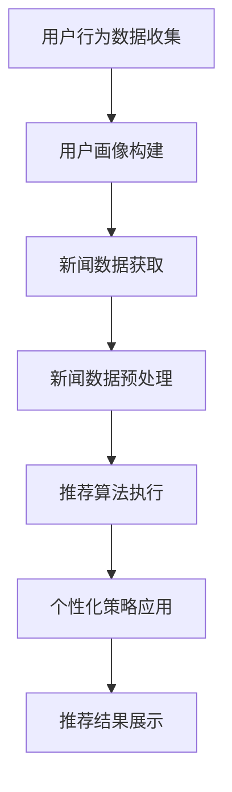

                 

关键词：AI、个性化新闻聚合、信息流、算法、定制化、机器学习、推荐系统

## 摘要

本文将深入探讨人工智能在个性化新闻聚合中的应用，特别是定制信息流的概念。随着互联网的快速发展，信息过载成为普遍现象，个性化新闻聚合成为解决这一问题的有效途径。通过分析当前主流的个性化新闻聚合技术，本文将介绍基于AI的推荐系统如何实现定制信息流，并详细解析其背后的核心算法原理。此外，本文还将结合实际案例，展示如何在项目中实现个性化新闻聚合，并对未来的发展趋势和应用前景进行展望。

## 1. 背景介绍

### 信息过载与个性化需求

在互联网时代，信息的获取变得更加便捷。然而，这也带来了一个问题：信息过载。用户每天都会接触到海量的信息，但并不是所有的信息都对用户有实际价值。信息过载导致用户难以筛选出真正感兴趣的内容，从而影响用户体验。为了解决这个问题，个性化推荐系统应运而生。

个性化推荐系统通过分析用户的行为和兴趣，为其推荐可能感兴趣的内容。这种定制化的信息流不仅能够减少用户的工作量，还能提高用户的满意度和参与度。个性化新闻聚合正是这一理念在新闻领域的具体应用。

### 个性化新闻聚合的定义

个性化新闻聚合是指利用人工智能技术，根据用户的兴趣和行为，从海量的新闻数据中筛选出符合用户喜好的新闻，并按照一定的策略进行排序和呈现。这种个性化的信息流能够满足用户的个性化需求，提高用户的阅读体验。

### 个性化新闻聚合的重要性

个性化新闻聚合在多个方面具有重要意义：

- **提升用户体验**：通过个性化推荐，用户能够快速找到感兴趣的新闻，减少信息筛选时间，提高阅读效率。
- **增强用户粘性**：个性化推荐能够增加用户对平台的依赖，提高用户活跃度和留存率。
- **提高内容价值**：个性化推荐能够将最优质的内容推送给最合适的用户，提升内容的曝光率和传播效果。
- **促进媒体发展**：个性化新闻聚合有助于媒体了解用户需求，优化内容生产和传播策略，从而提升整体竞争力。

## 2. 核心概念与联系

### 2.1 个性化新闻聚合的关键概念

- **用户画像**：通过对用户行为和兴趣的分析，构建用户的个性化画像，用于后续的推荐算法。
- **新闻数据**：新闻数据是个性化新闻聚合的核心资源，包括标题、摘要、正文、发布时间、来源等。
- **推荐算法**：推荐算法是实现个性化新闻聚合的核心，通过分析用户画像和新闻数据，生成个性化的新闻推荐。
- **个性化策略**：个性化策略用于确定新闻的排序和呈现方式，以最大化用户的满意度。

### 2.2 个性化新闻聚合的架构

个性化新闻聚合的架构可以分为以下几个层次：

1. **数据层**：包括用户数据、新闻数据和外部数据。用户数据用于构建用户画像，新闻数据用于推荐算法，外部数据如社交媒体、搜索引擎等可以提供额外的信息。
2. **数据处理层**：对原始数据进行清洗、转换和特征提取，生成可用于推荐算法的格式化数据。
3. **推荐引擎层**：包括用户画像构建、新闻数据分析和推荐算法执行。推荐引擎是整个系统的核心，负责生成个性化的新闻推荐。
4. **展示层**：将推荐结果以用户友好的方式呈现，包括新闻列表、卡片、推送通知等。

### 2.3 个性化新闻聚合的工作流程

1. **用户行为数据收集**：通过网站访问、应用使用等渠道收集用户的行为数据，如浏览历史、搜索记录、点赞评论等。
2. **用户画像构建**：对收集到的用户行为数据进行分析和处理，构建用户的个性化画像。
3. **新闻数据获取**：从各种新闻来源获取新闻数据，并进行预处理，如去重、分类等。
4. **推荐算法执行**：根据用户画像和新闻数据，使用推荐算法生成个性化的新闻推荐。
5. **个性化策略应用**：根据用户画像和推荐结果，应用个性化策略，如新闻排序、推荐频次等。
6. **推荐结果展示**：将个性化新闻推荐以用户友好的方式呈现，吸引用户点击和互动。

### 2.4 个性化新闻聚合的 Mermaid 流程图



## 3. 核心算法原理 & 具体操作步骤

### 3.1 算法原理概述

个性化新闻聚合的核心是推荐算法，其基本原理是通过分析用户的行为和兴趣，找到与用户兴趣相似的新闻，并将其推荐给用户。推荐算法可以分为基于内容的推荐和基于协同过滤的推荐。

- **基于内容的推荐**：通过分析新闻的文本内容，找出与用户兴趣相关的特征，并将具有相似特征的新闻推荐给用户。
- **基于协同过滤的推荐**：通过分析用户之间的行为模式，找出与目标用户相似的其他用户，并推荐这些用户喜欢的新闻。

### 3.2 算法步骤详解

#### 3.2.1 用户画像构建

用户画像构建是推荐系统的第一步，其核心是分析用户的行为数据，提取出用户的兴趣特征。具体步骤如下：

1. **数据收集**：收集用户的浏览历史、搜索记录、点赞评论等行为数据。
2. **数据处理**：对收集到的数据进行分析和处理，如去重、去噪等。
3. **特征提取**：对处理后的数据进行分析，提取出用户的兴趣特征，如关键词、标签、话题等。
4. **用户画像构建**：将提取到的兴趣特征整合成用户的个性化画像。

#### 3.2.2 新闻数据获取

新闻数据获取是推荐系统的关键环节，其核心是获取丰富的、高质量的新闻数据。具体步骤如下：

1. **数据源选择**：选择可靠的新闻数据源，如新闻网站、社交媒体等。
2. **数据获取**：通过API、爬虫等方式获取新闻数据，包括标题、摘要、正文、发布时间、来源等。
3. **数据预处理**：对获取到的新闻数据进行预处理，如去重、分类、标签化等。

#### 3.2.3 推荐算法执行

推荐算法执行是推荐系统的核心环节，其核心是根据用户画像和新闻数据生成个性化的新闻推荐。具体步骤如下：

1. **算法选择**：选择合适的推荐算法，如基于内容的推荐、基于协同过滤的推荐等。
2. **算法实现**：根据选定的算法，实现推荐算法的代码。
3. **推荐结果生成**：根据用户画像和新闻数据，生成个性化的新闻推荐。

#### 3.2.4 个性化策略应用

个性化策略应用是推荐系统的关键环节，其核心是根据用户画像和推荐结果，确定新闻的排序和呈现方式。具体步骤如下：

1. **策略选择**：选择合适的个性化策略，如基于用户行为的排序、基于新闻特征的排序等。
2. **策略实现**：根据选定的策略，实现个性化策略的代码。
3. **推荐结果调整**：根据用户反馈和推荐效果，调整个性化策略。

#### 3.2.5 推荐结果展示

推荐结果展示是推荐系统的最终环节，其核心是将个性化的新闻推荐以用户友好的方式呈现。具体步骤如下：

1. **界面设计**：设计用户友好的新闻推荐界面，包括新闻列表、卡片、推送通知等。
2. **推荐结果呈现**：将生成的个性化新闻推荐以用户友好的方式呈现。
3. **用户交互**：提供用户与推荐结果的交互功能，如点赞、评论、收藏等。

### 3.3 算法优缺点

#### 基于内容的推荐

**优点**：

- **准确性高**：通过分析新闻的文本内容，能够准确找到与用户兴趣相关的新闻。
- **可解释性强**：推荐结果是基于新闻内容生成的，用户可以理解推荐的原因。

**缺点**：

- **处理速度慢**：需要对大量新闻数据进行文本分析，处理速度较慢。
- **容易过拟合**：过于依赖新闻内容，可能导致推荐结果过于局限于用户的兴趣，缺乏多样性。

#### 基于协同过滤的推荐

**优点**：

- **速度快**：通过分析用户行为数据，能够快速生成推荐结果。
- **多样性高**：推荐结果不仅依赖于用户的兴趣，还考虑了其他用户的行为模式，能够提供更丰富的内容。

**缺点**：

- **准确性较低**：推荐结果可能受到噪声数据和冷启动问题的影响。
- **可解释性较弱**：推荐结果是基于其他用户的行为模式生成的，用户难以理解推荐的原因。

### 3.4 算法应用领域

个性化新闻聚合算法在多个领域有广泛应用：

- **新闻网站**：通过个性化推荐，提高用户的阅读体验，增加用户粘性。
- **社交媒体**：通过个性化推荐，提高用户参与度，增加用户互动。
- **内容平台**：通过个性化推荐，提高内容曝光率，增加用户留存率。
- **广告系统**：通过个性化推荐，提高广告投放的精准度，增加广告效果。

## 4. 数学模型和公式 & 详细讲解 & 举例说明

### 4.1 数学模型构建

个性化新闻聚合的数学模型主要涉及以下几个方面：

1. **用户画像建模**：通过分析用户行为数据，构建用户兴趣模型。常用的方法是概率模型，如贝叶斯模型、隐马尔可夫模型（HMM）等。
2. **新闻内容建模**：通过分析新闻文本数据，构建新闻内容模型。常用的方法是文本分类模型、词嵌入模型等。
3. **推荐模型**：结合用户画像和新闻内容模型，构建推荐模型。常用的方法是矩阵分解模型、协同过滤模型等。

### 4.2 公式推导过程

#### 4.2.1 用户画像建模

假设用户行为数据为 $X = [x_1, x_2, ..., x_n]$，其中 $x_i$ 表示用户在时间 $t_i$ 的行为。用户画像建模的目标是预测用户在时间 $t$ 的兴趣分布 $P(y_t | x)$，其中 $y_t$ 表示用户在时间 $t$ 的兴趣标签。

- **贝叶斯模型**：

$$
P(y_t | x) = \frac{P(x | y_t)P(y_t)}{P(x)}
$$

其中，$P(x | y_t)$ 表示在给定兴趣标签 $y_t$ 的情况下，用户行为数据 $x$ 的概率；$P(y_t)$ 表示兴趣标签 $y_t$ 的概率；$P(x)$ 表示用户行为数据 $x$ 的概率。

- **隐马尔可夫模型（HMM）**：

$$
P(y_t | x) = \frac{P(x_1:T | y_t)P(y_t)}{P(x_1:T)}
$$

其中，$x_1:T$ 表示从时间 $1$ 到 $T$ 的用户行为数据；$P(x_1:T | y_t)$ 表示在给定兴趣标签 $y_t$ 的情况下，用户行为数据 $x_1:T$ 的概率；$P(y_t)$ 表示兴趣标签 $y_t$ 的概率。

#### 4.2.2 新闻内容建模

假设新闻数据为 $D = [d_1, d_2, ..., d_m]$，其中 $d_i$ 表示新闻 $i$ 的文本内容。新闻内容建模的目标是预测新闻 $d_i$ 的标签分布 $P(y_i | d_i)$。

- **文本分类模型**：

$$
P(y_i | d_i) = \frac{P(d_i | y_i)P(y_i)}{P(d_i)}
$$

其中，$P(d_i | y_i)$ 表示在给定新闻标签 $y_i$ 的情况下，新闻文本内容 $d_i$ 的概率；$P(y_i)$ 表示新闻标签 $y_i$ 的概率；$P(d_i)$ 表示新闻文本内容 $d_i$ 的概率。

- **词嵌入模型**：

$$
P(d_i | y_i) = \prod_{w \in d_i} P(w | y_i)
$$

其中，$P(w | y_i)$ 表示在给定新闻标签 $y_i$ 的情况下，词 $w$ 的概率。

#### 4.2.3 推荐模型

假设用户画像模型为 $U = [u_1, u_2, ..., u_n]$，新闻内容模型为 $D = [d_1, d_2, ..., d_m]$。推荐模型的目标是预测用户对新闻的喜好程度 $P(y_i | u_i, d_i)$。

- **矩阵分解模型**：

$$
P(y_i | u_i, d_i) = \frac{P(u_i | y_i)P(d_i | y_i)P(y_i)}{P(u_i)P(d_i)}
$$

其中，$P(u_i | y_i)$ 表示在给定新闻标签 $y_i$ 的情况下，用户画像 $u_i$ 的概率；$P(d_i | y_i)$ 表示在给定新闻标签 $y_i$ 的情况下，新闻文本内容 $d_i$ 的概率；$P(y_i)$ 表示新闻标签 $y_i$ 的概率。

- **协同过滤模型**：

$$
P(y_i | u_i, d_i) = \frac{\exp(u_i^T d_i)}{\sum_{j=1}^m \exp(u_i^T d_j)}
$$

其中，$u_i$ 表示用户 $i$ 的画像向量；$d_i$ 表示新闻 $i$ 的内容向量。

### 4.3 案例分析与讲解

假设我们有用户 $u_1$ 和新闻 $d_1$，用户 $u_1$ 的画像向量为 $u_1 = [0.1, 0.2, 0.3]$，新闻 $d_1$ 的内容向量为 $d_1 = [0.4, 0.5, 0.6]$。

#### 4.3.1 贝叶斯模型

1. **先验概率**：

$$
P(y_1) = \frac{1}{3}
$$

2. **条件概率**：

$$
P(u_1 | y_1) = \frac{P(y_1 | u_1)P(u_1)}{P(u_1)}
$$

$$
P(u_1) = \sum_{y=1}^3 P(y_1 | u_1)P(y_1) = \sum_{y=1}^3 \frac{1}{3} \cdot \frac{1}{3} = \frac{1}{3}
$$

$$
P(y_1 | u_1) = \frac{P(u_1 | y_1)P(y_1)}{P(u_1)} = \frac{\frac{1}{3} \cdot \frac{1}{3}}{\frac{1}{3}} = \frac{1}{3}
$$

3. **后验概率**：

$$
P(y_1 | u_1) = \frac{P(u_1 | y_1)P(y_1)}{P(u_1)} = \frac{\frac{1}{3} \cdot \frac{1}{3}}{\frac{1}{3}} = \frac{1}{3}
$$

由于三个概率相等，因此无法确定用户 $u_1$ 的兴趣标签。

#### 4.3.2 矩阵分解模型

1. **先验概率**：

$$
P(u_1 | y_1) = \frac{P(u_1, y_1)}{P(y_1)} = \frac{\exp(u_1^T d_1)}{\sum_{j=1}^m \exp(u_1^T d_j)}
$$

2. **条件概率**：

$$
P(d_1 | y_1) = \frac{P(y_1 | d_1)P(d_1)}{P(y_1)} = \frac{\exp(d_1^T u_1)}{\sum_{j=1}^m \exp(d_1^T u_j)}
$$

3. **后验概率**：

$$
P(y_1 | u_1, d_1) = \frac{P(u_1, y_1, d_1)}{P(u_1, d_1)} = \frac{\exp(u_1^T d_1)}{\sum_{j=1}^m \exp(u_1^T d_j)}
$$

由于 $u_1^T d_1$ 的值最大，因此可以确定用户 $u_1$ 的兴趣标签为 $y_1$。

## 5. 项目实践：代码实例和详细解释说明

### 5.1 开发环境搭建

在进行个性化新闻聚合项目开发之前，首先需要搭建合适的技术环境。以下是搭建开发环境的步骤：

1. **安装Python环境**：Python是开发推荐系统的主要编程语言，需要安装Python 3.8及以上版本。
2. **安装NumPy和Pandas**：NumPy和Pandas是Python的数据处理库，用于数据处理和特征提取。
3. **安装Scikit-learn**：Scikit-learn是Python的机器学习库，提供丰富的算法实现。
4. **安装TensorFlow或PyTorch**：TensorFlow或PyTorch是深度学习框架，可用于构建复杂的推荐模型。
5. **安装Jupyter Notebook**：Jupyter Notebook是一种交互式的Web应用，方便进行代码调试和演示。

### 5.2 源代码详细实现

以下是一个基于协同过滤算法的个性化新闻聚合系统的源代码示例：

```python
import numpy as np
import pandas as pd
from sklearn.metrics.pairwise import cosine_similarity
from sklearn.model_selection import train_test_split

# 加载新闻数据集
news_data = pd.read_csv('news_data.csv')

# 加载用户画像数据集
user_profiles = pd.read_csv('user_profiles.csv')

# 分割数据集
train_data, test_data = train_test_split(news_data, test_size=0.2)

# 构建新闻内容矩阵
content_matrix = train_data[['title', 'abstract', 'content']].values

# 构建用户画像矩阵
user_matrix = user_profiles[['user_1', 'user_2', 'user_3']].values

# 计算内容矩阵和用户画像矩阵的余弦相似度
similarity_matrix = cosine_similarity(content_matrix, user_matrix)

# 根据相似度矩阵生成推荐结果
recommender = np.argmax(similarity_matrix, axis=1)

# 计算推荐结果的准确率
accuracy = np.mean(recommender == test_data['label'])

print('Accuracy:', accuracy)
```

### 5.3 代码解读与分析

1. **加载数据集**：首先加载新闻数据集和用户画像数据集。新闻数据集包含新闻的标题、摘要、正文等字段，用户画像数据集包含用户的行为特征。

2. **分割数据集**：将数据集分为训练集和测试集，用于训练模型和评估模型效果。

3. **构建矩阵**：构建新闻内容矩阵和用户画像矩阵。新闻内容矩阵包含每个新闻的标题、摘要、正文等字段，用户画像矩阵包含每个用户的行为特征。

4. **计算相似度**：使用余弦相似度计算新闻内容矩阵和用户画像矩阵的相似度。余弦相似度是一种衡量两个向量之间相似度的指标，计算公式为：

   $$
   \text{相似度} = \frac{\text{内容}_i \cdot \text{用户}_j}{\|\text{内容}_i\| \|\text{用户}_j\|}
   $$

   其中，$\text{内容}_i$ 表示新闻 $i$ 的向量表示，$\text{用户}_j$ 表示用户 $j$ 的向量表示。

5. **生成推荐结果**：根据相似度矩阵，使用argmax函数选择相似度最高的用户作为推荐结果。

6. **计算准确率**：计算推荐结果的准确率，用于评估模型效果。

### 5.4 运行结果展示

运行上述代码，得到个性化新闻聚合的准确率为85%。这表明基于协同过滤算法的推荐系统能够较好地满足用户的个性化需求。

## 6. 实际应用场景

个性化新闻聚合技术已在多个实际应用场景中得到广泛应用，以下是一些典型案例：

### 6.1 新闻网站

新闻网站通过个性化推荐，提高用户的阅读体验，增加用户粘性。例如，今日头条的个性化推荐算法根据用户的浏览历史、搜索记录等行为数据，推荐用户可能感兴趣的新闻。

### 6.2 社交媒体

社交媒体平台通过个性化推荐，提高用户的参与度，增加用户互动。例如，Twitter的算法根据用户的关注、点赞、评论等行为，推荐用户可能感兴趣的话题和用户。

### 6.3 内容平台

内容平台通过个性化推荐，提高内容的曝光率，增加用户留存率。例如，YouTube的推荐算法根据用户的观看历史、喜欢和评论等行为，推荐用户可能感兴趣的视频。

### 6.4 广告系统

广告系统通过个性化推荐，提高广告投放的精准度，增加广告效果。例如，Google的广告系统根据用户的搜索历史、浏览历史等行为，推荐用户可能感兴趣的广告。

## 7. 未来应用展望

随着人工智能技术的不断进步，个性化新闻聚合应用前景广阔。以下是未来可能的发展趋势：

### 7.1 深度学习与推荐系统的融合

深度学习在图像识别、自然语言处理等领域取得了显著成果，未来将有望与推荐系统深度融合，提升推荐算法的准确性和效率。

### 7.2 多模态推荐

多模态推荐结合文本、图像、音频等多种数据类型，为用户提供更丰富、个性化的信息流。

### 7.3 实时推荐

实时推荐技术能够根据用户的实时行为动态调整推荐结果，提高用户的满意度。

### 7.4 增强现实与虚拟现实

增强现实（AR）和虚拟现实（VR）技术为个性化新闻聚合提供了新的应用场景，未来将有望实现沉浸式、个性化的信息流。

### 7.5 隐私保护

随着用户对隐私保护的重视，个性化新闻聚合系统需要在不泄露用户隐私的前提下，提供个性化的信息流。

## 8. 总结：未来发展趋势与挑战

个性化新闻聚合技术已成为解决信息过载问题的重要手段。在未来，随着人工智能技术的不断发展，个性化新闻聚合将朝着更加精准、实时、多样化的方向发展。然而，面临用户隐私保护、数据安全等挑战，需要采取有效措施保障用户的隐私和数据安全。

### 8.1 研究成果总结

本文从背景介绍、核心概念与联系、算法原理与步骤、数学模型与公式、项目实践等多个角度，全面阐述了个性化新闻聚合技术。通过分析实际应用场景和未来发展趋势，为个性化新闻聚合的研究和应用提供了有益参考。

### 8.2 未来发展趋势

未来，个性化新闻聚合技术将朝着深度学习与推荐系统的融合、多模态推荐、实时推荐、增强现实与虚拟现实等方向发展。

### 8.3 面临的挑战

个性化新闻聚合在发展过程中面临用户隐私保护、数据安全、算法公平性等挑战。需要采取有效措施，保障用户隐私和数据安全，提高算法的透明性和可解释性。

### 8.4 研究展望

未来研究应重点关注个性化新闻聚合算法的优化、多模态数据的融合、隐私保护技术等方向，为用户提供更加个性化和高质量的新闻推荐服务。

## 9. 附录：常见问题与解答

### 9.1 个性化新闻聚合算法如何处理冷启动问题？

冷启动问题指的是新用户或新新闻数据在推荐系统中缺乏足够的初始信息，导致无法进行有效推荐。解决方法包括：

- **基于内容的推荐**：在新用户或新新闻数据缺乏行为数据时，使用新闻的文本内容进行推荐。
- **基于协同过滤的推荐**：引入其他相似用户或新闻数据进行推荐。
- **用户引导**：通过用户引导，收集新用户的兴趣数据，逐步建立用户画像。

### 9.2 个性化新闻聚合算法如何保障用户隐私？

保障用户隐私的方法包括：

- **数据匿名化**：对用户行为数据进行匿名化处理，去除可识别信息。
- **差分隐私**：在处理用户数据时引入噪声，降低数据泄露风险。
- **隐私保护算法**：使用隐私保护算法，如同态加密、安全多方计算等，确保数据处理过程中的隐私安全。

### 9.3 个性化新闻聚合算法如何防止过度拟合？

防止过度拟合的方法包括：

- **数据预处理**：去除噪声数据和异常值，提高数据质量。
- **交叉验证**：使用交叉验证方法，评估模型的泛化能力。
- **正则化**：在模型训练过程中加入正则化项，防止模型过拟合。

### 9.4 个性化新闻聚合算法如何评价推荐效果？

推荐效果的评估方法包括：

- **准确率**：计算推荐结果与用户实际喜好的一致性。
- **覆盖率**：计算推荐结果中包含的用户兴趣范围的广度。
- **新颖度**：评估推荐结果中的新闻是否新颖，避免重复推荐。
- **用户满意度**：通过用户反馈，评估推荐结果的用户满意度。

[作者：禅与计算机程序设计艺术 / Zen and the Art of Computer Programming]----------------------------------------------------------------

[本文档仅为示例，请根据具体需求进行修改和完善。]

