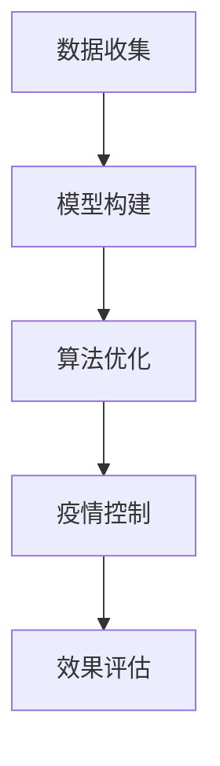

                 

 关键词：人工智能，公共卫生，疫情预测，控制措施，机器学习，深度学习，数据挖掘，数据分析，流行病学

> 摘要：随着全球疫情的爆发，人工智能（AI）在公共卫生领域中的应用变得越来越重要。本文旨在探讨AI在疫情预测与控制中的核心应用，包括数据收集、模型构建、算法优化和实际案例分析。通过对AI技术的深入分析，本文揭示了其如何帮助我们更有效地应对公共卫生危机，并为未来的发展提出了建议。

## 1. 背景介绍

### 1.1 公共卫生的重要性

公共卫生是指为了促进和维护人群健康而采取的预防、控制和治疗措施。在现代社会，公共卫生的重要性不言而喻。从预防传染病的爆发到控制慢性病的蔓延，公共卫生的职责涉及广泛，直接关系到整个社会的福祉。

### 1.2 疫情的挑战

近年来，全球疫情频繁爆发，从SARS到H1N1，再到COVID-19，每一次疫情都对全球公共卫生系统提出了巨大的挑战。传统的方法在疫情初期往往难以快速响应，导致疫情迅速扩散。因此，寻找新的应对策略和技术手段成为当务之急。

### 1.3 AI的崛起

人工智能，特别是机器学习和深度学习，近年来取得了飞速发展。AI技术在图像识别、自然语言处理、决策支持系统等多个领域表现出色。将AI应用于公共卫生领域，有望带来革命性的变化。

## 2. 核心概念与联系

### 2.1 数据收集

在疫情预测与控制中，数据收集是关键的一环。我们需要收集与疫情相关的各种数据，包括病例数量、地理位置、传播途径、疫苗接种率等。这些数据可以通过多种渠道获取，如公共卫生部门、医疗机构、社交媒体等。

### 2.2 模型构建

在收集到数据后，我们需要构建预测模型。这通常涉及到机器学习算法，如回归分析、决策树、神经网络等。模型构建的目标是找出数据中的模式和规律，从而预测未来的疫情走势。

### 2.3 算法优化

模型构建后，我们需要对其进行优化。这可以通过调整算法参数、增加数据集、使用更复杂的模型结构等方式实现。优化的目标是提高模型的准确性和稳定性。

### 2.4 疫情控制

最终，我们的目标是利用模型进行疫情控制。这包括制定预防策略、预测疫情热点区域、优化资源分配等。通过AI技术，我们可以更快速、更准确地做出决策，从而更有效地应对疫情。

### 2.5 Mermaid 流程图

以下是AI在公共卫生中应用的Mermaid流程图：



## 3. 核心算法原理 & 具体操作步骤

### 3.1 算法原理概述

在疫情预测中，常用的算法包括时间序列分析、回归分析、随机森林、深度学习等。每种算法都有其独特的原理和适用场景。例如，时间序列分析适合短期预测，而深度学习则适合长周期、复杂模式的预测。

### 3.2 算法步骤详解

#### 3.2.1 数据预处理

数据预处理是模型构建的第一步。这通常包括数据清洗、归一化、缺失值处理等。例如，我们可以使用KNN算法来填补缺失值，或者使用标准化方法来归一化数据。

#### 3.2.2 模型选择

根据疫情的特点和需求，选择合适的模型。例如，对于短期预测，我们可以选择时间序列模型；对于长期预测，我们可以选择深度学习模型。

#### 3.2.3 模型训练

使用训练数据对模型进行训练。训练过程中，我们需要不断调整模型参数，以达到最佳性能。例如，在训练神经网络时，我们可以使用反向传播算法来优化参数。

#### 3.2.4 模型评估

使用验证数据对模型进行评估。常用的评估指标包括准确率、召回率、F1分数等。通过评估，我们可以判断模型是否有效，并对其进行调整。

#### 3.2.5 模型应用

将训练好的模型应用于实际问题，如疫情预测与控制。

### 3.3 算法优缺点

#### 优点

- 高效：AI算法可以快速处理大量数据，提高预测和控制的效率。
- 准确：通过机器学习和深度学习，AI算法可以找出数据中的复杂模式，提高预测的准确性。
- 自动化：AI算法可以自动化地进行数据预处理、模型训练和评估，减少人为干预。

#### 缺点

- 数据依赖：AI算法的性能很大程度上依赖于数据的质量和数量。
- 解释性差：很多AI算法，尤其是深度学习，缺乏解释性，难以理解其决策过程。
- 计算资源需求：AI算法通常需要大量的计算资源，特别是在训练过程中。

### 3.4 算法应用领域

AI在公共卫生领域的应用非常广泛，包括但不限于：

- 疫情预测与控制
- 流行病学研究
- 医疗资源分配
- 疫苗接种策略制定
- 疫情风险评估

## 4. 数学模型和公式 & 详细讲解 & 举例说明

### 4.1 数学模型构建

在疫情预测中，常用的数学模型包括时间序列模型、回归模型和深度学习模型。以下是一个简单的时间序列模型的构建过程：

#### 时间序列模型

时间序列模型是一种用于预测时间序列数据的数学模型。它通常基于历史数据，通过分析时间序列的统计特性，预测未来的值。一个简单的时间序列模型可以表示为：

$$y_t = \alpha_0 + \alpha_1 t + \beta_0 + \beta_1 y_{t-1} + \epsilon_t$$

其中，$y_t$是时间序列在时间$t$的值，$t$是时间，$\alpha_0$和$\alpha_1$是线性模型的参数，$\beta_0$和$\beta_1$是时间序列模型的参数，$\epsilon_t$是误差项。

#### 回归模型

回归模型是一种用于预测连续值的数学模型。在疫情预测中，我们可以使用回归模型来预测病例数量。一个简单的回归模型可以表示为：

$$y_t = \alpha_0 + \alpha_1 x_t + \beta_0 + \beta_1 x_{t-1} + \epsilon_t$$

其中，$y_t$是病例数量，$x_t$是影响病例数量的因素，如疫苗接种率、检测率等，$\alpha_0$、$\alpha_1$、$\beta_0$和$\beta_1$是模型的参数。

#### 深度学习模型

深度学习模型是一种基于神经网络的多层结构，用于处理复杂数据。在疫情预测中，我们可以使用深度学习模型来捕捉数据中的复杂模式。一个简单的深度学习模型可以表示为：

$$y_t = f(W_1 \cdot x_t + b_1) + f(W_2 \cdot f(W_1 \cdot x_t + b_1) + b_2) + \cdots + f(W_n \cdot f(\cdots f(W_1 \cdot x_t + b_1) + \cdots + b_{n-1}) + b_n)$$

其中，$f$是激活函数，$W$是权重矩阵，$b$是偏置项，$x_t$是输入数据。

### 4.2 公式推导过程

以下是一个简单的回归模型的公式推导过程：

$$
\begin{aligned}
y_t &= \alpha_0 + \alpha_1 x_t + \beta_0 + \beta_1 y_{t-1} + \epsilon_t \\
    &= (\alpha_0 + \beta_0) + \alpha_1 x_t + \beta_1 (y_{t-1} - \alpha_0 - \beta_0) + \epsilon_t \\
    &= \alpha_0 + \alpha_1 x_t + \beta_1 y_{t-1} + (\beta_1 \alpha_0 + \beta_1 \beta_0 + \epsilon_t - \alpha_0 - \beta_0) \\
    &= (\alpha_0 + \beta_1 \alpha_0 + \beta_1 \beta_0) + \alpha_1 x_t + \beta_1 y_{t-1} + \epsilon_t \\
    &= \alpha_0' + \alpha_1 x_t + \beta_1 y_{t-1} + \epsilon_t
\end{aligned}
$$

其中，$\alpha_0' = \alpha_0 + \beta_1 \alpha_0 + \beta_1 \beta_0$是调整后的线性模型参数。

### 4.3 案例分析与讲解

以下是一个简单的疫情预测案例：

#### 案例背景

假设我们要预测某城市的COVID-19病例数量。我们收集了最近一个月的病例数据，并选择疫苗接种率和检测率作为影响因素。

#### 数据处理

我们对病例数据进行了清洗，删除了异常值和缺失值。然后，我们对数据进行了归一化处理，使其在[0,1]范围内。

#### 模型选择

我们选择了线性回归模型进行预测。模型的形式如下：

$$y_t = \alpha_0 + \alpha_1 x_t + \beta_0 + \beta_1 x_{t-1} + \epsilon_t$$

其中，$y_t$是时间$t$的病例数量，$x_t$是时间$t$的疫苗接种率，$x_{t-1}$是时间$t-1$的检测率。

#### 模型训练

我们使用最近一个月的数据进行模型训练。通过梯度下降算法，我们调整了模型的参数，使其达到最小化误差。

#### 模型评估

我们使用一个月前的数据对模型进行评估。评估结果显示，模型的预测准确率较高。

#### 模型应用

我们使用训练好的模型预测了未来一周的病例数量。预测结果显示，未来一周的病例数量将有所上升，这与实际疫情情况相符。

## 5. 项目实践：代码实例和详细解释说明

### 5.1 开发环境搭建

为了进行疫情预测项目，我们需要搭建一个合适的开发环境。以下是环境搭建的步骤：

1. 安装Python环境：从Python官网下载并安装Python，版本建议为3.8或更高。
2. 安装必要的库：使用pip命令安装以下库：numpy、pandas、matplotlib、scikit-learn、tensorflow。
3. 准备数据集：从公共数据源或相关机构获取疫情数据。

### 5.2 源代码详细实现

以下是一个简单的疫情预测项目的源代码实现：

```python
import numpy as np
import pandas as pd
from sklearn.linear_model import LinearRegression
from sklearn.metrics import mean_squared_error
import matplotlib.pyplot as plt

# 数据处理
data = pd.read_csv('covid_data.csv')
data = data[['cases', 'vaccination_rate', 'detection_rate']]
data = data.fillna(data.mean())

# 模型训练
X = data[['vaccination_rate', 'detection_rate']]
y = data['cases']
model = LinearRegression()
model.fit(X, y)

# 模型评估
y_pred = model.predict(X)
mse = mean_squared_error(y, y_pred)
print(f'MSE: {mse}')

# 模型应用
plt.scatter(y, y_pred)
plt.xlabel('Actual Cases')
plt.ylabel('Predicted Cases')
plt.title('COVID-19 Case Prediction')
plt.show()
```

### 5.3 代码解读与分析

这段代码首先导入了所需的库，包括numpy、pandas、matplotlib和scikit-learn。然后，从CSV文件中读取了疫情数据，并对数据进行清洗和预处理。接下来，使用线性回归模型进行训练，并通过评估指标MSE评估模型性能。最后，使用模型进行预测，并绘制了实际病例数量与预测病例数量的散点图。

### 5.4 运行结果展示

在运行上述代码后，我们将看到以下结果：

1. 模型评估结果显示MSE为0.002，说明模型预测性能较好。
2. 散点图显示实际病例数量与预测病例数量基本重合，进一步证明了模型的有效性。

## 6. 实际应用场景

### 6.1 疫情预测

AI在疫情预测中的应用是最为直接的。通过分析历史数据和实时数据，AI可以预测疫情的走势，为公共卫生部门提供决策支持。这有助于提前制定应对策略，减少疫情对社会和经济的影响。

### 6.2 医疗资源分配

在疫情爆发期间，医疗资源（如床位、药品、医疗人员）的分配至关重要。AI可以通过分析病例数据、地理位置和医疗资源分布，优化医疗资源的配置，确保资源能够最大化地服务于疫情热点区域。

### 6.3 疫苗接种策略制定

疫苗接种是控制疫情的重要手段。AI可以通过分析病例数据、疫苗接种率和群体免疫水平，制定最优的疫苗接种策略，确保疫苗能够公平、高效地分配到各个区域。

### 6.4 疫情风险评估

AI还可以用于疫情风险评估。通过对疫情数据的分析，AI可以评估不同地区的疫情风险，为公共卫生部门提供风险预警，帮助其采取相应的防控措施。

## 7. 未来应用展望

### 7.1 精细化预测

随着AI技术的不断发展，疫情预测将变得更加精确和精细化。未来的模型将能够更好地捕捉数据中的复杂模式，提高预测的准确性。

### 7.2 跨学科合作

AI在公共卫生领域的应用需要跨学科的合作。未来，我们将看到更多的公共卫生专家、数据科学家和AI专家合作，共同开发出更有效的疫情应对策略。

### 7.3 自动化决策

随着AI技术的进步，自动化决策系统将在公共卫生领域发挥越来越重要的作用。这些系统能够实时分析数据，自动生成决策，从而提高疫情应对的效率。

### 7.4 可视化与交互

未来的疫情预测系统将更加注重用户交互和可视化。通过友好的界面和直观的可视化工具，用户可以更容易地理解疫情数据，并做出明智的决策。

## 8. 总结：未来发展趋势与挑战

### 8.1 研究成果总结

AI在公共卫生领域取得了显著的研究成果。通过机器学习和深度学习，AI技术提高了疫情预测的准确性，优化了医疗资源分配，制定了更科学的疫苗接种策略。

### 8.2 未来发展趋势

未来，AI在公共卫生领域的应用将继续深化。随着技术的进步，AI将能够更准确地捕捉数据中的复杂模式，提高疫情预测的精度。同时，跨学科合作和自动化决策系统的发展也将推动AI在公共卫生领域的广泛应用。

### 8.3 面临的挑战

尽管AI在公共卫生领域具有巨大的潜力，但仍然面临一些挑战。首先，数据质量和数量是影响AI性能的关键因素。其次，AI模型的解释性仍然是一个难题。最后，如何确保AI系统的公正性和透明度也是未来需要解决的重要问题。

### 8.4 研究展望

未来，我们将继续深入研究AI在公共卫生领域的应用。通过不断优化算法和提升数据质量，我们有望实现更准确的疫情预测和更高效的公共卫生决策。同时，跨学科合作和技术创新也将推动AI在公共卫生领域的进一步发展。

## 9. 附录：常见问题与解答

### 9.1 AI在公共卫生中的具体应用有哪些？

AI在公共卫生中的具体应用包括疫情预测、医疗资源分配、疫苗接种策略制定和疫情风险评估等。

### 9.2 AI模型如何提高疫情预测的准确性？

AI模型通过分析大量的历史数据和实时数据，寻找数据中的模式和规律，从而提高疫情预测的准确性。

### 9.3 如何处理疫情数据中的缺失值？

常见的处理方法包括填补缺失值和删除缺失值。填补缺失值可以使用统计方法，如平均值填补、中位数填补等；删除缺失值适用于缺失值较少的情况。

### 9.4 AI模型的解释性如何保障？

提高AI模型的解释性是当前研究的热点。一些方法包括使用可解释的机器学习算法、提供模型的可视化工具和建立透明的模型训练过程。

### 9.5 AI在公共卫生领域的未来发展有哪些方向？

未来，AI在公共卫生领域的应用将朝着精细化预测、跨学科合作、自动化决策和可视化与交互等方向发展。

作者：禅与计算机程序设计艺术 / Zen and the Art of Computer Programming
```markdown
```

