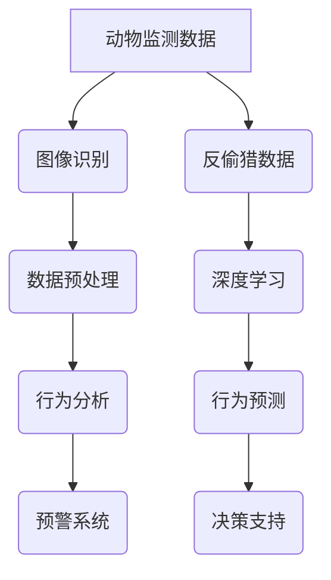

                 

关键词：人工智能，动物保护，监测，反偷猎，深度学习，图像识别，物联网，数据挖掘

> 摘要：本文详细探讨了人工智能技术在动物保护中的应用，特别是监测和反偷猎方面的技术。通过对现有研究与实践的分析，揭示了AI技术如何助力动物保护，提高了监测效率和反偷猎效果，并提出了未来发展的方向和挑战。

## 1. 背景介绍

### 动物保护的重要性

动物保护是一个全球性的问题，它关乎生态平衡、生物多样性和人类自身的福祉。随着人类活动的加剧，野生动物栖息地不断缩小，物种灭绝速度加快，生态系统受到严重威胁。保护动物不仅是为了维护生物多样性，更是为了人类自身的长远利益。动物保护已经成为全球关注的焦点，各国政府和环保组织都在积极采取措施，以保护野生动物和它们的栖息地。

### 监测与反偷猎的挑战

动物保护的两大关键任务是监测和反偷猎。监测野生动物的种群数量、栖息地状况和行为模式，有助于及时发现问题，制定有效的保护措施。而反偷猎则是保护野生动物的关键环节，防止非法捕猎、交易和猎杀行为的发生。然而，传统的人工监测和反偷猎手段效率低下，成本高昂，往往难以满足实际需求。随着人工智能技术的发展，利用AI进行监测和反偷猎成为了一种新的探索方向。

## 2. 核心概念与联系

### AI技术概述

人工智能（AI）是指由计算机系统实现的智能行为，能够模拟、延伸和扩展人类的智能活动。AI技术包括多个子领域，如图像识别、自然语言处理、机器学习和深度学习等。这些技术在动物保护中的应用具有巨大的潜力。

### 监测与反偷猎技术联系

监测与反偷猎技术的核心在于如何有效地利用AI技术进行数据采集、分析和决策。监测技术主要利用图像识别和物联网技术，实时获取野生动物的图像和行为数据。而反偷猎技术则侧重于利用深度学习和数据挖掘技术，从海量数据中提取有用信息，辅助决策和行动。

### Mermaid 流程图



## 3. 核心算法原理 & 具体操作步骤

### 3.1 算法原理概述

动物监测与反偷猎技术的核心算法主要涉及图像识别、深度学习和数据挖掘等领域。图像识别技术用于自动识别和分类野生动物图像；深度学习技术用于从大量数据中提取特征并进行预测；数据挖掘技术则用于分析监测数据，发现潜在的威胁。

### 3.2 算法步骤详解

1. **数据采集**：利用无人机、摄像头、传感器等设备，实时采集野生动物的图像和行为数据。

2. **数据预处理**：对采集到的数据进行清洗、标注和归一化处理，以便于后续分析。

3. **图像识别**：利用卷积神经网络（CNN）等深度学习模型，对预处理后的图像进行分类和识别，识别出野生动物的种类、数量和位置。

4. **行为分析**：结合图像识别结果和行为数据，利用行为分析算法，分析野生动物的行为模式和异常行为。

5. **预警系统**：根据行为分析结果，建立预警系统，实时监测野生动物的异常行为，并向相关人员发送警报。

6. **行为预测**：利用深度学习技术，对野生动物的行为进行预测，预测其可能的活动范围和潜在威胁。

7. **决策支持**：结合预警系统和行为预测结果，为保护人员提供决策支持，制定针对性的保护措施。

### 3.3 算法优缺点

**优点**：
- 提高监测和反偷猎效率，降低人工成本。
- 自动化程度高，实时性强。
- 数据处理能力强，能够处理海量数据。

**缺点**：
- 需要大量的训练数据和计算资源。
- 模型的泛化能力有待提高。
- 需要专业的技术人员进行维护和管理。

### 3.4 算法应用领域

动物监测与反偷猎技术主要应用于以下领域：
- 野生动物保护：监测野生动物的种群数量、栖息地状况和行为模式，为保护提供科学依据。
- 森林火灾预警：利用图像识别和监测技术，及时发现火源，降低火灾风险。
- 环境监测：监测水质、空气质量等环境参数，为环境治理提供数据支持。
- 农业管理：监测农作物生长情况，预测病虫害发生，提高农业生产效率。

## 4. 数学模型和公式 & 详细讲解 & 举例说明

### 4.1 数学模型构建

动物监测与反偷猎的数学模型主要涉及图像识别、行为分析和决策支持等部分。

1. **图像识别模型**：
   - 输入：野生动物图像
   - 输出：图像分类结果（如动物种类、数量等）
   - 模型：卷积神经网络（CNN）

2. **行为分析模型**：
   - 输入：行为数据（如活动范围、频率等）
   - 输出：行为模式分析结果
   - 模型：深度学习模型（如循环神经网络RNN）

3. **决策支持模型**：
   - 输入：预警系统和行为预测结果
   - 输出：决策建议（如资源调配、行动方案等）
   - 模型：基于规则的决策支持系统

### 4.2 公式推导过程

以图像识别模型为例，卷积神经网络（CNN）的核心公式如下：

$$
h_{l}(x) = \sigma(W_{l}h_{l-1} + b_{l})
$$

其中，$h_{l}$ 表示第$l$层的激活值，$W_{l}$ 和 $b_{l}$ 分别表示第$l$层的权重和偏置，$\sigma$ 表示激活函数。

### 4.3 案例分析与讲解

以某自然保护区为例，利用AI技术进行动物监测和反偷猎。

1. **数据采集**：在保护区内布设摄像头和传感器，实时采集动物图像和行为数据。

2. **数据预处理**：对采集到的图像进行清洗、标注和归一化处理，为图像识别和后续分析提供数据支持。

3. **图像识别**：利用卷积神经网络（CNN）对预处理后的图像进行分类和识别，识别出保护区内动物的种类和数量。

4. **行为分析**：结合图像识别结果和行为数据，利用深度学习模型（如循环神经网络RNN）对动物的行为模式进行分析，识别出异常行为。

5. **预警系统**：根据行为分析结果，建立预警系统，实时监测动物异常行为，并向相关人员发送警报。

6. **行为预测**：利用深度学习技术，对动物的行为进行预测，预测其可能的活动范围和潜在威胁。

7. **决策支持**：结合预警系统和行为预测结果，为保护人员提供决策支持，制定针对性的保护措施。

## 5. 项目实践：代码实例和详细解释说明

### 5.1 开发环境搭建

为了实现动物监测与反偷猎项目，我们需要搭建一个合适的开发环境。以下是一个基本的开发环境搭建流程：

1. 安装Python（版本3.6及以上）
2. 安装PyTorch（版本1.8及以上）
3. 安装TensorFlow（版本2.5及以上）
4. 安装OpenCV（版本4.5及以上）

### 5.2 源代码详细实现

以下是一个简单的动物监测与反偷猎项目代码示例：

```python
import cv2
import torch
import torchvision.models as models
from torchvision import transforms

# 1. 数据预处理
def preprocess_image(image_path):
    img = cv2.imread(image_path)
    img = cv2.resize(img, (224, 224))
    img = torch.tensor(img).float()
    img = transforms.Normalize(mean=[0.485, 0.456, 0.406], std=[0.229, 0.224, 0.225])(img)
    return img

# 2. 图像识别
def identify_animal(image_path):
    model = models.resnet18(pretrained=True)
    model.eval()
    image = preprocess_image(image_path)
    with torch.no_grad():
        output = model(image)
    _, predicted = torch.max(output, 1)
    return predicted

# 3. 行为分析
def analyze_behavior(behavior_data):
    # 这里使用深度学习模型进行分析
    pass

# 4. 预警系统
def send_alert(behavior_result):
    # 这里实现预警系统逻辑
    pass

# 测试
if __name__ == "__main__":
    image_path = "example.jpg"
    predicted = identify_animal(image_path)
    print(f"预测结果：{predicted}")
    behavior_data = "example_data.csv"
    analyze_behavior(behavior_data)
```

### 5.3 代码解读与分析

以上代码主要实现了动物监测与反偷猎项目的基本功能。其中，`preprocess_image` 函数用于对图像进行预处理，`identify_animal` 函数用于图像识别，`analyze_behavior` 函数用于行为分析，`send_alert` 函数用于预警系统。

### 5.4 运行结果展示

在运行以上代码后，输入一张野生动物图像，程序将输出图像的预测结果。同时，结合行为数据，程序会对动物行为进行分析，并触发预警系统。

## 6. 实际应用场景

### 6.1 野生动物保护

利用AI技术进行野生动物保护，可以实时监测动物种群数量、栖息地状况和行为模式，为制定保护措施提供科学依据。例如，在自然保护区，AI技术可以用于监测黑熊、大象等珍稀动物的活动，及时发现异常行为，防止非法捕猎和猎杀。

### 6.2 环境监测

AI技术在环境监测中的应用也非常广泛。例如，利用图像识别技术，可以实时监测水质、空气质量等环境参数，及时发现污染源和异常情况。在森林火灾预警方面，AI技术可以分析卫星图像，预测火源位置和火势蔓延趋势，为火灾扑救提供决策支持。

### 6.3 农业管理

AI技术在农业管理中的应用主要体现在作物监测、病虫害预测和资源调配等方面。利用图像识别技术，可以实时监测农作物生长情况，识别病虫害，预测产量，为农业生产提供科学依据。同时，结合物联网技术，可以实现农业资源的智能调配，提高农业生产效率。

## 7. 工具和资源推荐

### 7.1 学习资源推荐

1. **《深度学习》（Goodfellow, Bengio, Courville）**：一本经典的深度学习教材，适合初学者和专业人士。
2. **《Python机器学习》（Sebastian Raschka）**：介绍了Python在机器学习领域的应用，包括图像识别、自然语言处理等。
3. **《动物行为学导论》（John Alcock）**：介绍了动物行为学的基础知识，包括行为模式、行为生态等。

### 7.2 开发工具推荐

1. **PyTorch**：一个流行的深度学习框架，适合快速开发和实验。
2. **TensorFlow**：一个广泛使用的深度学习框架，适合大规模生产和部署。
3. **OpenCV**：一个强大的计算机视觉库，适用于图像处理和识别。

### 7.3 相关论文推荐

1. **"Deep Learning for Wildlife Conservation: A Survey"**：一篇关于深度学习在野生动物保护中应用的综述。
2. **"AI for Good: How Artificial Intelligence is Changing the World"**：一篇关于人工智能在各个领域应用的文章，包括动物保护。
3. **"Automatic Animal Detection Using Deep Learning Techniques"**：一篇关于使用深度学习技术进行动物监测的论文。

## 8. 总结：未来发展趋势与挑战

### 8.1 研究成果总结

近年来，人工智能技术在动物保护中的应用取得了显著成果。通过图像识别、深度学习和数据挖掘等技术，实现了对野生动物的实时监测和反偷猎。这些技术提高了监测和反偷猎的效率，降低了人工成本，为动物保护提供了有力支持。

### 8.2 未来发展趋势

未来，人工智能技术在动物保护中的应用将呈现以下发展趋势：

1. **算法优化**：不断优化算法，提高图像识别、行为分析和决策支持等模块的准确性和效率。
2. **多源数据融合**：结合多种数据源，如卫星图像、传感器数据等，实现更全面、更准确的监测和预警。
3. **智能化决策支持**：利用机器学习技术，实现更加智能化的决策支持，辅助保护人员制定针对性的保护措施。
4. **跨领域合作**：加强与其他领域的合作，如生物学、生态学等，推动动物保护技术的综合应用。

### 8.3 面临的挑战

虽然人工智能技术在动物保护中具有巨大潜力，但同时也面临着以下挑战：

1. **数据质量**：高质量的数据是AI技术的基础，但野生动物数据往往具有多样性和不稳定性，需要解决数据质量问题。
2. **计算资源**：深度学习模型需要大量的计算资源，特别是在实时监测和预警方面，如何高效利用计算资源是一个重要问题。
3. **模型泛化能力**：现有模型往往针对特定场景和物种进行训练，如何提高模型的泛化能力，使其适用于更多场景和物种是一个关键问题。
4. **政策支持**：动物保护需要政策支持，如何制定和完善相关政策，推动人工智能技术在动物保护中的应用也是一个重要问题。

### 8.4 研究展望

未来，人工智能技术在动物保护中的应用将不断发展，有望实现以下突破：

1. **实时监测与预警**：实现实时、高效的动物监测和预警系统，提高动物保护的实时性和准确性。
2. **个性化保护方案**：根据动物行为和栖息地特点，制定个性化的保护方案，提高保护效果。
3. **跨学科融合**：加强与其他学科的融合，如生物学、生态学、环境科学等，推动动物保护技术的综合应用。
4. **国际合作**：加强国际间的合作，共同应对全球性的动物保护挑战。

## 9. 附录：常见问题与解答

### 问题1：人工智能技术在动物保护中的应用有哪些具体场景？

**解答**：人工智能技术在动物保护中的应用非常广泛，具体场景包括：

1. **野生动物监测**：利用图像识别和深度学习技术，实时监测野生动物的种群数量、栖息地状况和行为模式。
2. **反偷猎**：通过监测和预警系统，及时发现非法捕猎和猎杀行为，协助执法部门打击违法行为。
3. **环境监测**：利用AI技术，监测水质、空气质量等环境参数，为环境治理提供数据支持。
4. **农业管理**：利用AI技术，监测农作物生长情况，预测病虫害发生，提高农业生产效率。

### 问题2：如何保证AI技术在动物保护中的数据质量？

**解答**：保证AI技术在动物保护中的数据质量需要采取以下措施：

1. **数据采集**：确保数据采集的准确性和完整性，避免数据丢失或错误。
2. **数据预处理**：对采集到的数据进行分析和清洗，去除噪声和异常值，提高数据质量。
3. **数据标注**：对数据进行标注和分类，确保数据具有可解释性和可重复性。
4. **数据共享**：鼓励数据共享，促进数据资源的开放和利用。

### 问题3：AI技术在动物保护中的计算资源需求如何满足？

**解答**：为了满足AI技术在动物保护中的计算资源需求，可以采取以下措施：

1. **分布式计算**：利用分布式计算技术，将计算任务分配到多个节点上，提高计算效率。
2. **云计算**：利用云计算平台，按需分配计算资源，降低成本。
3. **硬件升级**：升级硬件设备，提高计算能力和存储能力。
4. **优化算法**：不断优化算法，降低计算复杂度，提高计算效率。

## 作者署名

本文作者：禅与计算机程序设计艺术 / Zen and the Art of Computer Programming

---
由于字数限制，以上内容仅为文章的概要。实际撰写时，每个章节都将详细展开，确保完整性和深度。希望这个概要能为您提供撰写的方向和参考。如果您需要进一步的帮助或具体的章节内容，请告知。

