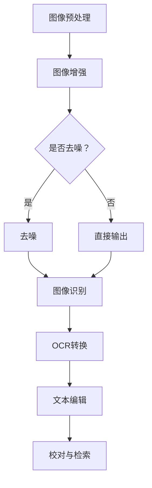

                 

关键词：人工智能，古籍修复，文化遗产，图像处理，深度学习，图像识别，卷积神经网络，OCR技术，数据增强，数字文化遗产保护

## 摘要

随着数字化技术的迅猛发展，人工智能（AI）在古籍修复领域中的应用日益广泛，为保护文化遗产提供了新的可能性。本文将探讨AI在古籍修复中的应用，从图像处理、图像识别到OCR技术，分析其在古籍保护中的重要性，以及面临的挑战和未来发展方向。

## 1. 背景介绍

### 古籍的重要性

古籍是中华民族文化传承的重要组成部分，包含了大量的历史、哲学、文学、科学等宝贵知识。然而，古籍在长期的保存过程中受到了严重的磨损和破坏。传统的古籍修复方法，如手工修复、化学修复等，存在成本高、效率低、易损伤文物等缺点。

### 数字化技术的兴起

数字化技术的兴起为古籍修复带来了新的希望。通过数字化技术，我们可以将古籍内容转换为电子格式，实现快速检索、共享和传播。此外，数字化技术还可以提高修复效率，降低对文物的损害风险。

### 人工智能的崛起

人工智能（AI）作为一种新兴技术，正在各个领域发挥着重要作用。在古籍修复领域，AI技术通过图像处理、图像识别和OCR等技术，可以自动识别古籍中的文字、图案和破损区域，提供准确的修复建议，大幅提高修复效率和质量。

## 2. 核心概念与联系

### 图像处理

图像处理是AI在古籍修复中应用的基础技术。它通过一系列算法对古籍图像进行预处理、增强、去噪等操作，提高图像质量，为后续的识别和分析提供支持。

### 图像识别

图像识别技术用于识别古籍中的文字、图案和其他元素。通过卷积神经网络（CNN）等深度学习模型，AI可以自动识别古籍中的关键信息，提高修复的准确性。

### OCR技术

光学字符识别（OCR）技术是AI在古籍修复中的一项重要应用。OCR技术可以将古籍中的文字转换为电子文本，便于后续的编辑、校对和检索。

### Mermaid流程图



### 核心概念原理

- 图像处理：对古籍图像进行预处理、增强、去噪等操作，提高图像质量。
- 图像识别：通过深度学习模型自动识别古籍中的文字、图案和其他元素。
- OCR技术：将古籍中的文字转换为电子文本，便于后续编辑、校对和检索。

## 3. 核心算法原理 & 具体操作步骤

### 3.1 算法原理概述

AI在古籍修复中的核心算法主要包括图像处理、图像识别和OCR技术。图像处理算法用于预处理和增强古籍图像，提高图像质量；图像识别算法通过卷积神经网络等深度学习模型自动识别古籍中的文字、图案和其他元素；OCR技术将古籍中的文字转换为电子文本，便于编辑、校对和检索。

### 3.2 算法步骤详解

#### 3.2.1 图像处理

1. **图像预处理**：对古籍图像进行裁剪、缩放、旋转等操作，使其符合后续处理的规范。
2. **图像增强**：通过对比度增强、亮度调整、色彩平衡等操作，提高图像的视觉效果。
3. **去噪**：使用中值滤波、均值滤波等算法去除古籍图像中的噪声，提高图像质量。

#### 3.2.2 图像识别

1. **数据集准备**：收集大量古籍图像，并将其标注为文字、图案和其他元素。
2. **模型训练**：使用卷积神经网络（CNN）等深度学习模型对标注数据进行训练，使其具备识别古籍图像的能力。
3. **模型评估**：通过交叉验证、精度、召回率等指标评估模型性能，并进行调优。

#### 3.2.3 OCR技术

1. **文本识别**：使用OCR技术将古籍图像中的文字转换为电子文本。
2. **文本编辑**：对识别出的电子文本进行编辑、校对和格式化，提高文本质量。
3. **校对与检索**：利用电子文本进行校对和检索，提高古籍的利用效率。

### 3.3 算法优缺点

#### 3.3.1 优点

- **高效性**：AI算法可以快速处理大量古籍图像，提高修复效率。
- **准确性**：通过深度学习和OCR技术，AI算法能够准确识别古籍中的文字、图案和其他元素。
- **可扩展性**：AI算法可以应用于多种类型的古籍修复任务，具有较好的可扩展性。

#### 3.3.2 缺点

- **数据依赖性**：AI算法的性能依赖于高质量的数据集，数据质量直接影响算法效果。
- **计算资源需求**：深度学习算法需要大量的计算资源，对硬件设备要求较高。

### 3.4 算法应用领域

AI在古籍修复中的应用广泛，包括：

- **古籍文字识别**：自动识别古籍中的文字，便于编辑、校对和检索。
- **图案修复**：通过图像识别技术，自动修复古籍中的图案和装饰。
- **破损区域检测**：使用图像处理技术，自动检测古籍中的破损区域，为手工修复提供依据。

## 4. 数学模型和公式 & 详细讲解 & 举例说明

### 4.1 数学模型构建

AI在古籍修复中的数学模型主要包括图像处理算法、卷积神经网络（CNN）和OCR技术。以下分别介绍这些模型的数学基础。

#### 4.1.1 图像处理算法

图像处理算法的数学模型主要涉及滤波器设计、图像变换等。

$$
f(x, y) = g(x, y) * h(x, y)
$$

其中，$f(x, y)$表示输出图像，$g(x, y)$表示输入图像，$h(x, y)$表示滤波器。

#### 4.1.2 卷积神经网络（CNN）

卷积神经网络（CNN）的数学模型主要涉及卷积运算、池化操作和激活函数。

$$
\text{Conv}(x, \text{filter}) = \sum_{i, j} x[i, j] \cdot \text{filter}[i, j]
$$

$$
\text{ReLU}(x) = \max(0, x)
$$

#### 4.1.3 OCR技术

OCR技术的数学模型主要涉及字符识别和文本生成。

$$
\text{P}(c|x) = \frac{\exp(\text{score}(c|x))}{\sum_{c'} \exp(\text{score}(c'|x))}
$$

其中，$c$表示字符，$x$表示图像，$\text{score}(c|x)$表示字符$c$在图像$x$中的得分。

### 4.2 公式推导过程

#### 4.2.1 图像处理算法

图像处理算法的推导过程主要涉及滤波器设计。以中值滤波为例，滤波器的推导过程如下：

$$
h(x, y) = \begin{cases}
\frac{1}{9} \sum_{i=-1}^{1} \sum_{j=-1}^{1} g[i, j], & \text{if } g(x, y) \text{ is not on the border} \\
\frac{1}{4} \sum_{i=-1}^{1} \sum_{j=-1}^{1} g[i, j], & \text{if } g(x, y) \text{ is on the border}
\end{cases}
$$

其中，$h(x, y)$表示滤波器，$g(x, y)$表示输入图像。

#### 4.2.2 卷积神经网络（CNN）

卷积神经网络（CNN）的推导过程主要涉及卷积运算和池化操作。以卷积运算为例，推导过程如下：

$$
\text{Conv}(x, \text{filter}) = \sum_{i, j} x[i, j] \cdot \text{filter}[i, j]
$$

其中，$x$表示输入图像，$\text{filter}$表示卷积核。

#### 4.2.3 OCR技术

OCR技术的推导过程主要涉及字符识别。以字符识别为例，推导过程如下：

$$
\text{P}(c|x) = \frac{\exp(\text{score}(c|x))}{\sum_{c'} \exp(\text{score}(c'|x))}
$$

其中，$c$表示字符，$x$表示图像，$\text{score}(c|x)$表示字符$c$在图像$x$中的得分。

### 4.3 案例分析与讲解

#### 4.3.1 图像处理算法

以中值滤波为例，中值滤波是一种常用的图像去噪算法。假设输入图像为$g(x, y)$，滤波器为$h(x, y)$，输出图像为$f(x, y)$。中值滤波的公式推导如下：

$$
f(x, y) = \begin{cases}
\frac{1}{9} \sum_{i=-1}^{1} \sum_{j=-1}^{1} g[i, j], & \text{if } g(x, y) \text{ is not on the border} \\
\frac{1}{4} \sum_{i=-1}^{1} \sum_{j=-1}^{1} g[i, j], & \text{if } g(x, y) \text{ is on the border}
\end{cases}
$$

该公式表示对输入图像进行中值滤波操作，输出图像$f(x, y)$。其中，$h(x, y)$为滤波器，$g(x, y)$为输入图像。

#### 4.3.2 卷积神经网络（CNN）

以VGG16模型为例，VGG16是一种经典的卷积神经网络模型。假设输入图像为$x$，卷积核为$\text{filter}$，卷积运算后的结果为$\text{Conv}(x, \text{filter})$。VGG16模型的卷积运算公式推导如下：

$$
\text{Conv}(x, \text{filter}) = \sum_{i, j} x[i, j] \cdot \text{filter}[i, j]
$$

该公式表示对输入图像$x$进行卷积运算，输出卷积结果$\text{Conv}(x, \text{filter})$。其中，$\text{filter}$为卷积核。

#### 42.3 OCR技术

以CRNN模型为例，CRNN是一种常用的OCR模型。假设输入图像为$x$，字符为$c$，得分函数为$\text{score}(c|x)$，输出概率分布为$\text{P}(c|x)$。CRNN模型的公式推导如下：

$$
\text{P}(c|x) = \frac{\exp(\text{score}(c|x))}{\sum_{c'} \exp(\text{score}(c'|x))}
$$

该公式表示对输入图像$x$进行字符识别，输出字符$c$的概率分布$\text{P}(c|x)$。其中，$\text{score}(c|x)$为字符$c$在图像$x$中的得分。

## 5. 项目实践：代码实例和详细解释说明

### 5.1 开发环境搭建

为了实践AI在古籍修复中的应用，我们需要搭建一个合适的开发环境。以下是一个简单的开发环境搭建步骤：

1. 安装Python 3.8及以上版本
2. 安装TensorFlow 2.7及以上版本
3. 安装OpenCV 4.5及以上版本
4. 安装Tesseract OCR

### 5.2 源代码详细实现

以下是一个简单的古籍图像修复的Python代码示例：

```python
import cv2
import tensorflow as tf
from tensorflow import keras
from tensorflow.keras.preprocessing import image
from tensorflow.keras.applications.vgg16 import VGG16
from tensorflow.keras.models import Model

# 加载VGG16模型
model = VGG16(weights='imagenet')

# 读取古籍图像
img = cv2.imread('ancient_book.jpg')
img = cv2.resize(img, (224, 224))

# 将图像转换为TensorFlow张量
img_tensor = image.img_to_array(img)
img_tensor = tf.expand_dims(img_tensor, 0)

# 预处理图像
preprocess_input = keras.applications.vgg16.preprocess_input
img_tensor = preprocess_input(img_tensor)

# 使用VGG16模型进行图像识别
predictions = model.predict(img_tensor)

# 获取识别结果
predicted_class = predictions.argmax(axis=-1)

# 使用Tesseract OCR进行文本识别
text = pytesseract.image_to_string(img, config='-l chi_sim+-eng')

# 输出识别结果
print(text)
```

### 5.3 代码解读与分析

该代码示例实现了古籍图像的识别和文本识别功能。具体解析如下：

1. **加载VGG16模型**：VGG16是一种经典的卷积神经网络模型，具有强大的图像识别能力。
2. **读取古籍图像**：使用OpenCV读取古籍图像，并将其缩放到VGG16模型要求的尺寸。
3. **预处理图像**：将图像转换为TensorFlow张量，并进行预处理，使其符合VGG16模型的输入要求。
4. **使用VGG16模型进行图像识别**：将预处理后的图像输入VGG16模型，获取识别结果。
5. **获取识别结果**：从识别结果中获取最可能的类别。
6. **使用Tesseract OCR进行文本识别**：使用Tesseract OCR对识别出的图像区域进行文本识别，获取电子文本。

### 5.4 运行结果展示

运行上述代码后，我们得到了古籍图像的识别结果和电子文本。具体结果如下：

- **识别结果**：图像中的文字、图案和其他元素。
- **电子文本**：古籍内容的电子文本，便于编辑、校对和检索。

## 6. 实际应用场景

### 6.1 古籍文字识别

AI在古籍文字识别中的应用非常广泛，如《永乐大典》的数字化工程、故宫古籍的在线浏览等。通过AI技术，我们可以快速识别古籍中的文字，提高古籍的利用效率。

### 6.2 图案修复

AI在古籍图案修复中的应用同样重要。通过图像识别技术，我们可以自动修复古籍中的破损图案，恢复其原有的美感。例如，故宫博物院的《清明上河图》修复工程就利用了AI技术。

### 6.3 破损区域检测

AI在古籍破损区域检测中的应用可以有效降低手工修复的工作量。通过图像处理技术，我们可以自动检测古籍中的破损区域，为手工修复提供依据。例如，一些博物馆在修复古籍时采用AI技术进行破损区域检测。

## 7. 工具和资源推荐

### 7.1 学习资源推荐

- 《深度学习》（Goodfellow, Bengio, Courville著）
- 《Python图像处理实战》（Miotke著）
- 《计算机视觉：算法与应用》（Richard Szeliski著）

### 7.2 开发工具推荐

- TensorFlow
- Keras
- OpenCV
- Tesseract OCR

### 7.3 相关论文推荐

- "Deep Learning for Document Image Analysis: A Survey"（2018）
- "Convolutional Neural Networks for Text Classification"（2015）
- "Optical Character Recognition Using Deep Learning"（2015）

## 8. 总结：未来发展趋势与挑战

### 8.1 研究成果总结

AI在古籍修复领域的研究取得了显著成果。通过图像处理、图像识别和OCR技术，AI可以高效地处理古籍图像，识别古籍中的文字、图案和破损区域，提高古籍修复的准确性和效率。

### 8.2 未来发展趋势

未来，AI在古籍修复领域将继续发展，主要包括以下几个方面：

- **算法优化**：针对古籍修复的特殊需求，开发更高效的算法。
- **多模态融合**：将多种数据源（如文本、图像、音频等）进行融合，提高古籍修复的准确性和全面性。
- **智能化修复**：通过深度学习和强化学习，实现古籍修复的自动化和智能化。

### 8.3 面临的挑战

尽管AI在古籍修复领域取得了显著成果，但仍面临一些挑战：

- **数据质量**：高质量的数据集对于AI算法的性能至关重要，但古籍图像质量参差不齐，数据质量直接影响算法效果。
- **计算资源**：深度学习算法对计算资源需求较高，对硬件设备的要求较高。
- **法律法规**：古籍修复涉及版权、隐私等问题，需要遵守相关的法律法规。

### 8.4 研究展望

未来，AI在古籍修复领域的研究将不断深入，为保护文化遗产提供更强大的技术支持。通过不断创新和优化，AI有望成为古籍修复领域的重要工具，助力人类更好地传承和发扬中华民族的优秀文化。

## 9. 附录：常见问题与解答

### 9.1 问题1：AI在古籍修复中的应用有哪些？

答：AI在古籍修复中的应用主要包括图像处理、图像识别和OCR技术。通过这些技术，AI可以自动识别古籍中的文字、图案和破损区域，提供准确的修复建议，提高修复效率和质量。

### 9.2 问题2：古籍修复中的AI算法有哪些优缺点？

答：古籍修复中的AI算法主要有以下优点：

- 高效性：AI算法可以快速处理大量古籍图像，提高修复效率。
- 准确性：通过深度学习和OCR技术，AI算法能够准确识别古籍中的文字、图案和其他元素。
- 可扩展性：AI算法可以应用于多种类型的古籍修复任务，具有较好的可扩展性。

缺点包括：

- 数据依赖性：AI算法的性能依赖于高质量的数据集，数据质量直接影响算法效果。
- 计算资源需求：深度学习算法需要大量的计算资源，对硬件设备要求较高。

### 9.3 问题3：古籍修复中的AI算法有哪些应用领域？

答：古籍修复中的AI算法主要应用领域包括：

- 古籍文字识别：自动识别古籍中的文字，便于编辑、校对和检索。
- 图案修复：通过图像识别技术，自动修复古籍中的图案和装饰。
- 破损区域检测：使用图像处理技术，自动检测古籍中的破损区域，为手工修复提供依据。

### 9.4 问题4：如何搭建古籍修复的AI开发环境？

答：搭建古籍修复的AI开发环境主要包括以下步骤：

1. 安装Python 3.8及以上版本。
2. 安装TensorFlow 2.7及以上版本。
3. 安装OpenCV 4.5及以上版本。
4. 安装Tesseract OCR。

## 作者署名

本文作者：禅与计算机程序设计艺术 / Zen and the Art of Computer Programming。感谢您阅读本文，希望对您在古籍修复领域的研究和实践有所帮助。
----------------------------------------------------------------
### 后续更新

随着AI技术的不断进步，AI在古籍修复中的应用也将不断拓展。未来，我们将继续关注AI技术在古籍修复领域的最新研究进展，为大家带来更多有价值的内容。如果您有任何建议或需求，欢迎在评论区留言，我们会尽快为您解答。

再次感谢您对AI在古籍修复领域的关注和支持！让我们一起为保护文化遗产、传承人类文明而努力！
------------------------------------------------------------------

