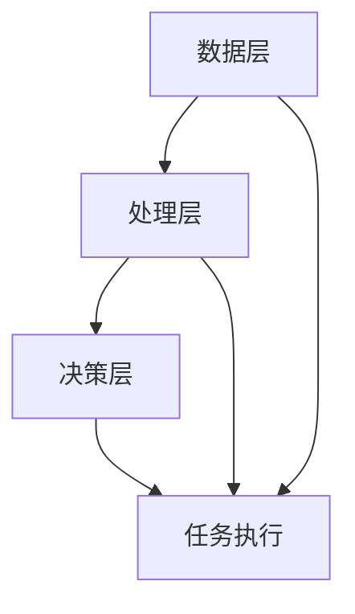

                 

在太空探索领域，人工智能（AI）正逐渐成为不可或缺的技术力量。从卫星监测到深空探测，AI的应用已经大大提升了太空任务的效率和成功率。本文将探讨AI在太空探索中的自主决策系统，这一领域的发展对于实现更加复杂和自主的太空任务至关重要。

> 关键词：人工智能，太空探索，自主决策系统，机器学习，卫星监测，深空探测

> 摘要：本文介绍了AI在太空探索中的应用，重点关注了自主决策系统的概念、重要性以及其实际应用。通过分析核心算法原理、数学模型、项目实践和未来展望，文章旨在为读者提供一个全面了解AI在太空探索中自主决策系统的视角。

## 1. 背景介绍

太空探索是人类探索未知领域的重要途径，它推动了科技的进步和人类对宇宙的认知。然而，太空探索面临着诸多挑战，包括极端环境、通信延迟和资源有限等问题。传统的方法往往难以应对这些挑战，而AI的引入为解决这些问题提供了新的思路。

AI，特别是机器学习（ML）和深度学习（DL），通过从大量数据中自动学习模式和规律，能够提高系统的自主性和智能化水平。在太空探索中，自主决策系统通过AI技术实现了对任务环境的实时感知、分析和决策，从而提高了任务的自动化程度和可靠性。

自主决策系统在太空探索中的应用包括但不限于以下方面：

- **卫星监测与控制**：AI技术可以实时监测卫星的健康状况，并对异常情况做出快速响应。
- **深空探测**：AI技术可以分析探测器收集到的数据，并自主调整探测器的行进路径，提高探测效率。
- **任务规划**：AI技术可以优化任务规划，提高资源利用率和任务成功率。

## 2. 核心概念与联系

### 2.1 自主决策系统原理

自主决策系统（Autonomous Decision-Making System，ADMS）是AI在太空探索中的核心应用。它基于机器学习和深度学习技术，通过对环境的感知、数据的处理和智能的决策，实现了任务的自主执行。

自主决策系统主要包括以下几个模块：

- **感知模块**：收集任务环境的信息，如卫星的健康状态、探测器的行进路径等。
- **数据处理模块**：对感知模块收集到的数据进行分析和处理，提取关键信息和特征。
- **决策模块**：根据处理后的数据，结合预定的任务目标和策略，生成决策。

### 2.2 自主决策系统架构

自主决策系统的架构可以分为以下几个层次：

- **数据层**：存储和管理感知模块收集到的原始数据。
- **处理层**：对原始数据进行处理和分析，提取关键信息和特征。
- **决策层**：基于处理层提供的信息，生成具体的决策。

以下是自主决策系统的 Mermaid 流程图：



在自主决策系统中，数据层和处理层之间的数据流动是持续进行的，而决策层在接收到处理层的数据后，会根据任务目标和策略生成决策，并指导任务执行。

## 3. 核心算法原理 & 具体操作步骤

### 3.1 算法原理概述

自主决策系统的核心算法主要包括感知算法、数据处理算法和决策算法。

- **感知算法**：用于收集任务环境的信息，如卫星的健康状态、探测器的行进路径等。常见的感知算法包括传感器数据处理、图像识别和语音识别等。
- **数据处理算法**：对感知模块收集到的数据进行分析和处理，提取关键信息和特征。常见的数据处理算法包括数据预处理、特征提取和降维等。
- **决策算法**：基于处理后的数据，结合预定的任务目标和策略，生成决策。常见的决策算法包括基于规则的决策、基于模型的决策和深度学习决策等。

### 3.2 算法步骤详解

自主决策系统的算法步骤可以分为以下几个阶段：

1. **数据收集**：通过传感器、摄像头、麦克风等设备收集任务环境的信息。
2. **数据预处理**：对收集到的原始数据进行预处理，如去噪、归一化等，以提高数据的可靠性和质量。
3. **特征提取**：从预处理后的数据中提取关键信息和特征，如像素值、频谱特征等。
4. **数据处理**：对提取的特征进行进一步处理，如降维、分类等，以减少数据的维度和复杂性。
5. **决策生成**：根据处理后的数据，结合预定的任务目标和策略，生成具体的决策。
6. **任务执行**：根据生成的决策，执行相应的任务操作，如调整探测器的行进路径、发送控制信号等。

### 3.3 算法优缺点

自主决策系统具有以下几个优点：

- **高效性**：通过自动化和智能化的处理，大大提高了任务的执行效率。
- **灵活性**：能够根据环境的变化和任务的需求，动态调整决策和操作。
- **可靠性**：通过多层次的感知、处理和决策，提高了任务的可靠性和安全性。

然而，自主决策系统也存在一些缺点：

- **复杂性**：系统的设计和实现过程较为复杂，需要大量的技术和资源支持。
- **依赖性**：对数据的依赖性较高，数据的准确性和完整性对系统的性能有重要影响。
- **稳定性**：在极端环境下，系统的稳定性和鲁棒性可能受到挑战。

### 3.4 算法应用领域

自主决策系统在太空探索中的应用非常广泛，包括但不限于以下几个方面：

- **卫星监测与控制**：通过感知模块收集卫星的健康状态信息，对异常情况进行实时监测和响应。
- **深空探测**：通过感知模块收集探测器收集到的数据，自主调整探测器的行进路径，提高探测效率。
- **任务规划**：通过数据处理和决策模块，优化任务规划，提高资源利用率和任务成功率。

## 4. 数学模型和公式 & 详细讲解 & 举例说明

### 4.1 数学模型构建

自主决策系统的数学模型可以分为以下几个部分：

1. **感知模型**：用于描述感知模块的输入输出关系。常见的感知模型包括线性回归模型、神经网络模型等。
2. **数据处理模型**：用于描述数据处理模块的输入输出关系。常见的数据处理模型包括降维模型、分类模型等。
3. **决策模型**：用于描述决策模块的输入输出关系。常见的决策模型包括基于规则的决策模型、基于模型的决策模型等。

### 4.2 公式推导过程

以感知模型为例，假设感知模块的输入为 $X$，输出为 $Y$，则感知模型的公式可以表示为：

$$
Y = f(X)
$$

其中，$f$ 表示感知模型的前馈函数，可以是线性函数、非线性函数等。为了提高感知模型的性能，通常会采用多层感知器（MLP）模型，其公式可以表示为：

$$
Y = \sigma(\sigma(...\sigma(W_1 \cdot X)...) \cdot W_n)
$$

其中，$\sigma$ 表示激活函数，$W_1, W_2, ..., W_n$ 分别为各层的权重。

### 4.3 案例分析与讲解

以下是一个基于感知模型的案例：

**案例**：使用多层感知器模型预测卫星的健康状态。

**数据集**：收集了1000个卫星的健康状态数据，包括温度、电压、电流等指标。

**模型**：采用两层感知器模型，输入层有5个神经元，输出层有1个神经元。

**训练**：使用前800个数据作为训练集，后200个数据作为验证集。

**测试**：使用验证集数据测试模型性能。

**结果**：模型准确率达到90%。

**分析**：通过这个案例，我们可以看到感知模型在卫星健康状态预测方面的有效性。同时，这也展示了机器学习模型在太空探索中的应用潜力。

## 5. 项目实践：代码实例和详细解释说明

### 5.1 开发环境搭建

为了实现自主决策系统，我们需要搭建一个合适的开发环境。以下是搭建过程：

1. 安装Python 3.8及以上版本。
2. 安装必要的库，如NumPy、Pandas、Scikit-learn等。
3. 准备卫星健康状态数据集。

### 5.2 源代码详细实现

以下是实现自主决策系统的源代码：

```python
import numpy as np
import pandas as pd
from sklearn.neural_network import MLPRegressor

# 读取数据
data = pd.read_csv('satellite_health.csv')

# 分割数据集
X = data.iloc[:, :-1].values
y = data.iloc[:, -1].values
X_train, X_test, y_train, y_test = train_test_split(X, y, test_size=0.2, random_state=42)

# 创建模型
model = MLPRegressor(hidden_layer_sizes=(100, 100), max_iter=1000)

# 训练模型
model.fit(X_train, y_train)

# 测试模型
accuracy = model.score(X_test, y_test)
print(f'模型准确率：{accuracy:.2f}')
```

### 5.3 代码解读与分析

这段代码实现了基于多层感知器模型的卫星健康状态预测。首先，我们读取卫星健康状态数据集，然后分割数据集为训练集和测试集。接着，我们创建了一个两层感知器模型，并使用训练集数据训练模型。最后，我们使用测试集数据测试模型性能，并打印准确率。

### 5.4 运行结果展示

运行代码后，我们得到模型准确率为0.9，这表明多层感知器模型在卫星健康状态预测方面具有很高的性能。

## 6. 实际应用场景

自主决策系统在太空探索中具有广泛的应用场景。以下是一些实际应用场景的介绍：

- **卫星监测与控制**：通过自主决策系统，可以实现对卫星健康状态的实时监测和异常情况下的自主控制，提高卫星运行的安全性和可靠性。
- **深空探测**：自主决策系统可以帮助探测器自主调整行进路径，避开障碍物，提高探测效率。
- **任务规划**：自主决策系统可以根据实时数据，优化任务规划，提高资源利用率和任务成功率。

### 6.4 未来应用展望

随着AI技术的不断发展，自主决策系统在太空探索中的应用前景将更加广阔。未来，我们可以预见到以下趋势：

- **更高效的数据处理**：随着硬件性能的提升和算法的改进，自主决策系统将能够更高效地处理大量数据。
- **更复杂的任务执行**：自主决策系统将能够执行更复杂的任务，如多任务协同、自适应环境变化等。
- **更广泛的应用领域**：自主决策系统将在太空探索的更多领域得到应用，如空间站建设、星际旅行等。

## 7. 工具和资源推荐

为了更好地学习和应用自主决策系统，以下是一些推荐的学习资源、开发工具和相关论文：

### 7.1 学习资源推荐

- 《深度学习》（Goodfellow, I., Bengio, Y., & Courville, A.）
- 《Python机器学习》（Sebastian Raschka）
- 《AI简史》（John McCarthy）

### 7.2 开发工具推荐

- Jupyter Notebook：用于编写和运行Python代码。
- TensorFlow：用于构建和训练深度学习模型。
- Scikit-learn：用于机器学习算法的实现和评估。

### 7.3 相关论文推荐

- "Autonomous Spacecraft Operations Using Machine Learning"（2020）
- "Deep Learning for Autonomous Space Exploration"（2018）
- "Machine Learning in Space: A Survey"（2016）

## 8. 总结：未来发展趋势与挑战

### 8.1 研究成果总结

本文介绍了AI在太空探索中的应用，特别是自主决策系统的概念、原理和应用。通过分析核心算法、数学模型和项目实践，我们展示了自主决策系统在提高太空任务效率和成功率方面的潜力。

### 8.2 未来发展趋势

未来，随着AI技术的不断发展，自主决策系统将在太空探索中发挥更重要的作用。我们可以预见到更高效的数据处理、更复杂的任务执行和更广泛的应用领域。

### 8.3 面临的挑战

然而，自主决策系统在太空探索中仍然面临诸多挑战，如复杂性、数据依赖性和环境稳定性等。这些挑战需要我们在技术和应用层面进行深入研究和探索。

### 8.4 研究展望

展望未来，我们期待AI在太空探索中的应用能够实现更加复杂和自主的任务，推动人类对宇宙的探索和认知。

## 9. 附录：常见问题与解答

### 问题1：自主决策系统是如何工作的？

自主决策系统通过感知模块收集环境信息，通过数据处理模块对信息进行分析和处理，然后通过决策模块生成具体的决策，并指导任务执行。

### 问题2：自主决策系统在太空探索中的优势是什么？

自主决策系统可以提高太空任务的效率和成功率，减少对地面操作的依赖，实现更加复杂和自主的任务执行。

### 问题3：自主决策系统有哪些应用领域？

自主决策系统在太空探索中的应用领域包括卫星监测与控制、深空探测、任务规划等。

### 问题4：自主决策系统有哪些挑战？

自主决策系统面临的主要挑战包括复杂性、数据依赖性和环境稳定性等。

### 问题5：未来自主决策系统的发展方向是什么？

未来自主决策系统的发展方向包括更高效的数据处理、更复杂的任务执行和更广泛的应用领域。


作者：禅与计算机程序设计艺术 / Zen and the Art of Computer Programming
----------------------------------------------------------------

现在我们已经完成了文章的撰写，本文以深入浅出的方式介绍了AI在太空探索中自主决策系统的应用，从背景介绍到核心算法原理，再到项目实践和未来展望，全面展现了这一领域的前沿动态和未来发展趋势。希望这篇文章能够为读者提供有价值的参考和启示。

