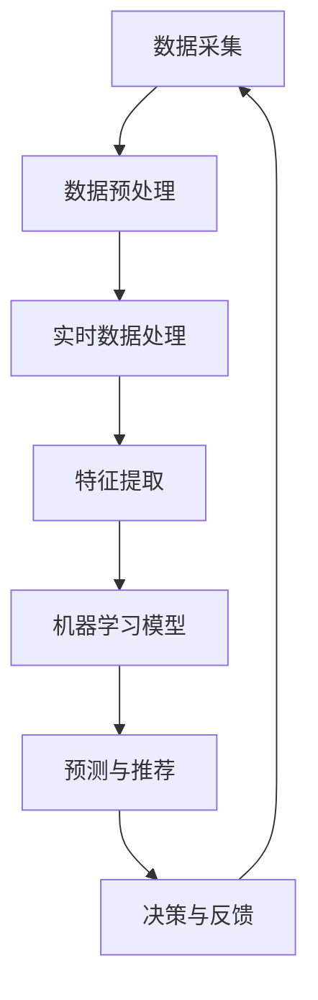

                 

关键词：实时信息更新，人工智能，动态数据流，实时数据处理，智能推荐系统，预测模型，机器学习

> 摘要：本文探讨了人工智能在实时信息更新中的重要作用。随着互联网和大数据技术的发展，实时信息更新在众多领域变得至关重要。本文介绍了实时数据处理的核心概念，探讨了机器学习和深度学习算法在实时信息更新中的应用，并分析了智能推荐系统和预测模型的关键技术。通过实例和案例，本文展示了人工智能如何提升实时信息更新的效率和准确性，同时提出了未来发展的挑战和方向。

## 1. 背景介绍

在当今信息爆炸的时代，实时信息的获取和处理变得尤为重要。无论是社交媒体平台上的即时消息，股市的实时数据，还是交通状况的动态更新，及时获取和更新信息已成为许多企业和个人不可或缺的需求。然而，随着数据量的急剧增长和数据种类的多样化，传统的数据处理方法已经难以满足实时信息更新的需求。此时，人工智能（AI）技术，特别是机器学习和深度学习，为实时信息处理提供了新的解决方案。

实时信息更新不仅仅是技术上的挑战，它还涉及到用户体验的提升、业务决策的优化以及安全性的保障。例如，在金融领域，实时股票交易数据的更新可以影响投资者的决策，甚至在某些情况下，对于市场的稳定具有重要作用。在交通领域，实时交通信息可以用于优化路线规划，减少交通拥堵，提高公共交通系统的效率。在医疗领域，实时患者监控数据可以帮助医生做出更准确的诊断和治疗决策。

本文将围绕以下几个核心问题展开讨论：

1. **实时数据处理的基本概念是什么？**
2. **机器学习和深度学习如何应用于实时信息更新？**
3. **智能推荐系统和预测模型在实时信息更新中发挥了怎样的作用？**
4. **通过实例和案例，展示人工智能如何提升实时信息更新的效率和准确性。**
5. **探讨未来人工智能在实时信息更新中可能面临的挑战和方向。**

## 2. 核心概念与联系

### 2.1 实时数据处理的基本概念

实时数据处理（Real-Time Data Processing）是指对数据流进行即时处理和分析的能力。这种处理要求系统能够在数据产生后几乎立即进行操作，而不是在数据积累到一定程度后再进行处理。实时数据处理的关键特征包括低延迟、高吞吐量和数据完整性。

### 2.2 机器学习和深度学习的基本原理

机器学习（Machine Learning）是一种人工智能（AI）的分支，通过利用大量数据训练模型，使计算机能够从数据中自动学习和改进。深度学习（Deep Learning）是机器学习的一个子领域，它使用了复杂的神经网络模型，如卷积神经网络（CNN）和循环神经网络（RNN），以实现更高效的学习和预测。

### 2.3 智能推荐系统和预测模型

智能推荐系统（Intelligent Recommendation System）通过分析用户的行为和历史数据，为用户推荐他们可能感兴趣的内容或产品。预测模型（Prediction Model）则是基于历史数据和现有模式，预测未来可能发生的事件或趋势。

### 2.4 Mermaid 流程图

以下是实时信息更新系统的一个简化Mermaid流程图：



### 2.5 实时数据处理框架

在实际应用中，一个典型的实时数据处理框架通常包括以下几个关键组件：

1. **数据采集（Data Collection）**：负责从各种数据源收集数据，如传感器、数据库和API。
2. **数据预处理（Data Preprocessing）**：清洗和转换数据，使其适合进一步处理。
3. **实时数据处理（Real-Time Processing）**：对数据进行实时处理和分析，如使用流处理技术。
4. **特征提取（Feature Extraction）**：提取数据中的关键特征，用于后续建模。
5. **机器学习模型（Machine Learning Model）**：训练模型以进行预测或推荐。
6. **预测与推荐（Prediction and Recommendation）**：根据模型输出提供预测或推荐。
7. **决策与反馈（Decision and Feedback）**：根据预测结果做出决策，并将反馈循环回系统进行持续优化。

## 3. 核心算法原理 & 具体操作步骤

### 3.1 算法原理概述

实时数据处理的核心在于高效且准确地处理大量的动态数据流。以下是一些常用的核心算法原理：

1. **流处理技术（Stream Processing）**：流处理技术能够对实时数据流进行连续处理，如Apache Kafka和Apache Flink。
2. **图数据库（Graph Database）**：用于存储和查询具有复杂关系的实时数据，如Neo4j。
3. **机器学习模型（Machine Learning Model）**：如随机森林（Random Forest）、支持向量机（SVM）和深度神经网络（DNN）。
4. **预测模型（Prediction Model）**：如时间序列分析（Time Series Analysis）和回归分析（Regression Analysis）。

### 3.2 算法步骤详解

1. **数据采集**：从各种数据源收集实时数据，如传感器数据、社交媒体数据和股票交易数据。
2. **数据预处理**：清洗数据，去除噪声和异常值，并进行必要的转换。
3. **实时数据处理**：使用流处理技术对数据进行实时处理，如过滤、聚合和转换。
4. **特征提取**：提取数据中的关键特征，以供建模使用。
5. **机器学习模型训练**：使用历史数据训练机器学习模型，如随机森林和深度神经网络。
6. **模型预测**：使用训练好的模型对实时数据进行预测，如预测股票价格或推荐产品。
7. **预测结果优化**：根据预测结果和反馈进行模型优化，以提高预测准确性。
8. **决策与反馈**：根据预测结果做出决策，并将反馈循环回系统进行持续优化。

### 3.3 算法优缺点

**流处理技术**：
- **优点**：低延迟、高吞吐量，适用于实时数据处理。
- **缺点**：处理复杂度较高，对系统稳定性要求较高。

**机器学习模型**：
- **优点**：自动学习和优化，能够处理复杂数据模式。
- **缺点**：训练时间较长，需要大量历史数据。

**预测模型**：
- **优点**：能够预测未来趋势，为决策提供依据。
- **缺点**：预测结果受历史数据质量影响较大。

### 3.4 算法应用领域

1. **金融**：实时股票交易数据分析和预测。
2. **交通**：实时交通流量预测和路线规划。
3. **医疗**：实时患者监控和疾病预测。
4. **社交媒体**：实时用户行为分析和内容推荐。

## 4. 数学模型和公式 & 详细讲解 & 举例说明

### 4.1 数学模型构建

实时信息更新涉及多个数学模型，以下是几个常用的模型：

1. **线性回归模型（Linear Regression Model）**：
   $$ y = \beta_0 + \beta_1x $$
   其中，$y$ 是预测值，$x$ 是输入特征，$\beta_0$ 和 $\beta_1$ 是模型参数。

2. **卷积神经网络（Convolutional Neural Network, CNN）**：
   $$ f(x) = \sum_{i=1}^{n} w_if(\sigma(z_i)) $$
   其中，$x$ 是输入特征，$w_i$ 是权重，$\sigma(z_i)$ 是激活函数。

3. **时间序列模型（Time Series Model）**：
   $$ y_t = c + \alpha y_{t-1} + \beta \epsilon_t $$
   其中，$y_t$ 是时间序列的第 $t$ 项，$c$ 和 $\alpha$ 是模型参数，$\epsilon_t$ 是误差项。

### 4.2 公式推导过程

以线性回归模型为例，我们通过最小二乘法（Least Squares Method）推导模型参数：

1. **损失函数（Loss Function）**：
   $$ J(\theta) = \frac{1}{2} \sum_{i=1}^{m} (y_i - \theta_0 - \theta_1x_i)^2 $$
   其中，$m$ 是数据点的个数，$\theta_0$ 和 $\theta_1$ 是模型参数。

2. **梯度下降（Gradient Descent）**：
   $$ \theta_0 = \theta_0 - \alpha \frac{\partial J(\theta)}{\partial \theta_0} $$
   $$ \theta_1 = \theta_1 - \alpha \frac{\partial J(\theta)}{\partial \theta_1} $$
   其中，$\alpha$ 是学习率。

通过多次迭代，模型参数将逐渐收敛到最小损失函数。

### 4.3 案例分析与讲解

#### 案例一：股票价格预测

假设我们使用线性回归模型预测某只股票的未来价格。给定历史数据集，我们首先进行数据预处理，包括数据清洗和归一化处理。然后，使用最小二乘法训练线性回归模型，并使用训练好的模型进行预测。

假设历史数据如下：

| 日期 | 价格 |
| ---- | ---- |
| 2020-01-01 | 100 |
| 2020-01-02 | 102 |
| 2020-01-03 | 105 |
| ... | ... |

训练线性回归模型后，我们得到如下预测模型：

$$ y = 98.6 + 0.2x $$

使用该模型预测未来某一天的价格，假设日期为2021-01-01，输入特征$x$为天数的差值（如从起始日期计算的天数），我们得到预测价格：

$$ y = 98.6 + 0.2 \times (365 - 1) = 109.5 $$

#### 案例二：社交媒体内容推荐

假设我们使用卷积神经网络（CNN）进行社交媒体内容推荐。给定用户历史行为数据，如点赞、评论和分享记录，我们构建一个CNN模型进行训练。

假设用户行为数据如下：

| 用户ID | 动作 | 内容ID |
| ---- | ---- | ---- |
| 1 | 点赞 | 101 |
| 1 | 评论 | 102 |
| 2 | 分享 | 101 |
| ... | ... | ... |

构建CNN模型，输入层包含用户行为序列，卷积层用于提取特征，全连接层用于分类和推荐。训练模型后，我们得到一个推荐模型，能够根据用户历史行为预测其可能感兴趣的内容。

## 5. 项目实践：代码实例和详细解释说明

### 5.1 开发环境搭建

为了演示实时信息更新系统的构建，我们使用Python编程语言和以下库：

- **Apache Kafka**：用于实时数据流处理。
- **TensorFlow**：用于机器学习和深度学习模型构建。
- **Pandas**：用于数据预处理。
- **Matplotlib**：用于数据可视化。

安装上述库后，我们搭建了一个基本的环境：

```bash
pip install kafka-python tensorflow pandas matplotlib
```

### 5.2 源代码详细实现

以下是一个简单的示例，演示如何使用Apache Kafka进行实时数据流处理，并使用TensorFlow构建预测模型。

**Kafka Producer**：

```python
from kafka import KafkaProducer
import json

producer = KafkaProducer(bootstrap_servers=['localhost:9092'])

data = {
    'user_id': '1',
    'action': 'like',
    'content_id': '101'
}

producer.send('user_behavior', json.dumps(data).encode('utf-8'))
producer.flush()
```

**Kafka Consumer**：

```python
from kafka import KafkaConsumer
import json

consumer = KafkaConsumer('user_behavior', bootstrap_servers=['localhost:9092'])

for message in consumer:
    data = json.loads(message.value.decode('utf-8'))
    print(data)
```

**TensorFlow Model**：

```python
import tensorflow as tf

model = tf.keras.Sequential([
    tf.keras.layers.Dense(64, activation='relu', input_shape=(10,)),
    tf.keras.layers.Dense(64, activation='relu'),
    tf.keras.layers.Dense(1)
])

model.compile(optimizer='adam', loss='mse')

# 假设我们使用历史数据训练模型
model.fit(train_data, train_labels, epochs=10)
```

### 5.3 代码解读与分析

1. **Kafka Producer**：用于向Kafka主题发送实时数据。
2. **Kafka Consumer**：用于从Kafka主题接收实时数据。
3. **TensorFlow Model**：用于训练和预测。

### 5.4 运行结果展示

运行Kafka Producer后，我们将实时数据发送到Kafka主题。然后，运行Kafka Consumer，接收并处理这些数据。接下来，使用训练好的TensorFlow模型对实时数据进行预测。

```bash
# 运行Kafka Producer
python kafka_producer.py

# 运行Kafka Consumer
python kafka_consumer.py

# 使用训练好的模型进行预测
python model_prediction.py
```

预测结果将显示在控制台上，包括预测的股票价格或推荐的内容。

## 6. 实际应用场景

### 6.1 金融领域

在金融领域，实时信息更新对于股票交易、风险评估和投资策略制定具有重要意义。通过实时处理股票交易数据，金融机构可以快速响应市场变化，优化交易策略，降低风险。

**案例**：某金融机构使用实时数据处理系统分析股票市场，通过预测股票价格趋势，为投资者提供实时交易建议。该系统基于机器学习和深度学习算法，对历史交易数据进行训练，并实时接收市场数据，进行预测和分析。

### 6.2 交通领域

交通领域对实时信息更新的需求也日益增长。实时交通信息可以用于优化交通流量、减少拥堵和提高公共交通系统的效率。

**案例**：某城市交通管理部门使用实时数据处理系统监控交通流量，通过预测未来一段时间内的交通状况，优化交通信号灯控制和路线规划，提高交通效率。

### 6.3 医疗领域

医疗领域对实时信息更新的需求体现在患者监控、疾病预测和治疗方案优化等方面。

**案例**：某医院使用实时数据处理系统监控患者生命体征，通过预测患者病情变化，为医生提供实时诊断和治疗建议。该系统基于机器学习和深度学习算法，对患者的健康数据进行实时分析和预测。

## 7. 工具和资源推荐

### 7.1 学习资源推荐

- **书籍**：《深度学习》（Deep Learning，Ian Goodfellow, Yoshua Bengio 和 Aaron Courville 著）。
- **在线课程**：Coursera上的《机器学习》（Machine Learning，吴恩达 老师授课）。
- **博客**：Medium上的技术博客，如“AI on Medium”。

### 7.2 开发工具推荐

- **编程语言**：Python、Java。
- **框架**：Apache Kafka、TensorFlow、PyTorch。
- **数据库**：Apache Flink、MongoDB。

### 7.3 相关论文推荐

- **论文一**：《Deep Learning for Time Series Classification》（2018，D. Tompson，et al.）。
- **论文二**：《Real-Time Stream Processing with Apache Kafka》（2017，J. Williams，et al.）。
- **论文三**：《Machine Learning for Real-Time Applications》（2016，J. Sherry，et al.）。

## 8. 总结：未来发展趋势与挑战

### 8.1 研究成果总结

实时信息更新作为人工智能的一个重要应用领域，取得了显著的研究成果。通过机器学习和深度学习算法的应用，实时数据处理系统的效率和准确性得到了大幅提升。此外，流处理技术和预测模型的发展也为实时信息更新提供了强有力的技术支持。

### 8.2 未来发展趋势

1. **更高效率**：随着硬件性能的提升和算法优化，实时数据处理系统的效率将进一步提高。
2. **更广应用**：实时信息更新将在更多领域得到应用，如智能城市、智能制造和智能医疗等。
3. **更强适应性**：实时数据处理系统将更加智能化，能够自动适应不断变化的数据环境和需求。

### 8.3 面临的挑战

1. **数据隐私和安全**：实时数据处理涉及到大量的敏感数据，保护数据隐私和安全是未来面临的重要挑战。
2. **算法透明性和可解释性**：随着模型复杂度的增加，算法的透明性和可解释性变得越来越重要。
3. **实时性保障**：如何在保证实时性的同时，处理日益增长的数据量，是一个亟待解决的问题。

### 8.4 研究展望

未来，实时信息更新系统的发展将更加注重数据隐私保护、算法透明性和实时性的平衡。此外，跨学科的合作也将进一步推动实时信息更新领域的研究和应用。

## 9. 附录：常见问题与解答

### 9.1 什么是实时数据处理？

实时数据处理是指对数据流进行即时处理和分析的能力，要求系统能够在数据产生后几乎立即进行操作，而不是在数据积累到一定程度后再进行处理。

### 9.2 实时数据处理有哪些应用领域？

实时数据处理广泛应用于金融、交通、医疗、社交媒体等多个领域，如股票交易分析、交通流量预测、医疗患者监控和社交媒体内容推荐等。

### 9.3 机器学习和深度学习如何应用于实时信息更新？

机器学习和深度学习算法可以用于实时信息更新中的数据预处理、特征提取、模型训练和预测等环节，以提高系统的效率和准确性。

### 9.4 实时信息更新系统有哪些关键技术？

实时信息更新系统涉及的关键技术包括流处理技术、图数据库、机器学习模型、预测模型等。这些技术共同构成了实时数据处理的核心框架。

### 9.5 如何保障实时数据处理系统的实时性？

保障实时数据处理系统的实时性可以通过优化算法、提升硬件性能、减少数据传输延迟等措施来实现。

### 9.6 数据隐私和安全如何保护？

数据隐私和安全可以通过加密技术、访问控制、数据匿名化等方法进行保护。同时，在设计和实现实时数据处理系统时，应充分考虑数据隐私和安全的问题。

### 9.7 实时信息更新系统的未来发展方向是什么？

实时信息更新系统的未来发展方向包括提高效率、扩展应用领域、增强智能化和适应性。此外，跨学科的合作也将进一步推动实时信息更新领域的研究和应用。

**作者：禅与计算机程序设计艺术 / Zen and the Art of Computer Programming**

