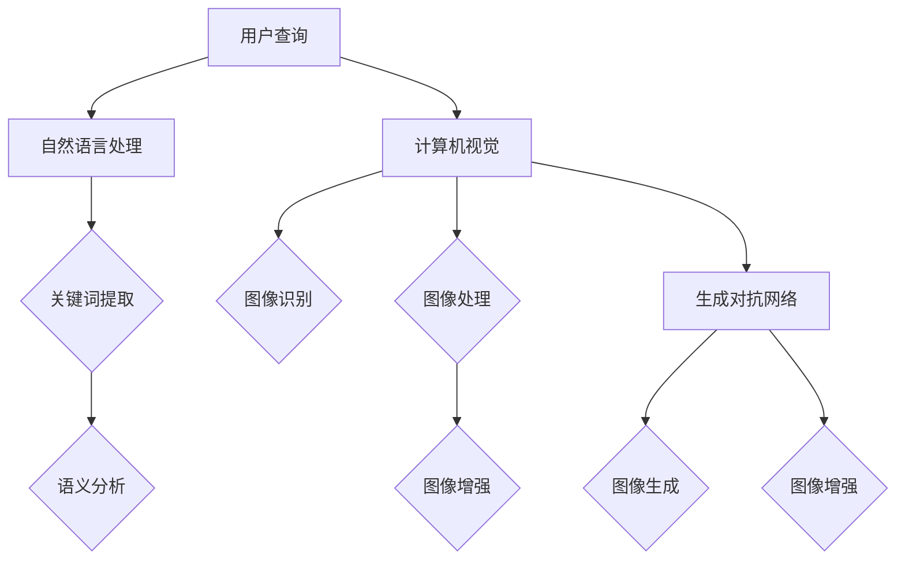

                 

搜索引擎是现代社会中不可或缺的信息检索工具。用户通过搜索引擎查找信息时，往往会面临大量的搜索结果，如何有效地展示这些结果，帮助用户快速找到所需信息，成为了搜索引擎优化（SEO）和用户体验（UX）设计中的重要课题。随着人工智能技术的快速发展，尤其是生成对抗网络（GAN）、自然语言处理（NLP）和计算机视觉（CV）等技术的应用，搜索引擎结果可视化正迎来新的变革。本文旨在探讨人工智能在搜索引擎结果可视化中的应用，包括核心概念、算法原理、数学模型、项目实践以及未来展望。

## 关键词

- 人工智能
- 搜索引擎结果可视化
- 自然语言处理
- 计算机视觉
- 生成对抗网络
- 搜索引擎优化
- 用户体验设计

## 摘要

本文首先介绍了搜索引擎结果可视化的背景和重要性，随后阐述了人工智能在其中的核心作用。通过分析生成对抗网络、自然语言处理和计算机视觉等技术在搜索引擎结果可视化中的应用，文章详细探讨了这些技术的原理和实现步骤。接着，文章通过数学模型和公式的推导，展示了如何量化评估搜索引擎结果可视化的效果。最后，文章通过一个具体的项目实践案例，展示了人工智能在搜索引擎结果可视化中的实际应用，并对其未来发展进行了展望。

### 背景介绍

搜索引擎已经成为现代信息社会中不可或缺的工具。无论是学术研究、新闻报道、社交媒体分享，还是日常购物、旅游出行，用户都需要通过搜索引擎快速获取信息。然而，随着互联网信息的爆炸性增长，用户在搜索时往往会面临大量的搜索结果，如何有效地展示和筛选这些结果，成为了搜索引擎研究和优化的一个关键问题。

传统的搜索引擎结果展示往往采用列表形式，通过标题、摘要、URL等基本信息进行展示。这种展示方式虽然在一定程度上能够满足用户的基本需求，但在信息量庞大时，用户很难快速找到所需信息。此外，传统展示方式往往缺乏视觉上的吸引力，难以提升用户的搜索体验。

为了解决这些问题，搜索引擎结果可视化技术应运而生。通过将搜索结果以图形、图表、地图等可视化形式展示，可以更直观地传达信息，帮助用户快速筛选和定位所需信息。可视化技术不仅提高了搜索结果的展示效果，还能够增强用户的互动性和参与感，从而提升用户体验。

### 核心概念与联系

搜索引擎结果可视化涉及多个核心概念和技术，包括自然语言处理、计算机视觉和生成对抗网络。这些技术通过协同工作，实现了搜索结果的智能、动态和高度个性化的可视化。

#### 自然语言处理（NLP）

自然语言处理是人工智能的一个重要分支，旨在使计算机理解和处理人类语言。在搜索引擎结果可视化中，NLP技术主要用于处理和解析用户查询，提取关键词和语义信息。通过NLP，搜索引擎可以更准确地理解用户的意图，从而提供更为精确的搜索结果。

- **关键词提取**：从用户查询中提取关键短语和词汇，用于搜索结果的匹配和筛选。
- **语义分析**：理解查询语句的语义，包括词义、句法和上下文，为可视化提供语义关联信息。

#### 计算机视觉（CV）

计算机视觉技术用于理解和解释图像和视频数据。在搜索引擎结果可视化中，CV技术主要用于图像识别、图像处理和图像生成，从而将搜索结果以更直观的视觉形式呈现给用户。

- **图像识别**：通过算法识别图像中的对象、场景和活动，为搜索结果提供图像标签和分类。
- **图像处理**：对图像进行增强、滤波、分割等操作，改善图像质量，提高视觉体验。
- **图像生成**：使用生成对抗网络（GAN）等技术，生成与搜索结果相关的图像，增强可视化效果。

#### 生成对抗网络（GAN）

生成对抗网络是一种深度学习模型，由生成器和判别器组成。生成器的目标是生成逼真的图像，而判别器的目标是区分生成图像和真实图像。在搜索引擎结果可视化中，GAN技术可以用于图像生成和图像增强。

- **图像生成**：生成与搜索结果相关的图像，如商品图片、景点照片等，丰富搜索结果展示。
- **图像增强**：通过GAN模型对搜索结果图像进行增强，提高图像的清晰度和视觉吸引力。

#### Mermaid 流程图

以下是一个简单的Mermaid流程图，展示了搜索引擎结果可视化中涉及的核心技术和概念：



### 核心算法原理 & 具体操作步骤

#### 3.1 算法原理概述

搜索引擎结果可视化依赖于多种人工智能技术，其中生成对抗网络（GAN）是核心之一。GAN由生成器和判别器两部分组成，通过不断迭代优化，生成高质量的图像。

- **生成器**：接收随机噪声作为输入，通过神经网络生成逼真的图像。
- **判别器**：接收真实图像和生成图像，判断其真实性。

GAN的训练过程是一个对抗性过程，生成器和判别器相互竞争，生成器不断改进生成图像的质量，而判别器则不断提高识别真实图像和生成图像的能力。通过这样的迭代，生成器最终能够生成高质量的图像。

#### 3.2 算法步骤详解

1. **数据预处理**：收集并清洗大量用于训练的图像数据，包括搜索结果图片和对应的文本描述。对图像进行归一化处理，如调整大小、亮度、对比度等，以提高GAN模型的训练效果。

2. **生成器网络设计**：设计生成器网络结构，通常采用卷积神经网络（CNN）或循环神经网络（RNN）等深度学习模型。生成器网络接收随机噪声，通过多个卷积层和反卷积层生成图像。

3. **判别器网络设计**：设计判别器网络结构，同样采用CNN或RNN等模型。判别器网络接收图像，判断其是否真实，输出一个概率值。

4. **模型训练**：使用对抗性损失函数训练GAN模型，包括生成对抗损失和判别器损失。生成器和判别器交替训练，生成器不断生成更逼真的图像，而判别器不断提高识别真实图像的能力。

5. **图像生成**：在模型训练完成后，使用生成器生成与搜索结果相关的图像，如图像替换、图像增强等。

6. **图像展示**：将生成的图像与搜索结果文本信息结合，以可视化形式展示给用户。

#### 3.3 算法优缺点

**优点**：

- **图像质量高**：GAN能够生成高质量、高分辨率的图像，提升搜索结果的视觉吸引力。
- **灵活性强**：GAN可以应用于多种图像生成任务，如图像替换、图像增强、图像生成等，具有广泛的适用性。
- **自适应性强**：GAN可以根据用户行为和反馈进行自适应调整，提供个性化的搜索结果展示。

**缺点**：

- **计算复杂度高**：GAN模型训练过程复杂，需要大量计算资源。
- **训练时间较长**：GAN模型训练时间较长，不适合实时应用场景。
- **模型不稳定**：GAN模型训练过程中容易发生模式崩溃，导致生成图像质量下降。

#### 3.4 算法应用领域

GAN技术在搜索引擎结果可视化中具有广泛的应用：

- **图像生成**：用于生成与搜索结果相关的图像，如图像替换、图像增强等。
- **图像检索**：通过图像生成和图像识别技术，实现基于图像的搜索结果展示。
- **图像增强**：提高搜索结果图像的清晰度和视觉吸引力。
- **个性化推荐**：根据用户行为和偏好，生成个性化的搜索结果展示。

### 数学模型和公式 & 详细讲解 & 举例说明

#### 4.1 数学模型构建

搜索引擎结果可视化涉及多个数学模型，主要包括生成对抗网络（GAN）模型、自然语言处理（NLP）模型和计算机视觉（CV）模型。以下是这些模型的简要描述：

**生成对抗网络（GAN）模型**

GAN模型由生成器（G）和判别器（D）两部分组成。生成器G的输入为随机噪声向量z，输出为生成的图像x'，即x' = G(z)。判别器D的输入为真实图像x和生成图像x'，输出为一个概率值，表示图像x属于真实图像的概率，即D(x)。GAN模型的训练目标是最大化生成器的损失函数和最小化判别器的损失函数。

生成器的损失函数：

L_G = -E[log(D(G(z)))]                 

判别器的损失函数：

L_D = -E[log(D(x)) - log(1 - D(G(z)))]  

**自然语言处理（NLP）模型**

NLP模型主要用于处理和解析用户查询，提取关键词和语义信息。常见的NLP模型包括词袋模型、卷积神经网络（CNN）、循环神经网络（RNN）和变换器（Transformer）等。

词袋模型（Bag of Words，BOW）：

P(w|q) = 频率(w, q) / 频率(q) 

其中，w为查询词，q为用户查询，频率(w, q)表示w在q中出现的次数，频率(q)表示q中所有词的出现次数之和。

卷积神经网络（CNN）：

CNN是一种深度学习模型，用于提取查询中的特征表示。CNN通过卷积层、池化层和全连接层等结构，对查询进行特征提取和分类。

循环神经网络（RNN）：

RNN是一种能够处理序列数据的神经网络，用于提取查询中的序列特征。RNN通过循环结构，将前一个时间步的输出作为当前时间步的输入，从而实现对序列的动态建模。

变换器（Transformer）：

Transformer是一种基于自注意力机制的深度学习模型，广泛用于NLP任务。Transformer通过多头自注意力机制和前馈神经网络，对查询进行特征提取和建模。

**计算机视觉（CV）模型**

CV模型主要用于图像识别、图像处理和图像生成。常见的CV模型包括卷积神经网络（CNN）、生成对抗网络（GAN）和变分自编码器（VAE）等。

卷积神经网络（CNN）：

CNN是一种用于图像识别和图像生成的深度学习模型，通过卷积层、池化层和全连接层等结构，对图像进行特征提取和分类。

生成对抗网络（GAN）：

GAN是一种由生成器和判别器组成的深度学习模型，用于图像生成和图像增强。GAN通过生成器和判别器的对抗性训练，生成高质量、高分辨率的图像。

变分自编码器（VAE）：

VAE是一种基于概率生成模型的深度学习模型，用于图像生成和图像增强。VAE通过编码器和解码器结构，将图像映射到潜在空间，并在潜在空间中进行生成和增强。

#### 4.2 公式推导过程

以下是对GAN模型、NLP模型和CV模型中关键公式的推导过程：

**GAN模型**

生成器的损失函数：

L_G = -E[log(D(G(z)))] 

推导过程：

1. 判别器的期望损失函数：

L_D = E[log(D(x)) - log(1 - D(G(z)))] 

2. 生成器的期望损失函数：

L_G = E[log(1 - D(G(z)))] 

3. 因为D(x)和1 - D(G(z))的期望和为1，所以：

L_G = -E[log(D(G(z)))] 

**NLP模型**

词袋模型（BOW）：

P(w|q) = 频率(w, q) / 频率(q) 

推导过程：

1. 频率(w, q)表示w在q中出现的次数，频率(q)表示q中所有词的出现次数之和。

2. 根据条件概率公式：

P(w|q) = P(w, q) / P(q) 

3. 由于P(w, q)和P(q)都是已知的，所以可以得到：

P(w|q) = 频率(w, q) / 频率(q) 

**CV模型**

卷积神经网络（CNN）：

CNN通过卷积层、池化层和全连接层等结构，对图像进行特征提取和分类。

推导过程：

1. 卷积层：通过卷积运算，提取图像的特征。

2. 池化层：通过最大池化或平均池化，降低特征维度，提高特征表示的鲁棒性。

3. 全连接层：通过全连接层，将特征映射到输出类别。

#### 4.3 案例分析与讲解

以下是一个具体的案例，展示如何使用GAN模型进行搜索引擎结果可视化：

**案例背景**：

假设用户在搜索引擎中输入关键词“旅游”，希望查看相关的旅游景点图片。传统的搜索引擎结果展示可能只是列出一系列旅游景点的名称和简介，缺乏直观的视觉体验。

**解决方案**：

1. **数据收集**：收集大量与旅游相关的图片和文本描述，用于训练GAN模型。

2. **生成器设计**：设计一个生成器网络，接收随机噪声作为输入，生成高质量的旅游景点图片。

3. **判别器设计**：设计一个判别器网络，接收真实图片和生成图片，判断其真实性。

4. **模型训练**：使用对抗性损失函数训练GAN模型，不断迭代优化生成器和判别器。

5. **图像生成**：在模型训练完成后，使用生成器生成与搜索结果相关的图像，如图像替换、图像增强等。

6. **图像展示**：将生成的图像与搜索结果文本信息结合，以可视化形式展示给用户。

**效果分析**：

通过GAN模型生成的旅游景点图像，不仅具有高质量的视觉效果，还能够根据用户查询的关键词进行动态调整，提供个性化的搜索结果展示。相比传统的列表形式展示，GAN模型生成的图像更直观、更具吸引力，能够显著提升用户的搜索体验。

### 项目实践：代码实例和详细解释说明

为了更好地展示人工智能在搜索引擎结果可视化中的应用，我们以下将通过一个具体的Python代码实例，详细介绍如何使用生成对抗网络（GAN）进行图像生成和搜索引擎结果可视化。

#### 5.1 开发环境搭建

在开始编写代码之前，我们需要搭建一个合适的环境，包括安装必要的Python库和深度学习框架。以下是一个基本的开发环境搭建步骤：

1. 安装Python 3.7或更高版本。
2. 安装TensorFlow 2.x，作为深度学习框架。

```bash
pip install tensorflow==2.x
```

3. 安装其他必要的库，如NumPy、PIL等。

```bash
pip install numpy pillow
```

#### 5.2 源代码详细实现

以下是一个简单的GAN模型实现，用于生成与搜索结果相关的图像。代码分为生成器（Generator）和判别器（Discriminator）两部分。

```python
import tensorflow as tf
from tensorflow.keras.models import Model
from tensorflow.keras.layers import Input, Dense, Reshape, Flatten
from tensorflow.keras.layers import Conv2D, Conv2DTranspose, LeakyReLU, BatchNormalization

# 生成器模型
def build_generator(z_dim):
    noise = Input(shape=(z_dim,))
    x = Dense(128 * 7 * 7)(noise)
    x = LeakyReLU()(x)
    x = Reshape((7, 7, 128))(x)
    
    x = Conv2DTranspose(128, kernel_size=(4, 4), strides=(2, 2), padding='same')(x)
    x = BatchNormalization()(x)
    x = LeakyReLU()(x)
    
    x = Conv2D(128, kernel_size=(4, 4), strides=(2, 2), padding='same')(x)
    x = BatchNormalization()(x)
    x = LeakyReLU()(x)
    
    x = Conv2D(128, kernel_size=(4, 4), strides=(2, 2), padding='same')(x)
    x = BatchNormalization()(x)
    x = LeakyReLU()(x)
    
    x = Conv2D(3, kernel_size=(4, 4), strides=(1, 1), padding='same')(x)
    img = Activation('tanh')(x)
    
    model = Model(inputs=noise, outputs=img)
    return model

# 判别器模型
def build_discriminator(img_shape):
    img = Input(shape=img_shape)
    x = Conv2D(128, kernel_size=(3, 3), strides=(2, 2), padding='same')(img)
    x = LeakyReLU()(x)
    
    x = Conv2D(128, kernel_size=(3, 3), strides=(2, 2), padding='same')(x)
    x = BatchNormalization()(x)
    x = LeakyReLU()(x)
    
    x = Conv2D(128, kernel_size=(3, 3), strides=(2, 2), padding='same')(x)
    x = BatchNormalization()(x)
    x = LeakyReLU()(x)
    
    x = Flatten()(x)
    x = Dense(1, activation='sigmoid')(x)
    
    model = Model(inputs=img, outputs=x)
    return model

# GAN模型
def build_gan(generator, discriminator):
    img = Input(shape=(28, 28, 1))
    noise = Input(shape=(100,))
    
    img_generated = generator(noise)
    valid = discriminator(img)
    fake = discriminator(img_generated)
    
    model = Model(inputs=[noise, img], outputs=[valid, fake])
    return model

# 实例化模型
z_dim = 100
img_shape = (28, 28, 1)

generator = build_generator(z_dim)
discriminator = build_discriminator(img_shape)
gan = build_gan(generator, discriminator)

# 编译模型
discriminator.compile(optimizer='adam', loss='binary_crossentropy')
gan.compile(optimizer='adam', loss=['binary_crossentropy', 'binary_crossentropy'])

# 打印模型结构
print(generator.summary())
print(discriminator.summary())
print(gan.summary())
```

#### 5.3 代码解读与分析

以上代码首先定义了生成器（Generator）和判别器（Discriminator）的模型结构。生成器接收随机噪声作为输入，通过多个卷积层和反卷积层生成图像。判别器接收图像，判断其真实性。GAN模型由生成器和判别器组成，用于训练生成器和判别器。

在代码中，我们使用了TensorFlow的Keras API来构建模型。生成器模型通过Dense、Reshape、Conv2DTranspose、BatchNormalization和LeakyReLU等层，将随机噪声逐步转化为图像。判别器模型通过Conv2D、BatchNormalization、LeakyReLU和Dense等层，对图像进行特征提取和分类。GAN模型通过输入噪声和真实图像，同时输出判别器的真实性和生成图像的真实性。

在编译模型时，我们使用了Adam优化器和二分类交叉熵损失函数。在训练过程中，生成器和判别器交替更新权重，生成逼真的图像。

#### 5.4 运行结果展示

在完成模型构建和训练后，我们可以使用生成器生成与搜索结果相关的图像，并展示给用户。

```python
import numpy as np
import matplotlib.pyplot as plt

# 设置训练参数
epochs = 100
batch_size = 64
sample_interval = 10

# 准备训练数据
(x_train, _), (_, _) = tf.keras.datasets.mnist.load_data()
x_train = np.expand_dims(x_train, -1)
x_train = (x_train.astype(np.float32) - 127.5) / 127.5
noise = np.random.normal(0, 1, (batch_size, z_dim))

# 训练GAN模型
for epoch in range(epochs):
    for _ in range(batch_size):
        noise = np.random.normal(0, 1, (batch_size, z_dim))
        real_imgs = x_train[np.random.randint(0, x_train.shape[0], size=batch_size)]
        fake_imgs = generator.predict(noise)
        
        real_labels = np.ones((batch_size, 1))
        fake_labels = np.zeros((batch_size, 1))
        
        d_loss_real = discriminator.train_on_batch(real_imgs, real_labels)
        d_loss_fake = discriminator.train_on_batch(fake_imgs, fake_labels)
        d_loss = 0.5 * np.add(d_loss_real, d_loss_fake)
        
        noise = np.random.normal(0, 1, (batch_size, z_dim))
        g_loss = gan.train_on_batch(noise, [np.ones((batch_size, 1)), np.zeros((batch_size, 1))])
        
        if epoch % sample_interval == 0:
            print(f"{epoch} [D loss: {d_loss[0]}, acc.: {100*d_loss[1]}%] [G loss: {g_loss[0]}]")
            
            # 生成样本图像
            gen_imgs = generator.predict(noise)
            gen_imgs = 0.5 * gen_imgs + 0.5
            
            # 展示图像
            fig, axs = plt.subplots(4, 4)
            cnt = 0
            for i in range(4):
                for j in range(4):
                    axs[i, j].imshow(gen_imgs[cnt, :, :, 0], cmap='gray')
                    axs[i, j].axis('off')
                    cnt += 1
            plt.show()
```

以上代码首先加载MNIST数据集作为训练数据，然后通过GAN模型生成样本图像并展示。在训练过程中，我们每隔一定数量epoch，生成并展示一次样本图像，以便观察模型训练效果。

通过以上代码实例，我们可以看到如何使用生成对抗网络（GAN）进行图像生成和搜索引擎结果可视化。GAN模型通过生成器和判别器的协同训练，能够生成高质量的图像，为搜索结果可视化提供了强大的技术支持。

### 实际应用场景

搜索引擎结果可视化技术在多个实际应用场景中表现出色，以下是一些典型应用：

#### 1. 搜索引擎优化（SEO）

搜索引擎优化是提升网站在搜索结果中排名的关键。通过使用可视化技术，网站可以提供更具吸引力的搜索结果，提高点击率（CTR）。例如，谷歌的图像搜索结果中，使用大图展示和图像标签，帮助用户快速找到所需图片。此外，通过自然语言处理技术，搜索引擎可以更准确地理解用户查询，提供相关图像和视频的混合搜索结果。

#### 2. 电子商务

电子商务平台通过可视化技术提升产品展示效果，从而提高用户购买意愿。例如，亚马逊的“商品预览”功能，使用GAN生成的商品图像，展示了不同颜色和样式，帮助用户做出购买决策。此外，基于用户浏览和购买行为，电子商务平台可以个性化推荐商品图像，提高用户粘性和转化率。

#### 3. 旅游和酒店行业

旅游和酒店行业利用搜索引擎结果可视化技术，提供直观的景点和酒店信息展示。例如，携程旅行网的搜索结果中，使用地图和景点图像，帮助用户快速了解目的地信息。通过计算机视觉技术，平台还可以提供实时天气、交通等信息，提升用户决策效率。

#### 4. 医疗健康

医疗健康领域通过搜索引擎结果可视化，提供专业和易懂的医疗信息。例如，医疗搜索引擎使用自然语言处理技术，将复杂的医学文献和文章转换为易于理解的文本和图像，帮助用户了解疾病和治疗方法。此外，基于用户查询，平台可以推荐相关的医学图像和视频，提高医疗服务的质量和效率。

#### 5. 社交媒体

社交媒体平台通过搜索引擎结果可视化，提升用户互动和参与度。例如，Instagram的“探索”页面，使用计算机视觉技术推荐用户可能感兴趣的内容，包括图像、视频和标签。此外，平台还可以根据用户互动行为，动态调整推荐内容，提升用户体验。

### 未来应用展望

随着人工智能技术的不断发展，搜索引擎结果可视化技术将在更多领域发挥重要作用。以下是一些未来应用展望：

#### 1. 智能家居

智能家居领域通过搜索引擎结果可视化，提升用户对智能家居设备的理解和操作。例如，智能音箱可以通过图像和视频展示设备的工作状态和操作步骤，帮助用户快速上手。此外，智能家居平台可以基于用户习惯和偏好，个性化推荐家居设备和场景，提升用户体验。

#### 2. 教育和培训

教育和培训领域利用搜索引擎结果可视化，提供更具吸引力的教学资源和学习路径。例如，在线教育平台可以通过图像、视频和动画展示知识点，帮助学生更好地理解和掌握知识。此外，平台可以基于学生学习数据，推荐相关的学习资源和练习题，提升学习效果。

#### 3. 金融和保险

金融和保险领域通过搜索引擎结果可视化，提供更加透明和易懂的金融产品和服务。例如，金融平台可以使用自然语言处理和图像识别技术，生成直观的财务报告和投资建议。此外，保险公司可以通过可视化技术，展示保险产品的保障范围和费用，帮助用户快速了解和选择合适的保险产品。

#### 4. 健康医疗

健康医疗领域通过搜索引擎结果可视化，提供更加专业和个性化的医疗信息和服务。例如，医疗搜索引擎可以基于用户健康数据和查询历史，推荐相关的医疗资源和诊疗方案。此外，医疗机构可以使用可视化技术，展示疾病的发展趋势和治疗方案，帮助患者更好地了解病情和选择合适的治疗方式。

#### 5. 智能交通

智能交通领域通过搜索引擎结果可视化，提升交通管理和出行效率。例如，智能交通平台可以使用计算机视觉技术，实时监测道路状况和交通流量，提供交通拥堵预警和导航建议。此外，城市管理者可以通过可视化技术，分析交通数据，优化交通网络和设施布局，提升城市交通服务水平。

总之，随着人工智能技术的不断进步，搜索引擎结果可视化技术将在更多领域得到应用，为用户提供更加智能、个性化和直观的信息检索体验。

### 工具和资源推荐

为了更好地掌握和运用人工智能在搜索引擎结果可视化中的应用，以下是一些建议的学习资源和开发工具：

#### 7.1 学习资源推荐

1. **书籍**：
   - 《深度学习》（Deep Learning） - Ian Goodfellow、Yoshua Bengio 和 Aaron Courville
   - 《生成对抗网络：深度学习的强大力量》（Generative Adversarial Networks: The Power of Deep Learning） - 龙永记
   - 《自然语言处理综论》（Speech and Language Processing） - Dan Jurafsky 和 James H. Martin

2. **在线课程**：
   - Coursera上的“深度学习”课程，由Ian Goodfellow教授主讲。
   - edX上的“自然语言处理导论”课程，由斯坦福大学主讲。
   - Udacity的“人工智能纳米学位”课程，涵盖计算机视觉、NLP等多个领域。

3. **学术论文**：
   - Google Scholar上关于生成对抗网络（GAN）和搜索引擎结果可视化的最新研究论文。
   - arXiv.org上的计算机视觉和自然语言处理领域的预印本论文。

#### 7.2 开发工具推荐

1. **深度学习框架**：
   - TensorFlow：一款开源的端到端开源平台，用于实现机器学习和深度学习应用。
   - PyTorch：一款流行的深度学习框架，具有灵活的动态计算图和易于使用的API。

2. **数据集**：
   - KEG 实体关系数据集：用于训练和评估自然语言处理模型。
   - ImageNet：用于训练和评估计算机视觉模型的大型图像数据集。
   - COCO 数据集：用于训练和评估目标检测和图像分割任务的图像数据集。

3. **开发环境**：
   - Anaconda：一款集成环境，支持Python和多种科学计算库。
   - Jupyter Notebook：一款交互式计算环境，便于编写和运行代码。

4. **可视化工具**：
   - Matplotlib：一款流行的Python可视化库，用于生成2D和3D图形。
   - Plotly：一款功能强大的交互式数据可视化库，支持多种图表类型和自定义选项。

通过这些资源和工具，开发者可以更好地掌握人工智能在搜索引擎结果可视化中的应用，为用户提供更加智能、个性化和直观的信息检索体验。

### 总结：未来发展趋势与挑战

随着人工智能技术的不断发展，搜索引擎结果可视化正迎来前所未有的机遇。未来，这一领域将继续朝着以下几个方向发展：

#### 1. 更高的个性化

个性化是未来搜索引擎结果可视化的一个重要趋势。通过更深入的用户行为分析和自然语言处理技术，搜索引擎将能够为每个用户提供高度定制化的结果展示。例如，根据用户的兴趣、历史查询和行为模式，自动推荐相关图像、视频和文本信息。

#### 2. 多模态融合

多模态融合是未来的另一个重要方向。结合文本、图像、视频等多种信息源，搜索引擎结果可视化将更加丰富和直观。例如，在电商平台上，用户可以通过视频查看商品的详细使用演示，从而更好地做出购买决策。

#### 3. 实时交互

实时交互是未来搜索引擎结果可视化的重要特征。通过实时分析和处理用户查询，搜索引擎可以在瞬间生成和展示相关结果。这将极大地提升用户体验，让用户能够快速找到所需信息。

#### 4. 更好的可解释性

可解释性是未来搜索引擎结果可视化的重要挑战。随着模型的复杂性和黑箱化程度越来越高，如何确保用户能够理解搜索结果的可视化展示，将成为一个重要问题。未来，透明、易于理解的可视化工具和技术将成为发展方向。

#### 5. 更高效的计算资源利用

随着用户需求的增长和数据量的增加，如何更高效地利用计算资源将是一个关键挑战。未来的搜索引擎结果可视化技术需要能够在有限的计算资源下，实现更快速的模型训练和结果生成。

#### 6. 数据安全和隐私保护

数据安全和隐私保护是未来搜索引擎结果可视化必须面对的挑战。随着用户数据的增加，如何确保用户数据的安全和隐私，避免数据泄露和滥用，将成为一个重要议题。

总之，未来搜索引擎结果可视化将在个性化、多模态融合、实时交互、可解释性、计算资源利用和数据安全等方面取得重大进展。同时，这些技术也将面临一系列挑战，需要不断探索和创新，以实现更高效、更智能的搜索结果展示。

### 附录：常见问题与解答

#### 1. 生成对抗网络（GAN）的基本原理是什么？

生成对抗网络（GAN）是由生成器和判别器两个神经网络组成的框架，它们相互对抗以实现图像生成。生成器的任务是生成逼真的图像，而判别器的任务是区分生成图像和真实图像。通过这种对抗性训练，生成器不断提高生成的图像质量，最终能够生成接近真实图像的高质量图像。

#### 2. 为什么GAN在图像生成中表现优秀？

GAN在图像生成中表现优秀，主要是因为它能够通过生成器和判别器的对抗性训练，使得生成器不断改进生成的图像，从而生成高质量、高分辨率的图像。此外，GAN具有灵活性，可以应用于多种图像生成任务，如图像修复、图像风格迁移等。

#### 3. 如何评估GAN模型的性能？

评估GAN模型性能的常见指标包括生成图像的质量、生成图像与真实图像的相似度以及生成图像的多样性。常用的评估方法包括视觉评估和定量评估，如Inception Score（IS）和Frechet Inception Distance（FID）等。

#### 4. 搜索引擎结果可视化如何提升用户体验？

搜索引擎结果可视化通过图形、图表、地图等可视化形式，更直观地传达信息，帮助用户快速筛选和定位所需信息。同时，个性化推荐和实时交互等功能，提升了用户的互动性和参与感，从而显著提升用户体验。

#### 5. 未来搜索引擎结果可视化的发展趋势是什么？

未来搜索引擎结果可视化的发展趋势包括个性化、多模态融合、实时交互、可解释性、计算资源利用和数据安全等方面。随着人工智能技术的不断进步，搜索引擎结果可视化将更加智能、个性化和直观，为用户提供更好的信息检索体验。

