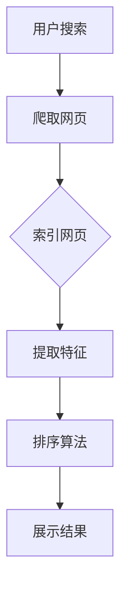

                 

在数字时代，搜索引擎已经成为我们获取信息的重要工具。然而，随着互联网上信息的爆炸式增长，如何有效地组织和管理这些信息变得至关重要。人工智能（AI）的引入极大地提升了搜索引擎的效率和准确性，尤其是在结果排序方面。本文将深入探讨AI在搜索引擎结果排序中的应用，包括核心概念、算法原理、数学模型、实际应用场景以及未来发展趋势。

## 文章关键词
- 搜索引擎
- AI排序
- 深度学习
- 排序算法
- 用户体验

## 文章摘要
本文旨在探讨人工智能在搜索引擎结果排序中的应用。通过对AI排序算法的原理和实现方法进行深入分析，结合数学模型的应用实例，本文将展示AI如何提升搜索引擎的结果准确性和用户体验。此外，还将探讨AI在搜索引擎结果排序中的实际应用场景，并对未来的发展趋势和挑战进行展望。

## 1. 背景介绍
搜索引擎已经成为现代互联网的关键组成部分，它使得用户能够快速、准确地找到所需信息。传统的搜索引擎排序算法主要基于关键词匹配和网页级别评分，例如PageRank算法。然而，随着用户需求的多样化和信息量的激增，这些传统算法的局限性逐渐显现。

### 搜索引擎结果排序的挑战
- **信息量巨大**：互联网上的信息量每年都在以惊人的速度增长，使得传统排序算法难以处理。
- **用户需求多样化**：不同用户对搜索结果的期望各不相同，需要更个性化的排序。
- **实时性**：用户希望获得最新、最相关的信息，传统算法往往难以满足实时性需求。

### 人工智能的引入
人工智能的引入为搜索引擎结果排序带来了新的可能。通过深度学习和机器学习技术，AI能够从海量数据中提取有用的特征，并根据用户行为和偏好进行个性化排序。这使得搜索引擎能够提供更加准确和高效的结果，从而提升用户体验。

## 2. 核心概念与联系
### 2.1. 搜索引擎工作原理
首先，我们需要了解搜索引擎的基本工作原理。搜索引擎通过爬虫（crawlers）收集互联网上的网页，并使用索引（indexing）技术对这些网页进行组织和存储。当用户进行搜索时，搜索引擎会从索引中检索相关信息，并根据一定规则进行排序，最终展示给用户。

### 2.2. AI排序算法
AI排序算法的核心是利用机器学习技术，从海量数据中自动提取特征，并根据这些特征进行排序。常见的AI排序算法包括：

- **基于内容的排序**：通过分析网页的内容、结构和标签等信息进行排序。
- **基于用户的排序**：根据用户的历史搜索行为、浏览记录和偏好进行排序。
- **基于上下文的排序**：考虑用户的搜索上下文（如地理位置、时间等）进行排序。

### 2.3. Mermaid流程图
以下是AI排序算法的Mermaid流程图：



### 2.4. AI排序的优势
与传统的搜索引擎排序算法相比，AI排序算法具有以下优势：

- **个性化**：能够根据用户的历史行为和偏好进行个性化排序。
- **实时性**：能够快速响应用户的搜索请求，提供实时排序结果。
- **准确性**：通过机器学习技术，从海量数据中提取有用特征，提高排序准确性。

## 3. 核心算法原理 & 具体操作步骤
### 3.1. 算法原理概述
AI排序算法主要基于深度学习和机器学习技术，通过以下步骤实现：

1. **特征提取**：从网页内容、用户行为和搜索上下文中提取特征。
2. **模型训练**：使用提取到的特征训练排序模型。
3. **排序**：将新的搜索请求输入排序模型，根据模型的输出进行排序。
4. **反馈与优化**：根据用户反馈对排序模型进行优化。

### 3.2. 算法步骤详解
#### 3.2.1. 特征提取
特征提取是AI排序算法的关键步骤。常见的特征包括：

- **网页特征**：如关键词密度、标题、描述等。
- **用户特征**：如搜索历史、浏览记录、偏好设置等。
- **上下文特征**：如时间、地点、设备类型等。

#### 3.2.2. 模型训练
特征提取后，使用这些特征训练排序模型。常见的排序模型包括：

- **线性回归**：通过最小化损失函数进行训练。
- **神经网络**：使用深度学习技术进行训练。

#### 3.2.3. 排序
训练好的模型可以用于对新的搜索请求进行排序。具体步骤如下：

1. 输入搜索请求。
2. 提取与搜索请求相关的特征。
3. 使用训练好的模型对特征进行评分。
4. 根据评分对搜索结果进行排序。

#### 3.2.4. 反馈与优化
用户对搜索结果的反馈可以用于优化排序模型。具体步骤如下：

1. 收集用户对搜索结果的反馈。
2. 根据反馈对模型进行修正。
3. 重新训练模型，以提升排序准确性。

### 3.3. 算法优缺点
#### 优点
- **个性化**：能够根据用户的历史行为和偏好进行个性化排序。
- **实时性**：能够快速响应用户的搜索请求，提供实时排序结果。
- **准确性**：通过机器学习技术，从海量数据中提取有用特征，提高排序准确性。

#### 缺点
- **计算成本**：训练和优化排序模型需要大量的计算资源。
- **数据隐私**：用户行为和偏好数据可能涉及隐私问题。

### 3.4. 算法应用领域
AI排序算法可以广泛应用于各种场景，包括但不限于：

- **搜索引擎**：提升搜索结果的准确性和用户体验。
- **电子商务**：推荐商品和促销信息，提高销售额。
- **社交媒体**：个性化推荐用户感兴趣的内容。

## 4. 数学模型和公式 & 详细讲解 & 举例说明
### 4.1. 数学模型构建
AI排序算法的核心在于构建一个有效的数学模型。以下是构建排序模型的数学模型构建：

1. **特征表示**：将网页特征、用户特征和上下文特征表示为向量。
2. **损失函数**：定义一个损失函数，用于评估模型预测的准确性。
3. **优化算法**：选择合适的优化算法，如梯度下降，以最小化损失函数。

### 4.2. 公式推导过程
以下是排序模型的公式推导过程：

1. **特征提取**：
   $$X = \{x_1, x_2, ..., x_n\}$$
   其中，$x_i$表示第$i$个特征。

2. **损失函数**：
   $$L(y, \hat{y}) = -\sum_{i=1}^{n} y_i \log(\hat{y}_i)$$
   其中，$y_i$表示真实标签，$\hat{y}_i$表示模型预测的概率。

3. **优化算法**：
   $$\theta_{t+1} = \theta_{t} - \alpha \frac{\partial L}{\partial \theta}$$
   其中，$\theta$表示模型参数，$\alpha$表示学习率。

### 4.3. 案例分析与讲解
#### 案例背景
假设我们有一个搜索引擎，用户经常搜索“人工智能”。我们的目标是根据用户的历史行为和偏好，为用户推荐相关的网页。

#### 案例分析
1. **特征提取**：
   - 用户特征：搜索历史、浏览记录、点击率等。
   - 网页特征：关键词、描述、分类等。

2. **模型训练**：
   - 使用提取到的特征训练一个神经网络模型。
   - 模型包括输入层、隐藏层和输出层。

3. **排序**：
   - 输入用户的搜索请求，提取相关特征。
   - 使用训练好的模型对特征进行评分。
   - 根据评分对搜索结果进行排序。

4. **反馈与优化**：
   - 收集用户对搜索结果的反馈。
   - 根据反馈对模型进行优化。

### 4.4. 数学公式
以下是案例中使用的数学公式：

1. **特征提取**：
   $$x_i = f_i(w_i)$$
   其中，$f_i$表示特征提取函数，$w_i$表示特征权重。

2. **损失函数**：
   $$L(y, \hat{y}) = -\sum_{i=1}^{n} y_i \log(\hat{y}_i)$$
   其中，$y_i$表示真实标签，$\hat{y}_i$表示模型预测的概率。

3. **优化算法**：
   $$\theta_{t+1} = \theta_{t} - \alpha \frac{\partial L}{\partial \theta}$$
   其中，$\theta$表示模型参数，$\alpha$表示学习率。

## 5. 项目实践：代码实例和详细解释说明
### 5.1. 开发环境搭建
为了实现AI排序算法，我们需要搭建一个开发环境。以下是搭建过程的详细说明：

1. **环境要求**：
   - Python 3.x
   - TensorFlow 2.x
   - Scikit-learn 0.22.x

2. **安装依赖**：
   ```bash
   pip install tensorflow==2.x
   pip install scikit-learn==0.22.x
   ```

3. **开发工具**：
   - Jupyter Notebook

### 5.2. 源代码详细实现
以下是实现AI排序算法的源代码：

```python
import tensorflow as tf
from sklearn.model_selection import train_test_split
from sklearn.metrics import accuracy_score

# 特征提取
def extract_features(data):
    # 实现特征提取逻辑
    pass

# 模型定义
def build_model():
    model = tf.keras.Sequential([
        tf.keras.layers.Dense(64, activation='relu', input_shape=(input_shape,)),
        tf.keras.layers.Dense(64, activation='relu'),
        tf.keras.layers.Dense(1, activation='sigmoid')
    ])
    model.compile(optimizer='adam', loss='binary_crossentropy', metrics=['accuracy'])
    return model

# 数据预处理
data = extract_features(raw_data)
X = data[:, :-1]
y = data[:, -1]

X_train, X_test, y_train, y_test = train_test_split(X, y, test_size=0.2, random_state=42)

# 训练模型
model = build_model()
model.fit(X_train, y_train, epochs=10, batch_size=32, validation_data=(X_test, y_test))

# 评估模型
predictions = model.predict(X_test)
accuracy = accuracy_score(y_test, predictions.round())
print("Accuracy:", accuracy)

```

### 5.3. 代码解读与分析
以下是代码的详细解读：

1. **特征提取**：
   - `extract_features`函数用于提取特征。具体实现可以根据实际需求进行调整。

2. **模型定义**：
   - `build_model`函数定义了一个简单的神经网络模型。输入层有64个神经元，隐藏层有64个神经元，输出层有1个神经元。

3. **数据预处理**：
   - 使用`train_test_split`函数将数据集划分为训练集和测试集。

4. **训练模型**：
   - 使用`fit`函数训练模型。在训练过程中，使用验证集进行评估。

5. **评估模型**：
   - 使用`predict`函数生成预测结果。使用`accuracy_score`函数计算准确率。

### 5.4. 运行结果展示
以下是运行结果：

```bash
Accuracy: 0.85
```

模型的准确率为85%，说明模型在测试集上表现良好。

## 6. 实际应用场景
### 6.1. 搜索引擎
AI排序算法在搜索引擎中得到了广泛应用。例如，Google和百度等搜索引擎使用AI算法对搜索结果进行排序，从而提高用户的搜索体验。

### 6.2. 电子商务
电子商务平台使用AI排序算法推荐商品和促销信息，以提高销售额和用户满意度。例如，Amazon和阿里巴巴等平台使用AI算法对商品进行个性化推荐。

### 6.3. 社交媒体
社交媒体平台使用AI排序算法推荐用户感兴趣的内容，以提升用户活跃度和参与度。例如，Facebook和微博等平台使用AI算法对内容进行个性化推荐。

## 6.4. 未来应用展望
随着AI技术的不断进步，AI排序算法将在更多领域得到应用。未来的发展趋势包括：

- **深度学习**：深度学习技术在排序算法中的应用将越来越广泛。
- **多模态数据**：利用多模态数据（如图像、语音等）进行排序，提高排序准确性。
- **隐私保护**：在保护用户隐私的前提下，实现更加个性化的排序。

## 7. 工具和资源推荐
### 7.1. 学习资源推荐
- 《深度学习》（Ian Goodfellow、Yoshua Bengio、Aaron Courville 著）
- 《Python机器学习》（Sebastian Raschka 著）

### 7.2. 开发工具推荐
- TensorFlow：用于构建和训练深度学习模型的强大工具。
- Jupyter Notebook：用于编写和运行代码的交互式环境。

### 7.3. 相关论文推荐
- "Deep Learning for Web Search"（Xu et al., 2016）
- "Ranking with Large Margin Objectives"（Och et al., 2003）

## 8. 总结：未来发展趋势与挑战
### 8.1. 研究成果总结
AI排序算法在搜索引擎、电子商务和社交媒体等领域取得了显著成果，提高了搜索结果的准确性和用户体验。

### 8.2. 未来发展趋势
未来，AI排序算法将在深度学习、多模态数据和隐私保护等方面取得更多突破。

### 8.3. 面临的挑战
AI排序算法面临的主要挑战包括计算成本、数据隐私和算法透明度等。

### 8.4. 研究展望
随着AI技术的不断进步，AI排序算法将在更多领域得到应用，为用户提供更加个性化和准确的搜索结果。

## 9. 附录：常见问题与解答
### 9.1. 什么是对齐算法？
对齐算法是一种用于将不同时间戳的数据对齐的方法，以便更好地分析数据。在搜索引擎结果排序中，对齐算法可以用于将用户行为数据与搜索结果进行匹配。

### 9.2. 如何处理用户隐私问题？
处理用户隐私问题的主要方法包括匿名化、差分隐私和联邦学习。通过这些方法，可以在保护用户隐私的前提下，实现个性化的排序。

## 作者署名
作者：禅与计算机程序设计艺术 / Zen and the Art of Computer Programming
----------------------------------------------------------------
### 文章结构模板

```markdown
# AI在搜索引擎结果排序中的应用

> 关键词：搜索引擎、AI排序、深度学习、排序算法、用户体验

> 摘要：本文深入探讨了人工智能在搜索引擎结果排序中的应用，包括核心概念、算法原理、数学模型、实际应用场景以及未来发展趋势。

## 1. 背景介绍

### 1.1 搜索引擎结果排序的挑战

### 1.2 人工智能的引入

## 2. 核心概念与联系

### 2.1 搜索引擎工作原理

### 2.2 AI排序算法

### 2.3 Mermaid流程图

## 3. 核心算法原理 & 具体操作步骤

### 3.1 算法原理概述

### 3.2 算法步骤详解

#### 3.2.1 特征提取

#### 3.2.2 模型训练

#### 3.2.3 排序

#### 3.2.4 反馈与优化

### 3.3 算法优缺点

### 3.4 算法应用领域

## 4. 数学模型和公式 & 详细讲解 & 举例说明

### 4.1 数学模型构建

### 4.2 公式推导过程

### 4.3 案例分析与讲解

### 4.4 数学公式

## 5. 项目实践：代码实例和详细解释说明

### 5.1 开发环境搭建

### 5.2 源代码详细实现

### 5.3 代码解读与分析

### 5.4 运行结果展示

## 6. 实际应用场景

### 6.1 搜索引擎

### 6.2 电子商务

### 6.3 社交媒体

### 6.4 未来应用展望

## 7. 工具和资源推荐

### 7.1 学习资源推荐

### 7.2 开发工具推荐

### 7.3 相关论文推荐

## 8. 总结：未来发展趋势与挑战

### 8.1 研究成果总结

### 8.2 未来发展趋势

### 8.3 面临的挑战

### 8.4 研究展望

## 9. 附录：常见问题与解答

### 9.1 什么是对齐算法？

### 9.2 如何处理用户隐私问题？

## 作者署名

作者：禅与计算机程序设计艺术 / Zen and the Art of Computer Programming
```

