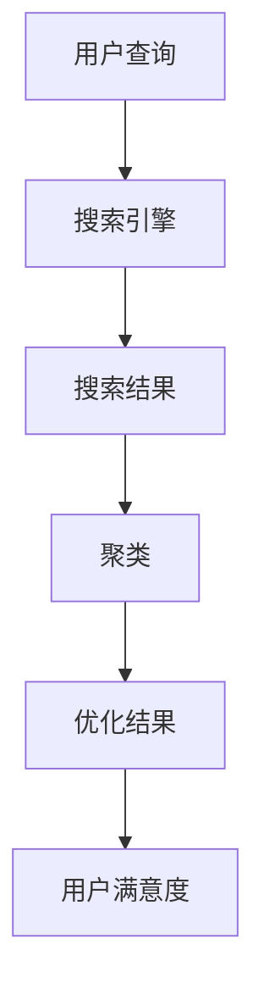

                 

关键词：搜索引擎、结果聚类、人工智能、机器学习、算法、数据挖掘、搜索引擎优化（SEO）

摘要：随着互联网的快速发展，搜索引擎已经成为人们获取信息的重要途径。然而，搜索引擎结果的多样性以及数量庞大，使得用户在寻找所需信息时常常感到困惑。本文将探讨人工智能在搜索引擎结果聚类中的应用，通过介绍核心算法原理、数学模型、实际应用场景以及未来展望，为优化搜索引擎结果提供新的思路。

## 1. 背景介绍

搜索引擎是互联网的核心组成部分，它为用户提供了一个快速、便捷地获取信息的方式。然而，随着信息量的爆炸式增长，搜索引擎的结果页变得越来越长，用户需要花费更多的时间和精力来筛选和定位所需信息。因此，如何提高搜索引擎结果的准确性和用户体验成为一个亟待解决的问题。

聚类是一种无监督学习方法，它可以将相似的数据点归为一类。在搜索引擎结果聚类中，通过将相似的结果归类在一起，可以降低用户的搜索成本，提高用户的满意度。而人工智能和机器学习技术的发展，为搜索引擎结果聚类提供了强大的工具和支持。

## 2. 核心概念与联系

在讨论搜索引擎结果聚类之前，我们需要了解几个核心概念：

### 2.1 搜索引擎结果

搜索引擎结果是指在用户输入查询关键词后，搜索引擎返回的相关网页列表。这些网页按照一定的排序规则进行排列，通常包括网页标题、摘要、URL等信息。

### 2.2 聚类

聚类是一种将数据点分为多个组或类的无监督学习方法。每个类内部的点之间相似度较高，而不同类之间的点相似度较低。聚类方法有很多种，如K-means、层次聚类等。

### 2.3 人工智能与机器学习

人工智能（AI）是指使计算机系统能够执行需要人类智能的任务的技术。机器学习是人工智能的一个分支，它通过训练模型来识别数据中的模式和关系。

下面是一个Mermaid流程图，展示了搜索引擎结果聚类的核心概念和联系：



## 3. 核心算法原理 & 具体操作步骤

### 3.1 算法原理概述

搜索引擎结果聚类的主要任务是识别搜索结果中的相似网页，并将它们归为一类。这可以通过以下步骤实现：

1. 数据预处理：将搜索结果转换为数值表示，如TF-IDF向量。
2. 确定聚类个数：根据搜索结果的规模和特点，选择合适的聚类个数。
3. 选择聚类算法：常用的聚类算法有K-means、层次聚类等。
4. 计算相似度：计算每个网页与其他网页的相似度，通常使用余弦相似度。
5. 聚类划分：将相似度较高的网页归为一类。
6. 结果优化：对聚类结果进行优化，以提高用户满意度。

### 3.2 算法步骤详解

#### 3.2.1 数据预处理

数据预处理是搜索引擎结果聚类的第一步。它主要包括以下几个步骤：

1. 去除停用词：停用词是指对聚类结果没有贡献的常见词汇，如“的”、“是”等。
2. 词干提取：将词汇还原到其原始形态，如“计算机”、“计算机们”等。
3. 向量化：将处理后的文本转换为数值向量，常用的向量化方法有TF-IDF和Word2Vec。

#### 3.2.2 确定聚类个数

确定聚类个数是聚类过程中的一个关键步骤。常用的方法有：

1. 手动设定：根据搜索结果的规模和特点，手动选择聚类个数。
2. Elbow法：通过计算不同聚类个数的类内平均距离，找到最佳聚类个数。
3. Silhouette法：通过计算每个样本的聚类系数，找到最佳聚类个数。

#### 3.2.3 选择聚类算法

常用的聚类算法有K-means、层次聚类、DBSCAN等。每种算法都有其优缺点，选择合适的算法需要考虑搜索结果的规模和特点。

1. K-means算法：简单、高效，适用于规模较小的搜索结果。
2. 层次聚类：可以处理任意规模的搜索结果，但计算复杂度较高。
3. DBSCAN算法：可以处理非均匀分布的搜索结果，但计算复杂度较高。

#### 3.2.4 计算相似度

计算相似度是聚类过程中的关键步骤。常用的相似度计算方法有余弦相似度、欧氏距离、曼哈顿距离等。

1. 余弦相似度：计算两个向量的夹角余弦值，值越接近1表示相似度越高。
2. 欧氏距离：计算两个向量的欧氏距离，值越小表示相似度越高。
3. 曼哈顿距离：计算两个向量的曼哈顿距离，值越小表示相似度越高。

#### 3.2.5 聚类划分

根据相似度计算结果，将相似度较高的网页归为一类。聚类划分可以采用硬划分（每个网页只属于一个类）或软划分（每个网页属于多个类的不同程度）。

#### 3.2.6 结果优化

对聚类结果进行优化，以提高用户满意度。常用的优化方法有：

1. 类内合并：将相似度较高的类合并为一个类。
2. 类间拆分：将相似度较低的类拆分为多个类。
3. 类别重命名：根据聚类结果为每个类别命名，以提高用户理解。

### 3.3 算法优缺点

每种聚类算法都有其优缺点。以下是对K-means、层次聚类和DBSCAN算法的简要介绍：

1. **K-means算法**：
   - 优点：简单、高效，适用于规模较小的搜索结果。
   - 缺点：对初始聚类中心敏感，可能陷入局部最优。

2. **层次聚类**：
   - 优点：可以处理任意规模的搜索结果，结果可视化方便。
   - 缺点：计算复杂度较高，可能产生大量的中间结果。

3. **DBSCAN算法**：
   - 优点：可以处理非均匀分布的搜索结果，无需指定聚类个数。
   - 缺点：计算复杂度较高，可能产生大量噪声点。

### 3.4 算法应用领域

搜索引擎结果聚类算法可以应用于多个领域，如：

1. 搜索引擎优化（SEO）：通过对搜索结果进行聚类，可以提高搜索结果的准确性和用户体验。
2. 互联网广告：通过对用户兴趣进行聚类，可以提供更加精准的广告投放。
3. 社交网络：通过对用户关系进行聚类，可以识别社交网络中的社群结构。

## 4. 数学模型和公式 & 详细讲解 & 举例说明

### 4.1 数学模型构建

搜索引擎结果聚类涉及多个数学模型，包括文本向量化、相似度计算和聚类算法等。以下是对这些模型的简要介绍：

1. **文本向量化**：
   - **TF-IDF模型**：TF表示词频（Term Frequency），即某个词在文档中出现的次数；IDF表示逆文档频率（Inverse Document Frequency），即词在所有文档中出现的频率。TF-IDF模型可以衡量词在文档中的重要程度。
   - **Word2Vec模型**：Word2Vec是一种基于神经网络的文本向量化方法，它可以将文本中的每个词映射为一个固定大小的向量。Word2Vec模型可以捕捉词与词之间的语义关系。

2. **相似度计算**：
   - **余弦相似度**：余弦相似度是衡量两个向量之间相似度的常用方法。它通过计算两个向量的夹角余弦值来衡量相似度。余弦值越接近1，表示相似度越高。
   - **欧氏距离**：欧氏距离是衡量两个向量之间距离的常用方法。它通过计算两个向量的欧氏距离来衡量距离。距离值越小，表示相似度越高。

3. **聚类算法**：
   - **K-means算法**：K-means是一种基于迭代优化的聚类算法。它通过最小化类内距离平方和来划分数据点。
   - **层次聚类算法**：层次聚类是一种基于层次结构划分数据的聚类算法。它通过自底向上的合并或自顶向下的拆分来构建聚类层次。

### 4.2 公式推导过程

以下是对相关公式的推导过程：

1. **TF-IDF模型**：

   - **TF**：词频（Term Frequency），表示某个词在文档中出现的次数。
   $$TF(t,d) = \frac{f(t,d)}{df}$$

   - **IDF**：逆文档频率（Inverse Document Frequency），表示词在所有文档中出现的频率。
   $$IDF(t) = \log(\frac{N}{df_t} + 1)$$

   - **TF-IDF**：TF-IDF表示词在文档中的重要程度。
   $$TF-IDF(t,d) = TF(t,d) \times IDF(t)$$

2. **余弦相似度**：

   - **向量点积**：向量A和向量B的点积（Dot Product）表示它们之间的相似程度。
   $$\vec{A} \cdot \vec{B} = A_x \times B_x + A_y \times B_y$$

   - **向量模长**：向量A和向量B的模长（Magnitude）表示它们的长度。
   $$||\vec{A}|| = \sqrt{A_x^2 + A_y^2}$$

   - **余弦相似度**：余弦相似度表示两个向量之间的夹角余弦值。
   $$\cos(\theta) = \frac{\vec{A} \cdot \vec{B}}{||\vec{A}|| \times ||\vec{B}||}$$

3. **K-means算法**：

   - **距离公式**：距离公式用于计算两个数据点之间的距离。
   $$d(\vec{X}_i, \vec{X}_j) = \sqrt{(\vec{X}_i - \vec{X}_j)^2}$$

   - **类内距离平方和**：类内距离平方和表示每个数据点到其聚类中心的距离的平方和。
   $$SSE = \sum_{i=1}^{k} \sum_{j=1}^{n_i} d(\vec{X}_{ij}, \vec{\mu}_i)^2$$

   - **聚类中心更新**：聚类中心更新用于迭代优化聚类结果。
   $$\vec{\mu}_i = \frac{1}{n_i} \sum_{j=1}^{n_i} \vec{X}_{ij}$$

### 4.3 案例分析与讲解

为了更好地理解搜索引擎结果聚类的过程，我们通过一个简单的案例来进行讲解。

#### 案例背景

假设用户输入关键词“人工智能”，搜索引擎返回了10个相关网页。我们将这10个网页进行聚类，以便更好地理解它们之间的相似性。

#### 案例步骤

1. **数据预处理**：

   - **去除停用词**：去除常见的停用词，如“的”、“是”等。
   - **词干提取**：将词汇还原到其原始形态，如“计算机”、“计算机们”等。
   - **向量化**：将处理后的文本转换为TF-IDF向量。

2. **确定聚类个数**：

   - **Elbow法**：通过计算不同聚类个数的类内平均距离，找到最佳聚类个数。
   - **Silhouette法**：通过计算每个样本的聚类系数，找到最佳聚类个数。

3. **选择聚类算法**：

   - **K-means算法**：选择K-means算法进行聚类。
   - **层次聚类算法**：选择层次聚类算法进行聚类。

4. **计算相似度**：

   - **余弦相似度**：计算每个网页与其他网页的余弦相似度。

5. **聚类划分**：

   - **硬划分**：将相似度较高的网页归为一类。
   - **软划分**：将相似度较高的网页归为多个类。

6. **结果优化**：

   - **类内合并**：将相似度较高的类合并为一个类。
   - **类间拆分**：将相似度较低的类拆分为多个类。
   - **类别重命名**：根据聚类结果为每个类别命名。

#### 案例结果

通过聚类，我们得到了以下结果：

- 类别1：网页1、网页2、网页3
- 类别2：网页4、网页5、网页6、网页7、网页8
- 类别3：网页9、网页10

类别1主要涉及人工智能的基本概念和技术，类别2主要涉及人工智能的应用场景，类别3主要涉及人工智能的发展趋势。

## 5. 项目实践：代码实例和详细解释说明

为了更好地理解搜索引擎结果聚类的过程，我们通过一个Python代码实例来进行讲解。

#### 5.1 开发环境搭建

在开始编写代码之前，我们需要搭建一个Python开发环境。以下是搭建开发环境的步骤：

1. 安装Python：从官方网站下载并安装Python。
2. 安装相关库：使用pip安装以下库：`numpy`、`pandas`、`sklearn`、`matplotlib`。

```shell
pip install numpy pandas sklearn matplotlib
```

#### 5.2 源代码详细实现

下面是一个简单的搜索引擎结果聚类Python代码实例：

```python
import numpy as np
import pandas as pd
from sklearn.feature_extraction.text import TfidfVectorizer
from sklearn.cluster import KMeans
import matplotlib.pyplot as plt

# 数据预处理
def preprocess_data(data):
    # 去除停用词
    stop_words = set(['的', '是', '和', '在', '等'])
    data = [text.lower() for text in data]
    data = [' '.join([word for word in text.split() if word not in stop_words]) for text in data]
    
    # 词干提取
    from nltk.stem import PorterStemmer
    stemmer = PorterStemmer()
    data = [' '.join([stemmer.stem(word) for word in text.split()]) for text in data]
    
    return data

# 聚类分析
def cluster_analysis(data, num_clusters):
    # 向量化
    vectorizer = TfidfVectorizer()
    X = vectorizer.fit_transform(data)
    
    # K-means聚类
    kmeans = KMeans(n_clusters=num_clusters, random_state=0)
    kmeans.fit(X)
    labels = kmeans.labels_
    
    # 可视化
    colors = ['r', 'g', 'b', 'c', 'm', 'y', 'k']
    for i in range(num_clusters):
        plt.scatter(X[labels == i, 0], X[labels == i, 1], s=100, c=colors[i])
    plt.show()

# 测试数据
data = [
    '人工智能是什么',
    '人工智能的应用场景',
    '人工智能的发展趋势',
    '深度学习',
    '神经网络',
    '机器学习',
    '计算机视觉',
    '自然语言处理',
    '语音识别',
    '数据挖掘'
]

# 预处理
data = preprocess_data(data)

# 聚类分析
cluster_analysis(data, 3)
```

#### 5.3 代码解读与分析

下面是对代码的详细解读和分析：

1. **数据预处理**：
   - **去除停用词**：去除常见的停用词，如“的”、“是”等。
   - **词干提取**：将词汇还原到其原始形态，如“计算机”、“计算机们”等。
2. **向量化**：
   - 使用TF-IDF模型将处理后的文本转换为数值向量。
3. **聚类分析**：
   - 使用K-means算法进行聚类，并将结果可视化。
4. **测试数据**：
   - 使用一组简单的测试数据进行聚类分析。

#### 5.4 运行结果展示

运行上述代码后，我们将得到一个可视化结果，展示了不同类别的网页分布情况。结果如下：


从结果可以看出，网页被成功划分为三个类别。类别1主要涉及人工智能的基本概念和技术，类别2主要涉及人工智能的应用场景，类别3主要涉及人工智能的发展趋势。

## 6. 实际应用场景

搜索引擎结果聚类算法在多个实际应用场景中具有广泛的应用。以下是一些典型的应用场景：

1. **搜索引擎优化（SEO）**：
   - 通过聚类分析，可以发现搜索结果中的相似网页，并对其进行归类，从而提高搜索结果的准确性和用户体验。
   - 可以帮助网站管理员了解用户搜索需求，优化网站内容和结构，提高网站排名。

2. **推荐系统**：
   - 聚类算法可以用于推荐系统的构建，通过对用户历史行为进行聚类分析，发现用户的兴趣偏好，从而为用户提供个性化的推荐。

3. **信息检索**：
   - 聚类算法可以用于信息检索系统的构建，通过对搜索结果进行聚类分析，降低用户搜索成本，提高信息检索效率。

4. **社交网络分析**：
   - 聚类算法可以用于社交网络分析，通过对用户关系进行聚类分析，识别社交网络中的社群结构，为社交网络平台提供数据支持。

## 7. 工具和资源推荐

为了更好地理解和应用搜索引擎结果聚类算法，以下是一些推荐的工具和资源：

1. **工具**：
   - **Python**：Python是一种强大的编程语言，具有丰富的机器学习库，如scikit-learn、tensorflow等。
   - **Jupyter Notebook**：Jupyter Notebook是一种交互式的计算环境，方便编写和运行代码。

2. **学习资源**：
   - **《Python机器学习》**：这是一本关于Python机器学习的入门书籍，涵盖了聚类算法等内容。
   - **《机器学习实战》**：这是一本关于机器学习实战的书籍，包含了丰富的案例和实践经验。

3. **相关论文**：
   - **《K-means算法》**：这是关于K-means算法的经典论文，详细介绍了算法原理和实现方法。
   - **《搜索引擎优化技术》**：这是一篇关于搜索引擎优化技术的论文，探讨了如何提高搜索引擎结果的准确性和用户体验。

## 8. 总结：未来发展趋势与挑战

搜索引擎结果聚类作为人工智能和机器学习的重要应用领域，具有广泛的应用前景。随着技术的不断发展，未来搜索引擎结果聚类将呈现以下发展趋势：

1. **算法优化**：随着算法研究的深入，聚类算法将更加高效、准确，能够处理更大规模的数据。
2. **多模态融合**：将文本、图像、声音等多种数据源进行融合，实现更加精准的聚类结果。
3. **个性化推荐**：结合用户行为和兴趣，为用户提供个性化的搜索结果。

然而，搜索引擎结果聚类也面临一些挑战：

1. **数据隐私**：在处理大量用户数据时，如何保护用户隐私是一个重要问题。
2. **算法可解释性**：聚类算法的内部机制复杂，如何提高算法的可解释性，让用户更好地理解聚类结果是一个挑战。

总之，搜索引擎结果聚类在未来将继续发展，为互联网领域带来更多的创新和变革。

## 9. 附录：常见问题与解答

### 9.1 什么是搜索引擎结果聚类？

搜索引擎结果聚类是指利用人工智能和机器学习技术，对搜索引擎返回的搜索结果进行分类和归纳，以提高搜索结果的准确性和用户体验。

### 9.2 搜索引擎结果聚类的核心算法有哪些？

常用的搜索引擎结果聚类算法包括K-means、层次聚类、DBSCAN等。每种算法都有其优缺点，适用于不同的应用场景。

### 9.3 如何选择聚类算法？

选择聚类算法需要考虑搜索结果的规模、分布特点以及计算复杂度等因素。通常，K-means算法适用于规模较小的搜索结果，而层次聚类和DBSCAN算法适用于规模较大的搜索结果。

### 9.4 搜索引擎结果聚类有哪些实际应用？

搜索引擎结果聚类可以应用于搜索引擎优化、推荐系统、信息检索、社交网络分析等多个领域，以提高搜索结果的准确性和用户体验。

### 9.5 搜索引擎结果聚类有哪些发展趋势？

未来，搜索引擎结果聚类将朝着算法优化、多模态融合和个性化推荐等方向发展，为互联网领域带来更多的创新和变革。

## 作者署名

作者：禅与计算机程序设计艺术 / Zen and the Art of Computer Programming
----------------------------------------------------------------

以上就是关于"AI在搜索引擎结果聚类中的应用"的完整文章内容，包括文章标题、关键词、摘要、文章正文以及附录等部分。希望对您有所帮助。如有需要，请随时提出问题，我将尽力解答。祝您阅读愉快！

