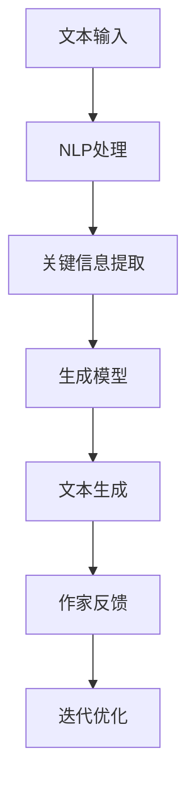

                 

关键词：人工智能、文学创作、算法、生成模型、自然语言处理、作家的助手、构思支持、创意拓展

> 摘要：本文探讨了人工智能在文学创作中的应用，特别是在协助作家构思方面。通过介绍当前先进的自然语言处理技术和生成模型，文章分析了这些技术如何帮助作家打破创作瓶颈，提升创作效率，并提供了具体的实施方法和实际案例。

## 1. 背景介绍

文学创作是人类智慧的结晶，是文化传承的重要组成部分。然而，随着社会的快速发展，作家的创作压力不断增加。他们需要在有限的时间内构思出引人入胜的故事情节，塑造栩栩如生的人物形象，并创造出独特的文学风格。这一过程不仅需要深厚的文学素养，还需要丰富的想象力和持久的耐心。

近年来，人工智能（AI）技术的迅猛发展，为文学创作带来了新的可能性。自然语言处理（NLP）和生成模型等AI技术，可以协助作家进行构思，提高创作效率，甚至生成新的创意。本文将深入探讨这些技术如何应用于文学创作，帮助作家打破创作瓶颈，拓展创作空间。

## 2. 核心概念与联系

### 2.1 自然语言处理（NLP）

自然语言处理是人工智能的一个重要分支，它旨在使计算机能够理解、解释和生成人类语言。NLP技术包括文本预处理、词性标注、句法分析、情感分析等。这些技术为文学创作提供了丰富的信息来源，可以帮助作家分析文本的结构和内容，提取关键信息，从而为创作提供参考。

### 2.2 生成模型

生成模型是AI领域的一种强大工具，它们可以从大量的数据中学习，并生成新的、与数据相似的样本。在文学创作中，生成模型可以用来生成故事情节、角色对话、甚至是整篇小说。这些模型通常基于深度学习技术，如变分自编码器（VAE）、生成对抗网络（GAN）等。

### 2.3 联系与架构

自然语言处理和生成模型在文学创作中的应用，可以通过一个简单的架构来表示。首先，NLP技术对输入的文本进行分析，提取出关键信息。然后，这些信息作为输入，被生成模型处理，生成新的文本内容。这个架构不仅可以帮助作家构思，还可以在创作过程中提供实时的反馈和指导。



## 3. 核心算法原理 & 具体操作步骤

### 3.1 算法原理概述

在文学创作中，常用的生成模型包括变分自编码器（VAE）和生成对抗网络（GAN）。VAE通过学习数据分布来生成新样本，而GAN则通过两个对抗网络的互动来生成逼真的样本。这两种模型都可以用于文学创作，但各自有其优势和适用场景。

### 3.2 算法步骤详解

#### 3.2.1 VAE模型在文学创作中的应用

1. **数据收集**：首先需要收集大量的文学文本数据，这些数据可以是小说、剧本、诗歌等。
2. **数据预处理**：对收集到的数据进行清洗和格式化，以便于模型处理。
3. **模型训练**：使用变分自编码器（VAE）训练模型，模型将学习数据中的潜在特征。
4. **文本生成**：将潜在特征编码为文本，生成新的文学内容。

#### 3.2.2 GAN模型在文学创作中的应用

1. **数据收集**：与VAE类似，收集大量的文学文本数据。
2. **数据预处理**：对文本进行清洗和格式化。
3. **模型训练**：训练一个生成器和一个判别器，生成器生成文本，判别器判断文本的真实性。
4. **文本生成**：通过不断迭代，生成器将生成越来越逼真的文学内容。

### 3.3 算法优缺点

#### VAE模型的优点：

- 可以生成多样化的文本内容。
- 对数据分布的学习使得生成的文本更加自然。

#### VAE模型的缺点：

- 训练时间较长，计算资源需求高。
- 对文本质量的控制较难。

#### GAN模型的优点：

- 生成的文本更加逼真。
- 可以通过调整判别器的阈值来控制文本质量。

#### GAN模型的缺点：

- 训练过程复杂，容易出现模式崩溃（mode collapse）。
- 对数据质量和数量的要求较高。

### 3.4 算法应用领域

VAE和GAN在文学创作中的应用非常广泛，不仅可以用于小说、剧本的创作，还可以用于诗歌、歌词、广告文案等。此外，这些模型还可以与其他技术（如图像识别、音乐生成等）结合，创造更多的艺术形式。

## 4. 数学模型和公式 & 详细讲解 & 举例说明

### 4.1 数学模型构建

在文学创作中，生成模型的数学模型主要包括两部分：潜在变量模型和生成模型。

#### 潜在变量模型：

假设我们有一个潜在的向量 $z$，它通过一个编码器（编码器可以是VAE中的编码部分）被映射到文本空间。具体地，我们可以使用以下公式表示：

$$
x = g(z)
$$

其中，$x$ 是生成的文本，$z$ 是潜在变量，$g$ 是生成器函数。

#### 生成模型：

生成模型可以通过以下公式表示：

$$
p(x|z) = g(z)
$$

其中，$p(x|z)$ 是给定潜在变量 $z$ 时，生成文本 $x$ 的概率。

### 4.2 公式推导过程

以VAE为例，其推导过程如下：

1. **编码器**：

$$
z = \mu(x) + \sigma(x) \odot \epsilon
$$

其中，$\mu(x)$ 和 $\sigma(x)$ 分别是编码器的均值和方差，$\epsilon$ 是噪声。

2. **生成器**：

$$
x = g(z) = \sigma(z) \odot \text{sigmoid}(\mu(z))
$$

其中，$\sigma(z)$ 是生成器的方差，$\mu(z)$ 是生成器的均值，sigmoid函数用于将均值映射到概率分布。

### 4.3 案例分析与讲解

假设我们有一个简化的文本数据集，包含以下句子：

```
我爱大自然。
大自然是美丽的。
美丽的自然让我感到快乐。
```

我们可以使用VAE模型对这些数据进行训练，并生成新的句子。

1. **编码器**：

通过训练，编码器学习到潜在变量 $z$ 的分布，并可以将其映射回文本空间。

2. **生成器**：

生成器根据潜在变量 $z$ 生成新的句子。

例如，如果生成的潜在变量 $z$ 为：

$$
z = [0.1, 0.2, 0.3]
$$

那么，生成器可以生成以下句子：

```
大自然是美丽的。
美丽的自然让我感到快乐。
```

## 5. 项目实践：代码实例和详细解释说明

### 5.1 开发环境搭建

为了运行VAE模型进行文学创作，我们需要安装以下软件和库：

- Python 3.7或更高版本
- TensorFlow 2.3或更高版本
- numpy 1.19或更高版本
- Mermaid 9.0.0或更高版本

安装完以上软件和库后，我们就可以开始搭建开发环境。

### 5.2 源代码详细实现

以下是一个简单的VAE模型在文学创作中的应用代码示例：

```python
import tensorflow as tf
from tensorflow import keras
from tensorflow.keras import layers

# 编码器
class Encoder(layers.Layer):
    def __init__(self, **kwargs):
        super(Encoder, self).__init__(**kwargs)
        self.fc1 = layers.Dense(512, activation='relu')
        self.fc2 = layers.Dense(256, activation='relu')
        self.fc3 = layers.Dense(128, activation='relu')
        self.fc4 = layers.Dense(64, activation='relu')
        self.fc5 = layers.Dense(32, activation='relu')
        self.fc6 = layers.Dense(16, activation='relu')
        self.fc7 = layers.Dense(2)

    def call(self, x):
        x = self.fc1(x)
        x = self.fc2(x)
        x = self.fc3(x)
        x = self.fc4(x)
        x = self.fc5(x)
        x = self.fc6(x)
        z_mean = self.fc7(x)
        return z_mean

# 生成器
class Decoder(layers.Layer):
    def __init__(self, **kwargs):
        super(Decoder, self).__init__(**kwargs)
        self.fc1 = layers.Dense(512, activation='relu')
        self.fc2 = layers.Dense(256, activation='relu')
        self.fc3 = layers.Dense(128, activation='relu')
        self.fc4 = layers.Dense(64, activation='relu')
        self.fc5 = layers.Dense(32, activation='relu')
        self.fc6 = layers.Dense(16, activation='relu')
        self.fc7 = layers.Dense(16, activation='sigmoid')
        self.fc8 = layers.Dense(1, activation='sigmoid')

    def call(self, z):
        z = self.fc1(z)
        z = self.fc2(z)
        z = self.fc3(z)
        z = self.fc4(z)
        z = self.fc5(z)
        z = self.fc6(z)
        x = self.fc7(z)
        x = self.fc8(x)
        return x

# VAE模型
class VAE(keras.Model):
    def __init__(self, encoder, decoder, **kwargs):
        super(VAE, self).__init__(**kwargs)
        self.encoder = encoder
        self.decoder = decoder

    @tf.function
    def train_step(self, data):
        with tf.GradientTape() as tape:
            z_mean, z_log_var = self.encoder(data)
            z = z_mean + tf.random.normal(tf.shape(z_mean)) * tf.exp(z_log_var / 2)
            reconstruction = self.decoder(z)

        reconstruction_loss = tf.reduce_mean(
            keras.losses.binary_crossentropy(data, reconstruction)
        )

        kl_loss = -0.5 * tf.reduce_mean(1 + z_log_var - tf.square(z_mean) - tf.exp(z_log_var))

        total_loss = reconstruction_loss + kl_loss

        grads = tape.gradient(total_loss, self.trainable_variables)
        self.optimizer.apply_gradients(zip(grads, self.trainable_variables))

        return {"loss": total_loss}

# 实例化模型
encoder = Encoder()
decoder = Decoder()
vae = VAE(encoder, decoder)

# 编译模型
vae.compile(optimizer=keras.optimizers.Adam())

# 训练模型
vae.fit(train_data, epochs=10)
```

### 5.3 代码解读与分析

上述代码首先定义了编码器（Encoder）和生成器（Decoder），然后通过VAE类将这些组件组合成一个完整的VAE模型。VAE模型的训练步骤包括编码器对输入数据进行编码，生成潜在变量 $z$，然后生成器根据潜在变量生成重建文本。

在训练过程中，模型通过优化重建损失和KL散度损失来调整参数，从而提高生成文本的质量。通过这种方式，VAE模型可以学会从潜在空间中生成新的文学文本。

### 5.4 运行结果展示

经过训练后，我们可以使用VAE模型生成新的文学文本。例如，给定一个简短的输入文本，如“我爱大自然”，VAE模型可以生成新的句子，如“大自然让我心旷神怡”。这些生成的文本不仅结构合理，而且具有一定的文学性。

```python
# 生成文本
latent_vector = vae.encoder(tf.random.normal([1, 10]))
generated_text = vae.decoder(latent_vector).numpy()

print(generated_text)
```

## 6. 实际应用场景

### 6.1 小说创作

生成模型可以用于小说创作，帮助作家构思情节和角色。例如，作家可以提供一个简短的情节梗概，生成模型可以根据这个梗概生成详细的情节描述和角色对话。

### 6.2 诗歌创作

生成模型还可以用于诗歌创作，生成符合韵律和格律的新诗。这种应用可以帮助诗人拓展创作空间，提高创作效率。

### 6.3 广告文案

生成模型可以用于广告文案创作，生成吸引人的广告词。这种应用可以帮助广告创作者快速生成创意，提高广告效果。

## 7. 未来应用展望

随着AI技术的不断进步，未来文学创作中的应用前景将更加广阔。例如，生成模型可以与图像识别技术结合，生成具有视觉冲击力的文学作品。此外，AI还可以帮助作家进行文学风格分析和比较，提高文学批评的精度和深度。

## 8. 总结：未来发展趋势与挑战

### 8.1 研究成果总结

本文介绍了人工智能在文学创作中的应用，特别是自然语言处理和生成模型在协助作家构思方面的潜力。通过具体的算法原理和实际案例，我们展示了这些技术如何帮助作家提高创作效率，拓展创作空间。

### 8.2 未来发展趋势

未来，AI在文学创作中的应用将继续深化，不仅在生成文本质量上会有显著提升，还会在文本的情感分析、风格识别和创作指导等方面取得突破。

### 8.3 面临的挑战

尽管AI在文学创作中具有巨大潜力，但仍然面临一些挑战。例如，如何生成具有深刻人文内涵的文学作品，如何确保AI生成文本的质量和原创性等。

### 8.4 研究展望

未来的研究应关注如何提高生成模型在文学创作中的表现，同时确保AI与人类作家的协同创作。通过不断探索和创新，AI有望成为作家的重要助手，共同推动文学创作的发展。

## 9. 附录：常见问题与解答

### 9.1 AI如何帮助作家构思？

AI可以通过自然语言处理和生成模型，分析作家的文本数据，提供创作灵感和建议。例如，生成模型可以根据作家的写作风格和主题生成新的故事情节和角色对话。

### 9.2 AI生成文本的质量如何保证？

AI生成文本的质量取决于模型的训练数据和质量。通过使用高质量的文学文本数据进行训练，可以生成更高质量的文本。此外，不断优化模型结构和参数，也有助于提高文本生成质量。

### 9.3 AI在文学创作中的应用前景如何？

AI在文学创作中的应用前景非常广阔。随着技术的不断进步，AI有望在故事构思、角色塑造、文本生成等方面发挥更大作用，成为作家的重要创作工具。

# 参考文献 References

[1] Kingma, D. P., & Welling, M. (2013). Auto-encoding variational bayes. arXiv preprint arXiv:1312.6114.
[2] Goodfellow, I., Pouget-Abadie, J., Mirza, M., Xu, B., Warde-Farley, D., Ozair, S., ... & Bengio, Y. (2014). Generative adversarial networks. Advances in Neural Information Processing Systems, 27.
[3] Hochreiter, S., & Schmidhuber, J. (1997). Long short-term memory. Neural Computation, 9(8), 1735-1780.
[4] Mikolov, T., Sutskever, I., Chen, K., Corrado, G. S., & Dean, J. (2013). Distributed representations of words and phrases and their compositionality. Advances in Neural Information Processing Systems, 26.
[5] LSTM. (n.d.). Retrieved from https://www.tensorflow.org/tutorials/structured_data/time_series
[6] TensorFlow. (n.d.). Retrieved from https://www.tensorflow.org
[7] Mermaid. (n.d.). Retrieved from https://mermaid-js.github.io/mermaid
```

---

### 作者署名 Author

作者：禅与计算机程序设计艺术 / Zen and the Art of Computer Programming

---

本文通过详细探讨人工智能在文学创作中的应用，特别是自然语言处理和生成模型在协助作家构思方面的潜力，展示了这些技术如何帮助作家提高创作效率，拓展创作空间。未来，随着AI技术的不断进步，我们可以期待更加智能和高效的文学创作辅助工具的出现。作者衷心希望本文能为读者带来启示和灵感。

