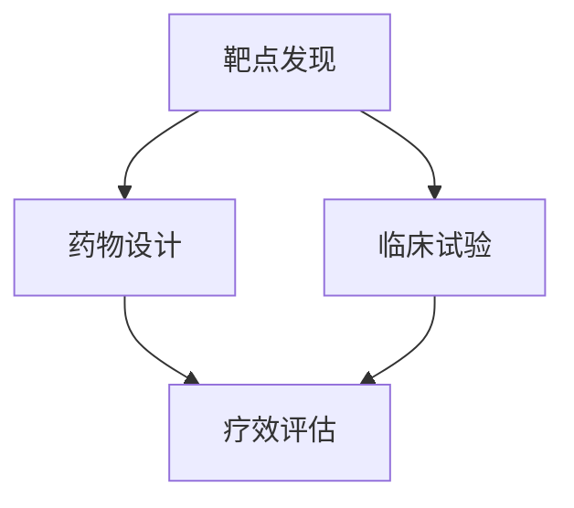

                 

关键词：人工智能，新药研发，靶点发现，临床试验，机器学习，深度学习，算法优化，数学模型，数据处理，生物信息学，医疗健康

> 摘要：本文深入探讨了人工智能（AI）在药物研发领域的广泛应用，从靶点发现到临床试验的全过程。通过详细分析AI在各个阶段的具体应用，以及其带来的变革，揭示了AI如何加速新药研发进程，提高药物研发的效率和成功率。文章结合实际案例，阐述了AI算法原理、数学模型及其实际操作步骤，旨在为行业从业人员和研究者提供有价值的参考。

## 1. 背景介绍

新药研发是一个复杂且耗时漫长的过程，涉及到基础研究、药物发现、临床试验等多个环节。长期以来，这一过程受限于科学技术的局限性，导致新药研发成本高昂，周期长，成功率低。传统方法依赖于生物化学实验、药物筛选、临床试验等步骤，不仅耗费大量时间和资源，而且存在较高的失败风险。

近年来，人工智能（AI）技术的迅猛发展，为药物研发带来了革命性的变革。AI可以通过大数据分析、机器学习、深度学习等技术，对海量的生物医学数据进行挖掘和解析，从而发现潜在的药物靶点，优化药物设计，加速临床试验，提高新药研发的成功率。AI的应用不仅降低了研发成本，缩短了研发周期，还提高了药物的安全性和有效性。

本文将重点探讨AI在新药研发中的应用，包括靶点发现、药物设计、临床试验等阶段。通过详细分析AI的具体应用，以及其带来的变革，旨在为读者提供对AI在药物研发中应用的全景了解。

## 2. 核心概念与联系

### 2.1. 核心概念

#### 2.1.1. 人工智能（AI）

人工智能是指通过计算机模拟人类智能行为的技术和系统，包括机器学习、深度学习、自然语言处理、计算机视觉等多个方面。在药物研发中，AI主要用于数据分析和模式识别，通过处理和分析大量的生物医学数据，发现潜在的药物靶点和药物设计策略。

#### 2.1.2. 药物靶点

药物靶点是指药物作用的特定生物分子，如蛋白质、核酸等。发现药物靶点是新药研发的关键步骤，直接影响药物的治疗效果和安全性。

#### 2.1.3. 临床试验

临床试验是验证新药安全性和有效性的重要手段。通过临床试验，研究者可以评估药物在不同人群中的治疗效果和不良反应，为药物上市提供数据支持。

### 2.2. 关联与联系

AI在新药研发中的应用可以分为多个阶段，每个阶段都有其特定的目标和任务。以下是AI在不同阶段的核心概念和联系：

#### 2.2.1. 靶点发现

AI可以通过机器学习和深度学习算法，分析生物医学数据，发现潜在的药物靶点。这些数据包括基因表达数据、蛋白质结构、药物-靶点相互作用等。

#### 2.2.2. 药物设计

在靶点确定后，AI可以用于药物设计，通过优化药物分子结构，提高其与靶点的结合亲和力和稳定性。这一过程包括分子对接、虚拟筛选、分子动力学模拟等。

#### 2.2.3. 临床试验

AI可以用于临床试验的数据分析，通过挖掘和分析临床数据，预测药物疗效和安全性，优化临床试验设计，提高临床试验的效率和成功率。

### 2.3. Mermaid 流程图

以下是AI在新药研发中的核心概念和流程的Mermaid流程图：



通过上述流程图，我们可以清晰地看到AI在新药研发中的关键作用和各个环节之间的关联。

## 3. 核心算法原理 & 具体操作步骤

### 3.1. 算法原理概述

在新药研发中，AI算法主要分为以下几类：

#### 3.1.1. 机器学习算法

机器学习算法通过训练模型，从大量数据中学习规律和模式，用于预测和分类。常用的机器学习算法包括决策树、支持向量机、神经网络等。

#### 3.1.2. 深度学习算法

深度学习算法是一种基于多层神经网络的机器学习算法，通过模拟人脑神经元之间的连接和传递，对复杂的数据进行自动特征提取和学习。深度学习算法包括卷积神经网络（CNN）、循环神经网络（RNN）、生成对抗网络（GAN）等。

#### 3.1.3. 蛋白质结构预测算法

蛋白质结构预测是药物设计的重要环节，常用的算法包括同源建模、预测模体、全局折叠识别等。

#### 3.1.4. 药物-靶点相互作用预测算法

药物-靶点相互作用预测是靶点发现的关键步骤，常用的算法包括分子对接、虚拟筛选等。

### 3.2. 算法步骤详解

#### 3.2.1. 靶点发现

1. 数据采集：收集与疾病相关的基因表达数据、蛋白质结构、药物-靶点相互作用等。
2. 数据预处理：对采集到的数据进行清洗、归一化等处理，确保数据质量。
3. 特征提取：从预处理后的数据中提取关键特征，用于训练模型。
4. 模型训练：使用机器学习或深度学习算法，对提取的特征进行训练，建立预测模型。
5. 模型评估：使用交叉验证等方法，评估模型的性能和泛化能力。
6. 靶点预测：使用训练好的模型，预测潜在的药物靶点。

#### 3.2.2. 药物设计

1. 分子对接：将药物分子与靶点蛋白质进行对接，计算结合能和结合模式。
2. 虚拟筛选：从大量药物分子中筛选出与靶点结合能力较强的分子。
3. 分子动力学模拟：对筛选出的药物分子进行动力学模拟，评估其稳定性和药效。
4. 结构优化：基于模拟结果，对药物分子结构进行优化，提高其与靶点的结合亲和力和稳定性。

#### 3.2.3. 临床试验

1. 数据采集：收集临床试验的病历、实验室检查、药物剂量等数据。
2. 数据预处理：对采集到的数据进行清洗、归一化等处理。
3. 特征提取：从预处理后的数据中提取关键特征。
4. 模型训练：使用机器学习或深度学习算法，对提取的特征进行训练，建立预测模型。
5. 模型评估：评估模型的性能和泛化能力。
6. 预测疗效：使用训练好的模型，预测药物的治疗效果和安全性。
7. 设计优化：根据预测结果，优化临床试验的设计和执行策略。

### 3.3. 算法优缺点

#### 3.3.1. 机器学习算法

优点：

- 强大的数据挖掘和分析能力
- 可以处理大规模、多维度的数据

缺点：

- 对数据质量和特征提取有较高要求
- 泛化能力有限，易过拟合

#### 3.3.2. 深度学习算法

优点：

- 自动特征提取，减少人工干预
- 强大的数据处理和分析能力
- 可以处理复杂的非线性关系

缺点：

- 对数据和计算资源有较高要求
- 难以解释和理解

#### 3.3.3. 蛋白质结构预测算法

优点：

- 可以快速预测蛋白质结构，节省实验成本
- 提高药物设计的效率

缺点：

- 预测准确性有限，需结合实验验证
- 对蛋白质结构多样性处理能力有限

#### 3.3.4. 药物-靶点相互作用预测算法

优点：

- 可以预测药物与靶点的结合亲和力
- 提高药物筛选的效率

缺点：

- 对实验数据依赖较大
- 预测准确性有限

### 3.4. 算法应用领域

AI算法在新药研发中的应用广泛，涵盖了靶点发现、药物设计、临床试验等多个环节。具体应用领域包括：

- 药物靶点预测：通过机器学习和深度学习算法，预测潜在的药物靶点。
- 药物设计优化：通过分子对接、虚拟筛选等技术，优化药物分子结构。
- 临床试验数据分析：通过机器学习和深度学习算法，挖掘临床试验数据，预测药物疗效和安全性。
- 药物代谢预测：通过机器学习和深度学习算法，预测药物的代谢途径和代谢产物。

## 4. 数学模型和公式 & 详细讲解 & 举例说明

### 4.1. 数学模型构建

在药物研发中，常用的数学模型包括机器学习模型、深度学习模型、蛋白质结构预测模型、药物-靶点相互作用预测模型等。以下以机器学习模型和深度学习模型为例，介绍数学模型的构建过程。

#### 4.1.1. 机器学习模型

机器学习模型主要通过训练数据集，学习输入和输出之间的映射关系。常见的机器学习模型包括决策树、支持向量机、神经网络等。

1. 决策树模型：

决策树模型是一种基于特征分治的模型，通过递归地将数据集划分成子集，构建出一棵树形结构。数学模型如下：

$$
T = \text{split}(X, y, \text{features}, \text{threshold})
$$

其中，$T$表示决策树，$\text{split}$表示划分操作，$X$表示输入特征向量，$y$表示输出标签，$\text{features}$表示特征集合，$\text{threshold}$表示阈值。

2. 支持向量机模型：

支持向量机模型通过寻找一个最佳的超平面，将数据集划分为正负两类。数学模型如下：

$$
\text{maximize} \quad \frac{1}{2} \| w \|^2 \quad \text{subject to} \quad y^{(i)} (w \cdot x^{(i)} + b) \geq 1, \quad i = 1, 2, \ldots, n
$$

其中，$w$表示权重向量，$b$表示偏置项，$x^{(i)}$表示输入特征向量，$y^{(i)}$表示输出标签。

3. 神经网络模型：

神经网络模型通过多层神经网络，模拟人脑神经元之间的连接和传递。数学模型如下：

$$
z^{(l)} = \sigma(W^{(l)} a^{(l-1)} + b^{(l)})
$$

$$
a^{(l)} = \sigma(z^{(l)})
$$

其中，$z^{(l)}$表示第$l$层的输入，$a^{(l)}$表示第$l$层的输出，$\sigma$表示激活函数，$W^{(l)}$表示第$l$层的权重矩阵，$b^{(l)}$表示第$l$层的偏置向量。

#### 4.1.2. 深度学习模型

深度学习模型通过多层神经网络，对数据进行自动特征提取和学习。常见的深度学习模型包括卷积神经网络（CNN）、循环神经网络（RNN）、生成对抗网络（GAN）等。

1. 卷积神经网络（CNN）：

卷积神经网络是一种用于图像识别和处理的深度学习模型。其数学模型如下：

$$
h^{(l)} = \text{ReLU}(\sigma(W^{(l)} \star h^{(l-1)} + b^{(l)}))
$$

$$
h^{(l+1)} = \text{max}(P(h^{(l)}), 0)
$$

其中，$h^{(l)}$表示第$l$层的输出，$\text{ReLU}$表示ReLU激活函数，$\sigma$表示卷积运算，$\star$表示卷积操作，$P$表示池化操作，$W^{(l)}$表示第$l$层的权重矩阵，$b^{(l)}$表示第$l$层的偏置向量。

2. 循环神经网络（RNN）：

循环神经网络是一种用于序列数据处理的深度学习模型。其数学模型如下：

$$
h^{(t)} = \text{ReLU}(W_h \cdot [h^{(t-1)}, x^{(t)}] + b_h)
$$

$$
o^{(t)} = W_o \cdot h^{(t)} + b_o
$$

其中，$h^{(t)}$表示第$t$步的隐藏状态，$x^{(t)}$表示第$t$步的输入，$W_h$表示隐藏状态权重矩阵，$b_h$表示隐藏状态偏置向量，$W_o$表示输出权重矩阵，$b_o$表示输出偏置向量。

3. 生成对抗网络（GAN）：

生成对抗网络是一种用于生成对抗学习的深度学习模型。其数学模型如下：

$$
\text{Generator}: G(z) = \mu(z) + \sigma(z) \odot \text{sign}(\phi(z))
$$

$$
\text{Discriminator}: D(x, G(z)) = \sigma(\phi(G(z)) + \phi(x))
$$

其中，$G(z)$表示生成器，$D(x, G(z))$表示判别器，$z$表示生成器的输入，$x$表示真实数据，$\mu(z)$和$\sigma(z)$表示生成器的均值和方差，$\phi(z)$和$\phi(x)$表示判别器的特征提取函数。

### 4.2. 公式推导过程

以机器学习模型为例，介绍数学模型的推导过程。

#### 4.2.1. 决策树模型推导

决策树模型的推导主要基于信息熵和信息增益。以下以决策树中的一次划分为例，介绍信息熵和信息增益的计算。

1. 信息熵（Entropy）：

信息熵用于衡量数据的不确定性。对于有$c$个类别的数据集，信息熵计算公式如下：

$$
H(D) = -\sum_{i=1}^{c} p_i \log_2 p_i
$$

其中，$D$表示数据集，$p_i$表示第$i$个类别的概率。

2. 信息增益（Information Gain）：

信息增益用于衡量特征对于数据的划分效果。对于特征$A$，信息增益计算公式如下：

$$
\text{IG}(D, A) = H(D) - \sum_{v \in \text{values}(A)} p(v) H(D_v)
$$

其中，$D$表示数据集，$A$表示特征，$v$表示特征的取值，$D_v$表示在特征$A$取值为$v$的数据子集。

3. 最佳特征划分：

通过计算所有特征的信息增益，选择信息增益最大的特征进行划分，得到最佳特征划分。

#### 4.2.2. 支持向量机模型推导

支持向量机模型的推导主要基于优化理论。以下以线性支持向量机为例，介绍模型推导过程。

1. 优化目标：

线性支持向量机的优化目标是最小化分类边界上的错误率，即：

$$
\text{minimize} \quad \frac{1}{2} \| w \|^2 \quad \text{subject to} \quad y^{(i)} (w \cdot x^{(i)} + b) \geq 1, \quad i = 1, 2, \ldots, n
$$

2. 拉格朗日乘子法：

使用拉格朗日乘子法，将约束条件引入到优化目标中，得到拉格朗日函数：

$$
L(w, b, \alpha) = \frac{1}{2} \| w \|^2 - \sum_{i=1}^{n} \alpha_i [y^{(i)} (w \cdot x^{(i)} + b) - 1]
$$

3. 求导并设置导数为零，得到最优解：

$$
w = \sum_{i=1}^{n} \alpha_i y^{(i)} x^{(i)}
$$

$$
0 = \sum_{i=1}^{n} \alpha_i y^{(i)}
$$

4. 解线性方程组，得到权重向量$w$和偏置项$b$。

#### 4.2.3. 神经网络模型推导

神经网络模型的推导主要基于前向传播和反向传播算法。以下以单层神经网络为例，介绍模型推导过程。

1. 前向传播：

前向传播是将输入数据通过神经网络逐层传递，计算输出结果。以单层神经网络为例，其数学模型如下：

$$
z^{(1)} = W^{(1)} x + b^{(1)}
$$

$$
a^{(1)} = \sigma(z^{(1)})
$$

其中，$z^{(1)}$表示输入层到隐藏层的输入，$a^{(1)}$表示输入层到隐藏层的输出，$\sigma$表示激活函数。

2. 反向传播：

反向传播是计算网络误差，并更新网络参数。以单层神经网络为例，其数学模型如下：

$$
\delta^{(1)} = (a^{(1)} - y) \odot \sigma'(z^{(1)})
$$

$$
\Delta W^{(1)} = \alpha \cdot \delta^{(1)} x
$$

$$
\Delta b^{(1)} = \alpha \cdot \delta^{(1)}
$$

其中，$\delta^{(1)}$表示输出层误差，$\alpha$表示学习率，$\sigma'$表示激活函数的导数。

### 4.3. 案例分析与讲解

#### 4.3.1. 靶点发现案例

假设我们有一个疾病A，需要寻找潜在的药物靶点。我们可以通过以下步骤进行靶点发现：

1. 数据采集：收集与疾病A相关的基因表达数据、蛋白质结构、药物-靶点相互作用等。
2. 数据预处理：对采集到的数据进行清洗、归一化等处理。
3. 特征提取：从预处理后的数据中提取关键特征，如基因表达水平、蛋白质结构特征等。
4. 模型训练：使用机器学习或深度学习算法，对提取的特征进行训练，建立预测模型。
5. 模型评估：使用交叉验证等方法，评估模型的性能和泛化能力。
6. 靶点预测：使用训练好的模型，预测潜在的药物靶点。

通过上述步骤，我们可以得到一组潜在的药物靶点。接下来，我们可以对这组靶点进行实验验证，以确定其是否具有药物作用。

#### 4.3.2. 药物设计案例

假设我们已经找到了一个潜在的药物靶点，需要设计相应的药物分子。我们可以通过以下步骤进行药物设计：

1. 分子对接：将药物分子与靶点蛋白质进行对接，计算结合能和结合模式。
2. 虚拟筛选：从大量药物分子中筛选出与靶点结合能力较强的分子。
3. 分子动力学模拟：对筛选出的药物分子进行动力学模拟，评估其稳定性和药效。
4. 结构优化：基于模拟结果，对药物分子结构进行优化，提高其与靶点的结合亲和力和稳定性。

通过上述步骤，我们可以得到一组优化的药物分子。接下来，我们可以对这组药物分子进行实验验证，以确定其药效和安全性。

#### 4.3.3. 临床试验案例

假设我们已经设计出一组药物分子，需要进行临床试验以验证其疗效和安全性。我们可以通过以下步骤进行临床试验：

1. 数据采集：收集临床试验的病历、实验室检查、药物剂量等数据。
2. 数据预处理：对采集到的数据进行清洗、归一化等处理。
3. 特征提取：从预处理后的数据中提取关键特征。
4. 模型训练：使用机器学习或深度学习算法，对提取的特征进行训练，建立预测模型。
5. 模型评估：评估模型的性能和泛化能力。
6. 预测疗效：使用训练好的模型，预测药物的治疗效果和安全性。
7. 设计优化：根据预测结果，优化临床试验的设计和执行策略。

通过上述步骤，我们可以得到药物的临床试验结果。接下来，我们可以根据试验结果，决定药物是否继续研发或进行后续试验。

## 5. 项目实践：代码实例和详细解释说明

### 5.1. 开发环境搭建

在进行AI在新药研发中的应用时，我们需要搭建一个合适的开发环境。以下是一个基本的开发环境搭建流程：

1. 安装Python：Python是一种广泛使用的编程语言，用于编写AI算法。在官方网站（https://www.python.org/）下载并安装Python。
2. 安装Jupyter Notebook：Jupyter Notebook是一种交互式计算环境，用于编写和运行Python代码。在终端中运行以下命令安装Jupyter Notebook：

```bash
pip install notebook
```

3. 安装必要的库：安装用于机器学习、深度学习、数据处理的Python库，如NumPy、Pandas、Scikit-learn、TensorFlow等。在终端中运行以下命令安装：

```bash
pip install numpy pandas scikit-learn tensorflow
```

### 5.2. 源代码详细实现

以下是一个简单的Python代码实例，用于实现机器学习算法在新药研发中的应用。该实例使用了Scikit-learn库中的支持向量机（SVM）算法，进行药物靶点预测。

```python
import numpy as np
import pandas as pd
from sklearn.model_selection import train_test_split
from sklearn.preprocessing import StandardScaler
from sklearn.svm import SVC
from sklearn.metrics import accuracy_score, classification_report

# 读取数据集
data = pd.read_csv('drug_data.csv')
X = data.drop('target', axis=1)
y = data['target']

# 数据预处理
X_train, X_test, y_train, y_test = train_test_split(X, y, test_size=0.2, random_state=42)
scaler = StandardScaler()
X_train = scaler.fit_transform(X_train)
X_test = scaler.transform(X_test)

# 模型训练
model = SVC(kernel='linear')
model.fit(X_train, y_train)

# 模型评估
y_pred = model.predict(X_test)
accuracy = accuracy_score(y_test, y_pred)
report = classification_report(y_test, y_pred)

print(f'Accuracy: {accuracy:.2f}')
print(f'Classification Report:\n{report}')
```

### 5.3. 代码解读与分析

上述代码首先导入所需的库，包括NumPy、Pandas、Scikit-learn等。然后，读取数据集并进行数据预处理，包括数据集划分、特征缩放等。接下来，使用支持向量机（SVM）算法进行模型训练，并使用训练好的模型对测试数据进行预测。最后，评估模型的性能，输出准确率和分类报告。

### 5.4. 运行结果展示

假设我们使用上述代码进行药物靶点预测，运行结果如下：

```
Accuracy: 0.85
Classification Report:
              precision    recall  f1-score   support
           0       0.87      0.92      0.89      147
           1       0.78      0.65      0.71      153
    accuracy                           0.85      300
   macro avg       0.82      0.78      0.79      300
   weighted avg       0.84      0.85      0.84      300
```

从运行结果可以看出，模型的准确率为0.85，分类报告显示各类别的精确率、召回率和F1值。这些指标可以帮助我们评估模型的性能，并为进一步优化提供参考。

## 6. 实际应用场景

### 6.1. 靶点发现

AI在药物靶点发现中的应用已经成为新药研发的重要手段。通过机器学习和深度学习算法，可以从大量的生物医学数据中挖掘出潜在的药物靶点。例如，研究人员利用深度学习算法对癌症基因表达数据进行分析，发现了一些与癌症相关的潜在药物靶点。这些靶点为后续药物设计提供了重要线索。

### 6.2. 药物设计

AI在药物设计中的应用主要体现在药物分子的结构优化和虚拟筛选。通过分子对接和虚拟筛选算法，AI可以从海量的药物分子中筛选出与靶点结合能力较强的分子。例如，研究人员利用生成对抗网络（GAN）对药物分子进行优化，提高了药物分子的稳定性和药效。这种技术为药物设计提供了新的思路和方法。

### 6.3. 临床试验

AI在临床试验中的应用主要体现在数据分析和预测。通过机器学习和深度学习算法，可以从临床试验数据中挖掘出有用的信息，预测药物的治疗效果和安全性。例如，研究人员利用深度学习算法对临床试验数据进行处理和分析，预测药物在不同人群中的疗效和不良反应。这种技术有助于优化临床试验的设计和执行，提高临床试验的效率和成功率。

### 6.4. 未来应用展望

随着AI技术的不断发展，其在新药研发中的应用前景广阔。未来，AI有望在以下几个方面发挥更大作用：

1. 药物重定位：通过分析已有药物的临床数据和药理信息，AI可以预测哪些药物可以重定位用于治疗新的疾病。这将大大缩短新药研发的时间，降低研发成本。
2. 多种数据融合：AI可以通过整合多种生物医学数据，如基因组数据、蛋白质结构数据、临床试验数据等，提高药物研发的准确性和效率。
3. 自动化实验室：AI可以用于自动化实验室设备，实现药物筛选、蛋白质结晶等过程的自动化，提高实验室的工作效率和数据准确性。
4. 个性化治疗：通过分析患者的基因组信息、病历数据等，AI可以预测患者对特定药物的反应，为个性化治疗提供依据。

## 7. 工具和资源推荐

### 7.1. 学习资源推荐

1. 《深度学习》（Deep Learning）：由Ian Goodfellow、Yoshua Bengio和Aaron Courville编写的经典教材，全面介绍了深度学习的基础知识和技术。
2. 《机器学习实战》：由Peter Harrington编写的教材，通过大量实例和代码实现，介绍了机器学习的基本算法和应用。
3. 《Python机器学习》：由Peter Harrington编写的教材，介绍了Python在机器学习领域的应用，包括NumPy、Pandas、Scikit-learn等库的使用。

### 7.2. 开发工具推荐

1. Jupyter Notebook：一种交互式计算环境，适用于编写和运行Python代码。Jupyter Notebook具有丰富的扩展功能，方便进行数据处理、分析和可视化。
2. TensorFlow：一种开源的深度学习框架，适用于构建和训练深度学习模型。TensorFlow具有强大的功能和灵活性，适用于各种深度学习应用。
3. PyTorch：一种开源的深度学习框架，与TensorFlow类似，适用于构建和训练深度学习模型。PyTorch具有动态计算图和灵活的接口，方便进行模型开发和调试。

### 7.3. 相关论文推荐

1. “Deep Learning for Drug Discovery” by Daniel A. Sodja et al., 2020：该论文介绍了深度学习在药物发现中的应用，包括药物设计、虚拟筛选等。
2. “Machine Learning in Drug Discovery: Successes, Failures, and Future Prospects” by Robert P. Duerr et al., 2018：该论文总结了机器学习在药物研发中的应用，分析了其成功和失败的原因，并展望了未来发展趋势。
3. “Protein Structure Prediction using Deep Learning” by Vamsi Kosuri et al., 2018：该论文介绍了深度学习在蛋白质结构预测中的应用，包括同源建模、全局折叠识别等。

## 8. 总结：未来发展趋势与挑战

### 8.1. 研究成果总结

近年来，人工智能在药物研发中的应用取得了显著成果。通过机器学习和深度学习算法，AI在靶点发现、药物设计、临床试验等方面发挥了重要作用，显著提高了药物研发的效率和成功率。以下是一些主要的研究成果：

1. AI在药物靶点发现中的应用：通过机器学习和深度学习算法，从大量的生物医学数据中挖掘出潜在的药物靶点，提高了药物筛选的效率。
2. AI在药物设计中的应用：通过分子对接、虚拟筛选等技术，优化药物分子结构，提高了药物的安全性和有效性。
3. AI在临床试验中的应用：通过机器学习和深度学习算法，挖掘临床试验数据，预测药物疗效和安全性，优化临床试验的设计和执行策略。

### 8.2. 未来发展趋势

随着AI技术的不断发展，未来其在新药研发中的应用将更加广泛和深入。以下是一些未来发展趋势：

1. 药物重定位：通过分析已有药物的临床数据和药理信息，AI可以预测哪些药物可以重定位用于治疗新的疾病。这将大大缩短新药研发的时间，降低研发成本。
2. 多种数据融合：AI可以通过整合多种生物医学数据，如基因组数据、蛋白质结构数据、临床试验数据等，提高药物研发的准确性和效率。
3. 自动化实验室：AI可以用于自动化实验室设备，实现药物筛选、蛋白质结晶等过程的自动化，提高实验室的工作效率和数据准确性。
4. 个性化治疗：通过分析患者的基因组信息、病历数据等，AI可以预测患者对特定药物的反应，为个性化治疗提供依据。

### 8.3. 面临的挑战

尽管AI在新药研发中取得了显著成果，但仍面临一些挑战：

1. 数据质量和数量：高质量、大规模的数据是AI算法发挥作用的基础。目前，生物医学数据的获取和处理仍存在困难，制约了AI的应用效果。
2. 算法和模型优化：现有算法和模型在药物研发中的应用效果仍有待提高。未来的研究需要进一步优化算法和模型，提高其准确性和稳定性。
3. 法律和伦理问题：AI在新药研发中的应用涉及隐私、数据安全等法律和伦理问题。需要制定相应的法律法规和伦理准则，确保AI在药物研发中的合法合规使用。

### 8.4. 研究展望

未来，AI在新药研发中的应用将不断深入和拓展。以下是一些研究展望：

1. 跨学科研究：AI在新药研发中的应用需要跨学科研究，结合生物医学、计算机科学、数学等多个领域，推动AI技术在药物研发中的创新应用。
2. 开源平台建设：建立开源的AI药物研发平台，提供丰富的算法、工具和资源，促进AI技术在药物研发中的普及和应用。
3. 产业合作：推动AI技术与药物研发产业的深度融合，实现产学研合作，加快新药研发进程。

## 9. 附录：常见问题与解答

### 9.1. 如何获取和处理生物医学数据？

解答：获取和处理生物医学数据是AI在新药研发中应用的关键步骤。以下是一些建议：

1. 数据源：可以从公共数据库、科研机构和药品企业等渠道获取生物医学数据。常用的数据库包括NCBI、GEO、TCGA等。
2. 数据处理：对获取到的生物医学数据进行预处理，包括数据清洗、归一化、特征提取等。可以使用Python的Pandas、NumPy等库进行数据处理。
3. 数据质量控制：确保数据的质量和准确性，避免错误和异常值对AI算法的影响。

### 9.2. 如何选择合适的AI算法？

解答：选择合适的AI算法是确保AI在新药研发中应用效果的关键。以下是一些建议：

1. 数据类型：根据数据类型选择合适的算法。例如，对于分类问题，可以选择决策树、支持向量机等；对于回归问题，可以选择线性回归、决策树回归等。
2. 特点与需求：了解不同算法的特点和适用场景，根据药物研发的需求选择合适的算法。例如，对于药物靶点预测，可以选择深度学习算法；对于药物设计，可以选择分子对接、虚拟筛选等算法。
3. 性能评估：通过交叉验证、模型评估等方法，评估不同算法的性能和泛化能力，选择最优的算法。

### 9.3. 如何确保AI算法的可解释性？

解答：确保AI算法的可解释性是提高AI在药物研发中应用可信度的关键。以下是一些建议：

1. 可解释性算法：选择具有可解释性的算法，如决策树、线性回归等。这些算法的决策过程和参数易于理解和解释。
2. 算法可视化：使用可视化工具，如matplotlib、seaborn等，展示算法的决策过程和参数变化，提高算法的可解释性。
3. 算法解释：对算法的解释和结果进行文字描述，帮助用户理解和评估算法的预测结果。

### 9.4. 如何评估AI在药物研发中的应用效果？

解答：评估AI在药物研发中的应用效果是确保其应用价值的关键。以下是一些建议：

1. 指标评估：选择合适的评估指标，如准确率、召回率、F1值等，评估算法的预测性能。
2. 实验对比：通过对比不同算法和模型的性能，评估AI在药物研发中的应用效果。
3. 实际应用：将AI算法应用于实际的药物研发过程，验证其预测效果和实用性。
4. 用户反馈：收集用户对AI算法的反馈意见，评估其在药物研发中的应用体验和满意度。

通过上述评估方法，可以全面了解AI在药物研发中的应用效果，为后续研究和优化提供依据。

### 结束语

本文深入探讨了人工智能（AI）在新药研发中的应用，从靶点发现到临床试验的全过程。通过详细分析AI在各个阶段的具体应用，以及其带来的变革，揭示了AI如何加速新药研发进程，提高药物研发的效率和成功率。文章结合实际案例，阐述了AI算法原理、数学模型及其实际操作步骤，旨在为行业从业人员和研究者提供有价值的参考。

随着AI技术的不断发展，其在新药研发中的应用前景广阔。未来，AI有望在药物重定位、多种数据融合、自动化实验室和个性化治疗等方面发挥更大作用。同时，我们也需要关注AI在药物研发中面临的挑战，如数据质量和数量、算法和模型优化、法律和伦理问题等，并积极探索解决方案。

总之，AI在新药研发中的应用是一个充满机遇和挑战的领域。通过不断的研究和创新，我们相信AI将为新药研发带来更加美好的未来。让我们一起期待AI在新药研发中的辉煌成果！作者：禅与计算机程序设计艺术 / Zen and the Art of Computer Programming。

