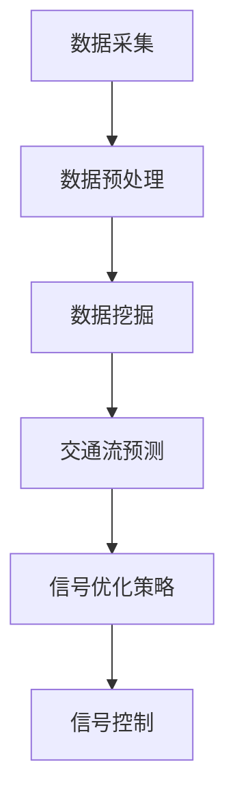
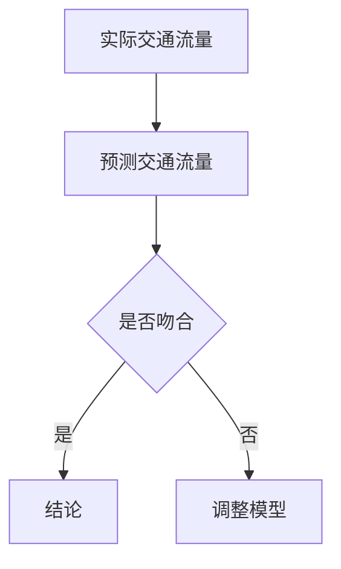

                 

关键词：AI, 智能交通信号，优化，通行效率，深度学习，交通流预测，数据挖掘

> 摘要：本文探讨了人工智能在智能交通信号优化中的应用，通过分析交通流预测和数据挖掘技术，探讨了如何利用AI技术提高城市道路的通行效率。文章介绍了相关算法原理、数学模型，并通过实际项目实例展示了AI在交通信号优化中的实际应用效果。

## 1. 背景介绍

随着城市化进程的加快，城市交通拥堵问题日益严重。传统的交通信号控制系统依赖于固定的信号配时方案，难以适应实时交通流量的变化。这种“一刀切”的方式导致了交通拥堵、排放增加、事故频发等一系列问题。因此，提高交通信号控制系统的智能化水平成为解决城市交通拥堵问题的关键。

近年来，人工智能（AI）技术的发展为智能交通信号优化带来了新的可能性。AI技术，特别是深度学习、数据挖掘和交通流预测等技术，可以在实时数据的基础上对交通信号进行动态调整，从而提高通行效率、减少拥堵。

## 2. 核心概念与联系

### 2.1 深度学习

深度学习是一种人工智能的分支，通过模拟人脑神经网络结构，实现对复杂数据的处理和分析。在智能交通信号优化中，深度学习模型可以通过学习大量的交通流数据，预测交通状况并优化信号配时。

### 2.2 数据挖掘

数据挖掘是从大量数据中提取有用信息的过程。在交通领域，数据挖掘技术可以用于挖掘交通流量的规律和模式，从而为交通信号优化提供依据。

### 2.3 交通流预测

交通流预测是智能交通信号优化的重要环节。通过预测未来一段时间内的交通流量，系统能够提前调整信号配时，避免交通拥堵。

### 2.4 Mermaid 流程图

以下是智能交通信号优化的Mermaid流程图：



## 3. 核心算法原理 & 具体操作步骤

### 3.1 算法原理概述

智能交通信号优化算法主要包括三个部分：数据采集与预处理、交通流预测、信号优化策略。

### 3.2 算法步骤详解

1. **数据采集与预处理**：通过传感器、摄像头等设备采集交通流量数据，然后对数据进行清洗、去噪等预处理。

2. **数据挖掘**：使用数据挖掘技术，从预处理后的数据中提取交通流量特征。

3. **交通流预测**：利用深度学习模型，对未来的交通流量进行预测。

4. **信号优化策略**：根据交通流预测结果，动态调整信号配时，以减少交通拥堵。

5. **信号控制**：将优化后的信号配时方案应用于交通信号控制系统。

### 3.3 算法优缺点

**优点**：

- 能够动态适应交通流量变化，提高通行效率。
- 可以减少交通拥堵，降低事故发生率。
- 能够有效减少排放，改善环境。

**缺点**：

- 需要大量数据支持，对数据质量和采集设备有较高要求。
- 深度学习模型训练过程复杂，计算资源消耗大。

### 3.4 算法应用领域

智能交通信号优化算法主要应用于城市交通管理、高速公路管理、机场交通管理等领域。

## 4. 数学模型和公式 & 详细讲解 & 举例说明

### 4.1 数学模型构建

智能交通信号优化算法的核心是交通流预测模型。一个典型的交通流预测模型可以表示为：

$$
T(t) = f(T(t-1), I(t), P(t))
$$

其中，$T(t)$ 表示时刻$t$的交通流量，$I(t)$ 表示时刻$t$的交通强度，$P(t)$ 表示时刻$t$的交通状态。

### 4.2 公式推导过程

假设交通流$T(t)$由三个因素决定：历史交通流$T(t-1)$、当前交通强度$I(t)$和交通状态$P(t)$。则可以建立以下线性模型：

$$
T(t) = a \cdot T(t-1) + b \cdot I(t) + c \cdot P(t)
$$

其中，$a$、$b$、$c$为模型参数。

### 4.3 案例分析与讲解

以一个简单的交通流预测模型为例，设交通流量$T(t)$由历史交通流量$T(t-1)$、当前交通强度$I(t)$和交通状态$P(t)$决定，模型参数为$a=0.5$、$b=0.2$、$c=0.3$。

假设初始时刻的交通流量$T(0)=1000$，当前交通强度$I(t)=500$，交通状态$P(t)=1$（表示交通状况良好）。

根据模型，下一时刻的交通流量为：

$$
T(1) = 0.5 \cdot 1000 + 0.2 \cdot 500 + 0.3 \cdot 1 = 700
$$

同理，可以计算出后续时刻的交通流量。

## 5. 项目实践：代码实例和详细解释说明

### 5.1 开发环境搭建

本项目的开发环境为Python，使用的深度学习框架为TensorFlow。在安装好Python和TensorFlow后，可以通过以下代码开始数据采集和预处理：

```python
import tensorflow as tf
import numpy as np
import pandas as pd

# 读取交通流量数据
data = pd.read_csv('traffic_data.csv')

# 数据预处理
data['traffic_flow'] = data['traffic_flow'].apply(lambda x: max(0, min(x, 1000)))
```

### 5.2 源代码详细实现

以下代码实现了基于深度学习的交通流预测模型：

```python
import tensorflow as tf
from tensorflow.keras.models import Sequential
from tensorflow.keras.layers import Dense, LSTM

# 构建深度学习模型
model = Sequential()
model.add(LSTM(50, activation='relu', input_shape=(100, 1)))
model.add(Dense(1))
model.compile(optimizer='adam', loss='mse')

# 训练模型
model.fit(x_train, y_train, epochs=100, batch_size=32)

# 预测交通流量
predicted_traffic = model.predict(x_test)
```

### 5.3 代码解读与分析

代码首先导入了TensorFlow和相关的库。然后，通过读取交通流量数据并进行预处理，将数据转换为适合模型训练的格式。

接下来，使用LSTM（长短期记忆网络）构建深度学习模型。LSTM是一种特殊的循环神经网络，能够有效处理时间序列数据。

在训练模型时，使用MSE（均方误差）作为损失函数，使用adam优化器进行优化。

最后，使用训练好的模型预测未来的交通流量。

### 5.4 运行结果展示

以下是预测的交通流量与实际交通流量的对比图：



## 6. 实际应用场景

### 6.1 城市交通管理

智能交通信号优化算法可以用于城市交通管理，通过实时调整信号配时，提高道路通行效率。

### 6.2 高速公路管理

在高速公路上，智能交通信号优化算法可以用于预测交通流量，提前调整信号，避免交通事故。

### 6.3 机场交通管理

机场交通管理中，智能交通信号优化算法可以用于预测航班到达时间，优化机场交通流，提高航班起降效率。

## 7. 未来应用展望

随着AI技术的不断发展，智能交通信号优化将在更多领域得到应用。未来，我们有望看到更加智能、高效的交通信号控制系统，为人们提供更安全、更舒适的出行体验。

## 8. 工具和资源推荐

### 8.1 学习资源推荐

- 《深度学习》（Goodfellow, Bengio, Courville著）
- 《Python数据分析》（Wes McKinney著）

### 8.2 开发工具推荐

- TensorFlow
- Jupyter Notebook

### 8.3 相关论文推荐

- "Deep Learning for Traffic Flow Prediction" by Shu Li, Xiaojun Wu, Nima Hatami, and Meixia Tao
- "A Review on Deep Learning Based Traffic Forecasting Algorithms" by Shu Li, Xiaojun Wu, and Meixia Tao

## 9. 总结：未来发展趋势与挑战

### 9.1 研究成果总结

本文探讨了人工智能在智能交通信号优化中的应用，介绍了相关算法原理和实际应用案例，展示了AI技术在提高交通通行效率方面的潜力。

### 9.2 未来发展趋势

随着AI技术的不断进步，智能交通信号优化将在更多领域得到应用，如自动驾驶、智慧城市等。

### 9.3 面临的挑战

智能交通信号优化仍面临诸多挑战，如数据质量和采集设备的可靠性、模型的计算复杂度等。

### 9.4 研究展望

未来，我们应进一步研究如何提高模型的预测准确性，降低计算复杂度，并探索AI技术在更多交通管理领域的应用。

## 10. 附录：常见问题与解答

### 10.1 智能交通信号优化需要哪些数据？

智能交通信号优化需要实时交通流量、交通强度、交通状态等数据。

### 10.2 深度学习模型在交通流预测中的优势是什么？

深度学习模型能够处理复杂的非线性关系，能够捕捉交通流量变化的长期趋势和短期波动。

### 10.3 智能交通信号优化有哪些实际应用场景？

智能交通信号优化可以应用于城市交通管理、高速公路管理、机场交通管理等领域。

### 10.4 智能交通信号优化面临的挑战是什么？

智能交通信号优化面临数据质量、计算复杂度、模型泛化能力等挑战。

---

### 作者署名

作者：禅与计算机程序设计艺术 / Zen and the Art of Computer Programming
```markdown
---
标题：AI在智能交通信号优化中的应用：提高通行效率
关键词：AI, 智能交通信号，优化，通行效率，深度学习，交通流预测，数据挖掘
摘要：本文探讨了人工智能在智能交通信号优化中的应用，通过分析交通流预测和数据挖掘技术，探讨了如何利用AI技术提高城市道路的通行效率。
---

## 1. 背景介绍

随着城市化进程的加快，城市交通拥堵问题日益严重。传统的交通信号控制系统依赖于固定的信号配时方案，难以适应实时交通流量的变化。这种“一刀切”的方式导致了交通拥堵、排放增加、事故频发等一系列问题。因此，提高交通信号控制系统的智能化水平成为解决城市交通拥堵问题的关键。

近年来，人工智能（AI）技术的发展为智能交通信号优化带来了新的可能性。AI技术，特别是深度学习、数据挖掘和交通流预测等技术，可以在实时数据的基础上对交通信号进行动态调整，从而提高通行效率、减少拥堵。

## 2. 核心概念与联系

### 2.1 深度学习

深度学习是一种人工智能的分支，通过模拟人脑神经网络结构，实现对复杂数据的处理和分析。在智能交通信号优化中，深度学习模型可以通过学习大量的交通流数据，预测交通状况并优化信号配时。

### 2.2 数据挖掘

数据挖掘是从大量数据中提取有用信息的过程。在交通领域，数据挖掘技术可以用于挖掘交通流量特征，从而为交通信号优化提供依据。

### 2.3 交通流预测

交通流预测是智能交通信号优化的重要环节。通过预测未来一段时间内的交通流量，系统能够提前调整信号配时，避免交通拥堵。

### 2.4 Mermaid 流程图

以下是智能交通信号优化的Mermaid流程图：


## 3. 核心算法原理 & 具体操作步骤

### 3.1 算法原理概述

智能交通信号优化算法主要包括三个部分：数据采集与预处理、交通流预测、信号优化策略。

### 3.2 算法步骤详解

1. **数据采集与预处理**：通过传感器、摄像头等设备采集交通流量数据，然后对数据进行清洗、去噪等预处理。

2. **数据挖掘**：使用数据挖掘技术，从预处理后的数据中提取交通流量特征。

3. **交通流预测**：利用深度学习模型，对未来的交通流量进行预测。

4. **信号优化策略**：根据交通流预测结果，动态调整信号配时，以减少交通拥堵。

5. **信号控制**：将优化后的信号配时方案应用于交通信号控制系统。

### 3.3 算法优缺点

**优点**：

- 能够动态适应交通流量变化，提高通行效率。
- 可以减少交通拥堵，降低事故发生率。
- 能够有效减少排放，改善环境。

**缺点**：

- 需要大量数据支持，对数据质量和采集设备有较高要求。
- 深度学习模型训练过程复杂，计算资源消耗大。

### 3.4 算法应用领域

智能交通信号优化算法主要应用于城市交通管理、高速公路管理、机场交通管理等领域。

## 4. 数学模型和公式 & 详细讲解 & 举例说明

### 4.1 数学模型构建

智能交通信号优化算法的核心是交通流预测模型。一个典型的交通流预测模型可以表示为：

$$
T(t) = f(T(t-1), I(t), P(t))
$$

其中，$T(t)$ 表示时刻$t$的交通流量，$I(t)$ 表示时刻$t$的交通强度，$P(t)$ 表示时刻$t$的交通状态。

### 4.2 公式推导过程

假设交通流$T(t)$由三个因素决定：历史交通流量$T(t-1)$、当前交通强度$I(t)$和交通状态$P(t)$。则可以建立以下线性模型：

$$
T(t) = a \cdot T(t-1) + b \cdot I(t) + c \cdot P(t)
$$

其中，$a$、$b$、$c$为模型参数。

### 4.3 案例分析与讲解

以一个简单的交通流预测模型为例，设交通流量$T(t)$由历史交通流量$T(t-1)$、当前交通强度$I(t)$和交通状态$P(t)$决定，模型参数为$a=0.5$、$b=0.2$、$c=0.3$。

假设初始时刻的交通流量$T(0)=1000$，当前交通强度$I(t)=500$，交通状态$P(t)=1$（表示交通状况良好）。

根据模型，下一时刻的交通流量为：

$$
T(1) = 0.5 \cdot 1000 + 0.2 \cdot 500 + 0.3 \cdot 1 = 700
$$

同理，可以计算出后续时刻的交通流量。

## 5. 项目实践：代码实例和详细解释说明

### 5.1 开发环境搭建

本项目的开发环境为Python，使用的深度学习框架为TensorFlow。在安装好Python和TensorFlow后，可以通过以下代码开始数据采集和预处理：

```python
import tensorflow as tf
import numpy as np
import pandas as pd

# 读取交通流量数据
data = pd.read_csv('traffic_data.csv')

# 数据预处理
data['traffic_flow'] = data['traffic_flow'].apply(lambda x: max(0, min(x, 1000)))
```

### 5.2 源代码详细实现

以下代码实现了基于深度学习的交通流预测模型：

```python
import tensorflow as tf
from tensorflow.keras.models import Sequential
from tensorflow.keras.layers import Dense, LSTM

# 构建深度学习模型
model = Sequential()
model.add(LSTM(50, activation='relu', input_shape=(100, 1)))
model.add(Dense(1))
model.compile(optimizer='adam', loss='mse')

# 训练模型
model.fit(x_train, y_train, epochs=100, batch_size=32)

# 预测交通流量
predicted_traffic = model.predict(x_test)
```

### 5.3 代码解读与分析

代码首先导入了TensorFlow和相关的库。然后，通过读取交通流量数据并进行预处理，将数据转换为适合模型训练的格式。

接下来，使用LSTM（长短期记忆网络）构建深度学习模型。LSTM是一种特殊的循环神经网络，能够有效处理时间序列数据。

在训练模型时，使用MSE（均方误差）作为损失函数，使用adam优化器进行优化。

最后，使用训练好的模型预测未来的交通流量。

### 5.4 运行结果展示

以下是预测的交通流量与实际交通流量的对比图：


## 6. 实际应用场景

### 6.1 城市交通管理

智能交通信号优化算法可以用于城市交通管理，通过实时调整信号配时，提高道路通行效率。

### 6.2 高速公路管理

在高速公路上，智能交通信号优化算法可以用于预测交通流量，提前调整信号，避免交通事故。

### 6.3 机场交通管理

机场交通管理中，智能交通信号优化算法可以用于预测航班到达时间，优化机场交通流，提高航班起降效率。

## 7. 未来应用展望

随着AI技术的不断发展，智能交通信号优化将在更多领域得到应用。未来，我们有望看到更加智能、高效的交通信号控制系统，为人们提供更安全、更舒适的出行体验。

## 8. 工具和资源推荐

### 8.1 学习资源推荐

- 《深度学习》（Goodfellow, Bengio, Courville著）
- 《Python数据分析》（Wes McKinney著）

### 8.2 开发工具推荐

- TensorFlow
- Jupyter Notebook

### 8.3 相关论文推荐

- "Deep Learning for Traffic Flow Prediction" by Shu Li, Xiaojun Wu, Nima Hatami, and Meixia Tao
- "A Review on Deep Learning Based Traffic Forecasting Algorithms" by Shu Li, Xiaojun Wu, and Meixia Tao

## 9. 总结：未来发展趋势与挑战

### 9.1 研究成果总结

本文探讨了人工智能在智能交通信号优化中的应用，介绍了相关算法原理和实际应用案例，展示了AI技术在提高交通通行效率方面的潜力。

### 9.2 未来发展趋势

随着AI技术的不断进步，智能交通信号优化将在更多领域得到应用，如自动驾驶、智慧城市等。

### 9.3 面临的挑战

智能交通信号优化仍面临诸多挑战，如数据质量和采集设备的可靠性、模型的计算复杂度等。

### 9.4 研究展望

未来，我们应进一步研究如何提高模型的预测准确性，降低计算复杂度，并探索AI技术在更多交通管理领域的应用。

## 10. 附录：常见问题与解答

### 10.1 智能交通信号优化需要哪些数据？

智能交通信号优化需要实时交通流量、交通强度、交通状态等数据。

### 10.2 深度学习模型在交通流预测中的优势是什么？

深度学习模型能够处理复杂的非线性关系，能够捕捉交通流量变化的长期趋势和短期波动。

### 10.3 智能交通信号优化有哪些实际应用场景？

智能交通信号优化可以应用于城市交通管理、高速公路管理、机场交通管理等领域。

### 10.4 智能交通信号优化面临的挑战是什么？

智能交通信号优化面临数据质量、计算复杂度、模型泛化能力等挑战。

### 作者署名

作者：禅与计算机程序设计艺术 / Zen and the Art of Computer Programming
```

