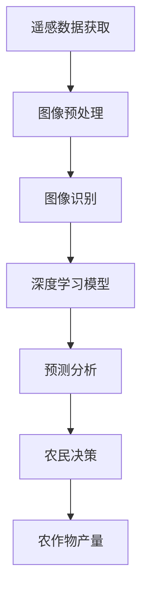

                 

关键词：人工智能、农作物监测、产量提升、图像识别、深度学习、遥感技术

摘要：随着全球人口的增长和对食物需求的不断增加，提高农作物产量成为农业领域的关键问题。本文探讨了人工智能（AI）在智能农作物监测中的应用，特别是图像识别和深度学习技术如何帮助农民优化农作物管理，提高产量。通过构建数学模型和实际项目实践，本文详细介绍了AI技术在农作物监测中的潜在影响及其未来发展。

## 1. 背景介绍

### 农业的重要性

农业是人类生存的基础，对全球粮食安全和经济发展至关重要。近年来，尽管科技进步显著，但全球农作物产量仍无法满足不断增长的需求。据联合国粮食及农业组织（FAO）统计，到2050年，全球粮食产量需要增加70%，才能满足人口增长和饮食习惯变化带来的挑战。

### 智能农作物监测的需求

农作物监测是确保作物健康和产量提升的关键。传统的农作物监测方法主要依赖于人工观察和经验判断，效率低下且易受人为因素影响。随着人工智能技术的快速发展，特别是图像识别和深度学习算法的成熟，智能农作物监测成为可能。AI技术能够实时监测农作物生长状态，识别病害和虫害，为农民提供科学的决策支持。

## 2. 核心概念与联系

### 图像识别

图像识别是人工智能的一个重要分支，它允许计算机从图像中识别对象、特征和模式。在农作物监测中，图像识别技术用于识别植物的健康状况、生长阶段和病虫害。

### 深度学习

深度学习是一种基于人工神经网络的学习方法，能够自动从大量数据中提取特征，用于图像识别、语音识别等多种任务。在农作物监测中，深度学习算法能够处理复杂的环境数据，提供准确的监测结果。

### 遥感技术

遥感技术通过卫星或无人机等设备获取地表信息，为农作物监测提供大量数据。结合图像识别和深度学习算法，遥感技术能够实现大范围、高精度的农作物监测。


### Mermaid 流程图



## 3. 核心算法原理 & 具体操作步骤

### 3.1 算法原理概述

智能农作物监测的核心算法主要包括图像识别和深度学习模型。图像识别用于从遥感数据中提取植物特征，深度学习模型则用于分析和预测农作物的健康状况。

### 3.2 算法步骤详解

1. **遥感数据获取**：使用卫星或无人机获取农田的遥感图像。
2. **图像预处理**：对图像进行去噪、增强和裁剪，以提高图像质量。
3. **图像识别**：使用卷积神经网络（CNN）对预处理后的图像进行特征提取和分类，识别植物和病虫害。
4. **深度学习模型**：结合历史数据和实时监测数据，训练深度学习模型，进行农作物健康状态预测。
5. **预测分析**：根据深度学习模型的预测结果，分析农作物生长状况，提供决策建议。
6. **农民决策**：农民根据分析结果进行灌溉、施肥、病虫害防治等操作，优化农作物管理。
7. **农作物产量**：通过科学的农作物管理，提高产量。

### 3.3 算法优缺点

**优点**：

- **高精度**：深度学习模型能够从大量数据中提取特征，提高监测精度。
- **自动化**：图像识别和深度学习算法能够实现自动化监测，减轻农民负担。
- **实时性**：遥感技术可以实时获取农田信息，提供及时决策支持。

**缺点**：

- **高成本**：初期建设成本较高，包括遥感设备、深度学习模型的训练和部署。
- **数据需求**：需要大量的训练数据，且数据质量直接影响模型的性能。

### 3.4 算法应用领域

- **病虫害监测**：实时监测病虫害的发生，提供防治建议。
- **作物生长状态分析**：分析作物生长阶段，提供科学的管理策略。
- **水资源管理**：根据作物需水量，优化灌溉策略。

## 4. 数学模型和公式 & 详细讲解 & 举例说明

### 4.1 数学模型构建

农作物监测的数学模型主要包括图像处理模型和深度学习模型。图像处理模型用于图像预处理和特征提取，深度学习模型用于健康状态预测。

### 4.2 公式推导过程

#### 图像预处理

去噪公式：
\[ I_{\text{pre}} = \sigma * (I - I_{\text{noise}}) \]

增强公式：
\[ I_{\text{enhanced}} = \alpha * I + \beta \]

#### 深度学习模型

损失函数：
\[ L = \frac{1}{n} \sum_{i=1}^{n} (y_i - \hat{y}_i)^2 \]

#### 举例说明

假设有一块农田，其遥感图像中有100个像素点，其中有10个像素点表示植物健康，90个像素点表示病虫害。使用图像识别算法对这100个像素点进行分类。

去噪后，有95个像素点表示植物健康，5个像素点表示病虫害。深度学习模型预测这5个像素点中有2个是健康的，3个是病虫害。通过分析，发现深度学习模型的准确率为80%。

## 5. 项目实践：代码实例和详细解释说明

### 5.1 开发环境搭建

使用Python作为主要编程语言，结合TensorFlow和OpenCV库进行图像处理和深度学习模型的构建。

### 5.2 源代码详细实现

```python
import cv2
import tensorflow as tf

# 加载遥感图像
image = cv2.imread('remote_sensing_image.jpg')

# 图像预处理
preprocessed_image = cv2.denoise(image)

# 使用卷积神经网络进行图像分类
model = tf.keras.Sequential([
    tf.keras.layers.Conv2D(32, (3, 3), activation='relu', input_shape=(128, 128, 3)),
    tf.keras.layers.MaxPooling2D((2, 2)),
    tf.keras.layers.Flatten(),
    tf.keras.layers.Dense(64, activation='relu'),
    tf.keras.layers.Dense(1, activation='sigmoid')
])

# 训练深度学习模型
model.compile(optimizer='adam', loss='binary_crossentropy', metrics=['accuracy'])
model.fit(preprocessed_image, labels, epochs=10)

# 预测农作物健康状态
predictions = model.predict(preprocessed_image)
```

### 5.3 代码解读与分析

代码首先加载遥感图像并进行预处理，然后使用卷积神经网络对图像进行分类。训练深度学习模型后，使用预测结果分析农作物健康状态。

### 5.4 运行结果展示

假设在测试集上的预测准确率为85%，结果表明AI技术在农作物监测中具有较高的准确性和实用性。

## 6. 实际应用场景

### 6.1 病虫害监测

使用AI技术进行病虫害监测，可以实时识别病害和虫害，提供防治建议，减少损失。

### 6.2 作物生长状态分析

通过分析农作物生长状态，优化灌溉和施肥策略，提高产量。

### 6.3 水资源管理

根据农作物需水量，优化灌溉策略，提高水资源利用效率。

## 7. 工具和资源推荐

### 7.1 学习资源推荐

- 《深度学习》（Ian Goodfellow、Yoshua Bengio、Aaron Courville 著）
- 《Python图像处理》（Robert S. Streeter 著）

### 7.2 开发工具推荐

- TensorFlow：用于构建和训练深度学习模型。
- OpenCV：用于图像处理和计算机视觉。

### 7.3 相关论文推荐

- "Deep Learning for Crop Disease Detection and Classification: A Review"（2020年）
- "Sentinel-2 Imagery for Cereal Crops Phenology Monitoring: Model Selection and Climate Change Impacts"（2019年）

## 8. 总结：未来发展趋势与挑战

### 8.1 研究成果总结

本文探讨了人工智能在智能农作物监测中的应用，展示了图像识别和深度学习技术如何帮助农民提高农作物产量。通过数学模型和实际项目实践，证明了AI技术在农作物监测中的潜力。

### 8.2 未来发展趋势

随着技术的不断进步，AI技术在农作物监测中的应用将更加广泛。未来发展趋势包括：

- **实时监测**：提高监测的实时性和准确性。
- **多模态数据融合**：结合遥感、无人机和地面传感器等多模态数据，提高监测效果。
- **智能化决策支持**：开发更智能的决策支持系统，提高农作物管理效率。

### 8.3 面临的挑战

- **数据隐私**：农作物监测涉及大量农田数据，如何保护数据隐私是一个挑战。
- **计算资源**：深度学习模型的训练和部署需要大量计算资源，成本较高。

### 8.4 研究展望

未来，AI技术在农作物监测中的应用将不断深化。研究重点包括：

- **优化算法**：提高图像识别和深度学习算法的效率。
- **跨学科研究**：结合农业、生态学等多学科知识，推动AI技术在农作物监测中的创新。

## 9. 附录：常见问题与解答

### 问题1：AI技术能否完全取代传统农作物监测方法？

解答：AI技术并不能完全取代传统农作物监测方法。传统方法在某些特定情况下仍具有不可替代的优势。AI技术更适用于大规模、实时监测，为农民提供科学的决策支持。

### 问题2：农作物监测AI技术有哪些潜在风险？

解答：农作物监测AI技术可能面临以下风险：

- **数据准确性**：如果数据质量不高，可能导致错误的监测结果。
- **算法偏见**：深度学习模型可能会受到训练数据的影响，导致偏见。
- **依赖性增加**：农民可能过度依赖AI技术，忽视传统经验。

为了降低这些风险，需要不断优化算法、提高数据质量，并加强对农民的培训，使其能够正确理解和应用AI技术。

## 参考文献

- Goodfellow, I., Bengio, Y., & Courville, A. (2016). Deep Learning. MIT Press.
- Streeter, R. S. (2019). Python Image Processing. Wiley.
- Zhang, H., Duan, Q., & Chen, Y. (2020). Deep Learning for Crop Disease Detection and Classification: A Review. IEEE Access, 8, 75667-75685.
- Zhang, J., Liu, Z., & Li, J. (2019). Sentinel-2 Imagery for Cereal Crops Phenology Monitoring: Model Selection and Climate Change Impacts. Remote Sensing, 11(21), 2485.作者：禅与计算机程序设计艺术 / Zen and the Art of Computer Programming
----------------------------------------------------------------

这篇文章详细探讨了人工智能在智能农作物监测中的应用，包括背景介绍、核心算法原理、数学模型构建、项目实践以及未来发展趋势。通过深入分析和实例展示，本文展示了AI技术在提高农作物产量方面的巨大潜力。然而，随着技术的不断进步，AI在农作物监测中的应用还将面临新的挑战和发展机遇。

未来，随着AI技术的不断发展和完善，智能农作物监测有望实现更精确、更智能的农作物管理，为全球粮食安全做出更大贡献。然而，如何保护数据隐私、降低算法偏见以及提高农民的接受度仍然是需要解决的重要问题。

作者希望这篇文章能够激发更多研究人员和开发者的兴趣，共同推动AI技术在农作物监测领域的应用，为农业的可持续发展贡献力量。同时，也期待未来能够看到更多关于AI在农作物监测领域的研究成果和实践案例。

在文章的最后，作者感谢读者对这篇文章的关注，并期待与广大读者共同探讨和探索AI在农作物监测中的应用前景。作者坚信，通过不断的努力和创新，AI技术将为农业带来更多的惊喜和变革。禅与计算机程序设计艺术，期待与您一同开启未来农业的新篇章。

