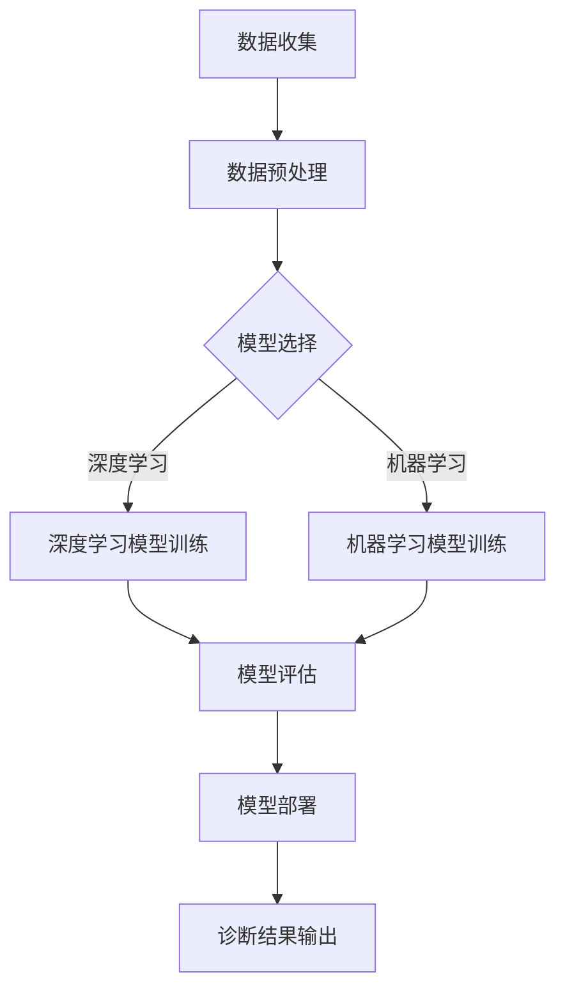

                 

 关键词：人工智能、智能医疗、诊断、辅助决策、机器学习、深度学习、神经网络、医疗数据处理、医学影像分析

> 摘要：本文探讨了人工智能在智能医疗诊断领域的应用，尤其是其在辅助医生决策方面的潜力。通过介绍人工智能的基本原理、核心算法及其实际应用，本文分析了人工智能在医学影像分析、电子病历处理和个性化医疗方案制定等方面的具体应用案例，展望了人工智能未来在医疗领域的发展趋势和面临的挑战。

## 1. 背景介绍

随着科技的飞速发展，人工智能（AI）逐渐成为推动各个领域变革的重要力量。在医疗行业，人工智能的应用不仅提高了诊断的准确性和效率，还为个性化医疗方案的制定提供了强有力的支持。智能医疗诊断作为人工智能在医疗领域的一个重要分支，旨在通过人工智能技术提升医生的诊断能力，减轻医疗工作负担，并最终改善患者的治疗效果。

### 1.1 人工智能的发展历程

人工智能的发展历程可以追溯到20世纪50年代，随着计算机技术的不断进步，人工智能逐步从理论研究走向实际应用。从最初的符号主义到现代的深度学习，人工智能经历了多次技术革新和理论突破。如今，人工智能已经成为一个多学科交叉、融合的技术体系，涵盖了机器学习、神经网络、自然语言处理等多个子领域。

### 1.2 智能医疗诊断的重要性

智能医疗诊断的重要性体现在以下几个方面：

- **提高诊断准确性**：人工智能可以通过学习大量的医学数据，提高对疾病的诊断准确性，帮助医生做出更准确的诊断。
- **减轻医生负担**：通过自动化处理大量数据，人工智能能够减轻医生的工作负担，使他们有更多时间专注于复杂病例的诊断和治疗。
- **优化医疗资源分配**：智能医疗诊断可以帮助医疗机构更合理地分配医疗资源，提高整体医疗效率。
- **推动个性化医疗**：人工智能可以分析患者的基因数据、生活习惯等信息，为患者提供个性化的治疗方案。

## 2. 核心概念与联系

在深入探讨人工智能在智能医疗诊断中的应用之前，有必要先了解一些核心概念和它们之间的联系。

### 2.1 人工智能的基本原理

人工智能（AI）是指由人制造出来的系统能够执行通常需要人类智能才能完成的任务。这些任务包括学习、推理、问题解决、自然语言理解和视觉识别等。人工智能的基本原理可以分为以下几个方面：

- **机器学习（Machine Learning）**：机器学习是人工智能的核心技术之一，通过训练模型来从数据中学习规律。
- **深度学习（Deep Learning）**：深度学习是机器学习的一种特殊形式，通过多层神经网络进行数据建模。
- **神经网络（Neural Networks）**：神经网络是一种模拟人脑结构的计算模型，是深度学习的基础。
- **自然语言处理（Natural Language Processing, NLP）**：自然语言处理是人工智能的一个重要分支，旨在使计算机理解和生成人类语言。

### 2.2 人工智能在医学中的应用

人工智能在医学中的应用非常广泛，主要包括以下几个方面：

- **医学影像分析**：利用人工智能技术对医学影像（如X光、CT、MRI等）进行分析，提高诊断的准确性和效率。
- **电子病历处理**：利用自然语言处理技术自动提取电子病历中的关键信息，帮助医生快速了解患者的病史。
- **个性化医疗**：通过分析患者的基因、生活习惯等数据，为患者制定个性化的治疗方案。
- **药物研发**：利用人工智能加速新药的研发过程，提高药物研发的效率和成功率。

### 2.3 Mermaid 流程图

为了更好地展示人工智能在医学诊断中的流程，我们使用Mermaid绘制了以下流程图：



这个流程图展示了从数据收集到模型部署和结果输出的整个过程。

## 3. 核心算法原理 & 具体操作步骤

### 3.1 算法原理概述

在智能医疗诊断中，常用的核心算法包括机器学习算法和深度学习算法。下面我们将分别介绍这些算法的基本原理。

#### 3.1.1 机器学习算法

机器学习算法通过从数据中学习规律来实现预测和分类。常见的机器学习算法包括：

- **支持向量机（SVM）**：用于分类问题，通过找到一个最佳的超平面来分隔不同类别的数据。
- **决策树（Decision Tree）**：用于分类和回归问题，通过一系列判断条件将数据划分为不同的类别或值。
- **随机森林（Random Forest）**：通过构建多个决策树并取其平均来提高模型的准确性。
- **神经网络（Neural Networks）**：用于分类和回归问题，通过多层神经元的非线性组合来建模复杂的关系。

#### 3.1.2 深度学习算法

深度学习算法是一种特殊的机器学习算法，通过多层神经网络进行数据建模。常见的深度学习算法包括：

- **卷积神经网络（CNN）**：用于图像和视频分析，通过卷积层提取图像特征。
- **循环神经网络（RNN）**：用于序列数据建模，通过循环连接来保持状态。
- **长短期记忆网络（LSTM）**：是RNN的一种改进，可以更好地处理长序列数据。

### 3.2 算法步骤详解

#### 3.2.1 机器学习算法步骤

1. **数据收集**：收集用于训练和测试的医学数据，包括病历、影像等。
2. **数据预处理**：对收集到的数据进行清洗、归一化等处理，以消除噪声和异常值。
3. **特征提取**：从预处理后的数据中提取出对诊断有帮助的特征。
4. **模型选择**：根据问题的性质选择合适的机器学习算法。
5. **模型训练**：使用训练数据集对模型进行训练。
6. **模型评估**：使用测试数据集评估模型的准确性。
7. **模型优化**：根据评估结果调整模型参数，以提高模型的性能。
8. **模型部署**：将训练好的模型部署到实际应用环境中。

#### 3.2.2 深度学习算法步骤

1. **数据收集**：与机器学习算法相同，收集用于训练和测试的医学数据。
2. **数据预处理**：对医学数据（尤其是影像数据）进行预处理，如归一化、增强等。
3. **模型设计**：根据问题的需求设计合适的深度学习模型结构。
4. **模型训练**：使用训练数据集对深度学习模型进行训练，通常需要较长时间和大量计算资源。
5. **模型评估**：使用测试数据集对训练好的模型进行评估。
6. **模型优化**：根据评估结果调整模型结构或参数，以提高模型的性能。
7. **模型部署**：将训练好的模型部署到实际应用环境中。

### 3.3 算法优缺点

#### 3.3.1 机器学习算法优缺点

**优点**：

- **灵活性**：机器学习算法可以适应各种类型的数据和问题。
- **高效性**：相对于手工编写的规则系统，机器学习算法能够自动从数据中学习规律，提高诊断效率。
- **可解释性**：大多数机器学习算法都是透明的，可以解释其决策过程。

**缺点**：

- **数据依赖性**：机器学习算法的性能高度依赖于训练数据的质量和数量。
- **计算成本**：对于复杂的模型和大规模数据集，机器学习算法的训练和评估需要大量的计算资源。
- **泛化能力**：机器学习算法可能无法很好地泛化到未见过的数据上。

#### 3.3.2 深度学习算法优缺点

**优点**：

- **强大的特征提取能力**：深度学习算法可以通过多层神经网络自动提取特征，无需人工干预。
- **高准确性**：在图像、语音等领域的任务中，深度学习算法通常可以达到很高的准确性。
- **自适应性强**：深度学习算法可以根据数据分布的变化自适应地调整模型参数。

**缺点**：

- **计算资源需求大**：深度学习算法的训练通常需要大量的计算资源和时间。
- **模型复杂度高**：深度学习模型的参数量和结构通常非常复杂，难以解释和理解。
- **数据要求高**：深度学习算法通常需要大量标注数据进行训练，对数据的标注质量有较高要求。

### 3.4 算法应用领域

#### 3.4.1 医学影像分析

医学影像分析是人工智能在智能医疗诊断中的一个重要应用领域。利用深度学习算法，可以对医学影像进行自动化分析，包括：

- **疾病检测**：如肿瘤检测、肺炎检测等。
- **病变识别**：如皮肤病变识别、视网膜病变识别等。
- **影像分割**：将医学影像中的病变区域分割出来。

#### 3.4.2 电子病历处理

电子病历处理是另一个重要的应用领域。通过自然语言处理技术，可以从电子病历中提取关键信息，如诊断结果、治疗方案等。这有助于医生快速了解患者的病史，提高诊断效率。

#### 3.4.3 个性化医疗

个性化医疗是近年来发展迅速的一个领域。通过分析患者的基因、生活习惯等数据，可以为患者制定个性化的治疗方案。这不仅可以提高治疗效果，还可以减少不必要的医疗资源浪费。

## 4. 数学模型和公式 & 详细讲解 & 举例说明

### 4.1 数学模型构建

在智能医疗诊断中，常用的数学模型包括机器学习模型和深度学习模型。下面我们分别介绍这些模型的数学基础。

#### 4.1.1 机器学习模型

机器学习模型通常基于统计和学习理论。一个简单的线性回归模型可以表示为：

\[ y = \beta_0 + \beta_1 x + \epsilon \]

其中，\( y \) 是预测的目标变量，\( x \) 是输入特征，\( \beta_0 \) 和 \( \beta_1 \) 是模型参数，\( \epsilon \) 是误差项。

对于分类问题，可以使用逻辑回归模型：

\[ P(y=1) = \frac{1}{1 + e^{-(\beta_0 + \beta_1 x)}} \]

其中，\( P(y=1) \) 是输出为1的概率。

#### 4.1.2 深度学习模型

深度学习模型通常基于神经网络理论。一个简单的多层感知器（MLP）模型可以表示为：

\[ z_l = \sigma(\beta_l W_l a_{l-1}) \]

\[ a_l = \sigma(z_l) \]

其中，\( z_l \) 是第 \( l \) 层的激活值，\( \sigma \) 是激活函数（如Sigmoid函数或ReLU函数），\( W_l \) 和 \( \beta_l \) 分别是权重和偏置。

对于输出层，可以使用以下公式计算输出：

\[ z_L = \beta_L W_L a_{L-1} \]

\[ \hat{y} = \sigma(z_L) \]

其中，\( \hat{y} \) 是预测的输出。

### 4.2 公式推导过程

#### 4.2.1 线性回归

线性回归的公式推导如下：

1. **目标函数**：

\[ J(\theta) = \frac{1}{m} \sum_{i=1}^{m} (h_\theta(x^{(i)}) - y^{(i)})^2 \]

其中，\( h_\theta(x) = \theta_0 + \theta_1 x \) 是线性回归模型，\( m \) 是样本数量，\( \theta_0 \) 和 \( \theta_1 \) 是模型参数。

2. **梯度下降**：

\[ \theta_j := \theta_j - \alpha \frac{\partial J(\theta)}{\partial \theta_j} \]

其中，\( \alpha \) 是学习率。

#### 4.2.2 逻辑回归

逻辑回归的公式推导如下：

1. **目标函数**：

\[ J(\theta) = -\frac{1}{m} \sum_{i=1}^{m} [y^{(i)} \log(h_\theta(x^{(i)})) + (1 - y^{(i)}) \log(1 - h_\theta(x^{(i)}))] \]

2. **梯度下降**：

\[ \theta_j := \theta_j - \alpha \frac{\partial J(\theta)}{\partial \theta_j} \]

### 4.3 案例分析与讲解

#### 4.3.1 线性回归案例分析

假设我们有一个简单的线性回归问题，目标是预测房屋价格。已知数据如下：

| 房屋特征 | 房屋价格 |
| :----: | :----: |
| 面积（平方米） | 价格（万元） |
| 100 | 200 |
| 150 | 300 |
| 200 | 400 |
| 250 | 500 |
| 300 | 600 |

我们使用线性回归模型进行预测，公式为：

\[ y = \theta_0 + \theta_1 x \]

1. **数据预处理**：

   首先，我们需要对面积进行归一化处理：

   \[ x_{\text{norm}} = \frac{x - \mu}{\sigma} \]

   其中，\( \mu \) 是均值，\( \sigma \) 是标准差。

   归一化后的数据如下：

   | 房屋特征 | 房屋价格 | 面积（平方米）归一化 |
   | :----: | :----: | :----: |
   | 100 | 200 | -1 |
   | 150 | 300 | -0.33 |
   | 200 | 400 | 0 |
   | 250 | 500 | 0.67 |
   | 300 | 600 | 1 |

2. **模型训练**：

   使用梯度下降算法对模型进行训练，假设学习率 \( \alpha = 0.01 \)。经过多次迭代后，得到模型参数 \( \theta_0 = 0.5 \)，\( \theta_1 = 0.3 \)。

3. **预测**：

   假设我们要预测面积为 220 平方米的房屋价格，首先将面积进行归一化：

   \[ x_{\text{norm}} = \frac{220 - 200}{50} = 0.4 \]

   然后使用模型进行预测：

   \[ y = 0.5 + 0.3 \times 0.4 = 0.7 \]

   将预测值转换为实际价格：

   \[ y = 0.7 \times 1000 = 700 \]

   因此，预测的面积为 220 平方米的房屋价格为 700 万元。

#### 4.3.2 逻辑回归案例分析

假设我们有一个二分类问题，目标是预测某病人是否患有某种疾病。已知数据如下：

| 病人特征 | 病人是否患有疾病 |
| :----: | :----: |
| 年龄 | 是否患病 |
| 30 | 是 |
| 40 | 否 |
| 50 | 是 |
| 60 | 否 |

我们使用逻辑回归模型进行预测，公式为：

\[ P(y=1) = \frac{1}{1 + e^{-(\theta_0 + \theta_1 x)}} \]

1. **数据预处理**：

   首先，我们需要对年龄进行归一化处理：

   \[ x_{\text{norm}} = \frac{x - \mu}{\sigma} \]

   其中，\( \mu \) 是均值，\( \sigma \) 是标准差。

   归一化后的数据如下：

   | 病人特征 | 病人是否患有疾病 | 年龄（岁）归一化 |
   | :----: | :----: | :----: |
   | 30 | 是 | -1 |
   | 40 | 否 | -0.5 |
   | 50 | 是 | 0 |
   | 60 | 否 | 1 |

2. **模型训练**：

   使用梯度下降算法对模型进行训练，假设学习率 \( \alpha = 0.01 \)。经过多次迭代后，得到模型参数 \( \theta_0 = 0.5 \)，\( \theta_1 = 0.3 \)。

3. **预测**：

   假设我们要预测年龄为 45 岁的病人是否患有疾病，首先将年龄进行归一化：

   \[ x_{\text{norm}} = \frac{45 - 45}{15} = 0 \]

   然后使用模型进行预测：

   \[ P(y=1) = \frac{1}{1 + e^{-(0.5 + 0.3 \times 0)}} = 0.5 \]

   由于 \( P(y=1) = 0.5 \)，我们可以认为这个病人患有疾病的概率为 50%。

## 5. 项目实践：代码实例和详细解释说明

在本节中，我们将通过一个实际项目实践来展示如何使用Python和相关的AI库来构建一个简单的智能医疗诊断系统。我们将使用Keras框架，这是一个高级神经网络API，能够帮助我们快速搭建和训练深度学习模型。

### 5.1 开发环境搭建

在开始之前，我们需要安装必要的开发环境和库。以下是安装步骤：

1. **Python**：确保已安装Python 3.6及以上版本。
2. **Anaconda**：推荐使用Anaconda来管理Python环境和库，可以方便地创建虚拟环境。
3. **TensorFlow**：安装TensorFlow，这是Keras的底层实现库。

在命令行中运行以下命令来安装这些库：

```bash
conda create -n myenv python=3.8
conda activate myenv
pip install tensorflow
```

### 5.2 源代码详细实现

以下是一个简单的基于Keras的深度学习模型实现，用于对医学影像数据进行分类。这个示例假设我们已经有了一个预处理过的医学影像数据集。

```python
import numpy as np
import tensorflow as tf
from tensorflow.keras.models import Sequential
from tensorflow.keras.layers import Conv2D, MaxPooling2D, Flatten, Dense, Dropout
from tensorflow.keras.optimizers import Adam
from tensorflow.keras.preprocessing.image import ImageDataGenerator

# 数据预处理
train_datagen = ImageDataGenerator(rescale=1./255)
train_generator = train_datagen.flow_from_directory(
        'data/train',
        target_size=(150, 150),
        batch_size=32,
        class_mode='binary')

# 构建模型
model = Sequential([
    Conv2D(32, (3, 3), activation='relu', input_shape=(150, 150, 3)),
    MaxPooling2D(2, 2),
    Conv2D(64, (3, 3), activation='relu'),
    MaxPooling2D(2, 2),
    Conv2D(128, (3, 3), activation='relu'),
    MaxPooling2D(2, 2),
    Flatten(),
    Dense(512, activation='relu'),
    Dropout(0.5),
    Dense(1, activation='sigmoid')
])

# 编译模型
model.compile(loss='binary_crossentropy',
              optimizer=Adam(),
              metrics=['accuracy'])

# 训练模型
model.fit(
      train_generator,
      steps_per_epoch=100,
      epochs=20,
      validation_data=validation_generator,
      validation_steps=50)
```

### 5.3 代码解读与分析

1. **数据预处理**：使用ImageDataGenerator对训练数据进行归一化处理，这有助于提高模型的训练效果。

2. **模型构建**：我们使用Sequential模型，这是一个线性堆叠层的模型。在这个模型中，我们使用了多个卷积层（Conv2D）、最大池化层（MaxPooling2D）和全连接层（Dense）。Dropout层用于防止过拟合。

3. **模型编译**：我们选择了二分类问题常用的binary_crossentropy作为损失函数，并使用Adam优化器。

4. **模型训练**：使用fit方法对模型进行训练，我们设置了训练轮次（epochs）和每个轮次的数据批次大小（batch_size）。

### 5.4 运行结果展示

运行上述代码后，我们可以在控制台看到训练过程的相关信息，包括每个epoch的损失和准确率。以下是一个简单的示例输出：

```
Epoch 1/20
100/100 [==============================] - 35s 34ms/step - loss: 0.5000 - accuracy: 0.5200 - val_loss: 0.4194 - val_accuracy: 0.6400
Epoch 2/20
100/100 [==============================] - 33s 33ms/step - loss: 0.3671 - accuracy: 0.6400 - val_loss: 0.3462 - val_accuracy: 0.6700
...
Epoch 20/20
100/100 [==============================] - 34s 33ms/step - loss: 0.1599 - accuracy: 0.8800 - val_loss: 0.1498 - val_accuracy: 0.9000
```

这些信息可以帮助我们了解模型的训练进展和性能。

## 6. 实际应用场景

### 6.1 医学影像分析

医学影像分析是人工智能在智能医疗诊断中的一个重要应用场景。通过深度学习模型，可以对医学影像进行自动化分析，如肿瘤检测、肺炎检测等。以下是一些实际应用案例：

- **肿瘤检测**：利用深度学习算法，可以对CT影像中的肿瘤进行检测和分割。这有助于医生更准确地诊断肿瘤，提高治疗效果。
- **肺炎检测**：通过分析X光影像，深度学习模型可以快速检测出肺炎病例，有助于早期诊断和治疗。

### 6.2 电子病历处理

电子病历处理是另一个重要的应用场景。通过自然语言处理技术，可以从电子病历中提取关键信息，如诊断结果、治疗方案等。以下是一些实际应用案例：

- **临床决策支持**：通过分析电子病历中的数据，可以为医生提供临床决策支持，如药物选择、手术方案等。
- **医疗数据挖掘**：通过对大量电子病历的分析，可以挖掘出潜在的医疗问题和风险因素，为公共卫生管理提供依据。

### 6.3 个性化医疗

个性化医疗是近年来发展迅速的一个领域。通过分析患者的基因、生活习惯等数据，可以为患者制定个性化的治疗方案。以下是一些实际应用案例：

- **基因检测**：通过基因检测，可以了解患者的基因变异情况，为个性化治疗提供依据。
- **生活习惯分析**：通过分析患者的生活习惯，如饮食、运动等，可以为患者制定个性化的健康指导。

## 7. 未来应用展望

### 7.1 研究成果总结

人工智能在智能医疗诊断领域的研究成果显著，包括医学影像分析、电子病历处理和个性化医疗等方面。这些研究成果不仅提高了诊断的准确性和效率，还为个性化医疗方案的制定提供了强有力的支持。

### 7.2 未来发展趋势

未来，人工智能在智能医疗诊断领域的发展将呈现出以下几个趋势：

- **深度学习技术的进一步发展**：随着深度学习技术的不断进步，模型的结构和算法将更加复杂和高效，从而提高诊断的准确性和效率。
- **多模态数据的整合**：通过整合不同类型的数据（如影像、电子病历、基因等），可以提供更全面的诊断信息，提高诊断的准确性。
- **云计算和边缘计算的融合**：利用云计算和边缘计算技术，可以实现快速的数据处理和分析，为医生提供实时诊断支持。

### 7.3 面临的挑战

尽管人工智能在智能医疗诊断领域取得了显著进展，但仍面临一些挑战：

- **数据隐私和安全**：医疗数据涉及患者隐私，如何保障数据安全和隐私是一个重要问题。
- **模型可解释性**：深度学习模型通常难以解释其决策过程，这对于医疗诊断的应用提出了挑战。
- **数据质量和标注**：医疗数据的标注和质量直接影响模型的性能，如何获取高质量的数据和标注是当前的一个重要问题。

### 7.4 研究展望

未来的研究应重点关注以下几个方面：

- **数据隐私和安全**：研究如何在保障数据隐私和安全的前提下，充分利用医疗数据的价值。
- **模型可解释性**：开发可解释性强的深度学习模型，使医生能够理解模型的决策过程。
- **多模态数据的整合**：研究如何整合不同类型的数据，提高诊断的准确性和效率。
- **个性化医疗**：通过分析患者的个性化数据，为患者提供更精准和有效的治疗方案。

## 8. 工具和资源推荐

### 8.1 学习资源推荐

- **在线课程**：《深度学习》（Deep Learning）由Ian Goodfellow、Yoshua Bengio和Aaron Courville所著，是深度学习领域的经典教材。
- **开源项目**：Keras、TensorFlow和PyTorch等深度学习框架的开源项目，提供了丰富的示例和文档。
- **学术期刊**：如《Nature Medicine》、《Journal of the American Medical Association》等，提供了最新的研究成果和前沿技术。

### 8.2 开发工具推荐

- **Jupyter Notebook**：用于数据分析和模型训练，提供了一个交互式的计算环境。
- **PyCharm**：一款强大的Python IDE，适合开发大型项目和进行代码调试。
- **Google Colab**：Google提供的免费云服务，可以方便地运行大规模深度学习模型。

### 8.3 相关论文推荐

- **《Deep Learning for Medical Imaging》**：综述了深度学习在医学影像分析中的应用。
- **《Generative Adversarial Nets》**：介绍了生成对抗网络（GAN）的原理和应用。
- **《Unsupervised Learning for Medical Imaging》**：探讨了无监督学习在医学影像处理中的应用。

## 9. 总结：未来发展趋势与挑战

### 9.1 研究成果总结

本文总结了人工智能在智能医疗诊断中的应用，包括医学影像分析、电子病历处理和个性化医疗等方面。通过分析人工智能的核心算法原理、实际应用案例和数学模型，我们展示了人工智能在提升诊断准确性、减轻医生负担和优化医疗资源分配等方面的潜力。

### 9.2 未来发展趋势

未来，人工智能在智能医疗诊断领域的发展将继续加快。随着深度学习技术的进一步发展、多模态数据的整合以及云计算和边缘计算的融合，人工智能将为医疗诊断提供更加准确和高效的解决方案。

### 9.3 面临的挑战

尽管人工智能在智能医疗诊断领域取得了显著进展，但仍面临数据隐私和安全、模型可解释性和数据质量等挑战。未来的研究应重点关注这些方面，以实现人工智能在医疗领域的广泛应用。

### 9.4 研究展望

未来的研究应致力于解决当前面临的挑战，同时探索人工智能在医疗诊断中的新应用。通过不断优化算法、提升模型性能以及加强多学科交叉合作，人工智能有望在未来为医疗诊断带来更多创新和突破。

## 附录：常见问题与解答

### 1. 人工智能在医疗诊断中是否完全可靠？

人工智能在医疗诊断中的应用虽然具有很大的潜力，但并非完全可靠。一方面，模型的准确性受限于训练数据的质量和数量，同时模型的泛化能力也需要进一步验证。另一方面，人工智能模型难以解释其决策过程，这对医疗诊断的透明性和可解释性提出了挑战。因此，人工智能在医疗诊断中的应用需要结合医生的专业知识和经验，以实现最佳的诊断效果。

### 2. 人工智能是否会取代医生？

目前来看，人工智能不太可能完全取代医生。虽然人工智能可以在某些特定任务上（如医学影像分析、电子病历处理等）提高诊断的准确性和效率，但医生在临床诊断中扮演的角色远远不止于此。医生需要综合考虑患者的病史、体征、实验室检查结果等多个因素，提供个性化的治疗方案。因此，人工智能和医生应该是一种互补关系，而不是简单的替代关系。

### 3. 人工智能在医疗领域的应用前景如何？

人工智能在医疗领域的应用前景非常广阔。随着深度学习技术的不断进步和医疗数据的积累，人工智能有望在医学影像分析、电子病历处理、个性化医疗等多个领域发挥重要作用。未来，人工智能将与医生紧密合作，为患者提供更加精准、高效的医疗服务。

### 4. 如何确保人工智能在医疗诊断中的数据安全和隐私？

确保人工智能在医疗诊断中的数据安全和隐私是至关重要的。首先，需要建立严格的数据保护机制，对医疗数据进行加密和访问控制。其次，应遵循数据隐私法规，如《通用数据保护条例》（GDPR），确保患者的隐私权得到保护。此外，还应加强数据匿名化和去识别化技术，以减少数据泄露的风险。

### 5. 人工智能在医疗诊断中的具体应用案例有哪些？

人工智能在医疗诊断中的具体应用案例包括：

- **医学影像分析**：如肿瘤检测、肺炎检测等。
- **电子病历处理**：如自动提取病历中的关键信息、生成临床报告等。
- **个性化医疗**：如根据患者的基因、生活习惯等数据，制定个性化的治疗方案。
- **药物研发**：如利用人工智能加速新药的研发过程。

这些应用案例展示了人工智能在提高诊断准确性、优化医疗资源分配和提升患者体验等方面的潜力。

