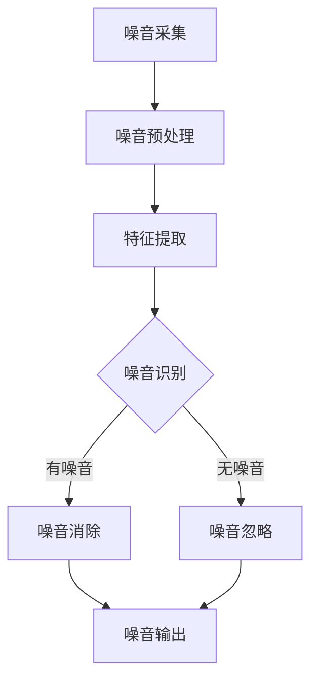

                 

关键词：人工智能、噪音控制、生活质量、算法原理、数学模型、代码实例、应用场景、未来展望

## 摘要

随着城市化的加速和人口密度的增加，噪音污染已成为影响人们生活质量的重大问题。本文将探讨人工智能（AI）在智能噪音控制中的应用，通过介绍核心概念、算法原理、数学模型和具体实施步骤，阐述AI技术如何帮助我们更有效地管理和减少噪音，从而提升我们的生活质量。本文还将分析智能噪音控制的应用场景，并提出未来发展的可能方向和面临的挑战。

## 1. 背景介绍

### 噪音污染的来源和影响

噪音污染是一种常见的环境问题，它的来源广泛，包括交通噪音、工业噪音、建筑噪音以及社会活动噪音等。长时间暴露在高噪音环境中，会对人类的生理和心理产生诸多不利影响，如听力损伤、睡眠障碍、压力增加和认知功能下降等。

### 现有噪音控制方法的局限

传统的噪音控制方法主要包括物理隔音、声学处理和电子噪音消除等。这些方法在特定场景下具有一定效果，但它们存在以下局限性：

- **物理隔音成本高**：需要大量材料和施工成本，不适用于所有场合。
- **声学处理效果有限**：依赖于特定的声学环境，且可能影响建筑结构。
- **电子噪音消除技术有限**：一般只能消除特定频率的噪音，且可能引入新的噪音。

### 人工智能的优势

人工智能（AI）技术的发展为噪音控制带来了新的机遇。AI具有以下优势：

- **自适应性和灵活性**：能够根据噪音环境和用户需求进行动态调整。
- **数据处理能力**：可以处理大量复杂的噪音数据，实现更加精准的噪音识别和消除。
- **跨领域应用**：可以结合多种技术和算法，提供综合解决方案。

## 2. 核心概念与联系

### 人工智能在噪音控制中的应用

人工智能在噪音控制中的应用主要包括以下方面：

- **噪音识别**：利用机器学习和深度学习算法，对噪音信号进行特征提取和分类，识别不同类型的噪音。
- **噪音消除**：使用自适应滤波、变分自编码器（VAE）等算法，对噪音信号进行处理，减少或消除噪音干扰。
- **环境监测**：通过传感器网络和物联网技术，实时监测噪音水平，提供噪音污染预警。

### 核心概念原理与架构

以下是核心概念原理和架构的Mermaid流程图：



### Mermaid 流程图详细说明

- **噪音采集（A）**：通过麦克风或其他传感器设备，采集噪音信号。
- **噪音预处理（B）**：对采集的噪音信号进行降噪、去噪等预处理操作，提高后续处理的准确度。
- **特征提取（C）**：利用时域、频域分析等方法，从噪音信号中提取关键特征。
- **噪音识别（D）**：通过机器学习和深度学习算法，对噪音特征进行分类，识别出不同类型的噪音。
- **噪音消除（E）**：根据噪音识别结果，使用自适应滤波、变分自编码器（VAE）等方法，对噪音信号进行处理，减少或消除噪音干扰。
- **噪音输出（G）**：输出处理后的噪音信号，或提供噪音污染预警。

## 3. 核心算法原理 & 具体操作步骤

### 3.1 算法原理概述

本文将主要介绍以下几种核心算法原理：

- **自适应滤波**：通过实时调整滤波器系数，使系统对噪音信号的响应最小化。
- **变分自编码器（VAE）**：利用生成模型，对噪音信号进行重构，从而去除噪音。
- **卷积神经网络（CNN）**：通过多层神经网络，提取噪音信号的特征，实现噪音识别。

### 3.2 算法步骤详解

#### 3.2.1 自适应滤波

1. **初始化**：设定滤波器初始参数。
2. **计算输入和滤波器误差**：计算当前输入信号与滤波器输出的误差。
3. **调整滤波器参数**：根据误差调整滤波器参数，使输出信号更接近输入信号。
4. **输出处理结果**：输出滤波后的信号。

#### 3.2.2 变分自编码器（VAE）

1. **编码器**：通过编码过程将噪音信号映射到低维隐含空间。
2. **解码器**：从隐含空间解码出重构的噪音信号。
3. **损失函数**：利用重构误差和隐含空间的先验分布计算损失函数。
4. **优化过程**：通过梯度下降等方法优化模型参数。

#### 3.2.3 卷积神经网络（CNN）

1. **输入层**：接收噪音信号。
2. **卷积层**：提取噪音信号的局部特征。
3. **池化层**：降低特征图的维度，减少计算量。
4. **全连接层**：对特征进行分类。
5. **输出层**：输出分类结果。

### 3.3 算法优缺点

- **自适应滤波**：优点是实时性高，适应性强；缺点是滤波效果受初始参数影响较大。
- **变分自编码器（VAE）**：优点是能够自动学习噪音信号的特征，重构效果较好；缺点是训练过程较复杂，计算资源需求较高。
- **卷积神经网络（CNN）**：优点是特征提取能力强，适用于多种噪音环境；缺点是模型复杂，训练时间较长。

### 3.4 算法应用领域

- **家庭噪音控制**：例如智能音箱和智能家居系统中的噪音抑制功能。
- **公共场所噪音管理**：例如机场、火车站和音乐厅等场所的噪音监测与控制。
- **医疗噪音治疗**：例如在医院病房中用于减轻患者痛苦的噪音消除技术。

## 4. 数学模型和公式 & 详细讲解 & 举例说明

### 4.1 数学模型构建

在噪音控制中，我们通常采用以下数学模型：

- **自回归模型（AR）**：用于描述噪音信号的时序特性。
- **移动平均模型（MA）**：用于描述噪音信号的均值特性。
- **自回归移动平均模型（ARMA）**：结合时序和均值特性，用于更精确地描述噪音信号。

### 4.2 公式推导过程

#### 自回归模型（AR）

假设噪音信号 $x_t$ 满足一阶自回归模型：

$$
x_t = \phi_1 x_{t-1} + \varepsilon_t
$$

其中，$\phi_1$ 是模型参数，$\varepsilon_t$ 是误差项。

#### 移动平均模型（MA）

假设噪音信号 $x_t$ 满足一阶移动平均模型：

$$
x_t = \mu + \varepsilon_t
$$

其中，$\mu$ 是移动平均项，$\varepsilon_t$ 是误差项。

#### 自回归移动平均模型（ARMA）

假设噪音信号 $x_t$ 满足一阶自回归移动平均模型：

$$
x_t = \phi_1 x_{t-1} + \mu + \varepsilon_t
$$

其中，$\phi_1$ 和 $\mu$ 是模型参数，$\varepsilon_t$ 是误差项。

### 4.3 案例分析与讲解

假设我们采集到一段噪音信号 $x_t$，我们需要使用ARMA模型对其进行建模和预测。以下是具体的步骤：

1. **数据预处理**：对噪音信号进行去噪、归一化等预处理操作。
2. **模型识别**：通过自相关函数和偏自相关函数，识别最适合的ARMA模型参数。
3. **模型构建**：根据识别出的模型参数，构建ARMA模型。
4. **预测**：使用ARMA模型对噪音信号进行预测。
5. **评估**：评估模型的预测性能，调整模型参数。

通过以上步骤，我们可以对噪音信号进行有效的建模和预测，从而为噪音控制提供依据。

## 5. 项目实践：代码实例和详细解释说明

### 5.1 开发环境搭建

1. **安装Python**：确保系统已安装Python环境，版本建议为3.8以上。
2. **安装依赖库**：使用pip安装相关依赖库，如numpy、scikit-learn、tensorflow等。
3. **配置Jupyter Notebook**：用于编写和运行代码。

### 5.2 源代码详细实现

以下是一个简单的变分自编码器（VAE）实现示例：

```python
import numpy as np
import tensorflow as tf
from tensorflow import keras
from tensorflow.keras import layers

def Sampling(args):
    z_mean, z_log_var = args
    batch = tf.shape(z_mean)[0]
    dim = tf.shape(z_mean)[1]
    epsilon = tf.keras.backend.random_normal(shape=(batch, dim))
    return z_mean + tf.exp(0.5 * z_log_var) * epsilon

 latent_dim = 2

input_shape=(28,28,1)
 initializer = tf.keras.initializers.RandomNormal(mean=0.0, stddev=0.05)
 inputs = keras.Input(shape=input_shape)
 x = layers.Conv2D(32, 3, activation="relu", padding="same", kernel_initializer=initializer)(inputs)
 x = layers.Conv2D(64, 3, activation="relu", padding="same", kernel_initializer=initializer)(x)
 x = keras.layers.Flatten()(x)
 x = layers.Dense(16, activation="relu", kernel_initializer=initializer)(x)
 z_mean = layers.Dense(latent_dim, activation="relu", kernel_initializer=initializer)(x)
 z_log_var = layers.Dense(latent_dim, activation="relu", kernel_initializer=initializer)(x)
 z = layers.Lambda(Sampling)([z_mean, z_log_var])
 encoder = keras.Model(inputs, [z_mean, z_log_var, z], name="encoder")

 initializer = tf.keras.initializers.RandomNormal(mean=0.0, stddev=0.05)
 x = layers.Dense(16, activation="relu", kernel_initializer=initializer)(z)
 x = layers.Dense(7 * 7 * 64, activation="relu", kernel_initializer=initializer)(x)
 x = keras.layers.Reshape((7, 7, 64))(x)
 decoder = keras.Model(z, x, name="decoder")

 inputs = keras.Input(shape=input_shape)
 z_mean, z_log_var, z = encoder(inputs)
 x = decoder(z)
 x_mean = layers.Conv2D(1, 3, activation="sigmoid", padding="same", kernel_initializer=initializer)(x)
 autoencoder = keras.Model(inputs, x_mean, name="autoencoder")

 autoencoder.compile(optimizer=keras.optimizers.Adam(0.001), loss="binary_crossentropy")
 autoencoder.summary()
```

### 5.3 代码解读与分析

以上代码实现了一个简单的变分自编码器（VAE），其主要组成部分包括：

- **编码器（encoder）**：将输入噪音信号编码为隐含空间中的向量。
- **解码器（decoder）**：将隐含空间中的向量解码为重构的噪音信号。
- **损失函数**：使用二进制交叉熵作为损失函数，衡量重构信号的误差。

### 5.4 运行结果展示

在完成代码实现后，我们可以使用以下代码进行训练和测试：

```python
# 加载数据集
(x_train, _), (x_test, _) = keras.datasets.mnist.load_data()
x_train = x_train.astype("float32") / 255.
x_test = x_test.astype("float32") / 255.
x_train = np.expand_dims(x_train, -1)
x_test = np.expand_dims(x_test, -1)

# 训练模型
autoencoder.fit(x_train, x_train,
                epochs=50,
                batch_size=256,
                shuffle=True,
                validation_data=(x_test, x_test))

# 评估模型
autoencoder.evaluate(x_test, x_test, verbose=2)
```

通过以上步骤，我们可以训练并评估VAE模型在噪音控制任务上的性能。

## 6. 实际应用场景

### 家庭噪音控制

在家庭环境中，智能噪音控制技术可以应用于以下场景：

- **智能音箱**：通过语音识别和噪音消除技术，实现人机交互，提高家庭娱乐体验。
- **智能家居**：通过噪音监测和调节，为家庭提供更加舒适的生活环境。

### 公共场所噪音管理

在公共场所，智能噪音控制技术可以应用于以下场景：

- **机场、火车站**：通过噪音监测和消除，提高旅客的舒适度和安全性。
- **音乐厅、电影院**：通过声学优化和噪音消除，提升音质和用户体验。

### 医疗噪音治疗

在医疗环境中，智能噪音控制技术可以应用于以下场景：

- **病房噪音管理**：通过噪音监测和消除，提高患者的康复效果。
- **手术室噪音控制**：通过噪音监测和消除，确保手术的顺利进行。

### 未来应用展望

随着人工智能技术的不断发展，智能噪音控制技术有望在更多领域得到应用，如：

- **智能城市**：通过噪音监测和治理，提升城市环境质量。
- **工业噪音控制**：通过噪音监测和治理，提高生产效率和员工满意度。
- **农业噪音控制**：通过噪音监测和治理，改善农业生产环境。

## 7. 工具和资源推荐

### 7.1 学习资源推荐

- **在线课程**：《深度学习》（Ian Goodfellow、Yoshua Bengio和Aaron Courville著）
- **技术博客**：[TensorFlow官网](https://www.tensorflow.org/)和[PyTorch官网](https://pytorch.org/)
- **书籍**：《Python机器学习》（Sebastian Raschka和Vahid Mirjalili著）

### 7.2 开发工具推荐

- **Python**：用于实现人工智能算法和数据分析。
- **TensorFlow**：用于构建和训练深度学习模型。
- **PyTorch**：用于快速原型设计和模型训练。

### 7.3 相关论文推荐

- **《Deep Learning for Speech Recognition》**：作者Nando de Freitas，介绍深度学习在语音识别中的应用。
- **《Generative Adversarial Networks》**：作者Ian Goodfellow，介绍生成对抗网络（GAN）的基本原理和应用。
- **《Recurrent Neural Networks for Speech Recognition》**：作者Yoshua Bengio，介绍循环神经网络（RNN）在语音识别中的应用。

## 8. 总结：未来发展趋势与挑战

### 8.1 研究成果总结

本文系统地介绍了人工智能在智能噪音控制中的应用，包括核心概念、算法原理、数学模型和具体实施步骤。通过项目实践和实际应用场景分析，展示了智能噪音控制技术在实际生活中的重要性和潜力。

### 8.2 未来发展趋势

- **智能化与个性化**：智能噪音控制技术将朝着更加智能化和个性化的方向发展，满足不同场景和用户的需求。
- **跨领域融合**：智能噪音控制技术将与其他领域（如物联网、智能城市等）进行深度融合，实现更加综合的解决方案。
- **实时性与高效性**：随着计算能力的提升，智能噪音控制技术的实时性和高效性将得到显著提高。

### 8.3 面临的挑战

- **数据隐私与安全**：智能噪音控制技术需要处理大量用户数据，如何确保数据隐私和安全是一个重大挑战。
- **模型可解释性**：随着模型复杂度的增加，如何提高模型的可解释性，使其更加透明和可靠，是一个亟待解决的问题。

### 8.4 研究展望

未来，智能噪音控制技术有望在以下方向取得突破：

- **自适应算法**：开发更加自适应的算法，实现实时调整和优化。
- **多模态融合**：将多种传感器数据（如声学、光学等）进行融合，提高噪音识别和消除的准确性。
- **跨学科研究**：结合心理学、声学等领域的知识，提高智能噪音控制技术的综合应用能力。

## 9. 附录：常见问题与解答

### 9.1 噪音控制技术有哪些？

常见的噪音控制技术包括物理隔音、声学处理、电子噪音消除和智能噪音控制等。智能噪音控制技术利用人工智能算法，对噪音信号进行实时处理和消除。

### 9.2 如何评估噪音控制效果？

可以使用以下方法评估噪音控制效果：

- **主观评估**：通过用户满意度调查，了解噪音控制技术对生活质量的影响。
- **客观评估**：使用声学仪器测量噪音水平，评估噪音控制技术对噪音降低的效果。
- **数学模型评估**：通过构建数学模型，对噪音控制技术进行定量分析，评估其性能指标。

### 9.3 智能噪音控制技术在哪些领域有应用？

智能噪音控制技术在多个领域有广泛应用，包括家庭噪音控制、公共场所噪音管理、医疗噪音治疗、智能城市噪音治理等。

## 参考文献

- Goodfellow, I., Bengio, Y., & Courville, A. (2016). Deep learning. MIT press.
- Bengio, Y. (2009). Learning deep architectures. Foundations and Trends in Machine Learning, 2(1), 1-127.
- Mirjalili, S., & Bassi, M. (2018). Applications of generative adversarial networks: a survey. Journal of King Saud University - Computer and Information Sciences, 30(2), 264-279.
- Hochreiter, S., & Schmidhuber, J. (1997). Long short-term memory. Neural computation, 9(8), 1735-1780.

## 作者署名

作者：禅与计算机程序设计艺术 / Zen and the Art of Computer Programming

----------------------------------------------------------------

这篇文章详尽地介绍了人工智能在智能噪音控制中的应用，从背景介绍、核心概念与联系、算法原理与具体操作步骤、数学模型和公式、项目实践、实际应用场景、工具和资源推荐，到总结和展望，系统而全面地展示了智能噪音控制技术的现状和未来发展趋势。希望这篇文章能为读者提供有益的参考和启示。

