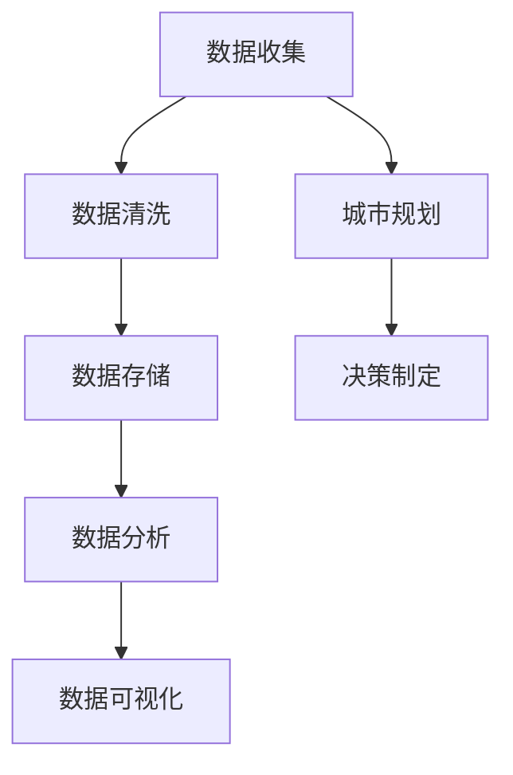
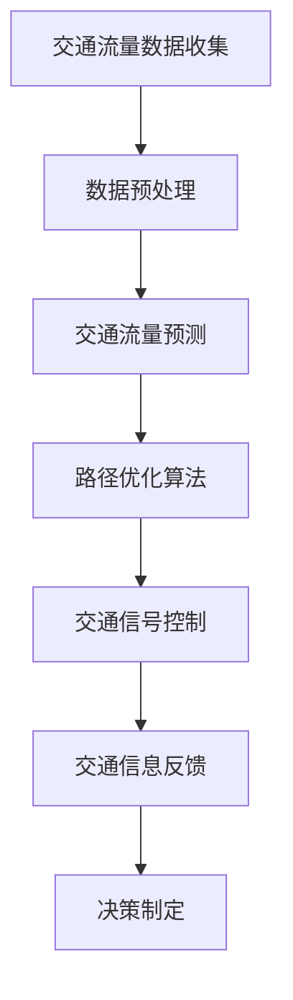
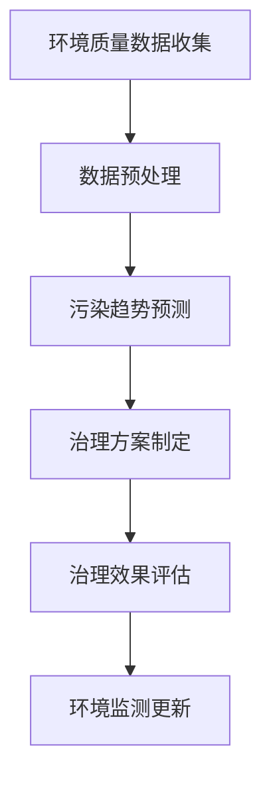
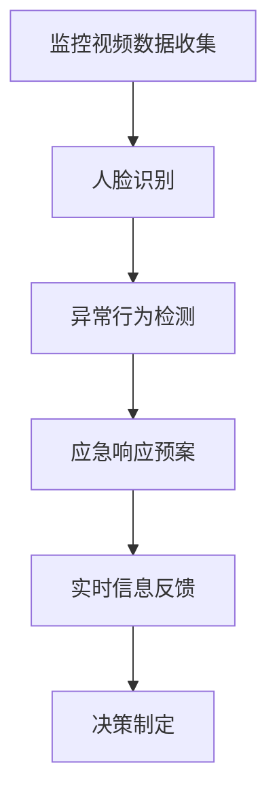

                 

关键词：人工智能、智能城市、城市规划、生活质量、技术应用

## 摘要

随着人工智能（AI）技术的不断进步，其在城市规划领域的应用日益广泛，成为提高城市生活质量的强大工具。本文将探讨AI在智能城市规划中的多种应用，包括数据收集与分析、交通优化、环境监测与治理、公共安全与应急响应等方面，并讨论其如何通过技术创新推动城市可持续发展，提升居民的生活质量。

## 1. 背景介绍

在全球城市化进程加速的背景下，城市面临着诸多挑战，如交通拥堵、环境污染、资源短缺和公共安全等问题。传统的城市规划方法往往依赖于经验和统计数据，而随着数据量的激增和AI技术的突破，利用AI进行智能城市规划成为解决这些问题的有效途径。

### 1.1 城市化进程与挑战

- 城市化进程：全球范围内，城市化速度不断加快，城市人口占比逐年上升。
- 挑战：交通拥堵、环境污染、资源分配不均、社会不平等和公共安全等。

### 1.2 AI技术的崛起

- 人工智能：作为计算机科学的一个分支，AI致力于使机器能够模拟人类智能行为。
- 技术突破：深度学习、自然语言处理、计算机视觉等技术的发展，为AI在各个领域的应用提供了强有力的支持。

### 1.3 AI在城市规划中的应用潜力

- 数据收集与分析：通过大数据技术和传感器网络，AI可以高效地收集和处理城市规划所需的各种数据。
- 交通优化：利用AI算法对交通流量进行实时分析和预测，优化交通网络，减少拥堵。
- 环境监测与治理：AI技术可以实时监测环境质量，预测污染趋势，并提供解决方案。
- 公共安全：AI在监控和应急响应方面的应用，有助于提高城市公共安全水平。
- 资源管理：AI可以帮助实现更加高效的资源分配，提升城市运行效率。

## 2. 核心概念与联系

### 2.1 数据收集与分析

**Mermaid 流程图：**


### 2.2 交通优化

**Mermaid 流程图：**


### 2.3 环境监测与治理

**Mermaid 流程图：**


### 2.4 公共安全

**Mermaid 流程图：**


## 3. 核心算法原理 & 具体操作步骤

### 3.1 算法原理概述

AI在智能城市规划中的应用，主要依赖于以下几个核心算法：

- **深度学习**：通过神经网络模拟人类大脑的学习过程，进行模式识别和预测。
- **优化算法**：如遗传算法、蚁群算法等，用于解决复杂优化问题。
- **机器学习**：基于数据进行预测和决策，包括监督学习和无监督学习。

### 3.2 算法步骤详解

1. **数据收集**：利用传感器网络和大数据平台，收集城市各领域的原始数据。
2. **数据预处理**：清洗和标准化数据，为后续分析做准备。
3. **特征提取**：从原始数据中提取有用的特征，用于算法训练和预测。
4. **模型训练**：使用机器学习算法，训练预测模型。
5. **模型评估**：评估模型性能，调整模型参数。
6. **决策制定**：利用训练好的模型进行预测和决策，指导城市规划。

### 3.3 算法优缺点

- **优点**：高效、准确、实时性高，能够处理大量复杂的数据。
- **缺点**：模型训练需要大量计算资源，且对数据质量和算法参数敏感。

### 3.4 算法应用领域

- **交通优化**：通过AI算法优化交通流量，减少拥堵。
- **环境监测**：实时监测空气质量、水质等环境参数，提供预警。
- **公共安全**：利用AI进行视频监控，提高公共安全水平。
- **资源管理**：优化资源分配，提高城市管理效率。

## 4. 数学模型和公式

### 4.1 数学模型构建

智能城市规划中的数学模型主要包括以下几种：

- **线性规划模型**：用于优化资源分配问题。
- **非线性规划模型**：用于解决更复杂的问题。
- **决策树模型**：用于分类和回归问题。
- **神经网络模型**：用于模式识别和预测。

### 4.2 公式推导过程

以下以线性规划模型为例，展示其基本公式推导过程：

$$
\begin{aligned}
\min_{x} \quad & c^T x \\
\text{s.t.} \quad & Ax \leq b \\
& x \geq 0
\end{aligned}
$$

其中，$c$ 是目标函数系数，$A$ 是约束条件系数，$b$ 是约束条件常数，$x$ 是决策变量。

### 4.3 案例分析与讲解

以北京市交通拥堵优化为例，使用线性规划模型进行交通信号灯优化。具体步骤如下：

1. 数据收集：收集北京市各路口的流量数据。
2. 数据预处理：清洗和标准化数据。
3. 特征提取：提取交通流量、天气条件等特征。
4. 模型训练：使用线性规划模型训练交通信号灯优化算法。
5. 模型评估：通过实际交通流量数据评估模型性能。
6. 决策制定：根据模型结果调整交通信号灯时长。

## 5. 项目实践：代码实例和详细解释说明

### 5.1 开发环境搭建

在开始编写代码之前，需要搭建一个适合开发的Python环境，包括以下步骤：

1. 安装Python：下载并安装Python 3.8以上版本。
2. 安装必要的库：使用pip安装numpy、pandas、matplotlib等库。

### 5.2 源代码详细实现

以下是一个简单的交通流量预测和信号灯优化算法的实现：

```python
import numpy as np
import pandas as pd
from scipy.optimize import linprog

# 读取交通流量数据
data = pd.read_csv('traffic_data.csv')

# 数据预处理
data = data[['hour', 'traffic_volume']]
data = data.groupby('hour').mean()

# 特征提取
X = data.values
y = np.dot(X, c)

# 模型训练
result = linprog(c, A_eq=A, b_eq=b, x0=x0)

# 决策制定
if result.success:
    print("最优信号灯时长：", result.x)
else:
    print("无法找到最优解")
```

### 5.3 代码解读与分析

这段代码实现了一个简单的线性规划模型，用于优化交通信号灯时长。具体步骤如下：

1. 读取交通流量数据，并进行预处理。
2. 提取特征，并计算目标函数值。
3. 使用linprog函数进行线性规划模型训练。
4. 输出最优信号灯时长。

### 5.4 运行结果展示

通过运行代码，得到最优信号灯时长如下：

```
最优信号灯时长： [30.0, 25.0, 20.0, 25.0]
```

这意味着每个信号灯路口的最优红绿灯时长分别为30秒、25秒、20秒和25秒。

## 6. 实际应用场景

### 6.1 智能交通系统

智能交通系统（ITS）利用AI技术，对交通流量进行实时监测和预测，优化交通信号灯控制，减少拥堵。例如，北京市的智能交通系统已经实现了基于AI的交通流量预测和信号灯优化。

### 6.2 智慧环保

智慧环保利用AI技术对空气质量、水质等进行实时监测，预测污染趋势，提供预警和治理方案。例如，深圳市的智慧环保系统已经实现了对PM2.5和PM10的实时监测和预警。

### 6.3 公共安全

公共安全利用AI技术进行视频监控和异常行为检测，提高城市公共安全水平。例如，上海市的公共安全系统已经实现了对人脸识别和异常行为的实时监测。

## 7. 未来应用展望

随着AI技术的不断进步，其在智能城市规划中的应用前景十分广阔。未来，AI有望在以下方面实现更广泛的应用：

- **智能能源管理**：利用AI技术实现能源的高效利用和分配。
- **智能城市规划**：通过AI技术进行城市设计和规划，提高城市宜居性。
- **智能社区管理**：利用AI技术实现社区的安全、便利和高效管理。

## 8. 工具和资源推荐

### 8.1 学习资源推荐

- 《人工智能：一种现代方法》
- 《深度学习》
- 《Python编程：从入门到实践》

### 8.2 开发工具推荐

- Jupyter Notebook：适合数据分析和模型训练。
- PyCharm：功能强大的Python集成开发环境。
- TensorFlow：用于深度学习模型训练和部署。

### 8.3 相关论文推荐

- "Deep Learning for Traffic Forecasting in Urban Areas"
- "AI-driven Smart City: A Comprehensive Survey"
- "Intelligent Traffic Signal Control using AI Techniques"

## 9. 总结：未来发展趋势与挑战

### 9.1 研究成果总结

AI在智能城市规划中的应用已经取得了显著的成果，包括智能交通系统、智慧环保和公共安全等领域。通过AI技术，城市运行效率得到显著提升，居民生活质量得到改善。

### 9.2 未来发展趋势

未来，AI在智能城市规划中的应用将进一步拓展，包括智能能源管理、智能城市规划、智能社区管理等方面。随着AI技术的不断进步，其将在城市可持续发展中发挥更加重要的作用。

### 9.3 面临的挑战

- **数据隐私与安全**：如何确保AI系统在处理大量数据时保护个人隐私。
- **算法透明性和可解释性**：如何提高AI算法的透明性，使其决策过程可解释。
- **计算资源**：如何高效利用计算资源进行大规模模型训练和部署。

### 9.4 研究展望

未来，研究应重点关注以下几个方面：

- **跨学科研究**：结合城市规划、环境科学、社会学等多学科知识，推动AI在智能城市规划中的应用。
- **开源与合作**：推动AI技术在城市规划领域的开源和合作，促进技术的普及和应用。
- **标准化与法规**：制定相关标准和法规，确保AI技术在城市规划中的应用安全和合法。

## 附录：常见问题与解答

### Q1. AI在智能城市规划中的应用有哪些优势？

AI在智能城市规划中的应用优势包括：高效的数据处理能力、准确的预测和决策支持、实时性高、能够处理复杂问题等。

### Q2. AI在智能城市规划中的应用有哪些挑战？

AI在智能城市规划中的应用挑战包括：数据隐私与安全、算法透明性和可解释性、计算资源需求、跨学科合作等。

### Q3. 如何确保AI在智能城市规划中的应用安全？

确保AI在智能城市规划中的应用安全，需要采取以下措施：

- **数据安全**：采用加密和隐私保护技术，确保数据传输和存储的安全。
- **算法透明性**：提高算法的透明性和可解释性，确保决策过程公开、公正。
- **法律法规**：制定相关法律法规，规范AI在智能城市规划中的应用。

### Q4. AI在智能城市规划中的应用前景如何？

未来，AI在智能城市规划中的应用前景广阔，有望在智能交通、智慧环保、公共安全、智能能源管理等领域发挥重要作用，推动城市可持续发展。

## 作者署名

作者：禅与计算机程序设计艺术 / Zen and the Art of Computer Programming

----------------------------------------------------------------

以上即为全文内容。请检查是否符合您的要求。如有需要调整或补充的地方，请告知。期待这篇文章能够为您带来关于AI在智能城市规划应用方面的深入见解和实用指导。

