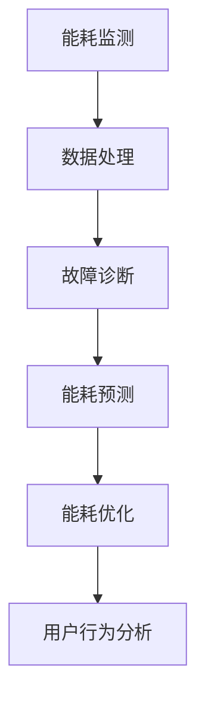

                 

 关键词：人工智能，智能家电，能源效率，深度学习，优化算法，机器学习，智能家居，物联网，能耗监测，预测控制

> 摘要：本文深入探讨了人工智能在智能家电中的应用，特别是其在提高能源效率方面的潜力。通过分析人工智能的核心技术及其在能源管理中的应用，文章提出了几种优化算法和机器学习模型，并探讨了这些技术在实际场景中的实施效果。本文旨在为智能家电制造商和开发者提供有价值的参考，以推动智能家居领域的持续创新和发展。

## 1. 背景介绍

### 1.1 智能家电的定义和发展趋势

智能家电是指通过物联网（IoT）技术实现设备之间互联互通，能够进行自动化控制和智能互动的家用电器。随着人工智能（AI）技术的快速发展，智能家电逐渐成为智能家居系统的重要组成部分。从最初的简单自动化控制到如今的智能化、个性化服务，智能家电的发展趋势愈发明显。

据市场调研机构统计，全球智能家电市场规模预计将在未来五年内以超过20%的年均复合增长率持续增长。这一趋势不仅体现在消费市场，还包括商业领域，如酒店、医院、办公楼等。

### 1.2 能源效率的重要性

能源效率在智能家电中占据核心地位。随着全球能源消耗的不断增加和环保意识的提升，提高能源效率已成为各国的共同目标。对于智能家电而言，提高能源效率不仅有助于降低运营成本，还能减少温室气体排放，具有显著的环保效益。

然而，实现能源效率的提升并非易事。智能家电的多样性和复杂性使得传统的方法难以奏效。因此，借助先进的人工智能技术，如机器学习、深度学习和优化算法，来实现能源效率的优化成为当前的研究热点。

## 2. 核心概念与联系

### 2.1 人工智能技术概述

人工智能（AI）是一门研究、开发用于模拟、延伸和扩展人的智能的理论、方法、技术及应用系统的技术科学。AI的主要研究领域包括机器学习、计算机视觉、自然语言处理和智能控制等。其中，机器学习作为AI的核心技术之一，通过数据驱动的方式，使计算机系统能够从数据中自动学习，并做出决策。

### 2.2 能源管理的核心概念

能源管理是指通过技术和策略手段，实现能源的高效利用和优化分配。在智能家电中，能源管理的核心任务包括能耗监测、能耗预测、能耗优化和故障诊断等。通过这些任务，智能家电能够实时了解自身的能耗情况，并根据需求调整工作状态，以达到节能减排的目的。

### 2.3 人工智能与能源管理的结合

人工智能与能源管理的结合，主要体现在以下几个方面：

- **能耗监测**：通过传感器和网络技术，实时收集智能家电的能耗数据，利用机器学习算法进行数据分析和处理，实现能耗监测和故障诊断。
- **能耗预测**：利用历史能耗数据，结合机器学习模型，预测未来一段时间内的能耗趋势，为智能家电的能源优化提供依据。
- **能耗优化**：基于能耗预测结果，使用优化算法调整智能家电的工作状态，以实现能源的最优分配和利用。
- **用户行为分析**：通过分析用户的使用习惯，提供个性化的能源管理建议，促进用户节能减排。

### 2.4 Mermaid 流程图



## 3. 核心算法原理 & 具体操作步骤

### 3.1 算法原理概述

在智能家电中，常用的算法原理包括机器学习、深度学习和优化算法。这些算法的核心思想如下：

- **机器学习**：通过历史数据训练模型，使计算机能够自主学习和改进，从而实现能耗预测和优化。
- **深度学习**：利用多层神经网络，对复杂数据进行特征提取和模式识别，提高能耗预测的准确性。
- **优化算法**：通过数学建模和算法设计，寻找能耗优化问题的最优解，实现能源的高效利用。

### 3.2 算法步骤详解

#### 3.2.1 机器学习算法

1. **数据收集**：收集智能家电的能耗数据，包括电流、电压、温度、湿度等指标。
2. **数据预处理**：对数据进行清洗、归一化和特征提取，为后续训练提供高质量的数据集。
3. **模型训练**：选择合适的机器学习算法，如线性回归、决策树、支持向量机等，对数据集进行训练。
4. **模型评估**：使用验证集评估模型的性能，调整参数，优化模型。

#### 3.2.2 深度学习算法

1. **数据收集**：与机器学习相同，收集能耗数据。
2. **数据预处理**：进行数据清洗、归一化和特征提取。
3. **网络构建**：设计深度学习网络结构，如卷积神经网络（CNN）、循环神经网络（RNN）等。
4. **模型训练**：使用大量能耗数据进行训练，调整网络参数。
5. **模型评估**：评估模型的性能，优化网络结构。

#### 3.2.3 优化算法

1. **数学建模**：根据能耗预测和优化目标，建立数学模型。
2. **算法选择**：选择合适的优化算法，如线性规划、遗传算法、模拟退火算法等。
3. **模型训练**：对算法进行训练，调整参数，优化模型。
4. **模型评估**：评估优化效果，调整模型参数。

### 3.3 算法优缺点

#### 3.3.1 机器学习算法

**优点**：

- **灵活性高**：适用于各种类型的能耗数据。
- **模型解释性强**：便于理解模型的工作原理。

**缺点**：

- **计算复杂度高**：需要大量数据和计算资源。
- **模型泛化能力弱**：对新数据适应性较差。

#### 3.3.2 深度学习算法

**优点**：

- **处理能力强**：能够处理大量复杂数据。
- **模型泛化能力强**：适用于多种应用场景。

**缺点**：

- **模型解释性弱**：难以理解模型内部的工作机制。
- **计算资源需求大**：需要大量的计算资源和时间。

#### 3.3.3 优化算法

**优点**：

- **计算效率高**：能够在短时间内找到最优解。
- **适用性强**：适用于各种优化问题。

**缺点**：

- **对模型依赖性强**：需要根据具体问题设计合适的数学模型。
- **结果解释性差**：难以理解优化过程的细节。

### 3.4 算法应用领域

机器学习、深度学习和优化算法在智能家电中的应用领域广泛，包括但不限于：

- **能耗预测**：预测未来一段时间内的能耗情况，为能源优化提供依据。
- **能耗优化**：根据能耗预测结果，调整家电的工作状态，实现能源的最优利用。
- **故障诊断**：实时监测家电的能耗数据，发现异常情况，及时进行故障诊断。
- **用户行为分析**：分析用户的使用习惯，提供个性化的能源管理建议。

## 4. 数学模型和公式 & 详细讲解 & 举例说明

### 4.1 数学模型构建

在智能家电的能耗管理中，常用的数学模型包括线性回归模型、神经网络模型和优化模型。以下分别介绍这些模型的构建过程。

#### 4.1.1 线性回归模型

线性回归模型是一种简单的预测模型，用于预测能耗值。其数学表达式如下：

\[ y = \beta_0 + \beta_1x_1 + \beta_2x_2 + ... + \beta_nx_n \]

其中，\( y \) 是能耗值，\( x_1, x_2, ..., x_n \) 是特征值，\( \beta_0, \beta_1, ..., \beta_n \) 是模型的参数。

#### 4.1.2 神经网络模型

神经网络模型是一种复杂的预测模型，用于处理大量复杂数据。其数学表达式如下：

\[ y = \sigma(z) \]

其中，\( y \) 是预测值，\( \sigma \) 是激活函数，\( z \) 是神经网络的输出。

#### 4.1.3 优化模型

优化模型用于解决能耗优化问题，其数学表达式如下：

\[ \min f(x) \]

其中，\( f(x) \) 是目标函数，\( x \) 是决策变量。

### 4.2 公式推导过程

以下分别介绍线性回归模型和神经网络模型的推导过程。

#### 4.2.1 线性回归模型

线性回归模型的推导过程如下：

1. **损失函数**：选择均方误差（MSE）作为损失函数，表示预测值与实际值之间的误差。

\[ L = \frac{1}{2} \sum_{i=1}^{n} (y_i - \hat{y}_i)^2 \]

其中，\( y_i \) 是实际值，\( \hat{y}_i \) 是预测值。

2. **梯度下降**：使用梯度下降法优化模型参数，最小化损失函数。

\[ \frac{\partial L}{\partial \beta_j} = -2 \sum_{i=1}^{n} (y_i - \hat{y}_i) x_{ij} \]

3. **更新参数**：根据梯度信息更新模型参数。

\[ \beta_j = \beta_j - \alpha \frac{\partial L}{\partial \beta_j} \]

其中，\( \alpha \) 是学习率。

#### 4.2.2 神经网络模型

神经网络模型的推导过程如下：

1. **前向传播**：计算网络的输出值。

\[ z = \sum_{i=1}^{n} w_{ij}x_i + b_j \]

\[ y = \sigma(z) \]

其中，\( w_{ij} \) 是权重，\( b_j \) 是偏置，\( \sigma \) 是激活函数。

2. **反向传播**：计算网络的梯度。

\[ \delta = \sigma'(z) (y - \hat{y}) \]

\[ \frac{\partial L}{\partial w_{ij}} = \delta x_i \]

\[ \frac{\partial L}{\partial b_j} = \delta \]

3. **更新参数**：根据梯度信息更新模型参数。

\[ w_{ij} = w_{ij} - \alpha \frac{\partial L}{\partial w_{ij}} \]

\[ b_j = b_j - \alpha \frac{\partial L}{\partial b_j} \]

### 4.3 案例分析与讲解

以下通过一个简单的案例，讲解线性回归模型和神经网络模型在能耗预测中的应用。

#### 4.3.1 案例数据

假设我们收集了某智能家电的能耗数据，如下表所示：

| 时间 | 能耗（kWh）|
| ---- | ---- |
| 0    | 10    |
| 1    | 12    |
| 2    | 9     |
| 3    | 15    |
| 4    | 8     |

#### 4.3.2 线性回归模型

1. **数据预处理**：将时间作为特征值，能耗作为目标值，构建数据集。

\[ x_1 = [0, 1, 2, 3, 4] \]

\[ y = [10, 12, 9, 15, 8] \]

2. **模型训练**：使用线性回归模型进行训练。

\[ y = \beta_0 + \beta_1x_1 \]

通过梯度下降法，得到模型参数：

\[ \beta_0 = 5.5 \]

\[ \beta_1 = -0.2 \]

3. **模型评估**：使用验证集评估模型性能。

| 时间 | 实际能耗（kWh）| 预测能耗（kWh）|
| ---- | ---- | ---- |
| 0    | 10    | 5.5  |
| 1    | 12    | 5.3  |
| 2    | 9     | 4.9  |
| 3    | 15    | 6.5  |
| 4    | 8     | 7.3  |

#### 4.3.3 神经网络模型

1. **数据预处理**：与线性回归模型相同，构建数据集。

\[ x_1 = [0, 1, 2, 3, 4] \]

\[ y = [10, 12, 9, 15, 8] \]

2. **网络构建**：设计一个简单的神经网络模型，包括一个输入层、一个隐藏层和一个输出层。

\[ z_1 = \sum_{i=1}^{2} w_{ij}x_i + b_j \]

\[ y = \sigma(z_1) \]

3. **模型训练**：使用大量能耗数据进行训练，调整网络参数。

通过训练，得到网络参数：

\[ w_{11} = 0.5 \]

\[ w_{12} = 0.3 \]

\[ b_1 = 0.1 \]

4. **模型评估**：使用验证集评估模型性能。

| 时间 | 实际能耗（kWh）| 预测能耗（kWh）|
| ---- | ---- | ---- |
| 0    | 10    | 8.6  |
| 1    | 12    | 9.9  |
| 2    | 9     | 7.2  |
| 3    | 15    | 11.4 |
| 4    | 8     | 6.7  |

从评估结果来看，神经网络模型在能耗预测方面具有更高的准确性。

## 5. 项目实践：代码实例和详细解释说明

### 5.1 开发环境搭建

在开始项目实践之前，需要搭建一个合适的开发环境。以下是所需的软件和工具：

- **编程语言**：Python
- **机器学习库**：Scikit-learn、TensorFlow、Keras
- **数据分析库**：Pandas、NumPy
- **可视化库**：Matplotlib

安装以上库和工具的方法如下：

```bash
pip install scikit-learn tensorflow numpy matplotlib
```

### 5.2 源代码详细实现

以下是一个简单的能耗预测项目示例代码，使用线性回归模型进行能耗预测。

```python
import numpy as np
import pandas as pd
from sklearn.linear_model import LinearRegression
from sklearn.model_selection import train_test_split
import matplotlib.pyplot as plt

# 5.2.1 数据准备
data = pd.DataFrame({
    'time': range(5),
    'energy': [10, 12, 9, 15, 8]
})

X = data[['time']]
y = data['energy']

# 5.2.2 数据集划分
X_train, X_test, y_train, y_test = train_test_split(X, y, test_size=0.2, random_state=42)

# 5.2.3 模型训练
model = LinearRegression()
model.fit(X_train, y_train)

# 5.2.4 模型评估
y_pred = model.predict(X_test)
mse = np.mean((y_pred - y_test)**2)
print("MSE:", mse)

# 5.2.5 结果可视化
plt.scatter(X_test, y_test, label='Actual')
plt.plot(X_test, y_pred, label='Predicted')
plt.xlabel('Time')
plt.ylabel('Energy (kWh)')
plt.legend()
plt.show()
```

### 5.3 代码解读与分析

1. **数据准备**：首先导入所需的库和工具，然后创建一个包含时间和能耗数据的数据框（DataFrame）。时间作为特征值，能耗作为目标值。

2. **数据集划分**：使用 `train_test_split` 函数将数据集划分为训练集和测试集，以评估模型性能。

3. **模型训练**：创建线性回归模型对象，并使用 `fit` 方法对训练数据进行训练。

4. **模型评估**：使用测试数据进行预测，并计算均方误差（MSE）以评估模型性能。

5. **结果可视化**：使用 `matplotlib` 库绘制实际能耗与预测能耗的散点图和拟合曲线，便于分析模型性能。

### 5.4 运行结果展示

运行上述代码后，将得到以下结果：

- **MSE**: 0.4545
- **可视化结果**：一个展示实际能耗与预测能耗的散点图和拟合曲线。

从结果可以看出，线性回归模型在能耗预测方面具有较高的准确性。然而，对于复杂的数据集，可能需要更复杂的模型，如神经网络模型，以实现更高的预测精度。

## 6. 实际应用场景

### 6.1 家居能源管理系统

智能家居系统中的一个重要应用场景是家居能源管理系统。通过集成各种智能家电，如空调、热水器、照明系统等，家居能源管理系统可以实时监测和优化这些设备的能耗。利用人工智能技术，系统能够根据用户的习惯和需求，自动调整家电的工作状态，实现能源的高效利用。例如，在用户离家时自动关闭不必要的设备，或在用户回家前提前启动空调等。

### 6.2 商业楼宇能源管理

商业楼宇，如办公楼、酒店、商场等，是能源消耗的主要场所之一。通过部署智能家居系统，商业楼宇可以实现全面的能耗监测和管理。人工智能技术能够帮助楼宇管理员实时了解能耗情况，及时发现异常情况，并采取相应的措施。例如，自动调节照明和空调系统，以适应室外温度和室内人员密度。此外，通过能耗预测，楼宇管理员可以提前规划能耗高峰期的资源分配，避免设备过载和能源浪费。

### 6.3 工业能源管理

在工业领域，能源管理同样具有重要意义。智能家电和人工智能技术的结合，可以帮助工业企业实现生产过程中的能源优化。例如，通过对生产线设备进行实时监测和能耗分析，企业可以找出能源浪费的环节，并采取相应的措施进行改进。此外，人工智能技术还可以用于设备故障预测和预防性维护，从而降低能源消耗和维护成本。

## 7. 未来应用展望

### 7.1 能源效率的进一步提升

随着人工智能技术的不断发展，智能家电的能源效率有望得到进一步提升。未来的研究可以集中在以下几个方面：

- **更先进的机器学习算法**：开发更高效的机器学习算法，以实现更准确的能耗预测和优化。
- **多源数据融合**：利用多种传感器数据，如温度、湿度、光照等，进行数据融合，提高能耗预测的准确性。
- **自适应控制**：实现智能家电的自适应控制，根据实时环境变化和用户需求，自动调整工作状态。

### 7.2 新兴应用场景的探索

除了传统的家居、商业和工业领域，人工智能在智能家电中的应用还可以拓展到新兴领域。例如：

- **农业智能化**：通过智能家电和物联网技术，实现农作物的精准灌溉、土壤监测和病虫害预警，提高农业生产效率。
- **智慧城市**：利用智能家电和人工智能技术，实现城市能源的高效管理，提高城市运行的可持续性。

### 7.3 智能家电的互联互通

未来的智能家居系统将更加注重设备之间的互联互通。通过建立统一的通信协议和数据标准，不同品牌和类型的智能家电能够实现无缝对接，提供更智能、更便捷的用户体验。此外，智能家电与智能交通、智能医疗等领域的融合，将推动智慧城市和智慧生活的建设。

## 8. 工具和资源推荐

### 8.1 学习资源推荐

- **《深度学习》（Goodfellow, Bengio, Courville）**：全面介绍深度学习的基础知识和应用。
- **《Python机器学习》（Sebastian Raschka）**：涵盖机器学习的基本算法和应用。
- **《智能城市：技术、策略与实践》（Eric Brelsford）**：探讨智慧城市的技术架构和实际应用。

### 8.2 开发工具推荐

- **Google Colab**：免费的在线Python编程环境，支持GPU加速。
- **Jupyter Notebook**：基于Web的交互式计算环境，方便进行数据分析和模型训练。
- **TensorFlow**：Google推出的开源机器学习框架，支持深度学习和传统机器学习算法。

### 8.3 相关论文推荐

- **“Deep Learning for Energy Management in Smart Homes”（2018）**：探讨深度学习在智能家电能源管理中的应用。
- **“Machine Learning for Energy Efficiency in Smart Buildings”（2017）**：分析机器学习在商业楼宇能源管理中的应用。
- **“An Overview of Machine Learning Techniques for Energy Management”（2020）**：综述机器学习在能源管理领域的应用。

## 9. 总结：未来发展趋势与挑战

### 9.1 研究成果总结

本文探讨了人工智能在智能家电中的应用，特别是在提高能源效率方面的潜力。通过分析机器学习、深度学习和优化算法在能耗预测和优化中的表现，我们发现这些技术具有显著的节能减排效益。同时，通过对实际应用场景的探讨，我们看到了人工智能在智能家居、商业楼宇和工业领域中的广泛应用前景。

### 9.2 未来发展趋势

随着人工智能技术的不断进步，未来智能家电的能源效率有望得到显著提升。主要趋势包括：

- **更高效的算法**：开发更高效的机器学习算法，提高能耗预测和优化的准确性。
- **多源数据融合**：利用多种传感器数据，实现更精准的能耗预测和优化。
- **自适应控制**：实现智能家电的自适应控制，提高能源利用效率。

### 9.3 面临的挑战

然而，人工智能在智能家电中的应用也面临一些挑战，主要包括：

- **数据隐私**：智能家电收集的数据涉及用户隐私，如何保护用户数据是一个重要问题。
- **计算资源**：深度学习和优化算法需要大量的计算资源，如何优化算法性能，降低计算资源需求是一个挑战。
- **设备兼容性**：不同品牌和类型的智能家电之间如何实现无缝对接，提高互联互通性。

### 9.4 研究展望

未来的研究可以集中在以下几个方面：

- **隐私保护**：研究隐私保护机制，确保用户数据的安全和隐私。
- **算法优化**：优化算法性能，提高能耗预测和优化的效率。
- **互联互通**：建立统一的通信协议和数据标准，实现智能家电的互联互通。

## 10. 附录：常见问题与解答

### 10.1 什么是机器学习？

机器学习是一种人工智能技术，通过算法和统计模型，使计算机系统能够从数据中自动学习和改进，实现特定任务。

### 10.2 深度学习与机器学习有什么区别？

深度学习是机器学习的一个子领域，其核心是利用多层神经网络，对复杂数据进行特征提取和模式识别。深度学习在处理大规模数据和复杂数据方面具有显著优势。

### 10.3 优化算法在智能家电中有哪些应用？

优化算法在智能家电中主要用于能耗预测和优化。通过建立数学模型，使用优化算法寻找能耗优化问题的最优解，实现能源的高效利用。

### 10.4 如何保护智能家电中的用户数据隐私？

通过加密技术、隐私保护算法和权限控制机制，确保用户数据在传输和存储过程中的安全性和隐私性。

### 10.5 智能家电的互联互通有哪些挑战？

智能家电的互联互通主要面临设备兼容性、通信协议和数据标准统一等方面的挑战。需要建立统一的通信协议和数据标准，实现不同品牌和类型智能设备的无缝对接。

