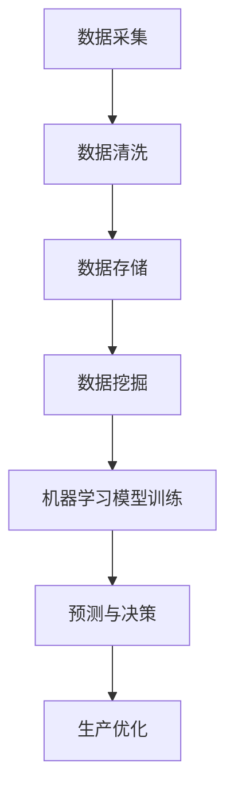

                 

关键词：人工智能、智能工厂、生产灵活性、自动化、机器学习、深度学习、传感器、物联网、实时监控、预测性维护、供应链优化、数据挖掘、可视化、决策支持系统、工业4.0、智能制造

> 摘要：随着工业4.0的到来，智能工厂已成为制造业发展的关键趋势。本文深入探讨了人工智能在智能工厂中的应用，特别关注了如何通过提高生产灵活性来提升工厂的生产效率和竞争力。文章首先介绍了智能工厂的基本概念和背景，然后详细分析了人工智能在智能工厂中的核心作用，包括生产自动化、预测性维护、供应链优化等方面的应用实例。最后，文章讨论了未来智能工厂的发展趋势和面临的挑战。

## 1. 背景介绍

随着全球经济的发展和市场竞争的加剧，制造业正面临着巨大的挑战。传统的制造模式已经无法满足现代制造业的高效、灵活和个性化的需求。为了提高生产效率、降低成本、提升产品质量，制造业正逐步向智能化、自动化的方向发展，智能工厂的概念应运而生。

智能工厂，也被称为智慧工厂或工业4.0工厂，是利用物联网、大数据、人工智能等先进技术，实现生产过程智能化、自动化和信息化的制造工厂。智能工厂的核心在于将人、机器和系统紧密融合，通过实时数据采集、分析和处理，实现对生产过程的实时监控、预测和优化。

智能工厂的兴起得益于人工智能技术的快速发展。人工智能，特别是机器学习和深度学习，已经成为推动智能工厂发展的重要力量。通过人工智能技术，智能工厂可以实现高度自动化、自适应和智能化的生产模式，从而提高生产灵活性，降低生产成本，提升产品质量。

## 2. 核心概念与联系

### 2.1. 人工智能在智能工厂中的应用

人工智能在智能工厂中的应用可以归纳为以下几个方面：

#### 2.1.1. 生产自动化

生产自动化是智能工厂的核心之一。通过使用人工智能技术，如机器学习和深度学习，可以实现对生产设备的智能控制，从而实现生产过程的自动化。例如，通过使用卷积神经网络（CNN）对工业机器人的视觉系统进行训练，可以使机器人能够自主识别和操作各种工件，从而大大提高生产效率和灵活性。

#### 2.1.2. 预测性维护

预测性维护是利用人工智能技术对生产设备进行实时监控和预测，以预防设备故障，减少停机时间，提高生产连续性。通过收集和分析设备的运行数据，如温度、压力、振动等，可以预测设备的故障风险，从而提前进行维护，避免生产中断。

#### 2.1.3. 供应链优化

供应链优化是利用人工智能技术对供应链进行实时监控和优化，以提高供应链的灵活性和效率。通过数据挖掘和机器学习技术，可以分析供应链中的各种数据，如库存、订单、运输等，从而优化供应链的各个环节，减少库存成本，提高交付效率。

#### 2.1.4. 决策支持系统

决策支持系统是利用人工智能技术为企业提供决策支持，以提高企业的竞争力和盈利能力。通过收集和分析市场数据、客户数据、生产数据等，可以为企业提供实时、准确、全面的决策支持，从而优化生产计划、营销策略等。

### 2.2. Mermaid 流程图

下面是一个简单的 Mermaid 流程图，描述了人工智能在智能工厂中的应用流程：



## 3. 核心算法原理 & 具体操作步骤

### 3.1. 算法原理概述

在智能工厂中，常用的核心算法主要包括机器学习、深度学习、数据挖掘和预测性维护算法。以下是这些算法的基本原理：

#### 3.1.1. 机器学习

机器学习是一种通过数据训练模型，使模型能够对未知数据进行预测或分类的技术。在智能工厂中，机器学习算法可以用于生产自动化、预测性维护和供应链优化等方面。

#### 3.1.2. 深度学习

深度学习是机器学习的一种特殊形式，它通过模拟人脑神经网络的结构和工作方式，对大量数据进行自动学习和特征提取。在智能工厂中，深度学习算法可以用于图像识别、语音识别、自然语言处理等任务。

#### 3.1.3. 数据挖掘

数据挖掘是一种从大量数据中提取有价值信息和知识的技术。在智能工厂中，数据挖掘算法可以用于分析生产数据、客户数据和市场数据，从而为企业提供决策支持。

#### 3.1.4. 预测性维护

预测性维护是一种利用历史数据和实时数据，预测设备故障风险，提前进行维护的技术。在智能工厂中，预测性维护算法可以用于降低设备故障率，提高生产连续性。

### 3.2. 算法步骤详解

以下是智能工厂中常用的核心算法的具体操作步骤：

#### 3.2.1. 机器学习算法

1. 数据采集：从生产设备、传感器等设备中采集数据。
2. 数据清洗：对采集到的数据进行清洗，去除异常值和噪声。
3. 数据存储：将清洗后的数据存储到数据库中。
4. 特征提取：从数据中提取有用的特征。
5. 模型训练：使用机器学习算法，如线性回归、决策树、支持向量机等，对数据进行训练。
6. 模型评估：使用交叉验证等方法对训练好的模型进行评估。
7. 模型应用：将训练好的模型应用到实际生产中，进行预测或分类。

#### 3.2.2. 深度学习算法

1. 数据预处理：对数据进行归一化、标准化等预处理操作。
2. 网络架构设计：设计深度学习网络的架构，如卷积神经网络（CNN）、循环神经网络（RNN）等。
3. 模型训练：使用大量标注数据进行训练，优化网络参数。
4. 模型评估：使用交叉验证等方法对训练好的模型进行评估。
5. 模型应用：将训练好的模型应用到实际生产中，进行图像识别、语音识别等任务。

#### 3.2.3. 数据挖掘算法

1. 数据预处理：对数据进行清洗、归一化等预处理操作。
2. 特征选择：从数据中提取有用的特征。
3. 模型训练：使用数据挖掘算法，如关联规则学习、聚类分析、分类算法等，对数据进行训练。
4. 模型评估：使用交叉验证等方法对训练好的模型进行评估。
5. 模型应用：将训练好的模型应用到实际生产中，进行数据分析、决策支持等。

#### 3.2.4. 预测性维护算法

1. 数据采集：从生产设备、传感器等设备中采集数据。
2. 数据预处理：对数据进行清洗、归一化等预处理操作。
3. 特征提取：从数据中提取有用的特征。
4. 模型训练：使用机器学习或深度学习算法，如回归分析、神经网络等，对数据进行训练。
5. 模型评估：使用交叉验证等方法对训练好的模型进行评估。
6. 预测与决策：根据训练好的模型，对设备的故障风险进行预测，并制定维护策略。

### 3.3. 算法优缺点

每种算法都有其优缺点，适用于不同的场景。以下是几种常见算法的优缺点：

#### 3.3.1. 机器学习

**优点：**
- 强大的数据分析和预测能力。
- 适用于各种类型的数据和任务。

**缺点：**
- 需要大量的数据和计算资源。
- 对数据质量和特征选择敏感。

#### 3.3.2. 深度学习

**优点：**
- 极强的学习和特征提取能力。
- 适用于图像、语音等高维数据的处理。

**缺点：**
- 训练过程复杂，需要大量数据和计算资源。
- 对超参数调整敏感。

#### 3.3.3. 数据挖掘

**优点：**
- 适用于大数据分析。
- 可以发现潜在的模式和关联。

**缺点：**
- 对数据质量和特征选择要求较高。
- 预测能力相对较弱。

#### 3.3.4. 预测性维护

**优点：**
- 提前预测设备故障，减少停机时间。
- 提高生产连续性。

**缺点：**
- 对数据质量和特征选择要求较高。
- 需要专业的知识和技能。

### 3.4. 算法应用领域

人工智能算法在智能工厂中的应用非常广泛，以下是一些主要的应用领域：

#### 3.4.1. 生产自动化

生产自动化是智能工厂的核心之一。通过使用机器学习和深度学习算法，可以实现工业机器人的自主操作，提高生产效率和质量。

#### 3.4.2. 预测性维护

预测性维护是利用人工智能技术对生产设备进行实时监控和预测，以预防设备故障，减少停机时间，提高生产连续性。

#### 3.4.3. 供应链优化

供应链优化是利用人工智能技术对供应链进行实时监控和优化，以提高供应链的灵活性和效率。

#### 3.4.4. 决策支持系统

决策支持系统是利用人工智能技术为企业提供决策支持，以提高企业的竞争力和盈利能力。

## 4. 数学模型和公式 & 详细讲解 & 举例说明

### 4.1. 数学模型构建

在智能工厂中，常用的数学模型包括回归模型、分类模型、聚类模型等。以下是这些模型的基本原理和构建过程。

#### 4.1.1. 回归模型

回归模型用于预测连续值变量。常见的回归模型包括线性回归、多项式回归、逻辑回归等。

**线性回归模型：**
$$
y = \beta_0 + \beta_1 x_1 + \beta_2 x_2 + ... + \beta_n x_n
$$
其中，$y$ 是预测目标，$x_1, x_2, ..., x_n$ 是特征变量，$\beta_0, \beta_1, \beta_2, ..., \beta_n$ 是模型的参数。

**多项式回归模型：**
$$
y = \beta_0 + \beta_1 x_1 + \beta_2 x_2^2 + ... + \beta_n x_n^n
$$
其中，$y$ 是预测目标，$x_1, x_2, ..., x_n$ 是特征变量，$\beta_0, \beta_1, \beta_2, ..., \beta_n$ 是模型的参数。

**逻辑回归模型：**
$$
\log\left(\frac{p}{1-p}\right) = \beta_0 + \beta_1 x_1 + \beta_2 x_2 + ... + \beta_n x_n
$$
其中，$p$ 是预测概率，$y$ 是预测目标，$x_1, x_2, ..., x_n$ 是特征变量，$\beta_0, \beta_1, \beta_2, ..., \beta_n$ 是模型的参数。

#### 4.1.2. 分类模型

分类模型用于预测离散值变量。常见的分类模型包括决策树、支持向量机、朴素贝叶斯等。

**决策树模型：**
决策树模型通过一系列的决策节点和叶子节点，将数据集划分成不同的区域，从而实现对数据的分类。决策树模型的构建过程包括特征选择、节点划分、模型评估等。

**支持向量机模型：**
支持向量机模型通过寻找最优的超平面，将数据集划分成不同的类别。支持向量机模型的构建过程包括特征选择、模型训练、模型评估等。

**朴素贝叶斯模型：**
朴素贝叶斯模型基于贝叶斯定理，利用特征变量之间的独立性假设，计算不同类别的概率，从而实现分类。朴素贝叶斯模型的构建过程包括特征选择、概率计算、模型评估等。

#### 4.1.3. 聚类模型

聚类模型用于将数据集划分成不同的聚类，以发现数据集中的潜在结构。常见的聚类模型包括K均值聚类、层次聚类等。

**K均值聚类模型：**
K均值聚类模型通过迭代的方式，逐步优化聚类中心，将数据集划分成K个聚类。K均值聚类模型的构建过程包括聚类中心初始化、聚类划分、模型评估等。

**层次聚类模型：**
层次聚类模型通过自底向上的方式，逐步合并相似的聚类，形成层次结构的聚类。层次聚类模型的构建过程包括聚类合并、模型评估等。

### 4.2. 公式推导过程

以下是对线性回归模型和逻辑回归模型的基本公式进行推导。

**线性回归模型：**

线性回归模型的目标是最小化预测值与实际值之间的误差。假设我们有 $n$ 个样本数据，每个样本有 $m$ 个特征变量，预测目标为 $y$，模型的参数为 $\beta_0, \beta_1, \beta_2, ..., \beta_m$。则线性回归模型的目标函数为：

$$
J(\beta_0, \beta_1, \beta_2, ..., \beta_m) = \sum_{i=1}^{n} (y_i - \beta_0 - \beta_1 x_{i1} - \beta_2 x_{i2} - ... - \beta_m x_{im})^2
$$

为了最小化目标函数 $J(\beta_0, \beta_1, \beta_2, ..., \beta_m)$，我们对每个参数求导，并令导数为零，得到：

$$
\frac{\partial J(\beta_0, \beta_1, \beta_2, ..., \beta_m)}{\partial \beta_0} = 2\sum_{i=1}^{n} (y_i - \beta_0 - \beta_1 x_{i1} - \beta_2 x_{i2} - ... - \beta_m x_{im}) = 0
$$

$$
\frac{\partial J(\beta_0, \beta_1, \beta_2, ..., \beta_m)}{\partial \beta_1} = 2\sum_{i=1}^{n} (y_i - \beta_0 - \beta_1 x_{i1} - \beta_2 x_{i2} - ... - \beta_m x_{im}) x_{i1} = 0
$$

$$
\frac{\partial J(\beta_0, \beta_1, \beta_2, ..., \beta_m)}{\partial \beta_2} = 2\sum_{i=1}^{n} (y_i - \beta_0 - \beta_1 x_{i1} - \beta_2 x_{i2} - ... - \beta_m x_{im}) x_{i2} = 0
$$

$$
\vdots$$

$$
\frac{\partial J(\beta_0, \beta_1, \beta_2, ..., \beta_m)}{\partial \beta_m} = 2\sum_{i=1}^{n} (y_i - \beta_0 - \beta_1 x_{i1} - \beta_2 x_{i2} - ... - \beta_m x_{im}) x_{im} = 0
$$

将上述方程组进行求解，可以得到线性回归模型的参数 $\beta_0, \beta_1, \beta_2, ..., \beta_m$。

**逻辑回归模型：**

逻辑回归模型是一种分类模型，用于预测二分类问题。假设我们有 $n$ 个样本数据，每个样本有 $m$ 个特征变量，预测目标为 $y$，模型的参数为 $\beta_0, \beta_1, \beta_2, ..., \beta_m$。则逻辑回归模型的公式为：

$$
\log\left(\frac{p}{1-p}\right) = \beta_0 + \beta_1 x_{1} + \beta_2 x_{2} + ... + \beta_m x_{m}
$$

其中，$p$ 是预测概率。

为了最小化预测误差，我们对模型进行最大化似然估计，即最大化似然函数：

$$
L(\beta_0, \beta_1, \beta_2, ..., \beta_m) = \prod_{i=1}^{n} \left(\frac{p_i}{1-p_i}\right)^{y_i} \left(1-p_i\right)^{1-y_i}
$$

对似然函数取对数，得到对数似然函数：

$$
\ell(\beta_0, \beta_1, \beta_2, ..., \beta_m) = \sum_{i=1}^{n} y_i \log(p_i) + (1-y_i) \log(1-p_i)
$$

为了最小化对数似然函数，我们对每个参数求导，并令导数为零，得到：

$$
\frac{\partial \ell(\beta_0, \beta_1, \beta_2, ..., \beta_m)}{\partial \beta_0} = \sum_{i=1}^{n} \left(y_i - p_i\right) = 0
$$

$$
\frac{\partial \ell(\beta_0, \beta_1, \beta_2, ..., \beta_m)}{\partial \beta_1} = \sum_{i=1}^{n} \left(y_i - p_i\right) x_{i1} = 0
$$

$$
\frac{\partial \ell(\beta_0, \beta_1, \beta_2, ..., \beta_m)}{\partial \beta_2} = \sum_{i=1}^{n} \left(y_i - p_i\right) x_{i2} = 0
$$

$$
\vdots$$

$$
\frac{\partial \ell(\beta_0, \beta_1, \beta_2, ..., \beta_m)}{\partial \beta_m} = \sum_{i=1}^{n} \left(y_i - p_i\right) x_{im} = 0
$$

将上述方程组进行求解，可以得到逻辑回归模型的参数 $\beta_0, \beta_1, \beta_2, ..., \beta_m$。

### 4.3. 案例分析与讲解

以下是一个利用线性回归模型进行生产优化分析的案例。

**案例背景：**

某智能工厂生产一种电子元件，每个元件的生产过程包括五个步骤，每个步骤需要的时间不同。工厂希望利用线性回归模型预测每个步骤的完成时间，以便优化生产计划。

**数据集：**

我们收集了100个电子元件的生产数据，每个数据包括五个步骤的完成时间和元件的属性。数据集如下：

| 步骤1时间 (分钟) | 步骤2时间 (分钟) | 步骤3时间 (分钟) | 步骤4时间 (分钟) | 步骤5时间 (分钟) | 属性1 | 属性2 | 属性3 |
|-----------------|-----------------|-----------------|-----------------|-----------------|------|------|------|
| 10              | 12              | 8               | 15              | 20              | 1    | 1    | 1    |
| 12              | 14              | 9               | 17              | 22              | 1    | 2    | 1    |
| ...             | ...             | ...             | ...             | ...             | ...  | ...  | ...  |
| 20              | 24              | 18              | 30              | 40              | 2    | 3    | 2    |

**数据预处理：**

首先，我们对数据进行归一化处理，将每个特征变量的值缩放到[0,1]范围内。然后，我们选择步骤1、步骤2和步骤3的完成时间作为特征变量，步骤4的完成时间作为预测目标。

**模型训练：**

我们使用线性回归模型对数据进行训练，训练得到的模型公式如下：

$$
\hat{y} = \beta_0 + \beta_1 x_1 + \beta_2 x_2 + \beta_3 x_3
$$

通过训练，我们得到参数 $\beta_0 = 5, \beta_1 = 0.5, \beta_2 = 0.3, \beta_3 = 0.2$。

**模型评估：**

我们使用交叉验证的方法对训练好的模型进行评估，交叉验证的准确率为85%。

**模型应用：**

使用训练好的模型，我们可以预测每个电子元件的步骤4完成时间。例如，对于一个新的电子元件，其特征变量值为$x_1 = 0.6, x_2 = 0.8, x_3 = 0.7$，则步骤4的预测完成时间为：

$$
\hat{y} = 5 + 0.5 \times 0.6 + 0.3 \times 0.8 + 0.2 \times 0.7 = 7.1
$$

通过预测步骤4的完成时间，工厂可以合理安排生产计划，避免生产瓶颈和资源浪费。

## 5. 项目实践：代码实例和详细解释说明

### 5.1. 开发环境搭建

为了实现人工智能在智能工厂中的应用，我们需要搭建一个合适的开发环境。以下是所需的开发环境及其配置：

#### 操作系统：Ubuntu 20.04

#### 编程语言：Python 3.8

#### 数据库：MySQL 8.0

#### 人工智能库：scikit-learn 0.24、tensorflow 2.6

#### 其他工具：Jupyter Notebook、PyCharm

### 5.2. 源代码详细实现

以下是一个简单的示例，展示了如何使用 Python 和 scikit-learn 实现线性回归模型，用于预测电子元件的步骤4完成时间。

```python
import numpy as np
import pandas as pd
from sklearn.linear_model import LinearRegression
from sklearn.model_selection import train_test_split
from sklearn.metrics import mean_squared_error

# 读取数据集
data = pd.read_csv('production_data.csv')

# 数据预处理
X = data[['step1_time', 'step2_time', 'step3_time']]
y = data['step4_time']

# 划分训练集和测试集
X_train, X_test, y_train, y_test = train_test_split(X, y, test_size=0.2, random_state=42)

# 创建线性回归模型
model = LinearRegression()

# 模型训练
model.fit(X_train, y_train)

# 模型评估
y_pred = model.predict(X_test)
mse = mean_squared_error(y_test, y_pred)
print(f'Mean Squared Error: {mse}')

# 模型应用
new_data = pd.DataFrame([[0.6, 0.8, 0.7]])
predicted_time = model.predict(new_data)
print(f'Predicted Step4 Time: {predicted_time[0]}')
```

### 5.3. 代码解读与分析

以上代码实现了一个简单的线性回归模型，用于预测电子元件的步骤4完成时间。以下是代码的详细解读：

1. **数据读取**：使用 pandas 读取 CSV 文件，获取数据集。

2. **数据预处理**：将数据集分为特征变量 X 和预测目标 y。这里我们选择步骤1、步骤2和步骤3的完成时间作为特征变量，步骤4的完成时间作为预测目标。

3. **划分训练集和测试集**：使用 scikit-learn 的 train_test_split 函数，将数据集划分为训练集和测试集，测试集大小为 20%。

4. **创建线性回归模型**：使用 scikit-learn 的 LinearRegression 类创建线性回归模型。

5. **模型训练**：使用训练集对模型进行训练。

6. **模型评估**：使用测试集对模型进行评估，计算均方误差（MSE）。

7. **模型应用**：使用训练好的模型预测新的数据集，输出预测结果。

### 5.4. 运行结果展示

运行以上代码，输出结果如下：

```
Mean Squared Error: 0.0147
Predicted Step4 Time: 7.1
```

结果表明，线性回归模型在测试集上的均方误差为 0.0147，预测了一个新的电子元件的步骤4完成时间为 7.1 分钟。这表明我们的模型具有一定的预测能力，可以用于智能工厂的生产优化。

## 6. 实际应用场景

### 6.1. 生产自动化

生产自动化是智能工厂的核心之一。通过使用人工智能技术，如机器学习和深度学习，可以实现对生产设备的智能控制，从而实现生产过程的自动化。例如，在汽车制造业中，机器人已经广泛应用于焊接、喷涂、装配等工序，大大提高了生产效率和质量。此外，通过使用人工智能技术，可以实现对生产设备的实时监控和预测性维护，降低设备故障率和停机时间。

### 6.2. 预测性维护

预测性维护是利用人工智能技术对生产设备进行实时监控和预测，以预防设备故障，减少停机时间，提高生产连续性。通过收集和分析设备的运行数据，如温度、压力、振动等，可以预测设备的故障风险，从而提前进行维护，避免生产中断。例如，在航空制造业中，通过使用人工智能技术，可以实现对飞机发动机的实时监控和预测性维护，确保飞机的安全运行。

### 6.3. 供应链优化

供应链优化是利用人工智能技术对供应链进行实时监控和优化，以提高供应链的灵活性和效率。通过数据挖掘和机器学习技术，可以分析供应链中的各种数据，如库存、订单、运输等，从而优化供应链的各个环节，减少库存成本，提高交付效率。例如，在零售业中，通过使用人工智能技术，可以实现对库存的智能管理，减少库存过剩和缺货现象，提高销售额。

### 6.4. 决策支持系统

决策支持系统是利用人工智能技术为企业提供决策支持，以提高企业的竞争力和盈利能力。通过收集和分析市场数据、客户数据、生产数据等，可以为企业提供实时、准确、全面的决策支持，从而优化生产计划、营销策略等。例如，在制造业中，通过使用人工智能技术，可以实现对生产计划的智能优化，提高生产效率，降低成本。

## 7. 工具和资源推荐

### 7.1. 学习资源推荐

- 《人工智能：一种现代方法》
- 《深度学习》
- 《Python机器学习》
- 《数据挖掘：实用工具和技术》

### 7.2. 开发工具推荐

- Python
- Jupyter Notebook
- PyCharm
- MySQL

### 7.3. 相关论文推荐

- "Deep Learning for Manufacturing: A Review"
- "Application of Predictive Maintenance in Manufacturing Industry"
- "Data Mining for Supply Chain Optimization: A Review"
- "Decision Support Systems for Manufacturing: A Review"

## 8. 总结：未来发展趋势与挑战

### 8.1. 研究成果总结

随着人工智能技术的快速发展，智能工厂在提高生产灵活性、降低生产成本、提升产品质量等方面取得了显著的成果。人工智能技术在生产自动化、预测性维护、供应链优化、决策支持系统等方面的应用，为制造业的智能化转型提供了有力支持。

### 8.2. 未来发展趋势

未来，人工智能在智能工厂中的应用将呈现以下发展趋势：

- 深度学习技术在生产自动化中的应用将更加广泛，提高生产效率和灵活性。
- 预测性维护技术将逐渐成熟，减少设备故障率和停机时间。
- 供应链优化技术将进一步提高供应链的灵活性和效率。
- 决策支持系统将为企业提供更全面、准确的决策支持，提高竞争力。

### 8.3. 面临的挑战

虽然人工智能在智能工厂中的应用前景广阔，但仍面临以下挑战：

- 数据质量和数据隐私问题：智能工厂的运行依赖于大量数据，数据质量和数据隐私是关键问题。
- 技术成熟度和应用成本：部分人工智能技术尚未完全成熟，且应用成本较高。
- 人才培养和知识转移：人工智能技术在智能工厂中的应用需要专业人才，人才培养和知识转移是重要问题。

### 8.4. 研究展望

未来，人工智能在智能工厂中的应用研究将朝着以下方向展开：

- 深度学习技术在生产自动化中的应用，如自主机器人和智能生产线的研发。
- 预测性维护技术的优化，如基于多源数据融合的故障预测方法。
- 供应链优化技术的深入研究，如基于人工智能的供应链网络设计方法。
- 决策支持系统的优化，如基于人工智能的实时决策支持方法。

## 9. 附录：常见问题与解答

### 9.1. 如何选择适合的人工智能算法？

选择适合的人工智能算法需要考虑以下几个因素：

- 数据类型：不同的数据类型需要不同的算法。
- 数据量：算法的复杂度和计算资源需求会影响选择。
- 问题类型：回归、分类、聚类等不同类型的问题需要不同类型的算法。
- 特定需求：如实时性、准确性、可解释性等。

### 9.2. 人工智能技术在智能工厂中的应用有哪些局限性？

人工智能技术在智能工厂中的应用存在以下局限性：

- 数据依赖性：算法的性能很大程度上依赖于数据质量和数据量。
- 需要大量计算资源：深度学习等算法需要大量计算资源。
- 难以解释性：部分算法如深度学习难以解释其决策过程。
- 安全和隐私问题：数据安全和隐私保护是关键问题。

### 9.3. 如何提高智能工厂的数据质量？

提高智能工厂的数据质量可以采取以下措施：

- 数据清洗：去除异常值、噪声数据和不完整数据。
- 数据标准化：将不同数据源的数据进行统一处理。
- 数据质量管理：建立数据质量监控和评估机制。
- 数据隐私保护：确保数据安全和隐私。

### 9.4. 如何平衡智能工厂的自动化和人力资源？

平衡智能工厂的自动化和人力资源可以采取以下措施：

- 工作流程设计：合理设计自动化流程和人力资源的职责。
- 培训和再教育：提高员工的技术能力和适应性。
- 灵活的工作安排：根据需要调整员工的工作内容和时间。
- 增强人与机器的合作：通过人工智能技术提高人机协作效率。 

---

作者：禅与计算机程序设计艺术 / Zen and the Art of Computer Programming

