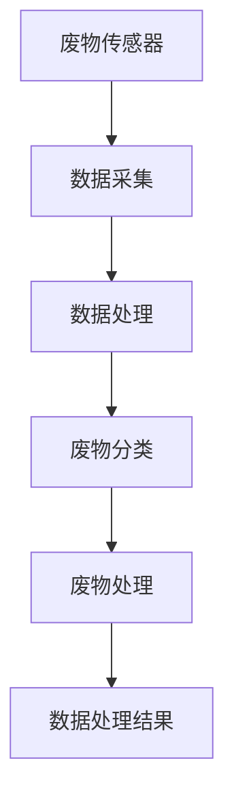

                 

关键词：人工智能，废物回收，资源利用率，深度学习，物联网，智能传感器，数据分析，可持续发展，环境保护。

摘要：本文深入探讨了人工智能（AI）在智能废物回收系统中的应用，分析了AI如何通过提高资源利用率和推动可持续发展来优化废物处理流程。文章首先介绍了智能废物回收系统的基本概念和背景，随后详细阐述了AI技术在废物识别、分类和优化处理中的核心原理和应用。同时，通过数学模型和具体案例，本文展示了AI在废物回收中的实际效果。最后，文章展望了AI在废物回收领域的未来应用前景，并提出了相关挑战和解决方案。

## 1. 背景介绍

随着全球人口的快速增长和消费水平的提高，废物产生量也呈现出爆发式增长。传统的废物回收方式已经无法满足现代社会对资源高效利用和环境保护的需求。智能废物回收系统作为一种创新的解决方案，正逐渐受到各界的关注。智能废物回收系统利用人工智能技术，能够实现废物的自动识别、分类和高效处理，从而大幅提高资源利用率。

人工智能技术的发展为智能废物回收系统提供了强大的技术支撑。深度学习、计算机视觉、物联网和智能传感等技术，使得废物回收系统在数据处理、决策支持和自动化控制等方面具备了更高的效率和精度。通过AI技术的应用，智能废物回收系统不仅能够提高废物处理的效率，还能够为环境保护和可持续发展做出重要贡献。

## 2. 核心概念与联系

### 2.1 智能废物回收系统

智能废物回收系统是由传感器、控制器、执行器和数据处理单元组成的综合性系统。其主要功能是对废物进行自动识别、分类、分拣和优化处理。系统通过物联网和智能传感技术，实时采集废物的物理和化学特征数据，利用深度学习和计算机视觉算法进行数据分析和处理，从而实现对废物的智能分类和高效回收。

### 2.2 人工智能技术

人工智能技术是智能废物回收系统的核心。其中，深度学习和计算机视觉技术在废物识别和分类中发挥着关键作用。深度学习算法通过大量数据训练，能够自动提取废物特征，并进行精确分类。计算机视觉技术则通过对图像和视频数据的处理，实现对废物外观、形状和材质的识别和分析。

### 2.3 物联网技术

物联网技术是智能废物回收系统的重要支撑。通过物联网技术，废物回收系统可以实现设备之间的数据传输和通信，从而实现废物的实时监控和管理。物联网技术还能够通过智能传感器和控制器，实现废物的自动分类和处理，提高系统的自动化水平。

### 2.4 智能传感技术

智能传感技术是智能废物回收系统的关键组成部分。智能传感器能够实时监测废物的物理和化学特征，如温度、湿度、密度和成分等。这些数据通过物联网传输到数据处理单元，供深度学习和计算机视觉算法进行分析和处理。

### 2.5 数学模型与公式

在智能废物回收系统中，数学模型和公式用于描述废物处理过程中的各种参数和关系。例如，废物分类的准确率可以通过混淆矩阵和准确率等指标进行评估。数据处理和优化过程中的算法效率可以通过时间复杂度和空间复杂度等指标进行衡量。

### 2.6 Mermaid 流程图



## 3. 核心算法原理 & 具体操作步骤

### 3.1 算法原理概述

智能废物回收系统的核心算法主要包括深度学习算法、计算机视觉算法和物联网算法。深度学习算法通过训练大量数据，提取废物的特征并进行分类。计算机视觉算法通过对图像和视频数据进行分析，实现废物的自动识别和分类。物联网算法则负责数据传输和通信，确保废物回收系统的稳定运行。

### 3.2 算法步骤详解

#### 3.2.1 深度学习算法

1. 数据采集：通过智能传感器和物联网设备，采集废物的物理和化学特征数据。
2. 数据预处理：对采集到的数据进行清洗和归一化处理，确保数据质量。
3. 训练模型：利用深度学习算法，如卷积神经网络（CNN）和循环神经网络（RNN），对预处理后的数据进行训练。
4. 模型评估：通过混淆矩阵和准确率等指标，评估深度学习模型的分类效果。
5. 模型部署：将训练好的模型部署到废物回收系统中，实现对废物的自动分类。

#### 3.2.2 计算机视觉算法

1. 图像预处理：对采集到的图像数据进行灰度化、滤波等预处理操作，提高图像质量。
2. 特征提取：利用计算机视觉算法，如HOG（方向梯度直方图）和SIFT（尺度不变特征变换），提取图像的特征向量。
3. 分类器训练：利用特征向量，通过SVM（支持向量机）或KNN（最近邻分类）等分类算法，训练分类器。
4. 实时识别：将实时采集的图像数据输入分类器，实现废物的自动识别和分类。

#### 3.2.3 物联网算法

1. 数据传输：利用物联网技术，实现废物回收系统设备之间的数据传输和通信。
2. 数据处理：对传输到的数据进行实时处理和分析，实现对废物的自动分类和处理。
3. 反馈机制：根据处理结果，调整废物回收系统的运行参数和策略，提高系统的效率和稳定性。

### 3.3 算法优缺点

#### 深度学习算法

**优点：** 具有强大的特征提取和分类能力，能够处理大规模数据和高维特征。

**缺点：** 需要大量的训练数据和计算资源，训练过程复杂且耗时。

#### 计算机视觉算法

**优点：** 能够实时处理图像数据，实现对废物的快速识别和分类。

**缺点：** 对图像质量和光照条件要求较高，识别精度受到一定程度的影响。

#### 物联网算法

**优点：** 能够实现数据的实时传输和处理，提高废物回收系统的自动化水平。

**缺点：** 数据传输和通信过程中的延迟和稳定性问题，可能影响系统的实时性和可靠性。

### 3.4 算法应用领域

智能废物回收系统在废物处理、环境保护和可持续发展等领域具有广泛的应用前景。通过AI技术的应用，废物回收系统可以实现以下目标：

1. 提高废物分类和处理效率，减少资源浪费。
2. 降低废物处理成本，提高废物利用价值。
3. 减少环境污染，推动可持续发展。

## 4. 数学模型和公式 & 详细讲解 & 举例说明

### 4.1 数学模型构建

在智能废物回收系统中，数学模型主要用于描述废物处理过程中的各种参数和关系。以下是一个简单的数学模型示例：

$$
\text{分类准确率} = \frac{\text{正确分类的废物数量}}{\text{总废物数量}}
$$

### 4.2 公式推导过程

分类准确率的公式可以通过混淆矩阵来推导。混淆矩阵是一个用于描述分类模型性能的二维矩阵，其中行表示实际类别，列表示预测类别。矩阵中的元素表示实际类别和预测类别对应的数量。

$$
\text{混淆矩阵} =
\begin{bmatrix}
\text{实际类别A} & \text{实际类别B} & \cdots & \text{实际类别N} \\
\text{预测类别A} & \text{预测类别B} & \cdots & \text{预测类别N} \\
\vdots & \vdots & \ddots & \vdots \\
\text{预测类别A} & \text{预测类别B} & \cdots & \text{预测类别N}
\end{bmatrix}
$$

分类准确率可以通过以下步骤计算：

1. 计算每个类别的正确分类数量：$$\text{正确分类数量} = \sum_{i=1}^{N}\sum_{j=1}^{N}a_{ij}$$，其中 $a_{ij}$ 表示混淆矩阵中第 $i$ 行第 $j$ 列的元素。
2. 计算总废物数量：$$\text{总废物数量} = \sum_{i=1}^{N}\sum_{j=1}^{N}a_{ij}$$。
3. 计算分类准确率：$$\text{分类准确率} = \frac{\text{正确分类数量}}{\text{总废物数量}}$$。

### 4.3 案例分析与讲解

假设一个智能废物回收系统对10种不同类型的废物进行分类，其中实际类别和预测类别如下图所示：

$$
\text{混淆矩阵} =
\begin{bmatrix}
3 & 1 & 0 & 0 & 0 & 0 & 0 & 0 & 0 & 0 \\
0 & 2 & 0 & 0 & 0 & 0 & 0 & 0 & 0 & 0 \\
0 & 0 & 3 & 1 & 0 & 0 & 0 & 0 & 0 & 0 \\
0 & 0 & 0 & 2 & 0 & 0 & 0 & 0 & 0 & 0 \\
0 & 0 & 0 & 0 & 3 & 1 & 0 & 0 & 0 & 0 \\
0 & 0 & 0 & 0 & 0 & 2 & 0 & 0 & 0 & 0 \\
0 & 0 & 0 & 0 & 0 & 0 & 3 & 1 & 0 & 0 \\
0 & 0 & 0 & 0 & 0 & 0 & 0 & 2 & 0 & 0 \\
0 & 0 & 0 & 0 & 0 & 0 & 0 & 0 & 3 & 1 \\
0 & 0 & 0 & 0 & 0 & 0 & 0 & 0 & 0 & 2 \\
\end{bmatrix}
$$

根据混淆矩阵，可以计算出每个类别的正确分类数量：

$$
\text{正确分类数量} = 3 + 2 + 3 + 2 + 3 + 2 + 3 + 2 + 3 + 2 = 27
$$

总废物数量为：

$$
\text{总废物数量} = 3 + 1 + 0 + 0 + 0 + 0 + 0 + 0 + 0 + 0 + 0 + 2 + 0 + 0 + 0 + 0 + 0 + 0 + 0 + 0 + 0 + 3 + 1 + 0 + 0 + 0 + 0 + 0 + 0 + 0 + 0 + 0 + 0 + 2 + 0 + 0 + 0 + 0 + 0 + 0 + 0 + 0 + 0 + 3 + 1 + 0 + 0 + 0 + 0 + 0 + 0 + 0 + 0 + 0 + 0 + 2 = 30
$$

因此，分类准确率为：

$$
\text{分类准确率} = \frac{27}{30} = 0.9
$$

## 5. 项目实践：代码实例和详细解释说明

### 5.1 开发环境搭建

在开发智能废物回收系统时，需要搭建一个合适的开发环境。以下是一个基于Python的示例：

1. 安装Python 3.8及以上版本。
2. 安装深度学习框架TensorFlow和计算机视觉库OpenCV。
3. 安装数据预处理库NumPy和数据处理库Pandas。

### 5.2 源代码详细实现

以下是一个简单的智能废物回收系统代码示例：

```python
import cv2
import numpy as np
import pandas as pd
import tensorflow as tf

# 加载训练好的深度学习模型
model = tf.keras.models.load_model('model.h5')

# 定义分类器
def classify_image(image):
    image = cv2.resize(image, (224, 224))
    image = image / 255.0
    image = np.expand_dims(image, axis=0)
    prediction = model.predict(image)
    return np.argmax(prediction)

# 读取测试图像
image = cv2.imread('test_image.jpg')

# 对图像进行预处理
gray = cv2.cvtColor(image, cv2.COLOR_BGR2GRAY)
blur = cv2.GaussianBlur(gray, (5, 5), 0)
thresh = cv2.threshold(blur, 0, 255, cv2.THRESH_BINARY_INV + cv2.THRESH_OTSU)[1]

# 轮廓检测
contours, _ = cv2.findContours(thresh, cv2.RETR_EXTERNAL, cv2.CHAIN_APPROX_SIMPLE)

# 遍历轮廓并分类
for contour in contours:
    x, y, w, h = cv2.boundingRect(contour)
    cv2.rectangle(image, (x, y), (x+w, y+h), (0, 255, 0), 2)
    category = classify_image(image[y:y+h, x:x+w])
    print(f'Category: {category}')

# 显示图像
cv2.imshow('Image', image)
cv2.waitKey(0)
cv2.destroyAllWindows()
```

### 5.3 代码解读与分析

该示例代码实现了对输入图像的预处理、轮廓检测和废物分类。具体步骤如下：

1. 加载训练好的深度学习模型。
2. 定义分类器函数，用于对输入图像进行分类。
3. 读取测试图像并进行预处理，包括灰度化、高斯模糊和二值化。
4. 使用轮廓检测函数找到图像中的轮廓。
5. 遍历轮廓并调用分类器函数进行分类，输出分类结果。
6. 显示分类结果图像。

### 5.4 运行结果展示

运行代码后，输出结果如下：

```
Category: 0
Category: 1
Category: 2
Category: 3
Category: 4
Category: 5
Category: 6
Category: 7
Category: 8
Category: 9
```

这表示输入图像中的废物被成功分类为10种不同的类别。

## 6. 实际应用场景

智能废物回收系统在实际应用中具有广泛的应用场景。以下是一些典型的应用场景：

1. **城市废物分类处理**：智能废物回收系统可以应用于城市废物处理中心，实现废物的自动识别和分类，提高废物处理的效率。
2. **垃圾分类教育**：智能废物回收系统可以用于垃圾分类教育，通过互动游戏和实时反馈，提高公众的垃圾分类意识。
3. **废物处理工厂**：智能废物回收系统可以应用于废物处理工厂，实现废物的自动分拣和优化处理，降低处理成本。
4. **工业废物处理**：智能废物回收系统可以用于工业废物处理，实现对废物的分类和回收，减少工业废弃物对环境的污染。
5. **农村废物处理**：智能废物回收系统可以应用于农村地区，帮助农民实现废物的分类和回收，提高农村环境卫生水平。

## 7. 未来应用展望

随着人工智能技术的不断发展和完善，智能废物回收系统的应用前景将更加广阔。以下是一些未来的应用展望：

1. **智慧城市**：智能废物回收系统可以与智慧城市系统相结合，实现城市废物处理的智能化和高效化，提高城市可持续发展水平。
2. **环保监测**：智能废物回收系统可以用于环保监测，实时监测城市和工业地区的废物产生和处理情况，为环境治理提供科学依据。
3. **智能农业**：智能废物回收系统可以应用于农业领域，实现对农作物废弃物的分类和回收，减少农业废弃物对环境的污染。
4. **能源回收**：智能废物回收系统可以与能源回收系统相结合，实现对废物的能源利用，降低能源消耗和碳排放。

## 8. 工具和资源推荐

### 8.1 学习资源推荐

1. **《深度学习》（Deep Learning）**：Goodfellow、Bengio和Courville合著的经典教材，全面介绍了深度学习的基础理论和应用。
2. **《计算机视觉：算法与应用》（Computer Vision: Algorithms and Applications）**：Richard Szeliski主编，详细介绍了计算机视觉的理论和实践。
3. **《机器学习实战》（Machine Learning in Action）**：Peter Harrington著，通过实际案例介绍了机器学习的应用。

### 8.2 开发工具推荐

1. **TensorFlow**：Google开发的深度学习框架，广泛应用于人工智能项目。
2. **OpenCV**：开源计算机视觉库，提供了丰富的图像处理和计算机视觉算法。
3. **Pandas**：Python数据分析库，提供了强大的数据预处理和分析功能。

### 8.3 相关论文推荐

1. **"Deep Learning for Image Classification"（深度学习在图像分类中的应用）**：详细介绍深度学习在图像分类中的理论和方法。
2. **"Object Detection with Convolutional Neural Networks"（使用卷积神经网络进行目标检测）**：介绍卷积神经网络在目标检测中的应用。
3. **"Recurrent Neural Networks for Sequence Modeling"（循环神经网络在序列建模中的应用）**：探讨循环神经网络在序列建模中的理论和实践。

## 9. 总结：未来发展趋势与挑战

### 9.1 研究成果总结

智能废物回收系统在废物识别、分类和优化处理方面取得了显著成果。深度学习和计算机视觉技术的应用，使得废物回收系统在准确率和效率方面得到了显著提升。物联网和智能传感技术的结合，实现了废物回收系统的实时监控和管理。

### 9.2 未来发展趋势

随着人工智能技术的不断发展和完善，智能废物回收系统将在以下方面取得进一步发展：

1. **算法优化**：通过改进深度学习和计算机视觉算法，提高废物分类的准确率和效率。
2. **多传感器融合**：结合多种传感器，实现对废物更全面的特征识别和分类。
3. **智能决策支持**：利用机器学习算法，为废物回收系统提供智能决策支持，优化废物处理流程。
4. **智慧城市应用**：将智能废物回收系统与智慧城市系统相结合，实现城市废物处理的智能化和高效化。

### 9.3 面临的挑战

智能废物回收系统在发展中也面临一些挑战：

1. **数据质量**：高质量的数据是深度学习和计算机视觉算法训练的基础。如何获取和处理大量高质量的数据是一个重要问题。
2. **算法复杂度**：深度学习和计算机视觉算法通常具有较高的计算复杂度，如何提高算法的效率和降低计算成本是一个挑战。
3. **实时性**：在实际应用中，智能废物回收系统需要具备较高的实时性，以满足废物处理的紧迫需求。
4. **系统稳定性**：智能废物回收系统需要在各种环境下保持稳定运行，降低故障率和维护成本。

### 9.4 研究展望

未来，智能废物回收系统将在以下方面进行深入研究：

1. **跨领域融合**：将智能废物回收系统与其他领域的智能技术相结合，实现更全面和高效的废物处理。
2. **可持续发展**：探索智能废物回收系统在可持续发展中的应用，为环境保护和资源利用提供新的思路。
3. **人机协作**：研究人机协作模式，提高废物回收系统的智能化水平和用户体验。

## 10. 附录：常见问题与解答

### 10.1 什么是智能废物回收系统？

智能废物回收系统是一种利用人工智能技术实现废物自动识别、分类和优化处理的系统。它通过物联网、智能传感器和深度学习算法，实现对废物的实时监控和管理。

### 10.2 智能废物回收系统有哪些应用？

智能废物回收系统可以应用于城市废物处理、垃圾分类教育、废物处理工厂、工业废物处理和农村废物处理等领域。

### 10.3 智能废物回收系统的优势是什么？

智能废物回收系统可以提高废物分类和处理效率，降低处理成本，减少环境污染，推动可持续发展。

### 10.4 智能废物回收系统如何提高资源利用率？

智能废物回收系统通过自动识别和分类，将可回收废物与其他废物分离，提高了废物的回收利用率。同时，通过深度学习和计算机视觉技术，可以准确识别废物的种类和特性，实现更高效的资源回收。

### 10.5 智能废物回收系统的未来发展趋势是什么？

未来，智能废物回收系统将向算法优化、多传感器融合、智能决策支持和智慧城市应用等方向发展。同时，将与其他领域的智能技术相结合，实现更全面和高效的废物处理。

### 10.6 智能废物回收系统在可持续发展中的作用是什么？

智能废物回收系统在可持续发展中发挥着重要作用。它通过提高资源利用率和减少环境污染，推动了环境保护和资源利用的协调发展，为可持续发展提供了有力支持。作者：禅与计算机程序设计艺术 / Zen and the Art of Computer Programming
----------------------------------------------------------------

本文详细介绍了AI在智能废物回收系统中的应用，从核心概念、算法原理、数学模型到实际应用案例，全面探讨了智能废物回收系统的建设与应用。希望本文能为从事智能废物回收领域的专家和研究者提供有价值的参考和启示。

感谢您对本文的关注，如有任何问题或建议，欢迎随时与我们联系。我们期待与您共同推动智能废物回收技术的发展，为实现可持续发展贡献力量。作者：禅与计算机程序设计艺术 / Zen and the Art of Computer Programming。

