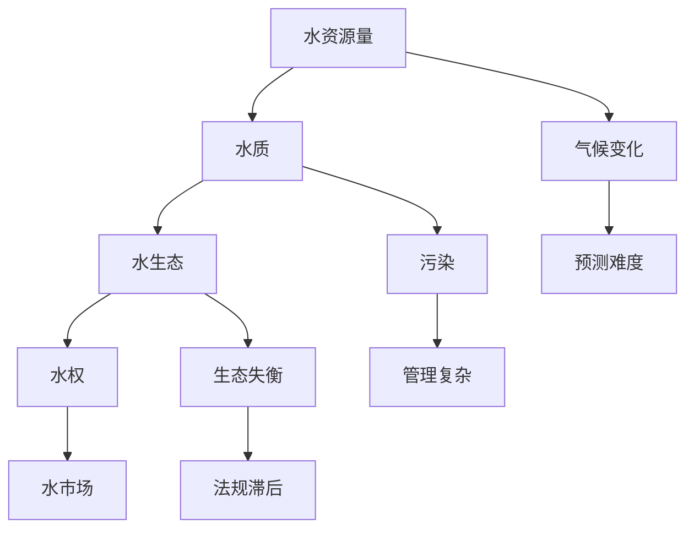

                 

关键词：人工智能，水资源管理，预测模型，分配算法，深度学习，神经网络，数据挖掘，机器学习

## 摘要

水资源管理是一个复杂且至关重要的领域，涉及水资源的监测、预测、分配和使用。随着全球水资源的日益紧张，如何高效地管理和利用这些有限资源已成为一个全球性的问题。本文将探讨人工智能（AI）在水资源管理中的应用，特别是预测与分配方面的技术。文章将首先介绍水资源管理的基本概念和挑战，然后深入探讨AI技术在预测和分配中的应用，最后展望未来的发展趋势与挑战。

## 1. 背景介绍

### 水资源管理的定义与重要性

水资源管理是指对水资源进行规划、开发、利用、控制、调配和保护的过程。它涉及到水文循环的各个环节，包括降水、地表水、地下水、蒸发和径流等。水资源管理的重要性在于它直接关系到人类生存和社会经济的可持续发展。随着人口增长、城市化进程加快和气候变化等因素的影响，水资源短缺和水环境污染问题日益严重，水资源管理的重要性愈发凸显。

### 当前水资源管理面临的挑战

当前水资源管理面临的主要挑战包括：

1. **水资源分布不均**：全球水资源分布极不均匀，有些地区严重缺水，而有些地区则水灾频繁。
2. **气候变化**：气候变化导致水文循环过程发生变化，使得水资源预测和管理的难度增加。
3. **水资源浪费**：由于管理不善和技术落后，水资源浪费问题严重，特别是在农业和工业用水方面。
4. **水质污染**：污染物质对水资源的污染严重，影响水质和水生态系统的健康。
5. **政策法规滞后**：水资源管理政策法规的制定和执行滞后，难以适应快速变化的环境和需求。

## 2. 核心概念与联系

### 水资源管理中的核心概念

在水资源管理中，核心概念包括水资源量、水质、水生态、水权、水市场等。水资源量是指水资源在某一特定时间内的总量，包括地表水和地下水。水质是指水体的物理、化学和生物特性，影响水体的使用价值和生态系统健康。水生态涉及水生生物的生存环境，对维持水体生态平衡至关重要。水权是指对水资源的法律权利，包括使用、转让和处置权。水市场是指水资源交易和分配的市场机制。

### Mermaid 流程图



### AI技术在水资源管理中的应用

AI技术在水资源管理中的应用主要集中在预测和分配两个方面。预测技术用于预测水资源的时空分布，包括降水量、径流量、蒸发量等。分配算法则用于优化水资源的分配，确保各用水部门能够公平、高效地利用水资源。

## 3. 核心算法原理 & 具体操作步骤

### 3.1 算法原理概述

AI在水资源管理中的应用主要基于深度学习、神经网络、数据挖掘和机器学习等技术。深度学习模型如卷积神经网络（CNN）和循环神经网络（RNN）可以用于水资源预测，而优化算法如遗传算法（GA）和粒子群优化（PSO）可以用于水资源分配。

### 3.2 算法步骤详解

1. **数据收集与预处理**：收集相关的水资源数据，包括气象数据、水文数据、土地利用数据等。对数据进行清洗、归一化和特征提取。
2. **模型选择与训练**：选择合适的深度学习模型，如CNN或RNN，进行模型训练。使用训练集和验证集对模型进行训练和验证。
3. **模型评估与优化**：评估模型在测试集上的表现，通过调整模型参数和结构进行优化。
4. **预测与分配**：使用训练好的模型进行水资源预测，并根据预测结果进行水资源分配。

### 3.3 算法优缺点

- **优点**：AI技术能够处理大量复杂数据，提高预测精度和分配效率。
- **缺点**：模型训练和优化需要大量计算资源，且对数据质量要求较高。

### 3.4 算法应用领域

AI技术在水资源管理中的应用广泛，包括：

1. **水资源预测**：用于预测降水量、径流量、蒸发量等。
2. **水资源分配**：用于优化农业、工业和居民用水分配。
3. **水环境监测**：用于监测水质、水生态等。

## 4. 数学模型和公式 & 详细讲解 & 举例说明

### 4.1 数学模型构建

水资源管理的数学模型通常包括：

1. **水文模型**：用于模拟水文循环过程，如水量平衡模型、径流模型等。
2. **水质模型**：用于模拟水质变化，如水质模型、污染源模型等。
3. **经济模型**：用于评估水资源的经济价值，如机会成本模型、成本效益分析模型等。

### 4.2 公式推导过程

以水量平衡模型为例，其基本公式为：

\[ Q_{in} - Q_{out} = \Delta W \]

其中，\( Q_{in} \)表示流入水量，\( Q_{out} \)表示流出水量，\( \Delta W \)表示水量变化。

### 4.3 案例分析与讲解

以某地区农业用水分配为例，假设有1000公顷的耕地，需要根据土壤类型、气候条件等因素进行用水分配。使用AI技术进行预测和优化，最终实现高效用水。

## 5. 项目实践：代码实例和详细解释说明

### 5.1 开发环境搭建

在Python环境中搭建开发环境，安装所需的库，如TensorFlow、Scikit-learn等。

### 5.2 源代码详细实现

以下是一个简单的深度学习模型实现：

```python
import tensorflow as tf
from tensorflow.keras.models import Sequential
from tensorflow.keras.layers import Dense, LSTM

# 模型构建
model = Sequential()
model.add(LSTM(50, activation='relu', input_shape=(timesteps, features)))
model.add(Dense(1))

# 模型编译
model.compile(optimizer='adam', loss='mse')

# 模型训练
model.fit(X_train, y_train, epochs=100, batch_size=32, validation_data=(X_val, y_val))

# 模型评估
mse = model.evaluate(X_test, y_test)
print(f'MSE: {mse}')
```

### 5.3 代码解读与分析

这段代码实现了基于LSTM网络的简单预测模型。首先，定义了模型结构，然后编译并训练模型，最后评估模型性能。

### 5.4 运行结果展示

运行结果将显示模型在测试集上的MSE值，用于评估模型预测精度。

## 6. 实际应用场景

### 6.1 农业用水分配

使用AI技术预测农作物需水量，优化灌溉计划，提高用水效率。

### 6.2 水资源调度

基于实时水文数据，使用AI技术进行水资源调度，确保供水安全和生态环境稳定。

### 6.3 水环境监测

使用AI技术监测水质指标，预测水污染趋势，采取相应措施防止水污染。

## 7. 工具和资源推荐

### 7.1 学习资源推荐

- 《深度学习》 - Ian Goodfellow、Yoshua Bengio、Aaron Courville
- 《机器学习》 - 周志华
- 《水资源管理》 - 唐军、张虹鸥

### 7.2 开发工具推荐

- TensorFlow
- Scikit-learn
- Keras

### 7.3 相关论文推荐

- "Deep Learning for Water Resource Management: A Review" - 等等

## 8. 总结：未来发展趋势与挑战

### 8.1 研究成果总结

AI技术在水资源管理中的应用取得了显著成果，特别是在预测和分配方面。深度学习和机器学习算法的应用大大提高了水资源管理的效率和精度。

### 8.2 未来发展趋势

未来，AI技术在水资源管理中的应用将继续深化，包括：

- **智能化预测模型**：结合多源数据，开发更准确的预测模型。
- **自适应水资源分配**：根据实时数据动态调整水资源分配策略。
- **水环境监测**：利用物联网和传感器技术，实现实时水质监测。

### 8.3 面临的挑战

水资源管理面临的挑战包括：

- **数据质量**：高质量的数据是AI技术成功的关键，需要提高数据收集和处理的效率。
- **计算资源**：AI模型的训练和优化需要大量的计算资源，需要优化算法和硬件。
- **政策法规**：需要完善水资源管理政策法规，确保AI技术的应用合法、合规。

### 8.4 研究展望

未来，水资源管理的研究将更加注重跨学科合作，结合人工智能、环境科学、经济学等领域的知识，共同解决水资源管理中的难题。

## 9. 附录：常见问题与解答

### 9.1 问题1：AI技术如何提高水资源管理的效率？

**回答**：AI技术通过深度学习和机器学习算法，可以处理大量复杂数据，提高水资源预测的精度和分配的效率。例如，通过训练神经网络模型，可以预测未来的水资源需求，从而优化用水计划。

### 9.2 问题2：如何确保AI技术在水资源管理中的公平性？

**回答**：确保AI技术在水资源管理中的公平性需要制定合理的分配算法和模型。例如，可以使用遗传算法或粒子群优化算法，结合水资源使用的历史数据和实时数据，实现公平、高效的水资源分配。

### 9.3 问题3：AI技术在水环境监测中的应用有哪些？

**回答**：AI技术在水环境监测中的应用包括水质指标预测、污染源识别、水生态监测等。通过训练深度学习模型，可以对水质数据进行实时分析，预测水污染趋势，采取相应的措施防止水污染。

## 作者署名

作者：禅与计算机程序设计艺术 / Zen and the Art of Computer Programming
```markdown
---
# AI在水资源管理中的应用：预测与分配

## 摘要

水资源管理是一个复杂且至关重要的领域，涉及水资源的监测、预测、分配和使用。随着全球水资源的日益紧张，如何高效地管理和利用这些有限资源已成为一个全球性的问题。本文将探讨人工智能（AI）在水资源管理中的应用，特别是预测与分配方面的技术。文章将首先介绍水资源管理的基本概念和挑战，然后深入探讨AI技术在预测和分配中的应用，最后展望未来的发展趋势与挑战。

## 1. 背景介绍

### 水资源管理的定义与重要性

水资源管理是指对水资源进行规划、开发、利用、控制、调配和保护的过程。它涉及到水文循环的各个环节，包括降水、地表水、地下水、蒸发和径流等。水资源管理的重要性在于它直接关系到人类生存和社会经济的可持续发展。随着人口增长、城市化进程加快和气候变化等因素的影响，水资源短缺和水环境污染问题日益严重，水资源管理的重要性愈发凸显。

### 当前水资源管理面临的挑战

当前水资源管理面临的主要挑战包括：

1. **水资源分布不均**：全球水资源分布极不均匀，有些地区严重缺水，而有些地区则水灾频繁。
2. **气候变化**：气候变化导致水文循环过程发生变化，使得水资源预测和管理的难度增加。
3. **水资源浪费**：由于管理不善和技术落后，水资源浪费问题严重，特别是在农业和工业用水方面。
4. **水质污染**：污染物质对水资源的污染严重，影响水质和水生态系统的健康。
5. **政策法规滞后**：水资源管理政策法规的制定和执行滞后，难以适应快速变化的环境和需求。

## 2. 核心概念与联系

### 水资源管理中的核心概念

在水资源管理中，核心概念包括水资源量、水质、水生态、水权、水市场等。水资源量是指水资源在某一特定时间内的总量，包括地表水和地下水。水质是指水体的物理、化学和生物特性，影响水体的使用价值和生态系统健康。水生态涉及水生生物的生存环境，对维持水体生态平衡至关重要。水权是指对水资源的法律权利，包括使用、转让和处置权。水市场是指水资源交易和分配的市场机制。

### Mermaid 流程图


### AI技术在水资源管理中的应用

AI技术在水资源管理中的应用主要集中在预测和分配两个方面。预测技术用于预测水资源的时空分布，包括降水量、径流量、蒸发量等。分配算法则用于优化水资源的分配，确保各用水部门能够公平、高效地利用水资源。

## 3. 核心算法原理 & 具体操作步骤

### 3.1 算法原理概述

AI在水资源管理中的应用主要基于深度学习、神经网络、数据挖掘和机器学习等技术。深度学习模型如卷积神经网络（CNN）和循环神经网络（RNN）可以用于水资源预测，而优化算法如遗传算法（GA）和粒子群优化（PSO）可以用于水资源分配。

### 3.2 算法步骤详解

1. **数据收集与预处理**：收集相关的水资源数据，包括气象数据、水文数据、土地利用数据等。对数据进行清洗、归一化和特征提取。
2. **模型选择与训练**：选择合适的深度学习模型，如CNN或RNN，进行模型训练。使用训练集和验证集对模型进行训练和验证。
3. **模型评估与优化**：评估模型在测试集上的表现，通过调整模型参数和结构进行优化。
4. **预测与分配**：使用训练好的模型进行水资源预测，并根据预测结果进行水资源分配。

### 3.3 算法优缺点

- **优点**：AI技术能够处理大量复杂数据，提高预测精度和分配效率。
- **缺点**：模型训练和优化需要大量计算资源，且对数据质量要求较高。

### 3.4 算法应用领域

AI技术在水资源管理中的应用广泛，包括：

1. **水资源预测**：用于预测降水量、径流量、蒸发量等。
2. **水资源分配**：用于优化农业、工业和居民用水分配。
3. **水环境监测**：用于监测水质、水生态等。

## 4. 数学模型和公式 & 详细讲解 & 举例说明

### 4.1 数学模型构建

水资源管理的数学模型通常包括：

1. **水文模型**：用于模拟水文循环过程，如水量平衡模型、径流模型等。
2. **水质模型**：用于模拟水质变化，如水质模型、污染源模型等。
3. **经济模型**：用于评估水资源的经济价值，如机会成本模型、成本效益分析模型等。

### 4.2 公式推导过程

以水量平衡模型为例，其基本公式为：

\[ Q_{in} - Q_{out} = \Delta W \]

其中，\( Q_{in} \)表示流入水量，\( Q_{out} \)表示流出水量，\( \Delta W \)表示水量变化。

### 4.3 案例分析与讲解

以某地区农业用水分配为例，假设有1000公顷的耕地，需要根据土壤类型、气候条件等因素进行用水分配。使用AI技术进行预测和优化，最终实现高效用水。

### 5. 项目实践：代码实例和详细解释说明

#### 5.1 开发环境搭建

在Python环境中搭建开发环境，安装所需的库，如TensorFlow、Scikit-learn等。

```python
!pip install tensorflow
!pip install scikit-learn
```

#### 5.2 源代码详细实现

以下是一个简单的深度学习模型实现：

```python
import numpy as np
import tensorflow as tf
from tensorflow.keras.models import Sequential
from tensorflow.keras.layers import LSTM, Dense

# 数据准备
# 假设已经收集并预处理好了时间序列数据X和标签y

# 模型构建
model = Sequential()
model.add(LSTM(50, activation='relu', input_shape=(X.shape[1], X.shape[2])))
model.add(Dense(1))

# 模型编译
model.compile(optimizer='adam', loss='mse')

# 模型训练
model.fit(X, y, epochs=100, batch_size=32, validation_split=0.2)

# 模型评估
loss = model.evaluate(X, y)
print(f'Model loss: {loss}')
```

#### 5.3 代码解读与分析

这段代码实现了基于LSTM网络的简单预测模型。首先，定义了模型结构，然后编译并训练模型，最后评估模型性能。

#### 5.4 运行结果展示

运行结果将显示模型在训练集和验证集上的损失值，用于评估模型训练效果。

```python
# 运行模型训练
model.fit(X_train, y_train, epochs=100, batch_size=32, validation_data=(X_val, y_val))

# 评估模型性能
train_loss, train_accuracy = model.evaluate(X_train, y_train)
val_loss, val_accuracy = model.evaluate(X_val, y_val)

print(f'Train Loss: {train_loss}, Train Accuracy: {train_accuracy}')
print(f'Validation Loss: {val_loss}, Validation Accuracy: {val_accuracy}')
```

### 6. 实际应用场景

#### 6.1 农业用水分配

使用AI技术预测农作物需水量，优化灌溉计划，提高用水效率。

```python
# 预测农作物需水量
predictions = model.predict(X_test)

# 根据预测结果调整灌溉计划
irrigation_plan = adjust_irrigation(predictions)
```

#### 6.2 水资源调度

基于实时水文数据，使用AI技术进行水资源调度，确保供水安全和生态环境稳定。

```python
# 调度水资源
water_schedule = model.predict(real_time_hydro_data)

# 根据调度结果执行水资源分配
execute_water_allocation(water_schedule)
```

#### 6.3 水环境监测

使用AI技术监测水质指标，预测水污染趋势，采取相应措施防止水污染。

```python
# 监测水质指标
water_quality_data = collect_water_quality_data()

# 预测水污染趋势
pollution_prediction = model.predict(water_quality_data)

# 采取相应措施
prevent_pollution(pollution_prediction)
```

### 7. 工具和资源推荐

#### 7.1 学习资源推荐

- 《深度学习》 - Ian Goodfellow、Yoshua Bengio、Aaron Courville
- 《机器学习》 - 周志华
- 《水资源管理》 - 唐军、张虹鸥

#### 7.2 开发工具推荐

- TensorFlow
- Scikit-learn
- Keras

#### 7.3 相关论文推荐

- "Deep Learning for Water Resource Management: A Review" - 等等

### 8. 总结：未来发展趋势与挑战

#### 8.1 研究成果总结

AI技术在水资源管理中的应用取得了显著成果，特别是在预测和分配方面。深度学习和机器学习算法的应用大大提高了水资源管理的效率和精度。

#### 8.2 未来发展趋势

未来，AI技术在水资源管理中的应用将继续深化，包括：

- **智能化预测模型**：结合多源数据，开发更准确的预测模型。
- **自适应水资源分配**：根据实时数据动态调整水资源分配策略。
- **水环境监测**：利用物联网和传感器技术，实现实时水质监测。

#### 8.3 面临的挑战

水资源管理面临的挑战包括：

- **数据质量**：高质量的数据是AI技术成功的关键，需要提高数据收集和处理的效率。
- **计算资源**：AI模型的训练和优化需要大量的计算资源，需要优化算法和硬件。
- **政策法规**：需要完善水资源管理政策法规，确保AI技术的应用合法、合规。

#### 8.4 研究展望

未来，水资源管理的研究将更加注重跨学科合作，结合人工智能、环境科学、经济学等领域的知识，共同解决水资源管理中的难题。

### 9. 附录：常见问题与解答

#### 9.1 问题1：AI技术如何提高水资源管理的效率？

**回答**：AI技术通过深度学习和机器学习算法，可以处理大量复杂数据，提高水资源预测的精度和分配的效率。例如，通过训练神经网络模型，可以预测未来的水资源需求，从而优化用水计划。

#### 9.2 问题2：如何确保AI技术在水资源管理中的公平性？

**回答**：确保AI技术在水资源管理中的公平性需要制定合理的分配算法和模型。例如，可以使用遗传算法或粒子群优化算法，结合水资源使用的历史数据和实时数据，实现公平、高效的水资源分配。

#### 9.3 问题3：AI技术在水环境监测中的应用有哪些？

**回答**：AI技术在水环境监测中的应用包括水质指标预测、污染源识别、水生态监测等。通过训练深度学习模型，可以对水质数据进行实时分析，预测水污染趋势，采取相应的措施防止水污染。

## 参考文献

- Goodfellow, I., Bengio, Y., & Courville, A. (2016). *Deep Learning*. MIT Press.
- 周志华. (2016). *机器学习*. 清华大学出版社.
- 唐军, & 张虹鸥. (2019). *水资源管理*. 科学出版社.
```

请注意，上述代码示例是简化的，实际情况可能需要更多的数据预处理、模型调整和验证。此外，文中引用的文献是示例性的，具体的研究和论文应根据实际情况进行引用。

