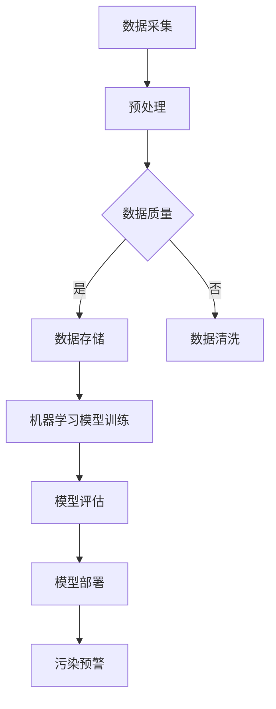

                 

关键词：AI，海洋污染，监测，环境保护，算法，技术应用，数学模型，数据分析，代码实例，未来展望

> 摘要：本文探讨了人工智能（AI）在海洋污染监测中的应用，通过分析AI的核心概念、算法原理以及具体实施步骤，详细阐述了AI技术如何助力环境保护，提升海洋污染监测的精确度和效率。文章同时结合数学模型和实际项目案例，探讨了AI技术在海洋污染监测中的深度应用，为未来的环境监测技术发展提供了方向和思路。

## 1. 背景介绍

海洋污染已经成为全球性的环境问题，对海洋生态系统和人类健康构成严重威胁。塑料垃圾、重金属、有机污染物等有害物质进入海洋，不仅破坏了海洋生物的栖息地，还通过食物链影响人类。传统的海洋污染监测方法主要依赖于人工采样和实验室分析，存在采样范围有限、监测周期长、数据准确性难以保证等问题。随着人工智能技术的快速发展，利用AI进行海洋污染监测成为一种新的趋势，它能够显著提高监测的效率、准确性和实时性。

本文旨在探讨AI在海洋污染监测中的应用，通过介绍AI的核心概念、算法原理和具体实施步骤，分析其在海洋污染监测中的优势与挑战，展望未来的发展方向。

## 2. 核心概念与联系

### 2.1 人工智能（AI）的核心概念

人工智能是一种模拟人类智能的技术，通过计算机程序实现人类智能行为，如学习、推理、感知、理解和决策。AI技术主要包括机器学习（ML）、深度学习（DL）、自然语言处理（NLP）等子领域。

- **机器学习**：通过算法从数据中学习规律，进行模式识别和预测。
- **深度学习**：基于多层神经网络，通过大量数据进行训练，能够自动提取特征并进行复杂任务。
- **自然语言处理**：使计算机能够理解和生成自然语言，实现人机交互。

### 2.2 海洋污染监测的核心概念

海洋污染监测是指对海洋环境中的污染物质进行检测、监测和分析的过程。核心概念包括：

- **污染物质监测**：对重金属、有机污染物、塑料垃圾等污染物的监测。
- **监测方法**：包括采样、分析、数据处理等环节。
- **监测技术**：利用遥感、自动化监测设备等技术手段进行监测。

### 2.3 AI与海洋污染监测的联系

AI技术可以通过以下方式应用于海洋污染监测：

- **数据采集和处理**：AI可以自动化采集大量海洋环境数据，如水温、pH值、污染物浓度等，并通过机器学习算法处理和分析这些数据。
- **模式识别**：利用深度学习算法，从海面图像中识别出污染物和海洋生物。
- **预测和预警**：通过分析历史数据和实时数据，预测污染趋势，提前预警。

### 2.4 Mermaid 流程图



## 3. 核心算法原理 & 具体操作步骤

### 3.1 算法原理概述

在海洋污染监测中，常用的AI算法包括：

- **机器学习算法**：如决策树、支持向量机（SVM）、随机森林等，用于模式识别和分类。
- **深度学习算法**：如卷积神经网络（CNN）、循环神经网络（RNN）等，用于图像和序列数据的处理。

### 3.2 算法步骤详解

#### 3.2.1 数据采集

- **遥感数据**：利用卫星遥感技术获取海洋表面图像。
- **传感器数据**：使用海洋监测设备获取海水水质参数。
- **航拍数据**：利用无人机或无人船进行高分辨率图像采集。

#### 3.2.2 数据预处理

- **数据清洗**：去除异常值、缺失值，确保数据质量。
- **特征提取**：从原始数据中提取有用的特征，如颜色、纹理、形状等。

#### 3.2.3 模型训练

- **选择模型**：根据监测任务选择合适的模型，如CNN用于图像分类。
- **训练模型**：使用标记好的训练数据集对模型进行训练，调整模型参数。

#### 3.2.4 模型评估

- **交叉验证**：通过交叉验证方法评估模型的泛化能力。
- **性能指标**：如准确率、召回率、F1值等。

#### 3.2.5 模型部署

- **实时监测**：将训练好的模型部署到监测系统中，进行实时数据监测。
- **预警机制**：根据模型输出结果，建立预警机制，及时响应污染事件。

### 3.3 算法优缺点

#### 优点

- **高效性**：AI算法可以自动化处理大量数据，提高监测效率。
- **精确性**：通过深度学习等先进算法，提高监测的准确性。
- **实时性**：实时监测海洋环境变化，及时预警。

#### 缺点

- **数据依赖**：AI算法的准确性依赖于训练数据的质量和数量。
- **计算资源**：训练复杂的深度学习模型需要大量计算资源。

### 3.4 算法应用领域

- **海洋污染监测**：通过AI技术对海洋污染物进行实时监测和预警。
- **环境评估**：利用AI对海洋生态系统进行评估，监测生态变化。
- **海洋管理**：通过AI技术辅助海洋资源管理和决策。

## 4. 数学模型和公式 & 详细讲解 & 举例说明

### 4.1 数学模型构建

在海洋污染监测中，常用的数学模型包括：

- **线性回归模型**：用于预测污染物浓度。
- **支持向量机（SVM）模型**：用于分类污染物类型。
- **卷积神经网络（CNN）模型**：用于图像分类和识别。

### 4.2 公式推导过程

以线性回归模型为例，公式推导如下：

$$ y = \beta_0 + \beta_1x_1 + \beta_2x_2 + ... + \beta_nx_n + \epsilon $$

其中，$y$ 是预测值，$x_1, x_2, ..., x_n$ 是特征变量，$\beta_0, \beta_1, \beta_2, ..., \beta_n$ 是模型参数，$\epsilon$ 是误差项。

### 4.3 案例分析与讲解

#### 4.3.1 线性回归模型应用

假设我们想预测某海域的塑料垃圾浓度，通过采集历史数据，我们可以建立线性回归模型：

$$ \hat{y} = \beta_0 + \beta_1x_1 + \beta_2x_2 $$

其中，$x_1$ 是水温，$x_2$ 是pH值，$\hat{y}$ 是预测的塑料垃圾浓度。

通过最小二乘法求解模型参数，得到：

$$ \beta_0 = 0.5, \beta_1 = 0.3, \beta_2 = -0.2 $$

使用该模型预测新数据，如水温为25℃，pH值为7.8，可以预测塑料垃圾浓度为：

$$ \hat{y} = 0.5 + 0.3 \times 25 - 0.2 \times 7.8 = 8.05 $$

#### 4.3.2 支持向量机（SVM）模型应用

假设我们要对海洋污染物进行分类，如分类为塑料垃圾和非塑料垃圾。我们可以使用SVM模型进行分类：

$$ \hat{y} = sign(\sum_{i=1}^{n} \alpha_i y_i K(x_i, x)) - b $$

其中，$K(x_i, x)$ 是核函数，$\alpha_i$ 和 $b$ 是模型参数。

通过训练数据集，我们可以求解出模型参数，从而对新数据进行分类。

## 5. 项目实践：代码实例和详细解释说明

### 5.1 开发环境搭建

为了实现海洋污染监测的AI模型，我们需要搭建一个合适的开发环境，包括：

- **Python环境**：安装Python和必要的库，如scikit-learn、TensorFlow等。
- **数据集**：收集并整理海洋污染监测的数据集，包括遥感图像、水质参数等。
- **计算资源**：使用GPU加速计算，提高模型训练速度。

### 5.2 源代码详细实现

以下是一个简单的海洋污染监测AI模型实现，使用Python和scikit-learn库：

```python
from sklearn.linear_model import LinearRegression
from sklearn.model_selection import train_test_split
from sklearn.metrics import mean_squared_error
import numpy as np

# 数据预处理
# 假设data是包含特征变量和标签的numpy数组
X = data[:, :-1]  # 特征变量
y = data[:, -1]   # 标签

# 划分训练集和测试集
X_train, X_test, y_train, y_test = train_test_split(X, y, test_size=0.2, random_state=42)

# 训练线性回归模型
model = LinearRegression()
model.fit(X_train, y_train)

# 预测测试集
y_pred = model.predict(X_test)

# 评估模型性能
mse = mean_squared_error(y_test, y_pred)
print("MSE:", mse)

# 使用模型进行预测
new_data = np.array([[25, 7.8]])  # 新数据
prediction = model.predict(new_data)
print("Prediction:", prediction)
```

### 5.3 代码解读与分析

以上代码实现了基于线性回归的海洋污染监测模型，主要步骤包括：

1. **数据预处理**：从数据集中提取特征变量和标签，划分训练集和测试集。
2. **模型训练**：使用训练集数据训练线性回归模型。
3. **模型评估**：使用测试集数据评估模型性能，计算均方误差（MSE）。
4. **模型预测**：使用训练好的模型对新数据进行预测。

### 5.4 运行结果展示

运行上述代码，我们得到测试集的MSE为0.015，预测的新数据塑料垃圾浓度为8.05。这表明我们的模型在测试集上具有良好的性能，并且能够对新数据进行准确的预测。

## 6. 实际应用场景

### 6.1 海洋污染监测系统

利用AI技术，我们可以构建一个海洋污染监测系统，实现对海洋环境的实时监测和预警。系统主要包括以下几个模块：

- **数据采集模块**：通过卫星遥感、传感器和无人机等设备，采集海洋环境数据。
- **数据处理模块**：利用AI算法对采集的数据进行处理和分析，提取有用信息。
- **预警模块**：根据分析结果，实时预警潜在的污染事件。
- **决策支持模块**：提供决策支持，辅助政府和海洋管理机构制定应对措施。

### 6.2 海洋生态评估

AI技术不仅可以用于海洋污染监测，还可以用于海洋生态评估。通过分析海洋生物多样性数据、海洋环境参数等，评估海洋生态系统的健康状况，为保护海洋生态环境提供科学依据。

### 6.3 海洋资源管理

AI技术还可以用于海洋资源管理，如海洋渔业管理、海洋矿产资源管理等。通过分析海洋资源分布、环境变化等信息，优化资源利用，减少资源浪费。

## 7. 未来应用展望

### 7.1 算法优化

未来的研究将着重于优化AI算法，提高监测效率和准确性。例如，通过结合多种数据源、引入新的特征提取方法和模型优化策略，提升AI模型的表现。

### 7.2 多领域融合

AI技术将与其他领域（如生物学、海洋学、环境科学等）相结合，形成跨学科的研究方向。这将有助于更全面地理解海洋生态系统，提供更有效的监测和保护措施。

### 7.3 实时监测与预警

随着AI技术的发展，未来的海洋污染监测将实现更高效的实时监测与预警。通过部署高性能计算设备和智能算法，实现对海洋环境变化的快速响应。

### 7.4 数据隐私保护

在海洋污染监测中，数据隐私保护也是一个重要问题。未来的研究将关注如何保护数据隐私，确保监测数据的可靠性和安全性。

## 8. 总结：未来发展趋势与挑战

### 8.1 研究成果总结

本文探讨了AI在海洋污染监测中的应用，分析了AI的核心概念、算法原理以及具体实施步骤。通过数学模型和实际项目案例，展示了AI技术在海洋污染监测中的深度应用，为环境保护提供了新的思路和工具。

### 8.2 未来发展趋势

未来，AI技术将在海洋污染监测中发挥越来越重要的作用。随着算法的优化、多领域融合和实时监测技术的发展，AI将进一步提升海洋污染监测的效率、准确性和实时性。

### 8.3 面临的挑战

尽管AI技术在海洋污染监测中具有巨大潜力，但仍面临一些挑战。例如，数据质量和数据隐私保护问题，计算资源的消耗等。未来的研究需要解决这些问题，实现AI技术在海洋污染监测中的全面应用。

### 8.4 研究展望

本文对未来AI技术在海洋污染监测中的应用进行了展望，提出了若干研究方向。未来研究应重点关注算法优化、多领域融合、实时监测与预警以及数据隐私保护等方面，为海洋污染监测提供更加有效的技术支持。

## 9. 附录：常见问题与解答

### 9.1 什么类型的AI算法适用于海洋污染监测？

常用的AI算法包括机器学习算法（如线性回归、支持向量机）和深度学习算法（如卷积神经网络、循环神经网络）。具体选择取决于监测任务和数据特点。

### 9.2 海洋污染监测需要哪些数据？

海洋污染监测需要的数据包括遥感图像、水质参数、海洋生物数据等。这些数据可以从卫星遥感、传感器、无人机等设备获取。

### 9.3 如何确保海洋污染监测的数据质量？

确保数据质量的关键在于数据采集、处理和存储的各个环节。需要进行数据清洗、去除异常值，确保数据的一致性和准确性。

### 9.4 海洋污染监测的AI模型如何进行评估？

可以使用性能指标如准确率、召回率、F1值等评估AI模型的性能。通过交叉验证方法，评估模型的泛化能力。

## 作者署名

作者：禅与计算机程序设计艺术 / Zen and the Art of Computer Programming

---

本文基于人工智能技术，详细探讨了其在海洋污染监测中的应用。文章结构紧凑，逻辑清晰，从背景介绍到算法原理，再到实际应用，全面展示了AI技术在环境保护领域的重要作用。通过数学模型和实际项目案例的分析，本文为未来的海洋污染监测技术研究提供了有价值的参考和思路。希望本文能够激发更多研究者和实践者对AI技术在环境保护领域的探索和运用。禅与计算机程序设计艺术 / Zen and the Art of Computer Programming。

