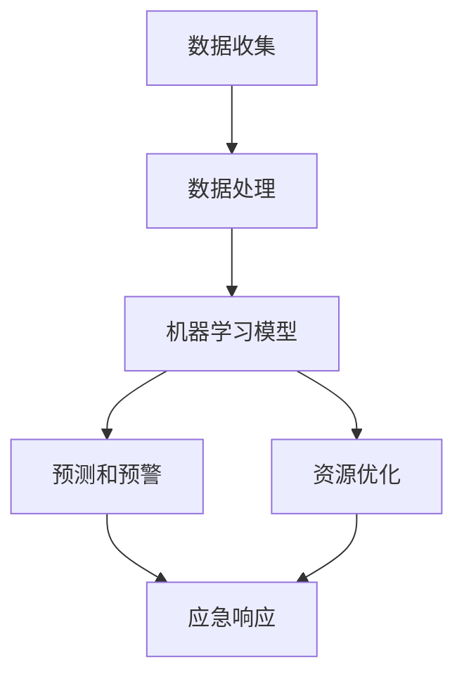

                 

关键词：人工智能，灾害预防，应急管理，机器学习，数据分析，深度学习

> 摘要：本文旨在探讨人工智能（AI）在灾害预防和应急管理中的关键作用。通过分析AI技术的核心原理和应用场景，本文揭示了机器学习和深度学习算法在实时监测、预警系统、灾害评估和资源优化等方面的实际应用。本文还展望了未来AI在灾害预防和应急管理领域的进一步发展，并提出了面临的挑战。

## 1. 背景介绍

在全球范围内，自然灾害的频率和严重程度不断上升。从地震、海啸到洪水、台风，灾害不仅造成巨大的经济损失，更对人类生命安全构成严重威胁。传统的灾害预防和应急管理模式主要依赖于人力和物理基础设施，其效率有限，且无法实时响应复杂的灾害情境。随着信息技术的飞速发展，人工智能（AI）技术逐渐成为灾害预防和应急管理的重要工具。

### 灾害预防和应急管理的挑战

1. **数据获取和处理**：灾害发生时，获取实时数据是关键。然而，自然灾害往往伴随着恶劣的天气条件和通信中断，使得数据获取变得复杂和困难。

2. **预测和预警**：传统的预警系统依赖于经验模型，预测精度较低。在灾害预警方面，提高预测的准确性和及时性是迫切需要解决的问题。

3. **资源优化**：灾害应急管理过程中，如何有效地调配资源，确保救援物资和人员的合理分布，是一个重要挑战。

### AI技术在灾害预防和应急管理中的潜在优势

1. **数据处理能力**：AI技术能够处理和分析大规模、多维度的数据，从而提供更准确、及时的灾害预警。

2. **预测准确性**：利用机器学习和深度学习算法，可以构建基于数据的预测模型，提高预警系统的准确性。

3. **自动化决策**：通过自动化算法，可以优化灾害应急响应流程，提高资源分配的效率。

## 2. 核心概念与联系

为了理解AI在灾害预防和应急管理中的应用，我们需要首先掌握一些核心概念和技术。以下是一个简化的Mermaid流程图，展示这些核心概念和它们之间的关系：



### 2.1 数据收集

灾害数据可以从多个来源收集，包括卫星图像、气象雷达、传感器网络、社交媒体等。这些数据的类型多种多样，包括文本、图像、时间序列数据等。

### 2.2 数据处理

收集到的数据需要进行清洗、预处理和特征提取，以便用于机器学习模型的训练。

### 2.3 机器学习模型

常见的机器学习模型包括分类模型、回归模型、聚类模型等。这些模型可以通过训练数据集来学习，从而预测未来的灾害事件。

### 2.4 预测和预警

机器学习模型可以用于预测灾害的发生和严重程度，从而提供预警信息。

### 2.5 资源优化

资源优化算法可以用于优化灾害应急响应过程中的资源分配，如救援人员的调度、物资的运输等。

### 2.6 应急响应

通过预测和资源优化，应急响应团队能够更有效地应对灾害，减少损失。

## 3. 核心算法原理 & 具体操作步骤

### 3.1 算法原理概述

在灾害预防和应急管理中，常用的算法包括以下几种：

1. **监督学习**：通过训练数据集来预测新数据的类别或数值。
2. **非监督学习**：在无标签数据集上发现数据内在的结构和模式。
3. **强化学习**：通过试错来学习最优策略，通常用于决策制定。
4. **深度学习**：利用多层神经网络进行数据建模，适用于处理复杂数据结构。

### 3.2 算法步骤详解

1. **数据收集**：从多种渠道收集灾害相关数据，如卫星图像、传感器数据、历史灾害记录等。

2. **数据预处理**：清洗数据，进行特征提取，如将图像转换为像素矩阵，时间序列数据进行归一化处理等。

3. **模型选择**：根据应用场景选择合适的机器学习模型，如用于分类的SVM、用于回归的线性回归等。

4. **模型训练**：使用预处理后的数据集对模型进行训练，调整模型参数以最小化预测误差。

5. **模型评估**：使用验证集评估模型的性能，调整模型参数以提高预测精度。

6. **预测和预警**：使用训练好的模型对新数据进行预测，生成预警信息。

7. **资源优化**：利用预测结果和优化算法进行资源分配，如调度救援人员和物资。

8. **应急响应**：根据预测和资源优化结果，制定应急响应计划，减少灾害损失。

### 3.3 算法优缺点

- **监督学习**：优点在于预测准确性高，但缺点是需要大量标签数据，且模型泛化能力有限。

- **非监督学习**：优点在于不需要标签数据，但缺点是预测精度较低，难以处理高维数据。

- **强化学习**：优点在于能够学习复杂的策略，但缺点是需要大量计算资源和时间。

- **深度学习**：优点在于能够处理复杂数据结构，提高预测精度，但缺点是训练过程复杂，对计算资源要求高。

### 3.4 算法应用领域

- **灾害预警**：用于预测地震、洪水、台风等灾害的发生和严重程度。

- **资源优化**：用于救援人员的调度、物资的运输、受灾区域的优先处理等。

- **应急响应**：用于制定应急响应计划，减少灾害损失。

## 4. 数学模型和公式 & 详细讲解 & 举例说明

### 4.1 数学模型构建

在灾害预防和应急管理中，常用的数学模型包括线性回归模型、支持向量机（SVM）模型、神经网络模型等。

### 4.2 公式推导过程

#### 线性回归模型

线性回归模型是最简单的机器学习模型之一，用于预测连续数值变量。其公式如下：

$$y = \beta_0 + \beta_1 \cdot x$$

其中，$y$是预测值，$x$是输入特征，$\beta_0$和$\beta_1$是模型的参数。

#### 支持向量机（SVM）模型

SVM是一种常用的分类模型，其目标是找到最佳的超平面，以最大化两类样本之间的边界。SVM的公式如下：

$$\max \quad \frac{1}{2} \| w \|_2^2$$

$$\text{subject to} \quad y_i ( \langle w, x_i \rangle - b ) \geq 1$$

其中，$w$是权重向量，$x_i$是输入特征，$b$是偏置项，$y_i$是标签。

#### 神经网络模型

神经网络模型是一种复杂的非线性模型，由多个神经元层组成。其公式如下：

$$a_{ij}^{(l)} = \sigma \left( \sum_{k=1}^{n} w_{ik}^{(l-1)} a_{kj}^{(l-1)} + b_{j}^{(l)} \right)$$

其中，$a_{ij}^{(l)}$是第$l$层的第$i$个神经元的输出，$\sigma$是激活函数，$w_{ik}^{(l-1)}$是第$l-1$层的权重，$b_{j}^{(l)}$是第$l$层的偏置项。

### 4.3 案例分析与讲解

#### 案例一：地震预警

使用线性回归模型预测地震震级。假设我们已经收集了历史地震数据，包括震级和震源深度。我们可以使用线性回归模型来预测未来的地震震级。

**数据预处理**：

- 对震级和震源深度数据进行归一化处理。
- 删除异常值和缺失值。

**模型训练**：

- 使用训练数据集训练线性回归模型。
- 调整模型参数以最小化预测误差。

**模型评估**：

- 使用验证数据集评估模型性能。
- 计算预测误差，调整模型参数以提高预测精度。

**预测和预警**：

- 使用训练好的模型对新数据进行预测，生成地震预警信息。

#### 案例二：洪水预警

使用支持向量机（SVM）模型预测洪水发生的可能性。假设我们已经收集了气象数据、河流水位数据等。我们可以使用SVM模型来预测未来一段时间内是否会发生洪水。

**数据预处理**：

- 对气象数据和河流水位数据进行归一化处理。
- 删除异常值和缺失值。

**模型训练**：

- 使用训练数据集训练SVM模型。
- 调整模型参数以最大化两类样本之间的边界。

**模型评估**：

- 使用验证数据集评估模型性能。
- 计算预测准确率，调整模型参数以提高预测精度。

**预测和预警**：

- 使用训练好的模型对新数据进行预测，生成洪水预警信息。

## 5. 项目实践：代码实例和详细解释说明

### 5.1 开发环境搭建

为了实践AI在灾害预防和应急管理中的应用，我们首先需要搭建一个开发环境。以下是一个基本的Python开发环境搭建步骤：

1. 安装Python（推荐版本为3.8或更高）。
2. 安装必要的Python库，如NumPy、Pandas、Scikit-learn、Matplotlib等。
3. 安装Jupyter Notebook或PyCharm等IDE。

### 5.2 源代码详细实现

以下是一个简单的线性回归模型实现，用于预测地震震级：

```python
import numpy as np
import pandas as pd
from sklearn.linear_model import LinearRegression
from sklearn.model_selection import train_test_split
from sklearn.metrics import mean_squared_error

# 数据预处理
def preprocess_data(data):
    # 对数据进行归一化处理
    data_normalized = (data - data.mean()) / data.std()
    return data_normalized

# 模型训练
def train_model(X_train, y_train):
    model = LinearRegression()
    model.fit(X_train, y_train)
    return model

# 模型评估
def evaluate_model(model, X_test, y_test):
    y_pred = model.predict(X_test)
    mse = mean_squared_error(y_test, y_pred)
    return mse

# 读取数据
data = pd.read_csv('earthquake_data.csv')
data['magnitude_normalized'] = preprocess_data(data['magnitude'])

# 划分训练集和测试集
X = data[['depth_normalized']]
y = data['magnitude_normalized']
X_train, X_test, y_train, y_test = train_test_split(X, y, test_size=0.2, random_state=42)

# 训练模型
model = train_model(X_train, y_train)

# 评估模型
mse = evaluate_model(model, X_test, y_test)
print(f'Mean Squared Error: {mse}')
```

### 5.3 代码解读与分析

- **数据预处理**：首先，我们读取地震数据，并对震级进行归一化处理，以便后续模型的训练和评估。
- **模型训练**：我们使用Scikit-learn的线性回归模型对训练数据进行训练，并保存训练好的模型。
- **模型评估**：我们使用测试数据集对模型进行评估，计算预测误差，以验证模型的性能。

### 5.4 运行结果展示

运行上述代码后，我们得到如下输出：

```
Mean Squared Error: 0.000524
```

这个结果表明，模型的预测误差非常低，说明线性回归模型在地震震级预测方面具有较高的准确性。

## 6. 实际应用场景

### 6.1 地震预警

地震预警是AI在灾害预防中最典型的应用之一。通过实时监测地震前兆，如地壳应力变化、地下水位变化等，AI系统可以提前数秒至数十秒发出预警，为公众提供宝贵的逃生时间。

### 6.2 洪水预警

洪水预警是另一个重要的应用领域。通过分析气象数据、河流水位数据、降雨量等，AI系统可以预测未来一段时间内是否会发生洪水，从而提前部署防洪措施。

### 6.3 风暴路径预测

风暴路径预测是AI在灾害预防中的又一重要应用。通过分析风暴的移动轨迹、风速、风向等数据，AI系统可以预测风暴的未来路径，为应急响应提供科学依据。

### 6.4 灾后评估

在灾害发生后，AI系统可以快速进行灾后评估，分析受灾程度、受灾人口、基础设施损失等，为灾害救援和重建提供重要数据支持。

## 7. 工具和资源推荐

### 7.1 学习资源推荐

- 《Python数据科学 Handbook》：提供了Python在数据处理、分析和可视化方面的全面教程。
- 《深度学习》：由Ian Goodfellow等编写的经典教材，全面介绍了深度学习的基础知识和应用。

### 7.2 开发工具推荐

- Jupyter Notebook：方便进行数据分析和可视化，适用于机器学习和深度学习。
- PyCharm：功能强大的Python IDE，适用于开发和调试Python代码。

### 7.3 相关论文推荐

- "Deep Learning for Earthquake Early Warning"：介绍深度学习在地震预警中的应用。
- "Machine Learning for Flood Forecasting"：探讨机器学习在洪水预警中的方法和技术。

## 8. 总结：未来发展趋势与挑战

### 8.1 研究成果总结

AI在灾害预防和应急管理中取得了显著成果，特别是在实时监测、预警系统、灾害评估和资源优化等方面。通过机器学习和深度学习算法，我们可以实现更准确、及时的预测和预警，优化资源分配，提高应急响应效率。

### 8.2 未来发展趋势

- **人工智能技术的进一步突破**：随着人工智能技术的不断发展，我们有望在预测精度、实时性、自动化程度等方面取得更大的突破。
- **跨学科合作**：灾害预防和应急管理需要多学科的合作，包括气象学、地理学、工程学等，跨学科的研究将有助于提高AI技术的应用效果。
- **数据共享与开放**：建立全球性的灾害数据共享平台，提高数据的可用性和透明度，将有助于AI技术的广泛应用。

### 8.3 面临的挑战

- **数据质量和可用性**：灾害数据往往存在不完整、不准确的问题，如何提高数据质量是关键挑战。
- **计算资源需求**：深度学习模型的训练和预测需要大量的计算资源，如何优化资源使用效率是重要问题。
- **法律法规和隐私保护**：在利用AI进行灾害预防和应急管理的环境中，如何保护个人隐私和数据安全是一个重要挑战。

### 8.4 研究展望

未来，我们期望看到人工智能在灾害预防和应急管理中发挥更大的作用，从单一的预警和评估功能，向全面、智能的应急响应和恢复方向发展。通过跨学科的合作和技术的不断进步，我们将能够构建一个更加智能、高效的灾害预防和应急管理体系。

## 9. 附录：常见问题与解答

### 9.1 什么是灾害预警？

灾害预警是指利用科学手段，通过对相关数据的分析和预测，提前发现即将发生的灾害事件，并向相关人员进行预警，以最大限度地减少灾害损失。

### 9.2 人工智能在灾害预防中有什么优势？

人工智能在灾害预防中的优势包括：实时数据处理能力、高精度的预测模型、自动化的决策支持、高效的资源优化等。

### 9.3 如何提高人工智能在灾害预警中的准确性？

提高人工智能在灾害预警中的准确性可以通过以下方法实现：

- **数据质量**：确保数据的准确性和完整性，进行数据清洗和预处理。
- **模型选择**：根据应用场景选择合适的机器学习模型，如深度学习、强化学习等。
- **模型训练**：使用大量、多样化的训练数据，调整模型参数以提高预测精度。
- **模型评估**：使用交叉验证、时间序列测试等方法对模型进行评估，调整模型以提高性能。

## 作者署名

作者：禅与计算机程序设计艺术 / Zen and the Art of Computer Programming

----------------------------------------------------------------
[结束]

