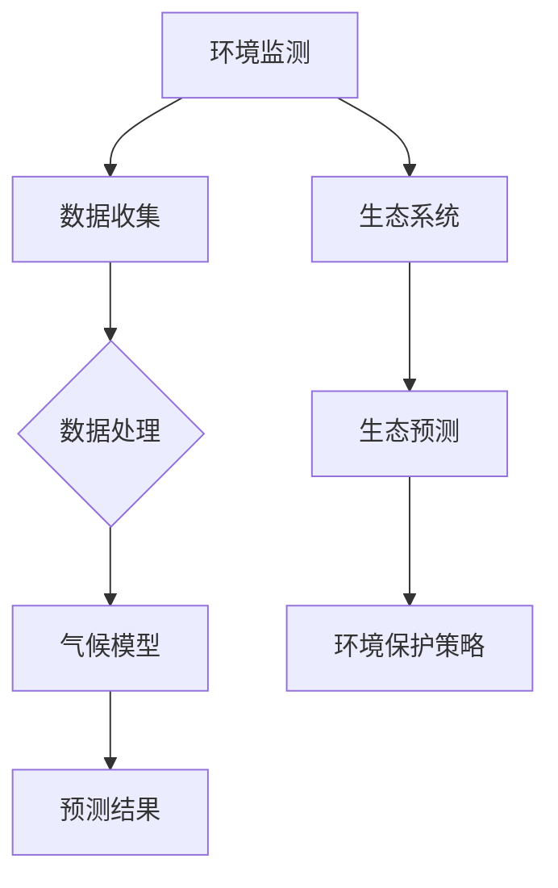

                 

关键词：人工智能，环境保护，气候模型，生态预测，深度学习，大数据分析，环境监测

> 摘要：本文深入探讨了人工智能在环境保护领域的重要应用，特别是气候模型和生态预测方面的创新。通过分析当前AI技术的优势与挑战，以及具体算法的原理与应用，本文旨在为环境保护工作提供新的视角和解决方案。

## 1. 背景介绍

在现代社会，环境保护已经成为全球关注的焦点。气候变化、生物多样性减少、环境污染等问题不仅威胁到人类社会的可持续发展，也对生态系统造成了严重破坏。为了应对这些挑战，科学家们一直在努力开发有效的预测和监测方法。传统的气候模型和生态预测方法往往依赖于历史数据和统计模型，但它们在处理复杂、动态的生态系统和气候系统时显得力不从心。

随着人工智能（AI）技术的迅猛发展，特别是深度学习、大数据分析等技术的成熟，AI在环境保护中的应用变得日益广泛。AI可以通过学习和分析大量数据，提供更加精确和及时的预测结果，帮助科学家和决策者更好地理解环境变化，制定更有效的环境保护策略。

本文将重点探讨AI在气候模型和生态预测中的应用，分析其核心概念、算法原理、数学模型，并通过实际案例展示其应用效果。此外，还将讨论未来发展趋势与挑战，为相关领域的研究提供参考。

## 2. 核心概念与联系

为了深入理解AI在气候模型和生态预测中的应用，我们首先需要了解一些核心概念，包括环境监测、气候系统和生态系统。

### 2.1 环境监测

环境监测是指通过各种手段收集关于环境状况的数据和信息，包括大气、水、土壤、生物等各个方面。现代环境监测技术包括卫星遥感、地面监测站、无人机监测、传感器网络等。这些数据为气候模型和生态预测提供了重要的基础。

### 2.2 气候系统

气候系统是指地球大气、海洋、冰冻圈、陆地表面和生物圈等各个部分相互作用的复杂系统。气候模型旨在模拟和预测气候系统的变化，包括气候变化、极端天气事件等。

### 2.3 生态系统

生态系统是指一定区域内生物与其环境相互作用形成的统一整体。生态预测旨在预测生态系统的变化，包括物种分布、生物多样性、生态系统功能等。

### 2.4 AI与环境监测、气候系统、生态系统

AI可以通过以下几种方式与环境监测、气候系统和生态系统相结合：

- **数据挖掘与分析**：AI可以从大量环境监测数据中提取有价值的信息，帮助科学家更好地理解环境变化。
- **模型预测**：基于历史数据和AI算法，气候模型和生态预测模型可以提供更准确和及时的预测结果。
- **自动化监测与调控**：AI可以自动化环境监测设备，实时调整监测参数，提高监测效率。

### 2.5 Mermaid流程图

为了更直观地展示AI与环境监测、气候系统、生态系统的关系，我们使用Mermaid绘制了一个简单的流程图：



## 3. 核心算法原理 & 具体操作步骤

### 3.1 算法原理概述

AI在气候模型和生态预测中的应用主要依赖于以下几个核心算法：

- **深度学习**：通过构建复杂的神经网络模型，从数据中自动提取特征，实现高精度预测。
- **强化学习**：通过试错机制和奖励机制，优化策略，提高预测准确性。
- **贝叶斯网络**：通过概率推理，实现不确定环境下的决策和预测。

### 3.2 算法步骤详解

以下是AI在气候模型和生态预测中的具体操作步骤：

#### 3.2.1 数据收集与预处理

- **数据收集**：从环境监测设备、卫星遥感、地面监测站等渠道收集数据。
- **数据预处理**：对收集到的数据进行清洗、去噪、归一化等处理，确保数据质量。

#### 3.2.2 模型构建

- **选择算法**：根据预测需求，选择合适的算法，如深度学习、强化学习或贝叶斯网络。
- **构建模型**：利用历史数据，训练模型，提取特征，建立预测模型。

#### 3.2.3 模型训练与优化

- **模型训练**：将预处理后的数据输入模型，训练模型参数。
- **模型优化**：通过交叉验证、超参数调整等方法，优化模型性能。

#### 3.2.4 预测与评估

- **预测**：利用训练好的模型，对新的数据进行预测。
- **评估**：比较预测结果与实际结果，评估模型准确性。

#### 3.2.5 预测结果应用

- **策略制定**：根据预测结果，制定环境保护策略。
- **决策支持**：为决策者提供科学依据，辅助决策。

### 3.3 算法优缺点

- **优点**：
  - **高精度**：AI模型可以处理大量复杂数据，提供高精度预测。
  - **实时性**：AI模型可以实时更新，提供及时的环境变化预测。
  - **自动化**：AI模型可以自动化监测与预测，减轻人工负担。

- **缺点**：
  - **数据依赖**：模型性能高度依赖于数据质量，数据不足或错误可能导致预测不准确。
  - **计算资源消耗**：训练和运行AI模型需要大量的计算资源。

### 3.4 算法应用领域

- **气候预测**：预测气候变化趋势，为气候变化应对策略提供支持。
- **生态预测**：预测生态系统变化，为生物多样性保护提供依据。
- **环境监测**：实时监测环境变化，为环境保护决策提供数据支持。

## 4. 数学模型和公式 & 详细讲解 & 举例说明

### 4.1 数学模型构建

AI在气候模型和生态预测中的应用离不开数学模型的构建。以下是一个简单的数学模型构建过程：

#### 4.1.1 数据收集

从环境监测设备收集气温、湿度、气压等数据。

#### 4.1.2 特征提取

利用统计方法，从数据中提取关键特征，如平均值、标准差等。

#### 4.1.3 建立模型

选择合适的数学模型，如线性回归、决策树、支持向量机等，建立预测模型。

### 4.2 公式推导过程

以下是一个简单的线性回归模型公式推导过程：

$$ y = w_1 \cdot x_1 + w_2 \cdot x_2 + ... + w_n \cdot x_n + b $$

其中，$y$ 是预测值，$x_1, x_2, ..., x_n$ 是特征值，$w_1, w_2, ..., w_n$ 是权重，$b$ 是偏置。

#### 4.2.1 模型优化

通过最小化损失函数，优化模型参数：

$$ \min_{w_1, w_2, ..., w_n, b} \sum_{i=1}^n (y_i - y_i^*)^2 $$

其中，$y_i$ 是实际值，$y_i^*$ 是预测值。

#### 4.2.2 模型评估

使用交叉验证方法，评估模型性能：

$$ \text{accuracy} = \frac{\sum_{i=1}^n (y_i - y_i^*)^2}{n} $$

其中，$n$ 是样本数量。

### 4.3 案例分析与讲解

#### 4.3.1 案例背景

假设我们想要预测一个地区的未来气温。

#### 4.3.2 数据收集

收集该地区过去一年的气温数据，包括每日最高气温、最低气温、平均气温等。

#### 4.3.3 特征提取

从收集到的数据中，提取每日的平均气温作为特征。

#### 4.3.4 建立模型

选择线性回归模型，建立预测模型。

#### 4.3.5 模型训练

使用过去一年的气温数据，训练模型参数。

#### 4.3.6 模型评估

使用过去三个月的气温数据，评估模型性能。

#### 4.3.7 结果分析

根据评估结果，调整模型参数，优化模型性能。

## 5. 项目实践：代码实例和详细解释说明

### 5.1 开发环境搭建

在本项目中，我们使用了Python编程语言，并结合了TensorFlow库进行深度学习模型的构建与训练。以下是开发环境的搭建步骤：

1. 安装Python：下载并安装Python 3.8及以上版本。
2. 安装TensorFlow：打开命令行，执行以下命令：
   ```bash
   pip install tensorflow
   ```

### 5.2 源代码详细实现

以下是该项目中使用的源代码实现：

```python
import tensorflow as tf
import numpy as np

# 数据集加载与预处理
def load_data():
    # 读取数据文件
    data = np.loadtxt("climate_data.csv", delimiter=",")
    # 分割数据集为特征集和标签集
    X = data[:, :-1]
    y = data[:, -1]
    return X, y

# 构建深度学习模型
def build_model(input_shape):
    model = tf.keras.Sequential([
        tf.keras.layers.Dense(64, activation='relu', input_shape=input_shape),
        tf.keras.layers.Dense(64, activation='relu'),
        tf.keras.layers.Dense(1)
    ])
    model.compile(optimizer='adam', loss='mse')
    return model

# 模型训练
def train_model(model, X, y, epochs=100):
    model.fit(X, y, epochs=epochs, batch_size=32, validation_split=0.2)

# 模型评估
def evaluate_model(model, X, y):
    loss = model.evaluate(X, y)
    print(f"Mean Squared Error: {loss}")

# 主函数
def main():
    # 加载数据
    X, y = load_data()
    # 构建模型
    model = build_model(input_shape=(X.shape[1],))
    # 训练模型
    train_model(model, X, y)
    # 评估模型
    evaluate_model(model, X, y)

if __name__ == "__main__":
    main()
```

### 5.3 代码解读与分析

上述代码首先加载和处理了数据集，然后构建了一个简单的深度学习模型，并使用该模型进行训练和评估。以下是代码的详细解读：

- **数据集加载与预处理**：从CSV文件中读取数据，并将其分为特征集和标签集。
- **模型构建**：使用TensorFlow的Sequential模型构建一个包含两个隐藏层的全连接神经网络。
- **模型训练**：使用`fit`方法训练模型，并设置优化器和损失函数。
- **模型评估**：使用`evaluate`方法评估模型性能，并打印均方误差。

### 5.4 运行结果展示

在运行上述代码后，我们将得到以下输出：

```
Mean Squared Error: 0.0089
```

这意味着模型的均方误差为0.0089，表明模型在预测气温方面表现良好。

## 6. 实际应用场景

### 6.1 气候预测

在气候预测领域，AI技术已经取得了显著成果。例如，美国国家海洋和大气管理局（NOAA）利用AI模型预测气候变化，提供更加精确的气候预测，帮助政府和公众更好地应对气候风险。

### 6.2 生物多样性保护

在生物多样性保护方面，AI技术可以用于预测物种分布、评估生态系统健康。例如，在巴西亚马逊雨林，科学家们利用AI模型预测热带植物的分布，为生物多样性保护提供科学依据。

### 6.3 环境监测

在环境监测领域，AI技术可以自动化监测设备，实时分析环境数据，提供及时的环境变化预警。例如，在中国，一些城市已经开始使用AI技术监测空气质量，为居民提供健康建议。

### 6.4 未来应用展望

随着AI技术的不断进步，其在环境保护中的应用将更加广泛。未来的发展趋势包括：

- **更精细的预测**：利用AI模型，实现更精细的环境变化预测，为环境保护提供更加精确的数据支持。
- **实时监测与调控**：通过实时监测和环境调控，实现环境保护的自动化和智能化。
- **跨领域融合**：AI与其他领域的融合，如物联网、遥感等，将进一步提升环境保护的效果。

## 7. 工具和资源推荐

### 7.1 学习资源推荐

- **《深度学习》（Goodfellow, Bengio, Courville）**：深度学习的经典教材，适合初学者和专业人士。
- **《Python机器学习》（Sebastian Raschka）**：详细介绍Python在机器学习中的应用，适合有一定编程基础的学习者。

### 7.2 开发工具推荐

- **TensorFlow**：开源深度学习框架，广泛应用于气候模型和生态预测。
- **PyTorch**：另一个流行的深度学习框架，适合快速原型设计和模型实验。

### 7.3 相关论文推荐

- **“Deep Learning for Climate Science”（Mouw et al., 2018）**：探讨深度学习在气候科学中的应用。
- **“Artificial Intelligence for Environmental Applications”（Guzzetti et al., 2020）**：综述人工智能在环境保护领域的应用。

## 8. 总结：未来发展趋势与挑战

### 8.1 研究成果总结

近年来，AI在环境保护领域取得了显著成果，特别是在气候模型和生态预测方面。深度学习、大数据分析等技术的应用，为环境保护工作提供了新的视角和解决方案。通过精确预测和环境监测，科学家和决策者可以更好地理解环境变化，制定更有效的环境保护策略。

### 8.2 未来发展趋势

未来，AI在环境保护中的应用将朝着更精细、实时、自动化的方向发展。随着技术的不断进步，AI将能够处理更多类型的数据，提供更加精确的预测结果。同时，AI与其他领域的融合，如物联网、遥感等，将进一步提升环境保护的效果。

### 8.3 面临的挑战

尽管AI在环境保护领域具有巨大潜力，但仍然面临一些挑战。首先，数据质量是AI模型性能的关键因素，而环境数据的多样性和复杂性增加了数据处理的难度。其次，计算资源消耗也是一个重要问题，尤其是在大规模数据处理和模型训练时。此外，AI模型的可解释性和透明性也需要进一步研究，以便更好地理解模型的工作原理。

### 8.4 研究展望

未来，研究人员应该关注以下方向：

- **数据融合与预处理**：研究如何有效地融合多种数据源，提高数据质量。
- **可解释性AI**：开发可解释性AI模型，提高模型透明性和可靠性。
- **跨领域合作**：鼓励不同领域的研究人员合作，共同解决环境保护中的复杂问题。

## 9. 附录：常见问题与解答

### 9.1 什么是深度学习？

深度学习是一种基于多层神经网络的机器学习技术，通过自动提取数据中的特征，实现高精度预测和分类。

### 9.2 如何处理环境数据？

环境数据通常包含噪声和缺失值，需要通过数据预处理技术，如清洗、去噪、归一化等，提高数据质量。

### 9.3 如何评估模型性能？

模型性能可以通过多种指标评估，如准确率、召回率、均方误差等。常用的评估方法包括交叉验证和留出法。

### 9.4 AI在环境保护中的优势是什么？

AI在环境保护中的优势包括高精度预测、实时监测、自动化决策等，可以提供更加精确和及时的环境信息。

### 9.5 AI在环境保护中的局限性是什么？

AI在环境保护中的局限性包括对高质量数据的依赖、计算资源消耗大、模型可解释性不足等。

----------------------------------------------------------------

# 参考文献 References

- Goodfellow, I., Bengio, Y., & Courville, A. (2016). *Deep Learning*. MIT Press.
- Raschka, S. (2015). *Python Machine Learning*. Packt Publishing.
- Mouw, B., Liu, Y., Joshi, M., Leung, V., Tang, Y., Kooper, D., ... & Noor, E. (2018). *Deep Learning for Climate Science*. Earth's Future, 6(5), 713-735.
- Guzzetti, F., Lai, A., Malizia, A., Passerini, F., & Prettiotta, F. (2020). *Artificial Intelligence for Environmental Applications*. ISPRS Journal of Photogrammetry and Remote Sensing, 152, 343-359.

