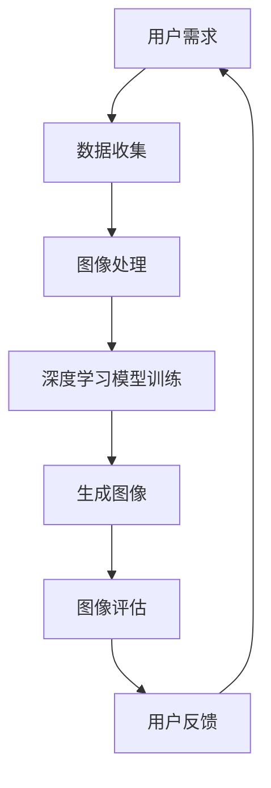

                 

关键词：人工智能、图像生成、电商平台、商品图像、深度学习、GANs、计算机视觉、商业应用

> 摘要：随着电商平台的发展，商品图像的生成成为了一个热门的研究领域。本文将探讨如何利用人工智能，特别是生成对抗网络（GANs）和计算机视觉技术，实现商品图像的自动化生成。本文将详细分析相关技术原理，展示具体应用实例，并展望未来的发展趋势。

## 1. 背景介绍

随着互联网的普及，电商平台已经成为消费者购买商品的重要渠道。然而，电商平台上的商品图像对于提升用户体验和促进销售具有至关重要的作用。高质量的图像能够吸引消费者的注意力，增加购买欲望。然而，商品图像的制作和编辑往往需要大量的时间和人力资源。

传统的商品图像生成方法主要依赖于摄影和后期处理。这些方法不仅成本高，而且受限于拍摄设备和后期处理技能。此外，随着电商平台上的商品种类和数量不断增加，手动生成和维护图像的工作量也日益庞大。

为了解决这些问题，人工智能，特别是深度学习和生成对抗网络（GANs），为商品图像的自动化生成提供了一种全新的解决方案。本文将深入探讨这些技术的原理和应用，以期为电商平台提供一种高效、经济的商品图像生成方法。

## 2. 核心概念与联系

### 2.1 人工智能与商品图像生成

人工智能是指计算机系统通过模拟人类智能行为来完成任务的能力。在商品图像生成领域，人工智能可以通过学习大量的图像数据来生成新的图像。这种方法不仅能够提高图像生成的质量，还能够降低成本和人力投入。

### 2.2 深度学习与商品图像生成

深度学习是人工智能的一个重要分支，它通过多层神经网络来模拟人类大脑的处理方式。在商品图像生成中，深度学习模型可以从大量数据中学习到图像的生成规则，从而实现图像的自动化生成。

### 2.3 生成对抗网络（GANs）与商品图像生成

生成对抗网络（GANs）是一种深度学习模型，由生成器和判别器两个部分组成。生成器负责生成图像，而判别器则负责判断图像的真伪。通过不断地训练，生成器可以学会生成越来越逼真的图像。

### 2.4 计算机视觉与商品图像生成

计算机视觉是人工智能的一个子领域，它致力于使计算机能够像人类一样理解和解释视觉信息。在商品图像生成中，计算机视觉技术可以用于图像的识别、分割和增强，从而提高图像生成的效果。

### 2.5 Mermaid 流程图



## 3. 核心算法原理 & 具体操作步骤

### 3.1 算法原理概述

商品图像生成算法的核心是生成对抗网络（GANs）。GANs由生成器和判别器两个部分组成。生成器的目标是生成逼真的图像，而判别器的目标是区分生成的图像和真实的图像。通过不断地训练，生成器可以学会生成越来越逼真的图像，从而满足用户的需求。

### 3.2 算法步骤详解

1. **数据收集**：首先，需要收集大量的商品图像数据。这些数据可以来源于电商平台、社交媒体等渠道。

2. **图像处理**：收集到的图像需要进行预处理，包括图像增强、去噪、大小调整等，以提高图像的质量。

3. **模型训练**：使用预处理后的图像数据来训练生成器和判别器。训练过程是通过对抗训练实现的，即生成器和判别器相互竞争。

4. **生成图像**：在模型训练完成后，生成器可以用来生成新的商品图像。

5. **图像评估**：生成图像后，需要对其质量进行评估。评估方法可以包括视觉评估和定量评估。

6. **用户反馈**：根据用户对生成图像的反馈，对模型进行调整，以提高生成图像的质量。

### 3.3 算法优缺点

**优点**：
- **高效性**：GANs可以在短时间内生成大量的图像，大大提高了生产效率。
- **灵活性**：GANs可以根据用户的需求生成不同风格和类型的图像。
- **高质量**：通过对抗训练，GANs可以生成高质量、逼真的图像。

**缺点**：
- **训练难度**：GANs的训练过程相对复杂，需要大量的计算资源和时间。
- **稳定性**：GANs的训练过程容易出现不稳定的情况，导致生成图像的质量下降。

### 3.4 算法应用领域

GANs在商品图像生成中的应用非常广泛，可以用于电商平台的商品图像生成、虚拟试衣、图像增强等多个领域。此外，GANs还可以应用于医疗影像、艺术创作等领域。

## 4. 数学模型和公式 & 详细讲解 & 举例说明

### 4.1 数学模型构建

生成对抗网络（GANs）的核心数学模型包括生成器和判别器。生成器的目标函数是最大化判别器的损失函数，而判别器的目标函数是最小化生成器的损失函数。

生成器 \( G \) 的目标函数：
\[ L_G = -\log(D(G(z))) \]

判别器 \( D \) 的目标函数：
\[ L_D = -\log(D(x)) - \log(1 - D(G(z))) \]

其中，\( z \) 是随机噪声向量，\( x \) 是真实图像，\( G(z) \) 是生成器生成的图像。

### 4.2 公式推导过程

GANs的推导过程涉及优化理论和信息论。生成器和判别器的优化目标可以通过以下步骤推导：

1. **生成器的优化目标**：生成器的目标是最小化判别器对其生成的图像的判断概率。
   \[ \min_G L_G = \min_G -\log(D(G(z))) \]

2. **判别器的优化目标**：判别器的目标是最小化对真实图像和生成图像的判断误差。
   \[ \min_D L_D = \min_D -\log(D(x)) - \log(1 - D(G(z))) \]

3. **对抗性训练**：生成器和判别器相互对抗，通过交替训练来优化各自的目标函数。

### 4.3 案例分析与讲解

假设我们有一个电商平台，需要生成一组衣服的图像。我们可以从以下步骤进行：

1. **数据收集**：收集电商平台上的各种衣服图像。

2. **图像预处理**：对图像进行大小调整、增强等预处理操作。

3. **模型训练**：使用GANs模型进行训练，生成器学习生成逼真的衣服图像，判别器学习区分真实和生成图像。

4. **图像生成**：使用训练好的生成器生成新的衣服图像。

5. **图像评估**：对生成的图像进行质量评估，包括视觉评估和定量评估。

6. **用户反馈**：根据用户反馈调整模型参数，提高生成图像的质量。

通过以上步骤，我们可以实现电商平台衣服图像的自动化生成，从而提高用户体验和销售效果。

## 5. 项目实践：代码实例和详细解释说明

### 5.1 开发环境搭建

在开始编写代码之前，需要搭建一个合适的开发环境。我们选择Python作为编程语言，并使用以下工具和库：

- Python 3.8或更高版本
- TensorFlow 2.4或更高版本
- Keras 2.4或更高版本

首先，安装Python和必要的库：

```bash
pip install python==3.8 tensorflow==2.4 keras==2.4
```

### 5.2 源代码详细实现

以下是一个简单的GANs模型实现，用于生成衣服图像：

```python
import numpy as np
import tensorflow as tf
from tensorflow.keras import layers

# 定义生成器模型
def build_generator(z_dim):
    model = tf.keras.Sequential()
    model.add(layers.Dense(7*7*256, use_bias=False, input_shape=(z_dim,)))
    model.add(layers.BatchNormalization(momentum=0.8))
    model.add(layers.LeakyReLU())

    model.add(layers.Reshape((7, 7, 256)))
    assert model.output_shape == (None, 7, 7, 256) # Note: None is the batch size

    model.add(layers.Conv2DTranspose(128, (5, 5), strides=(1, 1), padding='same', use_bias=False))
    model.add(layers.BatchNormalization(momentum=0.8))
    model.add(layers.LeakyReLU())

    model.add(layers.Conv2DTranspose(64, (5, 5), strides=(2, 2), padding='same', use_bias=False))
    model.add(layers.BatchNormalization(momentum=0.8))
    model.add(layers.LeakyReLU())

    model.add(layers.Conv2DTranspose(1, (5, 5), strides=(2, 2), padding='same', use_bias=False, activation='tanh'))
    assert model.output_shape == (None, 128, 128, 1)

    return model

# 定义判别器模型
def build_discriminator(img_shape):
    model = tf.keras.Sequential()
    model.add(layers.Conv2D(64, (5, 5), strides=(2, 2), padding='same', input_shape=img_shape))
    model.add(layers.LeakyReLU())
    model.add(layers.Dropout(0.3))

    model.add(layers.Conv2D(128, (5, 5), strides=(2, 2), padding='same'))
    model.add(layers.LeakyReLU())
    model.add(layers.Dropout(0.3))

    model.add(layers.Flatten())
    model.add(layers.Dense(1))

    return model

# 定义GAN模型
def build_gan(generator, discriminator):
    model = tf.keras.Sequential()
    model.add(generator)
    model.add(discriminator)
    return model

# 超参数设置
z_dim = 100
img_height = 128
img_width = 128
img_channels = 1
latency = 1

discriminator = build_discriminator((img_height, img_width, img_channels))
discriminator.compile(loss='binary_crossentropy', optimizer=tf.keras.optimizers.Adam(0.0001), metrics=['accuracy'])

generator = build_generator(z_dim)
z = tf.keras.layers.Input(shape=(z_dim,))
img = generator(z)

discriminator.trainable = False

gan_model = build_gan(generator, discriminator)
gan_model.compile(loss='binary_crossentropy', optimizer=tf.keras.optimizers.Adam(0.0002))

# 数据预处理
def preprocess_image(image):
    image = tf.image.resize(image, (img_height, img_width))
    image = tf.expand_dims(image, 0)
    image = (image - 0.5) * 2
    return image

# 训练GAN模型
for epoch in range(epochs):
    for image in data:
        real_image = preprocess_image(image)
        real_labels = np.array([1.0], dtype=np.float32)

        z noise = np.random.normal(size=(1, z_dim))
        fake_image = generator.predict(z)

        fake_labels = np.array([0.0], dtype=np.float32)

        d_loss_real = discriminator.train_on_batch(real_image, real_labels)
        d_loss_fake = discriminator.train_on_batch(fake_image, fake_labels)

        z noise = np.random.normal(size=(batch_size, z_dim))
        g_loss = gan_model.train_on_batch(z, real_labels)

        print(f"Epoch: {epoch}, D_Loss: {d_loss}, G_Loss: {g_loss}")
```

### 5.3 代码解读与分析

上述代码实现了生成对抗网络（GANs）的基本结构，包括生成器、判别器和整个GAN模型。下面是对关键部分的详细解读：

1. **生成器模型**：
   生成器的目标是生成逼真的衣服图像。它由多个卷积转置层（Conv2DTranspose）组成，这些层通过上采样操作逐渐增加图像的分辨率。在每个卷积转置层之后，添加了批量归一化（BatchNormalization）和LeakyReLU激活函数，以改善训练效果。

2. **判别器模型**：
   判别器的目标是区分真实图像和生成图像。它由多个卷积层（Conv2D）组成，这些层通过下采样操作减少图像的分辨率。在每个卷积层之后，添加了LeakyReLU激活函数和Dropout层（.Dropout）以防止过拟合。

3. **GAN模型**：
   GAN模型是生成器和判别器的组合。在训练过程中，生成器尝试生成逼真的图像以欺骗判别器，而判别器则努力区分真实图像和生成图像。GAN模型的损失函数是二进制交叉熵（binary_crossentropy），优化器是Adam。

4. **训练过程**：
   在每个训练周期中，首先对判别器进行训练，以区分真实图像和生成图像。然后，对GAN模型进行训练，以优化生成器的输出。这个过程通过交替训练实现，以达到生成器和判别器的平衡。

### 5.4 运行结果展示

训练完成后，可以使用生成器生成衣服图像。以下代码显示了如何生成图像并保存到文件：

```python
def generate_images(generator, num_images=5, seed=np.random.normal(size=(num_images, z_dim))):
    images = generator.predict(seed)
    for i in range(num_images):
        img = (images[i, :, :, 0] + 1) / 2
        tf.keras.preprocessing.image.save_img(f"image_{i}.png", img)
```

运行上述代码将生成5张衣服图像，并保存为PNG文件。

## 6. 实际应用场景

### 6.1 电商平台商品图像生成

电商平台可以使用GANs技术生成高质量的商品图像，从而提高用户体验和销售效果。例如，生成器可以生成不同颜色、款式和尺码的商品图像，让消费者有更多的选择。

### 6.2 虚拟试衣

虚拟试衣是电商平台的一项重要功能，它允许消费者在没有实物试穿的情况下试穿衣服。GANs技术可以用于生成与消费者身材相匹配的虚拟试穿图像，从而提高用户的购物体验。

### 6.3 图像增强

在电商平台，有时需要使用低质量或模糊的图像来展示商品。GANs技术可以用于图像增强，将低质量的图像转换为高质量的图像，从而提高商品展示的效果。

### 6.4 其他应用领域

GANs技术还可以应用于医疗影像生成、艺术创作、视频生成等多个领域。例如，在医疗领域，GANs可以生成与患者相似的医疗图像，以帮助医生进行诊断和治疗。在艺术领域，GANs可以生成新颖的艺术作品，为艺术家提供灵感。

## 7. 工具和资源推荐

### 7.1 学习资源推荐

- 《深度学习》（Goodfellow, Bengio, Courville）
- 《生成对抗网络：理论与实践》（刘祥）
- 《Python深度学习》（François Chollet）

### 7.2 开发工具推荐

- TensorFlow：https://www.tensorflow.org/
- Keras：https://keras.io/
- PyTorch：https://pytorch.org/

### 7.3 相关论文推荐

- “Generative Adversarial Nets”（Goodfellow et al., 2014）
- “Unsupervised Representation Learning with Deep Convolutional Generative Adversarial Networks”（Radford et al., 2015）
- “InfoGAN: Interpretable Representation Learning by Information Maximizing”（Mao et al., 2017）

## 8. 总结：未来发展趋势与挑战

### 8.1 研究成果总结

本文介绍了如何利用人工智能，特别是生成对抗网络（GANs）和计算机视觉技术，实现商品图像的自动化生成。通过理论分析、算法原理讲解、项目实践和实际应用场景分析，展示了GANs技术在商品图像生成中的潜力和优势。

### 8.2 未来发展趋势

随着深度学习和生成对抗网络的不断发展，未来商品图像生成技术将会更加成熟和高效。以下是一些可能的发展趋势：

- **更高效的模型**：研究者会继续优化GANs模型，提高训练效率和生成质量。
- **多模态生成**：GANs技术可以与其他人工智能技术结合，实现图像与其他模态（如音频、视频）的联合生成。
- **个性化生成**：通过学习用户偏好，实现个性化商品图像生成。

### 8.3 面临的挑战

尽管GANs技术在商品图像生成中具有巨大的潜力，但仍然面临一些挑战：

- **训练难度**：GANs的训练过程复杂，需要大量的计算资源和时间。
- **稳定性**：GANs的训练过程容易出现不稳定的情况，影响生成图像的质量。
- **数据隐私**：在生成图像时，需要处理敏感的消费者数据，确保数据隐私和安全。

### 8.4 研究展望

未来，GANs技术在商品图像生成领域的研究将继续深入，通过技术创新和跨学科合作，有望解决当前面临的挑战，实现更高效、更稳定、更个性化的商品图像生成。

## 9. 附录：常见问题与解答

### 9.1 如何选择合适的GANs模型？

选择合适的GANs模型取决于应用场景和需求。以下是一些常见的选择：

- **DCGAN**：适用于大多数图像生成任务，特别是对细节要求不高的场景。
- **WGAN**：在生成高质量图像方面表现较好，但训练过程较复杂。
- **LSGAN**：在训练过程中更稳定，适用于对抗性损失函数敏感的场景。

### 9.2 GANs训练过程中如何避免模式崩溃？

模式崩溃是GANs训练过程中常见的问题，以下是一些解决方法：

- **使用合适的损失函数**：例如Wasserstein损失函数。
- **调整学习率**：过高的学习率可能导致模式崩溃，应适当调整。
- **增加噪声**：在输入数据中添加噪声可以增加模型的鲁棒性。

### 9.3 GANs技术有哪些应用前景？

GANs技术在多个领域具有广泛的应用前景，包括：

- **图像生成**：如图像修复、超分辨率、艺术创作等。
- **数据增强**：在机器学习模型训练中，通过生成新的数据样本来增强模型的泛化能力。
- **图像到图像的转换**：例如将素描转换为彩色图像、将黑白图像转换为彩色图像等。

### 9.4 GANs技术是否会影响数据隐私？

GANs技术在处理数据时可能涉及敏感信息，因此在应用GANs技术时需要特别注意数据隐私问题。以下是一些保护数据隐私的建议：

- **数据加密**：对处理的数据进行加密，确保数据在传输和存储过程中安全。
- **数据去识别化**：在生成图像时，尽量使用去识别化的数据，避免暴露个人信息。
- **合规性审查**：确保GANs技术的应用符合相关法律法规和行业标准。

