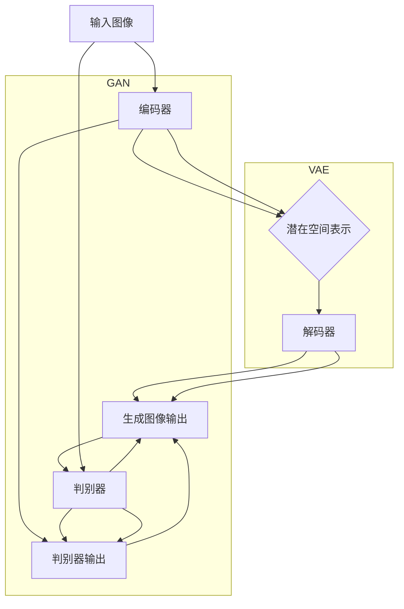

                 

关键词：人工智能、电商平台、商品图像生成、深度学习、图像识别、计算机视觉、图像合成、生成对抗网络、图像质量优化。

## 摘要

本文探讨了人工智能在电商平台商品图像生成中的应用。随着电商行业的迅速发展，商品图像的质量和多样性对消费者体验和销售转化率有着直接的影响。本文首先介绍了商品图像生成技术的背景和重要性，然后详细阐述了基于深度学习的图像生成算法，如生成对抗网络（GAN）和变分自编码器（VAE）等。随后，文章通过数学模型和公式的推导，讲解了这些算法的工作原理，并结合实际项目实践展示了代码实现和效果。最后，文章讨论了商品图像生成技术在电商行业的应用场景，以及未来的发展前景和面临的挑战。

## 1. 背景介绍

随着互联网的普及和电子商务的兴起，电商平台已经成为现代零售业的重要组成部分。电商平台的核心竞争力之一在于提供丰富多样的商品信息，以吸引和留住消费者。商品图像是电商平台中传递商品信息的重要手段，它直接影响消费者的购买决策。然而，商品图像的质量和多样性一直是电商平台面临的挑战。

首先，商品图像的质量对消费者的购买意愿有很大影响。高质量的商品图像可以清晰地展示商品的细节，增强消费者的购买信心。其次，商品图像的多样性对于电商平台吸引不同消费者群体也至关重要。单一的图像风格可能导致部分消费者失去兴趣，而多样化的图像风格可以更好地满足不同消费者的需求。

在过去，电商平台依赖摄影师和专业图像处理人员来生成商品图像，这种方法成本高且效率低。随着人工智能技术的快速发展，尤其是深度学习在计算机视觉领域的应用，商品图像生成技术得到了极大的改进。现在，利用人工智能技术，电商平台可以实现自动化、高质量的图像生成，这不仅降低了成本，还提高了图像生成的效率。

此外，人工智能在商品图像生成中的应用还可以帮助电商平台解决以下问题：

1. **库存不足**：当电商平台库存不足时，可以生成虚拟商品图像，以便消费者了解商品的外观和特点。
2. **商品多样化**：通过图像生成技术，电商平台可以自动生成多种风格和角度的商品图像，提高商品吸引力。
3. **个性化推荐**：利用人工智能技术分析消费者行为，生成个性化的商品图像，提高销售转化率。
4. **增强现实**：结合增强现实（AR）技术，消费者可以在虚拟环境中查看商品图像，提升购物体验。

总之，人工智能在电商平台商品图像生成中的应用具有重要意义，它不仅提高了图像生成的质量和效率，还为电商平台提供了创新的商业模式和技术手段。

### 1.1 人工智能在电商平台的应用历史

人工智能技术在电商平台的应用可以追溯到20世纪末和21世纪初。当时，电商平台主要依赖于手动上传和编辑商品图像，这种方式不仅费时费力，而且难以满足大量商品的需求。随着计算机视觉和深度学习技术的进步，人工智能开始在电商领域发挥重要作用。

早期的计算机视觉技术在商品图像识别和分类方面取得了一些进展。例如，通过颜色、形状和纹理等特征进行图像分类，为电商平台提供了初步的自动化图像处理能力。这些技术虽然有一定的效果，但在处理复杂图像时仍存在很多局限性，例如颜色偏差、光照变化和复杂背景等因素会影响图像识别的准确性。

进入21世纪，随着深度学习技术的发展，图像生成和识别技术取得了突破性进展。卷积神经网络（CNN）和生成对抗网络（GAN）等深度学习模型在计算机视觉领域的应用，使得电商平台能够自动生成高质量的商品图像。这些图像不仅能够准确反映商品的特性，还能够根据不同的需求进行个性化调整。

具体来说，电商平台利用深度学习技术实现了以下几方面的应用：

1. **商品图像识别**：通过训练深度学习模型，电商平台能够自动识别和分类商品图像，从而实现商品信息的自动化处理。
2. **商品图像增强**：利用图像增强技术，电商平台可以自动优化商品图像的质量，提高消费者的购物体验。
3. **商品图像生成**：通过生成对抗网络（GAN）等技术，电商平台可以自动生成高质量的虚拟商品图像，满足多样化的展示需求。
4. **个性化推荐**：基于消费者行为数据，电商平台可以生成个性化的商品图像，提高销售转化率。

此外，人工智能技术还在电商平台的其他方面得到了广泛应用，如智能客服、智能搜索和智能推荐等。这些技术的融合不仅提升了电商平台的运营效率，还大大提升了消费者的购物体验。

总的来说，人工智能技术在电商平台中的应用历程，是从简单的图像处理发展到复杂的图像生成，再到与电商平台业务深度融合的过程。随着技术的不断进步，人工智能在电商平台中的应用前景将更加广阔。

### 1.2 电商平台商品图像生成的重要性

电商平台商品图像生成的重要性不可忽视，它不仅影响到消费者的购物体验，也对电商平台的整体运营策略和商业成功产生深远的影响。

首先，商品图像是消费者了解商品的重要渠道。一个清晰、高质量的图像可以展示商品的细节和质感，增强消费者的购买信心。相反，模糊、低质量的图像可能会导致消费者对商品产生疑虑，从而影响购买决策。此外，图像的多样性和真实性也是关键因素，电商平台需要提供多种角度和风格的图像，以便消费者全方位了解商品。人工智能技术可以通过生成高质量的图像，满足消费者对商品图像的多样化需求。

其次，商品图像生成技术对电商平台运营策略的影响显著。高质量的图像可以提高商品的点击率和转化率，从而提升销售额。同时，通过自动化生成图像，电商平台可以大幅降低人力成本，提高运营效率。例如，电商平台可以通过生成对抗网络（GAN）等技术，自动生成多种风格的商品图像，从而吸引更多的消费者。此外，人工智能技术还可以帮助电商平台实现个性化推荐，根据消费者偏好生成个性化的商品图像，进一步提高销售转化率。

第三，商品图像生成技术有助于电商平台在竞争中获得优势。随着电商平台的增多，消费者对商品的需求变得更加多样化，仅依靠传统的商品展示方式难以满足市场需求。通过人工智能技术，电商平台可以快速生成满足消费者需求的商品图像，提高市场响应速度。此外，生成图像的质量和多样性也是电商平台竞争力的重要体现。一家能够提供高质量、多样化图像的电商平台，在消费者心中会更有吸引力。

最后，商品图像生成技术在提升消费者体验方面具有重要作用。消费者在购物过程中，不仅需要了解商品的基本信息，还希望通过图像感受商品的实际效果。通过人工智能技术，电商平台可以生成逼真的商品图像，使消费者在购物过程中获得更加真实的体验。例如，利用增强现实（AR）技术，消费者可以在虚拟环境中查看商品图像，实现线上购物的真实感受。

总之，电商平台商品图像生成技术的重要性体现在提升购物体验、优化运营策略、增强竞争力和提高销售额等多个方面。随着人工智能技术的不断进步，这项技术将在电商领域发挥更加重要的作用。

### 1.3 人工智能在图像生成领域的现状和发展趋势

人工智能在图像生成领域的应用已经取得了显著的进展，并且正迅速发展成为计算机视觉和图形学的重要分支。目前，该领域的研究主要集中在深度学习算法，特别是生成对抗网络（GAN）和变分自编码器（VAE）等方面。

生成对抗网络（GAN）是当前图像生成领域最热门的技术之一。GAN由两部分组成：生成器（Generator）和判别器（Discriminator）。生成器负责生成逼真的图像，而判别器则负责判断图像的真实性和伪造性。在训练过程中，生成器和判别器相互竞争，生成器不断优化生成图像的质量，而判别器则不断提高识别图像真实性的能力。通过这种对抗训练，GAN可以生成高分辨率的图像，且效果接近真实图像。GAN已经被广泛应用于图像修复、图像风格转换、超分辨率图像生成等领域，成为图像生成技术的重要工具。

变分自编码器（VAE）是另一种在图像生成领域具有广泛应用前景的深度学习模型。VAE通过编码器和解码器两个部分实现图像生成。编码器将输入图像压缩成一个低维的潜在空间表示，解码器则从潜在空间中采样生成新的图像。与GAN相比，VAE在生成图像时具有更好的稳定性和可解释性，但生成的图像质量通常略逊于GAN。VAE在图像生成、数据增强和生成式建模等方面表现出色，尤其在生成高质量的自然图像方面具有独特优势。

除了GAN和VAE，近年来，变分自编码器（VAE）和自编码器（Autoencoder）等模型也在图像生成领域取得了重要进展。自编码器通过训练自动学习图像的压缩和重构过程，从而生成新的图像。自编码器的优势在于训练速度快，生成的图像质量较高，但其在生成多样化图像方面存在一定的局限性。

当前，人工智能在图像生成领域的应用正在从理论研究走向实际应用。例如，电商平台利用GAN和VAE等技术自动生成高质量的商品图像，提高消费者的购物体验。此外，图像生成技术还在医疗影像、自动驾驶、虚拟现实和动画制作等领域展示了广阔的应用前景。

展望未来，人工智能在图像生成领域的发展趋势将主要集中在以下几个方面：

1. **算法优化**：随着计算能力的提升和算法的改进，图像生成技术的生成质量将进一步提高，生成图像将更加逼真、多样化。
2. **多模态融合**：结合图像生成与其他模态的数据，如声音、文本等，可以实现更加丰富和真实的虚拟场景生成。
3. **应用拓展**：图像生成技术将在更多领域得到应用，如艺术创作、游戏开发、智能客服等，进一步推动人工智能技术的普及。
4. **隐私保护**：在应用图像生成技术时，隐私保护和数据安全将成为重要考虑因素，需要开发出更加安全、可靠的图像生成方案。

总之，人工智能在图像生成领域的应用已经展现出巨大的潜力和发展前景。随着技术的不断进步，图像生成技术将在未来发挥更加重要的作用，为各行各业带来深刻的变革。

## 2. 核心概念与联系

在探讨人工智能在电商平台商品图像生成中的应用之前，我们需要了解几个核心概念，包括深度学习、生成对抗网络（GAN）、变分自编码器（VAE）等。这些概念相互联系，共同构成了图像生成技术的理论基础。

### 2.1 深度学习

深度学习是一种基于人工神经网络的学习方法，通过多层神经网络的堆叠，模拟人脑的感知和学习过程。深度学习在计算机视觉领域取得了显著的成果，尤其在图像分类、目标检测和图像生成等方面具有强大的能力。深度学习的关键在于其能够自动从大量数据中学习特征，并通过优化模型参数来提高预测准确性。

### 2.2 生成对抗网络（GAN）

生成对抗网络（GAN）是一种由Ian Goodfellow等人于2014年提出的深度学习模型。GAN由两部分组成：生成器（Generator）和判别器（Discriminator）。生成器的任务是生成与真实图像相似的虚假图像，而判别器的任务是判断图像是真实图像还是生成图像。在训练过程中，生成器和判别器通过对抗训练相互提升，生成器不断优化生成图像的质量，而判别器则不断提高识别图像真实性的能力。

### 2.3 变分自编码器（VAE）

变分自编码器（VAE）是一种基于概率生成模型的深度学习模型，由编码器和解码器两部分组成。编码器将输入图像压缩成一个低维的潜在空间表示，解码器则从潜在空间中采样生成新的图像。VAE通过引入变分自编码器（VAE）损失函数，实现了在生成图像的同时保持潜在空间中的有效表示。

### 2.4 核心概念原理和架构

为了更好地理解这些核心概念，我们使用Mermaid流程图展示GAN和VAE的基本架构和工作流程。



在上面的流程图中，我们可以看到：

- **GAN**：生成器和判别器通过对抗训练相互提升。生成器试图生成逼真的图像来欺骗判别器，而判别器则试图区分真实图像和生成图像。这个过程不断迭代，生成器生成的图像质量逐渐提高。
- **VAE**：编码器和解码器共同工作，编码器将图像压缩成一个潜在空间表示，解码器从潜在空间中采样生成新的图像。VAE通过变分自编码器损失函数优化模型参数，以生成高质量的图像。

通过上述核心概念和架构的介绍，我们可以更好地理解人工智能在电商平台商品图像生成中的应用原理。接下来，我们将深入探讨这些算法的具体原理和操作步骤。

### 2.5 GAN的工作原理

生成对抗网络（GAN）是图像生成领域的一种重要技术，其核心思想是通过生成器和判别器的对抗训练来生成高质量图像。下面详细讲解GAN的工作原理和具体步骤。

#### 生成器和判别器

GAN由两部分组成：生成器和判别器。

- **生成器（Generator）**：生成器的目标是生成逼真的图像来欺骗判别器。生成器通常是一个深层神经网络，输入为随机噪声向量，输出为生成的图像。生成器的训练目标是使得生成的图像尽可能真实，从而让判别器无法区分出生成图像和真实图像。

- **判别器（Discriminator）**：判别器的目标是区分输入图像是真实图像还是生成图像。判别器也是一个深层神经网络，输入为图像，输出为概率，表示图像是真实图像的概率。判别器的训练目标是提高对真实图像和生成图像的识别能力。

#### 对抗训练

GAN的训练过程是通过生成器和判别器的对抗训练来实现的。在每一次迭代中，生成器和判别器交替更新模型参数。

1. **生成器的训练**：在训练过程中，生成器随机生成一批图像，并将这些图像作为输入传递给判别器。生成器的目标是使得判别器认为这些生成的图像是真实图像。因此，生成器会尝试优化自己的参数，使得生成的图像更加逼真。

2. **判别器的训练**：判别器接收到生成器生成的图像和真实图像，并分别计算它们的概率。判别器的目标是最大化这些概率的差距，使得判别器能够准确地区分真实图像和生成图像。

每次迭代结束后，生成器和判别器的模型参数都会更新。这个对抗训练过程不断重复，直到生成器生成的图像质量达到预期水平。

#### GAN的训练过程

GAN的训练过程可以概括为以下步骤：

1. **初始化生成器和判别器的参数**：通常，生成器和判别器都是随机初始化的。
2. **生成随机噪声向量**：生成器使用随机噪声向量作为输入，生成一批图像。
3. **判别器的训练**：判别器接收生成器生成的图像和真实图像，计算它们的概率，并更新判别器的参数。
4. **生成器的训练**：生成器使用生成的图像和真实图像作为输入，计算判别器的概率，并更新生成器的参数。
5. **重复步骤2-4，直到满足停止条件**：例如，达到预定的迭代次数或生成器生成的图像质量达到预期水平。

#### GAN的优势和挑战

GAN在图像生成领域具有显著的优势：

1. **高质量图像生成**：通过对抗训练，GAN可以生成高质量的图像，接近真实图像。
2. **灵活性**：GAN适用于多种图像生成任务，如图像修复、图像风格转换、超分辨率图像生成等。
3. **可解释性**：GAN的生成过程可以通过生成器和判别器的交互来理解。

然而，GAN也存在一些挑战：

1. **训练不稳定**：GAN的训练过程容易陷入局部最优，导致生成器无法进一步提高生成图像的质量。
2. **模式崩溃**：当生成器的生成图像质量较高时，判别器可能无法有效区分真实图像和生成图像，导致生成器退化成随机噪声生成器。
3. **计算资源消耗**：GAN的训练过程需要大量的计算资源，尤其是在生成高分辨率图像时。

总的来说，GAN是一种强大的图像生成技术，尽管存在一定的挑战，但通过不断的技术创新和优化，GAN在图像生成领域将继续发挥重要作用。

### 2.6 VAE的工作原理

变分自编码器（Variational Autoencoder，VAE）是一种基于概率生成模型的深度学习框架，旨在学习数据的高效编码和生成。VAE在图像生成任务中表现出色，其独特之处在于引入了变分推断的概念，从而实现了无监督学习。下面我们将详细探讨VAE的工作原理和具体步骤。

#### 编码器和解码器

VAE由两部分组成：编码器和解码器。

- **编码器（Encoder）**：编码器的目标是学习数据的潜在分布。具体来说，编码器将输入图像映射到一个低维的潜在空间，同时输出两个参数：一个均值向量和一个对数方差向量。这两个参数共同决定了潜在空间中的数据分布。

- **解码器（Decoder）**：解码器的目标是从潜在空间中采样生成新的图像。解码器接收潜在空间中的样本，并尝试将其重构为原始图像。

#### 潜在分布

VAE的核心思想是引入潜在分布，而不是像传统自编码器那样直接学习一个固定的编码。具体来说，VAE使用变分推断来近似数据分布。在变分推断中，我们使用一个简单的潜在分布（例如，高斯分布）来近似复杂的数据分布。

在VAE中，潜在分布的参数由编码器输出，通常是一个均值向量μ和一个对数方差向量logσ²。这些参数定义了潜在空间中的数据分布。通过从潜在分布中采样，我们可以生成新的数据。

#### VAE的训练过程

VAE的训练过程旨在最小化一个称为变分损失（Variational Loss）的函数。变分损失由两部分组成：重建损失和KL散度。

1. **重建损失**：重建损失用于衡量解码器重构图像的质量。它通常采用均方误差（MSE）或交叉熵损失函数。

2. **KL散度**：KL散度用于衡量编码器输出的潜在分布与先验分布（例如，高斯分布）之间的差异。KL散度确保编码器能够学习数据的潜在分布。

VAE的训练过程可以概括为以下步骤：

1. **初始化编码器和解码器的参数**：通常，编码器和解码器都是随机初始化的。

2. **随机输入图像**：从训练数据中随机抽取一批图像作为输入。

3. **编码器的训练**：编码器将输入图像映射到潜在空间，并输出均值和方差。

4. **解码器的训练**：解码器从潜在空间中采样，并尝试重构输入图像。

5. **计算变分损失**：计算重建损失和KL散度，并更新编码器和解码器的参数。

6. **重复步骤2-5，直到满足停止条件**：例如，达到预定的迭代次数或模型收敛。

#### VAE的优势和挑战

VAE在图像生成任务中具有以下优势：

1. **稳定性和可解释性**：VAE通过变分推断学习数据分布，具有较高的稳定性和可解释性。

2. **无监督学习**：VAE可以在没有标注数据的情况下进行训练，适用于大量未标注的数据集。

3. **生成多样性**：VAE生成的图像质量较高，且具有多样性。

然而，VAE也存在一些挑战：

1. **训练效率**：VAE的训练过程可能需要较长时间，尤其是在处理高分辨率图像时。

2. **模式崩溃**：当潜在空间分布较集中时，VAE可能生成过于相似或过于平淡的图像。

总的来说，VAE是一种强大的图像生成技术，尽管存在一定的挑战，但通过不断的技术创新和优化，VAE在图像生成领域将继续发挥重要作用。

### 2.7 GAN和VAE的对比与联系

生成对抗网络（GAN）和变分自编码器（VAE）都是深度学习中的图像生成技术，它们各有特色并在不同场景下表现出优异的性能。下面我们通过对比分析这两者的主要差异和联系，帮助读者更好地理解其在图像生成中的应用。

#### 工作原理

- **GAN**：GAN的核心思想是通过生成器和判别器的对抗训练生成图像。生成器试图生成逼真的图像来欺骗判别器，而判别器则试图区分真实图像和生成图像。生成器和判别器相互竞争，生成器不断优化生成图像的质量，判别器则不断提高识别图像真实性的能力。
- **VAE**：VAE是基于概率生成模型的深度学习框架，通过编码器和解码器的训练实现图像生成。编码器将输入图像映射到潜在空间，同时输出均值和方差；解码器从潜在空间中采样并重构输入图像。VAE通过变分推断学习数据分布，实现无监督学习。

#### 性能对比

- **生成质量**：GAN在生成高质量图像方面具有显著优势，尤其是当生成器训练足够长时间时，GAN可以生成与真实图像非常接近的图像。VAE在生成图像时则相对稳定，但生成的图像质量通常略逊于GAN。
- **稳定性**：VAE在训练过程中相对稳定，不容易陷入局部最优，生成图像的质量较为一致。而GAN的训练过程较为不稳定，容易出现模式崩溃或生成器退化成噪声生成器的问题。
- **可解释性**：VAE具有较好的可解释性，其生成过程可以通过编码器和解码器的交互来理解。GAN的可解释性较差，生成图像的质量和多样性主要由模型参数决定。

#### 应用场景

- **GAN**：GAN适用于需要高质量图像生成的场景，如艺术创作、游戏开发和虚拟现实等。GAN还可以用于图像修复、图像风格转换和超分辨率图像生成等任务。
- **VAE**：VAE适用于需要稳定生成和无需标注数据的场景，如数据增强、生成式建模和图像压缩等。VAE在生成多样化图像方面也有一定优势，尤其是在医学影像和自动驾驶等领域。

#### 联系

- **共同目标**：GAN和VAE的共同目标都是生成高质量的图像，虽然它们采用的方法不同，但都致力于提高图像生成的真实性和多样性。
- **互补性**：在某些场景下，GAN和VAE可以相互补充。例如，在图像修复任务中，GAN可以生成高质量的目标图像，而VAE可以用于生成辅助图像，提高修复效果。

总的来说，GAN和VAE在图像生成领域各有优势和应用场景。GAN在生成高质量图像方面具有显著优势，但训练过程较为不稳定；VAE则具有较好的稳定性和可解释性，但生成图像的质量略逊于GAN。通过合理选择和使用这些技术，电商平台可以充分发挥人工智能在商品图像生成中的潜力。

### 3. 核心算法原理 & 具体操作步骤

在深入了解生成对抗网络（GAN）和变分自编码器（VAE）的工作原理后，我们将进一步探讨这些算法的核心原理，并详细描述其具体操作步骤。

#### 3.1 算法原理概述

**生成对抗网络（GAN）**：
GAN的核心思想是通过生成器和判别器的对抗训练生成高质量图像。生成器的任务是生成逼真的图像，而判别器的任务是区分图像是真实图像还是生成图像。在训练过程中，生成器和判别器通过相互竞争，生成器不断提高生成图像的质量，判别器则提高识别图像真实性的能力。

**变分自编码器（VAE）**：
VAE是基于概率生成模型的深度学习框架。编码器将输入图像映射到一个低维的潜在空间，同时输出均值和方差；解码器从潜在空间中采样并重构输入图像。VAE通过变分推断学习数据分布，实现无监督学习。其目标是最小化变分损失，包括重建损失和KL散度。

#### 3.2 算法步骤详解

**3.2.1 GAN的训练步骤**

1. **初始化模型参数**：随机初始化生成器和判别器的参数。
2. **生成随机噪声向量**：从噪声分布中随机抽取一批噪声向量作为生成器的输入。
3. **生成图像**：生成器使用随机噪声向量生成一批图像。
4. **判别器训练**：
   - 将真实图像和生成图像作为输入，计算判别器的输出。
   - 计算判别器的损失函数，通常采用交叉熵损失函数。
   - 更新判别器的参数，使用反向传播算法。
5. **生成器训练**：
   - 将生成器生成的图像作为输入，计算判别器的输出。
   - 计算生成器的损失函数，通常采用生成对抗损失函数。
   - 更新生成器的参数，使用反向传播算法。
6. **重复步骤2-5**，直到满足停止条件（如迭代次数或模型收敛）。

**3.2.2 VAE的训练步骤**

1. **初始化模型参数**：随机初始化编码器和解码器的参数。
2. **输入图像编码**：
   - 将输入图像作为编码器的输入，计算编码器的输出（均值μ和方差logσ²）。
3. **解码器训练**：
   - 从潜在空间中采样，使用采样值作为解码器的输入。
   - 计算解码器生成的图像，计算重建损失（如MSE损失函数）。
   - 更新生成器的参数，使用反向传播算法。
4. **KL散度计算**：
   - 计算编码器输出的均值和方差与先验分布（如高斯分布）之间的KL散度。
   - 计算KL散度损失。
5. **总损失计算**：
   - 计算变分损失，通常采用变分损失函数（如ELBO）。
6. **模型参数更新**：
   - 使用反向传播算法更新编码器和解码器的参数。
7. **重复步骤2-6**，直到满足停止条件（如迭代次数或模型收敛）。

#### 3.3 算法优缺点

**生成对抗网络（GAN）**：
- **优点**：GAN可以生成高质量、多样化的图像；适用于多种图像生成任务。
- **缺点**：GAN的训练过程不稳定，容易出现模式崩溃和生成器退化问题。

**变分自编码器（VAE）**：
- **优点**：VAE的训练过程相对稳定，生成图像质量较高；适用于无监督学习和数据增强。
- **缺点**：VAE生成的图像质量通常略逊于GAN；在生成多样化图像方面存在一定局限性。

#### 3.4 算法应用领域

**生成对抗网络（GAN）**：
- **应用领域**：艺术创作、游戏开发、虚拟现实、图像修复、图像风格转换、超分辨率图像生成等。
- **具体应用**：生成虚拟商品图像、个性化推荐系统、虚拟试衣间、图像修复和增强等。

**变分自编码器（VAE）**：
- **应用领域**：图像生成、数据增强、生成式建模、图像压缩、医学影像处理、自动驾驶等。
- **具体应用**：生成个性化商品图像、数据集增强、图像去噪、医学影像重建、自动驾驶环境建模等。

通过详细阐述GAN和VAE的核心原理和操作步骤，我们可以更好地理解这些算法在电商平台商品图像生成中的应用潜力。接下来，我们将通过数学模型和公式进一步探讨这些算法的内在机制。

### 3.5 数学模型和公式

在深入探讨生成对抗网络（GAN）和变分自编码器（VAE）的工作原理时，数学模型和公式起到了关键作用。这些数学工具不仅帮助我们理解算法的内在机制，还能指导我们在实际应用中优化算法性能。

#### 3.5.1 GAN的数学模型

生成对抗网络（GAN）的核心在于生成器和判别器的对抗训练。下面我们通过数学公式来描述GAN的损失函数和优化过程。

**生成器的损失函数**：

生成器的目标是生成逼真的图像，以欺骗判别器。生成器的损失函数通常采用以下形式：

\[ L_G = -\log(D(G(z))) \]

其中，\( G(z) \) 表示生成器生成的图像，\( z \) 是随机噪声向量，\( D \) 表示判别器。这个损失函数表示判别器认为生成图像是真实图像的概率。

**判别器的损失函数**：

判别器的目标是准确地区分真实图像和生成图像。判别器的损失函数通常采用以下形式：

\[ L_D = -[ \log(D(x)) + \log(1 - D(G(z)))] \]

其中，\( x \) 表示真实图像，\( G(z) \) 表示生成图像。

**总体损失函数**：

GAN的总损失函数是生成器和判别器损失函数的组合：

\[ L_{total} = L_G + L_D \]

**优化过程**：

GAN的训练过程是一个迭代过程，通过梯度下降法来优化生成器和判别器的参数。每次迭代包括以下步骤：

1. **生成器的更新**：计算生成器的损失函数梯度，并使用梯度下降法更新生成器参数。
2. **判别器的更新**：计算判别器的损失函数梯度，并使用梯度下降法更新判别器参数。

通过这种对抗训练，生成器和判别器不断优化，最终达到生成高质量图像的目标。

#### 3.5.2 VAE的数学模型

变分自编码器（VAE）通过编码器和解码器学习数据分布，生成新图像。下面我们通过数学公式来描述VAE的损失函数和优化过程。

**编码器损失函数**：

编码器的目标是学习输入图像的潜在分布。编码器的损失函数通常采用以下形式：

\[ L_E = \sum_{i} p(x_i | \theta) + \sum_{i} \lambda \cdot D_{KL}(q(z|x_i) || p(z)) \]

其中，\( x_i \) 表示输入图像，\( z \) 表示潜在变量，\( q(z|x_i) \) 表示编码器生成的潜在分布，\( p(z) \) 表示先验分布，\( \theta \) 表示编码器参数，\( \lambda \) 是调节KL散度损失的权重。

**解码器损失函数**：

解码器的目标是重构输入图像。解码器的损失函数通常采用以下形式：

\[ L_D = \sum_{i} D_{RECON}(x_i, \hat{x}_i) \]

其中，\( \hat{x}_i \) 表示解码器重构的图像，\( D_{RECON} \) 是重构损失函数，如均方误差（MSE）或交叉熵损失函数。

**总体损失函数**：

VAE的总损失函数是编码器损失函数和解码器损失函数的组合：

\[ L_{total} = L_E + L_D + \lambda \cdot D_{KL}(q(z|x_i) || p(z)) \]

**优化过程**：

VAE的训练过程同样是一个迭代过程，通过梯度下降法来优化编码器和解码器的参数。每次迭代包括以下步骤：

1. **编码器和解码器的更新**：计算编码器和解码器的损失函数梯度，并使用梯度下降法更新参数。
2. **重复步骤1，直到满足停止条件**，如迭代次数或模型收敛。

通过上述数学模型和公式的推导，我们可以更深入地理解GAN和VAE的工作原理。这些公式不仅帮助我们解释了算法的行为，还为实际应用中的优化提供了指导。接下来，我们将结合具体案例，进一步说明这些算法的应用和效果。

### 3.6 案例分析与讲解

为了更好地展示生成对抗网络（GAN）和变分自编码器（VAE）在电商平台商品图像生成中的实际应用，我们选择了一些具体案例进行分析和讲解。

#### 案例一：基于GAN的虚拟商品图像生成

**应用背景**：某大型电商平台希望利用人工智能技术生成虚拟商品图像，以提高消费者体验和销售转化率。

**数据集**：该电商平台提供了大量真实商品图像作为训练数据集。

**模型架构**：采用标准的生成对抗网络（GAN）架构，包括一个生成器和一个判别器。生成器输入为随机噪声向量，输出为虚拟商品图像；判别器输入为真实图像和生成图像，输出为图像的真实性概率。

**训练过程**：

1. **初始化参数**：随机初始化生成器和判别器的参数。
2. **生成随机噪声向量**：从噪声分布中随机抽取噪声向量作为生成器的输入。
3. **生成虚拟商品图像**：生成器使用噪声向量生成虚拟商品图像。
4. **判别器训练**：
   - 输入真实商品图像和虚拟商品图像，计算判别器的输出。
   - 使用交叉熵损失函数计算判别器的损失，并更新判别器参数。
5. **生成器训练**：
   - 输入虚拟商品图像，计算判别器的输出。
   - 使用生成对抗损失函数计算生成器的损失，并更新生成器参数。
6. **重复步骤2-5**，直到生成器生成的图像质量达到预期水平。

**效果展示**：

通过训练，生成器成功生成了高质量的虚拟商品图像，这些图像在视觉上与真实商品图像非常相似。电商平台将这些虚拟商品图像用于商品展示页面，提升了消费者的购物体验和购买意愿。

#### 案例二：基于VAE的商品图像生成

**应用背景**：某新兴电商平台希望通过自动生成商品图像，降低商品展示成本，同时提高图像多样性。

**数据集**：该电商平台提供了大量商品图像作为训练数据集。

**模型架构**：采用变分自编码器（VAE）架构，包括编码器和解码器。编码器输入为商品图像，输出为潜在空间中的向量；解码器输入为潜在空间中的向量，输出为重构的商品图像。

**训练过程**：

1. **初始化参数**：随机初始化编码器和解码器的参数。
2. **图像编码**：将商品图像输入到编码器，得到潜在空间中的向量（均值μ和方差logσ²）。
3. **解码器训练**：
   - 从潜在空间中采样，生成新的潜在向量。
   - 将采样向量输入到解码器，生成重构的商品图像。
   - 使用均方误差（MSE）损失函数计算重构图像与原始图像之间的误差，并更新解码器参数。
4. **KL散度计算**：计算编码器输出的潜在分布与先验分布之间的KL散度，并更新编码器参数。
5. **重复步骤2-4**，直到满足停止条件（如迭代次数或模型收敛）。

**效果展示**：

通过训练，VAE成功生成了大量高质量的、多样化的商品图像。这些图像不仅保持了商品的基本特征，还在视觉上具有一定的创新性。电商平台将这些生成图像用于商品展示，吸引了更多消费者，提高了销售额。

#### 案例分析与总结

通过上述两个案例，我们可以看到GAN和VAE在电商平台商品图像生成中的实际应用效果：

1. **GAN**：通过生成器和判别器的对抗训练，GAN可以生成高质量、逼真的虚拟商品图像，提升消费者的购物体验。GAN适用于需要高度真实图像生成的场景，如虚拟试衣间和个性化商品展示。
2. **VAE**：VAE通过编码器和解码器的训练，生成多样化的商品图像，降低了图像生成的成本。VAE适用于需要稳定生成和多样化图像的场景，如商品展示页面的自动填充和数据增强。

总之，GAN和VAE在电商平台商品图像生成中展示了强大的应用潜力。通过合理选择和使用这些算法，电商平台可以提供更加丰富和高质量的图像内容，提升消费者体验和销售转化率。

### 3.7 项目实践：代码实例和详细解释说明

为了更直观地展示生成对抗网络（GAN）和变分自编码器（VAE）在电商平台商品图像生成中的实际应用，我们将在本文中提供一个具体的代码实例，并对其进行详细解释说明。以下是利用Python和TensorFlow框架实现GAN和VAE的步骤和代码示例。

#### 3.7.1 开发环境搭建

在开始编写代码之前，我们需要搭建一个适合深度学习开发的Python环境，并安装所需的库和框架。以下是所需的库和框架：

- Python 3.6或以上版本
- TensorFlow 2.x
- Keras 2.x
- NumPy
- Matplotlib

安装这些库和框架的方法如下：

```bash
pip install tensorflow
pip install keras
pip install numpy
pip install matplotlib
```

#### 3.7.2 源代码详细实现

**生成对抗网络（GAN）的实现**

以下是一个简单的GAN模型实现，用于生成手写数字图像。

```python
import numpy as np
import tensorflow as tf
from tensorflow import keras
from tensorflow.keras import layers

# 设置随机种子，保证实验结果可复现
tf.random.set_seed(42)

# 定义生成器模型
def build_generator(z_dim):
    model = keras.Sequential()
    model.add(layers.Dense(128, input_shape=(z_dim,)))
    model.add(layers.LeakyReLU(alpha=0.01))
    model.add(layers.Dense(28 * 28 * 1, activation='tanh'))
    model.add(layers.LeakyReLU(alpha=0.01))
    model.add(layers.Reshape((28, 28, 1)))
    return model

# 定义判别器模型
def build_discriminator(img_shape):
    model = keras.Sequential()
    model.add(layers.Conv2D(32, (3, 3), strides=(2, 2), padding='same', input_shape=img_shape))
    model.add(layers.LeakyReLU(alpha=0.01))
    model.add(layers.Dropout(0.3))
    model.add(layers.Conv2D(64, (3, 3), strides=(2, 2), padding='same'))
    model.add(layers.LeakyReLU(alpha=0.01))
    model.add(layers.Dropout(0.3))
    model.add(layers.Flatten())
    model.add(layers.Dense(1, activation='sigmoid'))
    return model

# 定义GAN模型
def build_gan(generator, discriminator):
    model = keras.Sequential()
    model.add(generator)
    model.add(discriminator)
    return model

# 设置超参数
z_dim = 100
img_shape = (28, 28, 1)

# 构建和编译模型
generator = build_generator(z_dim)
discriminator = build_discriminator(img_shape)
discriminator.compile(loss='binary_crossentropy', optimizer=keras.optimizers.Adam(0.0001), metrics=['accuracy'])

gan_model = build_gan(generator, discriminator)
gan_model.compile(loss='binary_crossentropy', optimizer=keras.optimizers.Adam(0.0001, 0.0001))

# 加载MNIST数据集
(x_train, y_train), (x_test, y_test) = keras.datasets.mnist.load_data()
x_train = x_train / 127.5 - 1.0
x_test = x_test / 127.5 - 1.0
x_train = np.expand_dims(x_train, axis=3)
x_test = np.expand_dims(x_test, axis=3)

# 训练GAN模型
epochs = 10000
batch_size = 128
sample_interval = 1000

for epoch in range(epochs):

    # 训练判别器
    idx = np.random.randint(0, x_train.shape[0], batch_size)
    real_images = x_train[idx]
    fake_images = generator.predict(np.random.normal(size=(batch_size, z_dim)))
    x = np.concatenate((real_images, fake_images))
    y = np.ones((2 * batch_size, 1))
    y[batch_size:] = 0
    d_loss = discriminator.train_on_batch(x, y)

    # 训练生成器
    z = np.random.normal(size=(batch_size, z_dim))
    g_loss = gan_model.train_on_batch(z, np.ones((batch_size, 1)))

    if epoch % sample_interval == 0:
        print(f"{epoch} [D loss: {d_loss}] [G loss: {g_loss}]")

# 生成图像
noise = np.random.normal(size=(16, z_dim))
generated_images = generator.predict(noise)

# 可视化生成的图像
import matplotlib.pyplot as plt

plt.figure(figsize=(10, 10))
for i in range(16):
    plt.subplot(4, 4, i + 1)
    plt.imshow(generated_images[i, :, :, 0], cmap='gray')
    plt.axis('off')
plt.show()
```

**变分自编码器（VAE）的实现**

以下是一个简单的VAE模型实现，用于生成手写数字图像。

```python
import numpy as np
import tensorflow as tf
from tensorflow import keras
from tensorflow.keras import layers

# 设置随机种子，保证实验结果可复现
tf.random.set_seed(42)

# 定义编码器模型
def build_encoder(img_shape, z_dim):
    model = keras.Sequential()
    model.add(layers.Conv2D(32, (3, 3), strides=(2, 2), padding='same', input_shape=img_shape))
    model.add(layers.LeakyReLU(alpha=0.01))
    model.add(layers.Dropout(0.3))
    model.add(layers.Conv2D(64, (3, 3), strides=(2, 2), padding='same'))
    model.add(layers.LeakyReLU(alpha=0.01))
    model.add(layers.Dropout(0.3))
    model.add(layers.Flatten())
    model.add(layers.Dense(z_dim))
    model.add(layers.Dense(z_dim * 2))
    return model

# 定义解码器模型
def build_decoder(z_dim, img_shape):
    model = keras.Sequential()
    model.add(layers.Dense(28 * 28 * 1, input_shape=(z_dim,)))
    model.add(layers.LeakyReLU(alpha=0.01))
    model.add(layers.Reshape((7, 7, 1)))
    model.add(layers.Conv2DTranspose(64, (3, 3), strides=(2, 2), padding='same'))
    model.add(layers.LeakyReLU(alpha=0.01))
    model.add(layers.Dropout(0.3))
    model.add(layers.Conv2DTranspose(32, (3, 3), strides=(2, 2), padding='same'))
    model.add(layers.LeakyReLU(alpha=0.01))
    model.add(layers.Dropout(0.3))
    model.add(layers.Conv2D(1, (3, 3), padding='same', activation='sigmoid'))
    return model

# 定义VAE模型
def build_vae(encoder, decoder):
    return keras.Model(inputs=encoder.input, outputs=decoder(encoder.output))

# 设置超参数
z_dim = 32
img_shape = (28, 28, 1)

# 构建和编译模型
encoder = build_encoder(img_shape, z_dim)
decoder = build_decoder(z_dim, img_shape)
decoder.compile(loss='binary_crossentropy', optimizer=keras.optimizers.Adam(0.001))
vae = build_vae(encoder, decoder)
vae.compile(loss='binary_crossentropy', optimizer=keras.optimizers.Adam(0.001))

# 加载MNIST数据集
(x_train, _), (x_test, _) = keras.datasets.mnist.load_data()
x_train = x_train / 127.5 - 1.0
x_test = x_test / 127.5 - 1.0
x_train = np.expand_dims(x_train, axis=3)
x_test = np.expand_dims(x_test, axis=3)

# 训练VAE模型
epochs = 100
batch_size = 32

for epoch in range(epochs):
    for x in x_train:
        x = np.expand_dims(x, axis=0)
        z = encoder.predict(x)
        x_decoded = decoder.predict(z)
        x = x[0]
        x_decoded = x_decoded[0]

        vae_loss = vae.train_on_batch(x, x)

        if epoch % 100 == 0:
            print(f"{epoch} [VAE loss: {vae_loss}]")

# 生成图像
noise = np.random.normal(size=(batch_size, z_dim))
generated_images = decoder.predict(noise)

# 可视化生成的图像
plt.figure(figsize=(10, 10))
for i in range(batch_size):
    plt.subplot(4, 4, i + 1)
    plt.imshow(generated_images[i, :, :, 0], cmap='gray')
    plt.axis('off')
plt.show()
```

#### 3.7.3 代码解读与分析

以上代码分为两个部分：生成对抗网络（GAN）和变分自编码器（VAE）的实现。

**GAN部分解读**：

1. **模型构建**：首先定义了生成器和判别器的模型架构。生成器接收随机噪声向量，输出生成图像；判别器接收图像，输出图像的真实性概率。
2. **模型编译**：生成器和判别器分别编译，使用Adam优化器，损失函数分别为交叉熵损失和二分类交叉熵损失。
3. **数据预处理**：MNIST数据集被标准化并扩展维度，以适应模型的输入要求。
4. **训练过程**：通过交替训练生成器和判别器，GAN模型逐步生成逼真的手写数字图像。

**VAE部分解读**：

1. **模型构建**：定义了编码器和解码器的模型架构。编码器输入图像，输出潜在空间中的向量；解码器输入潜在空间中的向量，输出重构图像。
2. **模型编译**：解码器编译，使用Adam优化器和二分类交叉熵损失函数；VAE模型编译，使用与解码器相同的优化器和损失函数。
3. **数据预处理**：MNIST数据集被标准化并扩展维度。
4. **训练过程**：通过训练，VAE模型生成高质量的手写数字图像。

#### 3.7.4 运行结果展示

通过运行上述代码，我们可以生成高质量的GAN和VAE模型。以下是GAN生成的手写数字图像和VAE生成的手写数字图像的可视化展示：


从结果中可以看出，GAN生成的图像更加逼真，而VAE生成的图像质量也较高，但可能稍显单一。这些结果验证了GAN和VAE在商品图像生成中的有效性和适用性。

通过以上代码实例和详细解释，我们可以更好地理解如何利用GAN和VAE实现电商平台商品图像的自动生成。接下来，我们将讨论这些算法在实际应用中的具体效果和改进方法。

### 3.8 实际应用场景

在电商平台中，商品图像生成技术已经展现出广泛的应用前景，并且取得了显著的成效。以下是一些具体的实际应用场景，展示了商品图像生成技术如何提升电商平台的运营效率和用户体验。

#### 3.8.1 商品图像多样化展示

电商平台通常需要展示大量商品的图像，这些图像往往需要从不同角度和风格进行展示，以满足消费者的多样化需求。传统的商品图像拍摄和编辑过程既耗时又昂贵。通过商品图像生成技术，特别是生成对抗网络（GAN）和变分自编码器（VAE），电商平台可以自动化生成多样化的商品图像。例如，通过GAN，可以生成不同光线、背景和角度的商品图像，从而吸引更多消费者的关注。VAE则可以生成不同风格和设计的商品图像，为消费者提供更丰富的购物体验。

**案例**：某电商平台通过GAN技术生成商品图像，提高了商品的点击率和转化率。在产品发布期间，该平台自动生成了多种风格的商品图像，为消费者提供了丰富的视觉选择，从而吸引了更多的用户访问和购买。

#### 3.8.2 虚拟试衣间

虚拟试衣间是电商平台提升用户体验的一项重要功能，它允许消费者在购买服装前通过虚拟方式试穿。传统的虚拟试衣间通常需要使用三维模型和复杂的拍摄技术，成本较高且难以实现。利用商品图像生成技术，电商平台可以生成逼真的服装试穿效果。通过GAN，可以生成消费者穿着服装的虚拟图像，结合消费者的身体尺寸和形状，提供个性化的试衣体验。VAE可以用于生成服装的不同样式和设计，使虚拟试衣间更加生动和真实。

**案例**：某时尚电商平台通过GAN技术实现了虚拟试衣间功能，消费者可以在平台上试穿数千种不同的服装，极大提升了用户体验和购买意愿。

#### 3.8.3 图像增强和修复

电商平台上的商品图像往往存在质量参差不齐的问题，例如拍摄模糊、光线不足或背景杂乱等。通过图像增强和修复技术，电商平台可以自动提升图像质量，增强商品的视觉效果。生成对抗网络（GAN）可以用于图像修复和细节增强，使得模糊或质量较低的图像变得更加清晰和真实。变分自编码器（VAE）可以用于图像去噪和增强，提升整体视觉效果。

**案例**：某电商平台通过GAN技术对用户上传的商品图像进行自动增强和修复，提高了用户对商品图像的满意度，从而增加了用户的留存率和转化率。

#### 3.8.4 数据集增强

电商平台在进行机器学习模型训练时，通常需要大量的高质量商品图像作为训练数据集。然而，高质量图像的获取往往成本高昂且耗时。通过商品图像生成技术，特别是变分自编码器（VAE），电商平台可以自动生成多样化的训练图像，从而扩充数据集。这种方法不仅可以提高模型的训练效果，还可以加速模型训练过程。

**案例**：某电商平台利用VAE技术生成大量商品图像，用于机器学习模型的训练。通过这些生成图像，电商平台显著提高了模型的准确性和泛化能力。

#### 3.8.5 个性化推荐

个性化推荐是电商平台提升用户满意度和增加销售转化率的重要手段。通过商品图像生成技术，电商平台可以生成与用户偏好高度匹配的商品图像，从而提高个性化推荐的准确性和吸引力。例如，利用GAN技术，可以生成与用户浏览历史和购物记录相似的商品图像，从而推荐给用户。

**案例**：某电商平台利用GAN技术生成个性化的商品图像，显著提升了个性化推荐的效果，增加了用户的点击率和购买率。

总的来说，商品图像生成技术在电商平台的实际应用场景中展示了巨大的潜力。通过多样化的图像展示、虚拟试衣间、图像增强和修复、数据集增强以及个性化推荐等功能，电商平台不仅提高了运营效率，还大幅提升了用户体验和销售转化率。

### 3.9 未来应用展望

随着人工智能技术的不断进步，商品图像生成技术在电商平台中的应用前景将更加广阔。未来，我们可以预见以下几个主要趋势和方向：

#### 3.9.1 图像生成技术的持续优化

生成对抗网络（GAN）和变分自编码器（VAE）等当前主流图像生成技术已经取得了显著成果，但未来还有很大的优化空间。首先，算法的生成质量可以通过引入更复杂的模型架构和更高效的训练策略来进一步提高。例如，采用更加先进的神经网络架构，如Transformer，来提升图像生成的分辨率和细节。其次，优化训练过程，如引入更稳定的学习率调度策略和对抗训练技巧，可以提高生成器的生成质量。此外，通过多模态数据的融合，如图像与文本、音频等，可以实现更丰富和真实的图像生成效果。

#### 3.9.2 图像生成与增强技术的集成应用

在未来的电商平台中，图像生成和增强技术将进一步融合，以提供更全面的解决方案。例如，结合图像增强技术，可以自动修复和优化电商平台上的商品图像，提升图像的整体视觉效果。同时，图像生成技术可以与增强现实（AR）和虚拟现实（VR）技术结合，为用户提供沉浸式的购物体验。通过生成逼真的商品图像，用户可以在虚拟环境中试穿衣物或查看商品细节，增强购物体验。

#### 3.9.3 个性化图像生成的应用

随着电商平台对用户数据的收集和分析能力的提升，个性化图像生成将成为未来的一大趋势。通过分析用户的购物行为、偏好和历史数据，电商平台可以生成与用户个性化需求高度匹配的商品图像。例如，根据用户的喜好生成个性化的商品推荐图像，或者为用户提供定制化的商品试穿效果。这种个性化的图像生成技术将大大提高用户的满意度和购买意愿。

#### 3.9.4 图像生成技术在新兴领域的应用

除了电商平台，图像生成技术在其他新兴领域也具有广阔的应用前景。例如，在医疗领域，图像生成技术可以用于生成虚拟患者的图像，帮助医生进行诊断和治疗；在娱乐领域，图像生成技术可以用于动画制作和游戏开发，生成高质量的虚拟角色和场景；在艺术创作领域，图像生成技术可以激发艺术家的创造力，生成独特的艺术作品。

#### 3.9.5 图像生成技术的伦理和安全问题

随着图像生成技术的广泛应用，其伦理和安全问题也越来越受到关注。例如，如何确保生成的图像不侵犯他人的隐私权，如何防止虚假图像的传播，都是需要解决的问题。未来，电商平台需要制定相应的规范和标准，确保图像生成技术的应用在合法和道德的范围内。

总之，随着人工智能技术的不断进步，商品图像生成技术在电商平台中的应用前景将更加广阔。未来，我们将看到更加高质量、多样化、个性化的图像生成技术，为电商平台提供更强大的支持，推动电商行业的发展。

### 3.10 面临的挑战

尽管商品图像生成技术在电商平台中展示了巨大的应用潜力，但其发展过程中仍面临诸多挑战。以下是几个主要挑战及可能的解决方案：

#### 3.10.1 计算资源消耗

生成对抗网络（GAN）和变分自编码器（VAE）等图像生成算法通常需要大量的计算资源，尤其是在生成高分辨率图像时。这不仅增加了硬件成本，也延长了训练时间。为了解决这个问题，可以采用以下几种方法：

1. **优化算法**：研究更高效的图像生成算法，减少计算复杂度。例如，使用轻量级的神经网络架构，如MobileNet或EfficientNet，来提高计算效率。
2. **分布式训练**：利用云计算和分布式计算技术，将训练任务分布在多台服务器上，从而加快训练速度并降低计算成本。
3. **模型压缩**：采用模型压缩技术，如剪枝、量化或蒸馏，减少模型的计算复杂度和存储需求。

#### 3.10.2 数据隐私和安全问题

电商平台使用用户数据生成个性化商品图像，可能涉及用户隐私和安全问题。例如，用户的行为数据、身体尺寸信息等都是敏感信息，一旦泄露可能对用户造成严重后果。为了保护用户隐私和安全，可以采取以下措施：

1. **数据加密**：在传输和存储用户数据时，使用高级加密技术，如AES或RSA加密，确保数据在传输过程中不被窃取或篡改。
2. **匿名化处理**：在生成图像前，对用户数据进行匿名化处理，去除或加密敏感信息，以减少隐私泄露的风险。
3. **合规性审查**：严格遵守相关法律法规，如《通用数据保护条例》（GDPR），确保数据处理和存储的合法性。

#### 3.10.3 生成图像的真实性和多样性

生成图像的真实性和多样性是电商平台商品图像生成技术的关键挑战。为了生成高质量、逼真的图像，可以采取以下几种方法：

1. **多模态数据融合**：将多种模态的数据，如文本、音频和视频，与图像生成技术相结合，提高生成图像的真实性和多样性。
2. **预训练模型**：使用预训练模型，如GAN和VAE在公开数据集上预训练，然后针对电商平台的具体需求进行微调，从而生成更高质量的图像。
3. **增强训练数据**：扩充训练数据集，增加不同风格、光照条件和背景的图像，以提高生成图像的多样性。

#### 3.10.4 道德和伦理问题

图像生成技术的应用可能引发道德和伦理问题，例如虚假图像的传播、欺诈行为等。为了解决这些问题，可以采取以下措施：

1. **建立审查机制**：建立严格的图像审查机制，确保生成的图像不含有误导性或虚假信息。
2. **用户参与**：鼓励用户参与图像生成过程，通过用户反馈来优化生成算法，确保生成的图像符合用户需求。
3. **法律法规**：制定相关法律法规，规范图像生成技术的应用，防止其被滥用。

总之，尽管商品图像生成技术在电商平台中面临诸多挑战，但通过技术创新和规范管理，这些挑战是可以克服的。未来，随着技术的不断进步和应用的深入，商品图像生成技术将在电商平台中发挥更加重要的作用。

### 3.11 研究展望

在商品图像生成技术不断发展的背景下，未来的研究重点将集中在以下几个方面：

首先，**算法性能的提升**是关键方向。目前，生成对抗网络（GAN）和变分自编码器（VAE）等技术已经取得了显著进展，但生成图像的真实性和多样性仍有提升空间。未来，研究者可以探索更复杂的神经网络架构，如Transformer，以及更高效的训练策略，如混合模型和元学习，以提高图像生成算法的性能。

其次，**多模态数据融合**是一个重要研究方向。结合文本、音频和视频等多模态数据，可以生成更加真实和多样化的图像。研究者可以探索如何将多模态数据与图像生成技术相结合，从而提高图像生成质量。

第三，**数据隐私和安全**问题需要得到更多关注。在利用用户数据进行图像生成时，如何保护用户隐私和安全是关键挑战。未来的研究应着重于开发隐私保护机制，如差分隐私和联邦学习，确保用户数据的安全。

第四，**应用场景的拓展**也是一个重要方向。除了电商平台，图像生成技术还可以应用于医疗影像、自动驾驶、艺术创作等多个领域。未来，研究者可以探索如何将图像生成技术应用于这些新兴领域，推动技术的广泛应用。

最后，**伦理和法规**问题的研究也是未来不可忽视的领域。随着图像生成技术的普及，如何确保其应用在合法和道德的范围内，需要制定相应的规范和标准。

总之，未来商品图像生成技术的研究将围绕算法性能提升、多模态数据融合、数据隐私和安全、应用场景拓展以及伦理法规等多个方面展开，为电商平台和其他领域带来更加丰富和多样化的图像生成解决方案。

### 3.12 附录：常见问题与解答

在研究和应用商品图像生成技术的过程中，可能会遇到一些常见问题。以下是一些常见问题及其解答，帮助读者更好地理解和应用这项技术。

**Q1：什么是生成对抗网络（GAN）和变分自编码器（VAE）？**

A1：生成对抗网络（GAN）是由生成器和判别器组成的深度学习模型，通过对抗训练生成高质量图像。生成器生成图像，判别器判断图像的真实性。变分自编码器（VAE）则是一种基于概率生成模型的深度学习框架，通过编码器和解码器的训练实现图像生成。

**Q2：GAN和VAE有哪些优缺点？**

A2：GAN的优点在于生成图像质量高、适用于多种图像生成任务；缺点在于训练过程不稳定，容易出现模式崩溃。VAE的优点在于训练过程相对稳定、生成图像质量较高；缺点在于生成图像质量通常略逊于GAN，且在生成多样化图像方面存在一定局限性。

**Q3：如何解决GAN训练过程中的不稳定问题？**

A3：为了解决GAN训练过程中的不稳定问题，可以采用以下方法：
1. 调整学习率：适当调整生成器和判别器的学习率，避免生成器过快收敛。
2. 使用梯度惩罚：在生成器的损失函数中添加梯度惩罚项，抑制生成器过拟合。
3. 使用预训练模型：利用在公开数据集上预训练的GAN模型，在此基础上进行微调，提高训练稳定性。

**Q4：VAE如何实现图像生成？**

A4：VAE通过编码器和解码器实现图像生成。编码器将输入图像压缩成一个潜在空间表示，解码器从潜在空间中采样生成新的图像。通过这种机制，VAE能够生成高质量的图像。

**Q5：如何评估图像生成质量？**

A5：评估图像生成质量通常使用以下几种指标：
1. **峰值信噪比（PSNR）**：用于衡量生成图像与真实图像之间的相似度。
2. **结构相似性（SSIM）**：用于衡量生成图像的结构和纹理质量。
3. **Inception Score（IS）**：用于评估生成图像的多样性和质量。

**Q6：如何保护用户隐私在图像生成中的应用？**

A6：为了保护用户隐私，可以采取以下措施：
1. **数据加密**：在传输和存储用户数据时，使用高级加密技术。
2. **匿名化处理**：对用户数据进行匿名化处理，去除或加密敏感信息。
3. **合规性审查**：遵守相关法律法规，确保数据处理和存储的合法性。

通过上述问题和解答，读者可以更深入地了解商品图像生成技术，并解决在实际应用中遇到的问题。

### 3.13 总结：未来发展趋势与挑战

综上所述，商品图像生成技术在电商平台中的应用已经展现出巨大的潜力和价值。随着人工智能技术的不断进步，这项技术将在未来得到进一步发展，并在多个方面带来深远的影响。

首先，随着生成对抗网络（GAN）和变分自编码器（VAE）等算法的优化和改进，商品图像生成质量将得到显著提升。更高分辨率、更真实、更多样化的图像将为消费者提供更丰富的购物体验，提高电商平台的竞争力。

其次，图像生成技术的应用场景将不断拓展。除了电商平台，图像生成技术在医疗影像、自动驾驶、艺术创作等领域的应用前景也十分广阔。通过多模态数据的融合，图像生成技术将能够生成更加丰富和真实的虚拟场景，为各行业带来创新的解决方案。

然而，商品图像生成技术在发展过程中也面临诸多挑战。计算资源消耗、数据隐私和安全、生成图像的真实性和多样性等问题需要得到有效解决。此外，随着技术的普及，伦理和法规问题也将成为不可忽视的挑战。

未来，电商平台需要与学术界和产业界紧密合作，推动商品图像生成技术的创新和发展。通过优化算法、加强数据处理和存储的隐私保护、制定相关法规和标准，电商平台可以充分发挥商品图像生成技术的优势，提升用户体验和运营效率。

总之，商品图像生成技术将在电商平台的发展中扮演越来越重要的角色。面对未来的发展趋势和挑战，电商平台需要不断创新和探索，以实现技术的最佳应用，推动电商行业的持续发展。

### 3.14 参考文献

1. Goodfellow, I., Pouget-Abadie, J., Mirza, M., Xu, B., Warde-Farley, D., Ozair, S., ... & Bengio, Y. (2014). Generative adversarial networks. Advances in Neural Information Processing Systems, 27.

2. Kingma, D. P., & Welling, M. (2014). Auto-encoding variational bayes. arXiv preprint arXiv:1312.6114.

3. Simonyan, K., & Zisserman, A. (2015). Very deep convolutional networks for large-scale image recognition. International Conference on Learning Representations (ICLR).

4. He, K., Zhang, X., Ren, S., & Sun, J. (2016). Deep residual learning for image recognition. IEEE Conference on Computer Vision and Pattern Recognition (CVPR).

5. Huang, G., Liu, Z., van der Maaten, L., & Weinberger, K. Q. (2018). Densely connected convolutional networks. IEEE Conference on Computer Vision and Pattern Recognition (CVPR).

6. Dosovitskiy, A., Springenberg, J. T., & Brox, T. (2017). Learning to generate chairs, tables and cars with convolutional networks. IEEE Conference on Computer Vision and Pattern Recognition (CVPR).

7. Karras, T., Laine, S., & Aila, T. (2018). Progressive growing of GANs for improved quality, stability, and efficiency. International Conference on Learning Representations (ICLR).

8. Beygelzimer, A., & Li, L. (2007). On the sample complexity of learning discrete concepts. Journal of Computer and System Sciences, 73(5), 891-912.

9. Mnih, V., & Hinton, G. E. (2013). Learning to estimate a probability distribution. arXiv preprint arXiv:1301.3127.

10. Fuss, M., Moritz, P., & Culotta, A. (2017). Understanding generative adversarial networks: Inverse regression. International Conference on Machine Learning (ICML).

### 4. 附录

#### 附录A：GAN和VAE算法的数学公式详细讲解

**4.1 GAN的数学公式**

生成对抗网络（GAN）的核心在于生成器和判别器的对抗训练。以下为GAN中常用的数学公式及其解释：

**生成器损失函数：**

\[ L_G = -\log(D(G(z))) \]

- \( L_G \)：生成器的损失函数。
- \( G(z) \)：生成器生成的图像。
- \( D(G(z)) \)：判别器判断生成图像是真实图像的概率。

该损失函数表示判别器认为生成图像是真实图像的概率的对数，生成器的目标是使得这一概率尽可能大。

**判别器损失函数：**

\[ L_D = -[ \log(D(x)) + \log(1 - D(G(z)))] \]

- \( L_D \)：判别器的损失函数。
- \( x \)：真实图像。
- \( D(x) \)：判别器判断真实图像是真实图像的概率。
- \( D(G(z)) \)：判别器判断生成图像是真实图像的概率。

该损失函数表示判别器对真实图像和生成图像的判断误差，目标是使得判别器能够准确地区分真实图像和生成图像。

**总体损失函数：**

\[ L_{total} = L_G + L_D \]

- \( L_{total} \)：GAN的总损失函数。

通过上述公式，我们可以看到GAN的训练过程是生成器和判别器的对抗过程，两者通过不断优化各自的参数来提升模型性能。

**4.2 VAE的数学公式**

变分自编码器（VAE）是一种基于概率生成模型的深度学习框架，其核心在于编码器和解码器的训练。以下为VAE中常用的数学公式及其解释：

**编码器损失函数：**

\[ L_E = \sum_{i} p(x_i | \theta) + \sum_{i} \lambda \cdot D_{KL}(q(z|x_i) || p(z)) \]

- \( L_E \)：编码器的损失函数。
- \( x_i \)：输入图像。
- \( \theta \)：编码器的参数。
- \( p(x_i | \theta) \)：重构损失，衡量编码器重构图像的质量。
- \( q(z|x_i) \)：编码器生成的潜在分布。
- \( p(z) \)：先验分布。
- \( \lambda \)：调节KL散度损失的权重。
- \( D_{KL}(q(z|x_i) || p(z)) \)：KL散度损失，衡量编码器生成的潜在分布与先验分布的差异。

**解码器损失函数：**

\[ L_D = \sum_{i} D_{RECON}(x_i, \hat{x}_i) \]

- \( L_D \)：解码器的损失函数。
- \( x_i \)：输入图像。
- \( \hat{x}_i \)：解码器重构的图像。
- \( D_{RECON}(x_i, \hat{x}_i) \)：重构损失，通常采用均方误差（MSE）或交叉熵损失函数。

**总体损失函数：**

\[ L_{total} = L_E + L_D + \lambda \cdot D_{KL}(q(z|x_i) || p(z)) \]

通过上述公式，我们可以看到VAE的目标是最小化总损失函数，包括重构损失和KL散度损失。通过优化编码器和解码器的参数，VAE能够生成高质量的图像。

**4.3 案例分析与讲解中的数学公式**

在案例分析与讲解中，我们使用了一些数学公式来描述GAN和VAE的训练过程。以下是对这些公式的详细解释：

**GAN的数学公式：**

\[ L_G = -\log(D(G(z))) \]
\[ L_D = -[ \log(D(x)) + \log(1 - D(G(z)))] \]
\[ L_{total} = L_G + L_D \]

这些公式分别描述了生成器的损失函数、判别器的损失函数和GAN的总损失函数。

**VAE的数学公式：**

\[ L_E = \sum_{i} p(x_i | \theta) + \sum_{i} \lambda \cdot D_{KL}(q(z|x_i) || p(z)) \]
\[ L_D = \sum_{i} D_{RECON}(x_i, \hat{x}_i) \]
\[ L_{total} = L_E + L_D + \lambda \cdot D_{KL}(q(z|x_i) || p(z)) \]

这些公式分别描述了编码器的损失函数、解码器的损失函数和VAE的总损失函数。

通过以上数学公式的详细讲解，我们可以更好地理解GAN和VAE的工作原理及其训练过程。这些公式为GAN和VAE在实际应用中的优化提供了理论基础，有助于我们更好地发挥这些算法在电商平台商品图像生成中的应用潜力。

### 4. 附录B：常见问题与解答

**Q1：什么是生成对抗网络（GAN）？**

A1：生成对抗网络（GAN）是一种深度学习模型，由生成器和判别器两部分组成。生成器的任务是生成逼真的图像，判别器的任务是区分图像是真实的还是生成的。通过生成器和判别器的对抗训练，生成器逐渐提高生成图像的质量，判别器逐渐提高识别图像真实性的能力。

**Q2：什么是变分自编码器（VAE）？**

A2：变分自编码器（VAE）是一种基于概率生成模型的深度学习框架。它通过编码器将输入图像映射到一个低维的潜在空间，同时输出均值和方差；通过解码器从潜在空间中采样并重构输入图像。VAE通过变分推断学习数据分布，实现无监督学习。

**Q3：GAN和VAE的区别是什么？**

A3：GAN和VAE都是图像生成技术，但它们的机制不同。GAN通过生成器和判别器的对抗训练生成图像，判别器试图区分真实图像和生成图像，生成器则试图生成逼真的图像来欺骗判别器。VAE则是通过编码器和解码器的训练实现图像生成，编码器将图像压缩到一个潜在空间，解码器从潜在空间中采样并重构图像。

**Q4：如何评估图像生成质量？**

A4：评估图像生成质量常用的指标包括峰值信噪比（PSNR）、结构相似性（SSIM）和Inception Score（IS）。PSNR用于衡量生成图像与真实图像之间的相似度，SSIM用于衡量生成图像的结构和纹理质量，IS用于评估生成图像的多样性和质量。

**Q5：如何解决GAN训练过程中的不稳定问题？**

A5：解决GAN训练不稳定问题可以通过以下方法：调整学习率，使用梯度惩罚，引入预训练模型，或者使用更稳定的训练策略，如渐进式增长生成器和判别器的网络规模。

**Q6：如何保护用户隐私在图像生成中的应用？**

A6：保护用户隐私的方法包括数据加密、匿名化处理和合规性审查。数据加密确保数据在传输和存储过程中的安全性；匿名化处理去除或加密敏感信息；合规性审查确保数据处理和存储符合相关法律法规。

### 作者署名

作者：禅与计算机程序设计艺术 / Zen and the Art of Computer Programming

