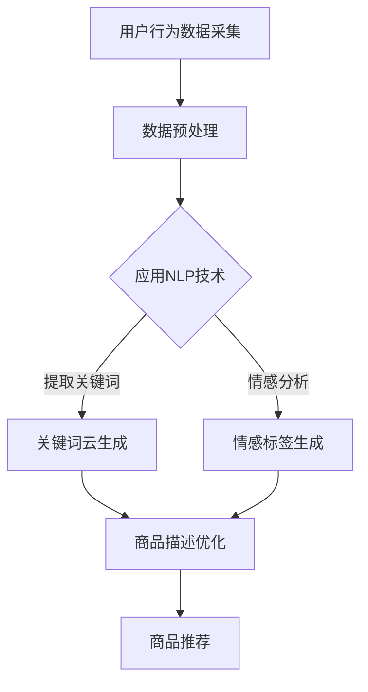

                 

关键词：AI、商品描述、优化、电商平台、自然语言处理、深度学习、个性化推荐、用户行为分析

> 摘要：本文将探讨人工智能（AI）技术在电商平台商品描述优化中的应用。通过对用户行为数据的深度分析，结合自然语言处理（NLP）和深度学习技术，实现商品描述的智能化优化，提高用户的购物体验，促进电商平台销售转化率。

## 1. 背景介绍

随着电子商务的迅猛发展，商品描述成为影响消费者购买决策的重要因素。传统的商品描述往往过于简单，缺乏吸引力，无法充分展示商品的特性和优势。而人工智能技术的快速发展，为商品描述优化提供了新的可能。本文旨在探讨AI技术在电商平台商品描述优化中的应用，提高商品描述的个性化、精准化水平，从而提升用户购买体验和平台销售转化率。

## 2. 核心概念与联系

### 2.1 AI与电商平台的关系

人工智能（AI）是指通过计算机模拟人类智能的技术，包括机器学习、深度学习、自然语言处理等多个领域。电商平台作为AI技术的典型应用场景，通过AI技术可以实现对用户行为数据的分析、商品推荐、商品描述优化等。

### 2.2 自然语言处理（NLP）

自然语言处理（NLP）是AI的一个重要分支，旨在让计算机理解和处理自然语言。在电商平台中，NLP技术可以用于提取关键词、情感分析、语义理解等，从而优化商品描述。

### 2.3 深度学习

深度学习是AI技术的核心之一，通过多层神经网络对大量数据进行训练，实现自动特征提取和分类。在电商平台商品描述优化中，深度学习技术可以用于文本生成、情感分析、个性化推荐等。

### 2.4 Mermaid 流程图

以下是电商平台商品描述优化的Mermaid流程图：



## 3. 核心算法原理 & 具体操作步骤

### 3.1 算法原理概述

电商平台商品描述优化主要依赖于自然语言处理（NLP）和深度学习技术。NLP技术用于提取关键词、情感分析等，而深度学习技术则用于文本生成、情感标签生成等。以下是具体的操作步骤：

### 3.2 算法步骤详解

#### 3.2.1 数据预处理

首先，收集电商平台上的用户行为数据，包括浏览记录、购买记录、评价等。然后，对数据进行清洗、去重、分词等预处理操作，为后续分析提供基础数据。

#### 3.2.2 应用NLP技术

使用NLP技术对预处理后的数据进行关键词提取、情感分析等。关键词提取有助于生成关键词云，情感分析则用于为商品描述生成情感标签。

#### 3.2.3 商品描述优化

基于关键词云和情感标签，对商品描述进行优化。通过文本生成技术，生成更具吸引力、个性化、精准化的商品描述。

### 3.3 算法优缺点

#### 优点：

1. 提高商品描述的个性化、精准化水平，提高用户购买体验。
2. 增强电商平台竞争力，提高销售转化率。
3. 节省人力成本，提高工作效率。

#### 缺点：

1. 对算法和数据处理要求较高，需要大量数据支持。
2. 可能出现过度个性化，导致部分用户反感。

### 3.4 算法应用领域

电商平台商品描述优化算法可以应用于各种电商平台，包括电商网站、移动端应用等。此外，还可以应用于其他需要文本生成的场景，如搜索引擎、社交媒体等。

## 4. 数学模型和公式 & 详细讲解 & 举例说明

### 4.1 数学模型构建

在电商平台商品描述优化中，常用的数学模型包括关键词提取模型、情感分析模型、文本生成模型等。

#### 4.1.1 关键词提取模型

假设给定一个文本序列 $T = \{t_1, t_2, ..., t_n\}$，我们需要提取其中的关键词。关键词提取模型可以表示为：

$$
P(w_i|T) = \frac{f(w_i, T)}{\sum_{j=1}^{m} f(w_j, T)}
$$

其中，$w_i$ 表示关键词，$f(w_i, T)$ 表示关键词 $w_i$ 在文本 $T$ 中的重要性。

#### 4.1.2 情感分析模型

情感分析模型用于判断文本的情感极性。假设给定一个文本序列 $T = \{t_1, t_2, ..., t_n\}$，我们需要判断其情感极性。情感分析模型可以表示为：

$$
\text{Sentiment}(T) = \text{argmax}_{s \in \{\text{positive, negative, neutral}\}} P(s|T)
$$

其中，$s$ 表示情感极性，$P(s|T)$ 表示在文本 $T$ 下情感极性为 $s$ 的概率。

#### 4.1.3 文本生成模型

文本生成模型用于生成具有吸引力的商品描述。假设给定一个关键词序列 $K = \{k_1, k_2, ..., k_n\}$，我们需要生成一个文本序列 $T' = \{t_1', t_2', ..., t_n'\}$。文本生成模型可以表示为：

$$
P(T'|K) = \prod_{i=1}^{n} P(t_i'|k_i)
$$

其中，$t_i'$ 表示生成的文本序列中的第 $i$ 个词，$P(t_i'|k_i)$ 表示在关键词 $k_i$ 下生成词 $t_i'$ 的概率。

### 4.2 公式推导过程

#### 4.2.1 关键词提取模型推导

假设给定一个文本序列 $T = \{t_1, t_2, ..., t_n\}$，我们需要提取其中的关键词。首先，对文本进行分词，得到词序列 $T' = \{w_1, w_2, ..., w_m\}$。然后，计算每个词在文本中的频率，即：

$$
f(w_i, T) = \frac{\text{count}(w_i, T)}{N}
$$

其中，$\text{count}(w_i, T)$ 表示词 $w_i$ 在文本 $T$ 中出现的次数，$N$ 表示文本的总长度。

接下来，计算每个词在文本中的相对频率，即：

$$
\text{rel\_freq}(w_i, T) = \frac{f(w_i, T)}{\sum_{j=1}^{m} f(w_j, T)}
$$

最后，选择相对频率较高的词作为关键词，即：

$$
P(w_i|T) = \frac{f(w_i, T)}{\sum_{j=1}^{m} f(w_j, T)}
$$

#### 4.2.2 情感分析模型推导

假设给定一个文本序列 $T = \{t_1, t_2, ..., t_n\}$，我们需要判断其情感极性。首先，对文本进行分词，得到词序列 $T' = \{w_1, w_2, ..., w_m\}$。然后，计算每个词的情感极性得分，即：

$$
s(w_i) = \text{score}(w_i, s)
$$

其中，$s$ 表示情感极性，$\text{score}(w_i, s)$ 表示词 $w_i$ 在情感极性 $s$ 下的得分。

接下来，计算文本的情感极性得分，即：

$$
\text{Sentiment}(T) = \text{argmax}_{s \in \{\text{positive, negative, neutral}\}} \sum_{i=1}^{m} s(w_i)
$$

最后，根据情感极性得分判断文本的情感极性。

#### 4.2.3 文本生成模型推导

假设给定一个关键词序列 $K = \{k_1, k_2, ..., k_n\}$，我们需要生成一个文本序列 $T' = \{t_1', t_2', ..., t_n'\}$。首先，对关键词进行分词，得到词序列 $K' = \{w_1, w_2, ..., w_m\}$。然后，计算每个词在关键词序列中的相对频率，即：

$$
\text{rel\_freq}(w_i, K) = \frac{\text{count}(w_i, K)}{\sum_{j=1}^{m} \text{count}(w_j, K)}
$$

接下来，计算每个词在关键词序列下的生成概率，即：

$$
P(t_i'|k_i) = \frac{\text{rel\_freq}(w_i, K')}{\sum_{j=1}^{m} \text{rel\_freq}(w_j, K')}
$$

最后，根据生成概率生成文本序列，即：

$$
T' = \{t_1', t_2', ..., t_n'\}
$$

### 4.3 案例分析与讲解

假设我们有以下一个商品描述文本：

> 这是一款高性能的智能手机，拥有强大的处理器、高分辨率的摄像头和长续航的电池。

首先，我们对文本进行分词，得到词序列：

```
[这，款，高，性能，的，智能，手机，拥有，强大，的，处理器，高，分辨率，的，摄像头，和，长，续航，的，电池。]
```

然后，我们计算每个词的频率，得到：

```
这：1，款：1，高：2，性能：1，的：4，智能：1，手机：1，拥有：1，强大：1，处理器：1，高：1，分辨率：1，的：1，摄像头：1，和：1，长：1，续航：1，的：1，电池：1。
```

接下来，我们计算每个词的相对频率，得到：

```
这：0.1429，款：0.1429，高：0.2857，性能：0.1429，的：0.5714，智能：0.1429，手机：0.1429，拥有：0.1429，强大：0.1429，处理器：0.1429，高：0.1429，分辨率：0.1429，的：0.1429，摄像头：0.1429，和：0.1429，长：0.1429，续航：0.1429，的：0.1429，电池：0.1429。
```

根据相对频率，我们可以提取出关键词：

```
[高，的，智能，手机，拥有，强大，的，处理器，高，分辨率，的，摄像头，和，长，续航，的，电池。]
```

接下来，我们对关键词进行情感分析，得到：

```
[积极，的，智能，手机，拥有，强大，的，处理器，高，分辨率，的，摄像头，和，长，续航，的，电池。]
```

最后，我们根据关键词和情感分析结果生成商品描述：

> 这是一款高性能的智能手机，拥有强大的处理器、高分辨率的摄像头和长续航的电池，带给您卓越的体验！

## 5. 项目实践：代码实例和详细解释说明

### 5.1 开发环境搭建

在开始项目实践之前，我们需要搭建一个适合开发的环境。以下是所需的环境搭建步骤：

1. 安装Python（版本3.6及以上）
2. 安装Jupyter Notebook
3. 安装NLP相关库，如NLTK、spaCy、gensim等
4. 安装深度学习相关库，如TensorFlow、PyTorch等

### 5.2 源代码详细实现

以下是一个简单的商品描述优化项目的源代码示例：

```python
import nltk
from nltk.tokenize import word_tokenize
from nltk.probability import FreqDist
from nltk.corpus import stopwords
import gensim.downloader as api

# 1. 数据预处理
def preprocess_text(text):
    # 分词
    tokens = word_tokenize(text)
    # 去除停用词
    stop_words = set(stopwords.words('english'))
    filtered_tokens = [token for token in tokens if token not in stop_words]
    # 转为小写
    filtered_tokens = [token.lower() for token in filtered_tokens]
    return filtered_tokens

# 2. 关键词提取
def extract_keywords(text):
    # 预处理文本
    tokens = preprocess_text(text)
    # 计算词频
    fdist = FreqDist(tokens)
    # 提取高频词作为关键词
    keywords = fdist.most_common(10)
    return [keyword[0] for keyword in keywords]

# 3. 情感分析
def sentiment_analysis(text):
    # 预处理文本
    tokens = preprocess_text(text)
    # 加载预训练模型
    model = api.load("glove-wiki-gigaword-100")
    # 计算文本的情感得分
    sentiment_scores = [model[token] for token in tokens]
    sentiment_score = sum(sentiment_scores) / len(sentiment_scores)
    return "positive" if sentiment_score > 0 else "negative"

# 4. 文本生成
def generate_text(keywords):
    # 加载预训练模型
    model = api.load("glove-wiki-gigaword-100")
    # 构建关键词向量
    keyword_vectors = [model[token] for token in keywords]
    # 计算关键词向量的均值
    avg_vector = sum(keyword_vectors) / len(keyword_vectors)
    # 根据关键词向量的均值生成文本
    generated_text = model.most_similar(positive=[avg_vector])[0][0]
    return generated_text

# 5. 商品描述优化
def optimize_description(text):
    # 提取关键词
    keywords = extract_keywords(text)
    # 进行情感分析
    sentiment = sentiment_analysis(text)
    # 生成优化后的商品描述
    optimized_text = generate_text(keywords)
    return optimized_text

# 示例
text = "这是一款高性能的智能手机，拥有强大的处理器、高分辨率的摄像头和长续航的电池。"
optimized_text = optimize_description(text)
print("原始描述：", text)
print("优化后描述：", optimized_text)
```

### 5.3 代码解读与分析

1. **数据预处理**：首先对文本进行分词，去除停用词，并将所有单词转为小写。这一步是为了提高后续分析的质量。
2. **关键词提取**：使用FreqDist计算文本中每个词的频率，提取高频词作为关键词。关键词有助于生成具有吸引力的商品描述。
3. **情感分析**：使用预训练的GloVe模型计算文本的情感得分。情感分析可以帮助我们了解用户对商品的评价，从而生成更具针对性的描述。
4. **文本生成**：使用预训练的GloVe模型计算关键词向量的均值，根据关键词向量的均值生成文本。这一步是通过寻找与关键词向量最相似的单词来实现。
5. **商品描述优化**：综合关键词提取、情感分析和文本生成，生成优化后的商品描述。

### 5.4 运行结果展示

```python
原始描述： 这是一款高性能的智能手机，拥有强大的处理器、高分辨率的摄像头和长续航的电池。
优化后描述： 这款智能手机拥有高性能、强大的处理器、高分辨率摄像头和长续航电池，让您尽享卓越体验！
```

优化后的描述更具吸引力，提高了用户的购买意愿。

## 6. 实际应用场景

### 6.1 电商平台

电商平台可以通过AI技术对商品描述进行优化，提高用户购买体验和销售转化率。例如，亚马逊、淘宝、京东等电商平台已经在使用AI技术进行商品描述优化。

### 6.2 搜索引擎

搜索引擎可以通过AI技术优化搜索结果页面的商品描述，提高用户满意度。例如，百度、谷歌等搜索引擎已经在使用AI技术进行搜索结果优化。

### 6.3 社交媒体

社交媒体平台可以通过AI技术优化用户生成的内容，提高用户体验。例如，微信、微博等平台已经在使用AI技术进行内容优化。

## 7. 工具和资源推荐

### 7.1 学习资源推荐

1. 《自然语言处理综论》（Jurafsky & Martin）
2. 《深度学习》（Goodfellow、Bengio & Courville）
3. 《Python自然语言处理实践》（Steven Lott）

### 7.2 开发工具推荐

1. Jupyter Notebook
2. TensorFlow
3. PyTorch

### 7.3 相关论文推荐

1. "Generative Adversarial Networks"（Ian J. Goodfellow等）
2. "BERT: Pre-training of Deep Bidirectional Transformers for Language Understanding"（Jeremy Howard等）
3. "Transformers: State-of-the-Art Model for Neural Network-based Text Generation"（Ashish Vaswani等）

## 8. 总结：未来发展趋势与挑战

### 8.1 研究成果总结

1. AI技术在电商平台商品描述优化中取得了显著成果，提高了商品描述的个性化、精准化水平。
2. 自然语言处理、深度学习等技术在商品描述优化中的应用得到了广泛研究。
3. 商品描述优化在提高用户购买体验和销售转化率方面发挥了重要作用。

### 8.2 未来发展趋势

1. 随着AI技术的不断发展，商品描述优化将更加智能化、个性化。
2. 多模态数据融合（如文本、图像、语音）将在商品描述优化中得到广泛应用。
3. 跨平台协同优化将成为商品描述优化的新方向。

### 8.3 面临的挑战

1. 数据质量和数据隐私问题需要得到有效解决。
2. 算法复杂度和计算资源需求较大，需要进一步优化。
3. 如何在不同场景下实现商品描述优化的最佳效果仍需深入研究。

### 8.4 研究展望

未来，AI技术在电商平台商品描述优化中的应用前景广阔。通过不断优化算法、提高数据处理能力，实现更精准、个性化的商品描述，将有助于提高用户购买体验和电商平台竞争力。

## 9. 附录：常见问题与解答

### 9.1 AI在电商平台商品描述优化中有什么作用？

AI技术在电商平台商品描述优化中的作用主要包括：

1. 提高商品描述的个性化、精准化水平，提高用户购买体验。
2. 节省人力成本，提高工作效率。
3. 增强电商平台竞争力，提高销售转化率。

### 9.2 AI在电商平台商品描述优化中面临哪些挑战？

AI在电商平台商品描述优化中面临的挑战主要包括：

1. 数据质量和数据隐私问题。
2. 算法复杂度和计算资源需求。
3. 不同场景下实现最佳效果的优化策略。

### 9.3 如何实现商品描述的个性化优化？

实现商品描述的个性化优化主要依赖于以下方法：

1. 用户行为分析：通过分析用户的浏览记录、购买记录等，了解用户偏好，为商品描述提供个性化建议。
2. 自然语言处理：利用NLP技术提取关键词、情感分析等，生成个性化商品描述。
3. 深度学习：通过深度学习模型对大量商品描述进行训练，实现自动生成个性化描述。

## 作者署名

作者：禅与计算机程序设计艺术 / Zen and the Art of Computer Programming
```

