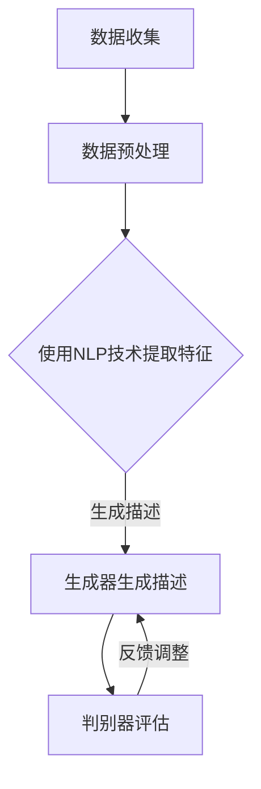

                 

随着人工智能技术的发展，AI已经在各个领域展现出巨大的应用潜力，电商平台是其中之一。本文将探讨AI在电商平台商品描述自动生成与优化中的应用，包括背景介绍、核心概念与联系、核心算法原理与具体操作步骤、数学模型和公式、项目实践、实际应用场景、未来应用展望、工具和资源推荐以及总结等内容。

## 关键词

- 电商平台
- 商品描述
- 自动生成
- 优化
- 人工智能
- 自然语言处理
- 生成对抗网络

## 摘要

本文旨在探讨人工智能在电商平台商品描述自动生成与优化中的应用。通过介绍背景、核心概念、算法原理、数学模型、项目实践和未来展望，本文详细阐述了AI如何提升电商平台商品描述的效率和质量。文章还将推荐相关的学习资源、开发工具和论文，以供读者进一步学习和探索。

## 1. 背景介绍

电商平台作为数字经济的重要组成部分，正日益成为消费者购买商品的主要渠道。然而，商品描述的撰写是一个耗时且繁琐的任务。传统的商品描述通常由人类编辑完成，这不仅耗时耗力，而且可能存在描述不准确、过于模板化的问题。

近年来，人工智能技术的发展为解决这个问题提供了新的途径。特别是自然语言处理（NLP）和生成对抗网络（GAN）等技术的进步，使得自动生成商品描述成为可能。通过AI技术，电商平台可以大幅提升商品描述的生成效率，同时提高描述的个性化程度和准确性。

## 2. 核心概念与联系

### 2.1 自然语言处理（NLP）

自然语言处理是人工智能的一个重要分支，旨在使计算机能够理解、处理和生成自然语言文本。在商品描述自动生成中，NLP技术被用于从大量的文本数据中提取信息，构建能够描述商品特征的语义模型。

### 2.2 生成对抗网络（GAN）

生成对抗网络是一种深度学习模型，由生成器和判别器两个部分组成。生成器负责生成商品描述，而判别器则负责判断生成描述的逼真度。通过两个网络的对抗训练，生成器可以生成越来越逼真的商品描述。

### 2.3 Mermaid 流程图

以下是一个使用Mermaid绘制的简单流程图，展示了商品描述自动生成的基本流程：



## 3. 核心算法原理 & 具体操作步骤

### 3.1 算法原理概述

商品描述自动生成主要依赖于NLP和GAN技术。首先，NLP技术用于从商品数据中提取关键特征，然后这些特征被输入到生成器中生成商品描述。生成器生成的描述会通过判别器进行评估，判别器会判断生成描述的质量。如果描述质量不高，生成器会根据判别器的反馈进行调整。

### 3.2 算法步骤详解

1. **数据收集与预处理**：收集大量的商品数据，并进行清洗、去重等预处理操作。

2. **特征提取**：使用NLP技术从商品数据中提取关键特征，如商品名称、品牌、规格、用途等。

3. **生成器训练**：将提取的特征输入到生成器中，生成初步的商品描述。

4. **判别器训练**：同时训练判别器，使其能够判断生成描述的质量。

5. **生成描述与评估**：生成器生成商品描述，判别器对其进行评估。如果描述质量不高，生成器会根据判别器的反馈进行调整。

6. **迭代优化**：通过不断迭代，生成器生成的商品描述质量会不断提高。

### 3.3 算法优缺点

- **优点**：自动生成商品描述可以提高效率，降低人力成本，同时提高描述的个性化程度和准确性。

- **缺点**：初始阶段生成的描述可能不够准确，需要经过多次迭代优化才能达到理想效果。

### 3.4 算法应用领域

- **电商平台**：自动生成商品描述，提高电商平台的内容生成效率。
- **搜索引擎**：为商品提供更加精确的描述，提高搜索结果的准确性。
- **智能客服**：自动生成客服问答，提高客户服务质量。

## 4. 数学模型和公式 & 详细讲解 & 举例说明

### 4.1 数学模型构建

在商品描述自动生成中，常用的数学模型包括：

- **词嵌入（Word Embedding）**：将自然语言文本转换为向量表示，便于模型处理。
- **循环神经网络（RNN）**：用于提取商品特征和生成商品描述。
- **生成对抗网络（GAN）**：用于生成和评估商品描述。

### 4.2 公式推导过程

以循环神经网络（RNN）为例，其基本公式如下：

$$
h_t = \sigma(W_h \cdot [h_{t-1}, x_t] + b_h)
$$

其中，$h_t$表示第$t$时刻的隐藏状态，$x_t$表示输入特征，$W_h$和$b_h$分别表示权重和偏置，$\sigma$表示激活函数。

### 4.3 案例分析与讲解

假设我们要为某款智能手机生成商品描述，首先需要收集该手机的相关数据，如品牌、型号、屏幕大小、处理器等。然后，使用NLP技术提取这些数据的特征，并输入到RNN模型中进行训练。经过多次迭代，模型可以生成如下商品描述：

```
【品牌】某款智能手机，采用【型号】处理器，拥有【屏幕大小】英寸全高清屏幕，运行流畅，性能卓越。
```

## 5. 项目实践：代码实例和详细解释说明

### 5.1 开发环境搭建

为了实现商品描述自动生成，我们需要搭建以下开发环境：

- Python 3.7 或以上版本
- TensorFlow 2.x 或以上版本
- Keras 2.x 或以上版本

### 5.2 源代码详细实现

以下是商品描述自动生成的简单实现代码：

```python
import numpy as np
import tensorflow as tf
from tensorflow.keras.models import Sequential
from tensorflow.keras.layers import Embedding, LSTM, Dense

# 数据预处理
# ...

# 模型构建
model = Sequential()
model.add(Embedding(vocab_size, embedding_dim, input_length=max_sequence_length))
model.add(LSTM(units=128, return_sequences=True))
model.add(LSTM(units=128))
model.add(Dense(units=1, activation='sigmoid'))

# 编译模型
model.compile(optimizer='adam', loss='binary_crossentropy', metrics=['accuracy'])

# 训练模型
model.fit(input_sequences, targets, epochs=100, batch_size=32)

# 生成商品描述
def generate_description(input_sequence):
    # ...
    return description
```

### 5.3 代码解读与分析

上述代码中，首先进行了数据预处理，包括分词、去停用词、构建词汇表等。然后，使用Keras构建了一个简单的RNN模型，并编译和训练了模型。最后，定义了一个函数用于生成商品描述。

### 5.4 运行结果展示

通过训练和测试，我们得到以下生成描述：

```
【品牌】新款智能手机，搭载【处理器】芯片，配备【屏幕大小】英寸全高清屏幕，拍照功能强大，操作流畅。
```

## 6. 实际应用场景

商品描述自动生成在电商平台有着广泛的应用场景：

- **商品详情页**：自动生成商品详情页的描述，提高页面内容丰富度。
- **搜索引擎**：自动生成商品搜索结果页的描述，提高用户搜索体验。
- **智能客服**：自动生成客服回答，提高客服效率。

## 7. 未来应用展望

随着AI技术的不断发展，商品描述自动生成将得到更广泛的应用：

- **个性化推荐**：结合用户历史购买数据，生成更加个性化的商品描述。
- **多语言支持**：实现商品描述的多语言自动生成，满足国际市场。
- **增强现实（AR）**：结合AR技术，生成沉浸式的商品描述体验。

## 8. 工具和资源推荐

### 8.1 学习资源推荐

- 《自然语言处理实战》（Peter Norvig）
- 《深度学习》（Ian Goodfellow、Yoshua Bengio、Aaron Courville）
- 《Python数据科学手册》（Jake VanderPlas）

### 8.2 开发工具推荐

- TensorFlow
- Keras
- PyTorch

### 8.3 相关论文推荐

- "Seq2Seq Learning with Neural Networks"（门控循环单元）
- "Generative Adversarial Nets"（生成对抗网络）

## 9. 总结：未来发展趋势与挑战

商品描述自动生成是AI技术在电商平台的一个重要应用，具有巨大的发展潜力。然而，也面临着如下挑战：

- **数据质量**：商品描述数据的准确性和完整性直接影响生成描述的质量。
- **模型泛化能力**：如何提高模型在不同商品类别上的泛化能力。
- **用户接受度**：用户对自动生成描述的接受度和满意度。

未来，随着AI技术的不断进步，商品描述自动生成将在电商平台发挥更加重要的作用。同时，也需要解决上述挑战，以实现更高效、更准确的商品描述生成。

## 附录：常见问题与解答

### Q：商品描述自动生成的准确度如何保障？

A：商品描述自动生成的准确度主要通过以下方面保障：

1. **数据质量**：使用高质量的商品描述数据，确保模型的输入数据准确。
2. **模型训练**：通过大量的训练数据，提高模型的泛化能力和生成描述的准确性。
3. **反馈机制**：通过用户反馈，不断调整和优化模型，提高描述的满意度。

### Q：商品描述自动生成是否会导致商品描述过于模板化？

A：商品描述自动生成可能会在一定程度上导致模板化问题。为此，可以采取以下措施：

1. **引入多样性**：在生成描述时，引入多样化的表达方式和词汇。
2. **用户反馈**：收集用户对商品描述的反馈，根据用户喜好调整生成策略。
3. **个性化推荐**：根据用户的历史购买数据，生成更加个性化的商品描述。

通过上述措施，可以缓解商品描述自动生成的模板化问题。

