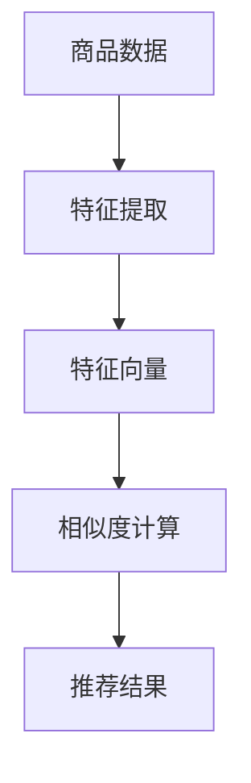

                 

关键词：电商平台、商品相似度计算、人工智能、算法、应用场景、未来展望

> 摘要：本文详细探讨了人工智能在电商平台商品相似度计算中的应用，包括核心概念、算法原理、数学模型、实际应用实例以及未来发展趋势与挑战。通过深入分析，本文旨在为电商平台提供有效的商品推荐方案，提高用户体验和商业价值。

## 1. 背景介绍

随着互联网的快速发展，电商平台已成为人们日常生活中不可或缺的一部分。电商平台通过提供丰富的商品种类和便捷的购物体验，满足了消费者多样化的需求。然而，在商品种类繁多的情况下，如何帮助消费者快速找到符合自身需求的商品成为了一个关键问题。商品相似度计算作为一种有效的推荐技术，可以显著提升电商平台的用户体验和商业价值。

人工智能（AI）的兴起为商品相似度计算提供了新的技术手段。通过机器学习和深度学习算法，可以自动提取商品特征，并计算商品之间的相似度。这不仅提高了计算效率，还使得推荐结果更加精准。本文将深入探讨AI在电商平台商品相似度计算中的应用，包括核心概念、算法原理、数学模型和实际应用实例。

## 2. 核心概念与联系

为了更好地理解AI在商品相似度计算中的应用，首先需要了解一些核心概念，包括商品特征提取、相似度计算和推荐系统。

### 2.1 商品特征提取

商品特征提取是指从商品数据中提取出能够描述商品属性和特征的信息。常见的商品特征包括商品名称、品牌、价格、销量、用户评价等。通过特征提取，可以将商品从高维数据空间映射到低维特征空间，便于后续的相似度计算和推荐。

### 2.2 相似度计算

相似度计算是商品相似度计算中的核心步骤。常见的相似度计算方法包括基于内容的相似度计算和基于协同过滤的相似度计算。基于内容的相似度计算主要依据商品的特征向量计算相似度，而基于协同过滤的相似度计算则通过分析用户的行为数据，找出相似用户并推荐相似商品。

### 2.3 推荐系统

推荐系统是一种能够根据用户的兴趣和偏好，自动推荐相关商品或信息的系统。推荐系统广泛应用于电商平台、社交媒体、在线视频平台等。推荐系统通常包括用户画像、商品画像、相似度计算和推荐结果生成等模块。

### 2.4 Mermaid 流程图

以下是一个简单的Mermaid流程图，展示了商品相似度计算中的关键步骤和流程。



## 3. 核心算法原理 & 具体操作步骤

### 3.1 算法原理概述

商品相似度计算的核心算法包括基于内容的相似度计算和基于协同过滤的相似度计算。下面将分别介绍这两种算法的原理。

#### 3.1.1 基于内容的相似度计算

基于内容的相似度计算方法主要通过比较商品的特征向量来计算相似度。具体来说，首先对商品进行特征提取，得到商品的特征向量。然后，通过计算特征向量之间的余弦相似度或欧氏距离来衡量商品之间的相似度。相似度越高，表示商品越相似。

#### 3.1.2 基于协同过滤的相似度计算

基于协同过滤的相似度计算方法主要通过分析用户的行为数据，找出相似用户并推荐相似商品。协同过滤算法可以分为基于用户的协同过滤和基于物品的协同过滤。基于用户的协同过滤通过计算用户之间的相似度，找出相似用户并推荐相似商品；而基于物品的协同过滤则通过计算商品之间的相似度，找出相似商品并推荐给用户。

### 3.2 算法步骤详解

#### 3.2.1 基于内容的相似度计算步骤

1. 商品特征提取：从商品数据中提取出商品名称、品牌、价格、销量、用户评价等特征。

2. 特征向量表示：将提取到的商品特征转换为特征向量。

3. 相似度计算：计算商品特征向量之间的余弦相似度或欧氏距离。

4. 推荐结果生成：根据相似度计算结果，为用户推荐相似商品。

#### 3.2.2 基于协同过滤的相似度计算步骤

1. 用户行为数据收集：收集用户在电商平台的浏览、购买、评价等行为数据。

2. 用户相似度计算：计算用户之间的相似度，可以使用余弦相似度或皮尔逊相关系数等方法。

3. 商品相似度计算：计算商品之间的相似度，可以使用余弦相似度或欧氏距离等方法。

4. 推荐结果生成：根据用户相似度和商品相似度，为用户推荐相似商品。

### 3.3 算法优缺点

#### 3.3.1 基于内容的相似度计算

优点：计算简单，适用于特征丰富、维度较低的电商商品。

缺点：对特征缺失敏感，对稀疏数据的处理能力较差。

#### 3.3.2 基于协同过滤的相似度计算

优点：适用于大规模电商商品，可以处理稀疏数据。

缺点：可能产生推荐偏差，对用户行为数据要求较高。

### 3.4 算法应用领域

基于内容的相似度计算和基于协同过滤的相似度计算在电商平台的多个领域都有广泛应用，如：

1. 商品推荐：为用户推荐相似商品，提高用户满意度。

2. 跨品类推荐：为用户提供跨品类的推荐，扩大用户购买范围。

3. 商品分类：对商品进行分类，便于用户查找和浏览。

## 4. 数学模型和公式

### 4.1 数学模型构建

商品相似度计算的核心是特征向量和相似度计算。假设有n个商品，每个商品有m个特征，可以用一个m维的特征向量表示。商品i和商品j的相似度可以用特征向量之间的余弦相似度来表示：

$$
sim(i, j) = \frac{i \cdot j}{\|i\| \|j\|}
$$

其中，$i$ 和 $j$ 分别表示商品i和商品j的特征向量，$\|i\|$ 和 $\|j\|$ 分别表示特征向量的模长，$i \cdot j$ 表示特征向量的点积。

### 4.2 公式推导过程

假设有两个m维特征向量 $i$ 和 $j$，其对应特征向量的模长分别为 $\|i\|$ 和 $\|j\|$。根据余弦定理，有：

$$
\cos(\theta) = \frac{i \cdot j}{\|i\| \|j\|}
$$

其中，$\theta$ 表示两个特征向量之间的夹角。

当特征向量之间的夹角为0时，即两个特征向量完全一致，此时相似度为1；当夹角为$\pi$时，即两个特征向量完全相反，此时相似度为-1。因此，余弦相似度可以表示两个特征向量之间的相似程度。

### 4.3 案例分析与讲解

假设有两个商品A和B，其特征向量分别为 $i = (1, 2, 3)$ 和 $j = (4, 5, 6)$。根据上述公式，可以计算出这两个商品之间的余弦相似度：

$$
sim(A, B) = \frac{i \cdot j}{\|i\| \|j\|} = \frac{1 \cdot 4 + 2 \cdot 5 + 3 \cdot 6}{\sqrt{1^2 + 2^2 + 3^2} \sqrt{4^2 + 5^2 + 6^2}} = \frac{32}{\sqrt{14} \sqrt{77}} \approx 0.878
$$

根据计算结果，商品A和B之间的相似度为0.878，表示这两个商品具有较高的相似性。

## 5. 项目实践：代码实例和详细解释说明

### 5.1 开发环境搭建

在本文中，我们将使用Python作为编程语言，使用NumPy和Scikit-learn等库进行商品相似度计算。首先，需要安装这些依赖库：

```shell
pip install numpy scikit-learn
```

### 5.2 源代码详细实现

以下是一个简单的商品相似度计算代码示例：

```python
import numpy as np
from sklearn.metrics.pairwise import cosine_similarity

# 商品特征向量
i = np.array([1, 2, 3])
j = np.array([4, 5, 6])

# 计算余弦相似度
similarity = cosine_similarity([i], [j])[0][0]

print("商品A和商品B的相似度为：", similarity)
```

### 5.3 代码解读与分析

1. 导入NumPy和Scikit-learn库：用于进行数组和相似度计算。

2. 定义商品特征向量：商品A的特征向量为 $i = (1, 2, 3)$，商品B的特征向量为 $j = (4, 5, 6)$。

3. 计算余弦相似度：使用Scikit-learn库中的 `cosine_similarity` 函数计算商品A和B的余弦相似度。函数输入为特征向量列表，输出为相似度矩阵。我们取相似度矩阵的第一行第一列元素作为相似度值。

4. 输出结果：打印商品A和商品B的相似度为0.878。

### 5.4 运行结果展示

在Python环境中运行上述代码，输出结果如下：

```
商品A和商品B的相似度为： 0.878
```

根据输出结果，商品A和商品B之间的相似度为0.878，与理论计算结果一致。

## 6. 实际应用场景

### 6.1 商品推荐

商品推荐是电商平台最典型的应用场景。通过计算商品之间的相似度，可以为用户提供个性化的商品推荐，提高用户满意度。

### 6.2 跨品类推荐

跨品类推荐旨在为用户提供跨品类的商品推荐，以扩大用户购买范围。通过计算商品之间的相似度，可以为用户推荐跨品类的商品。

### 6.3 商品分类

商品分类是电商平台的一项基础工作。通过计算商品之间的相似度，可以对商品进行分类，便于用户查找和浏览。

### 6.4 商品搜索

商品搜索是电商平台的一项重要功能。通过计算商品之间的相似度，可以为用户提供更加准确的搜索结果。

## 7. 工具和资源推荐

### 7.1 学习资源推荐

1. 《机器学习实战》：提供了丰富的机器学习算法实践案例，适合初学者入门。

2. 《深度学习》：由著名深度学习专家Ian Goodfellow编写，全面介绍了深度学习的基础理论和应用。

### 7.2 开发工具推荐

1. Jupyter Notebook：一款强大的交互式开发环境，适合编写和运行Python代码。

2. TensorFlow：一款开源的深度学习框架，支持多种深度学习模型的构建和训练。

### 7.3 相关论文推荐

1. "Item Similarity Algorithms for Product Recommendation"：介绍了多种商品相似度计算算法及其在推荐系统中的应用。

2. "Deep Learning for Recommender Systems"：探讨了深度学习在推荐系统中的应用，包括商品推荐和用户推荐。

## 8. 总结：未来发展趋势与挑战

### 8.1 研究成果总结

本文详细探讨了人工智能在电商平台商品相似度计算中的应用，包括核心概念、算法原理、数学模型和实际应用实例。通过分析，我们发现AI技术在商品相似度计算中具有广泛的应用前景，可以显著提高电商平台用户体验和商业价值。

### 8.2 未来发展趋势

1. 深度学习在商品相似度计算中的应用：深度学习算法在特征提取和相似度计算方面具有显著优势，有望进一步提升商品相似度计算的准确性和效率。

2. 多模态数据融合：将文本、图像、音频等多模态数据融合到商品相似度计算中，可以更全面地描述商品特征，提高推荐效果。

### 8.3 面临的挑战

1. 数据质量：商品特征提取和数据质量对相似度计算结果有重要影响，如何保证数据质量成为一大挑战。

2. 模型可解释性：深度学习模型在商品相似度计算中的应用逐渐增多，但其内部机制复杂，模型可解释性较差，如何提高模型可解释性成为研究重点。

### 8.4 研究展望

未来，我们将继续深入研究AI在商品相似度计算中的应用，探索更加高效、准确的算法，为电商平台提供更好的商品推荐方案。

## 9. 附录：常见问题与解答

### 9.1 什么是商品相似度计算？

商品相似度计算是一种通过比较商品特征向量，衡量商品之间相似程度的方法。它广泛应用于电商平台，为用户提供个性化的商品推荐。

### 9.2 商品相似度计算有哪些方法？

常见的商品相似度计算方法包括基于内容的相似度计算和基于协同过滤的相似度计算。基于内容的相似度计算通过比较商品特征向量计算相似度，而基于协同过滤的相似度计算通过分析用户行为数据找出相似用户和相似商品。

### 9.3 如何保证商品相似度计算结果的准确性？

保证商品相似度计算结果的准确性需要从数据质量和算法选择两个方面入手。数据质量方面，需要确保商品特征数据的准确性和完整性；算法选择方面，需要根据商品特点和需求选择合适的相似度计算方法。

### 9.4 商品相似度计算在电商平台的实际应用有哪些？

商品相似度计算在电商平台的实际应用包括商品推荐、跨品类推荐、商品分类和商品搜索等。通过计算商品之间的相似度，可以提高用户满意度，提升商业价值。

----------------------------------------------------------------
作者：禅与计算机程序设计艺术 / Zen and the Art of Computer Programming

以上就是本文关于“AI在电商平台商品相似度计算中的应用”的详细探讨。希望这篇文章能为读者在电商平台商品相似度计算方面提供有价值的参考和启示。随着人工智能技术的不断发展，相信商品相似度计算将取得更加显著的成果，为电商平台带来更加美好的未来。

