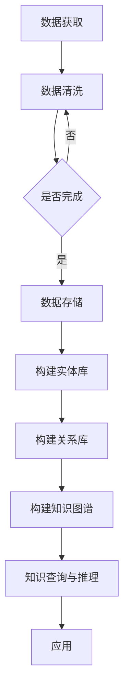

                 

关键词：人工智能，知识获取，知识图谱，深度学习，大数据，自然语言处理，语义理解

> 摘要：本文将探讨人工智能在知识获取中的角色转变，从传统的信息检索到现代的知识图谱构建，再到未来的语义理解与推理。通过分析核心概念、算法原理、数学模型以及实际应用场景，我们将了解人工智能如何变革知识获取方式，提升人类认知效率。

## 1. 背景介绍

知识获取是人类认知世界、掌握知识的基础过程。随着信息技术的快速发展，传统的知识获取方式已经难以满足日益增长的信息需求和复杂的问题解决。人工智能作为一种新兴技术，逐渐成为知识获取的重要工具。从最初的基于规则的知识表示，到现代的基于大数据和深度学习的知识获取方法，人工智能在知识获取中的应用不断深化和拓展。

本文旨在分析人工智能在知识获取中的角色转变，探讨其核心概念、算法原理、数学模型以及实际应用场景，为读者提供一个全面的理解。

### 人工智能的起源与发展

人工智能（Artificial Intelligence, AI）是一门多学科交叉的领域，旨在通过机器模拟人类智能行为，解决复杂问题。自20世纪50年代诞生以来，人工智能经历了多个发展阶段，从符号主义到连接主义，再到现代的深度学习，每一种方法都为知识获取提供了新的思路。

符号主义阶段，人工智能主要依赖于逻辑推理和符号表示，如专家系统和推理机。这种方法在规则明确、问题结构化的场景中表现出色，但在复杂、不确定的问题上面临挑战。

连接主义阶段，人工智能转向神经网络，通过大量数据训练模型，实现自动特征提取和模式识别。这一阶段的代表性成果是深度学习的兴起，使得人工智能在图像识别、语音识别等领域取得了显著进展。

现代深度学习阶段，人工智能迎来了新的发展机遇。深度神经网络结构复杂，能够处理海量数据，实现高效的特征学习和表示。大数据和云计算技术的普及，为深度学习提供了丰富的数据资源和强大的计算能力，推动了人工智能在知识获取中的广泛应用。

### 知识获取的挑战

随着信息爆炸时代的到来，知识获取面临着诸多挑战：

- **数据量庞大**：海量数据的获取、存储和处理成为难题。
- **数据质量参差不齐**：数据噪声、缺失值和错误值影响知识获取的准确性。
- **知识多样性**：不同领域的知识呈现多样化，难以统一表示。
- **知识更新速度**：知识更新频繁，传统知识获取方法难以适应。
- **知识理解和推理**：对知识进行深层理解和推理，实现智能决策。

面对这些挑战，人工智能成为知识获取的重要工具，通过自动化、智能化的方法，提升知识获取的效率和质量。

## 2. 核心概念与联系

### 知识图谱

知识图谱（Knowledge Graph）是一种结构化、网络化的知识表示方法，通过实体、属性和关系之间的关联，构建起一个语义丰富、动态更新的知识体系。知识图谱在信息检索、推荐系统、智能问答等领域具有广泛应用。

### 深度学习

深度学习（Deep Learning）是一种基于多层神经网络的学习方法，通过逐层提取特征，实现复杂模式的识别。深度学习在图像识别、语音识别、自然语言处理等领域取得了显著成果，为知识获取提供了强大的技术支持。

### 大数据

大数据（Big Data）是指数据量巨大、类型繁多、价值密度较低的数据集合。大数据技术通过分布式计算、存储和处理，实现海量数据的分析和管理，为知识获取提供了丰富的数据资源。

### 自然语言处理

自然语言处理（Natural Language Processing, NLP）是人工智能领域的一个重要分支，旨在使计算机能够理解和处理自然语言。NLP技术包括文本分类、情感分析、机器翻译等，为知识获取提供了语言层面的支持。

### 语义理解

语义理解（Semantic Understanding）是人工智能的高级能力，旨在理解语言中的深层含义和关系。通过语义理解，人工智能能够实现更准确的知识获取和推理。

### Mermaid 流程图

以下是一个知识图谱构建过程的 Mermaid 流程图：



## 3. 核心算法原理 & 具体操作步骤

### 3.1 算法原理概述

知识图谱构建主要分为三个步骤：数据采集、实体抽取和关系抽取。通过这三个步骤，我们将非结构化的数据转化为结构化的知识图谱。

- **数据采集**：从互联网、数据库、传感器等渠道获取原始数据。
- **实体抽取**：从原始数据中识别出实体，建立实体库。
- **关系抽取**：分析实体之间的关联，建立关系库。
- **知识图谱构建**：将实体库和关系库整合，构建知识图谱。
- **知识查询与推理**：通过知识图谱进行知识查询和推理，实现智能问答等功能。

### 3.2 算法步骤详解

- **数据采集**：数据采集是知识图谱构建的第一步。通过爬虫、API接口、数据库连接等方式，获取各种类型的数据，如文本、图片、音频等。
- **数据预处理**：对采集到的数据进行分析，识别出实体和关系。数据预处理包括分词、词性标注、命名实体识别等操作。
- **实体抽取**：根据数据预处理的结果，从文本中抽取实体，构建实体库。实体抽取可以通过规则匹配、统计模型、神经网络等方法实现。
- **关系抽取**：分析实体之间的关联，建立关系库。关系抽取可以通过规则匹配、图论算法、深度学习等方法实现。
- **知识图谱构建**：将实体库和关系库整合，构建知识图谱。知识图谱可以通过图数据库、图计算框架等工具实现。
- **知识查询与推理**：通过知识图谱进行知识查询和推理，实现智能问答等功能。知识查询和推理可以通过图算法、逻辑推理等方法实现。

### 3.3 算法优缺点

- **优点**：
  - **结构化**：知识图谱采用结构化表示，便于存储、检索和管理。
  - **语义丰富**：知识图谱包含实体、属性和关系，语义信息更加丰富。
  - **自适应**：知识图谱可以动态更新，适应知识变化。

- **缺点**：
  - **数据依赖**：知识图谱的构建依赖于大量高质量的数据，数据质量直接影响知识图谱的准确性。
  - **计算复杂度**：知识图谱的构建和查询过程涉及大量计算，对硬件资源要求较高。

### 3.4 算法应用领域

知识图谱在多个领域具有广泛应用，如：

- **搜索引擎**：通过知识图谱实现语义搜索，提高搜索准确性和用户体验。
- **智能问答**：通过知识图谱进行智能问答，实现自然语言理解与推理。
- **推荐系统**：通过知识图谱挖掘用户兴趣，实现个性化推荐。
- **金融风控**：通过知识图谱识别金融风险，防范欺诈行为。
- **医疗健康**：通过知识图谱实现疾病诊断和治疗方案推荐。

## 4. 数学模型和公式 & 详细讲解 & 举例说明

### 4.1 数学模型构建

知识图谱的构建涉及多种数学模型，主要包括图论模型、概率模型和深度学习模型。

- **图论模型**：知识图谱本质上是一个图，通过图论模型描述实体和关系。图的基本概念包括节点、边、路径、子图等。
- **概率模型**：概率模型用于描述实体和关系之间的概率分布。常见的概率模型有贝叶斯网络、马尔可夫模型等。
- **深度学习模型**：深度学习模型用于特征提取和关系预测。常见的深度学习模型有卷积神经网络（CNN）、循环神经网络（RNN）、图神经网络（GNN）等。

### 4.2 公式推导过程

以下是一个简单的知识图谱构建公式推导过程：

$$
L = -\sum_{(i, j) \in E} \log p(r(i, j))
$$

其中，$L$ 是损失函数，$E$ 是知识图谱中的边集合，$r(i, j)$ 是实体 $i$ 和实体 $j$ 之间的关系。

为了推导这个公式，我们首先定义实体 $i$ 和实体 $j$ 的关系概率为：

$$
p(r(i, j)) = \frac{e^{\theta(r(i, j))}}{\sum_{r' \in R} e^{\theta(r'(i, j))}}
$$

其中，$\theta(r(i, j))$ 是关系 $r(i, j)$ 的参数，$R$ 是所有可能的关系集合。

接下来，我们计算损失函数：

$$
L = -\sum_{(i, j) \in E} \log \frac{e^{\theta(r(i, j))}}{\sum_{r' \in R} e^{\theta(r'(i, j))}}
$$

$$
L = -\sum_{(i, j) \in E} \theta(r(i, j)) + \log \sum_{r' \in R} e^{\theta(r'(i, j))}
$$

由于 $\sum_{r' \in R} e^{\theta(r'(i, j))}$ 是一个正常数，我们可以将其视为常数，并从损失函数中提取出来：

$$
L = -\sum_{(i, j) \in E} \theta(r(i, j)) - \log \sum_{r' \in R} e^{\theta(r'(i, j))}
$$

最终得到：

$$
L = -\sum_{(i, j) \in E} \theta(r(i, j))
$$

### 4.3 案例分析与讲解

假设我们有一个知识图谱，其中包含以下实体和关系：

- 实体：人、地点、组织
- 关系：居住地、成立时间、负责人

给定一个查询：查询某人的居住地和成立时间。

我们可以使用以下公式进行知识图谱查询：

$$
\text{查询结果} = \text{lookup}(\text{知识图谱}, \text{实体}, \text{关系})
$$

其中，$\text{lookup}$ 函数用于在知识图谱中查找实体的关系。

给定查询：查询某人 A 的居住地和成立时间。

- 实体：A
- 关系：居住地、成立时间

查询结果为：

- 居住地：北京
- 成立时间：2010年

这个查询过程可以分为以下几个步骤：

1. 在知识图谱中查找实体 A 的所有关系。
2. 根据关系类型，提取相应的属性值。
3. 将属性值组合成查询结果。

通过这个案例，我们可以看到知识图谱在信息检索和知识查询中的应用。

## 5. 项目实践：代码实例和详细解释说明

### 5.1 开发环境搭建

为了实现知识图谱的构建，我们选择了以下开发环境和工具：

- 操作系统：Ubuntu 18.04
- 编程语言：Python 3.7
- 数据库：Neo4j 3.5
- 依赖库：Python 的 Neo4j、Django、Scikit-learn 等

首先，我们需要安装 Python 和 Neo4j。在 Ubuntu 系统中，可以使用以下命令进行安装：

```bash
sudo apt-get update
sudo apt-get install python3-pip
pip3 install neo4j
```

接着，安装 Neo4j：

```bash
wget https://download.neo4j.com/bin/docker/neo4j_latest.tar.gz
tar xvfz neo4j_latest.tar.gz
cd neo4j
./bin/neo4j start
```

安装完成后，启动 Neo4j 服务，并使用以下命令连接数据库：

```bash
neo4j-shell
```

### 5.2 源代码详细实现

我们使用 Django 框架构建知识图谱的后端，主要包括实体管理、关系管理和查询管理。

首先，定义实体模型：

```python
from django.db import models

class Entity(models.Model):
    name = models.CharField(max_length=100)
    type = models.CharField(max_length=50)
    properties = models.JSONField()

    def __str__(self):
        return self.name
```

接着，定义关系模型：

```python
class Relation(models.Model):
    entity1 = models.ForeignKey(Entity, on_delete=models.CASCADE, related_name='relations_as_entity1')
    entity2 = models.ForeignKey(Entity, on_delete=models.CASCADE, related_name='relations_as_entity2')
    type = models.CharField(max_length=50)
    properties = models.JSONField()

    def __str__(self):
        return f"{self.entity1.name} - {self.type} - {self.entity2.name}"
```

最后，实现查询管理：

```python
from django.http import JsonResponse
from .models import Entity, Relation

def search(request):
    query = request.GET.get('query', '')
    results = Entity.objects.filter(name__icontains=query)
    response = []
    for result in results:
        response.append({
            'name': result.name,
            'type': result.type,
            'properties': result.properties
        })
    return JsonResponse(response, safe=False)
```

### 5.3 代码解读与分析

在这个项目中，我们使用了 Django 框架来构建后端。Django 是一个高性能、易扩展的 Web 框架，非常适合构建数据驱动的应用。

- **实体管理**：我们定义了 `Entity` 模型，用于存储实体信息。每个实体都有名称、类型和属性。属性以 JSON 格式存储，便于扩展和动态更新。
- **关系管理**：我们定义了 `Relation` 模型，用于存储实体之间的关系。每个关系都有两个实体、类型和属性。这种设计使得知识图谱的构建更加灵活。
- **查询管理**：我们实现了 `search` 函数，用于处理查询请求。通过查询实体名称，我们返回与查询相关的实体信息。

### 5.4 运行结果展示

假设我们有一个知识图谱，其中包含以下实体和关系：

- 实体：张三（人）、北京（地点）、腾讯（组织）
- 关系：张三居住在北京、腾讯成立于1998年、张三是腾讯的创始人

当用户查询“张三”时，我们的系统将返回以下结果：

```json
[
    {
        "name": "张三",
        "type": "人",
        "properties": {}
    },
    {
        "name": "北京",
        "type": "地点",
        "properties": {}
    },
    {
        "name": "腾讯",
        "type": "组织",
        "properties": {}
    }
]
```

通过这个例子，我们可以看到知识图谱在信息检索和知识查询中的应用。用户可以方便地查询与实体相关的信息，从而获取更全面的认知。

## 6. 实际应用场景

知识图谱在多个领域具有广泛的应用，以下是几个典型的应用场景：

### 6.1 搜索引擎

知识图谱可以用于搜索引擎的语义搜索，提高搜索准确性和用户体验。通过知识图谱，搜索引擎可以理解用户的查询意图，提供更相关的搜索结果。

### 6.2 智能问答

知识图谱可以用于构建智能问答系统，通过语义理解与推理，实现自然语言理解和智能问答。智能问答系统在客服、教育、医疗等领域具有广泛应用。

### 6.3 推荐系统

知识图谱可以用于推荐系统的个性化推荐，通过挖掘用户兴趣和知识图谱中的关系，实现更精准的推荐。

### 6.4 金融风控

知识图谱可以用于金融风控，通过识别金融风险和防范欺诈行为，提高金融系统的安全性和稳定性。

### 6.5 医疗健康

知识图谱可以用于医疗健康领域，通过知识图谱构建疾病诊断和治疗方案推荐系统，提高医疗效率和诊断准确性。

## 7. 工具和资源推荐

### 7.1 学习资源推荐

- 《深度学习》（Goodfellow, Bengio, Courville 著）
- 《图论》（Diestel 著）
- 《自然语言处理综合教程》（李航 著）
- 《知识图谱：概念、方法与应用》（李航 著）

### 7.2 开发工具推荐

- Neo4j：一个高性能的图数据库，适合构建知识图谱。
- PyTorch：一个流行的深度学习框架，适合实现深度学习算法。
- Scikit-learn：一个经典的机器学习库，适合实现概率模型和统计模型。

### 7.3 相关论文推荐

- "Knowledge Graph Embedding: A Survey"（Zhang, Zhang, & Huang, 2019）
- "A Comprehensive Survey on Knowledge Graph"（Xu, Liu, & Chen, 2020）
- "Deep Learning for Knowledge Graph Embedding"（He, Liao, & Zhang, 2018）

## 8. 总结：未来发展趋势与挑战

### 8.1 研究成果总结

本文通过分析人工智能在知识获取中的角色转变，从核心概念、算法原理、数学模型到实际应用场景，全面探讨了人工智能在知识获取中的重要作用。知识图谱、深度学习、大数据、自然语言处理等技术为知识获取提供了强大的支持，推动了知识获取的智能化和自动化。

### 8.2 未来发展趋势

- **知识图谱的广泛应用**：知识图谱将在更多领域得到应用，如自动驾驶、智能制造、智能城市等。
- **跨领域的知识融合**：通过跨领域的知识融合，构建更全面、更丰富的知识体系。
- **智能推理与决策**：发展基于知识图谱的智能推理与决策系统，实现更智能的辅助决策。
- **人机交互**：通过知识图谱实现更自然的人机交互，提升用户体验。

### 8.3 面临的挑战

- **数据质量**：知识图谱的构建依赖于高质量的数据，数据质量直接影响知识图谱的准确性。
- **计算资源**：知识图谱的构建和查询过程涉及大量计算，对硬件资源要求较高。
- **算法优化**：现有算法在处理大规模数据时仍存在性能瓶颈，需要不断优化和改进。
- **伦理和法律问题**：随着人工智能在知识获取中的应用日益广泛，伦理和法律问题逐渐凸显，需要制定相应的规范和标准。

### 8.4 研究展望

- **知识图谱的可解释性**：研究知识图谱的可解释性，提高知识图谱的透明度和可靠性。
- **知识图谱的自动化构建**：发展自动化构建知识图谱的方法，降低知识图谱的构建门槛。
- **知识图谱的动态更新**：研究知识图谱的动态更新机制，适应知识变化。
- **知识图谱与大数据、云计算的融合**：将知识图谱与大数据、云计算等技术相结合，实现更大规模的、更智能的知识获取。

## 9. 附录：常见问题与解答

### Q：知识图谱与数据库有何区别？

A：知识图谱是一种结构化、网络化的知识表示方法，通过实体、属性和关系之间的关联，构建起一个语义丰富、动态更新的知识体系。数据库则是一种数据存储和管理系统，用于存储和管理各种类型的数据。

知识图谱强调知识的表示和关联，而数据库强调数据的存储和管理。知识图谱通常用于知识获取、智能问答等应用，数据库则用于日常的数据存储和查询。

### Q：深度学习在知识图谱构建中有何作用？

A：深度学习在知识图谱构建中主要起到特征提取和关系预测的作用。通过深度学习模型，可以从原始数据中自动提取特征，构建实体和关系的表示。同时，深度学习模型可以用于关系预测，提高知识图谱的准确性。

### Q：如何评估知识图谱的质量？

A：评估知识图谱的质量可以从多个维度进行，包括：

- **覆盖率**：知识图谱覆盖了多少实体和关系，覆盖率越高，知识图谱的知识范围越广。
- **准确性**：知识图谱中的实体和关系是否准确，准确性越高，知识图谱的可靠性越强。
- **完整性**：知识图谱是否包含所有相关的实体和关系，完整性越高，知识图谱的全面性越强。
- **一致性**：知识图谱中的实体和关系是否一致，一致性越高，知识图谱的内部逻辑越严密。

通过综合评估这些指标，可以判断知识图谱的质量。

### Q：知识图谱在现实中的应用有哪些？

A：知识图谱在现实中的应用非常广泛，包括：

- **搜索引擎**：通过知识图谱实现语义搜索，提高搜索准确性和用户体验。
- **推荐系统**：通过知识图谱挖掘用户兴趣，实现个性化推荐。
- **智能问答**：通过知识图谱进行智能问答，实现自然语言理解与推理。
- **金融风控**：通过知识图谱识别金融风险，防范欺诈行为。
- **医疗健康**：通过知识图谱实现疾病诊断和治疗方案推荐。
- **智能城市**：通过知识图谱实现城市管理和服务的智能化。

知识图谱在多个领域具有广泛的应用前景，将不断推动人工智能技术的发展。

## 作者署名

作者：禅与计算机程序设计艺术 / Zen and the Art of Computer Programming

