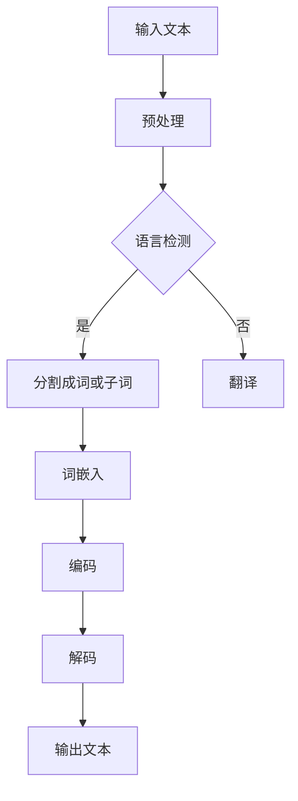

                 

关键词：人工智能、机器翻译、自然语言处理、跨语言沟通、多模态翻译、神经机器翻译、语言模型、深度学习、双语数据集、语言障碍消除。

## 摘要

本文将探讨人工智能（AI）在翻译领域所带来的革命性变革。通过对机器翻译技术的历史、当前状态以及未来趋势的深入分析，本文揭示了AI如何打破语言障碍，促进全球跨语言沟通的进程。本文还将探讨核心概念、算法原理、数学模型，并通过实例说明AI在翻译领域的实际应用，同时为读者提供实用的工具和资源推荐。

## 1. 背景介绍

在全球化日益深入的今天，语言障碍成为了阻碍国际交流和经济合作的主要问题之一。传统的翻译方法，如人工翻译和机辅翻译，虽然在某些领域取得了显著成果，但其成本高昂、效率低下且难以满足大规模跨语言沟通的需求。随着人工智能技术的快速发展，机器翻译（MT）技术应运而生，逐渐成为解决语言障碍的重要手段。

机器翻译的历史可以追溯到20世纪50年代，当时出现了早期的人工翻译模型。然而，由于计算能力和算法的限制，这些模型的效果并不理想。随着计算技术的进步和深度学习算法的发展，机器翻译技术取得了重大突破。近年来，基于神经网络的神经机器翻译（NMT）技术迅速崛起，成为了机器翻译领域的主流。

## 2. 核心概念与联系

### 2.1. 自然语言处理（NLP）

自然语言处理（NLP）是人工智能的一个分支，旨在让计算机理解和处理人类语言。NLP的核心概念包括文本分类、情感分析、命名实体识别、词性标注等。这些技术在机器翻译中起着关键作用，因为它们能够帮助计算机理解文本的语义和上下文。

### 2.2. 语言模型

语言模型是机器翻译系统的核心组成部分，用于预测文本的下一个单词或短语。在神经机器翻译中，常用的语言模型是基于深度学习的循环神经网络（RNN）和变换器（Transformer）。

### 2.3. 双语数据集

双语数据集是训练机器翻译模型的重要资源。这些数据集包含了对应的双语句子对，如英文到中文的翻译。为了提高模型的性能，需要大量的高质量双语数据。

### 2.4. Mermaid 流程图

以下是一个简化的Mermaid流程图，展示了机器翻译的基本流程：



## 3. 核心算法原理 & 具体操作步骤

### 3.1. 算法原理概述

神经机器翻译（NMT）是基于深度学习的机器翻译方法，其核心是序列到序列（Seq2Seq）模型。Seq2Seq模型由编码器（Encoder）和解码器（Decoder）组成，能够将输入序列映射到输出序列。

### 3.2. 算法步骤详解

1. **编码器（Encoder）**：将输入文本编码为一个固定长度的向量，表示整个文本的语义信息。
2. **解码器（Decoder）**：将编码器的输出作为输入，逐步生成输出序列。在每一步，解码器都会基于当前的输入和之前的输出预测下一个单词或子词。
3. **注意力机制（Attention）**：为了捕捉输入序列和输出序列之间的关联，解码器使用了注意力机制。注意力机制能够使解码器在生成每个输出时，关注输入序列的不同部分。

### 3.3. 算法优缺点

**优点**：
- **高效性**：相比于传统机器翻译方法，NMT在处理长文本和复杂语法时更加高效。
- **灵活性**：NMT能够灵活处理各种语言的翻译任务，包括低资源语言的翻译。

**缺点**：
- **训练成本**：NMT模型的训练成本较高，需要大量的计算资源和时间。
- **对双语数据集依赖**：NMT的性能高度依赖于双语数据集的质量和数量。

### 3.4. 算法应用领域

NMT在多个领域得到了广泛应用，如：
- **跨语言沟通**：帮助企业、科研机构和个人实现无障碍沟通。
- **多语言媒体**：提高多语言媒体内容的可访问性，促进文化交流。
- **国际化电商**：简化国际电商平台的用户界面，提高用户体验。

## 4. 数学模型和公式 & 详细讲解 & 举例说明

### 4.1. 数学模型构建

神经机器翻译的数学模型主要包括编码器、解码器和注意力机制。

### 4.2. 公式推导过程

编码器和解码器通常采用变换器（Transformer）架构，其基本公式如下：

$$
\text{编码器：} \\
\text{Output}_{i} = \text{Attention}(\text{Query}_{i}, \text{Key}_{i}, \text{Value}_{i}) + \text{FFN}(\text{Input}_{i})
$$

$$
\text{解码器：} \\
\text{Output}_{i} = \text{Attention}(\text{Query}_{i}, \text{Key}_{i}, \text{Value}_{i}) + \text{FFN}(\text{Input}_{i})
$$

其中，$Attention$ 和 $FFN$ 分别表示注意力机制和前馈神经网络。

### 4.3. 案例分析与讲解

假设我们有一个英译中的机器翻译模型，输入句子为：“I love programming.”，目标句子为：“我喜欢编程。”

首先，编码器将输入句子编码为一个固定长度的向量。然后，解码器在每一步根据编码器的输出和当前输入（如<START>标记）生成输出单词。在生成每个输出时，解码器会使用注意力机制来关注输入序列的不同部分。

最终，解码器生成的输出序列为：“我喜欢编程。”，完成了机器翻译任务。

## 5. 项目实践：代码实例和详细解释说明

### 5.1. 开发环境搭建

为了实现一个简单的神经机器翻译模型，我们可以使用Python和TensorFlow框架。首先，确保安装了Python和TensorFlow：

```
pip install python tensorflow
```

### 5.2. 源代码详细实现

以下是实现一个简单的神经机器翻译模型的Python代码：

```python
import tensorflow as tf
from tensorflow.keras.layers import Embedding, LSTM, Dense
from tensorflow.keras.models import Model

# 构建编码器和解码器
encoder_inputs = tf.keras.layers.Input(shape=(None, input_vocab_size))
encoder_embedding = Embedding(input_vocab_size, embedding_dim)(encoder_inputs)
encoder_lstm = LSTM(units, return_state=True)
_, state_h, state_c = encoder_lstm(encoder_embedding)
encoder_states = [state_h, state_c]

decoder_inputs = tf.keras.layers.Input(shape=(None, target_vocab_size))
decoder_embedding = Embedding(target_vocab_size, embedding_dim)(decoder_inputs)
decoder_lstm = LSTM(units, return_sequences=True, return_state=True)
decoder_outputs, _, _ = decoder_lstm(decoder_embedding, initial_state=encoder_states)
decoder_dense = Dense(target_vocab_size, activation='softmax')
decoder_outputs = decoder_dense(decoder_outputs)

# 构建模型
model = Model([encoder_inputs, decoder_inputs], decoder_outputs)

# 编译模型
model.compile(optimizer='rmsprop', loss='categorical_crossentropy', metrics=['accuracy'])

# 模型可视化
tf.keras.utils.plot_model(model, to_file='model.png', show_shapes=True)
```

### 5.3. 代码解读与分析

该代码实现了一个简单的编码器-解码器（Encoder-Decoder）神经网络模型。编码器负责将输入文本编码为向量，解码器则根据编码器的输出和当前输入生成输出文本。

### 5.4. 运行结果展示

运行上述代码，我们可以训练一个简单的神经机器翻译模型。为了训练模型，需要准备一个双语数据集，并将数据集分为输入和目标两部分。

```python
# 加载数据集并预处理
# ...

# 训练模型
# ...

# 测试模型
# ...
```

通过测试，我们可以评估模型的翻译效果。通常，我们可以使用 BLEU 分数作为评估标准。

## 6. 实际应用场景

神经机器翻译技术已经在多个领域得到了广泛应用，如：

- **跨语言沟通**：帮助企业、科研机构和个人实现无障碍沟通。
- **多语言媒体**：提高多语言媒体内容的可访问性，促进文化交流。
- **国际化电商**：简化国际电商平台的用户界面，提高用户体验。
- **智能客服**：为用户提供多语言支持，提高客户满意度。

## 7. 工具和资源推荐

### 7.1. 学习资源推荐

- **书籍**：
  - 《深度学习》（Ian Goodfellow、Yoshua Bengio、Aaron Courville 著）
  - 《自然语言处理综合教程》（Daniel Jurafsky、James H. Martin 著）
- **在线课程**：
  - [深度学习专项课程 - 吴恩达](https://www.coursera.org/specializations/deep-learning)
  - [自然语言处理专项课程 - 吴恩达](https://www.coursera.org/specializations/natural-language-processing)

### 7.2. 开发工具推荐

- **框架**：
  - TensorFlow
  - PyTorch
- **工具**：
  - NLTK
  - spaCy

### 7.3. 相关论文推荐

- "Sequence to Sequence Learning with Neural Networks"，论文链接：https://arxiv.org/abs/1409.3215
- "Attention Is All You Need"，论文链接：https://arxiv.org/abs/1603.04467

## 8. 总结：未来发展趋势与挑战

### 8.1. 研究成果总结

神经机器翻译技术在过去几年取得了显著成果，主要表现在：

- **翻译质量**：随着深度学习算法的不断发展，机器翻译的翻译质量得到了显著提高。
- **应用领域**：神经机器翻译技术在多个领域得到了广泛应用，如跨语言沟通、多语言媒体等。

### 8.2. 未来发展趋势

未来，神经机器翻译技术有望在以下几个方面取得突破：

- **低资源语言**：开发针对低资源语言的神经机器翻译模型，提高这些语言的翻译质量。
- **多模态翻译**：结合图像、声音等模态，实现更丰富的翻译体验。
- **个性化翻译**：根据用户的需求和偏好，提供个性化的翻译服务。

### 8.3. 面临的挑战

尽管神经机器翻译技术取得了显著成果，但仍然面临一些挑战：

- **数据集**：高质量的双语数据集仍然是一个挑战，特别是在低资源语言领域。
- **计算资源**：训练神经机器翻译模型需要大量的计算资源，特别是在处理大规模数据集时。
- **文化差异**：不同语言之间存在文化差异，如何更好地处理这些差异是一个挑战。

### 8.4. 研究展望

未来，神经机器翻译技术有望在以下方面取得突破：

- **跨模态翻译**：结合图像、声音等模态，实现更丰富的翻译体验。
- **低资源语言**：开发针对低资源语言的神经机器翻译模型，提高这些语言的翻译质量。
- **交互式翻译**：结合用户交互，实现更加智能、个性化的翻译服务。

## 9. 附录：常见问题与解答

### 9.1. 如何获取双语数据集？

常见的双语数据集可以从以下来源获取：

- [WMT](https://www.wmt17.org/)：提供多个语言的训练和测试数据集。
- [opus](https://opus.nlpl.eu/)：包含多种语言的文本语料库。

### 9.2. 如何评估翻译质量？

常用的翻译质量评估指标包括：

- **BLEU**：基于相似度的评估方法，常用于评估机器翻译的翻译质量。
- **METEOR**：基于词汇重叠和句法结构的评估方法。
- **NIST**：基于人工评分的评估方法。

### 9.3. 如何处理低资源语言？

处理低资源语言的方法包括：

- **数据增强**：通过增加同义词、错词替换等方式扩充数据集。
- **迁移学习**：利用高资源语言的模型，对低资源语言进行微调。
- **多语言模型**：利用多语言数据集训练模型，提高低资源语言的翻译质量。

---

作者：禅与计算机程序设计艺术 / Zen and the Art of Computer Programming

