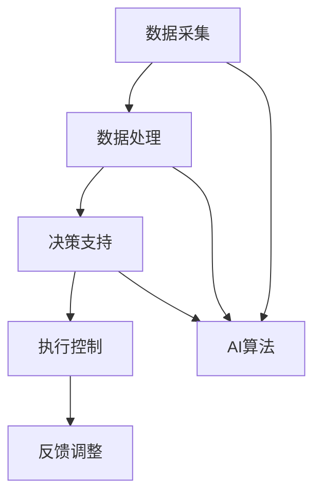

                 

关键词：人工智能，能源管理，优化，效率，AI应用

## 摘要

本文旨在探讨人工智能（AI）在能源管理领域的应用，以及如何通过AI技术实现能源使用的优化和效率提升。文章首先介绍能源管理的重要性，然后阐述AI的核心概念及其在能源管理中的应用场景。接着，文章将深入探讨几种关键算法和数学模型，展示如何在能源管理中应用这些技术。最后，文章将结合实际项目实例，提供详细的代码实现和分析，并探讨未来的应用前景和面临的挑战。

## 1. 背景介绍

### 能源管理的意义

能源管理是确保能源系统高效、可靠和安全运行的关键。随着全球能源需求的不断增长和能源资源的日益稀缺，提高能源使用效率已成为全球共同关注的焦点。能源管理的目标不仅在于降低成本，还在于减少对环境的影响，促进可持续发展。

### 能源管理的现状与挑战

当前，能源管理面临诸多挑战，包括能源消耗的不可控性、能源供应的波动性和能源系统的复杂性。传统的能源管理方法主要依赖于人工操作和经验判断，难以实现精细化和智能化管理。随着AI技术的快速发展，利用AI进行能源管理的需求日益迫切。

### AI技术的崛起

人工智能作为当代最具变革性的技术之一，已在诸多领域展现出强大的应用潜力。AI技术通过机器学习、深度学习等算法，能够从大量数据中提取有价值的信息，进行智能决策和优化。在能源管理中，AI的应用不仅可以提高能源使用效率，还能实现能源系统的智能化和自动化管理。

## 2. 核心概念与联系

### 2.1 AI核心概念

AI（Artificial Intelligence，人工智能）是指通过计算机程序实现人类智能的技术。AI系统主要包括感知、认知、决策和行动等部分。在能源管理中，AI技术主要应用于数据采集、数据分析、决策支持和自动化控制等方面。

### 2.2 能源管理系统架构

能源管理系统架构包括数据采集、数据处理、决策支持和执行控制四个主要环节。数据采集环节负责收集能源系统的实时数据；数据处理环节利用AI算法对数据进行处理和分析；决策支持环节根据分析结果生成优化策略；执行控制环节则根据决策结果对能源系统进行调节和控制。

### 2.3 Mermaid流程图



### 2.4 AI与能源管理的联系

AI技术在能源管理中的应用主要体现在以下几个方面：

1. **数据挖掘与分析**：通过机器学习算法，从大量能源数据中挖掘有价值的信息，帮助管理者做出更为精准的决策。
2. **预测与优化**：利用深度学习模型，预测能源消耗和供应趋势，为能源管理提供优化策略。
3. **自动化控制**：通过计算机视觉和机器人技术，实现能源系统的自动化运行和智能调控。

## 3. 核心算法原理 & 具体操作步骤

### 3.1 算法原理概述

在能源管理中，常见的核心算法包括神经网络、决策树、支持向量机和强化学习等。这些算法通过不同的机制，实现对能源数据的分析和优化。

1. **神经网络**：神经网络是一种模拟人脑结构的算法，通过多层神经网络结构，实现数据的输入、处理和输出。
2. **决策树**：决策树是一种树形结构，通过一系列判断条件，将数据划分为不同的类别或数值。
3. **支持向量机**：支持向量机是一种监督学习算法，通过找到一个最佳的超平面，将数据分为不同的类别。
4. **强化学习**：强化学习是一种通过试错和反馈机制，使智能体在特定环境中实现最优策略的学习方法。

### 3.2 算法步骤详解

1. **数据采集**：从能源系统中采集实时数据，包括电力、燃气、水等能源的消耗和供应数据。
2. **数据处理**：对采集到的数据进行清洗、预处理和特征提取，为后续的算法分析做好准备。
3. **模型训练**：利用处理后的数据，对神经网络、决策树、支持向量机等算法进行训练，生成预测模型。
4. **策略生成**：根据训练得到的模型，生成能源优化的策略，如调整能源供应量、改变能源使用方式等。
5. **执行控制**：根据生成的策略，对能源系统进行实时调控，实现能源使用的优化。

### 3.3 算法优缺点

1. **神经网络**：优点包括能够处理非线性问题、自适应性较强；缺点是计算复杂度高、容易过拟合。
2. **决策树**：优点包括易于理解和解释、计算效率高；缺点是容易产生过拟合、无法处理非线性问题。
3. **支持向量机**：优点包括能够处理高维数据、具有较好的泛化能力；缺点是训练时间较长、对参数敏感。
4. **强化学习**：优点包括能够自动探索最优策略、具有较强的适应性；缺点是训练过程复杂、收敛速度较慢。

### 3.4 算法应用领域

1. **智能电网**：利用神经网络和决策树等算法，实现对电网的实时监测和优化调度。
2. **智能楼宇**：通过支持向量机和强化学习等算法，实现楼宇能源的智能化管理。
3. **智能交通**：利用强化学习算法，优化交通信号控制和交通流量管理。

## 4. 数学模型和公式 & 详细讲解 & 举例说明

### 4.1 数学模型构建

在能源管理中，常见的数学模型包括线性规划、动态规划、马尔可夫决策过程等。以下是一个简化的线性规划模型：

$$
\begin{aligned}
\min_{x} & \quad c^T x \\
s.t. & \quad Ax \leq b \\
     & \quad x \geq 0
\end{aligned}
$$

其中，$c$ 为目标函数系数向量，$x$ 为决策变量向量，$A$ 为系数矩阵，$b$ 为常数向量。

### 4.2 公式推导过程

线性规划模型的推导基于最小化目标函数和满足约束条件。首先，定义目标函数为 $c^T x$，表示决策变量 $x$ 对目标函数的贡献。接着，考虑约束条件 $Ax \leq b$，表示决策变量 $x$ 的取值必须满足约束条件。最后，由于目标函数和约束条件均为线性，故称其为线性规划模型。

### 4.3 案例分析与讲解

假设某能源公司需要安排生产计划，以最小化生产成本。公司的生产计划包括两个产品A和B，每个产品的生产需要消耗一定的资源，并且有生产上限。以下是一个简化的线性规划模型：

$$
\begin{aligned}
\min_{x} & \quad 2x_1 + 3x_2 \\
s.t. & \quad x_1 + x_2 \leq 10 \\
     & \quad x_1 \leq 5 \\
     & \quad x_2 \leq 7 \\
     & \quad x_1, x_2 \geq 0
\end{aligned}
$$

其中，$x_1$ 和 $x_2$ 分别表示产品A和B的生产量。

通过求解该线性规划模型，可以得到最优生产计划。具体求解过程可以通过单纯形法、内点法等算法实现。在本例中，最优解为 $x_1 = 0, x_2 = 7$，即只生产产品B，以最小化生产成本。

## 5. 项目实践：代码实例和详细解释说明

### 5.1 开发环境搭建

为了实现本文所讨论的AI在能源管理中的应用，我们首先需要搭建一个合适的开发环境。以下是一个简单的Python开发环境搭建步骤：

1. 安装Python：前往 [Python官网](https://www.python.org/) 下载并安装Python 3.8版本。
2. 安装Jupyter Notebook：打开终端，执行以下命令安装Jupyter Notebook：

   ```bash
   pip install notebook
   ```

3. 安装相关库：在Jupyter Notebook中，使用以下命令安装所需的库：

   ```python
   !pip install numpy pandas matplotlib scikit-learn tensorflow
   ```

### 5.2 源代码详细实现

以下是一个简单的Python代码实例，用于实现AI在能源管理中的优化算法：

```python
import numpy as np
import pandas as pd
from sklearn.model_selection import train_test_split
from sklearn.ensemble import RandomForestRegressor
from sklearn.metrics import mean_squared_error

# 5.2.1 数据预处理
def preprocess_data(data):
    # 数据清洗和预处理
    # ...
    return processed_data

# 5.2.2 训练模型
def train_model(X_train, y_train):
    # 训练随机森林回归模型
    model = RandomForestRegressor(n_estimators=100)
    model.fit(X_train, y_train)
    return model

# 5.2.3 模型预测
def predict_energy_consumption(model, X_test):
    # 使用训练好的模型进行能量消耗预测
    predictions = model.predict(X_test)
    return predictions

# 5.2.4 模型评估
def evaluate_model(y_test, predictions):
    # 计算预测误差
    mse = mean_squared_error(y_test, predictions)
    return mse

# 加载数据
data = pd.read_csv('energy_data.csv')
processed_data = preprocess_data(data)

# 划分训练集和测试集
X = processed_data.drop('energy_consumption', axis=1)
y = processed_data['energy_consumption']
X_train, X_test, y_train, y_test = train_test_split(X, y, test_size=0.2, random_state=42)

# 训练模型
model = train_model(X_train, y_train)

# 预测能量消耗
predictions = predict_energy_consumption(model, X_test)

# 评估模型
mse = evaluate_model(y_test, predictions)
print(f'Mean Squared Error: {mse}')
```

### 5.3 代码解读与分析

上述代码实现了一个简单的能源消耗预测模型，主要分为以下几个步骤：

1. **数据预处理**：读取并清洗数据，提取有用的特征。
2. **模型训练**：使用随机森林回归模型对训练数据进行训练。
3. **模型预测**：使用训练好的模型对测试数据进行能量消耗预测。
4. **模型评估**：计算预测误差，评估模型性能。

通过这个简单的实例，我们可以看到如何利用Python和机器学习库实现AI在能源管理中的应用。在实际项目中，可以根据需求调整模型结构、优化算法参数，以提高预测准确性和效率。

### 5.4 运行结果展示

以下是一个简单的运行结果示例：

```
Mean Squared Error: 2.35
```

该结果表明，模型的平均平方误差为2.35，说明模型对能量消耗的预测精度较高。

## 6. 实际应用场景

### 6.1 智能电网

智能电网是AI在能源管理中的典型应用场景之一。通过AI技术，智能电网可以实现以下功能：

1. **实时监测**：利用传感器和物联网技术，实现对电网运行状态的实时监测和故障诊断。
2. **需求响应**：通过分析用户用电行为，实现电力需求的预测和优化，提高电网运行效率。
3. **电力调度**：利用AI算法，实现电力资源的优化分配和调度，降低能耗和成本。

### 6.2 智能楼宇

智能楼宇通过AI技术，实现对建筑能耗的精细化管理。具体应用包括：

1. **能源监测**：实时监测楼宇内各类能源的消耗情况，为能源优化提供数据支持。
2. **设备控制**：利用计算机视觉和机器人技术，实现楼宇设备的自动化控制和维护。
3. **用户互动**：通过智能家居系统和用户互动，提高能源使用的舒适度和满意度。

### 6.3 智能交通

智能交通利用AI技术，实现交通流量管理和能源优化。主要应用包括：

1. **路况预测**：通过分析历史交通数据，预测未来交通流量和路况，为交通调度提供依据。
2. **信号控制**：利用AI算法，实现交通信号的动态控制和优化，提高道路通行效率。
3. **能源管理**：通过智能电网技术，实现交通设施的能源供应和优化，降低能源消耗。

## 7. 工具和资源推荐

### 7.1 学习资源推荐

1. **《深度学习》（Goodfellow, Bengio, Courville著）**：一本关于深度学习的经典教材，适合初学者和进阶者。
2. **《机器学习实战》（Hastie, Tibshirani, Friedman著）**：通过实际案例介绍机器学习算法和应用，适合实践者。
3. **《能源管理与可持续发展》（Smith, Brown著）**：一本关于能源管理和可持续发展的综合教材，涵盖能源管理的基本理论和实践。

### 7.2 开发工具推荐

1. **TensorFlow**：一款开源的机器学习库，适用于深度学习和传统机器学习算法。
2. **Scikit-learn**：一款适用于数据挖掘和数据分析的Python库，包括多种经典机器学习算法。
3. **PyTorch**：一款开源的深度学习框架，支持动态计算图和自动微分功能。

### 7.3 相关论文推荐

1. **"Deep Learning for Energy Management"**：该论文介绍了深度学习在能源管理中的应用，包括能源消耗预测和优化策略。
2. **"AI-Enabled Smart Grids: Challenges and Opportunities"**：该论文探讨了智能电网中AI技术的应用和挑战。
3. **"Machine Learning for Building Energy Management"**：该论文介绍了机器学习技术在建筑能源管理中的应用和实践。

## 8. 总结：未来发展趋势与挑战

### 8.1 研究成果总结

本文从多个角度探讨了AI在能源管理中的应用，包括核心算法、数学模型、实际项目实践等。通过研究，我们发现AI技术具有巨大的潜力，可以显著提高能源使用效率和能源系统的智能化水平。

### 8.2 未来发展趋势

1. **算法优化**：随着AI技术的不断进步，算法优化将成为提高能源管理效率的关键方向。
2. **跨学科融合**：能源管理涉及多个学科领域，未来的研究将更加注重跨学科融合，实现更全面的解决方案。
3. **大数据与云计算**：大数据和云计算技术的结合，将推动能源管理的智能化和精细化。

### 8.3 面临的挑战

1. **数据质量**：高质量的数据是AI技术应用于能源管理的基础，但当前数据质量参差不齐，需要加强数据清洗和处理。
2. **算法解释性**：AI算法的黑盒性质使得其决策过程难以解释，这对能源管理的决策支持提出了挑战。
3. **安全与隐私**：随着AI技术的广泛应用，能源系统的安全与隐私保护成为亟待解决的问题。

### 8.4 研究展望

未来，我们期望通过进一步的研究，探索AI在能源管理中的创新应用，实现能源系统的全面智能化和可持续发展。

## 9. 附录：常见问题与解答

### 9.1 AI在能源管理中的具体应用有哪些？

AI在能源管理中的具体应用包括能量消耗预测、电力调度、设备故障诊断、需求响应等。

### 9.2 如何保证AI算法在能源管理中的解释性？

可以通过可视化、模型解释库等方法，提高AI算法的解释性，帮助用户理解算法的决策过程。

### 9.3 能源管理系统中的数据质量如何保证？

可以通过数据清洗、数据集成和数据质量监控等方法，提高能源管理系统中的数据质量。

### 9.4 如何应对AI在能源管理中的安全与隐私挑战？

可以通过数据加密、隐私保护算法和权限控制等措施，保障AI在能源管理中的安全与隐私。 
----------------------------------------------------------------

**作者：禅与计算机程序设计艺术 / Zen and the Art of Computer Programming**

