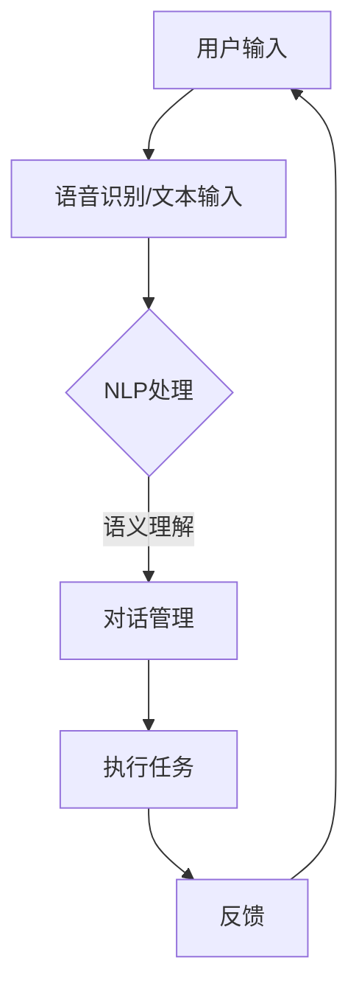

                 

关键词：AI、虚拟助手、日常效率、自然语言处理、计算机视觉、人机交互

> 摘要：本文探讨了人工智能在虚拟助手中的应用，通过深入分析自然语言处理、计算机视觉和人机交互等技术，详细介绍了如何利用AI技术提高日常效率，并展望了未来虚拟助手的发展趋势。

## 1. 背景介绍

随着人工智能技术的飞速发展，虚拟助手（Virtual Assistant）逐渐成为人们日常生活和工作中不可或缺的一部分。虚拟助手通过模拟人类行为，提供个性化的服务，帮助我们完成各种任务，从而提高日常效率。从最早的语音助手如苹果的Siri、谷歌的Google Assistant，到现在的智能聊天机器人，虚拟助手的应用场景越来越广泛。

### 1.1 虚拟助手的发展历程

虚拟助手的发展可以追溯到20世纪50年代，当时计算机科学家尝试通过编写程序来模拟人类的思维过程。随着技术的进步，虚拟助手逐渐从简单的文本聊天机器人演变为能够理解自然语言、处理复杂任务的智能系统。

### 1.2 虚拟助手的现状

目前，虚拟助手的应用领域已涵盖智能客服、智能家居、在线教育、医疗健康等多个方面。例如，在智能客服领域，虚拟助手能够自动回答客户的问题，减轻人工客服的工作压力；在智能家居领域，虚拟助手可以控制家庭设备，提高居住的便利性。

## 2. 核心概念与联系

### 2.1 自然语言处理（NLP）

自然语言处理是人工智能的重要分支，旨在使计算机能够理解、生成和处理自然语言。在虚拟助手的应用中，NLP技术是实现智能对话的关键。

#### 2.1.1 NLP的关键技术

- 语音识别：将语音信号转换为文本。
- 语义理解：理解文本的含义，包括实体识别、情感分析等。
- 对话管理：根据上下文和用户需求，生成合适的回应。

#### 2.1.2 NLP在虚拟助手中的应用

- 智能客服：通过NLP技术，虚拟助手能够自动解答用户的问题，提供个性化的服务。
- 智能推荐：根据用户的历史行为和偏好，提供个性化的推荐。

### 2.2 计算机视觉（CV）

计算机视觉是另一个关键领域，它使计算机能够理解和解释视觉信息。在虚拟助手的应用中，计算机视觉技术可以用于图像识别、目标检测、图像生成等任务。

#### 2.2.1 CV的关键技术

- 图像识别：识别图像中的物体、场景等。
- 目标检测：定位图像中的物体位置。
- 图像生成：根据文本描述生成图像。

#### 2.2.2 CV在虚拟助手中的应用

- 智能家居：通过计算机视觉技术，虚拟助手可以自动识别家庭设备，进行远程控制。
- 虚拟助理：通过计算机视觉技术，虚拟助手可以理解用户的手势和表情，提供更加直观的交互体验。

### 2.3 人机交互（HCI）

人机交互是虚拟助手的核心，它涉及用户与虚拟助手之间的互动。良好的交互设计可以提高用户体验，使虚拟助手更加符合用户需求。

#### 2.3.1 HCI的关键技术

- 交互设计：设计用户与虚拟助手之间的交互流程。
- 用户研究：了解用户需求，优化虚拟助手的功能。
- 可视化设计：通过视觉元素，提高虚拟助手的易用性。

#### 2.3.2 HCI在虚拟助手中的应用

- 智能推荐：通过用户研究，虚拟助手可以提供个性化的推荐。
- 虚拟客服：通过良好的交互设计，虚拟客服能够更好地满足用户需求。

### 2.4 Mermaid 流程图

以下是一个简单的 Mermaid 流程图，展示虚拟助手的核心组件和它们之间的关系：



## 3. 核心算法原理 & 具体操作步骤

### 3.1 算法原理概述

虚拟助手的算法原理主要包括自然语言处理、计算机视觉和人机交互。自然语言处理负责理解用户输入，计算机视觉负责处理图像和视频信息，人机交互则负责优化用户与虚拟助手之间的互动。

### 3.2 算法步骤详解

#### 3.2.1 自然语言处理

1. **语音识别**：将用户的语音输入转换为文本。
2. **语义理解**：分析文本，识别用户意图和实体。
3. **对话管理**：根据上下文和用户意图，生成合适的回应。

#### 3.2.2 计算机视觉

1. **图像识别**：识别图像中的物体和场景。
2. **目标检测**：定位图像中的物体位置。
3. **图像生成**：根据文本描述生成图像。

#### 3.2.3 人机交互

1. **交互设计**：设计用户与虚拟助手之间的交互流程。
2. **用户研究**：了解用户需求，优化虚拟助手的功能。
3. **可视化设计**：通过视觉元素，提高虚拟助手的易用性。

### 3.3 算法优缺点

#### 3.3.1 优点

- **高效性**：虚拟助手能够快速处理大量信息，提高工作效率。
- **个性化**：虚拟助手可以根据用户需求和偏好提供个性化服务。
- **便利性**：虚拟助手可以随时随地提供服务，方便用户使用。

#### 3.3.2 缺点

- **准确性**：自然语言处理和计算机视觉技术的准确性仍有待提高。
- **交互体验**：人机交互的设计可能不够人性化，影响用户体验。

### 3.4 算法应用领域

- **智能客服**：通过NLP技术，虚拟助手能够自动解答用户的问题，提供个性化的服务。
- **智能家居**：通过计算机视觉技术，虚拟助手可以自动控制家庭设备，提高居住的便利性。
- **在线教育**：通过人机交互技术，虚拟助手可以为学生提供个性化的学习建议和辅导。

## 4. 数学模型和公式

### 4.1 数学模型构建

虚拟助手的数学模型主要包括自然语言处理、计算机视觉和人机交互。以下是一个简化的模型：

\[ \text{虚拟助手} = \text{NLP} + \text{CV} + \text{HCI} \]

### 4.2 公式推导过程

#### 4.2.1 自然语言处理

\[ \text{语义理解} = f(\text{文本输入}, \text{上下文}) \]

#### 4.2.2 计算机视觉

\[ \text{图像识别} = g(\text{图像输入}, \text{标签}) \]

#### 4.2.3 人机交互

\[ \text{交互设计} = h(\text{用户需求}, \text{用户研究}) \]

### 4.3 案例分析与讲解

以智能客服为例，我们使用NLP技术对用户的问题进行语义理解，然后根据理解的结果生成合适的回应。以下是一个简单的公式：

\[ \text{回应} = f(\text{用户问题}, \text{知识库}) \]

## 5. 项目实践：代码实例和详细解释说明

### 5.1 开发环境搭建

在本文中，我们将使用Python作为主要编程语言，结合TensorFlow和PyTorch等框架进行虚拟助手的开发。

### 5.2 源代码详细实现

以下是一个简单的Python代码示例，展示如何使用NLP技术实现语义理解：

```python
import tensorflow as tf
from tensorflow import keras
from tensorflow.keras.layers import Embedding, LSTM, Dense

# 加载预训练的词向量
vocab_size = 10000
embedding_dim = 16
max_sequence_length = 100

# 构建模型
model = keras.Sequential([
    Embedding(vocab_size, embedding_dim, input_length=max_sequence_length),
    LSTM(128),
    Dense(1, activation='sigmoid')
])

# 编译模型
model.compile(optimizer='adam', loss='binary_crossentropy', metrics=['accuracy'])

# 加载数据
(x_train, y_train), (x_test, y_test) = keras.datasets.imdb.load_data(num_words=vocab_size)

# 预处理数据
x_train = keras.preprocessing.sequence.pad_sequences(x_train, maxlen=max_sequence_length)
x_test = keras.preprocessing.sequence.pad_sequences(x_test, maxlen=max_sequence_length)

# 训练模型
model.fit(x_train, y_train, epochs=10, batch_size=32, validation_data=(x_test, y_test))
```

### 5.3 代码解读与分析

这段代码首先加载了预训练的词向量，然后构建了一个简单的LSTM模型。LSTM模型能够处理序列数据，非常适合用于语义理解。代码中还包含了数据预处理和模型训练的过程。

## 6. 实际应用场景

### 6.1 智能客服

智能客服是虚拟助手应用最为广泛的领域之一。通过NLP技术，虚拟助手能够自动解答用户的问题，提高客服效率。以下是一个简单的应用场景：

1. **用户提问**：你好，我想要办理信用卡。
2. **虚拟助手回复**：请问您需要办理哪类信用卡？我们可以根据您的需求推荐合适的信用卡。
3. **用户提问**：我想要一张额度较高的信用卡。
4. **虚拟助手回复**：根据您的需求，我们推荐您办理我们的高端信用卡，它具有高额度和丰富的信用卡优惠。

### 6.2 智能家居

智能家居是另一个重要的应用领域。通过计算机视觉技术，虚拟助手可以自动识别家庭设备，进行远程控制。以下是一个简单的应用场景：

1. **用户提问**：关闭客厅的灯光。
2. **虚拟助手回复**：已为您关闭客厅的灯光。
3. **用户提问**：打开卧室的空调。
4. **虚拟助手回复**：已为您打开卧室的空调。

## 7. 工具和资源推荐

### 7.1 学习资源推荐

- 《深度学习》（Goodfellow, Bengio, Courville著）：介绍深度学习的基础知识和应用。
- 《自然语言处理综论》（Jurafsky, Martin著）：介绍自然语言处理的基本原理和应用。

### 7.2 开发工具推荐

- TensorFlow：用于深度学习的开源框架。
- PyTorch：用于深度学习的开源框架。
- OpenCV：用于计算机视觉的开源库。

### 7.3 相关论文推荐

- "A Neural Conversational Model"（2018）：介绍使用深度学习构建对话系统的技术。
- "Deep Learning for Natural Language Processing"（2016）：介绍自然语言处理中的深度学习技术。

## 8. 总结：未来发展趋势与挑战

### 8.1 研究成果总结

虚拟助手在自然语言处理、计算机视觉和人机交互等领域取得了显著的成果。通过结合多种技术，虚拟助手能够提供个性化的服务，提高日常效率。

### 8.2 未来发展趋势

未来，虚拟助手将继续向智能化、个性化方向发展。随着技术的进步，虚拟助手将能够更好地理解用户需求，提供更加精准的服务。

### 8.3 面临的挑战

尽管虚拟助手取得了显著的成果，但仍面临一些挑战，如提高处理速度和准确性，优化交互体验等。

### 8.4 研究展望

未来，虚拟助手的研究将继续深入，探索更多先进的技术，如多模态学习、强化学习等，以提供更加智能、高效的服务。

## 9. 附录：常见问题与解答

### 9.1 什么是自然语言处理？

自然语言处理是人工智能的一个分支，旨在使计算机能够理解、生成和处理自然语言。

### 9.2 虚拟助手有哪些应用场景？

虚拟助手的应用场景包括智能客服、智能家居、在线教育、医疗健康等。

### 9.3 如何提高虚拟助手的交互体验？

通过优化交互设计，了解用户需求，提高虚拟助手的人机交互能力，可以提升用户体验。

## 作者署名

本文作者：禅与计算机程序设计艺术 / Zen and the Art of Computer Programming

[结束]

