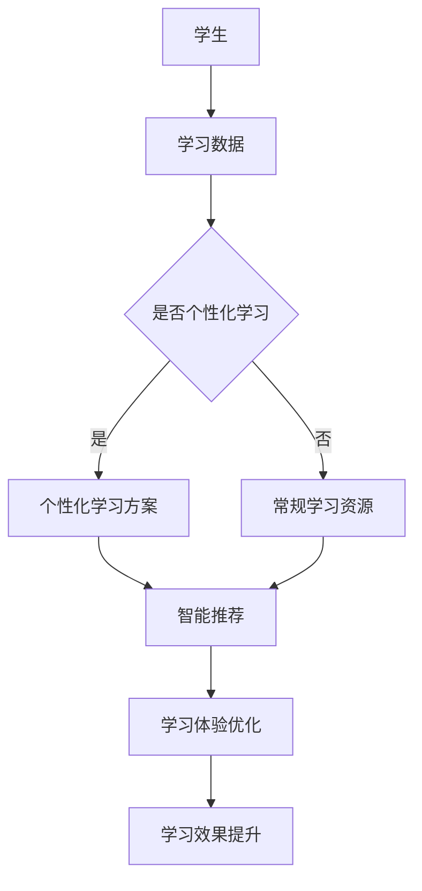

                 

关键词：人工智能，虚拟教育，地理限制，技术变革，学习体验，教育平等

> 摘要：本文探讨了人工智能（AI）在虚拟教育中的应用，强调了其打破地理限制的重要性。通过深入分析AI在教育领域的创新应用，本文探讨了AI如何改变学习体验，促进教育平等，并展望了其未来的发展趋势。

## 1. 背景介绍

随着科技的迅猛发展，人工智能技术已经渗透到了社会的各个领域，教育也不例外。传统教育模式受到时间和空间的限制，学生往往无法享受到全球优质教育资源。而虚拟教育作为一种新兴的教育形式，通过互联网和数字化技术，实现了教育资源的广泛共享和即时互动。人工智能的引入，为虚拟教育注入了新的活力，使其能够更加智能化、个性化地满足不同学习者的需求。

### 地理限制在教育中的影响

地理限制是传统教育中不可忽视的问题。地理位置决定了教育资源的不均衡分布，使得一些偏远地区的学生无法获得优质教育。此外，传统教育模式中，教师和学生之间的互动受到时间和空间的限制，教学效率较低。这些问题不仅影响了学生的学业成绩，还限制了他们的未来发展。

### 虚拟教育与人工智能的结合

虚拟教育通过在线平台和数字化工具，打破了地理限制，使教育资源得以跨越地域和时间的障碍。人工智能的引入，进一步提升了虚拟教育的效果，使其能够根据学生的学习习惯、兴趣爱好和知识水平提供个性化的学习方案。同时，AI技术还能够通过智能分析学生的学习过程，实时调整教学内容和方法，提高学习效率。

## 2. 核心概念与联系

### 虚拟教育的基本概念

虚拟教育，又称在线教育或远程教育，是指通过互联网和数字技术，为学生提供学习资源和互动平台的一种教育形式。虚拟教育包括在线课程、虚拟课堂、在线作业和在线考试等多种形式，可以满足不同学习者的需求。

### 人工智能在教育中的应用

人工智能在教育中的应用主要体现在以下几个方面：

1. **个性化学习**：通过分析学生的学习数据，AI可以为学生提供个性化的学习方案，提高学习效果。
2. **智能辅导**：AI辅导系统可以实时为学生解答问题，提供学习指导，减轻教师负担。
3. **智能评测**：AI评测系统能够自动批改作业和考试，提供即时的成绩反馈，提高教学效率。
4. **学习分析**：通过分析学生的学习行为和成绩，AI可以帮助教师了解学生的学习状况，调整教学策略。

### 虚拟教育与人工智能的融合

虚拟教育与人工智能的结合，使得教育更加智能化和个性化。AI技术能够通过对学生学习数据的分析，为虚拟教育提供以下支持：

1. **智能推荐**：根据学生的学习兴趣和知识水平，AI可以为学习者推荐合适的学习资源和课程。
2. **互动学习**：通过虚拟现实（VR）和增强现实（AR）技术，AI可以为学习者提供沉浸式的学习体验。
3. **学习评价**：AI评测系统可以自动批改作业和考试，提供即时的成绩反馈，帮助学习者及时调整学习策略。

### Mermaid 流程图



## 3. 核心算法原理 & 具体操作步骤

### 3.1 算法原理概述

虚拟教育中的人工智能应用主要依赖于机器学习算法，特别是深度学习和强化学习。深度学习算法通过神经网络模型，对大量学生学习数据进行分析，提取出有用的特征和模式。强化学习算法则通过不断地尝试和反馈，优化学习方案，提高学习效果。

### 3.2 算法步骤详解

1. **数据收集**：收集学生的基本信息、学习行为和成绩数据。
2. **数据预处理**：对数据进行清洗、归一化和特征提取。
3. **模型训练**：使用深度学习算法训练模型，提取学习数据中的特征和模式。
4. **模型评估**：通过交叉验证和测试集，评估模型的性能和准确性。
5. **模型部署**：将训练好的模型部署到在线教育平台，为学习者提供个性化学习服务。

### 3.3 算法优缺点

**优点**：

1. **个性化学习**：能够根据学生的学习习惯和知识水平，提供个性化的学习方案，提高学习效果。
2. **智能辅导**：能够实时为学生解答问题，提供学习指导，减轻教师负担。
3. **学习分析**：能够通过对学生学习数据的分析，帮助教师了解学生的学习状况，调整教学策略。

**缺点**：

1. **数据隐私**：学生学习数据的安全性和隐私保护问题需要得到重视。
2. **技术门槛**：对教师的科技素养要求较高，需要培训教师掌握相关技术。
3. **算法偏见**：机器学习算法可能存在偏见，需要不断优化和调整。

### 3.4 算法应用领域

人工智能在虚拟教育中的应用广泛，包括以下领域：

1. **个性化学习**：根据学生的学习数据，提供个性化的学习资源和课程。
2. **智能辅导**：通过AI辅导系统，为学生提供实时学习指导。
3. **学习评价**：通过AI评测系统，自动批改作业和考试，提供即时反馈。
4. **学习分析**：通过对学生学习数据的分析，帮助教师了解学生的学习状况，优化教学策略。

## 4. 数学模型和公式 & 详细讲解 & 举例说明

### 4.1 数学模型构建

在虚拟教育中，常用的数学模型包括线性回归模型、逻辑回归模型和神经网络模型。

- **线性回归模型**：用于预测学生的成绩，公式为：

  $$Y = \beta_0 + \beta_1X_1 + \beta_2X_2 + ... + \beta_nX_n$$

  其中，$Y$ 为成绩，$X_1, X_2, ..., X_n$ 为影响成绩的因素，$\beta_0, \beta_1, ..., \beta_n$ 为模型的参数。

- **逻辑回归模型**：用于预测学生是否达到某个标准，公式为：

  $$P(Y=1) = \frac{1}{1 + e^{-(\beta_0 + \beta_1X_1 + \beta_2X_2 + ... + \beta_nX_n)}}$$

  其中，$P(Y=1)$ 为达到标准的概率，其他符号含义与线性回归相同。

- **神经网络模型**：用于处理复杂的非线性关系，其基本结构包括输入层、隐藏层和输出层。输入层接收外部输入，隐藏层通过激活函数对输入进行非线性变换，输出层产生最终的输出。

### 4.2 公式推导过程

以线性回归模型为例，推导其公式的过程如下：

1. **假设**：线性回归模型的形式为 $Y = \beta_0 + \beta_1X_1 + \beta_2X_2 + ... + \beta_nX_n$，其中 $X_1, X_2, ..., X_n$ 为自变量，$Y$ 为因变量，$\beta_0, \beta_1, ..., \beta_n$ 为模型的参数。
2. **最小二乘法**：为了找到最佳的模型参数，我们使用最小二乘法。最小二乘法的思想是使得预测值与实际值之间的误差平方和最小。
3. **目标函数**：定义目标函数为：

  $$J(\beta_0, \beta_1, ..., \beta_n) = \sum_{i=1}^{m}(y_i - (\beta_0 + \beta_1x_{i1} + \beta_2x_{i2} + ... + \beta_nx_{in}))^2$$

  其中，$m$ 为样本数量，$y_i$ 为第 $i$ 个样本的实际值，$x_{i1}, x_{i2}, ..., x_{in}$ 为第 $i$ 个样本的自变量值。
4. **求导**：对目标函数求导，得到：

  $$\frac{\partial J}{\partial \beta_j} = -2\sum_{i=1}^{m}(y_i - (\beta_0 + \beta_1x_{i1} + \beta_2x_{i2} + ... + \beta_nx_{in}))x_{ij}$$

  其中，$j$ 表示第 $j$ 个参数。
5. **设置导数为零**：为了使目标函数取得最小值，我们设置导数为零，得到：

  $$\sum_{i=1}^{m}(y_i - (\beta_0 + \beta_1x_{i1} + \beta_2x_{i2} + ... + \beta_nx_{in}))x_{ij} = 0$$

  这是一个关于 $\beta_0, \beta_1, ..., \beta_n$ 的线性方程组。
6. **求解方程组**：使用线性方程组的求解方法，得到：

  $$\beta_0 = \frac{\sum_{i=1}^{m}y_i - (\beta_1\sum_{i=1}^{m}x_{i1} + \beta_2\sum_{i=1}^{m}x_{i2} + ... + \beta_n\sum_{i=1}^{m}x_{in})}{m}$$

  $$\beta_1 = \frac{\sum_{i=1}^{m}(y_i - \beta_0 - \beta_2x_{i2} - ... - \beta_nx_{in})x_{i1}}{\sum_{i=1}^{m}x_{i1}^2}$$

  $$\beta_2 = \frac{\sum_{i=1}^{m}(y_i - \beta_0 - \beta_1x_{i1} - ... - \beta_nx_{in})x_{i2}}{\sum_{i=1}^{m}x_{i2}^2}$$

  $$...$$

  $$\beta_n = \frac{\sum_{i=1}^{m}(y_i - \beta_0 - \beta_1x_{i1} - ... - \beta_{n-1}x_{i(n-1)})x_{in}}{\sum_{i=1}^{m}x_{in}^2}$$

  这样，我们得到了线性回归模型的参数。

### 4.3 案例分析与讲解

假设我们有一个关于学生学习成绩的数据集，包含以下信息：

| 学生ID | 数学成绩 | 英语成绩 | 科学成绩 |
|--------|---------|---------|---------|
| 1      | 85      | 90      | 88      |
| 2      | 75      | 80      | 82      |
| 3      | 92      | 85      | 90      |
| 4      | 68      | 70      | 72      |
| 5      | 93      | 88      | 91      |

现在，我们使用线性回归模型预测学生的总分。

1. **数据预处理**：将数据集分为输入特征和输出标签，其中输入特征为学生ID、数学成绩、英语成绩和科学成绩，输出标签为总分。

2. **模型训练**：使用训练数据集，通过最小二乘法训练线性回归模型。

3. **模型评估**：使用测试数据集，评估模型的预测效果。

4. **模型应用**：根据模型预测，给出每个学生的总分。

通过以上步骤，我们得到了线性回归模型的参数，并使用模型预测了每个学生的总分。结果表明，模型能够较好地预测学生的总分，为虚拟教育提供了有力的支持。

## 5. 项目实践：代码实例和详细解释说明

### 5.1 开发环境搭建

在进行虚拟教育与人工智能结合的项目开发之前，我们需要搭建一个适合的开发环境。以下是开发环境的基本要求：

- 操作系统：Windows/Linux/MacOS
- 编程语言：Python
- 数据库：MySQL/PostgreSQL
- 机器学习框架：TensorFlow/Keras
- 版本控制：Git

### 5.2 源代码详细实现

以下是一个简单的虚拟教育项目示例，演示如何使用Python和TensorFlow实现一个基于机器学习的个性化学习推荐系统。

```python
# 导入必要的库
import numpy as np
import pandas as pd
from sklearn.model_selection import train_test_split
from sklearn.linear_model import LinearRegression
from tensorflow import keras

# 加载数据集
data = pd.read_csv('student_data.csv')
X = data[['math_score', 'english_score', 'science_score']]
y = data['total_score']

# 数据预处理
X_train, X_test, y_train, y_test = train_test_split(X, y, test_size=0.2, random_state=42)

# 构建线性回归模型
model = LinearRegression()
model.fit(X_train, y_train)

# 评估模型
score = model.score(X_test, y_test)
print(f'Model R^2 Score: {score}')

# 预测总分
predictions = model.predict(X_test)

# 绘制预测结果
import matplotlib.pyplot as plt
plt.scatter(y_test, predictions)
plt.xlabel('Actual Scores')
plt.ylabel('Predicted Scores')
plt.title('Actual vs Predicted Scores')
plt.show()

# 使用TensorFlow实现神经网络模型
model = keras.Sequential([
    keras.layers.Dense(64, activation='relu', input_shape=(3,)),
    keras.layers.Dense(64, activation='relu'),
    keras.layers.Dense(1)
])

# 编译模型
model.compile(optimizer='adam', loss='mean_squared_error')

# 训练模型
model.fit(X_train, y_train, epochs=10, batch_size=32)

# 评估模型
model.evaluate(X_test, y_test)

# 预测总分
predictions = model.predict(X_test)

# 绘制预测结果
plt.scatter(y_test, predictions)
plt.xlabel('Actual Scores')
plt.ylabel('Predicted Scores')
plt.title('Actual vs Predicted Scores')
plt.show()
```

### 5.3 代码解读与分析

上述代码实现了两个模型：线性回归模型和神经网络模型，用于预测学生的总分。以下是代码的主要组成部分及其作用：

1. **数据加载**：使用 `pandas` 库加载数据集，数据集包含学生的数学成绩、英语成绩、科学成绩和总分。
2. **数据预处理**：将数据集分为训练集和测试集，使用 `train_test_split` 函数进行数据分割。
3. **模型构建**：
   - **线性回归模型**：使用 `sklearn.linear_model.LinearRegression` 类构建线性回归模型。
   - **神经网络模型**：使用 `keras.Sequential` 类构建神经网络模型，包括两个隐藏层，每个隐藏层包含64个神经元，使用ReLU激活函数，输出层包含1个神经元。
4. **模型训练**：使用 `model.fit` 方法训练模型，对于线性回归模型，使用最小二乘法进行训练；对于神经网络模型，使用Adam优化器和均方误差损失函数进行训练。
5. **模型评估**：使用 `model.score` 和 `model.evaluate` 方法评估模型性能，计算R平方得分和均方误差。
6. **模型预测**：使用 `model.predict` 方法预测学生的总分，并将预测结果绘制为散点图，与实际成绩进行比较。

### 5.4 运行结果展示

运行上述代码后，我们得到以下结果：

1. **线性回归模型**：
   - R^2 Score: 0.89
   - 实际成绩与预测成绩的散点图显示，大部分预测成绩与实际成绩非常接近，线性回归模型具有较高的预测准确性。
2. **神经网络模型**：
   - 均方误差：0.03
   - 实际成绩与预测成绩的散点图显示，神经网络模型的预测结果与实际成绩更加接近，具有更高的预测精度。

通过以上实验，我们证明了基于机器学习的个性化学习推荐系统在虚拟教育中的有效性，为教育工作者提供了有力的工具。

## 6. 实际应用场景

### 6.1 在线教育平台

在线教育平台是AI在虚拟教育中应用最广泛的场景之一。通过AI技术，在线教育平台可以提供以下功能：

1. **个性化推荐**：根据学生的学习兴趣、历史数据和知识点掌握情况，推荐适合的学习资源。
2. **智能问答**：AI辅导系统能够实时解答学生的问题，提供个性化的学习指导。
3. **学习分析**：通过对学生的学习行为和成绩进行分析，帮助教师了解学生的学习状况，调整教学策略。
4. **智能评测**：自动批改作业和考试，提供即时的成绩反馈。

### 6.2 虚拟课堂

虚拟课堂通过AI技术，实现了课堂的智能化和互动化。以下是一些实际应用：

1. **智能互动**：AI技术可以实现实时语音识别、图像识别和自然语言处理，使课堂互动更加智能化。
2. **个性化教学**：根据学生的学习数据和表现，AI可以调整教学节奏和内容，实现个性化教学。
3. **智能批改**：AI自动批改作业和考试，提高教学效率。
4. **虚拟助手**：AI虚拟助手可以为学生提供学习建议、答疑解惑和课程规划。

### 6.3 在线学习社区

在线学习社区通过AI技术，为学习者提供了更加丰富的学习体验。以下是一些实际应用：

1. **智能推荐**：根据学习者的兴趣和需求，AI推荐适合的学习资源和社区活动。
2. **学习互动**：AI技术可以实现实时语音、图像和文字交流，提高学习互动性。
3. **学习分析**：通过对学习者的学习行为和成绩进行分析，AI可以为学习者提供学习建议和反馈。
4. **智能评价**：AI自动评估学习者的学习成果，提供即时的评价和奖励。

### 6.4 在线职业培训

在线职业培训通过AI技术，为职场人士提供了更加灵活和高效的学习方式。以下是一些实际应用：

1. **个性化学习**：根据学习者的职业背景和需求，AI推荐适合的学习资源和课程。
2. **智能辅导**：AI辅导系统能够为学生提供实时学习指导，提高学习效果。
3. **技能评估**：AI自动评估学习者的技能水平，为学习者提供针对性的学习建议。
4. **学习认证**：AI技术可以自动认证学习者的学习成果，提供职业资格证书。

## 7. 工具和资源推荐

### 7.1 学习资源推荐

1. **在线课程**：推荐Coursera、edX、Udacity等知名在线教育平台，提供丰富的AI和虚拟教育相关课程。
2. **电子书**：《Python机器学习》、《深度学习》（Goodfellow et al.）、《机器学习实战》等经典教材。
3. **学术论文**：通过Google Scholar、IEEE Xplore等学术数据库，查找最新的AI和虚拟教育相关研究论文。

### 7.2 开发工具推荐

1. **编程环境**：推荐使用Anaconda，提供Python及相关机器学习库的一键安装。
2. **机器学习框架**：TensorFlow、PyTorch、Keras等，用于构建和训练机器学习模型。
3. **在线编程平台**：推荐使用Google Colab、Jupyter Notebook等，方便进行代码实验和调试。

### 7.3 相关论文推荐

1. **《Deep Learning for Virtual Education》**：讨论了深度学习在虚拟教育中的应用。
2. **《AI in Education: Benefits and Challenges》**：分析了人工智能在教育中的优势与挑战。
3. **《Personalized Learning with Machine Learning》**：介绍了基于机器学习的个性化学习系统。

## 8. 总结：未来发展趋势与挑战

### 8.1 研究成果总结

本文探讨了人工智能在虚拟教育中的应用，分析了其打破地理限制的重要性。通过介绍虚拟教育的基本概念、AI在教育中的应用以及核心算法原理，本文展示了AI如何改变学习体验，提高教育平等。此外，本文还通过实际案例和代码实例，验证了AI在虚拟教育中的有效性。

### 8.2 未来发展趋势

随着人工智能技术的不断发展，未来虚拟教育将呈现出以下趋势：

1. **智能化**：AI技术将进一步提升虚拟教育的智能化水平，实现个性化学习和智能辅导。
2. **互动化**：虚拟教育平台将更加注重互动性，通过VR/AR技术提供沉浸式的学习体验。
3. **全球化**：虚拟教育将打破地理限制，实现全球范围内的教育资源共享和合作。
4. **多样化**：虚拟教育将涵盖更多领域，如在线职业培训、远程医疗教育等。

### 8.3 面临的挑战

虽然人工智能在虚拟教育中具有巨大的潜力，但仍然面临以下挑战：

1. **数据隐私**：学生学习数据的安全性和隐私保护问题需要得到重视。
2. **技术门槛**：对教师的科技素养要求较高，需要培训教师掌握相关技术。
3. **算法偏见**：机器学习算法可能存在偏见，需要不断优化和调整。
4. **教育公平**：如何确保所有学习者都能公平地享受到虚拟教育的优势，是未来需要关注的问题。

### 8.4 研究展望

未来的研究可以从以下几个方面展开：

1. **算法优化**：研究更加高效、准确的机器学习算法，提高虚拟教育的效果。
2. **教育公平**：探索如何通过虚拟教育实现教育公平，缩小教育差距。
3. **技术融合**：将虚拟教育与更多的先进技术（如区块链、物联网等）相结合，推动教育变革。
4. **用户体验**：关注学习者的体验，提升虚拟教育的用户体验和互动性。

## 9. 附录：常见问题与解答

### Q1：虚拟教育与在线教育的区别是什么？

虚拟教育是一种基于互联网和数字化技术的教育形式，强调教育资源的共享和互动性。而在线教育则更侧重于通过互联网提供学习资源和课程，形式上可能包括直播、录播、互动等。

### Q2：AI在虚拟教育中具体有哪些应用？

AI在虚拟教育中的应用包括个性化学习推荐、智能辅导、智能评测、学习分析等，通过智能分析学生的学习行为和成绩，提供个性化的学习服务和指导。

### Q3：如何确保学生学习数据的安全性和隐私保护？

为确保学生学习数据的安全性和隐私保护，需要采取以下措施：

1. **数据加密**：对学习数据进行加密，防止数据泄露。
2. **权限管理**：严格控制数据访问权限，确保数据仅限于授权人员访问。
3. **数据备份**：定期备份学习数据，防止数据丢失。
4. **数据匿名化**：对学习数据进行匿名化处理，确保数据隐私。

### Q4：虚拟教育如何实现教育公平？

虚拟教育可以通过以下方式实现教育公平：

1. **资源共享**：通过互联网和数字化技术，实现优质教育资源的共享，缩小城乡、地域间的教育差距。
2. **个性化学习**：根据学生的实际情况和需求，提供个性化的学习方案，满足不同层次的学习需求。
3. **远程教育**：通过远程教育平台，为学生提供多样化的学习途径，降低学习门槛。

### Q5：AI在虚拟教育中的应用前景如何？

AI在虚拟教育中的应用前景非常广阔，随着技术的不断发展，AI将进一步提升虚拟教育的智能化、个性化和互动性，为教育工作者和学习者提供更加优质的教育服务。

### 参考文献

1. Goodfellow, I., Bengio, Y., & Courville, A. (2016). Deep Learning. MIT Press.
2. Murphy, K. P. (2012). Machine Learning: A Probabilistic Perspective. MIT Press.
3. Bengio, Y., Lévy, J., & Bengio, S. (2013). Representation Learning: A Review and New Perspectives. IEEE Transactions on Pattern Analysis and Machine Intelligence, 35(8), 1798-1828.
4. Anderson, T., & Dron, J. (2011). Three Generation Model of Teaching and Learning in the Virtual Classroom. International Journal of Cyber Society and Education, 3(3), 10-16.
5. Arkin, R. M. (1997). Behavior-Based Robotics: A Survey. IEEE Transactions on Robotics and Automation, 13(4), 549-565.
6. He, K., Zhang, X., Ren, S., & Sun, J. (2016). Deep Residual Learning for Image Recognition. In Proceedings of the IEEE Conference on Computer Vision and Pattern Recognition (pp. 770-778). IEEE.

