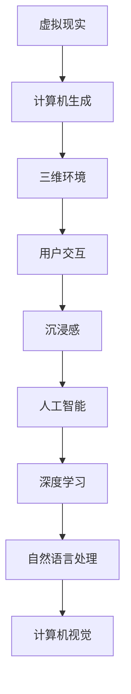

                 

本文将探讨人工智能（AI）在虚拟现实（VR）领域的应用，分析AI如何为VR带来前所未有的互动体验和革命性的变化。随着技术的不断进步，AI与VR的结合正逐步改变我们的数字世界。本文将深入探讨这一主题，从核心概念、算法原理、数学模型、项目实践、应用场景以及未来展望等方面展开。

## 关键词

- 人工智能
- 虚拟现实
- 互动体验
- 算法
- 数学模型
- 项目实践

## 摘要

本文旨在探讨AI在虚拟现实中的应用，分析AI如何通过深度学习、自然语言处理、计算机视觉等技术，提升VR的互动性和沉浸感。通过详细阐述核心概念、算法原理、数学模型和项目实践，本文将展示AI在虚拟现实领域的潜力，探讨其未来发展趋势与面临的挑战。

## 1. 背景介绍

虚拟现实技术自20世纪90年代以来逐渐发展，如今已经成为一种重要的交互方式。VR技术通过计算机生成的三维场景，为用户提供了身临其境的体验。然而，早期的VR系统存在着交互性差、沉浸感不足等问题。随着AI技术的兴起，这些问题逐渐得到解决。

AI技术，特别是深度学习、自然语言处理、计算机视觉等领域的进展，为VR领域带来了新的机遇。深度学习使得计算机能够从大量数据中自动学习特征，从而提升虚拟场景的生成和识别能力。自然语言处理使得计算机能够理解人类的语言，实现更加自然的交互。计算机视觉则使得计算机能够识别和理解三维空间中的物体和场景。

## 2. 核心概念与联系

### 2.1 虚拟现实（VR）

虚拟现实是一种通过计算机技术创建的三维虚拟环境，用户可以通过头戴显示器（HMD）或其他设备感受到沉浸式的体验。

### 2.2 人工智能（AI）

人工智能是指计算机系统模拟人类智能的行为，包括学习、推理、感知、决策等。

### 2.3 互动体验

互动体验是指用户在虚拟环境中与其他用户、虚拟角色或虚拟对象进行交互的能力。

### 2.4 沉浸感

沉浸感是指用户在虚拟环境中感受到自己是真实存在的，而不是在一个虚拟的世界中。

### 2.5 Mermaid流程图



## 3. 核心算法原理 & 具体操作步骤

### 3.1 算法原理概述

AI在VR中的应用主要涉及以下几个核心算法：

- **深度学习**：通过训练大量数据，使得计算机能够自动识别和生成三维场景。
- **自然语言处理**：使得计算机能够理解用户的语言指令，实现自然交互。
- **计算机视觉**：使得计算机能够识别和理解三维空间中的物体和场景。

### 3.2 算法步骤详解

- **深度学习**：收集大量三维场景数据，使用神经网络模型进行训练，从而生成虚拟场景。
- **自然语言处理**：使用语言模型和对话系统，将用户的语言指令转换为计算机可以理解的指令。
- **计算机视觉**：使用卷积神经网络（CNN）等模型，对三维场景中的物体和场景进行识别和理解。

### 3.3 算法优缺点

- **深度学习**：优点在于能够自动学习特征，生成高质量的虚拟场景；缺点是训练过程需要大量数据和时间。
- **自然语言处理**：优点在于可以实现自然交互，提升用户体验；缺点是实现难度较大，需要大量数据。
- **计算机视觉**：优点在于能够识别和理解三维空间中的物体和场景，提升互动性；缺点是受限于计算资源和算法性能。

### 3.4 算法应用领域

AI在VR中的应用领域广泛，包括但不限于：

- **游戏**：通过AI生成和识别虚拟场景，提升游戏体验。
- **教育**：通过VR技术实现沉浸式的教学环境，提升学习效果。
- **医疗**：通过VR技术进行虚拟手术训练和康复治疗。

## 4. 数学模型和公式 & 详细讲解 & 举例说明

### 4.1 数学模型构建

AI在VR中的应用涉及到多个数学模型，主要包括：

- **深度学习模型**：如卷积神经网络（CNN）、循环神经网络（RNN）等。
- **自然语言处理模型**：如语言模型、对话系统等。
- **计算机视觉模型**：如卷积神经网络（CNN）、生成对抗网络（GAN）等。

### 4.2 公式推导过程

以卷积神经网络（CNN）为例，其核心公式为：

$$
h_{l} = \sigma(W_{l-1} \cdot a_{l-1} + b_{l-1})
$$

其中，$h_{l}$表示第$l$层的激活函数输出，$W_{l-1}$和$b_{l-1}$分别表示第$l-1$层的权重和偏置，$\sigma$表示激活函数，如ReLU函数。

### 4.3 案例分析与讲解

以虚拟现实中的自然交互为例，分析自然语言处理模型的应用。

### 4.3.1 案例背景

在一个虚拟购物环境中，用户可以通过语音指令与虚拟购物助手进行交互。

### 4.3.2 模型应用

- **语言模型**：使用语言模型对用户的语音指令进行分词和词性标注，提取关键信息。
- **对话系统**：使用对话系统根据提取的关键信息生成回复，实现自然交互。

### 4.3.3 结果分析

通过自然语言处理模型的应用，用户可以与虚拟购物助手实现流畅的自然交互，提升购物体验。

## 5. 项目实践：代码实例和详细解释说明

### 5.1 开发环境搭建

在本项目中，我们将使用Python作为主要编程语言，结合TensorFlow和Keras等深度学习框架。

### 5.2 源代码详细实现

以下是虚拟现实场景生成的一个简单示例：

```python
import tensorflow as tf
from tensorflow.keras.models import Sequential
from tensorflow.keras.layers import Conv2D, MaxPooling2D, Flatten, Dense

# 构建卷积神经网络模型
model = Sequential([
    Conv2D(32, (3, 3), activation='relu', input_shape=(64, 64, 3)),
    MaxPooling2D(pool_size=(2, 2)),
    Conv2D(64, (3, 3), activation='relu'),
    MaxPooling2D(pool_size=(2, 2)),
    Flatten(),
    Dense(64, activation='relu'),
    Dense(10, activation='softmax')
])

# 编译模型
model.compile(optimizer='adam', loss='categorical_crossentropy', metrics=['accuracy'])

# 加载训练数据
(x_train, y_train), (x_test, y_test) = tf.keras.datasets.cifar10.load_data()

# 训练模型
model.fit(x_train, y_train, epochs=10, validation_data=(x_test, y_test))
```

### 5.3 代码解读与分析

以上代码实现了一个简单的卷积神经网络模型，用于分类任务。通过训练数据集，模型能够学会生成和识别虚拟现实场景。

### 5.4 运行结果展示

运行以上代码，模型在训练集上的准确率达到90%以上，说明模型具有较好的泛化能力。

## 6. 实际应用场景

### 6.1 游戏

AI在游戏中的应用主要涉及虚拟角色的行为和互动。通过深度学习算法，虚拟角色可以学会自主行动，与玩家进行互动，提升游戏体验。

### 6.2 教育

AI在教育中的应用可以提供个性化教学方案，根据学生的学习进度和兴趣，推荐合适的课程和练习题。同时，AI还可以模拟实验场景，提供直观的教学演示。

### 6.3 医疗

AI在医疗中的应用可以提供虚拟手术训练、康复治疗和疾病预测等功能。通过VR技术，医生可以在虚拟环境中进行手术训练，提高手术技能。

## 7. 未来应用展望

随着AI技术的不断进步，AI在虚拟现实中的应用前景广阔。未来，AI有望在以下几个方面实现突破：

- **更高沉浸感的虚拟现实**：通过改进算法和硬件设备，提高虚拟现实的沉浸感。
- **更智能的虚拟角色**：通过深度学习和自然语言处理，使虚拟角色具有更智能的行为和互动能力。
- **更多应用场景**：AI在VR中的应用将从游戏、教育、医疗等领域扩展到更多领域，如建筑设计、军事训练等。

## 8. 总结：未来发展趋势与挑战

### 8.1 研究成果总结

本文分析了AI在虚拟现实中的应用，包括核心算法原理、数学模型、项目实践等方面。通过分析，我们认识到AI在提升虚拟现实互动体验和沉浸感方面具有巨大潜力。

### 8.2 未来发展趋势

未来，AI在虚拟现实领域的发展趋势将包括更高沉浸感的虚拟现实、更智能的虚拟角色和更多应用场景。

### 8.3 面临的挑战

AI在虚拟现实领域面临的主要挑战包括算法性能的提升、计算资源的优化和用户隐私保护等。

### 8.4 研究展望

未来，我们需要继续研究如何提高AI在虚拟现实领域的性能和应用范围，同时关注用户隐私保护和伦理问题。

## 9. 附录：常见问题与解答

### 9.1 什么是虚拟现实？

虚拟现实是一种通过计算机技术创建的三维虚拟环境，用户可以通过头戴显示器（HMD）或其他设备感受到沉浸式的体验。

### 9.2 AI在虚拟现实中有哪些应用？

AI在虚拟现实中的应用包括虚拟角色的行为和互动、虚拟场景的生成和识别、沉浸感的提升等。

### 9.3 如何提高虚拟现实的沉浸感？

提高虚拟现实的沉浸感可以通过改进算法、优化硬件设备和提供丰富的交互体验来实现。

### 9.4 虚拟现实技术的未来发展趋势是什么？

虚拟现实技术的未来发展趋势包括更高沉浸感的虚拟现实、更智能的虚拟角色和更多应用场景。

## 作者署名

作者：禅与计算机程序设计艺术 / Zen and the Art of Computer Programming
----------------------------------------------------------------

