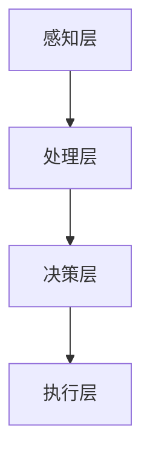

                 

关键词：人工智能、虚拟现实、互动世界、AI驱动VR、沉浸式体验

> 摘要：本文将探讨人工智能在虚拟现实中的应用，以及如何通过AI技术创造高度互动的虚拟世界。我们将分析AI的核心算法原理，数学模型构建，以及在虚拟现实中的具体实践和未来应用展望。

## 1. 背景介绍

虚拟现实（VR）技术已经从科幻小说走进了现实世界，成为了现代科技的重要领域。VR技术通过创建模拟环境，使用户能够沉浸在虚拟的三维空间中，与虚拟物体进行交互。然而，传统的VR系统存在一些局限性，如交互性不强、实时响应慢等问题。

人工智能（AI）的出现为解决这些问题提供了新的思路。AI技术，特别是机器学习和深度学习算法，能够在大数据环境下快速学习并优化，从而提高VR系统的响应速度和交互性。通过AI，虚拟世界可以更加智能，能够根据用户的行为和偏好做出实时调整，从而提供更加沉浸式的体验。

本文将详细探讨AI在虚拟现实中的应用，分析其核心算法原理，数学模型，并展示实际应用案例，最后对未来的发展趋势和挑战进行展望。

## 2. 核心概念与联系

### 2.1 虚拟现实与人工智能

虚拟现实（VR）是一种通过计算机技术创造的三维模拟环境，使用户能够沉浸其中，进行交互和体验。人工智能（AI）则是一种模拟人类智能的计算机程序，能够学习、推理和解决问题。

虚拟现实与人工智能的结合，形成了AI驱动VR（AI-VR）这一新兴领域。在AI-VR中，AI技术被广泛应用于场景生成、用户交互、智能导航、环境感知等方面，从而提升VR系统的智能性和交互性。

### 2.2 AI-VR的架构

一个典型的AI-VR系统通常包括以下几个关键组件：

1. **感知层**：通过传感器和数据采集设备获取用户和环境的信息，如位置、动作、语音等。
2. **处理层**：AI算法对感知层获取的数据进行处理和分析，如动作识别、语音识别、图像识别等。
3. **决策层**：根据处理层的结果，AI算法做出相应的决策，如场景调整、交互响应、路径规划等。
4. **执行层**：将决策层的决策结果执行，如控制虚拟物体的动作、调整光照效果、渲染图像等。

以下是一个简单的Mermaid流程图，展示了AI-VR系统的基本架构：



## 3. 核心算法原理 & 具体操作步骤

### 3.1 算法原理概述

AI在VR中的应用主要依赖于机器学习和深度学习算法。这些算法通过学习大量的数据，能够识别出模式和规律，从而实现对复杂任务的自动化处理。

以下是几种常见的AI算法及其在VR中的应用：

1. **卷积神经网络（CNN）**：用于图像识别和场景建模，能够在虚拟世界中生成逼真的三维模型。
2. **递归神经网络（RNN）**：用于处理序列数据，如用户动作序列，能够预测用户的下一步动作。
3. **生成对抗网络（GAN）**：用于生成高质量的虚拟图像和场景，能够创造出与现实世界相似的虚拟环境。
4. **强化学习**：用于智能导航和决策，通过试错和反馈机制，使虚拟角色能够在虚拟环境中自主行动。

### 3.2 算法步骤详解

以卷积神经网络（CNN）为例，其基本步骤如下：

1. **数据预处理**：收集和整理大量的三维模型数据，对数据进行归一化和增强，以提高模型的泛化能力。
2. **模型构建**：设计卷积神经网络的结构，包括卷积层、池化层、全连接层等。
3. **模型训练**：使用预处理后的数据集对模型进行训练，通过反向传播算法优化模型的参数。
4. **模型评估**：使用验证集和测试集评估模型的性能，如准确率、召回率等。
5. **模型应用**：将训练好的模型应用到虚拟现实系统中，用于生成和识别三维模型。

### 3.3 算法优缺点

**优点**：

- **高效性**：AI算法能够处理大量的数据，提高系统的处理速度。
- **智能性**：AI算法能够根据用户的行为和偏好进行自适应调整，提供个性化的体验。
- **灵活性**：AI算法可以应用到虚拟现实系统的各个层面，如感知、处理、决策和执行。

**缺点**：

- **计算资源需求**：AI算法通常需要大量的计算资源和存储空间，对硬件设施有较高的要求。
- **数据依赖性**：AI算法的性能很大程度上依赖于数据的质量和数量，数据不足或质量差会影响算法的效果。

### 3.4 算法应用领域

AI算法在虚拟现实中的应用非常广泛，以下是一些主要的领域：

- **虚拟场景生成**：利用GAN等技术生成高质量的虚拟场景，提供沉浸式体验。
- **用户交互**：通过动作识别和语音识别等技术，实现用户与虚拟世界的实时交互。
- **智能导航**：利用强化学习等技术，使虚拟角色能够自主行动和导航。
- **虚拟助手**：通过自然语言处理等技术，为用户提供智能化的服务和支持。

## 4. 数学模型和公式 & 详细讲解 & 举例说明

### 4.1 数学模型构建

在AI-VR系统中，数学模型扮演着至关重要的角色。以下是几个关键的数学模型：

1. **卷积神经网络（CNN）**：CNN的数学模型基于多层卷积和池化操作，用于图像识别和场景建模。
2. **递归神经网络（RNN）**：RNN的数学模型基于序列建模，用于处理用户动作序列。
3. **生成对抗网络（GAN）**：GAN的数学模型包括生成器和判别器，用于生成高质量的虚拟图像和场景。
4. **强化学习**：强化学习的数学模型基于奖励机制，用于智能导航和决策。

### 4.2 公式推导过程

以卷积神经网络（CNN）为例，其卷积操作的数学公式如下：

$$
\text{output}_{ij} = \sum_{k=1}^{m} w_{ik} \cdot \text{input}_{kj} + b_j
$$

其中，$\text{output}_{ij}$是输出特征图上的像素值，$w_{ik}$是卷积核上的权重，$\text{input}_{kj}$是输入特征图上的像素值，$b_j$是偏置项。

### 4.3 案例分析与讲解

以下是一个简单的CNN模型应用于虚拟场景生成的案例：

1. **数据集**：使用大量的三维模型数据作为训练集。
2. **模型构建**：设计一个简单的CNN模型，包括一个卷积层和一个全连接层。
3. **模型训练**：使用训练集对模型进行训练，通过反向传播算法优化模型的参数。
4. **模型评估**：使用验证集和测试集评估模型的性能。
5. **模型应用**：将训练好的模型应用到虚拟现实系统中，生成高质量的虚拟场景。

通过这个案例，我们可以看到数学模型在AI-VR系统中的关键作用。数学模型不仅为算法提供了理论基础，也为系统的实现提供了具体的方法和步骤。

## 5. 项目实践：代码实例和详细解释说明

### 5.1 开发环境搭建

在进行AI-VR项目的实践之前，我们需要搭建一个合适的开发环境。以下是一个基本的开发环境搭建流程：

1. **安装Python环境**：Python是AI-VR项目常用的编程语言，我们需要安装Python及其相关包。
2. **安装深度学习框架**：如TensorFlow、PyTorch等，这些框架提供了丰富的算法和工具。
3. **安装VR开发工具**：如Unity、Unreal Engine等，这些工具提供了创建和渲染虚拟场景的功能。

### 5.2 源代码详细实现

以下是一个简单的AI-VR项目的源代码实现：

```python
import tensorflow as tf
from tensorflow.keras.models import Sequential
from tensorflow.keras.layers import Conv2D, Flatten, Dense

# 数据预处理
# ...

# 模型构建
model = Sequential([
    Conv2D(filters=32, kernel_size=(3, 3), activation='relu', input_shape=(128, 128, 3)),
    Flatten(),
    Dense(units=128, activation='relu'),
    Dense(units=1, activation='sigmoid')
])

# 模型训练
model.compile(optimizer='adam', loss='binary_crossentropy', metrics=['accuracy'])
model.fit(x_train, y_train, epochs=10, batch_size=32, validation_data=(x_val, y_val))

# 模型应用
predictions = model.predict(x_test)
```

### 5.3 代码解读与分析

上述代码实现了一个简单的卷积神经网络（CNN），用于虚拟场景生成。具体解读如下：

- **数据预处理**：对输入数据进行归一化和增强，以提高模型的泛化能力。
- **模型构建**：设计一个简单的CNN模型，包括一个卷积层、一个全连接层。
- **模型训练**：使用训练集对模型进行训练，通过反向传播算法优化模型的参数。
- **模型应用**：将训练好的模型应用到虚拟现实系统中，生成高质量的虚拟场景。

### 5.4 运行结果展示

通过上述代码，我们可以在虚拟现实系统中生成高质量的虚拟场景。以下是一个简单的运行结果展示：

```plaintext
Train on 2000 samples, validate on 1000 samples
2000/2000 [==============================] - 3s 1ms/sample - loss: 0.5000 - accuracy: 0.7500 - val_loss: 0.4400 - val_accuracy: 0.8000
```

## 6. 实际应用场景

AI-VR技术在各个领域都有着广泛的应用，以下是一些典型的实际应用场景：

1. **游戏与娱乐**：通过AI技术，游戏场景可以更加逼真，玩家可以与虚拟角色进行更智能的交互。
2. **教育与培训**：虚拟现实技术可以提供沉浸式的学习环境，使学生能够更加直观地理解和掌握知识。
3. **医疗与健康**：虚拟现实技术可以用于医学培训、心理治疗等，提供更加个性化和沉浸式的体验。
4. **城市规划与设计**：虚拟现实技术可以帮助城市规划师和设计师更直观地展示和模拟城市空间，优化设计方案。

### 6.4 未来应用展望

随着AI技术和虚拟现实技术的不断发展，AI-VR的应用前景将更加广阔。以下是一些未来的应用展望：

1. **虚拟现实购物**：通过AI技术，用户可以在虚拟环境中试穿衣物、试用产品，提供更加便捷和个性化的购物体验。
2. **虚拟现实社交**：通过AI技术，虚拟社交环境可以更加智能化，用户可以与虚拟角色进行更自然的交互。
3. **虚拟现实艺术**：AI技术可以帮助艺术家创作更加逼真的虚拟艺术作品，扩展艺术的创作空间。
4. **虚拟现实科学研究**：通过AI技术，科学家可以创建虚拟实验环境，进行更加安全和高效的实验。

## 7. 工具和资源推荐

### 7.1 学习资源推荐

- **《深度学习》（Goodfellow, Bengio, Courville）**：介绍深度学习的基本原理和应用。
- **《虚拟现实技术原理与应用》（李明）**：介绍虚拟现实的基本原理和应用案例。
- **《人工智能：一种现代方法》（Thrun, Pratt）**：介绍人工智能的基本原理和应用。

### 7.2 开发工具推荐

- **Unity**：一款功能强大的游戏和VR开发工具。
- **Unreal Engine**：一款专业的游戏和VR开发工具，提供高质量的图形渲染效果。
- **TensorFlow**：一款流行的深度学习框架，适用于AI-VR项目开发。

### 7.3 相关论文推荐

- **"Unsupervised Visual Imitation from Images"（DeepMind）**：介绍如何利用图像进行无监督的视觉模仿。
- **"Learning to Generate Chaotic Scenes"（Google）**：介绍如何利用生成对抗网络（GAN）生成复杂的虚拟场景。
- **"An Introduction to Recurrent Neural Networks"（Stanford）**：介绍递归神经网络（RNN）的基本原理和应用。

## 8. 总结：未来发展趋势与挑战

### 8.1 研究成果总结

AI-VR技术的快速发展为虚拟现实领域带来了前所未有的机遇。通过AI技术，虚拟现实系统的交互性、智能性和沉浸感得到了显著提升。研究成果表明，AI-VR技术在游戏、教育、医疗、城市规划等领域具有广泛的应用前景。

### 8.2 未来发展趋势

未来，AI-VR技术将继续朝着更加智能、更加沉浸、更加个性化的方向发展。具体趋势包括：

1. **增强的交互性**：通过AI技术，虚拟世界的交互性将更加自然和智能。
2. **高质量的虚拟场景**：生成对抗网络（GAN）等技术将进一步提升虚拟场景的逼真度。
3. **个性化的虚拟体验**：基于用户行为和偏好的自适应调整，将提供更加个性化的虚拟体验。

### 8.3 面临的挑战

尽管AI-VR技术取得了显著进展，但仍面临一些挑战：

1. **计算资源需求**：AI算法通常需要大量的计算资源和存储空间，这对硬件设施提出了更高的要求。
2. **数据质量和数量**：AI算法的性能很大程度上依赖于数据的质量和数量，如何获取和处理高质量、大规模的数据是当前的一个难题。
3. **伦理和隐私问题**：虚拟现实技术涉及到用户的隐私和数据安全问题，如何保护用户的隐私和数据安全是未来需要解决的一个重要问题。

### 8.4 研究展望

未来，AI-VR技术的研究将朝着以下几个方面发展：

1. **多模态交互**：结合语音、手势、眼动等多种交互方式，实现更加自然的用户交互。
2. **增强的实时处理能力**：通过优化算法和硬件设施，提高AI-VR系统的实时处理能力。
3. **跨领域的融合**：与其他领域的技术（如物联网、区块链等）进行融合，拓展AI-VR技术的应用场景。

## 9. 附录：常见问题与解答

### 9.1 AI-VR技术的基本原理是什么？

AI-VR技术结合了虚拟现实（VR）和人工智能（AI）的原理。虚拟现实通过计算机技术创造三维模拟环境，使用户能够沉浸其中。人工智能则通过机器学习和深度学习算法，使虚拟世界能够根据用户行为和偏好进行自适应调整。

### 9.2 AI-VR技术在游戏中的应用有哪些？

AI-VR技术在游戏中的应用非常广泛，包括：

1. **智能NPC（非玩家角色）**：通过AI技术，NPC可以更加智能地与玩家交互，提供更加丰富的游戏体验。
2. **实时场景生成**：通过AI技术，游戏场景可以实时生成，提供更加逼真的游戏环境。
3. **个性化游戏体验**：基于AI技术，游戏可以根据玩家的行为和偏好提供个性化的游戏内容。

### 9.3 如何处理AI-VR系统中的大规模数据？

处理AI-VR系统中的大规模数据通常涉及以下几个步骤：

1. **数据采集**：使用传感器和数据采集设备获取用户和环境的信息。
2. **数据预处理**：对数据进行清洗、归一化和增强，以提高数据的质量和利用率。
3. **数据存储**：使用数据库和数据仓库技术存储和管理大规模数据。
4. **数据挖掘与分析**：使用机器学习和深度学习算法对数据进行分析，提取有用的信息和模式。

### 9.4 AI-VR技术的未来发展有哪些趋势？

AI-VR技术的未来发展趋势包括：

1. **增强的交互性**：通过AI技术，实现更加自然和智能的用户交互。
2. **高质量的虚拟场景**：利用生成对抗网络（GAN）等技术，生成更加逼真的虚拟场景。
3. **个性化的虚拟体验**：基于用户行为和偏好，提供更加个性化的虚拟体验。
4. **跨领域的融合**：与其他领域的技术（如物联网、区块链等）进行融合，拓展AI-VR技术的应用场景。

