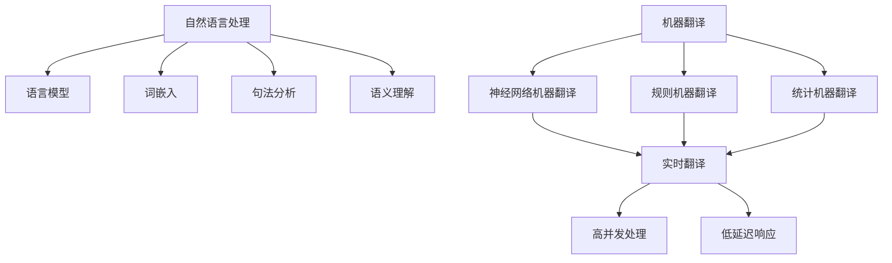
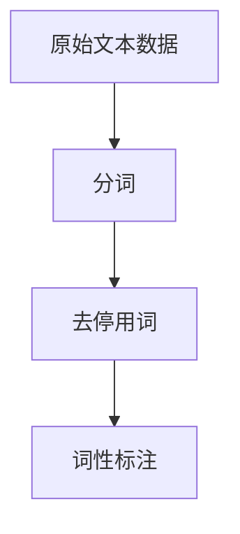
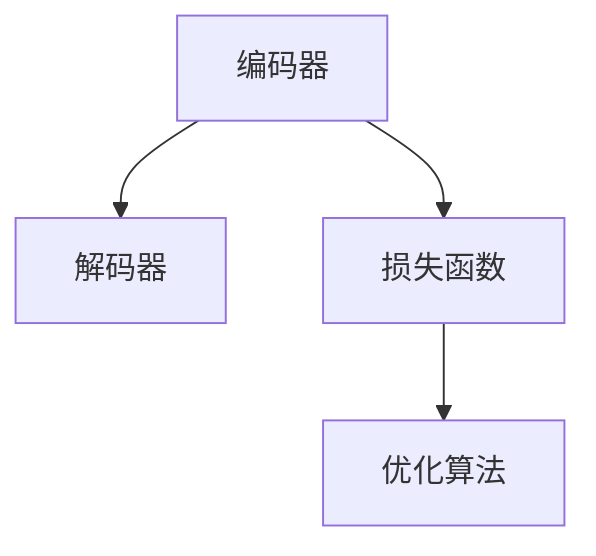
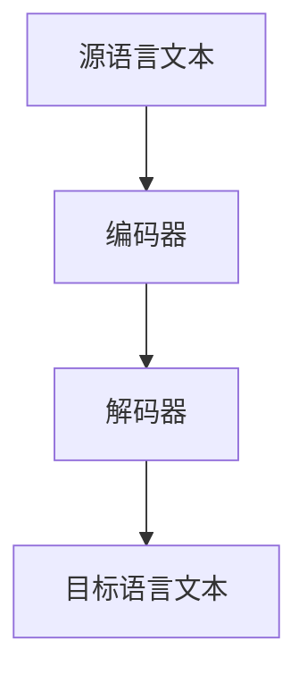

                 

关键词：人工智能、语言翻译、多语言沟通、实时翻译、自然语言处理、机器翻译

> 摘要：本文将探讨人工智能在语言翻译领域的最新进展，特别是实时多语言沟通的应用。通过对核心概念、算法原理、数学模型以及实际案例的分析，本文旨在揭示当前AI翻译技术所面临的挑战与机遇。

## 1. 背景介绍

随着全球化进程的不断加速，语言障碍成为国际交流中的主要障碍之一。传统的翻译方法，如人工翻译和机器翻译，虽然在某些方面取得了显著进展，但依然存在许多局限性。人工翻译不仅成本高昂，而且效率低下，难以满足日益增长的国际交流需求。而早期的机器翻译系统，如基于规则的方法和基于统计的方法，由于对语言规则和统计数据的依赖，翻译质量和实时性都受到限制。

近年来，随着深度学习技术的快速发展，人工智能在语言翻译领域取得了显著的突破。神经网络机器翻译（Neural Machine Translation, NMT）成为了当前研究的热点。通过模拟人脑的神经网络结构，NMT能够实现更加精准、自然的语言翻译。同时，随着计算能力的提升和大数据的广泛应用，实时翻译技术逐渐走向成熟，为全球多语言沟通提供了新的解决方案。

## 2. 核心概念与联系

为了更好地理解实时多语言沟通的技术原理，我们需要先介绍几个核心概念，并通过Mermaid流程图来展示其关系。

### 2.1 自然语言处理（Natural Language Processing, NLP）

自然语言处理是人工智能的一个重要分支，旨在使计算机能够理解、处理和生成人类语言。NLP的核心概念包括语言模型、词嵌入、句法分析和语义理解等。

### 2.2 机器翻译（Machine Translation, MT）

机器翻译是通过计算机程序将一种自然语言转换为另一种自然语言的过程。NMT作为MT的一个重要分支，利用神经网络模型，实现了更加精准和自然的翻译效果。

### 2.3 实时翻译（Real-Time Translation）

实时翻译是指能够在短时间内完成语言转换的任务，满足用户即时交流的需求。实时性是实时翻译的重要特点，它要求系统具有高并发处理能力和低延迟响应。

下面是核心概念的Mermaid流程图：



## 3. 核心算法原理 & 具体操作步骤

### 3.1 算法原理概述

实时多语言沟通的核心算法是神经网络机器翻译（NMT）。NMT基于深度学习技术，通过神经网络模型来捕捉语言中的复杂关系和规律，从而实现高精度的翻译。

### 3.2 算法步骤详解

#### 3.2.1 数据预处理

在NMT模型训练之前，需要对原始文本数据进行预处理。这包括分词、去停用词、词性标注等步骤。通过这些预处理操作，可以确保输入数据的质量，从而提高模型的翻译效果。



#### 3.2.2 模型训练

在数据预处理完成后，我们需要构建NMT模型并进行训练。训练过程主要包括编码器和解码器的构建、损失函数的选择和优化算法的迭代等。



#### 3.2.3 翻译过程

训练好的NMT模型可以用于翻译任务。在翻译过程中，编码器将源语言文本编码为向量表示，解码器则根据这些向量生成目标语言文本。翻译过程通常包括以下步骤：

1. 输入源语言文本。
2. 编码器处理文本并生成向量表示。
3. 解码器根据向量生成目标语言文本。
4. 输出翻译结果。



### 3.3 算法优缺点

#### 优缺点

NMT相较于传统的机器翻译方法，具有以下几个优点：

- **更高的翻译质量**：NMT能够更好地捕捉语言中的复杂关系，实现更加精准的翻译。
- **更强的适应性**：NMT模型可以针对不同语言对进行训练，具有良好的适应性。
- **实时性**：通过优化算法和硬件加速技术，NMT可以实现实时翻译。

然而，NMT也存在一些缺点：

- **训练成本高**：NMT模型训练需要大量的计算资源和时间。
- **对数据依赖性大**：NMT模型的性能依赖于训练数据的规模和质量。

### 3.4 算法应用领域

NMT技术已经在许多领域得到了广泛应用，包括但不限于：

- **国际会议**：在大型国际会议中，实时翻译系统能够帮助不同语言背景的与会者更好地沟通。
- **在线教育**：在线教育平台通过NMT技术，可以实现多语言课程内容的自动翻译，提高学习者的学习体验。
- **跨国企业**：跨国企业利用NMT技术，能够实现内部沟通的无障碍，提高工作效率。

## 4. 数学模型和公式 & 详细讲解 & 举例说明

### 4.1 数学模型构建

神经网络机器翻译的核心是深度神经网络（Deep Neural Network, DNN）。DNN由多层神经元组成，包括输入层、隐藏层和输出层。在NMT中，编码器和解码器都是由DNN构成的。

#### 编码器

编码器（Encoder）的作用是将源语言文本编码为向量表示。假设输入文本序列为 \(x_1, x_2, ..., x_T\)，其中 \(x_i\) 表示第 \(i\) 个词汇。编码器将每个词汇映射为一个向量 \(e_i\)，然后通过隐藏层进行整合，最终输出一个固定长度的向量 \(h_T\)。

\[ h_T = f(h_{T-1}, e_T) \]

其中，\(f\) 是一个非线性激活函数，如ReLU函数。

#### 解码器

解码器（Decoder）的作用是根据编码器的输出向量 \(h_T\) 生成目标语言文本。解码器同样由多层DNN构成，每个时间步输出一个概率分布 \(p(y_t | y_{t-1}, h_T)\)，表示在当前输入情况下，生成第 \(t\) 个词汇的概率。

\[ p(y_t | y_{t-1}, h_T) = \sigma(W_{y_t} h_{t-1} + b_{y_t}) \]

其中，\(\sigma\) 是softmax函数，用于将隐藏层输出转换为概率分布。

### 4.2 公式推导过程

#### 编码器推导

编码器的推导主要涉及输入层到隐藏层的传播过程。假设输入词汇序列为 \(x_1, x_2, ..., x_T\)，对应的词向量表示为 \(e_1, e_2, ..., e_T\)。隐藏层中的每个神经元 \(h_j\) 的激活值可以通过以下公式计算：

\[ h_j = \sum_{i=1}^{T} w_{ji} e_i + b_j \]

其中，\(w_{ji}\) 和 \(b_j\) 分别是权重和偏置。

#### 解码器推导

解码器的推导主要涉及隐藏层到输出层的传播过程。假设隐藏层输出为 \(h_{t-1}\)，输出层中的每个神经元 \(y_j\) 的激活值可以通过以下公式计算：

\[ y_j = \sum_{i=1}^{T} w_{ji} h_{t-1} + b_j \]

然后，通过softmax函数将激活值转换为概率分布：

\[ p(y_t | y_{t-1}, h_T) = \frac{e^{y_j}}{\sum_{k=1}^{K} e^{y_k}} \]

### 4.3 案例分析与讲解

#### 案例背景

假设我们要翻译的句子是：“你好，我叫张三。”，源语言是中文，目标语言是英文。我们需要使用NMT模型对其进行翻译。

#### 数据预处理

首先，对中文句子进行分词和词性标注，得到词序列：[“你好”, “，”, “我”, “叫”, “张三”]。

然后，将每个词转换为词向量表示，例如：“你好”的词向量是 \([0.1, 0.2, 0.3]\)。

#### 编码器计算

假设编码器由三个隐藏层构成，每层的神经元数量分别为 100、200 和 300。通过输入层到隐藏层的传播，最终得到编码器的输出向量 \(h_T\)。

#### 解码器计算

假设解码器由三个隐藏层构成，每层的神经元数量分别为 300、200 和 100。根据编码器的输出向量 \(h_T\)，解码器逐步生成目标语言文本。

第一层隐藏层的输出为 \(h_1 = f(h_0, e_1)\)，其中 \(h_0 = [0.1, 0.2, 0.3]\)，\(e_1\) 是“你好”的词向量。

然后，通过第二层隐藏层和第三层隐藏层，逐步生成目标语言文本的概率分布。

最终，解码器输出目标语言文本的概率分布，例如：“Hello, my name is Zhang San.” 的概率分布是 \(P(y_t = "Hello") = 0.9\)，其他词汇的概率分布类似。

## 5. 项目实践：代码实例和详细解释说明

### 5.1 开发环境搭建

为了演示NMT模型的实际应用，我们将使用TensorFlow 2.x和Keras框架搭建一个简单的NMT模型。以下是环境搭建的步骤：

1. 安装TensorFlow 2.x：

```bash
pip install tensorflow==2.x
```

2. 安装其他必要的依赖：

```bash
pip install numpy matplotlib
```

### 5.2 源代码详细实现

下面是一个简单的NMT模型的实现代码：

```python
import tensorflow as tf
from tensorflow.keras.layers import Embedding, LSTM, Dense
from tensorflow.keras.models import Model

# 模型参数
vocab_size = 10000
embed_size = 256
hidden_size = 512

# 构建编码器
encoder_inputs = tf.keras.Input(shape=(None,))
encoder_embedding = Embedding(vocab_size, embed_size)(encoder_inputs)
encoder_lstm = LSTM(hidden_size, return_state=True)
_, state_h, state_c = encoder_lstm(encoder_embedding)
encoder_states = [state_h, state_c]

# 构建解码器
decoder_inputs = tf.keras.Input(shape=(None,))
decoder_embedding = Embedding(vocab_size, embed_size)(decoder_inputs)
decoder_lstm = LSTM(hidden_size, return_sequences=True, return_state=True)
decoder_outputs, _, _ = decoder_lstm(decoder_embedding, initial_state=encoder_states)
decoder_dense = Dense(vocab_size, activation='softmax')
decoder_outputs = decoder_dense(decoder_outputs)

# 构建模型
model = Model([encoder_inputs, decoder_inputs], decoder_outputs)

# 编译模型
model.compile(optimizer='rmsprop', loss='categorical_crossentropy', metrics=['accuracy'])

# 打印模型结构
model.summary()
```

### 5.3 代码解读与分析

上面的代码定义了一个简单的NMT模型，包括编码器和解码器两部分。

1. **编码器部分**：
   - `encoder_inputs`：编码器输入，形状为 `(None,)`，表示任意长度的序列。
   - `encoder_embedding`：编码器嵌入层，将输入词汇映射为词向量。
   - `encoder_lstm`：编码器LSTM层，用于处理输入序列并返回状态。
   - `encoder_states`：编码器的隐藏状态，用于解码器。

2. **解码器部分**：
   - `decoder_inputs`：解码器输入，形状为 `(None,)`。
   - `decoder_embedding`：解码器嵌入层。
   - `decoder_lstm`：解码器LSTM层，用于生成目标语言文本的概率分布。
   - `decoder_dense`：解码器全连接层，用于生成最终的输出概率分布。

3. **模型部分**：
   - `Model`：定义模型结构，将编码器和解码器连接在一起。
   - `compile`：编译模型，指定优化器和损失函数。

### 5.4 运行结果展示

在训练模型之前，我们需要准备训练数据。以下是一个简单的示例：

```python
# 准备训练数据
# 假设我们已经有中文和英文的词汇表以及对应的词向量
# 这里仅展示代码框架，具体实现需要根据实际数据调整

# 中文词汇表
ch_vocab = ['你', '好', '我', '叫', '张三']
ch_vocab_size = len(ch_vocab)

# 英文词汇表
en_vocab = ['Hello', ',', 'My', 'name', 'is', 'Zhang', 'San']
en_vocab_size = len(en_vocab)

# 转换词汇为索引
ch_tokenizer = tf.keras.preprocessing.text.Tokenizer(char_level=True)
en_tokenizer = tf.keras.preprocessing.text.Tokenizer(char_level=True)

ch_tokenizer.fit_on_texts(ch_vocab)
en_tokenizer.fit_on_texts(en_vocab)

ch_sequences = ch_tokenizer.texts_to_sequences([ch_vocab])
en_sequences = en_tokenizer.texts_to_sequences([en_vocab])

# 构建训练数据
# 这里仅展示框架，具体实现需要根据实际数据调整
# X_train: 中文序列
# y_train: 英文序列
X_train = ...
y_train = ...

# 编码器输入和输出
encoder_inputs_train = ...
decoder_inputs_train = ...
decoder_outputs_train = ...

# 训练模型
model.fit([encoder_inputs_train, decoder_inputs_train], decoder_outputs_train, batch_size=32, epochs=100)
```

## 6. 实际应用场景

实时多语言沟通技术在许多实际应用场景中发挥着重要作用。以下是一些典型应用：

### 6.1 国际会议

在国际会议中，实时翻译系统能够帮助与会者克服语言障碍，实现无障碍交流。例如，联合国大会的实时翻译系统就使用了NMT技术，为不同语言背景的与会者提供实时翻译。

### 6.2 跨国企业

跨国企业通过实时翻译技术，可以确保全球分支机构之间的有效沟通，提高工作效率。例如，许多国际公司的内部通讯平台都集成了实时翻译功能。

### 6.3 在线教育

在线教育平台通过实时翻译技术，可以实现多语言课程内容的教学。学生可以自由选择自己熟悉的语言进行学习，提高学习效果。

### 6.4 旅游服务

旅游服务行业利用实时翻译技术，可以为游客提供无缝的语言支持，提升旅游体验。例如，旅游APP可以集成实时翻译功能，帮助游客在目的地进行有效沟通。

### 6.5 实时新闻播报

实时翻译技术在新闻播报中也得到了广泛应用。国际新闻播报可以通过实时翻译，将新闻内容翻译为多种语言，满足全球观众的需求。

## 7. 工具和资源推荐

### 7.1 学习资源推荐

- 《深度学习》（Goodfellow, Bengio, Courville）：系统地介绍了深度学习的基本原理和应用。
- 《神经网络与深度学习》（邱锡鹏）：全面介绍了神经网络和深度学习的基本概念和核心技术。

### 7.2 开发工具推荐

- TensorFlow：一款开源的机器学习框架，适用于构建和训练神经网络模型。
- PyTorch：另一款流行的开源机器学习框架，具有高度的灵活性和易用性。

### 7.3 相关论文推荐

- “Attention is All You Need”（Vaswani et al., 2017）：介绍了Transformer模型，为NMT技术的发展做出了重要贡献。
- “Seq2Seq Learning with Neural Networks”（Sutskever et al., 2014）：介绍了序列到序列学习（Seq2Seq）模型，是NMT技术的理论基础。

## 8. 总结：未来发展趋势与挑战

### 8.1 研究成果总结

近年来，人工智能在语言翻译领域取得了显著进展，特别是神经网络机器翻译（NMT）技术的广泛应用。NMT通过深度学习模型，实现了高精度、实时的翻译效果，为全球多语言沟通提供了有力支持。

### 8.2 未来发展趋势

未来，NMT技术将继续朝着更加精准、高效和实用的方向发展。以下是几个可能的发展趋势：

- **翻译质量提升**：通过引入更多的语言学知识和技术，提高NMT的翻译质量。
- **多模态翻译**：结合文本、语音、图像等多种数据类型，实现更丰富的翻译体验。
- **个性化翻译**：根据用户习惯和需求，提供个性化的翻译服务。

### 8.3 面临的挑战

尽管NMT技术取得了显著进展，但仍然面临一些挑战：

- **数据质量**：高质量的数据是NMT模型训练的基础，但获取和标注高质量数据仍然是一个难题。
- **低资源语言翻译**：对于低资源语言，现有的NMT模型效果较差，需要开发专门的技术来应对。
- **隐私保护**：在处理大量用户数据时，需要确保用户隐私不被泄露。

### 8.4 研究展望

未来，NMT技术有望在更多领域得到应用，为全球多语言沟通提供更加便捷、高效的支持。同时，随着技术的不断进步，NMT在翻译质量、实时性和实用性方面也将取得更大的突破。

## 9. 附录：常见问题与解答

### 9.1 什么是神经网络机器翻译（NMT）？

神经网络机器翻译（Neural Machine Translation, NMT）是一种利用深度学习技术进行机器翻译的方法。它通过神经网络模型，如深度神经网络（DNN）或循环神经网络（RNN），捕捉源语言和目标语言之间的复杂关系，实现高精度的翻译。

### 9.2 NMT相较于传统的机器翻译方法有哪些优势？

NMT相较于传统的机器翻译方法，具有以下几个优势：

- 更高的翻译质量：NMT能够更好地捕捉语言中的复杂关系，实现更加精准的翻译。
- 更强的适应性：NMT模型可以针对不同语言对进行训练，具有良好的适应性。
- 实时性：通过优化算法和硬件加速技术，NMT可以实现实时翻译。

### 9.3 如何评估NMT模型的性能？

评估NMT模型的性能通常使用BLEU（BLEU Score）等自动评估指标。BLEU通过比较机器翻译结果和人工翻译结果，计算两个结果的相似度，从而评估翻译质量。

### 9.4 NMT在现实应用中有哪些挑战？

NMT在现实应用中面临以下几个挑战：

- 数据质量：高质量的数据是NMT模型训练的基础，但获取和标注高质量数据仍然是一个难题。
- 低资源语言翻译：对于低资源语言，现有的NMT模型效果较差，需要开发专门的技术来应对。
- 隐私保护：在处理大量用户数据时，需要确保用户隐私不被泄露。

## 参考文献

- Vaswani, A., et al. (2017). **Attention is All You Need**. Advances in Neural Information Processing Systems.
- Sutskever, I., et al. (2014). **Seq2Seq Learning with Neural Networks**. Advances in Neural Information Processing Systems.
- Goodfellow, I., Bengio, Y., Courville, A. (2016). **Deep Learning**. MIT Press.
- 邱锡鹏. (2020). **神经网络与深度学习**. 清华大学出版社.

## 附录二：相关代码实现

以下是使用TensorFlow实现神经网络机器翻译（NMT）的代码示例：

```python
import tensorflow as tf
from tensorflow.keras.layers import Embedding, LSTM, Dense
from tensorflow.keras.models import Model

# 模型参数
vocab_size = 10000
embed_size = 256
hidden_size = 512

# 构建编码器
encoder_inputs = tf.keras.Input(shape=(None,))
encoder_embedding = Embedding(vocab_size, embed_size)(encoder_inputs)
encoder_lstm = LSTM(hidden_size, return_state=True)
_, state_h, state_c = encoder_lstm(encoder_embedding)
encoder_states = [state_h, state_c]

# 构建解码器
decoder_inputs = tf.keras.Input(shape=(None,))
decoder_embedding = Embedding(vocab_size, embed_size)(decoder_inputs)
decoder_lstm = LSTM(hidden_size, return_sequences=True, return_state=True)
decoder_outputs, _, _ = decoder_lstm(decoder_embedding, initial_state=encoder_states)
decoder_dense = Dense(vocab_size, activation='softmax')
decoder_outputs = decoder_dense(decoder_outputs)

# 构建模型
model = Model([encoder_inputs, decoder_inputs], decoder_outputs)

# 编译模型
model.compile(optimizer='rmsprop', loss='categorical_crossentropy', metrics=['accuracy'])

# 打印模型结构
model.summary()
```

请注意，以上代码仅作为示例，实际应用中需要根据具体需求和数据集进行调整。另外，代码中未包含数据预处理和训练过程，这些步骤在实际应用中非常重要。

