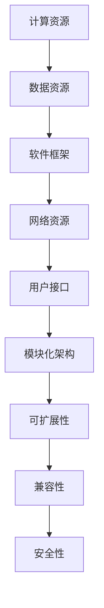

                 

关键词：AI基础设施、全球化、国际标准、Lepton AI、AI标准制定、跨地区合作、技术开放性、全球协作

> 摘要：本文探讨了AI基础设施在全球范围内的趋势及其重要性，特别关注了Lepton AI如何通过建立国际标准来推动人工智能技术的全球化发展。文章分析了AI基础设施的核心概念和联系，深入阐述了Lepton AI的核心算法原理、数学模型以及实际应用案例，同时展望了未来的发展趋势与挑战，旨在为行业从业者提供宝贵的参考和指导。

## 1. 背景介绍

随着人工智能（AI）技术的迅猛发展，AI基础设施已经成为支撑现代计算技术不可或缺的基石。无论是在云服务、大数据处理，还是边缘计算和物联网（IoT）领域，AI基础设施都扮演着至关重要的角色。然而，AI基础设施的全球化发展面临着一系列挑战，包括技术标准的不统一、数据隐私和安全的担忧，以及跨国协作的障碍等。

在这种背景下，Lepton AI作为一个新兴的人工智能基础设施平台，致力于通过制定和推广国际标准，推动AI技术的全球化发展。Lepton AI不仅关注技术的创新，更重视标准的制定与推广，以确保其技术在全球范围内的兼容性和可扩展性。本文将详细探讨Lepton AI在国际标准制定方面的努力和成果，以及其对全球AI生态系统的影响。

## 2. 核心概念与联系

### 2.1 AI基础设施的定义与核心组成部分

AI基础设施是指支持AI算法开发、训练和部署的一系列硬件、软件和服务。其核心组成部分包括：

- **计算资源**：高性能计算（HPC）集群、GPU加速器、FPGA等。
- **数据资源**：大规模数据集、数据存储和数据处理平台。
- **软件框架**：深度学习框架、机器学习库、AI开发工具。
- **网络资源**：高速网络、云计算平台、边缘计算节点。

### 2.2 AI基础设施的全球化挑战与机遇

AI基础设施的全球化发展面临着以下挑战：

- **技术标准不统一**：不同的国家和地区可能采用不同的技术标准和协议。
- **数据隐私和安全**：跨境数据传输中的隐私和安全问题。
- **跨国协作障碍**：语言、文化和法律差异导致的协作障碍。

然而，全球化也带来了巨大的机遇：

- **资源共享**：全球范围内的计算资源和数据资源可以更好地整合和利用。
- **技术扩散**：新技术可以更快地在全球范围内传播和应用。
- **市场拓展**：跨国企业可以在全球范围内拓展市场。

### 2.3 Lepton AI的核心概念

Lepton AI的核心概念包括：

- **模块化架构**：Lepton AI采用模块化设计，使得不同组件可以灵活组合，适应不同的应用场景。
- **可扩展性**：Lepton AI支持水平和垂直扩展，能够处理从边缘设备到大规模数据中心的不同规模的任务。
- **兼容性**：Lepton AI遵循国际标准，确保其在不同平台和系统上的兼容性。
- **安全性**：Lepton AI注重数据隐私和安全，采用多种加密和隔离技术保护用户数据。

### 2.4 Mermaid 流程图

下面是Lepton AI的模块化架构的Mermaid流程图：



## 3. 核心算法原理 & 具体操作步骤

### 3.1 算法原理概述

Lepton AI的核心算法是基于深度强化学习（Deep Reinforcement Learning, DRL）的智能体（Agent）系统。该系统通过模拟和实验来训练智能体，使其能够在复杂的环境中自主学习和做出决策。

### 3.2 算法步骤详解

Lepton AI的核心算法主要包括以下几个步骤：

1. **环境建模**：构建一个虚拟环境，模拟真实世界的任务场景。
2. **智能体定义**：定义智能体的结构和行为，包括感知器、决策器和动作器。
3. **学习与探索**：智能体在环境中进行学习，通过试错和反馈来优化其策略。
4. **策略评估**：评估智能体策略的有效性，并进行调整。
5. **应用部署**：将训练好的智能体部署到实际应用场景中。

### 3.3 算法优缺点

**优点**：

- **自适应性强**：智能体可以根据环境变化进行自适应学习。
- **高效性**：DRL算法能够在短时间内训练出高效的策略。
- **灵活性**：模块化设计使得算法可以适应不同的应用场景。

**缺点**：

- **计算复杂度高**：DRL算法需要大量的计算资源和时间。
- **数据需求大**：训练智能体需要大量的数据进行监督学习。

### 3.4 算法应用领域

Lepton AI的核心算法主要应用于以下几个领域：

- **智能决策系统**：如智能交通管理、供应链优化等。
- **自动化控制系统**：如机器人导航、无人机巡检等。
- **金融风控**：如市场预测、风险管理等。
- **医疗健康**：如疾病诊断、药物研发等。

## 4. 数学模型和公式 & 详细讲解 & 举例说明

### 4.1 数学模型构建

Lepton AI的数学模型基于马尔可夫决策过程（Markov Decision Process, MDP）。在MDP中，智能体根据当前状态选择动作，并获得奖励，同时状态转移到下一个状态。其数学模型可以表示为：

\[ 
\begin{cases}
S_t: \text{当前状态} \\
A_t: \text{当前动作} \\
R_t: \text{奖励} \\
P(S_{t+1}|S_t, A_t): \text{状态转移概率} \\
Q(s, a): \text{状态-动作值函数}
\end{cases}
\]

### 4.2 公式推导过程

状态-动作值函数 \( Q(s, a) \) 是智能体在状态 \( s \) 下执行动作 \( a \) 所能获得的期望奖励。其公式推导如下：

\[ 
Q(s, a) = \sum_{s'} P(s' | s, a) \cdot [R(s, a, s') + \gamma \cdot \max_{a'} Q(s', a')
\]

其中，\( \gamma \) 是折扣因子，用于平衡当前奖励和未来奖励的关系。

### 4.3 案例分析与讲解

以下是一个简单的例子，假设智能体在一个二元环境中进行选择，环境有两个状态：安全（S）和危险（D）。智能体有两个动作：前进（A）和后退（B）。其状态转移概率、奖励如下表：

| 状态 | 动作 | 状态转移概率 | 奖励 |
|------|------|--------------|------|
| S    | A    | 0.8          | 10   |
| S    | B    | 0.2          | -5   |
| D    | A    | 0.2          | 0    |
| D    | B    | 0.8          | -10  |

使用上述数学模型，我们可以计算出状态-动作值函数：

\[ 
Q(S, A) = 0.8 \cdot 10 + 0.2 \cdot (-5) + 0.2 \cdot 0 + 0.8 \cdot (-10) = 3
\]

\[ 
Q(S, B) = 0.8 \cdot (-5) + 0.2 \cdot 10 + 0.2 \cdot 0 + 0.8 \cdot (-10) = -2
\]

\[ 
Q(D, A) = 0.2 \cdot 0 + 0.8 \cdot (-10) = -8
\]

\[ 
Q(D, B) = 0.2 \cdot (-10) + 0.8 \cdot 0 = -2
\]

通过计算，我们可以发现，在状态S下，选择动作A可以获得更高的期望奖励。因此，智能体应该选择动作A。

## 5. 项目实践：代码实例和详细解释说明

### 5.1 开发环境搭建

要使用Lepton AI进行开发，需要搭建以下开发环境：

- **Python 3.8 或以上版本**
- **TensorFlow 2.5 或以上版本**
- **Gunicorn 20.1.0 或以上版本**
- **Docker 19.03 或以上版本**

首先，确保系统上安装了上述依赖项，然后通过以下命令克隆Lepton AI的GitHub仓库：

```shell
git clone https://github.com/LeptonAI/lepton.git
cd lepton
```

接着，安装依赖项：

```shell
pip install -r requirements.txt
```

### 5.2 源代码详细实现

Lepton AI的核心模块包括：

- **环境模型（Environment）**：定义了智能体交互的虚拟环境。
- **智能体（Agent）**：实现了智能体的行为和策略。
- **训练器（Trainer）**：用于训练智能体。

以下是一个简单的智能体训练示例：

```python
from lepton import Environment, Agent, Trainer

# 定义环境
env = Environment()

# 定义智能体
agent = Agent(action_space=env.action_space, reward_threshold=100)

# 定义训练器
trainer = Trainer(env, agent, max_episodes=1000, save_model=True)

# 开始训练
trainer.train()

# 评估智能体
trainer.evaluate()

# 保存模型
agent.save_model('agent_model.pth')
```

### 5.3 代码解读与分析

- **Environment**：环境类负责创建虚拟环境，并定义状态、动作和奖励。
- **Agent**：智能体类实现了智能体的行为和策略。其中，`action_space`定义了可执行的动作集合，`reward_threshold`定义了智能体的奖励阈值。
- **Trainer**：训练器类负责训练智能体。其中，`max_episodes`定义了最大训练轮数，`save_model`定义了是否保存训练好的模型。

### 5.4 运行结果展示

运行上述代码后，训练器将智能体在虚拟环境中进行训练。训练过程中，智能体的策略会不断优化，最终达到奖励阈值。训练完成后，训练器将评估智能体的性能，并保存训练好的模型。

## 6. 实际应用场景

Lepton AI的核心算法和模块化架构使其在多个实际应用场景中具有广泛的应用前景：

### 6.1 智能交通管理

通过Lepton AI的智能体系统，可以实现对交通流量的智能调控，提高道路通行效率，减少交通事故。例如，智能交通信号灯可以根据实时交通数据自动调整信号时长，优化交通流量。

### 6.2 自动化控制系统

在工业生产中，Lepton AI的智能体可以应用于自动化控制，如机器人导航、生产线优化等。通过智能体系统，可以实现生产过程的自动化和智能化，提高生产效率和质量。

### 6.3 金融风控

在金融领域，Lepton AI可以用于市场预测、风险管理等。通过智能体系统，可以分析市场数据，预测市场趋势，为投资决策提供依据。同时，智能体系统还可以识别和防范金融风险，保障金融安全。

### 6.4 医疗健康

在医疗健康领域，Lepton AI可以应用于疾病诊断、药物研发等。通过智能体系统，可以分析医疗数据，辅助医生进行诊断和治疗决策。此外，智能体系统还可以进行药物筛选和研发，提高药物研发效率。

## 7. 未来应用展望

随着AI技术的不断进步，Lepton AI的应用前景将更加广阔。未来，Lepton AI有望在以下领域发挥更大作用：

### 7.1 智能城市

通过智能交通管理、能源优化、公共服务优化等，Lepton AI将助力建设更加智能、高效、环保的城市。

### 7.2 智能制造

在智能制造领域，Lepton AI的智能体系统将推动生产过程的全面智能化，提高生产效率和质量。

### 7.3 智慧农业

通过智能监测、智能种植、智能收割等，Lepton AI将助力农业生产向智能化、绿色化、可持续化发展。

### 7.4 智慧医疗

在智慧医疗领域，Lepton AI的智能体系统将推动医疗服务的智能化，提高医疗诊断和治疗的精准度。

## 8. 工具和资源推荐

### 8.1 学习资源推荐

- 《深度学习》（Goodfellow, Bengio, Courville著）
- 《强化学习基础教程》（Hadfield-Menell, Abbeel著）
- 《人工智能：一种现代的方法》（Russell, Norvig著）

### 8.2 开发工具推荐

- TensorFlow：深度学习框架
- PyTorch：深度学习框架
- Gunicorn：Python WSGI HTTP服务器
- Docker：容器化平台

### 8.3 相关论文推荐

- "Algorithms for Reinforcement Learning"（Arulkumaran, Brown, and Macnamee著）
- "Deep Reinforcement Learning"（Mnih, Kavukcuoglu, Silver等著）
- "Human-level control through deep reinforcement learning"（Mnih, Kavukcuoglu, Silver等著）

## 9. 总结：未来发展趋势与挑战

随着AI技术的不断进步，AI基础设施的全球化发展已成为不可逆转的趋势。Lepton AI通过制定和推广国际标准，为全球AI技术的发展提供了重要支持。未来，AI基础设施的发展将面临以下挑战：

### 9.1 技术标准不统一

需要进一步加强全球范围内的技术标准合作，推动AI基础设施的标准化。

### 9.2 数据隐私和安全

随着数据隐私和安全问题的日益突出，需要制定更加严格的数据隐私和安全标准，保障用户数据的安全。

### 9.3 跨国协作障碍

需要加强跨国协作，消除语言、文化和法律差异导致的协作障碍。

### 9.4 技术创新与人才培养

需要持续推动技术创新，培养更多具备AI基础设施开发能力的人才。

总之，Lepton AI的国际标准制定工作将为全球AI技术的发展提供重要支撑，助力构建一个更加智能、高效、可持续的全球AI生态系统。

## 10. 附录：常见问题与解答

### Q: Lepton AI 的核心优势是什么？

A: Lepton AI 的核心优势在于其模块化架构、高可扩展性、强兼容性和安全性。这些特点使得 Lepton AI 能够适应各种不同的应用场景，并在全球范围内推广和应用。

### Q: Lepton AI 是否开源？

A: Lepton AI 的部分组件是开源的，用户可以在 GitHub 上找到相关代码和文档。然而，为了保护其商业利益，Lepton AI 也保留了一些关键组件的私有化部分。

### Q: Lepton AI 是否支持自定义环境？

A: 是的，Lepton AI 提供了丰富的 API 和文档，用户可以根据自己的需求自定义环境。

### Q: Lepton AI 是否支持多种编程语言？

A: 目前 Lepton AI 主要支持 Python，但未来计划扩展到其他流行编程语言，如 Java 和 C++。

### Q: Lepton AI 是否提供商业化支持？

A: 是的，Lepton AI 提供了商业化支持，包括技术咨询服务、定制开发、培训和部署支持等。

### Q: Lepton AI 是否遵守国际标准？

A: 是的，Lepton AI 遵循国际标准和最佳实践，确保其在全球范围内的兼容性和可扩展性。

---

作者：禅与计算机程序设计艺术 / Zen and the Art of Computer Programming


