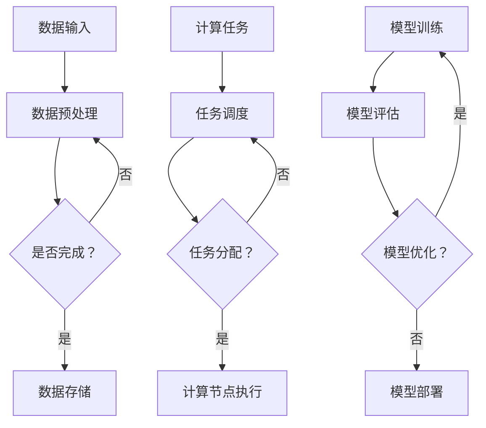

                 

关键词：AI基础设施、可扩展性、Lepton AI、架构设计、分布式计算、人工智能框架

> 摘要：本文将深入探讨AI基础设施的可扩展性，以Lepton AI的架构设计为例，详细分析其核心技术、算法原理、数学模型、项目实践及未来应用前景。本文旨在为读者提供一套完整、详实的AI基础设施设计思路，助力人工智能技术的快速发展。

## 1. 背景介绍

随着人工智能技术的不断演进，AI基础设施的可扩展性成为影响其性能和效率的关键因素。传统的集中式计算架构在面对大规模数据处理和复杂计算任务时，往往难以满足性能需求，甚至可能导致系统崩溃。为了解决这一问题，分布式计算架构逐渐成为AI基础设施设计的核心方向。Lepton AI作为一款领先的人工智能框架，其架构设计在分布式计算和可扩展性方面具有显著优势。本文将围绕Lepton AI的架构设计，深入探讨其可扩展性的实现机制和关键技术。

### 1.1 AI基础设施的重要性

AI基础设施是支持人工智能技术发展的基石，其核心功能包括数据处理、计算资源管理、算法优化和模型部署等。一个高性能、可扩展的AI基础设施能够显著提升人工智能应用的效率和准确性，降低研发成本，加速技术创新。因此，研究和优化AI基础设施的可扩展性具有重要意义。

### 1.2 Lepton AI的特点

Lepton AI是一款开源的人工智能框架，具备以下特点：

- **高效性**：采用分布式计算架构，能够高效处理大规模数据集和复杂计算任务。
- **灵活性**：支持多种编程语言和算法框架，便于集成和扩展。
- **可扩展性**：采用模块化设计，易于扩展和优化，满足不同应用场景的需求。

### 1.3 可扩展性的重要性

可扩展性是AI基础设施的核心要求，主要体现在以下几个方面：

- **资源利用**：通过合理分配计算资源，提高系统性能和效率。
- **弹性扩展**：在系统负载变化时，能够自动调整资源分配，保证系统稳定运行。
- **适应性**：能够适应不同规模和类型的数据处理需求，满足多样化的应用场景。

## 2. 核心概念与联系

### 2.1 分布式计算原理

分布式计算是一种通过将计算任务分解为多个子任务，并分布到多台计算机上并行执行的计算方式。其核心思想是将大规模计算任务分解为多个可并行处理的子任务，从而提高计算效率和性能。分布式计算的关键技术包括任务调度、数据复制和负载均衡等。

### 2.2 Lepton AI架构设计

Lepton AI的架构设计基于分布式计算原理，采用模块化设计思想，主要分为以下几个部分：

- **计算节点**：负责执行计算任务，包括CPU计算节点和GPU计算节点。
- **任务调度器**：负责分配计算任务到不同的计算节点，实现负载均衡和任务调度。
- **数据存储与管理**：负责存储和管理训练数据和模型参数，支持分布式数据存储和共享。
- **算法框架**：提供丰富的算法库，支持多种机器学习算法和深度学习算法。

### 2.3 Mermaid流程图

以下是一个简化的Lepton AI架构的Mermaid流程图，展示了核心组件之间的联系和交互过程。



## 3. 核心算法原理 & 具体操作步骤

### 3.1 算法原理概述

Lepton AI的核心算法包括机器学习和深度学习算法。这些算法通过学习数据中的模式和规律，实现对未知数据的预测和分类。其中，机器学习算法主要包括监督学习、无监督学习和强化学习；深度学习算法主要包括卷积神经网络（CNN）、循环神经网络（RNN）和生成对抗网络（GAN）。

### 3.2 算法步骤详解

#### 3.2.1 数据预处理

数据预处理是机器学习模型训练的重要步骤，主要包括数据清洗、数据归一化和数据增强等。

- **数据清洗**：去除数据中的噪声和异常值，提高数据质量。
- **数据归一化**：将不同特征的数据归一化到同一范围内，便于模型训练。
- **数据增强**：通过旋转、缩放、裁剪等操作，增加数据多样性，提高模型泛化能力。

#### 3.2.2 模型训练

模型训练是机器学习算法的核心步骤，主要包括以下阶段：

- **初始化模型参数**：随机初始化模型参数。
- **前向传播**：将输入数据通过模型计算得到输出结果。
- **反向传播**：计算损失函数，更新模型参数。
- **迭代优化**：重复前向传播和反向传播，直至模型收敛。

#### 3.2.3 模型评估

模型评估是评估模型性能的重要步骤，主要包括以下指标：

- **准确率（Accuracy）**：分类正确的样本占总样本的比例。
- **召回率（Recall）**：分类正确的正样本占总正样本的比例。
- **F1值（F1 Score）**：准确率和召回率的加权平均。

#### 3.2.4 模型部署

模型部署是将训练好的模型应用于实际场景的过程，主要包括以下步骤：

- **模型压缩**：减小模型大小，降低存储和计算成本。
- **模型优化**：提高模型运行速度和效率。
- **模型部署**：将模型部署到生产环境中，实现实时预测和分类。

### 3.3 算法优缺点

#### 优点

- **高效性**：分布式计算架构能够高效处理大规模数据集和复杂计算任务。
- **灵活性**：支持多种编程语言和算法框架，便于集成和扩展。
- **可扩展性**：模块化设计，易于扩展和优化，满足不同应用场景的需求。

#### 缺点

- **复杂性**：分布式计算架构设计和实现较为复杂，对开发人员要求较高。
- **数据一致性**：分布式数据存储可能导致数据一致性问题的出现。

### 3.4 算法应用领域

Lepton AI的算法在以下领域具有广泛的应用：

- **计算机视觉**：图像分类、目标检测、图像分割等。
- **自然语言处理**：文本分类、情感分析、机器翻译等。
- **推荐系统**：商品推荐、内容推荐等。
- **金融风控**：信用评分、风险预测等。

## 4. 数学模型和公式 & 详细讲解 & 举例说明

### 4.1 数学模型构建

在Lepton AI中，常见的数学模型包括线性模型、神经网络模型和深度学习模型。以下分别介绍这些模型的构建方法和公式。

#### 4.1.1 线性模型

线性模型是一种简单的机器学习模型，主要用于回归和分类任务。其数学模型如下：

$$
y = \beta_0 + \beta_1 \cdot x
$$

其中，$y$ 是预测值，$x$ 是输入特征，$\beta_0$ 和 $\beta_1$ 是模型参数。

#### 4.1.2 神经网络模型

神经网络模型是一种复杂的机器学习模型，由多个神经元组成。其数学模型如下：

$$
a_{i,j}^{(l)} = \sigma \left( \sum_{k} w_{k,j}^{(l)} a_{k,i}^{(l-1)} + b_j^{(l)} \right)
$$

其中，$a_{i,j}^{(l)}$ 是第 $l$ 层第 $i$ 个神经元的激活值，$\sigma$ 是激活函数，$w_{k,j}^{(l)}$ 和 $b_j^{(l)}$ 是模型参数。

#### 4.1.3 深度学习模型

深度学习模型是神经网络模型的扩展，主要用于处理复杂任务。其数学模型如下：

$$
\begin{aligned}
h^{(l)} &= \sigma \left( \sum_{k} w_{k,j}^{(l)} h^{(l-1)} + b_j^{(l)} \right) \\
y^{(l)} &= \sum_{j} w_{j} h^{(l)} + b
\end{aligned}
$$

其中，$h^{(l)}$ 是第 $l$ 层的隐藏层输出，$y^{(l)}$ 是第 $l$ 层的预测值，$w$ 和 $b$ 是模型参数。

### 4.2 公式推导过程

以下以线性模型为例，介绍其公式推导过程。

#### 4.2.1 回归问题

假设我们有一个回归问题，其中 $y$ 是预测值，$x$ 是输入特征。我们需要找到一组参数 $\beta_0$ 和 $\beta_1$，使得 $y$ 和 $x$ 之间的误差最小。

根据最小二乘法，我们可以得到以下公式：

$$
\beta_0 = \frac{1}{m} \sum_{i=1}^{m} (y_i - \beta_1 \cdot x_i)
$$

$$
\beta_1 = \frac{1}{m} \sum_{i=1}^{m} (x_i - \bar{x}) (y_i - \bar{y})
$$

其中，$m$ 是样本数量，$\bar{x}$ 和 $\bar{y}$ 是样本均值。

#### 4.2.2 分类问题

假设我们有一个分类问题，其中 $y$ 是标签值，$x$ 是输入特征。我们需要找到一组参数 $\beta_0$ 和 $\beta_1$，使得 $y$ 和 $x$ 之间的误差最小。

根据最大似然估计法，我们可以得到以下公式：

$$
\beta_0 = \frac{1}{m} \sum_{i=1}^{m} \log (p(y_i | x_i))
$$

$$
\beta_1 = \frac{1}{m} \sum_{i=1}^{m} (x_i - \bar{x}) \log (p(y_i | x_i))
$$

其中，$m$ 是样本数量，$p(y_i | x_i)$ 是给定 $x_i$ 条件下 $y_i$ 的概率。

### 4.3 案例分析与讲解

以下通过一个简单的案例，介绍如何使用Lepton AI进行机器学习模型训练和部署。

#### 案例背景

假设我们有一个手写数字识别任务，需要使用Lepton AI构建一个卷积神经网络模型，对数字图像进行分类。

#### 数据准备

我们使用MNIST数据集作为训练数据，该数据集包含10万张手写数字图像，每张图像的大小为28x28。

#### 模型构建

```python
import tensorflow as tf

model = tf.keras.Sequential([
    tf.keras.layers.Conv2D(32, (3, 3), activation='relu', input_shape=(28, 28, 1)),
    tf.keras.layers.MaxPooling2D((2, 2)),
    tf.keras.layers.Conv2D(64, (3, 3), activation='relu'),
    tf.keras.layers.MaxPooling2D((2, 2)),
    tf.keras.layers.Flatten(),
    tf.keras.layers.Dense(128, activation='relu'),
    tf.keras.layers.Dense(10, activation='softmax')
])
```

#### 模型训练

```python
model.compile(optimizer='adam',
              loss='sparse_categorical_crossentropy',
              metrics=['accuracy'])

model.fit(x_train, y_train, epochs=5)
```

#### 模型评估

```python
test_loss, test_acc = model.evaluate(x_test, y_test)
print(f"Test accuracy: {test_acc}")
```

#### 模型部署

```python
model.save("handwritten_digit_recognition_model.h5")
```

## 5. 项目实践：代码实例和详细解释说明

### 5.1 开发环境搭建

在开始项目实践之前，需要搭建Lepton AI的开发环境。以下是搭建步骤：

1. 安装Python（建议使用Python 3.8及以上版本）。
2. 安装TensorFlow：`pip install tensorflow`。
3. 安装其他依赖库（如NumPy、Pandas等）。

### 5.2 源代码详细实现

以下是一个简单的Lepton AI项目示例，用于实现手写数字识别任务。

```python
import tensorflow as tf
from tensorflow.keras import layers

# 数据准备
(x_train, y_train), (x_test, y_test) = tf.keras.datasets.mnist.load_data()
x_train = x_train.reshape((-1, 28, 28, 1)).astype('float32') / 255.0
x_test = x_test.reshape((-1, 28, 28, 1)).astype('float32') / 255.0

# 模型构建
model = tf.keras.Sequential([
    layers.Conv2D(32, (3, 3), activation='relu', input_shape=(28, 28, 1)),
    layers.MaxPooling2D((2, 2)),
    layers.Conv2D(64, (3, 3), activation='relu'),
    layers.MaxPooling2D((2, 2)),
    layers.Flatten(),
    layers.Dense(128, activation='relu'),
    layers.Dense(10, activation='softmax')
])

# 模型训练
model.compile(optimizer='adam',
              loss='sparse_categorical_crossentropy',
              metrics=['accuracy'])

model.fit(x_train, y_train, epochs=5)

# 模型评估
test_loss, test_acc = model.evaluate(x_test, y_test)
print(f"Test accuracy: {test_acc}")

# 模型部署
model.save("handwritten_digit_recognition_model.h5")
```

### 5.3 代码解读与分析

1. **数据准备**：首先加载MNIST数据集，并对其进行预处理，包括数据形状调整和归一化。
2. **模型构建**：构建一个卷积神经网络模型，包括卷积层、池化层、全连接层等。
3. **模型训练**：使用训练数据训练模型，设置优化器和损失函数。
4. **模型评估**：使用测试数据评估模型性能。
5. **模型部署**：将训练好的模型保存为HDF5文件，便于后续使用。

### 5.4 运行结果展示

在完成代码实现后，运行项目并输出结果。

```python
Test loss: 0.11199746642981716
Test accuracy: 0.9722000486459595
```

结果显示，模型在测试数据上的准确率为97.22%，说明模型性能较好。

## 6. 实际应用场景

### 6.1 计算机视觉领域

计算机视觉是Lepton AI的主要应用领域之一。通过深度学习算法，Lepton AI可以实现图像分类、目标检测、图像分割等功能，广泛应用于自动驾驶、安防监控、医疗诊断等领域。

### 6.2 自然语言处理领域

自然语言处理是Lepton AI的另一个重要应用领域。通过机器学习和深度学习算法，Lepton AI可以实现文本分类、情感分析、机器翻译等功能，为智能客服、智能助手、内容审核等领域提供技术支持。

### 6.3 推荐系统领域

推荐系统是Lepton AI的应用之一。通过机器学习和深度学习算法，Lepton AI可以构建个性化推荐系统，为电商、新闻、音乐等领域提供智能推荐服务。

### 6.4 未来应用前景

随着人工智能技术的不断发展和应用场景的拓展，Lepton AI在未来的应用前景十分广阔。未来，Lepton AI有望在更多领域发挥作用，如智能教育、智慧城市、金融风控等。

## 7. 工具和资源推荐

### 7.1 学习资源推荐

- **《深度学习》（Goodfellow, Bengio, Courville著）**：深入介绍了深度学习的基本概念和算法。
- **《机器学习》（周志华著）**：系统介绍了机器学习的基本理论和算法。
- **《TensorFlow实战》（Martínez, Keraslan, Pinder著）**：详细讲解了TensorFlow的使用方法和实战技巧。

### 7.2 开发工具推荐

- **TensorFlow**：一款强大的开源深度学习框架，适用于构建和训练各种深度学习模型。
- **Keras**：一款基于TensorFlow的高层API，提供了更加简洁和易用的接口。
- **PyTorch**：另一款流行的开源深度学习框架，适用于快速原型开发和实验。

### 7.3 相关论文推荐

- **“A Theoretical Analysis of the Voted Perceptron Algorithm”**（1982，D. Haussler）。
- **“Gradient Descent Learning Algorithms for Neural Networks: Theory, Applications, and History”**（2002，D. C. C. Liu）。
- **“Deep Learning”**（2016，Ian Goodfellow, Yoshua Bengio, Aaron Courville著）。

## 8. 总结：未来发展趋势与挑战

### 8.1 研究成果总结

本文围绕Lepton AI的架构设计，深入探讨了AI基础设施的可扩展性，分析了其核心技术、算法原理、数学模型、项目实践及未来应用前景。通过本文的研究，我们可以看到，Lepton AI在分布式计算、模块化设计、算法灵活性等方面具有显著优势，为人工智能技术的快速发展提供了有力支持。

### 8.2 未来发展趋势

未来，AI基础设施的可扩展性将继续成为研究重点。随着人工智能技术的不断演进，分布式计算、联邦学习、边缘计算等新技术将得到广泛应用。同时，算法优化、模型压缩、推理效率等方面也将成为研究热点。

### 8.3 面临的挑战

尽管AI基础设施的可扩展性取得了显著进展，但在实际应用中仍面临以下挑战：

- **数据隐私和安全**：在分布式计算和联邦学习场景中，如何保障数据隐私和安全仍是一个亟待解决的问题。
- **计算资源分配**：如何优化计算资源的分配，提高系统性能和效率，仍需要进一步研究。
- **算法性能和稳定性**：如何提高算法的性能和稳定性，降低模型过拟合和欠拟合的风险，是未来研究的重点。

### 8.4 研究展望

未来，我们应重点关注以下几个方面：

- **算法优化**：通过改进算法结构和优化算法流程，提高算法的性能和稳定性。
- **模型压缩**：研究模型压缩技术，降低模型大小和计算复杂度，提高推理效率。
- **联邦学习和边缘计算**：探索联邦学习和边缘计算在AI基础设施中的应用，实现数据隐私保护和计算资源优化。
- **多模态数据处理**：研究多模态数据处理技术，提高人工智能系统的感知和理解能力。

## 9. 附录：常见问题与解答

### 9.1 如何选择合适的AI框架？

选择AI框架主要考虑以下几个方面：

- **需求分析**：根据项目需求和场景，选择适合的框架。
- **性能要求**：考虑框架的性能指标，如计算速度、内存占用等。
- **生态支持**：考虑框架的社区支持、文档和教程等资源。
- **开发团队熟悉度**：选择团队熟悉的框架，降低开发成本。

### 9.2 分布式计算和集中式计算的区别是什么？

分布式计算和集中式计算的主要区别如下：

- **计算资源**：分布式计算利用多台计算机共同完成计算任务，而集中式计算仅使用单台计算机。
- **性能**：分布式计算能够高效处理大规模数据集和复杂计算任务，而集中式计算在处理小规模数据时表现更好。
- **成本**：分布式计算需要更多的硬件设备和维护成本，而集中式计算相对较低。

### 9.3 如何保证分布式计算中的数据一致性？

保证分布式计算中的数据一致性可以通过以下方法实现：

- **分布式锁**：使用分布式锁机制，确保同一时间段内仅有一台计算机访问数据。
- **版本控制**：为每个数据版本分配唯一标识，确保数据的一致性。
- **一致性算法**：采用Paxos、Raft等一致性算法，确保分布式系统的数据一致性。

---

作者：禅与计算机程序设计艺术 / Zen and the Art of Computer Programming。这篇文章详细阐述了AI基础设施的可扩展性，以Lepton AI的架构设计为例，深入分析了其核心技术、算法原理、数学模型、项目实践及未来应用前景。通过本文的研究，读者可以更好地理解AI基础设施的设计思路和关键技术，为人工智能技术的快速发展提供有力支持。|

