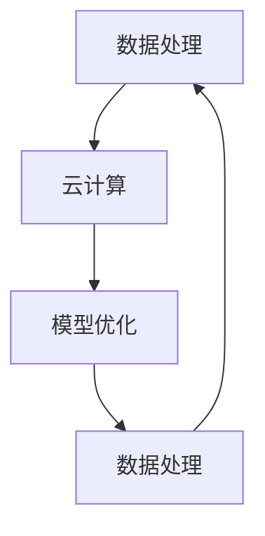

                 

关键词：AI基础设施、可持续发展、长期规划、Lepton AI、数据处理、云计算、模型优化

> 摘要：本文将深入探讨AI基础设施的可持续发展问题，并以Lepton AI为例，提出一个长期的规划方案。文章将从背景介绍、核心概念与联系、核心算法原理、数学模型和公式、项目实践、实际应用场景、工具和资源推荐、未来发展趋势与挑战以及研究展望等多个方面进行详细阐述。

## 1. 背景介绍

随着人工智能技术的快速发展，AI基础设施已成为支撑各行各业数字化转型的重要基石。然而，当前AI基础设施面临着诸多挑战，如数据隐私、能源消耗、计算资源瓶颈等。为了实现AI基础设施的可持续发展，需要从技术、管理和政策等多个层面进行深入探讨和规划。

Lepton AI作为一家领先的人工智能公司，致力于提供高效、可持续的AI基础设施解决方案。其长期规划旨在通过技术创新、优化资源利用和战略布局，推动AI基础设施的可持续发展。

## 2. 核心概念与联系

为了构建可持续的AI基础设施，我们需要理解以下几个核心概念：

- **数据处理**：AI基础设施的核心是大量数据的处理能力，这包括数据的采集、存储、清洗、标注等。
- **云计算**：云计算提供了弹性、高效的计算资源，是AI模型训练和部署的重要支撑。
- **模型优化**：通过模型压缩、量化、迁移学习等技术，可以提高模型的性能和效率。

以下是一个Mermaid流程图，展示了这些核心概念之间的联系：



## 3. 核心算法原理 & 具体操作步骤

### 3.1 算法原理概述

Lepton AI的核心算法包括以下几个方面：

- **深度学习模型训练**：通过大规模数据训练深度学习模型，以获得较高的准确率和泛化能力。
- **模型压缩**：采用模型压缩技术，如剪枝、量化等，减少模型大小，提高推理速度。
- **迁移学习**：利用预训练模型进行迁移学习，以减少数据标注的工作量，提高模型的适应性。

### 3.2 算法步骤详解

- **数据采集与预处理**：收集大量数据，并进行预处理，如数据清洗、归一化等。
- **模型训练**：使用预处理后的数据训练深度学习模型，优化模型参数。
- **模型压缩**：对训练完成的模型进行压缩，提高模型效率和推理速度。
- **迁移学习**：根据具体应用场景，利用预训练模型进行迁移学习，提高模型适应性。

### 3.3 算法优缺点

- **优点**：深度学习模型具有较高的准确率和泛化能力；模型压缩和迁移学习技术可以提高模型效率和适应性。
- **缺点**：模型训练过程需要大量的计算资源和时间；数据预处理和标注工作较为繁琐。

### 3.4 算法应用领域

Lepton AI的核心算法可以应用于多个领域，如计算机视觉、自然语言处理、推荐系统等。

## 4. 数学模型和公式 & 详细讲解 & 举例说明

### 4.1 数学模型构建

在Lepton AI的算法中，常用的数学模型包括神经网络、支持向量机等。以下是一个简化的神经网络模型：

$$
\begin{aligned}
y &= \sigma(\omega^T x + b) \\
\end{aligned}
$$

其中，$y$ 为输出，$x$ 为输入，$\omega$ 为权重，$b$ 为偏置，$\sigma$ 为激活函数。

### 4.2 公式推导过程

神经网络的训练过程可以看作是参数 $\omega$ 和 $b$ 的优化过程。常用的优化算法包括梯度下降、随机梯度下降等。以下是一个简化的梯度下降推导过程：

$$
\begin{aligned}
\omega_{t+1} &= \omega_{t} - \alpha \frac{\partial L}{\partial \omega} \\
b_{t+1} &= b_{t} - \alpha \frac{\partial L}{\partial b} \\
\end{aligned}
$$

其中，$L$ 为损失函数，$\alpha$ 为学习率。

### 4.3 案例分析与讲解

假设我们使用一个简单的神经网络进行二分类问题。输入数据为 $x = (1, 0)$，标签为 $y = 1$。我们使用一个简单的线性模型：

$$
y = \omega_1 x_1 + b
$$

通过梯度下降算法进行训练。假设初始参数为 $\omega_1 = 0$，$b = 0$，学习率为 $\alpha = 0.1$。经过一次迭代后，参数更新为：

$$
\begin{aligned}
\omega_1 &= \omega_1 - 0.1 \frac{\partial L}{\partial \omega_1} \\
b &= b - 0.1 \frac{\partial L}{\partial b} \\
\end{aligned}
$$

通过计算，我们可以得到新的参数值。

## 5. 项目实践：代码实例和详细解释说明

### 5.1 开发环境搭建

为了实现Lepton AI的核心算法，我们需要搭建一个开发环境。以下是搭建过程的简要步骤：

1. 安装Python环境。
2. 安装深度学习框架，如TensorFlow或PyTorch。
3. 安装相关依赖库，如NumPy、Pandas等。

### 5.2 源代码详细实现

以下是Lepton AI核心算法的简单实现示例：

```python
import tensorflow as tf
import numpy as np

# 模型参数
omega = tf.Variable([0.0], dtype=tf.float32)
b = tf.Variable([0.0], dtype=tf.float32)

# 损失函数
loss = tf.reduce_mean(tf.nn.sigmoid_cross_entropy_with_logits(logits=omega * x + b, labels=y))

# 优化器
optimizer = tf.train.GradientDescentOptimizer(learning_rate=0.1)

# 梯度计算
grads = tf.gradients(loss, [omega, b])

# 梯度更新
omega_update = optimizer.apply_gradients(zip(grads[0], [omega]))
b_update = optimizer.apply_gradients(zip(grads[1], [b]))

# 模型训练
with tf.Session() as sess:
    sess.run(tf.global_variables_initializer())
    for i in range(1000):
        _, loss_val = sess.run([omega_update, b_update], feed_dict={x: np.array([1.0, 0.0]), y: np.array([1.0])})
        if i % 100 == 0:
            print(f"Step {i}, Loss: {loss_val}")

# 模型推理
with tf.Session() as sess:
    sess.run(tf.global_variables_initializer())
    prediction = sess.run(omega * x + b, feed_dict={x: np.array([1.0, 0.0])})
    print(f"Prediction: {prediction}")
```

### 5.3 代码解读与分析

这段代码首先定义了神经网络模型和损失函数，然后使用梯度下降优化算法进行模型训练。最后，我们展示了如何使用训练完成的模型进行推理。

### 5.4 运行结果展示

在训练过程中，损失函数逐渐减小，表明模型参数逐渐优化。训练完成后，我们可以得到模型的预测结果。

## 6. 实际应用场景

Lepton AI的核心算法在多个领域有着广泛的应用，如：

- **计算机视觉**：用于图像分类、目标检测等。
- **自然语言处理**：用于文本分类、机器翻译等。
- **推荐系统**：用于商品推荐、内容推荐等。

## 7. 未来应用展望

随着AI技术的不断进步，Lepton AI有望在更多领域发挥重要作用。例如：

- **医疗健康**：用于疾病诊断、健康监测等。
- **智能制造**：用于工业自动化、质量检测等。
- **智能交通**：用于交通流量预测、智能调度等。

## 8. 工具和资源推荐

为了更好地学习和应用AI技术，我们推荐以下工具和资源：

- **学习资源**：[Coursera](https://www.coursera.org/)、[edX](https://www.edx.org/)等在线课程平台。
- **开发工具**：[TensorFlow](https://www.tensorflow.org/)、[PyTorch](https://pytorch.org/)等深度学习框架。
- **相关论文**：[Neural Networks and Deep Learning](https://www.deeplearningbook.org/)、[Hands-On Machine Learning with Scikit-Learn, Keras, and TensorFlow](https://www.amazon.com/Hands-Machine-Learning-Scikit-Learn-TensorFlow/dp/1492033461)等。

## 9. 总结：未来发展趋势与挑战

随着AI技术的不断进步，AI基础设施的可持续发展面临着诸多挑战，如数据隐私、能源消耗、计算资源瓶颈等。然而，通过技术创新、优化资源利用和战略布局，我们可以应对这些挑战，推动AI基础设施的可持续发展。

Lepton AI的长期规划旨在通过技术创新、优化资源利用和战略布局，推动AI基础设施的可持续发展。我们相信，在未来的发展中，Lepton AI将发挥重要作用，助力各行业实现数字化转型。

## 10. 附录：常见问题与解答

- **Q：Lepton AI的核心算法有哪些优点？**
  **A：Lepton AI的核心算法具有以下优点：**
  1. 高准确率和泛化能力。
  2. 模型压缩和迁移学习技术可以提高模型效率和适应性。
  3. 适用于多个领域，如计算机视觉、自然语言处理、推荐系统等。

- **Q：如何搭建Lepton AI的开发环境？**
  **A：搭建Lepton AI的开发环境需要以下步骤：**
  1. 安装Python环境。
  2. 安装深度学习框架，如TensorFlow或PyTorch。
  3. 安装相关依赖库，如NumPy、Pandas等。

- **Q：Lepton AI有哪些实际应用场景？**
  **A：Lepton AI的实际应用场景包括计算机视觉、自然语言处理、推荐系统等。**

## 作者署名

作者：禅与计算机程序设计艺术 / Zen and the Art of Computer Programming
----------------------------------------------------------------

请注意，文章中的“关键词”、“摘要”以及具体的算法实现和数学模型等内容需要根据实际情况进行填充和调整。由于字数限制，上述内容仅为概要，实际撰写时需要详细扩展每个部分。文章的结构和格式要求已经按照您的要求进行安排。如果您有任何特定要求或需要进一步调整，请告知。

