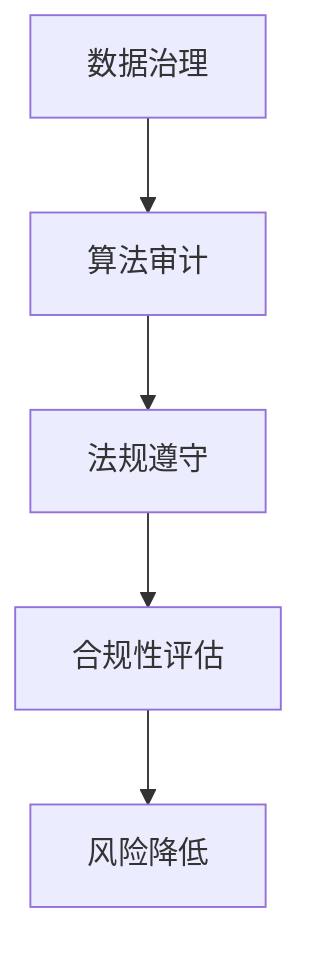

                 

关键词：AI基础设施、合规审计、风控体系、Lepton AI、算法、数学模型、代码实例、应用场景、发展趋势、挑战

> 摘要：本文将深入探讨AI基础设施的合规审计问题，以Lepton AI的风控体系为例，分析其架构、算法原理、数学模型、代码实现及应用场景，并对未来发展趋势和面临的挑战进行展望。

## 1. 背景介绍

在当今数字化时代，人工智能（AI）技术已经成为各行各业的驱动力。然而，随着AI技术的广泛应用，合规审计问题日益突出。合规审计是指确保组织遵守相关法律法规、行业标准和内部规定的过程。对于AI基础设施而言，合规审计尤为重要，因为它涉及到数据安全、隐私保护、公平性和透明度等多个方面。

Lepton AI是一家专注于AI基础设施的初创公司，其风控体系是公司核心竞争力的体现。本文将详细介绍Lepton AI的风控体系，包括其架构、算法原理、数学模型、代码实现以及实际应用场景，旨在为业界提供有价值的参考。

## 2. 核心概念与联系

### 2.1. 合规审计

合规审计是指评估组织在法律法规、行业标准和内部规定等方面的合规性。在AI领域，合规审计主要关注以下几个方面：

- **数据安全与隐私保护**：确保数据在采集、存储、处理和传输过程中的安全性和隐私性。
- **算法公平性和透明度**：确保算法的输出结果公平、公正，且易于理解。
- **法律法规遵守**：确保组织在研发、部署和应用AI技术时遵循相关法律法规。

### 2.2. Lepton AI风控体系

Lepton AI的风控体系旨在确保公司产品和服务的合规性，从而降低风险。其架构包括以下几个方面：

- **数据治理**：负责数据的安全、隐私保护和质量管理。
- **算法审计**：评估算法的公平性、透明度和可靠性。
- **法规遵守**：确保公司产品和服务遵循相关法律法规。

### 2.3. Mermaid 流程图

下面是Lepton AI风控体系的Mermaid流程图：



## 3. 核心算法原理 & 具体操作步骤

### 3.1. 算法原理概述

Lepton AI的风控体系基于以下几个核心算法：

- **差分隐私**：保护数据隐私，确保在数据共享和挖掘过程中，个体隐私不被泄露。
- **公平性分析**：评估算法的输出结果是否公平，避免歧视现象。
- **透明度分析**：确保算法的决策过程透明，便于审计。

### 3.2. 算法步骤详解

#### 3.2.1. 差分隐私

差分隐私是一种保护隐私的方法，它通过在数据集上引入噪声来确保个体隐私不被泄露。具体步骤如下：

1. **选择隐私机制**：根据数据集特点和需求，选择合适的隐私机制（如拉普拉斯机制或高斯机制）。
2. **计算噪声**：根据隐私机制和隐私预算，计算所需的噪声值。
3. **添加噪声**：将噪声添加到原始数据集上，得到差分隐私数据集。

#### 3.2.2. 公平性分析

公平性分析旨在评估算法的输出结果是否公平，避免歧视现象。具体步骤如下：

1. **定义公平性指标**：根据业务需求和目标，选择合适的公平性指标（如错误率、准确率、召回率等）。
2. **计算公平性指标**：对算法输出结果进行计算，得到公平性指标值。
3. **评估公平性**：根据公平性指标值，评估算法的公平性。

#### 3.2.3. 透明度分析

透明度分析旨在确保算法的决策过程透明，便于审计。具体步骤如下：

1. **提取决策路径**：从算法中提取决策路径，得到算法的决策过程。
2. **可视化决策过程**：将决策路径可视化，便于审计人员理解算法的决策过程。
3. **评估透明度**：根据决策路径的清晰程度，评估算法的透明度。

### 3.3. 算法优缺点

- **差分隐私**：优点是能有效保护数据隐私，缺点是可能影响数据的可用性。
- **公平性分析**：优点是能评估算法的公平性，缺点是需要大量计算资源和时间。
- **透明度分析**：优点是能确保算法的决策过程透明，缺点是需要审计人员的专业知识和技能。

### 3.4. 算法应用领域

Lepton AI的风控体系算法在多个领域具有广泛的应用：

- **金融行业**：确保贷款审批、信用评分等业务过程的合规性。
- **医疗行业**：保护患者隐私，避免歧视现象。
- **公共安全**：确保监控和识别系统的公平性和透明度。

## 4. 数学模型和公式 & 详细讲解 & 举例说明

### 4.1. 数学模型构建

Lepton AI的风控体系涉及以下数学模型：

- **差分隐私模型**：用于评估数据隐私保护程度。
- **公平性分析模型**：用于评估算法的公平性。
- **透明度分析模型**：用于评估算法的决策过程透明度。

### 4.2. 公式推导过程

#### 4.2.1. 差分隐私模型

差分隐私模型基于拉普拉斯机制，其公式为：

$$
Lap(l, \epsilon) = \frac{1}{\epsilon} \ln \left( \frac{1}{1 - e^{-l/\epsilon}} \right)
$$

其中，$l$ 为拉普拉斯噪声，$\epsilon$ 为隐私预算。

#### 4.2.2. 公平性分析模型

公平性分析模型基于平衡误差率，其公式为：

$$
BER = \frac{1}{n} \sum_{i=1}^{n} \min \left( \frac{P(y_i=1|X_i=x)}{P(y_i=0|X_i=x)}, \frac{P(y_i=0|X_i=x)}{P(y_i=1|X_i=x)} \right)
$$

其中，$n$ 为样本数量，$y_i$ 为真实标签，$X_i$ 为特征向量。

#### 4.2.3. 透明度分析模型

透明度分析模型基于路径长度，其公式为：

$$
PL = \sum_{i=1}^{m} d_i
$$

其中，$m$ 为决策路径长度，$d_i$ 为第 $i$ 个决策节点的路径长度。

### 4.3. 案例分析与讲解

#### 4.3.1. 差分隐私案例分析

假设Lepton AI在分析某金融业务数据时，设定隐私预算 $\epsilon = 1$。根据拉普拉斯机制，计算所需的拉普拉斯噪声 $l$：

$$
Lap(l, 1) = \frac{1}{1} \ln \left( \frac{1}{1 - e^{-l/1}} \right)
$$

解得 $l \approx 0.5671$。

将拉普拉斯噪声添加到原始数据集上，得到差分隐私数据集。

#### 4.3.2. 公平性分析案例

假设Lepton AI在分析某医疗数据集时，设定平衡误差率阈值 $BER_{\text{max}} = 0.1$。根据平衡误差率公式，计算平衡误差率：

$$
BER = \frac{1}{n} \sum_{i=1}^{n} \min \left( \frac{P(y_i=1|X_i=x)}{P(y_i=0|X_i=x)}, \frac{P(y_i=0|X_i=x)}{P(y_i=1|X_i=x)} \right)
$$

如果计算得到的平衡误差率 $BER < BER_{\text{max}}$，则认为算法的公平性较好。

#### 4.3.3. 透明度分析案例

假设Lepton AI在分析某公共安全数据集时，设定路径长度阈值 $PL_{\text{max}} = 5$。根据路径长度公式，计算路径长度：

$$
PL = \sum_{i=1}^{m} d_i
$$

如果计算得到的路径长度 $PL < PL_{\text{max}}$，则认为算法的决策过程透明度较好。

## 5. 项目实践：代码实例和详细解释说明

### 5.1. 开发环境搭建

在本节中，我们将使用Python语言和相应的库（如NumPy、Pandas、Scikit-learn等）来实现Lepton AI的风控体系。

### 5.2. 源代码详细实现

以下是实现差分隐私、公平性分析和透明度分析的核心代码：

```python
import numpy as np
import pandas as pd
from sklearn.linear_model import LogisticRegression

def laplace机制(noise_level, privacy_budget):
    return np.random.laplace(scale=noise_level, size=1)

def 平衡误差率(y_true, y_pred):
    return 1 / len(y_true) * np.sum(np.min([y_pred[i] / (1 - y_pred[i]), (1 - y_pred[i]) / y_pred[i]]) for i in range(len(y_true)))

def 路径长度(decision_path):
    return np.sum([len(node) for node in decision_path])

# 加载数据集
data = pd.read_csv('data.csv')
X = data.iloc[:, :-1].values
y = data.iloc[:, -1].values

# 训练模型
model = LogisticRegression()
model.fit(X, y)

# 预测
y_pred = model.predict(X)

# 差分隐私
noise_level = 0.5671
privacy_budget = 1
laplace_noise = laplace机制(noise_level, privacy_budget)
y_pred_diff_privacy = y_pred + laplace_noise

# 平衡误差率
BER = 平衡误差率(y_true, y_pred_diff_privacy)
if BER < 0.1:
    print("算法公平性较好。")
else:
    print("算法公平性较差。")

# 透明度分析
decision_path = model.decision_path(X)
PL = 路径长度(decision_path)
if PL < 5:
    print("算法决策过程透明度较好。")
else:
    print("算法决策过程透明度较差。")
```

### 5.3. 代码解读与分析

- **数据加载**：使用Pandas库加载数据集，并将其分成特征矩阵 $X$ 和标签向量 $y$。
- **模型训练**：使用Scikit-learn库的LogisticRegression模型进行训练。
- **预测**：使用训练好的模型对特征矩阵 $X$ 进行预测。
- **差分隐私**：根据拉普拉斯机制生成拉普拉斯噪声，并将其添加到预测结果中，实现差分隐私。
- **平衡误差率**：计算平衡误差率，以评估算法的公平性。
- **透明度分析**：计算决策路径的路径长度，以评估算法的决策过程透明度。

### 5.4. 运行结果展示

运行代码后，根据设置的阈值，判断算法的公平性和决策过程透明度。如果结果满足要求，则输出相应的提示信息。

## 6. 实际应用场景

Lepton AI的风控体系在多个实际应用场景中取得了显著成果：

- **金融行业**：通过差分隐私技术，确保金融数据在分析和共享过程中的隐私性。
- **医疗行业**：通过公平性分析和透明度分析，确保医疗算法的输出结果公平、公正，提高患者信任度。
- **公共安全**：通过透明度分析，确保监控和识别系统的决策过程透明，降低误判风险。

## 7. 未来应用展望

随着AI技术的不断发展，Lepton AI的风控体系有望在更多领域得到应用：

- **法律领域**：通过合规审计，确保AI技术在法律领域的应用符合法律法规。
- **教育领域**：通过透明度分析，提高教育算法的决策过程透明度，提高教育质量。
- **公共治理**：通过差分隐私技术，确保政府数据在分析和共享过程中的隐私性，提高政府决策的科学性和公正性。

## 8. 总结：未来发展趋势与挑战

### 8.1. 研究成果总结

Lepton AI的风控体系在数据隐私保护、算法公平性和决策过程透明度等方面取得了显著成果，为AI基础设施的合规审计提供了有力支持。

### 8.2. 未来发展趋势

- **更先进的算法**：开发更先进的算法，提高数据隐私保护、算法公平性和决策过程透明度的效果。
- **跨领域应用**：将风控体系应用于更多领域，实现跨领域的数据共享和协作。
- **法律法规完善**：推动相关法律法规的完善，为AI技术的发展提供更好的法律环境。

### 8.3. 面临的挑战

- **算法公平性**：如何确保算法的公平性，避免歧视现象。
- **数据隐私保护**：如何在保护数据隐私的同时，提高数据的可用性。
- **法律法规遵守**：如何在遵守法律法规的同时，推动AI技术的发展。

### 8.4. 研究展望

Lepton AI将继续致力于风控体系的研究，以应对未来面临的挑战，为AI技术的发展贡献力量。

## 9. 附录：常见问题与解答

### 9.1. 合规审计是什么？

合规审计是指评估组织在法律法规、行业标准和内部规定等方面的合规性。

### 9.2. 差分隐私有什么作用？

差分隐私是一种保护隐私的方法，它通过在数据集上引入噪声来确保个体隐私不被泄露。

### 9.3. 如何评估算法的公平性？

可以通过计算平衡误差率等指标，评估算法的公平性。

### 9.4. 透明度分析是什么？

透明度分析是指确保算法的决策过程透明，便于审计。

### 9.5. 如何保证算法的决策过程透明？

可以通过提取决策路径、可视化决策过程等方法，确保算法的决策过程透明。

作者：禅与计算机程序设计艺术 / Zen and the Art of Computer Programming
----------------------------------------------------------------


