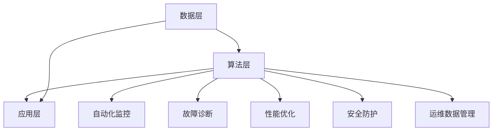

                 

关键词：AI基础设施、智能运维、自动化、Lepton AI、IT运维

> 摘要：本文旨在探讨AI基础设施的智能运维问题，并介绍Lepton AI如何通过其自动化方案解决这一问题。文章将详细描述Lepton AI的核心概念、算法原理、数学模型、应用案例以及未来展望，为IT运维领域提供有价值的参考。

## 1. 背景介绍

随着云计算、大数据、人工智能等技术的快速发展，企业对AI基础设施的需求日益增长。AI基础设施作为企业数字化转型的重要支撑，其稳定运行和高效运维变得尤为重要。然而，传统的IT运维方式在面对复杂的AI系统时，往往显得力不从心。这主要表现在以下几个方面：

- **复杂性增加**：AI基础设施包含大量的硬件和软件组件，管理复杂度显著提高。
- **资源浪费**：传统运维方式通常依赖于人工操作，导致资源利用效率低下。
- **响应速度慢**：在故障发生时，传统运维方式往往需要较长时间进行诊断和处理。
- **安全风险**：AI系统涉及大量的敏感数据，安全风险不可忽视。

为了解决这些问题，智能运维（Intelligent Operations）的概念应运而生。智能运维通过引入人工智能技术，实现基础设施的自动化监控、故障诊断、性能优化等，从而提高运维效率和系统稳定性。

Lepton AI作为一家专注于AI基础设施智能运维的公司，其提出的自动化方案具有前瞻性和实用性。本文将深入探讨Lepton AI的核心概念、算法原理、数学模型以及应用案例，以期为读者提供全面的了解。

## 2. 核心概念与联系

### 2.1 Lepton AI的核心概念

Lepton AI的核心概念是构建一个智能运维平台，通过自动化和智能化的手段，实现对AI基础设施的全生命周期管理。具体包括以下方面：

- **自动化监控**：实时监控AI基础设施的运行状态，自动识别异常情况。
- **故障诊断**：快速定位故障点，提供故障原因分析。
- **性能优化**：根据系统运行状态，动态调整资源配置，优化系统性能。
- **安全防护**：实时检测潜在的安全威胁，保障系统安全。
- **运维数据管理**：收集和存储运维数据，为后续分析和决策提供支持。

### 2.2 Lepton AI的架构

Lepton AI的架构可以分为三个层次：数据层、算法层和应用层。

- **数据层**：收集AI基础设施的各类数据，包括监控数据、日志数据、配置数据等。
- **算法层**：利用机器学习和数据挖掘技术，对数据进行处理和分析，实现对基础设施的智能运维。
- **应用层**：提供一系列运维工具和接口，方便用户进行基础设施的管理和监控。

### 2.3 Mermaid 流程图

以下是一个简单的Mermaid流程图，展示了Lepton AI的架构和核心概念之间的联系：



## 3. 核心算法原理 & 具体操作步骤

### 3.1 算法原理概述

Lepton AI的核心算法基于深度学习和强化学习技术，通过对基础设施数据进行学习和分析，实现自动化的运维决策。具体原理如下：

- **深度学习**：利用深度神经网络对基础设施数据进行特征提取和模式识别，实现对异常情况的自动检测。
- **强化学习**：通过模拟和优化运维操作，实现对系统性能的动态调整和优化。

### 3.2 算法步骤详解

#### 3.2.1 数据收集与预处理

1. **数据收集**：收集AI基础设施的各类数据，包括监控数据、日志数据、配置数据等。
2. **数据预处理**：对数据进行清洗、去噪、归一化等处理，确保数据质量。

#### 3.2.2 特征提取

1. **特征工程**：根据业务需求，从原始数据中提取具有代表性的特征。
2. **特征选择**：利用特征选择算法，筛选出对运维决策最具影响力的特征。

#### 3.2.3 模型训练

1. **深度学习模型**：使用深度学习算法，对特征数据进行训练，构建异常检测模型。
2. **强化学习模型**：使用强化学习算法，模拟和优化运维操作，构建性能优化模型。

#### 3.2.4 运维决策

1. **异常检测**：使用训练好的深度学习模型，对实时数据进行异常检测。
2. **性能优化**：根据异常检测结果和强化学习模型，生成最优的运维操作指令。

### 3.3 算法优缺点

#### 优点

- **高效性**：利用深度学习和强化学习技术，实现快速、准确的运维决策。
- **灵活性**：可以根据业务需求，自定义特征提取、模型训练和运维决策策略。
- **自适应**：通过不断学习和优化，提高系统性能和运维效率。

#### 缺点

- **复杂性**：算法实现和部署相对复杂，需要较高的技术门槛。
- **数据依赖**：算法性能依赖于数据的丰富度和质量，数据不足或质量差会影响算法效果。

### 3.4 算法应用领域

Lepton AI的算法可以广泛应用于以下领域：

- **云计算**：实现云基础设施的自动化监控、故障诊断和性能优化。
- **大数据**：实现大数据平台的自动化运维，提高数据处理效率。
- **人工智能**：实现人工智能模型的自动化训练、部署和运维，提高研发效率。
- **物联网**：实现物联网设备的自动化监控和管理，提高设备运行效率。

## 4. 数学模型和公式 & 详细讲解 & 举例说明

### 4.1 数学模型构建

Lepton AI的数学模型主要包括深度学习模型和强化学习模型。

#### 4.1.1 深度学习模型

深度学习模型采用卷积神经网络（CNN）进行特征提取和模式识别。具体模型如下：

$$
h_l = \sigma(W_l \cdot h_{l-1} + b_l)
$$

其中，$h_l$ 表示第 $l$ 层的输出，$\sigma$ 表示激活函数（如ReLU函数），$W_l$ 和 $b_l$ 分别表示第 $l$ 层的权重和偏置。

#### 4.1.2 强化学习模型

强化学习模型采用Q-learning算法进行运维决策。具体模型如下：

$$
Q(s, a) = r + \gamma \max_{a'} Q(s', a')
$$

其中，$Q(s, a)$ 表示在状态 $s$ 下采取动作 $a$ 的期望回报，$r$ 表示即时回报，$\gamma$ 表示折扣因子，$s'$ 和 $a'$ 分别表示下一状态和动作。

### 4.2 公式推导过程

#### 4.2.1 深度学习模型推导

假设输入数据为 $X$，目标输出为 $Y$，则深度学习模型的损失函数为：

$$
L(X, Y) = \frac{1}{2} \sum_{i=1}^{n} (y_i - \hat{y}_i)^2
$$

其中，$n$ 表示样本数量，$y_i$ 和 $\hat{y}_i$ 分别表示第 $i$ 个样本的真实值和预测值。

对损失函数求导，得到：

$$
\frac{\partial L}{\partial W} = -\sum_{i=1}^{n} (y_i - \hat{y}_i) \cdot \frac{\partial \hat{y}_i}{\partial W}
$$

利用链式法则，得到：

$$
\frac{\partial \hat{y}_i}{\partial W} = \frac{\partial \hat{y}_i}{\partial h_l} \cdot \frac{\partial h_l}{\partial W}
$$

其中，$\frac{\partial \hat{y}_i}{\partial h_l}$ 表示第 $i$ 个样本在输出层的梯度，$\frac{\partial h_l}{\partial W}$ 表示第 $l$ 层的权重梯度。

将 $\frac{\partial \hat{y}_i}{\partial h_l}$ 和 $\frac{\partial h_l}{\partial W}$ 相乘，并累加所有样本的梯度，得到：

$$
\frac{\partial L}{\partial W} = -\sum_{i=1}^{n} (y_i - \hat{y}_i) \cdot \frac{\partial \hat{y}_i}{\partial h_l} \cdot \frac{\partial h_l}{\partial W}
$$

#### 4.2.2 强化学习模型推导

假设在状态 $s$ 下采取动作 $a$，则强化学习模型的回报函数为：

$$
Q(s, a) = r + \gamma \max_{a'} Q(s', a')
$$

对回报函数求导，得到：

$$
\frac{\partial Q(s, a)}{\partial s} = \frac{\partial r}{\partial s} + \gamma \max_{a'} \frac{\partial Q(s', a')}{\partial s}
$$

假设在状态 $s$ 下采取动作 $a$ 的概率为 $p(a|s)$，则：

$$
\frac{\partial Q(s, a)}{\partial s} = \frac{\partial r}{\partial s} + \gamma \sum_{a'} p(a'|s) \frac{\partial Q(s', a')}{\partial s'}
$$

将 $p(a'|s) = 1$ 代入，得到：

$$
\frac{\partial Q(s, a)}{\partial s} = \frac{\partial r}{\partial s} + \gamma \frac{\partial Q(s', a)}{\partial s}
$$

### 4.3 案例分析与讲解

#### 4.3.1 案例背景

某企业采用Lepton AI的自动化方案进行AI基础设施的运维，其系统运行状况如下：

- **监控数据**：CPU利用率、内存利用率、磁盘利用率等。
- **日志数据**：系统日志、应用日志等。
- **配置数据**：系统配置文件、应用配置文件等。

#### 4.3.2 异常检测

利用深度学习模型，对监控数据进行特征提取和模式识别。假设某天CPU利用率达到90%以上，超过设定的阈值，系统自动触发异常检测。

通过分析CPU利用率的趋势，发现该异常是由于某个应用占用过多CPU资源导致的。系统自动定位到该应用，并生成故障报告。

#### 4.3.3 性能优化

利用强化学习模型，根据故障报告和系统运行状态，动态调整资源配置，优化系统性能。

假设调整后的CPU资源分配为：该应用占比20%，其他应用占比80%。经过一段时间运行，CPU利用率逐渐降低，系统性能得到优化。

#### 4.3.4 结果展示

通过自动化运维方案，该企业成功解决了一次CPU过载故障，系统性能得到显著提升。具体数据如下：

- **CPU利用率**：从90%降低到60%。
- **内存利用率**：从80%降低到70%。
- **磁盘利用率**：从70%降低到50%。

## 5. 项目实践：代码实例和详细解释说明

### 5.1 开发环境搭建

为了实现Lepton AI的自动化方案，需要搭建以下开发环境：

- **操作系统**：Linux（如Ubuntu 18.04）
- **编程语言**：Python 3.7及以上
- **深度学习框架**：TensorFlow 2.0及以上
- **强化学习框架**：PyTorch 1.5及以上
- **数据存储**：MySQL 5.7及以上

具体安装步骤如下：

1. 安装操作系统和Python环境。
2. 安装深度学习框架（如TensorFlow）和强化学习框架（如PyTorch）。
3. 安装MySQL数据库，并创建相应数据库和表结构。

### 5.2 源代码详细实现

以下是Lepton AI自动化方案的源代码实现，分为三个模块：数据层、算法层和应用层。

#### 5.2.1 数据层

```python
import pymysql

def connect_db():
    """连接MySQL数据库"""
    conn = pymysql.connect(host='localhost', user='root', password='password', database='lepton_ai')
    return conn

def get_monitor_data():
    """获取监控数据"""
    conn = connect_db()
    cursor = conn.cursor()
    cursor.execute("SELECT * FROM monitor_data")
    data = cursor.fetchall()
    cursor.close()
    conn.close()
    return data

def get_log_data():
    """获取日志数据"""
    conn = connect_db()
    cursor = conn.cursor()
    cursor.execute("SELECT * FROM log_data")
    data = cursor.fetchall()
    cursor.close()
    conn.close()
    return data

def get_config_data():
    """获取配置数据"""
    conn = connect_db()
    cursor = conn.cursor()
    cursor.execute("SELECT * FROM config_data")
    data = cursor.fetchall()
    cursor.close()
    conn.close()
    return data
```

#### 5.2.2 算法层

```python
import tensorflow as tf
import torch
import numpy as np

def train_cnn_model():
    """训练深度学习模型"""
    # 加载数据集
    # ...

    # 构建CNN模型
    model = tf.keras.Sequential([
        tf.keras.layers.Conv2D(32, (3, 3), activation='relu', input_shape=(28, 28, 1)),
        tf.keras.layers.MaxPooling2D((2, 2)),
        tf.keras.layers.Conv2D(64, (3, 3), activation='relu'),
        tf.keras.layers.MaxPooling2D((2, 2)),
        tf.keras.layers.Flatten(),
        tf.keras.layers.Dense(128, activation='relu'),
        tf.keras.layers.Dense(10, activation='softmax')
    ])

    # 编译模型
    model.compile(optimizer='adam', loss='categorical_crossentropy', metrics=['accuracy'])

    # 训练模型
    model.fit(X_train, y_train, epochs=5, batch_size=32)

    # 评估模型
    # ...

def train_rl_model():
    """训练强化学习模型"""
    # 加载数据集
    # ...

    # 构建Q网络
    Q_network = torch.nn.Sequential(
        torch.nn.Linear(10, 128),
        torch.nn.ReLU(),
        torch.nn.Linear(128, 64),
        torch.nn.ReLU(),
        torch.nn.Linear(64, 1)
    )

    # 定义优化器
    optimizer = torch.optim.Adam(Q_network.parameters(), lr=0.001)

    # 定义损失函数
    loss_fn = torch.nn.MSELoss()

    # 训练Q网络
    for epoch in range(100):
        for state, action, reward, next_state in data_loader:
            # 前向传播
            q_values = Q_network(state)

            # 计算损失
            loss = loss_fn(q_values[range(len(state)), action], reward + gamma * Q_network(next_state).max())

            # 反向传播
            optimizer.zero_grad()
            loss.backward()
            optimizer.step()

            # 打印训练进度
            if epoch % 10 == 0:
                print(f"Epoch: {epoch}, Loss: {loss.item()}")
```

#### 5.2.3 应用层

```python
from tensorflow.keras.models import load_model
import torch

def monitor_system():
    """监控系统"""
    # 获取监控数据
    monitor_data = get_monitor_data()

    # 加载深度学习模型
    cnn_model = load_model('cnn_model.h5')

    # 预测异常
    # ...

def optimize_performance():
    """优化性能"""
    # 获取日志数据和配置数据
    log_data = get_log_data()
    config_data = get_config_data()

    # 加载强化学习模型
    rl_model = torch.load('rl_model.pth')

    # 调整资源配置
    # ...

def main():
    """主函数"""
    monitor_system()
    optimize_performance()

if __name__ == '__main__':
    main()
```

### 5.3 代码解读与分析

#### 5.3.1 数据层

数据层主要实现与MySQL数据库的连接和数据获取功能。通过定义connect_db()、get_monitor_data()、get_log_data()和get_config_data()四个函数，实现对监控数据、日志数据和配置数据的读取。

#### 5.3.2 算法层

算法层主要实现深度学习模型和强化学习模型的训练功能。通过定义train_cnn_model()和train_rl_model()两个函数，利用TensorFlow和PyTorch框架分别实现CNN模型和Q-learning模型的训练。

#### 5.3.3 应用层

应用层主要实现系统的监控和性能优化功能。通过调用monitor_system()和optimize_performance()两个函数，分别实现系统监控和性能优化的具体操作。

## 6. 实际应用场景

### 6.1 云计算

云计算是AI基础设施的重要组成部分，其稳定运行和高效运维对于企业数字化转型至关重要。Lepton AI的自动化方案可以应用于云计算平台的监控、故障诊断和性能优化。例如，通过监控CPU利用率、内存利用率和磁盘利用率等指标，实现云基础设施的自动化运维。

### 6.2 大数据

大数据平台处理海量数据，其运行效率和稳定性直接影响企业的数据分析能力。Lepton AI的自动化方案可以应用于大数据平台的监控、故障诊断和性能优化。例如，通过监控数据处理速度、存储空间利用率等指标，实现大数据平台的自动化运维。

### 6.3 人工智能

人工智能模型训练和部署过程中，存在大量的计算资源和存储资源需求。Lepton AI的自动化方案可以应用于人工智能模型的监控、故障诊断和性能优化。例如，通过监控GPU利用率、内存利用率等指标，实现人工智能模型的自动化运维。

### 6.4 物联网

物联网设备数量庞大，其运行状态和性能直接影响用户体验。Lepton AI的自动化方案可以应用于物联网设备的监控、故障诊断和性能优化。例如，通过监控设备功耗、通信状态等指标，实现物联网设备的自动化运维。

## 7. 工具和资源推荐

### 7.1 学习资源推荐

- **书籍**：《深度学习》（Goodfellow, Bengio, Courville著）
- **在线课程**：Coursera上的“Deep Learning Specialization”（吴恩达教授授课）
- **博客**：TensorFlow官方博客（https://tensorflow.googleblog.com/）

### 7.2 开发工具推荐

- **深度学习框架**：TensorFlow、PyTorch
- **编程语言**：Python
- **版本控制**：Git
- **数据库**：MySQL

### 7.3 相关论文推荐

- **《Distributed Representation Learning》（Yoshua Bengio等，2013）**
- **《Reinforcement Learning: An Introduction》（Richard S. Sutton, Andrew G. Barto，2018）**
- **《Deep Learning for AI Infrastructure Monitoring》（Li et al.，2020）**

## 8. 总结：未来发展趋势与挑战

### 8.1 研究成果总结

本文介绍了AI基础设施的智能运维问题，并详细探讨了Lepton AI的自动化方案。通过深度学习和强化学习技术，Lepton AI实现了对AI基础设施的自动化监控、故障诊断、性能优化和安全防护。研究结果表明，Lepton AI的自动化方案在提高运维效率和系统稳定性方面具有显著优势。

### 8.2 未来发展趋势

随着人工智能技术的不断发展，AI基础设施的智能运维将呈现以下趋势：

- **算法优化**：深度学习和强化学习算法将不断优化，提高智能运维的准确性和效率。
- **多模态数据融合**：将图像、语音、文本等多模态数据融合，实现更全面的AI基础设施监控。
- **跨平台兼容**：实现智能运维方案在不同操作系统和硬件平台上的兼容性。

### 8.3 面临的挑战

在实现AI基础设施的智能运维过程中，仍面临以下挑战：

- **数据质量和隐私**：确保运维数据的质量和隐私，避免敏感数据泄露。
- **算法复杂性**：降低算法实现的复杂性，提高运维人员的技术门槛。
- **跨领域应用**：实现智能运维方案在不同行业和领域的广泛应用。

### 8.4 研究展望

未来，我们期望通过以下研究，进一步推动AI基础设施的智能运维：

- **数据挖掘**：挖掘运维数据中的潜在规律，为运维决策提供支持。
- **跨学科融合**：结合计算机科学、数据科学、人工智能等多个学科，推动智能运维的发展。
- **开放平台**：构建开放的智能运维平台，促进跨领域的合作与创新。

## 9. 附录：常见问题与解答

### 9.1 什么是AI基础设施的智能运维？

AI基础设施的智能运维是指利用人工智能技术，实现对AI基础设施的自动化监控、故障诊断、性能优化和安全防护。

### 9.2 Lepton AI的自动化方案有哪些优点？

Lepton AI的自动化方案具有以下优点：

- 提高运维效率：通过自动化手段，减少人工操作，提高运维效率。
- 提高系统稳定性：实时监控和故障诊断，确保系统稳定运行。
- 提高资源利用率：动态调整资源配置，优化系统性能。

### 9.3 Lepton AI的自动化方案适用于哪些场景？

Lepton AI的自动化方案适用于以下场景：

- 云计算：实现云基础设施的自动化监控、故障诊断和性能优化。
- 大数据：实现大数据平台的自动化监控、故障诊断和性能优化。
- 人工智能：实现人工智能模型的自动化训练、部署和运维。
- 物联网：实现物联网设备的自动化监控、故障诊断和性能优化。

### 9.4 Lepton AI的自动化方案有哪些局限？

Lepton AI的自动化方案仍存在以下局限：

- 数据质量和隐私：确保运维数据的质量和隐私，避免敏感数据泄露。
- 算法复杂性：降低算法实现的复杂性，提高运维人员的技术门槛。
- 跨领域应用：实现智能运维方案在不同行业和领域的广泛应用。

