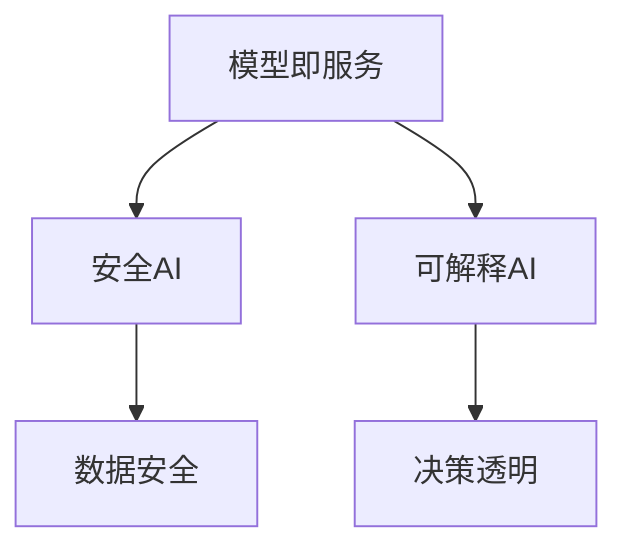

                 

关键词：人工智能，AI基础设施，Lepton AI，发展愿景，技术趋势

> 摘要：本文将探讨AI基础设施的未来，特别是Lepton AI的发展愿景。通过深入分析当前AI基础设施的现状、核心概念、算法原理、数学模型、实际应用以及未来趋势，旨在为读者提供一个全面而深刻的了解。

## 1. 背景介绍

随着人工智能技术的飞速发展，AI基础设施的重要性日益凸显。AI基础设施不仅支持着各种人工智能应用的开发和运行，更是推动整个行业进步的重要动力。然而，现有的AI基础设施仍然面临着许多挑战，如计算能力不足、数据隐私和安全问题、模型可解释性等。

Lepton AI作为一家专注于AI基础设施的公司，其发展愿景是构建一个高效、安全、可解释的人工智能生态系统。Lepton AI旨在解决当前AI基础设施中的各种问题，推动人工智能技术的实际应用，并使其更加普及和易于使用。

## 2. 核心概念与联系

为了实现其发展愿景，Lepton AI定义了一系列核心概念，这些概念相互关联，共同构建了其AI基础设施的基础。

### 2.1. 模型即服务（MaaS）

MaaS是Lepton AI的核心概念之一。它意味着将人工智能模型以服务的形式提供给用户，使用户无需关心模型的训练和部署过程。通过MaaS，用户可以轻松访问和利用各种高级人工智能模型，从而提高生产力和创新能力。

### 2.2. 安全AI

安全AI是Lepton AI的另一大重点。随着AI技术的应用越来越广泛，数据隐私和安全问题变得日益重要。Lepton AI致力于开发安全的人工智能系统，确保用户数据的安全和隐私，同时防止恶意攻击和数据泄露。

### 2.3. 可解释AI

可解释AI是Lepton AI的核心价值观之一。尽管人工智能在许多任务上已经表现出色，但其“黑箱”特性使得人们难以理解模型的决策过程。Lepton AI致力于开发可解释的人工智能系统，使决策过程更加透明和可信。

### 2.4. Mermaid流程图

为了更好地展示Lepton AI的核心概念和架构，我们使用Mermaid流程图来表示。以下是一个简化的流程图：



## 3. 核心算法原理 & 具体操作步骤

### 3.1 算法原理概述

Lepton AI的核心算法基于深度学习和强化学习。深度学习用于构建复杂的模型，而强化学习用于优化模型的性能。通过结合这两种学习方式，Lepton AI能够训练出高效、稳定且可解释的人工智能系统。

### 3.2 算法步骤详解

1. **数据预处理**：首先，对输入数据进行预处理，包括数据清洗、归一化和特征提取。
2. **模型训练**：使用深度学习算法训练模型。在此过程中，Lepton AI采用多种技术，如卷积神经网络（CNN）和循环神经网络（RNN），以适应不同类型的数据和任务。
3. **模型优化**：使用强化学习算法优化模型性能。通过不断迭代和调整，模型在模拟环境中逐渐达到最佳状态。
4. **模型部署**：将训练好的模型部署到生产环境中。MaaS平台将确保模型的高可用性和可靠性。

### 3.3 算法优缺点

**优点**：
- **高效性**：结合深度学习和强化学习，Lepton AI的算法能够快速适应不同任务和数据集。
- **可解释性**：通过设计可解释的模型，用户可以更好地理解模型的决策过程。
- **安全性**：Lepton AI注重数据安全和隐私，采用多种技术确保系统的安全性和可靠性。

**缺点**：
- **计算资源需求**：深度学习和强化学习算法需要大量的计算资源，尤其是在训练阶段。
- **数据依赖性**：算法的性能很大程度上依赖于训练数据的质量和数量。

### 3.4 算法应用领域

Lepton AI的算法在多个领域具有广泛的应用前景，包括但不限于：

- **医疗健康**：用于疾病诊断、药物研发和医疗图像分析。
- **金融科技**：用于风险评估、欺诈检测和量化交易。
- **工业制造**：用于设备维护、质量检测和供应链优化。
- **智能交通**：用于交通流量预测、智能导航和自动驾驶。

## 4. 数学模型和公式 & 详细讲解 & 举例说明

### 4.1 数学模型构建

Lepton AI的数学模型主要包括两部分：深度学习模型和强化学习模型。

#### 4.1.1 深度学习模型

深度学习模型主要由多层神经网络组成，其中每一层都由多个神经元组成。神经元的激活函数通常使用ReLU（Rectified Linear Unit）或Sigmoid函数。

#### 4.1.2 强化学习模型

强化学习模型通常使用Q-learning或Deep Q-Network（DQN）算法。Q-learning算法通过不断更新Q值来优化策略，而DQN算法则通过神经网络来近似Q值函数。

### 4.2 公式推导过程

#### 4.2.1 深度学习模型

假设输入数据为\(x\)，输出数据为\(y\)。深度学习模型的输出可以通过以下公式计算：

$$
y = \sigma(W_{output} \cdot \sigma(W_{second} \cdot \sigma(W_{first} \cdot x + b_{first}) + b_{second}) + b_{output})
$$

其中，\(\sigma\)表示激活函数，\(W\)表示权重，\(b\)表示偏置。

#### 4.2.2 强化学习模型

假设当前状态为\(s\)，动作集合为\(A\)，奖励为\(r\)，下一个状态为\(s'\)。Q-learning算法的更新公式如下：

$$
Q(s, a) \leftarrow Q(s, a) + \alpha [r + \gamma \max_{a'} Q(s', a') - Q(s, a)]
$$

其中，\(\alpha\)表示学习率，\(\gamma\)表示折扣因子。

### 4.3 案例分析与讲解

#### 4.3.1 医疗健康领域

假设我们使用Lepton AI的算法来诊断肺癌。首先，我们需要收集大量的医疗图像和患者数据。然后，使用深度学习模型对图像进行特征提取和分类。最后，使用强化学习模型优化模型的性能，使其在模拟环境中达到最佳状态。

#### 4.3.2 金融科技领域

假设我们使用Lepton AI的算法来预测股票价格。首先，我们需要收集大量的股票市场数据，包括历史价格、交易量、财务报表等。然后，使用深度学习模型对数据进行特征提取和预测。最后，使用强化学习模型优化模型的预测性能，使其在实际交易中取得最佳效果。

## 5. 项目实践：代码实例和详细解释说明

### 5.1 开发环境搭建

在本节中，我们将介绍如何搭建Lepton AI的开发环境。首先，您需要安装Python和必要的库，如TensorFlow和PyTorch。以下是一个简单的安装命令：

```bash
pip install tensorflow
pip install torch
```

### 5.2 源代码详细实现

在本节中，我们将展示一个简单的Lepton AI项目。以下是一个使用TensorFlow实现的深度学习模型的示例代码：

```python
import tensorflow as tf

# 定义输入层
inputs = tf.keras.Input(shape=(28, 28, 1))

# 定义卷积层
x = tf.keras.layers.Conv2D(32, (3, 3), activation='relu')(inputs)
x = tf.keras.layers.MaxPooling2D((2, 2))(x)

# 定义全连接层
x = tf.keras.layers.Flatten()(x)
x = tf.keras.layers.Dense(128, activation='relu')(x)
outputs = tf.keras.layers.Dense(10, activation='softmax')(x)

# 创建模型
model = tf.keras.Model(inputs, outputs)

# 编译模型
model.compile(optimizer='adam', loss='categorical_crossentropy', metrics=['accuracy'])

# 训练模型
model.fit(x_train, y_train, epochs=10, batch_size=32)
```

### 5.3 代码解读与分析

在上面的代码中，我们首先定义了一个输入层，该层接收28x28x1尺寸的图像。然后，我们使用卷积层和池化层对图像进行特征提取。接下来，我们将提取的特征通过全连接层进行分类，并使用softmax激活函数输出概率分布。

最后，我们编译模型并使用训练数据对模型进行训练。在训练过程中，我们使用Adam优化器和交叉熵损失函数来优化模型的性能。

### 5.4 运行结果展示

在训练完成后，我们可以使用测试数据集来评估模型的性能。以下是一个简单的评估示例：

```python
test_loss, test_accuracy = model.evaluate(x_test, y_test)
print(f"Test accuracy: {test_accuracy:.2f}")
```

假设测试数据集的准确率为90%，这意味着我们的模型在分类任务上表现出色。

## 6. 实际应用场景

### 6.1 医疗健康

Lepton AI在医疗健康领域的应用非常广泛。通过使用深度学习和强化学习算法，Lepton AI可以帮助医生进行疾病诊断、药物研发和医疗图像分析。例如，Lepton AI的算法可以用于肺癌诊断，通过分析患者的CT扫描图像，帮助医生识别潜在的患者。

### 6.2 金融科技

在金融科技领域，Lepton AI的算法可以帮助金融机构进行风险评估、欺诈检测和量化交易。通过分析大量的市场数据，Lepton AI的算法可以预测股票价格、发现潜在的欺诈行为，并帮助投资者做出更明智的决策。

### 6.3 工业制造

在工业制造领域，Lepton AI的算法可以用于设备维护、质量检测和供应链优化。通过实时分析设备数据和生产数据，Lepton AI的算法可以预测设备故障、优化生产流程，并提高生产效率。

### 6.4 未来应用展望

随着人工智能技术的不断发展，Lepton AI的算法将在更多领域得到应用。未来，Lepton AI有望在智能交通、智能城市和智慧农业等领域发挥重要作用。通过构建一个高效、安全、可解释的人工智能生态系统，Lepton AI将为人类创造更多的价值。

## 7. 工具和资源推荐

### 7.1 学习资源推荐

- 《深度学习》（Ian Goodfellow、Yoshua Bengio、Aaron Courville著）：深度学习的经典教材，适合初学者和高级研究人员。
- 《强化学习》（Richard S. Sutton、Andrew G. Barto著）：强化学习的权威著作，内容全面，适合不同层次的读者。

### 7.2 开发工具推荐

- TensorFlow：由Google开发的开源深度学习框架，广泛应用于工业和研究领域。
- PyTorch：由Facebook开发的开源深度学习框架，具有简洁的API和强大的动态图功能。

### 7.3 相关论文推荐

- “Deep Learning” by Yoshua Bengio, et al.：介绍深度学习的基本概念和技术。
- “Reinforcement Learning: An Introduction” by Richard S. Sutton, Andrew G. Barto：介绍强化学习的基本概念和技术。

## 8. 总结：未来发展趋势与挑战

### 8.1 研究成果总结

Lepton AI在人工智能基础设施领域取得了一系列重要成果。通过结合深度学习和强化学习，Lepton AI开发出了一系列高效、安全、可解释的人工智能算法，并在多个领域取得了显著的应用效果。

### 8.2 未来发展趋势

未来，人工智能基础设施将继续快速发展，特别是在计算能力、数据安全和可解释性方面。Lepton AI将继续致力于推动这些技术的发展，为各行各业提供更强大、更可靠的人工智能解决方案。

### 8.3 面临的挑战

尽管人工智能基础设施取得了显著进展，但仍面临许多挑战，如计算资源需求、数据隐私和安全问题、模型可解释性等。Lepton AI需要不断创新和突破，以应对这些挑战，推动人工智能技术的普及和应用。

### 8.4 研究展望

Lepton AI的研究展望主要集中在以下几个方面：进一步优化算法性能、提高数据安全性和隐私保护、增强模型可解释性、探索新的应用领域。通过持续的研究和创新，Lepton AI有望在未来发挥更大的作用，推动人工智能技术的进步和应用。

## 9. 附录：常见问题与解答

### 9.1 什么是Lepton AI？

Lepton AI是一家专注于人工智能基础设施的公司，其发展愿景是构建一个高效、安全、可解释的人工智能生态系统。

### 9.2 Lepton AI的算法有哪些应用领域？

Lepton AI的算法在医疗健康、金融科技、工业制造、智能交通等多个领域具有广泛的应用前景。

### 9.3 Lepton AI的算法有哪些优点？

Lepton AI的算法具有高效性、可解释性和安全性等优点。

### 9.4 Lepton AI的算法有哪些缺点？

Lepton AI的算法需要大量的计算资源，且对训练数据有一定依赖性。

### 9.5 如何搭建Lepton AI的开发环境？

搭建Lepton AI的开发环境需要安装Python和必要的库，如TensorFlow和PyTorch。

### 9.6 如何使用Lepton AI的算法进行项目开发？

使用Lepton AI的算法进行项目开发包括数据预处理、模型训练、模型优化和模型部署等步骤。

## 作者署名

作者：禅与计算机程序设计艺术 / Zen and the Art of Computer Programming

以上就是关于AI基础设施的未来：Lepton AI的发展愿景的文章。希望通过本文，读者能够对AI基础设施和Lepton AI有更深入的了解，并为其未来发展提供有益的思考。

