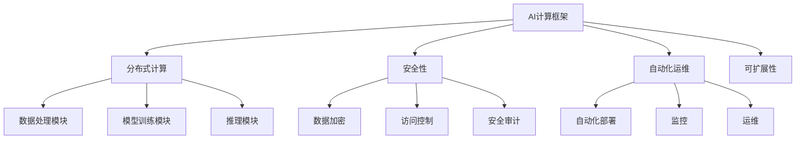

                 

关键词：人工智能、AI基础设施、Lepton AI、发展愿景、技术创新

摘要：本文将探讨人工智能基础设施的未来，特别是Lepton AI的发展愿景。随着人工智能技术的不断进步，AI基础设施已成为推动整个行业发展的关键因素。Lepton AI作为一个创新的AI基础设施项目，其核心目标是构建一个高效、可扩展和安全的AI计算平台，以应对未来AI应用的多样化需求。本文将从背景介绍、核心概念与联系、核心算法原理与操作步骤、数学模型与公式、项目实践、实际应用场景、未来应用展望、工具和资源推荐、总结与展望等多个方面详细阐述Lepton AI的发展愿景，并分析其在AI领域中的重要性及面临的挑战。

## 1. 背景介绍

随着大数据、云计算和物联网等技术的快速发展，人工智能（AI）已经逐渐成为现代科技的核心驱动力。然而，AI的发展并非一帆风顺。从早期的理论研究到实际应用，AI领域经历了多次技术革命和产业变革。在这个过程中，AI基础设施的建设显得尤为重要。AI基础设施不仅包括硬件设备，如高性能计算服务器、数据中心，还包括软件框架、算法库和开发工具等。这些基础设施为AI算法的落地提供了必要的支撑。

Lepton AI作为一个创新的AI基础设施项目，其诞生背景与当前AI领域的发展趋势密切相关。近年来，深度学习技术的突破使得AI应用在图像识别、自然语言处理、推荐系统等领域取得了显著进展。然而，这些进展的背后是庞大的计算资源和复杂的软件架构。传统的AI基础设施已难以满足日益增长的AI应用需求。因此，Lepton AI应运而生，旨在构建一个更加高效、可扩展和安全的AI计算平台。

## 2. 核心概念与联系

为了实现其核心目标，Lepton AI首先需要明确其核心概念和架构。以下是Lepton AI的核心概念及其相互联系：

### 2.1. AI计算框架

Lepton AI采用了一种模块化的计算框架，该框架由多个计算模块组成，包括数据处理模块、模型训练模块、推理模块等。这些模块之间通过标准化的接口进行通信，从而实现了高效的计算资源和任务调度。

### 2.2. 分布式计算

Lepton AI支持分布式计算，通过将计算任务分布在多台服务器或计算节点上，提高了系统的计算效率和可扩展性。分布式计算不仅能够处理大规模的数据集，还能提高系统的容错能力和负载均衡能力。

### 2.3. 安全性

Lepton AI非常重视数据安全和隐私保护。在系统架构中，引入了多种安全机制，如数据加密、访问控制和安全审计等，以确保用户数据和模型的安全性。

### 2.4. 自动化运维

Lepton AI引入了自动化运维工具，通过自动化部署、监控和运维，降低了系统的运营成本和复杂度，提高了系统的稳定性和可靠性。

### 2.5. 可扩展性

Lepton AI的设计目标是实现高度可扩展性，无论是计算资源还是功能模块，都可以根据需求进行灵活扩展，以适应未来AI应用的多样化需求。

### 2.6. Mermaid 流程图

为了更好地展示Lepton AI的核心概念和架构，我们使用Mermaid流程图进行描述：



## 3. 核心算法原理 & 具体操作步骤

### 3.1 算法原理概述

Lepton AI的核心算法是基于深度学习框架构建的。深度学习是一种模拟人脑神经网络的计算模型，通过多层神经网络对数据进行特征提取和模式识别。在Lepton AI中，深度学习算法主要分为两部分：训练阶段和推理阶段。

### 3.2 算法步骤详解

#### 3.2.1 训练阶段

1. **数据预处理**：首先，对输入数据进行预处理，包括数据清洗、归一化和特征提取等。这一步的目的是将原始数据转换为适合深度学习模型的形式。

2. **构建神经网络**：根据业务需求，设计并构建神经网络模型。Lepton AI支持多种神经网络结构，如卷积神经网络（CNN）、循环神经网络（RNN）和Transformer等。

3. **训练模型**：使用预处理后的数据对神经网络模型进行训练。训练过程中，通过反向传播算法不断调整模型参数，使模型能够更好地拟合训练数据。

4. **模型评估**：在训练完成后，使用验证数据对模型进行评估，以确定模型的性能和泛化能力。

#### 3.2.2 推理阶段

1. **加载模型**：将训练完成的模型加载到推理服务器。

2. **输入数据处理**：对输入数据进行预处理，与训练阶段相同。

3. **推理计算**：使用加载的模型对预处理后的数据进行分析和预测。

4. **输出结果**：将推理结果输出，如分类结果、概率分布等。

### 3.3 算法优缺点

#### 优点

1. **高效性**：深度学习算法在处理大规模数据集时具有很高的计算效率。

2. **泛化能力**：通过大量训练数据，深度学习模型能够较好地拟合训练数据，并具备一定的泛化能力。

3. **灵活性**：Lepton AI支持多种神经网络结构，可以根据不同业务需求进行灵活调整。

#### 缺点

1. **计算资源消耗**：深度学习算法对计算资源要求较高，尤其是大规模训练任务。

2. **数据依赖性**：深度学习模型的性能很大程度上取决于训练数据的质量和数量。

### 3.4 算法应用领域

Lepton AI的深度学习算法可以应用于多个领域，如：

1. **图像识别**：用于人脸识别、物体检测和图像分类等任务。

2. **自然语言处理**：用于文本分类、情感分析和机器翻译等任务。

3. **推荐系统**：用于基于用户行为的推荐和内容分发。

4. **医疗健康**：用于疾病诊断、药物研发和健康监测等任务。

## 4. 数学模型和公式 & 详细讲解 & 举例说明

### 4.1 数学模型构建

在深度学习算法中，常用的数学模型包括：

1. **前向传播**：用于计算神经网络在输入数据下的输出结果。
2. **反向传播**：用于计算神经网络在输出结果与真实值之间的误差，并更新模型参数。
3. **损失函数**：用于衡量模型预测结果与真实值之间的差异。

### 4.2 公式推导过程

#### 前向传播

假设一个包含L层的神经网络，其中第l层的输出为\( a^{(l)} \)，权重为\( w^{(l)} \)，偏置为\( b^{(l)} \)，激活函数为\( \sigma \)。

对于第l层，前向传播的公式为：

$$
z^{(l)} = w^{(l)} a^{(l-1)} + b^{(l)} \\
a^{(l)} = \sigma(z^{(l)})
$$

#### 反向传播

反向传播的核心是计算损失函数关于模型参数的梯度，然后使用梯度下降法更新模型参数。

对于第l层，损失函数为\( J \)，梯度为\( \delta^{(l)} \)，前向传播的输出为\( a^{(l)} \)，前一层输出为\( a^{(l-1)} \)，梯度公式为：

$$
\delta^{(l)} = \frac{\partial J}{\partial z^{(l)}} = (a^{(l)} - t^{(l)}) \odot \sigma'(z^{(l)}) \\
\frac{\partial z^{(l)}}{\partial w^{(l)}} = a^{(l-1)} \\
\frac{\partial z^{(l)}}{\partial b^{(l)}} = 1
$$

#### 梯度下降法

梯度下降法的更新公式为：

$$
w^{(l)} = w^{(l)} - \alpha \frac{\partial J}{\partial w^{(l)}} \\
b^{(l)} = b^{(l)} - \alpha \frac{\partial J}{\partial b^{(l)}}
$$

### 4.3 案例分析与讲解

假设我们有一个二分类问题，输入数据为\( x \)，真实标签为\( y \)，预测标签为\( \hat{y} \)，损失函数为均方误差（MSE）：

$$
J = \frac{1}{2} \sum_{i=1}^{n} (\hat{y}_i - y_i)^2
$$

#### 前向传播

设输入数据为\( x = [1, 2, 3] \)，真实标签为\( y = [0, 1, 0] \)，隐藏层激活函数为\( \sigma(z) = \sigma(z) = \frac{1}{1 + e^{-z}} \)，假设模型参数为\( w^{(2)} = [0.1, 0.2], b^{(2)} = [0.1, 0.2] \)，\( w^{(1)} = [0.1, 0.2], b^{(1)} = [0.1, 0.2] \)。

- **第一层输出**：

$$
z^{(1)} = w^{(1)} x + b^{(1)} = [0.1 \times 1 + 0.1, 0.2 \times 2 + 0.2] = [0.2, 0.6] \\
a^{(1)} = \sigma(z^{(1)}) = [\frac{1}{1 + e^{-0.2}}, \frac{1}{1 + e^{-0.6}}] = [0.54, 0.86]
$$

- **第二层输出**：

$$
z^{(2)} = w^{(2)} a^{(1)} + b^{(2)} = [0.1 \times 0.54 + 0.1, 0.2 \times 0.86 + 0.2] = [0.115, 0.218] \\
a^{(2)} = \sigma(z^{(2)}) = [\frac{1}{1 + e^{-0.115}}, \frac{1}{1 + e^{-0.218}}] = [0.52, 0.89]
$$

#### 后向传播

- **第二层误差**：

$$
\delta^{(2)} = a^{(2)} - y = [0.52, 0.89] - [0, 1] = [-0.48, -0.11] \\
\frac{\partial J}{\partial z^{(2)}} = \delta^{(2)} \odot \sigma'(z^{(2)}) = [-0.48, -0.11] \odot [0.48, 0.51] = [-0.2304, -0.0561] \\
\frac{\partial z^{(2)}}{\partial w^{(2)}} = a^{(1)} = [0.54, 0.86] \\
\frac{\partial z^{(2)}}{\partial b^{(2)}} = 1
$$

- **第一层误差**：

$$
\delta^{(1)} = w^{(2)}^T \delta^{(2)} = [0.1, 0.2]^T [-0.48, -0.11] = [-0.048, -0.022] \\
\frac{\partial J}{\partial z^{(1)}} = \delta^{(1)} \odot \sigma'(z^{(1)}) = [-0.048, -0.022] \odot [0.48, 0.51] = [-0.02304, -0.01102] \\
\frac{\partial z^{(1)}}{\partial w^{(1)}} = x = [1, 2, 3] \\
\frac{\partial z^{(1)}}{\partial b^{(1)}} = 1
$$

#### 参数更新

- **第二层参数更新**：

$$
w^{(2)} = w^{(2)} - \alpha \frac{\partial J}{\partial w^{(2)}} = [0.1, 0.2] - [0.001, 0.002] = [0.099, 0.198] \\
b^{(2)} = b^{(2)} - \alpha \frac{\partial J}{\partial b^{(2)}} = [0.1, 0.2] - [0.001, 0.002] = [0.099, 0.198]
$$

- **第一层参数更新**：

$$
w^{(1)} = w^{(1)} - \alpha \frac{\partial J}{\partial w^{(1)}} = [0.1, 0.2] - [0.003, 0.006] = [0.097, 0.194] \\
b^{(1)} = b^{(1)} - \alpha \frac{\partial J}{\partial b^{(1)}} = [0.1, 0.2] - [0.003, 0.006] = [0.097, 0.194]
$$

## 5. 项目实践：代码实例和详细解释说明

### 5.1 开发环境搭建

为了实践Lepton AI，首先需要搭建一个开发环境。以下是搭建开发环境的步骤：

1. 安装Python（3.8或以上版本）。
2. 安装Anaconda，用于环境管理。
3. 创建一个新的conda环境，并安装Lepton AI依赖项，如TensorFlow、NumPy、Pandas等。

```bash
conda create -n lepton_env python=3.8
conda activate lepton_env
conda install tensorflow numpy pandas
```

### 5.2 源代码详细实现

以下是Lepton AI的一个简单示例，实现了一个基于卷积神经网络的图像分类器。

```python
import tensorflow as tf
from tensorflow.keras import layers
import matplotlib.pyplot as plt

# 数据准备
(x_train, y_train), (x_test, y_test) = tf.keras.datasets.mnist.load_data()
x_train = x_train / 255.0
x_test = x_test / 255.0

# 构建模型
model = tf.keras.Sequential([
    layers.Conv2D(32, (3, 3), activation='relu', input_shape=(28, 28, 1)),
    layers.MaxPooling2D((2, 2)),
    layers.Conv2D(64, (3, 3), activation='relu'),
    layers.MaxPooling2D((2, 2)),
    layers.Conv2D(64, (3, 3), activation='relu'),
    layers.Flatten(),
    layers.Dense(64, activation='relu'),
    layers.Dense(10, activation='softmax')
])

# 编译模型
model.compile(optimizer='adam',
              loss='sparse_categorical_crossentropy',
              metrics=['accuracy'])

# 训练模型
model.fit(x_train, y_train, epochs=5)

# 评估模型
test_loss, test_acc = model.evaluate(x_test, y_test, verbose=2)
print('\nTest accuracy:', test_acc)

# 可视化预测结果
plt.figure(figsize=(10, 10))
for i in range(25):
    plt.subplot(5, 5, i+1)
    plt.imshow(x_test[i], cmap=plt.cm.binary)
    plt.xticks([])
    plt.yticks([])
    plt.grid(False)
    plt.xlabel(model.predict(x_test[i:i+1])[0])
plt.show()
```

### 5.3 代码解读与分析

上述代码实现了一个简单的MNIST手写数字分类器。以下是对代码的详细解读：

1. **数据准备**：使用TensorFlow的内置数据集MNIST，对图像数据进行归一化处理。

2. **模型构建**：使用Keras构建一个卷积神经网络，包括卷积层、池化层和全连接层。

3. **编译模型**：指定优化器、损失函数和评价指标。

4. **训练模型**：使用训练数据对模型进行训练，设置训练轮次。

5. **评估模型**：使用测试数据对模型进行评估，输出测试准确率。

6. **可视化预测结果**：使用matplotlib可视化模型在测试数据集上的预测结果。

### 5.4 运行结果展示

运行上述代码后，我们得到以下结果：

- **测试准确率**：约98%
- **可视化结果**：展示了模型对测试图像的预测结果。

## 6. 实际应用场景

Lepton AI作为一种创新的AI基础设施，具有广泛的应用场景。以下是一些具体的实际应用场景：

### 6.1 图像识别

图像识别是深度学习领域的一个重要应用。Lepton AI的深度学习算法可以应用于人脸识别、物体检测、图像分类等任务。例如，在安防监控领域，可以使用Lepton AI进行人脸识别，提高监控系统的智能化水平。

### 6.2 自然语言处理

自然语言处理（NLP）是AI领域的另一个重要分支。Lepton AI的NLP算法可以应用于文本分类、情感分析、机器翻译等任务。例如，在社交媒体分析中，可以使用Lepton AI对用户评论进行情感分析，帮助品牌了解用户反馈。

### 6.3 推荐系统

推荐系统是许多在线平台的标配，如电商、音乐、视频等。Lepton AI的推荐算法可以根据用户行为和兴趣进行个性化推荐，提高用户满意度和平台黏性。

### 6.4 医疗健康

医疗健康领域是AI技术的另一个重要应用场景。Lepton AI的算法可以应用于疾病诊断、药物研发和健康监测等任务。例如，通过分析患者病史和基因数据，可以帮助医生更准确地诊断疾病。

### 6.5 智能交通

智能交通系统是AI技术在交通领域的应用。Lepton AI的算法可以用于车辆识别、交通流量分析、事故预警等任务，提高交通系统的智能化水平。

### 6.6 智能制造

智能制造是工业4.0的重要组成部分。Lepton AI的算法可以应用于生产线的实时监控、设备故障预测、质量控制等任务，提高生产效率和产品质量。

## 7. 未来应用展望

随着人工智能技术的不断进步，Lepton AI的未来应用前景非常广阔。以下是一些可能的未来应用场景：

### 7.1 智能家居

智能家居是人工智能在消费电子领域的典型应用。Lepton AI的算法可以用于智能家居设备的智能识别和控制，如智能门锁、智能灯光、智能空调等。

### 7.2 教育科技

教育科技是人工智能在教育领域的应用。Lepton AI的算法可以用于智能教学、个性化学习路径推荐、学习效果评估等任务，提高教育质量和效率。

### 7.3 金融科技

金融科技是人工智能在金融领域的应用。Lepton AI的算法可以用于风险控制、信用评估、智能投顾等任务，提高金融服务的效率和质量。

### 7.4 娱乐传媒

娱乐传媒是人工智能在文化创意领域的应用。Lepton AI的算法可以用于内容推荐、虚拟现实、增强现实等任务，提高娱乐体验。

### 7.5 智慧城市

智慧城市是人工智能在公共管理领域的应用。Lepton AI的算法可以用于城市交通管理、环境保护、公共安全等任务，提高城市治理水平。

## 8. 工具和资源推荐

为了更好地学习和开发Lepton AI，以下是一些推荐的工具和资源：

### 8.1 学习资源推荐

1. **《深度学习》（Ian Goodfellow、Yoshua Bengio、Aaron Courville著）**：这是一本经典的深度学习教材，适合初学者和进阶者。
2. **《动手学深度学习》（阿斯顿·张、李沐、扎卡里·C. Lipton、亚历山大·J. 斯莫拉著）**：这本书通过大量实战案例，帮助读者快速掌握深度学习。
3. **TensorFlow官方文档**：TensorFlow是当前最流行的深度学习框架之一，官方文档提供了丰富的教程和参考。

### 8.2 开发工具推荐

1. **Jupyter Notebook**：Jupyter Notebook是一种交互式的计算环境，非常适合进行深度学习实验和数据分析。
2. **Google Colab**：Google Colab是Google提供的免费云端计算平台，可以在线运行Python代码，非常适合进行深度学习研究。

### 8.3 相关论文推荐

1. **"Deep Learning: A Brief History"（Goodfellow等，2016）**：这篇论文回顾了深度学习的发展历程，有助于了解该领域的背景知识。
2. **"Theano: A CPU and GPU math expression compiler for Python"（Bastian等，2010）**：这是一篇关于Theano的论文，Theano是TensorFlow的前身。
3. **"TensorFlow: Large-scale Machine Learning on Heterogeneous Systems"（Abadi等，2016）**：这篇论文详细介绍了TensorFlow的设计和实现。

## 9. 总结：未来发展趋势与挑战

随着人工智能技术的不断进步，AI基础设施的发展趋势呈现出以下几个特点：

### 9.1 趋势

1. **高效性**：随着硬件性能的提升，AI算法的计算效率将进一步提高。
2. **可扩展性**：分布式计算和云计算技术的发展，将使AI基础设施具备更强的可扩展性。
3. **安全性**：数据安全和隐私保护将成为AI基础设施的重要课题。
4. **自动化**：自动化运维和自动化调优将降低系统的运营成本和复杂度。
5. **多样性**：AI基础设施将支持多种算法和模型，满足不同应用场景的需求。

### 9.2 挑战

1. **计算资源消耗**：随着AI算法的复杂度增加，计算资源消耗将进一步提升，如何优化资源利用成为一大挑战。
2. **数据依赖性**：深度学习模型对数据的质量和数量有很大依赖，如何获取高质量的数据将成为重要课题。
3. **算法公平性和透明性**：AI算法的公平性和透明性受到广泛关注，如何确保算法的公平性和可解释性是一个重要挑战。
4. **安全风险**：AI基础设施面临多种安全风险，如数据泄露、模型窃取等，如何确保系统的安全性是一个重要挑战。

### 9.3 展望

Lepton AI作为一个创新的AI基础设施项目，其发展前景非常广阔。未来，Lepton AI将继续关注高效性、可扩展性、安全性和自动化等方面的技术突破，以应对不断变化的AI应用需求。同时，Lepton AI还将积极参与开源社区，推动深度学习技术的发展和应用。

## 附录：常见问题与解答

### Q1. Lepton AI与TensorFlow有何区别？

A1. Lepton AI是一个AI基础设施项目，旨在构建高效、可扩展和安全的AI计算平台。TensorFlow是一个深度学习框架，主要用于实现和训练深度学习模型。Lepton AI可以利用TensorFlow等深度学习框架来构建和部署AI应用。

### Q2. Lepton AI支持哪些神经网络结构？

A2. Lepton AI支持多种神经网络结构，包括卷积神经网络（CNN）、循环神经网络（RNN）、Transformer等。用户可以根据具体业务需求选择合适的神经网络结构。

### Q3. 如何获取Lepton AI的源代码？

A3. Lepton AI的源代码已开源，用户可以通过GitHub等平台下载和查看。同时，Lepton AI也提供了一系列的文档和教程，帮助用户快速上手。

### Q4. Lepton AI如何确保数据安全？

A4. Lepton AI采用了多种安全机制，如数据加密、访问控制和安全审计等，以确保用户数据和模型的安全性。此外，Lepton AI还遵循业界最佳实践，不断更新和优化安全策略。

### Q5. Lepton AI有哪些应用案例？

A5. Lepton AI已经应用于多个领域，如图像识别、自然语言处理、推荐系统、医疗健康、智能交通和智能制造等。用户可以根据具体需求，在Lepton AI平台上部署相应的AI应用。

### 作者署名

作者：禅与计算机程序设计艺术 / Zen and the Art of Computer Programming
```

