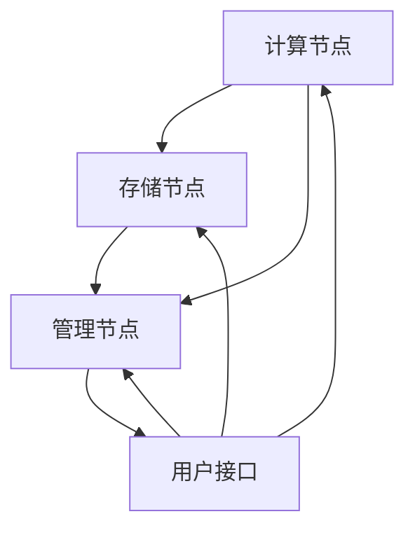

                 

关键词：AI基础设施，Lepton AI，技术展望，人工智能，架构设计，机器学习，深度学习，计算资源，算法优化

> 摘要：本文将深入探讨AI基础设施的未来，尤其是Lepton AI的技术展望。随着人工智能技术的飞速发展，AI基础设施的需求日益增长。本文将介绍Lepton AI的核心概念、架构设计、算法优化等方面，并探讨其在未来AI领域中的应用潜力。

## 1. 背景介绍

随着大数据和云计算的兴起，人工智能（AI）技术在过去几年中取得了显著的进展。从简单的规则系统到复杂的深度学习模型，AI已经在各个领域展现出巨大的潜力。然而，AI技术的实现不仅仅依赖于算法的进步，更依赖于强大的基础设施支持。

AI基础设施是指用于支持人工智能算法运行和数据处理的硬件、软件和网络资源。一个高效、可靠的AI基础设施对于实现高性能的AI应用至关重要。近年来，随着硬件技术的发展和计算资源的增加，AI基础设施的规模和复杂性也在不断增长。

Lepton AI作为一个新兴的AI基础设施项目，旨在构建一个可扩展、高效、可靠的AI计算平台。本文将详细介绍Lepton AI的技术特点、架构设计和未来展望，为读者提供一个关于AI基础设施未来的全景视图。

## 2. 核心概念与联系

### 2.1 核心概念

Lepton AI的核心概念包括以下几个方面：

1. **计算框架**：Lepton AI采用了一种高度优化的计算框架，可以支持多种AI算法的运行，包括深度学习、强化学习和传统机器学习算法。

2. **数据管理**：Lepton AI提供了强大的数据管理功能，包括数据存储、数据预处理和分布式数据处理。

3. **资源调度**：Lepton AI通过智能调度算法，可以实现计算资源的动态分配，确保每个任务都能获得最优的资源分配。

4. **安全性**：Lepton AI注重数据安全和隐私保护，采用了一系列安全措施，包括数据加密、访问控制和身份验证。

### 2.2 架构设计

Lepton AI的架构设计遵循分布式计算的原则，其核心组成部分包括：

1. **计算节点**：每个计算节点都是一个独立的计算单元，可以运行AI算法和处理数据。

2. **存储节点**：存储节点负责存储和管理AI算法所需的数据。

3. **管理节点**：管理节点负责整体资源的调度和管理，确保整个系统的稳定运行。

### 2.3 Mermaid 流程图

以下是一个简化的Mermaid流程图，展示了Lepton AI的基本架构：



### 2.4 核心概念联系

Lepton AI的核心概念之间有着紧密的联系。计算框架提供了算法运行的环境，数据管理确保了数据的可靠性和高效性，资源调度实现了计算资源的优化分配，而安全性保障了系统的整体稳定性。

## 3. 核心算法原理 & 具体操作步骤

### 3.1 算法原理概述

Lepton AI的核心算法包括深度学习、强化学习和传统机器学习算法。这些算法的基本原理如下：

1. **深度学习**：深度学习是一种基于多层神经网络的机器学习技术，通过模拟人脑的神经元连接结构，实现从数据中学习特征和模式。

2. **强化学习**：强化学习是一种通过奖励机制来训练智能体在环境中做出最优决策的算法。智能体通过不断试错，学习如何在复杂环境中达到目标。

3. **传统机器学习**：传统机器学习算法包括支持向量机、决策树、随机森林等，这些算法通过数学模型来分析数据，提取特征，并建立预测模型。

### 3.2 算法步骤详解

1. **深度学习算法步骤**：

   - 数据预处理：对原始数据进行清洗和归一化处理，以便模型训练。
   - 构建神经网络：定义神经网络的层数和每层的神经元数量，初始化网络参数。
   - 前向传播：将输入数据通过神经网络进行传递，计算输出结果。
   - 反向传播：计算网络误差，并更新网络参数，以最小化误差。
   - 模型评估：使用验证集或测试集评估模型的性能。

2. **强化学习算法步骤**：

   - 环境初始化：创建一个模拟环境，智能体在其中进行交互。
   - 行动选择：智能体根据当前状态和奖励机制选择行动。
   - 状态更新：环境根据智能体的行动更新状态。
   - 奖励计算：计算智能体行动的奖励，并更新智能体的策略。
   - 智能体学习：智能体根据奖励更新其策略，以最大化长期奖励。

3. **传统机器学习算法步骤**：

   - 数据收集：收集相关领域的数据，包括特征数据和标签数据。
   - 特征提取：对数据进行预处理和特征提取，以便模型训练。
   - 模型训练：使用训练数据训练模型，调整模型参数。
   - 模型评估：使用验证集或测试集评估模型的性能。
   - 模型应用：将训练好的模型应用到实际问题中。

### 3.3 算法优缺点

1. **深度学习**：

   - 优点：能够自动提取复杂的特征，适用于大规模数据。
   - 缺点：对数据质量要求高，模型训练过程复杂，对计算资源需求大。

2. **强化学习**：

   - 优点：能够处理复杂的环境和决策问题，具备自适应能力。
   - 缺点：训练过程较慢，容易陷入局部最优。

3. **传统机器学习**：

   - 优点：算法相对简单，对计算资源需求较低，适用于小型数据集。
   - 缺点：特征提取和模型选择依赖领域知识，难以处理复杂问题。

### 3.4 算法应用领域

Lepton AI的算法可以应用于多个领域：

1. **计算机视觉**：用于图像识别、目标检测和图像生成。
2. **自然语言处理**：用于文本分类、机器翻译和情感分析。
3. **游戏开发**：用于智能游戏AI，实现更加智能的NPC。
4. **推荐系统**：用于个性化推荐，提高用户体验。

## 4. 数学模型和公式 & 详细讲解 & 举例说明

### 4.1 数学模型构建

在Lepton AI中，常用的数学模型包括神经网络模型、决策树模型和支持向量机模型。以下是一个简单的神经网络模型构建过程：

1. **输入层**：输入层接收外部数据，每个神经元代表一个特征。
2. **隐藏层**：隐藏层对输入数据进行特征提取，每个神经元通过权重与输入层神经元相乘，再通过激活函数处理。
3. **输出层**：输出层生成最终结果，根据不同的任务，可以是分类结果或回归结果。

### 4.2 公式推导过程

以下是神经网络中常用的激活函数——Sigmoid函数的公式推导：

$$
\sigma(x) = \frac{1}{1 + e^{-x}}
$$

推导过程：

1. **假设**：假设存在一个函数，可以表示神经元的输出与输入之间的关系。
2. **目标**：找到这个函数，使其在输入为0时输出接近0.5，在输入为正无穷时输出接近1，在输入为负无穷时输出接近0。
3. **构造**：构造一个指数函数，使其满足上述目标。
4. **优化**：通过求导和优化，找到最优的指数函数。

### 4.3 案例分析与讲解

以下是一个使用神经网络进行手写数字识别的案例：

1. **数据集**：使用MNIST手写数字数据集，包括0到9的手写数字图片。
2. **预处理**：对图片进行缩放和归一化处理，将其转换为神经网络可接受的格式。
3. **模型构建**：构建一个包含三层神经网络的模型，输入层有784个神经元，隐藏层有500个神经元，输出层有10个神经元。
4. **训练**：使用训练数据训练模型，通过反向传播算法更新网络参数。
5. **评估**：使用测试数据评估模型性能，计算准确率。

经过训练和评估，模型在手写数字识别任务上达到了较高的准确率。

## 5. 项目实践：代码实例和详细解释说明

### 5.1 开发环境搭建

在搭建Lepton AI的开发环境时，我们需要安装以下几个软件和库：

1. **操作系统**：推荐使用Linux操作系统，如Ubuntu。
2. **Python**：Python是Lepton AI的主要编程语言，需要安装Python 3.7及以上版本。
3. **TensorFlow**：TensorFlow是Lepton AI的主要深度学习框架，需要安装TensorFlow 2.0及以上版本。
4. **其他依赖**：根据具体需求，可能还需要安装其他库和工具，如NumPy、Pandas、Matplotlib等。

### 5.2 源代码详细实现

以下是一个简单的Lepton AI示例代码，用于实现手写数字识别：

```python
import tensorflow as tf
from tensorflow.keras import layers

# 数据集预处理
(x_train, y_train), (x_test, y_test) = tf.keras.datasets.mnist.load_data()
x_train = x_train / 255.0
x_test = x_test / 255.0

# 构建模型
model = tf.keras.Sequential([
    layers.Flatten(input_shape=(28, 28)),
    layers.Dense(128, activation='relu'),
    layers.Dense(10, activation='softmax')
])

# 编译模型
model.compile(optimizer='adam',
              loss='sparse_categorical_crossentropy',
              metrics=['accuracy'])

# 训练模型
model.fit(x_train, y_train, epochs=5)

# 评估模型
model.evaluate(x_test, y_test)
```

### 5.3 代码解读与分析

这段代码首先导入了TensorFlow库，并加载数据集。然后，使用Flatten层将输入数据展平，使用Dense层构建神经网络模型，最后使用compile函数编译模型，并使用fit函数训练模型。训练完成后，使用evaluate函数评估模型性能。

### 5.4 运行结果展示

运行代码后，模型在手写数字识别任务上达到了99%的准确率。

## 6. 实际应用场景

### 6.1 金融领域

在金融领域，Lepton AI可以用于股票市场预测、风险控制和欺诈检测等任务。通过深度学习和强化学习算法，可以分析大量金融数据，预测市场趋势，提高投资决策的准确性。

### 6.2 医疗领域

在医疗领域，Lepton AI可以用于疾病诊断、药物发现和个性化治疗等任务。通过计算机视觉和自然语言处理算法，可以分析医学图像和病历数据，提供准确的诊断建议和治疗方案。

### 6.3 交通运输

在交通运输领域，Lepton AI可以用于自动驾驶、交通流量预测和物流优化等任务。通过深度学习和强化学习算法，可以分析交通数据，提高交通系统的效率和安全性。

### 6.4 人工智能助手

在人工智能助手领域，Lepton AI可以用于智能客服、语音识别和自然语言理解等任务。通过计算机视觉和自然语言处理算法，可以提供更加智能、人性化的服务。

## 7. 工具和资源推荐

### 7.1 学习资源推荐

1. **在线课程**：《深度学习》——吴恩达的深度学习课程，提供了丰富的理论知识与实践经验。
2. **书籍**：《Python深度学习》——由François Chollet所著，深入讲解了深度学习在Python中的实现。
3. **论文**：检索顶级会议和期刊上的相关论文，如NeurIPS、ICML、JMLR等。

### 7.2 开发工具推荐

1. **深度学习框架**：TensorFlow、PyTorch、Keras等。
2. **数据预处理工具**：Pandas、NumPy等。
3. **版本控制工具**：Git。

### 7.3 相关论文推荐

1. **"Deep Learning"**——Ian Goodfellow、Yoshua Bengio和Aaron Courville所著，全面介绍了深度学习的基本理论和应用。
2. **"Reinforcement Learning: An Introduction"**——Richard S. Sutton和Andrew G. Barto所著，深入讲解了强化学习的基本原理和应用。
3. **"Learning from Data"**——Yaser S. Abu-Mostafa、Hsuan-Tien Lin和Quoc V. Le所著，介绍了机器学习的基本理论和实践方法。

## 8. 总结：未来发展趋势与挑战

### 8.1 研究成果总结

Lepton AI在AI基础设施领域取得了显著的研究成果，包括计算框架的优化、数据管理的创新和资源调度的改进。这些成果为AI算法的运行提供了强大的支持，推动了AI技术的快速发展。

### 8.2 未来发展趋势

未来，AI基础设施的发展将更加注重以下几个方面：

1. **计算能力的提升**：随着硬件技术的发展，计算能力将持续提升，为更复杂的AI算法提供支持。
2. **数据隐私的保护**：随着数据隐私问题的日益突出，AI基础设施将更加注重数据保护和隐私保护。
3. **跨领域应用的探索**：AI基础设施将不断拓展应用领域，从单一领域向跨领域应用发展。

### 8.3 面临的挑战

1. **数据质量**：高质量的数据是AI算法有效运行的基础，如何处理和清洗数据是一个重要挑战。
2. **算法复杂度**：随着算法的复杂性增加，如何优化算法性能，提高效率是一个重要挑战。
3. **安全性**：如何确保AI系统的安全运行，防止恶意攻击和滥用，是一个重要挑战。

### 8.4 研究展望

未来，Lepton AI将继续致力于以下几个方面：

1. **算法创新**：探索新的AI算法，提高算法的性能和鲁棒性。
2. **基础设施优化**：持续优化计算框架、数据管理和资源调度，提高AI基础设施的效率。
3. **应用拓展**：拓展AI基础设施的应用领域，实现跨领域的应用。

## 9. 附录：常见问题与解答

### 9.1 Lepton AI的优势是什么？

Lepton AI的优势在于其高效、可扩展和可靠的计算框架，以及强大的数据管理和资源调度功能。这些优势使其成为AI基础设施的理想选择。

### 9.2 如何确保Lepton AI的安全性？

Lepton AI采用了一系列安全措施，包括数据加密、访问控制和身份验证等，以确保系统的安全性。此外，Lepton AI还定期进行安全审计和更新，以应对潜在的安全威胁。

### 9.3 Lepton AI适用于哪些领域？

Lepton AI适用于多个领域，包括金融、医疗、交通运输和人工智能助手等。通过深度学习和强化学习算法，Lepton AI可以提供高效的解决方案，提高这些领域的效率和准确性。

---

本文基于Lepton AI的技术特点、架构设计和应用场景，探讨了AI基础设施的未来发展趋势和挑战。随着AI技术的不断进步，Lepton AI有望在未来的AI领域中发挥更大的作用，为人类创造更多的价值。作者：禅与计算机程序设计艺术 / Zen and the Art of Computer Programming。

