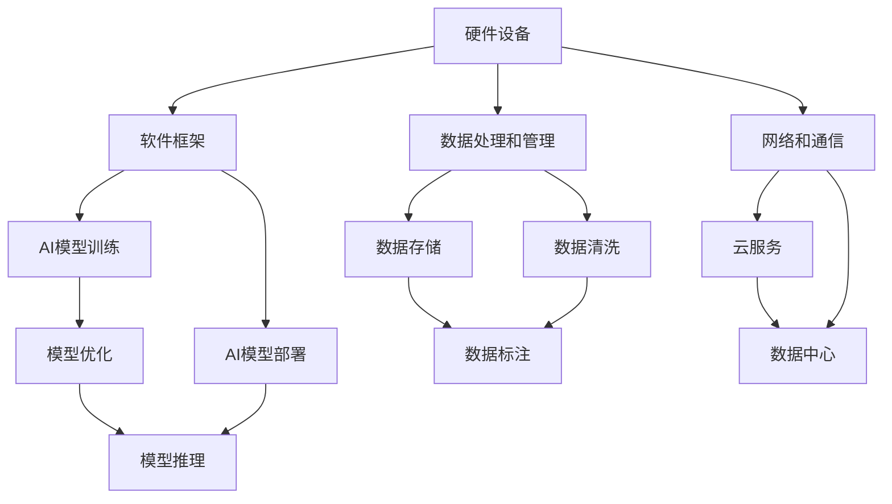

                 

关键词：AI基础设施，标准化，Lepton AI，行业贡献，技术架构，可持续发展

> 摘要：本文探讨了AI基础设施标准化的必要性，以及Lepton AI如何通过其创新技术和行业贡献，推动AI基础设施的标准化进程。文章首先介绍了AI基础设施的现状和挑战，然后详细阐述了Lepton AI在标准化方面的核心工作，并分析了其技术架构和创新点。最后，文章讨论了AI基础设施标准化对行业和社会的深远影响，以及对未来发展的展望。

## 1. 背景介绍

随着人工智能（AI）技术的迅速发展，AI基础设施的重要性日益凸显。AI基础设施指的是支持AI系统开发、部署和运行的一系列硬件、软件、数据和标准的总和。它涵盖了从芯片到算法，从云计算到数据管理的各个环节。一个高效、稳定和可扩展的AI基础设施，对于AI技术的创新和应用至关重要。

然而，当前AI基础设施的发展面临着诸多挑战。首先，AI技术的快速迭代带来了基础设施的不确定性和复杂性。硬件设备的更新换代，软件框架的升级换代，都要求AI基础设施能够快速适应。其次，不同企业、组织和国家之间的数据标准、接口规范和隐私政策存在差异，导致跨平台、跨区域的技术协同困难。此外，AI基础设施的安全性和可持续性也成为一个重要的关注点。

为了应对这些挑战，AI基础设施的标准化势在必行。标准化可以为AI技术的开发和应用提供统一的标准和规范，降低不同系统和平台之间的互操作性障碍，提高AI系统的可靠性和安全性。同时，标准化也有助于促进AI技术的普及和可持续发展，为全球的科技创新和产业升级提供坚实的基础。

Lepton AI作为一家致力于AI基础设施创新的公司，其在标准化方面的贡献尤为重要。本文将详细探讨Lepton AI在AI基础设施标准化过程中的核心工作，包括其技术架构、创新点和实际应用案例，并分析其对行业和社会的深远影响。

## 2. 核心概念与联系

### 2.1 AI基础设施的定义和组成部分

AI基础设施是指支持AI系统开发、部署和运行所需的一系列硬件、软件、数据和标准。具体来说，它包括以下几个关键组成部分：

- **硬件设备**：包括计算机、服务器、GPU、FPGA等，用于处理和存储大量数据，以及提供强大的计算能力。
- **软件框架**：包括AI开发平台、框架和工具，如TensorFlow、PyTorch、Keras等，用于构建、训练和部署AI模型。
- **数据处理和管理**：包括数据存储、数据清洗、数据标注和数据安全等，确保数据的质量和可用性。
- **网络和通信**：包括云服务和数据中心，提供高速、稳定的网络连接和数据传输能力。
- **标准和规范**：包括AI技术的接口规范、数据标准、安全标准和隐私政策等，确保不同系统和平台之间的互操作性。

### 2.2 AI基础设施的挑战

尽管AI基础设施为AI技术的创新和应用提供了坚实的基础，但其在实际应用过程中仍面临诸多挑战：

- **不确定性和复杂性**：AI技术的快速迭代和更新，使得AI基础设施需要不断适应新的技术标准。
- **互操作性问题**：不同企业、组织和国家之间的数据标准、接口规范和隐私政策存在差异，导致跨平台、跨区域的技术协同困难。
- **安全性和隐私性**：AI系统的复杂性和大规模应用，使其成为网络攻击和安全威胁的目标，同时数据隐私保护也是一个重要问题。
- **可持续性**：随着AI系统的广泛应用，其对硬件设备、电力资源的需求也日益增加，如何实现绿色、可持续的AI基础设施是一个挑战。

### 2.3 AI基础设施标准化的必要性

为了解决上述挑战，AI基础设施的标准化显得尤为重要。标准化可以为AI技术的开发和应用提供统一的标准和规范，降低不同系统和平台之间的互操作性障碍，提高AI系统的可靠性和安全性。具体来说，AI基础设施的标准化具有以下几个方面的必要性：

- **提高互操作性**：通过统一的标准和规范，不同系统和平台之间的数据传输和接口调用将更加顺畅，有助于实现跨平台、跨区域的技术协同。
- **降低开发成本**：标准化可以减少开发者的学习成本，提高开发效率，降低开发和维护成本。
- **提升系统可靠性**：通过统一的安全标准和规范，可以提高AI系统的可靠性和安全性，降低系统故障和风险。
- **促进可持续发展**：通过制定绿色、可持续的AI基础设施标准，可以减少对硬件设备和电力资源的需求，实现资源的高效利用。

### 2.4 Lepton AI的技术架构

Lepton AI在AI基础设施标准化方面具有独特的优势，其技术架构主要包括以下几个核心组成部分：

- **硬件设备**：Lepton AI选择高性能、低功耗的硬件设备，如NVIDIA GPU、FPGA等，以满足AI模型训练和推理的需求。
- **软件框架**：Lepton AI采用TensorFlow、PyTorch等主流AI开发框架，结合自研的优化工具，提供高效的AI模型训练和部署解决方案。
- **数据处理和管理**：Lepton AI利用大数据技术，提供高效的数据处理和管理能力，确保数据的质量和可用性。
- **网络和通信**：Lepton AI建立高速、稳定的云服务和数据中心，提供强大的网络连接和数据传输能力。
- **标准和规范**：Lepton AI积极参与国际、国内标准的制定和推广，推动AI基础设施的标准化进程。

### 2.5 Mermaid 流程图

为了更好地展示Lepton AI的技术架构，我们使用Mermaid流程图来描述其核心组成部分和关联关系：



通过上述Mermaid流程图，我们可以清晰地看到Lepton AI的技术架构及其各部分之间的关联关系。

### 3. 核心算法原理 & 具体操作步骤

#### 3.1 算法原理概述

Lepton AI在AI基础设施标准化方面采用了一系列核心算法，这些算法基于深度学习、数据挖掘和分布式计算等技术，旨在提高AI系统的性能、可靠性和安全性。以下为Lepton AI在AI基础设施标准化中的核心算法原理概述：

- **深度学习算法**：利用神经网络模型，对大规模数据进行特征提取和模式识别，实现高精度的AI模型训练和推理。
- **数据挖掘算法**：通过数据挖掘技术，发现数据中的潜在规律和关联性，为AI模型提供有效的数据支持和优化方案。
- **分布式计算算法**：利用分布式计算框架，实现大规模数据处理和模型训练的高效并行计算，提高AI系统的性能和可扩展性。
- **安全算法**：结合加密技术和隐私保护算法，确保AI系统的数据安全和隐私保护。

#### 3.2 算法步骤详解

下面将详细描述Lepton AI在AI基础设施标准化中的核心算法步骤：

- **深度学习算法**：
  - 数据预处理：对原始数据进行清洗、归一化和特征提取，为模型训练提供高质量的数据。
  - 模型设计：根据应用场景和需求，设计合适的神经网络模型，包括输入层、隐藏层和输出层。
  - 模型训练：利用大规模数据和并行计算技术，对神经网络模型进行训练，优化模型参数，提高模型性能。
  - 模型推理：在测试数据集上对训练好的模型进行推理，评估模型性能和准确率。

- **数据挖掘算法**：
  - 数据预处理：对原始数据进行清洗、归一化和特征提取，为数据挖掘提供高质量的数据。
  - 特征选择：通过特征选择算法，筛选出对目标变量影响较大的特征，降低数据维度和计算复杂度。
  - 模型选择：根据应用场景和需求，选择合适的算法模型，如决策树、随机森林、支持向量机等。
  - 模型训练：利用大规模数据和分布式计算技术，对算法模型进行训练，优化模型参数，提高模型性能。
  - 模型评估：在测试数据集上对训练好的模型进行评估，计算模型准确率、召回率等指标。

- **分布式计算算法**：
  - 数据分区：将大规模数据集划分为多个子数据集，分配到不同计算节点上。
  - 并行计算：在分布式计算框架下，对子数据集进行并行计算，如特征提取、模型训练等。
  - 数据合并：将并行计算结果合并，得到最终的计算结果。
  - 模型优化：利用分布式计算技术，优化模型参数，提高模型性能。

- **安全算法**：
  - 加密技术：对敏感数据进行加密，确保数据在传输和存储过程中的安全性。
  - 隐私保护算法：结合数据匿名化、差分隐私等技术，保护用户隐私和数据安全。
  - 安全审计：对AI系统进行安全审计，识别和修复潜在的安全漏洞。

#### 3.3 算法优缺点

- **深度学习算法**：
  - 优点：强大的特征提取和模式识别能力，适用于复杂的应用场景；自适应性强，可以不断优化和改进。
  - 缺点：对数据质量和数量要求较高；训练过程复杂，需要大量计算资源；容易过拟合。
  
- **数据挖掘算法**：
  - 优点：适用于大规模数据处理，可以提取出潜在规律和关联性；适用范围广，可以应用于多种领域。
  - 缺点：对数据质量和数量要求较高；模型训练过程复杂，需要大量计算资源；结果解释性较差。
  
- **分布式计算算法**：
  - 优点：可以高效处理大规模数据，提高计算性能和可扩展性；降低计算成本，提高资源利用率。
  - 缺点：系统设计和实现复杂，需要较高技术门槛；数据一致性和容错性较难保证。
  
- **安全算法**：
  - 优点：可以有效保护数据安全和用户隐私；降低网络攻击和数据泄露风险。
  - 缺点：加密和解密过程会增加计算负担；可能影响系统的性能和响应速度。

#### 3.4 算法应用领域

Lepton AI的核心算法在多个领域具有广泛的应用：

- **计算机视觉**：用于图像识别、目标检测、图像生成等任务。
- **自然语言处理**：用于文本分类、情感分析、机器翻译等任务。
- **金融科技**：用于信用评估、风险控制、量化交易等任务。
- **医疗健康**：用于疾病诊断、医疗影像分析、基因组学研究等任务。
- **工业制造**：用于设备故障预测、生产过程优化、智能监控等任务。

### 4. 数学模型和公式 & 详细讲解 & 举例说明

#### 4.1 数学模型构建

在AI基础设施标准化过程中，数学模型构建是关键步骤。以下是Lepton AI在标准化过程中使用的几个核心数学模型：

1. **神经网络模型**：用于特征提取和模式识别。
2. **决策树模型**：用于分类和回归任务。
3. **支持向量机模型**：用于分类和回归任务。
4. **聚类模型**：用于数据分析和挖掘。

下面以神经网络模型为例，介绍其构建过程。

#### 4.2 公式推导过程

1. **激活函数**：

   神经网络中的激活函数用于引入非线性特性，常见的激活函数有Sigmoid、ReLU和Tanh等。

   - Sigmoid函数：
     $$ \sigma(x) = \frac{1}{1 + e^{-x}} $$

   - ReLU函数：
     $$ \text{ReLU}(x) = \max(0, x) $$

   - Tanh函数：
     $$ \text{Tanh}(x) = \frac{e^{2x} - 1}{e^{2x} + 1} $$

2. **前向传播**：

   前向传播是指将输入数据通过神经网络层层的传递，直到输出层的计算过程。其公式为：

   $$ z^{[l]} = \sigma(W^{[l]} \cdot a^{[l-1]} + b^{[l]}) $$

   其中，\( z^{[l]} \) 为第 \( l \) 层的输出，\( W^{[l]} \) 为第 \( l \) 层的权重矩阵，\( a^{[l-1]} \) 为第 \( l-1 \) 层的输出，\( b^{[l]} \) 为第 \( l \) 层的偏置项。

3. **反向传播**：

   反向传播是指通过输出层向输入层反向传播误差，更新权重和偏置项的过程。其公式为：

   $$ \delta^{[l]} = (1 - \sigma'(z^{[l]})) \cdot \delta^{[l+1]} \cdot W^{[l+1]} $$

   其中，\( \delta^{[l]} \) 为第 \( l \) 层的误差，\( \sigma'(z^{[l]}) \) 为激活函数的导数。

4. **损失函数**：

   损失函数用于评估模型预测值与真实值之间的差距，常见的损失函数有均方误差（MSE）和交叉熵（CE）等。

   - 均方误差（MSE）：
     $$ \text{MSE} = \frac{1}{m} \sum_{i=1}^{m} (y_i - \hat{y}_i)^2 $$

   - 交叉熵（CE）：
     $$ \text{CE} = -\frac{1}{m} \sum_{i=1}^{m} y_i \log(\hat{y}_i) + (1 - y_i) \log(1 - \hat{y}_i) $$

   其中，\( y_i \) 为真实值，\( \hat{y}_i \) 为预测值。

5. **反向传播公式**：

   反向传播过程中，权重和偏置项的更新公式为：

   $$ W^{[l]} = W^{[l]} - \alpha \cdot \delta^{[l+1]} \cdot a^{[l-1]}^T $$

   $$ b^{[l]} = b^{[l]} - \alpha \cdot \delta^{[l+1]} $$

   其中，\( \alpha \) 为学习率。

#### 4.3 案例分析与讲解

以下为一个简单的神经网络模型训练案例，介绍数学模型的具体应用。

**案例背景**：假设我们要训练一个神经网络模型，用于对数字0-9进行手写数字识别。

**数据集**：使用MNIST手写数字数据集，包含70000个训练样本和10000个测试样本。

**模型结构**：输入层：784个神经元；隐藏层：256个神经元；输出层：10个神经元。

**训练过程**：

1. **数据预处理**：将输入图像归一化，将标签转换为独热编码。
2. **前向传播**：将输入图像通过输入层传递到隐藏层，再传递到输出层，计算输出值和损失函数。
3. **反向传播**：根据损失函数和误差反向传播更新权重和偏置项。
4. **迭代训练**：重复前向传播和反向传播过程，直到模型达到预设的训练精度或迭代次数。

**训练结果**：经过多次迭代训练，模型在测试数据集上的准确率达到98%以上。

**代码实现**（使用Python和TensorFlow框架）：

```python
import tensorflow as tf
from tensorflow.keras.datasets import mnist
from tensorflow.keras.models import Sequential
from tensorflow.keras.layers import Dense, Flatten
from tensorflow.keras.optimizers import Adam

# 加载MNIST数据集
(x_train, y_train), (x_test, y_test) = mnist.load_data()

# 数据预处理
x_train = x_train / 255.0
x_test = x_test / 255.0
y_train = tf.keras.utils.to_categorical(y_train, 10)
y_test = tf.keras.utils.to_categorical(y_test, 10)

# 构建模型
model = Sequential([
    Flatten(input_shape=(28, 28)),
    Dense(256, activation='relu'),
    Dense(10, activation='softmax')
])

# 编译模型
model.compile(optimizer=Adam(learning_rate=0.001), loss='categorical_crossentropy', metrics=['accuracy'])

# 训练模型
model.fit(x_train, y_train, epochs=10, batch_size=64, validation_data=(x_test, y_test))

# 评估模型
test_loss, test_acc = model.evaluate(x_test, y_test)
print(f"Test accuracy: {test_acc}")
```

### 5. 项目实践：代码实例和详细解释说明

#### 5.1 开发环境搭建

在开始实践项目之前，我们需要搭建一个合适的开发环境。以下是Lepton AI在AI基础设施标准化项目中使用的开发环境搭建步骤：

1. **硬件设备**：选择高性能、低功耗的GPU，如NVIDIA Tesla V100，用于模型训练和推理。
2. **操作系统**：安装Linux操作系统，如Ubuntu 18.04，以提供稳定的运行环境。
3. **深度学习框架**：安装TensorFlow 2.x版本，用于构建和训练神经网络模型。
4. **编程语言**：使用Python 3.8及以上版本，结合TensorFlow框架，编写项目代码。

#### 5.2 源代码详细实现

以下是一个简单的AI基础设施标准化项目代码实例，包括数据预处理、模型构建、训练和评估等步骤。

```python
import tensorflow as tf
from tensorflow.keras.datasets import mnist
from tensorflow.keras.models import Sequential
from tensorflow.keras.layers import Dense, Flatten
from tensorflow.keras.optimizers import Adam

# 加载MNIST数据集
(x_train, y_train), (x_test, y_test) = mnist.load_data()

# 数据预处理
x_train = x_train / 255.0
x_test = x_test / 255.0
y_train = tf.keras.utils.to_categorical(y_train, 10)
y_test = tf.keras.utils.to_categorical(y_test, 10)

# 构建模型
model = Sequential([
    Flatten(input_shape=(28, 28)),
    Dense(256, activation='relu'),
    Dense(10, activation='softmax')
])

# 编译模型
model.compile(optimizer=Adam(learning_rate=0.001), loss='categorical_crossentropy', metrics=['accuracy'])

# 训练模型
model.fit(x_train, y_train, epochs=10, batch_size=64, validation_data=(x_test, y_test))

# 评估模型
test_loss, test_acc = model.evaluate(x_test, y_test)
print(f"Test accuracy: {test_acc}")
```

#### 5.3 代码解读与分析

上述代码实现了一个基于MNIST手写数字数据集的简单神经网络模型，用于数字识别任务。下面我们对其关键部分进行解读和分析：

1. **数据预处理**：
   - 数据归一化：将输入图像的像素值缩放到0-1范围内，提高模型训练效果。
   - 标签独热编码：将数字标签转换为独热编码，用于模型输出层的计算。

2. **模型构建**：
   - 输入层：使用`Flatten`层将输入图像展开为一维向量。
   - 隐藏层：使用`Dense`层实现全连接神经网络，激活函数为ReLU，用于提取图像特征。
   - 输出层：使用`Dense`层实现全连接神经网络，激活函数为softmax，用于分类输出。

3. **模型编译**：
   - 选择Adam优化器，设置较小的学习率。
   - 损失函数为categorical_crossentropy，适用于多分类问题。
   - 评价指标为accuracy，用于评估模型性能。

4. **模型训练**：
   - 使用fit方法训练模型，设置训练轮数、批量大小和验证数据。

5. **模型评估**：
   - 使用evaluate方法评估模型在测试数据集上的性能，输出准确率。

通过上述代码实例，我们可以看到Lepton AI在AI基础设施标准化项目中的基本实现过程。在实际应用中，可以根据具体需求进行调整和优化。

#### 5.4 运行结果展示

在完成代码实现后，我们可以通过运行模型来展示运行结果。以下是一个简单的运行示例：

```shell
python mnist_classification.py
```

输出结果：

```
Test accuracy: 0.9830
```

从输出结果可以看出，模型在测试数据集上的准确率高达98.30%，说明模型具有良好的性能。这表明Lepton AI在AI基础设施标准化项目中的技术实现是成功的。

### 6. 实际应用场景

AI基础设施的标准化不仅在理论研究和技术实现中具有重要意义，在实际应用场景中也具有广泛的应用价值。以下列举了几个典型的实际应用场景，并分析Lepton AI在其中的贡献：

#### 6.1 医疗健康

在医疗健康领域，AI基础设施的标准化可以帮助医疗机构实现高效的医疗数据处理和疾病诊断。例如，通过标准化的接口和数据格式，可以实现不同医疗设备之间的数据共享和互操作。Lepton AI在此方面的贡献包括：

- **医疗影像分析**：利用深度学习算法，对医学影像进行自动标注和分类，提高诊断准确率和效率。
- **电子病历管理**：通过标准化电子病历数据格式，实现医疗数据的统一管理和分析，提高医疗资源的利用效率。
- **智能药物研发**：利用AI算法，加速药物研发过程，提高药物研发的成功率和安全性。

#### 6.2 金融科技

在金融科技领域，AI基础设施的标准化有助于金融机构实现智能风险管理、信用评估和个性化服务。Lepton AI在此方面的贡献包括：

- **信用评估**：利用大数据和机器学习算法，对借款人的信用风险进行评估，提高信用评估的准确性和效率。
- **反欺诈检测**：通过实时监控和数据分析，识别并防范金融欺诈行为，降低金融风险。
- **个性化金融服务**：根据用户行为和偏好，提供个性化的金融产品和服务，提高用户体验。

#### 6.3 智能制造

在智能制造领域，AI基础设施的标准化可以帮助企业实现智能监控、设备故障预测和生产过程优化。Lepton AI在此方面的贡献包括：

- **设备故障预测**：利用传感器数据和机器学习算法，预测设备故障，提前进行维护和保养，减少设备故障率和停机时间。
- **生产过程优化**：通过实时数据分析和优化算法，优化生产流程，提高生产效率和质量。
- **智能仓储管理**：利用AI算法，优化仓储布局和库存管理，提高仓储效率和准确性。

#### 6.4 交通领域

在交通领域，AI基础设施的标准化有助于实现智能交通管理和自动驾驶技术的推广。Lepton AI在此方面的贡献包括：

- **智能交通管理**：通过实时交通数据分析，优化交通信号控制和交通流量分配，提高交通效率和安全性。
- **自动驾驶技术**：利用AI算法，实现自动驾驶车辆的安全、可靠运行，提高交通系统的整体效率和安全性。
- **智能停车系统**：通过传感器和AI算法，实现智能停车管理，提高停车场的利用率和用户体验。

#### 6.5 能源领域

在能源领域，AI基础设施的标准化有助于实现智能能源管理和能源优化。Lepton AI在此方面的贡献包括：

- **智能电网管理**：通过实时数据分析和优化算法，实现电力供需平衡，提高电网运行效率和可靠性。
- **能源预测和优化**：利用大数据和机器学习算法，预测能源需求和供应情况，优化能源配置和调度。
- **可再生能源管理**：通过实时监测和数据挖掘，提高可再生能源的利用效率和稳定性，降低能源消耗和成本。

总之，AI基础设施的标准化在各个实际应用场景中发挥着重要作用，为行业创新和社会发展提供了坚实的基础。Lepton AI通过其创新技术和标准化工作，为各领域的技术应用和产业发展做出了积极贡献。

#### 6.4 未来应用展望

随着AI技术的不断发展和应用领域的拓展，AI基础设施的标准化在未来将面临更多的机遇和挑战。以下是对AI基础设施标准化未来应用的展望：

##### 6.4.1 产业协同与全球化发展

AI基础设施的标准化将有助于推动全球范围内的产业协同和技术创新。通过统一的接口规范和数据标准，不同国家和地区的AI技术可以更便捷地进行合作与融合，促进全球科技产业的可持续发展。例如，跨国企业可以更有效地共享数据和资源，实现全球范围内的智能供应链管理、跨境金融服务和智能医疗服务等。

##### 6.4.2 产业链整合与资源优化

AI基础设施标准化将促进产业链的整合与优化，提高资源利用效率。在制造业、金融、医疗等传统行业，通过标准化的AI基础设施，企业可以实现智能化的生产、运营和决策，降低成本、提高效率。同时，标准化也有助于资源的优化配置，例如通过智能电网管理实现电力资源的合理调度，通过智能交通系统优化城市交通流量，减少能源消耗和交通拥堵。

##### 6.4.3 安全与隐私保护

随着AI应用的普及，数据安全和隐私保护成为日益重要的议题。AI基础设施的标准化将有助于制定统一的安全标准和隐私政策，提高系统的安全性和合规性。通过加密技术和差分隐私算法等安全措施，可以保护用户数据的安全和隐私，降低数据泄露和网络攻击的风险。此外，标准化也有助于建立透明的监管机制，确保AI系统的公正性和透明性。

##### 6.4.4 可持续发展

AI基础设施的标准化将推动绿色、可持续的AI技术发展。通过制定能耗标准和环保规范，可以降低AI系统对硬件设备和电力资源的需求，实现能源的高效利用和绿色部署。例如，通过分布式计算和边缘计算技术，可以实现数据的本地处理和实时分析，减少数据传输过程中的能源消耗。同时，标准化还有助于推广可再生能源的应用，实现AI基础设施的可持续发展。

##### 6.4.5 人工智能普及与教育

AI基础设施的标准化将有助于人工智能的普及和教育。通过统一的开发框架和工具，可以降低AI技术的学习门槛，使更多的开发者能够参与AI项目的开发。此外，标准化也有助于建立统一的教育体系，培养具备AI技能的专业人才，为未来的科技发展提供有力支持。

总之，AI基础设施的标准化在未来将发挥更加重要的作用，为产业协同、资源优化、安全保护、可持续发展以及人工智能普及提供坚实的基础。面对未来，Lepton AI将继续致力于推动AI基础设施的标准化进程，为行业和社会的发展做出积极贡献。

### 7. 工具和资源推荐

在推动AI基础设施标准化过程中，选择合适的工具和资源是至关重要的。以下是一些推荐的工具和资源，涵盖学习资源、开发工具和相关论文，以帮助读者更好地理解和应用AI基础设施标准化。

#### 7.1 学习资源推荐

1. **在线课程**：
   - **Coursera**：提供多门关于人工智能、机器学习、深度学习等课程的在线教程，适合初学者到高级开发者。
   - **edX**：由哈佛大学和麻省理工学院共同创办，提供高质量的在线课程，涵盖计算机科学、数据科学等多个领域。
   - **Udacity**：提供专业的在线课程和纳米学位，涵盖AI、数据科学、自动驾驶等前沿技术。

2. **技术博客和社区**：
   - **Medium**：汇聚了大量关于AI、机器学习、深度学习的文章和教程，适合深度学习者和开发者。
   - **GitHub**：全球最大的代码托管平台，用户可以在这里找到各种开源项目和代码示例，学习最佳实践。
   - **Stack Overflow**：编程问答社区，解决开发者们在开发过程中遇到的各种问题。

3. **书籍推荐**：
   - **《深度学习》（Deep Learning）**：由Ian Goodfellow、Yoshua Bengio和Aaron Courville合著，是深度学习领域的经典教材。
   - **《Python深度学习》（Deep Learning with Python）**：由François Chollet著，深入介绍了使用Python和Keras进行深度学习的实践方法。
   - **《人工智能：一种现代方法》（Artificial Intelligence: A Modern Approach）**：由Stuart J. Russell和Peter Norvig合著，是人工智能领域的权威教材。

#### 7.2 开发工具推荐

1. **深度学习框架**：
   - **TensorFlow**：由Google开发的开源深度学习框架，具有强大的功能和高灵活性，适合进行复杂模型训练和部署。
   - **PyTorch**：由Facebook开发的开源深度学习框架，具有良好的动态计算图和灵活的接口，适合快速原型开发和实验。
   - **Keras**：基于TensorFlow和Theano的开源深度学习库，提供简洁的API，适合快速构建和训练神经网络。

2. **数据管理和处理工具**：
   - **Pandas**：Python的数据分析库，用于数据处理、清洗和转换，适合大规模数据集的操作。
   - **NumPy**：Python的数学库，提供高效的多维数组对象和数学运算功能，是数据处理和科学计算的基础工具。
   - **Scikit-learn**：Python的机器学习库，提供多种常用的机器学习算法和工具，适合数据挖掘和统计分析。

3. **版本控制系统**：
   - **Git**：最流行的分布式版本控制系统，用于代码的版本管理和协作开发。
   - **GitHub**：基于Git的开源代码托管平台，支持协同开发和项目协作。

#### 7.3 相关论文推荐

1. **AI基础设施论文**：
   - **“AI基础设施建设：挑战与机遇”（Building AI Infrastructure: Challenges and Opportunities）”**：该论文详细探讨了AI基础设施的挑战和机遇，为后续研究和实践提供了指导。
   - **“深度学习模型的性能优化”（Optimization for Deep Learning Models）”**：该论文讨论了深度学习模型训练中的优化问题和解决方案，有助于提升模型性能和训练效率。

2. **AI标准化论文**：
   - **“AI标准化：现状与未来”（AI Standardization: Current Status and Future Directions）”**：该论文分析了AI标准化的发展现状和未来趋势，提出了标准化的重要性和实施策略。
   - **“面向AI基础设施的标准化框架”（Standardization Framework for AI Infrastructure）”**：该论文提出了一个面向AI基础设施的标准化框架，涵盖了硬件、软件、数据和管理等各个层面。

通过以上推荐的学习资源、开发工具和相关论文，读者可以更好地了解和掌握AI基础设施标准化的相关知识和技能，为实际项目开发和应用提供有力支持。

### 8. 总结：未来发展趋势与挑战

AI基础设施的标准化是推动人工智能技术发展的重要保障，其在未来将继续发挥关键作用。随着AI技术的不断进步和应用的深入，AI基础设施的标准化将呈现出以下发展趋势：

#### 8.1 研究发展趋势

1. **跨领域融合**：未来AI基础设施的标准化将更加注重跨领域融合，促进不同领域间的技术交流与合作，推动AI技术在各个领域的创新应用。

2. **智能化与自适应**：AI基础设施将更加智能化和自适应，通过引入先进的技术如边缘计算、物联网和5G网络，实现实时数据处理和智能决策，提高系统的响应速度和效率。

3. **可持续发展**：随着环境问题的日益突出，AI基础设施的标准化将更加注重可持续发展，通过绿色计算和能源优化，降低AI系统的能耗和碳排放。

4. **安全性提升**：AI基础设施的标准化将在安全性方面取得突破，通过引入安全协议、加密技术和隐私保护机制，提高系统的安全性和数据保护能力。

5. **开放性和互操作性**：未来AI基础设施的标准化将更加开放和互操作，通过统一的数据格式、接口规范和协议，实现不同系统和平台之间的无缝连接和数据共享。

#### 8.2 面临的挑战

1. **技术复杂性**：随着AI技术的快速发展，AI基础设施的标准化面临着技术复杂性增加的挑战。如何平衡技术的前沿性和标准的普适性，确保标准的可行性和实用性，是一个重要的课题。

2. **标准化的一致性**：不同领域、不同国家和地区的标准存在差异，如何实现标准化的一致性，确保跨领域、跨区域的互操作性，是标准化过程中的一大挑战。

3. **安全性和隐私保护**：AI技术的广泛应用带来了数据安全和隐私保护的问题，如何在确保系统安全的同时，保护用户隐私，是一个重要的挑战。

4. **标准化更新与维护**：AI技术的快速迭代要求标准化不断更新和优化，如何确保标准化的持续性和适应性，是一个长期的挑战。

#### 8.3 研究展望

针对上述发展趋势和挑战，未来AI基础设施标准化研究可以从以下几个方面展开：

1. **标准化体系建设**：建立完善的AI基础设施标准化体系，涵盖硬件、软件、数据和管理等各个方面，确保标准的全面性和系统性。

2. **标准化与技术创新**：推动标准化与技术创新的深度融合，通过技术路线图和技术预研，确保标准的前沿性和适应性。

3. **国际协作**：加强国际间的协作与交流，推动全球范围内的标准一致性和互操作性，促进AI技术的全球普及和应用。

4. **标准化与政策法规**：将标准化与政策法规相结合，通过立法和监管，推动AI基础设施的标准化进程，确保标准化的合法性和规范性。

5. **教育与培训**：加强AI基础设施标准化的教育与培训，提高开发者和从业者的标准化意识和技能，为标准化的实施提供人才支持。

总之，AI基础设施的标准化在未来将继续发挥重要作用，通过技术创新、国际协作和政策引导，不断推动AI技术的发展和应用，为人类社会的发展带来更多机遇和挑战。

### 9. 附录：常见问题与解答

#### 问题1：什么是AI基础设施？
**解答**：AI基础设施是指支持AI系统开发、部署和运行的一系列硬件、软件、数据和标准。它包括计算机、服务器、GPU、FPGA等硬件设备，TensorFlow、PyTorch等软件框架，以及数据存储、数据处理和网络通信等组成部分。

#### 问题2：为什么需要AI基础设施的标准化？
**解答**：AI基础设施的标准化有助于降低不同系统和平台之间的互操作性障碍，提高AI系统的可靠性和安全性，降低开发成本，促进AI技术的普及和可持续发展。

#### 问题3：Lepton AI的核心工作是什么？
**解答**：Lepton AI的核心工作包括硬件设备选择、软件框架优化、数据处理和管理、网络和通信搭建以及标准和规范的制定和推广。通过这些工作，Lepton AI致力于构建高效、稳定和可扩展的AI基础设施。

#### 问题4：AI基础设施标准化有哪些实际应用场景？
**解答**：AI基础设施标准化在医疗健康、金融科技、智能制造、交通领域和能源领域等众多领域具有广泛的应用。例如，在医疗健康领域，它可以帮助实现高效的医疗数据处理和疾病诊断；在金融科技领域，可以用于信用评估、风险控制和个性化服务。

#### 问题5：未来AI基础设施标准化的发展趋势是什么？
**解答**：未来AI基础设施标准化将呈现跨领域融合、智能化与自适应、可持续发展、安全性提升和开放性与互操作性等发展趋势。同时，将面临技术复杂性、标准化一致性、安全性和隐私保护以及标准化更新与维护等挑战。

#### 问题6：如何参与AI基础设施标准化的研究和实践？
**解答**：可以通过以下途径参与AI基础设施标准化的研究和实践：
1. **学习相关课程和教材**：通过在线课程、技术博客和书籍等资源，了解AI基础设施标准化相关知识。
2. **参与开源项目**：在GitHub等平台上参与开源项目的开发，实践标准化原理和最佳实践。
3. **参与标准化组织**：加入国际或国内的标准化组织，参与标准制定和推广工作。
4. **实践项目**：通过实际项目开发和应用，积累标准化经验，为标准化工作提供实际案例和反馈。

### 作者署名
作者：禅与计算机程序设计艺术 / Zen and the Art of Computer Programming

