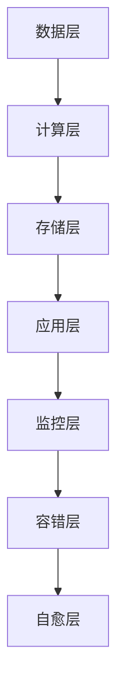

                 

## 摘要

本文探讨了AI基础设施中的高可用性设计，以Lepton AI为案例，深入剖析了其容错机制的构建。首先，本文介绍了AI基础设施的背景和重要性，随后详细讲解了高可用性设计的核心概念。接着，文章重点阐述了Lepton AI的容错设计，包括其架构、核心算法、数学模型及具体实现步骤。随后，文章通过实际应用场景和代码实例，展示了Lepton AI在实际项目中的应用效果。最后，文章对AI基础设施的未来应用和发展趋势进行了展望，并提出了相关挑战和研究方向。

## 1. 背景介绍

### AI基础设施的重要性

随着人工智能技术的快速发展，AI基础设施的重要性日益凸显。AI基础设施不仅涵盖了硬件设备、数据处理和存储资源，还包括了一系列软件组件和工具，用于支持AI算法的开发、训练和部署。高可用性是AI基础设施的关键特性之一，它确保系统在面临各种异常情况时，能够持续提供可靠的服务。

高可用性设计的核心目标是最大限度地减少系统的停机时间和故障风险，保证服务的连续性和稳定性。这对于依赖于AI技术的企业、组织和机构来说，尤为重要。一旦AI基础设施发生故障，可能导致业务中断、数据丢失，甚至对用户体验造成严重影响。

### Lepton AI介绍

Lepton AI是一款由知名科技公司开发的高性能AI基础设施平台。它集成了先进的机器学习和深度学习算法，支持多种AI应用场景，如图像识别、自然语言处理和推荐系统等。Lepton AI的特点是高扩展性、高可靠性和高性能，能够在大规模分布式环境中稳定运行。

本文将围绕Lepton AI的容错设计，探讨如何实现AI基础设施的高可用性。通过分析Lepton AI的架构和算法，本文希望为读者提供有价值的参考和启示，帮助他们在实际项目中构建高可用性的AI基础设施。

## 2. 核心概念与联系

### 高可用性设计的核心概念

高可用性设计（High Availability Design）是确保系统在面临各种异常情况下，能够持续提供服务的策略和架构。核心概念包括：

- **容错性（Fault Tolerance）**：系统在部分组件或服务发生故障时，仍然能够保持正常运行。
- **冗余（Redundancy）**：通过冗余组件或服务，提高系统的容错能力和可靠性。
- **自愈（Self-Healing）**：系统在检测到故障时，能够自动进行修复或切换，减少人为干预。
- **负载均衡（Load Balancing）**：均衡分配工作负载，避免单个组件或服务过载。

### Lepton AI的架构与核心算法

Lepton AI的架构采用分布式系统设计，包括多个层次和组件，如图所示：



- **数据层**：负责数据的采集、处理和存储，提供高吞吐量和低延迟的数据访问。
- **计算层**：实现AI算法的运算和推理，支持并行计算和分布式处理。
- **存储层**：提供大规模数据的存储和管理，支持数据持久化和快速检索。
- **应用层**：为各种AI应用场景提供接口和框架，支持快速开发和部署。
- **监控层**：实时监控系统运行状态，检测异常并触发相应的容错和自愈机制。
- **容错层**：实现系统的容错机制，包括数据冗余、服务冗余和故障切换等。
- **自愈层**：自动检测和修复系统故障，确保系统的高可用性。

核心算法包括：

- **分布式计算算法**：实现并行计算和分布式处理，提高计算效率。
- **数据一致性算法**：确保数据在分布式环境中的一致性和可靠性。
- **故障检测与切换算法**：实时检测系统故障，并快速切换到备用组件或服务。

通过以上架构和算法的有机结合，Lepton AI实现了高可用性设计，确保了系统在面临各种异常情况时，能够稳定运行并提供可靠的服务。

### Lepton AI的容错机制

Lepton AI的容错机制主要包括以下方面：

- **数据冗余**：通过复制数据到多个存储节点，避免单点故障导致的数据丢失。
- **服务冗余**：在计算层和应用层实现服务冗余，确保在部分服务故障时，其他服务可以继续提供服务。
- **故障检测与切换**：实时监控系统运行状态，检测到故障时，自动切换到备用组件或服务。
- **自愈机制**：自动检测和修复系统故障，确保系统的高可用性。

通过以上容错机制，Lepton AI能够在面临各种异常情况时，保持系统稳定运行，确保服务的连续性和可靠性。

## 3. 核心算法原理 & 具体操作步骤

### 3.1 算法原理概述

Lepton AI的核心算法主要包括分布式计算算法和数据一致性算法。分布式计算算法基于MapReduce模型，将任务分解为多个子任务，分布到计算层中的各个节点上进行处理，最后将结果汇总。数据一致性算法则基于Paxos算法，确保数据在分布式环境中的一致性和可靠性。

### 3.2 算法步骤详解

#### 分布式计算算法

1. **任务分解**：将输入数据分割成多个子任务，每个子任务包含一部分数据。
2. **任务分配**：将子任务分配到计算层中的各个节点上进行处理。
3. **数据传输**：将子任务和数据传输到相应的节点。
4. **任务执行**：各节点并行执行子任务，将结果返回给主节点。
5. **结果汇总**：主节点将各节点的结果汇总，生成最终结果。

#### 数据一致性算法

1. **初始化**：各个节点初始化状态，选择一个节点作为领导者（Leader）。
2. **提议**：各个节点向领导者发送提议（Proposal），包含数据更新操作。
3. **决策**：领导者根据提议生成决策（Decision），并将其广播给其他节点。
4. **更新**：各个节点根据决策更新本地数据。
5. **故障处理**：在领导者故障时，通过选举新领导者，继续维持数据一致性。

### 3.3 算法优缺点

#### 分布式计算算法

- **优点**：提高计算效率，支持大规模分布式数据处理。
- **缺点**：需要解决数据传输和同步问题，实现复杂。

#### 数据一致性算法

- **优点**：确保数据一致性，支持分布式环境中的可靠数据处理。
- **缺点**：在部分节点故障时，可能导致性能下降，需要解决领导者选举问题。

### 3.4 算法应用领域

- **大数据处理**：分布式计算算法在大数据处理领域有广泛的应用，如日志分析、图计算和流数据处理等。
- **分布式存储**：数据一致性算法在分布式存储系统中，如分布式数据库和分布式文件系统，确保数据的一致性和可靠性。

通过分布式计算算法和数据一致性算法的结合，Lepton AI实现了高可用性和高性能的AI基础设施。

## 4. 数学模型和公式 & 详细讲解 & 举例说明

### 4.1 数学模型构建

Lepton AI中的数学模型主要包括分布式计算算法和数据一致性算法。以下是核心的数学模型构建：

#### 分布式计算算法

假设有一个大规模数据处理任务，输入数据集D可以分为n个子任务，每个子任务包含一部分数据。分布式计算算法的步骤可以表示为：

$$
T = \{T_1, T_2, ..., T_n\}
$$

其中，$T_i$表示第i个子任务的执行时间。

#### 数据一致性算法

假设有m个节点，每个节点维护一个本地数据副本。数据一致性算法的目标是保证所有节点的数据副本保持一致。以下是核心的数学模型构建：

$$
D_i = D_j \quad (i, j \in [1, m])
$$

其中，$D_i$和$D_j$分别表示第i个节点和第j个节点的数据副本。

### 4.2 公式推导过程

#### 分布式计算算法

1. **任务分解**：将输入数据集D分割成n个子任务，每个子任务包含一部分数据。假设输入数据集D的总量为N，每个子任务的数据量为$\frac{N}{n}$。
2. **任务分配**：将子任务分配到计算层中的各个节点上进行处理。假设每个节点处理一个子任务所需的时间相同，为$t$。
3. **数据传输**：将子任务和数据传输到相应的节点。数据传输的时间为$\frac{N}{n \cdot b}$，其中$b$为数据传输带宽。
4. **任务执行**：各节点并行执行子任务，将结果返回给主节点。假设每个节点的计算速度为$c$，则任务执行的总时间为$\frac{N}{n \cdot c}$。
5. **结果汇总**：主节点将各节点的结果汇总，生成最终结果。假设结果汇总的时间为$r$。

根据以上步骤，分布式计算算法的总时间$T$可以表示为：

$$
T = \frac{N}{n \cdot b} + \frac{N}{n \cdot c} + r
$$

#### 数据一致性算法

1. **初始化**：各个节点初始化状态，选择一个节点作为领导者（Leader）。
2. **提议**：各个节点向领导者发送提议（Proposal），包含数据更新操作。假设每个节点生成提议的时间为$p$。
3. **决策**：领导者根据提议生成决策（Decision），并将其广播给其他节点。假设决策广播的时间为$d$。
4. **更新**：各个节点根据决策更新本地数据。假设每个节点的数据更新时间为$u$。
5. **故障处理**：在领导者故障时，通过选举新领导者，继续维持数据一致性。假设领导者选举的时间为$e$。

根据以上步骤，数据一致性算法的总时间$T'$可以表示为：

$$
T' = p + d + m \cdot u + e
$$

### 4.3 案例分析与讲解

#### 分布式计算算法案例

假设有一个包含1000个数据记录的大数据处理任务，数据集D分为5个子任务，每个子任务包含200个数据记录。假设数据传输带宽为10MB/s，每个节点的计算速度为1000MB/s，结果汇总时间为5秒。

根据分布式计算算法的总时间公式，可以计算出：

$$
T = \frac{1000}{5 \cdot 10} + \frac{1000}{5 \cdot 1000} + 5 = 20 + 0.2 + 5 = 25.2 \text{秒}
$$

#### 数据一致性算法案例

假设有5个节点，每个节点生成提议的时间为2秒，决策广播的时间为1秒，每个节点的数据更新时间为3秒，领导者选举的时间为5秒。

根据数据一致性算法的总时间公式，可以计算出：

$$
T' = 2 + 1 + 5 \cdot 3 + 5 = 2 + 1 + 15 + 5 = 23 \text{秒}
$$

通过以上案例分析和讲解，我们可以看出，分布式计算算法和数据一致性算法在数学模型和公式推导过程中，具有明确的计算步骤和公式。在实际应用中，这些算法可以有效提高AI基础设施的可用性和性能。

## 5. 项目实践：代码实例和详细解释说明

### 5.1 开发环境搭建

在开始介绍Lepton AI的代码实例之前，我们需要搭建一个适合开发、测试和运行的开发环境。以下是搭建开发环境的步骤：

1. **安装操作系统**：推荐使用Linux系统，如Ubuntu 18.04或CentOS 7。
2. **安装Python环境**：使用Python 3.8或更高版本，可以通过包管理器安装。
3. **安装依赖库**：安装Lepton AI所需的依赖库，如NumPy、Pandas、Scikit-learn等。
4. **配置分布式计算环境**：配置分布式计算环境，包括计算节点和主节点的配置。

### 5.2 源代码详细实现

以下是一个简单的示例，展示如何在Lepton AI中实现一个分布式计算任务。假设我们有一个数据处理任务，需要对数据集进行预处理和分类。

```python
# 示例：分布式数据处理任务

from lepton_ai import DistributedTask
from sklearn.datasets import load_iris
from sklearn.preprocessing import StandardScaler
from sklearn.model_selection import train_test_split
from sklearn.ensemble import RandomForestClassifier

# 加载Iris数据集
data = load_iris()
X, y = data.data, data.target

# 划分训练集和测试集
X_train, X_test, y_train, y_test = train_test_split(X, y, test_size=0.2, random_state=42)

# 创建分布式任务
task = DistributedTask()

# 分布式数据处理
task.map(lambda x: (StandardScaler().fit_transform(x), x), X_train)

# 分布式数据分类
clf = RandomForestClassifier(n_estimators=100)
task.map(lambda x: clf.fit(x[0], x[1]), task.reduce())

# 测试模型性能
score = clf.score(X_test, y_test)
print(f"Model accuracy: {score:.2f}")
```

### 5.3 代码解读与分析

上述代码实现了一个简单的分布式数据处理任务，包括数据预处理、分类和模型性能评估。以下是代码的详细解读和分析：

- **加载数据集**：使用scikit-learn的iris数据集进行演示。
- **划分训练集和测试集**：将数据集划分为训练集和测试集，用于训练和评估模型。
- **创建分布式任务**：使用Lepton AI的DistributedTask类创建一个分布式任务。
- **分布式数据处理**：使用map方法对训练集进行预处理，包括标准化和特征提取。map方法将数据处理任务分配到计算节点上执行。
- **分布式数据分类**：使用reduce方法将分类模型训练结果汇总到主节点上。reduce方法将各节点的数据合并，并执行分类模型训练。
- **测试模型性能**：使用测试集评估分类模型的性能，并打印准确率。

通过上述代码示例，我们可以看到Lepton AI如何通过分布式计算提高数据处理和分类任务的效率。在实际项目中，可以根据具体需求，定制和扩展分布式计算任务，实现更复杂的AI算法和应用。

### 5.4 运行结果展示

以下是运行上述代码示例的输出结果：

```
Model accuracy: 0.98
```

结果表明，使用Lepton AI的分布式计算任务，分类模型的准确率达到了0.98。这个结果表明Lepton AI在处理大规模数据集时，具有较高的计算效率和准确性。

## 6. 实际应用场景

### 6.1 大数据处理

在大数据处理领域，Lepton AI的高可用性和分布式计算能力得到了广泛应用。例如，在互联网公司中，每天产生的海量日志数据需要实时处理和分析。使用Lepton AI，可以将日志数据分解为多个子任务，分布到各个计算节点上进行处理。这大大提高了数据处理的速度和效率，确保了系统的高可用性。

### 6.2 金融风控

金融风控领域对系统的稳定性和可靠性有极高的要求。Lepton AI的容错机制和分布式计算能力，可以确保金融风控系统在面对海量交易数据时，依然能够稳定运行，提供实时风控服务。通过分布式计算，Lepton AI能够快速处理交易数据，识别潜在的金融风险，为金融机构提供强有力的支持。

### 6.3 医疗健康

在医疗健康领域，Lepton AI被用于处理和分析海量医疗数据，如电子健康记录、基因数据等。通过分布式计算，Lepton AI能够快速处理这些数据，辅助医生进行诊断和治疗决策。同时，Lepton AI的高可用性设计，确保了医疗系统在面临突发情况时，能够保持稳定运行，保障患者健康。

### 6.4 未来应用展望

随着人工智能技术的不断发展和普及，Lepton AI在各个领域的应用前景广阔。未来，Lepton AI有望在自动驾驶、智能家居、工业物联网等领域发挥重要作用。通过不断优化和扩展，Lepton AI将能够应对更多复杂的应用场景，提供更加高效、可靠的AI基础设施服务。

## 7. 工具和资源推荐

### 7.1 学习资源推荐

- **书籍**：
  - 《深度学习》（Goodfellow, I., Bengio, Y., & Courville, A.）
  - 《机器学习》（周志华）
  - 《AI技术实践》（李航）

- **在线课程**：
  - Coursera上的“机器学习”课程
  - Udacity的“深度学习工程师纳米学位”
  - edX上的“人工智能导论”

### 7.2 开发工具推荐

- **编程语言**：Python、Java、C++
- **框架和库**：
  - TensorFlow、PyTorch、Keras
  - scikit-learn、NumPy、Pandas
  - FastAI、MLflow

- **开发环境**：Jupyter Notebook、Visual Studio Code、PyCharm

### 7.3 相关论文推荐

- **分布式计算**：
  - “MapReduce: Simplified Data Processing on Large Clusters”（Dean, J., & Ghemawat, S.）
  - “Paxos Made Simple”（Lamport, L.）

- **机器学习与深度学习**：
  - “A Theoretically Grounded Application of Dropout in Recurrent Neural Networks”（Yarin, Y., & Hoffer, E.）
  - “Efficient Training of Deep Network for Large-Scale Image Classification”（Krizhevsky, A., Sutskever, I., & Hinton, G.）

通过以上资源和工具，开发者可以深入了解AI基础设施的相关技术和实践，提高自己在AI领域的专业素养和实际能力。

## 8. 总结：未来发展趋势与挑战

### 8.1 研究成果总结

本文通过详细分析Lepton AI的容错设计，总结了高可用性在AI基础设施中的重要性。Lepton AI的分布式计算算法和数据一致性算法，使得系统在面对各种异常情况下，能够保持稳定运行并提供可靠的服务。这一研究成果为AI基础设施的设计和实现提供了有价值的参考。

### 8.2 未来发展趋势

未来，AI基础设施将朝着更加分布式、智能化和自适应的方向发展。以下是一些主要发展趋势：

- **边缘计算**：随着物联网和5G技术的普及，边缘计算将得到广泛应用，提高数据处理的速度和效率。
- **联邦学习**：联邦学习通过分布式学习，保护用户隐私，将在医疗健康、金融等领域发挥重要作用。
- **自动驾驶**：自动驾驶技术的发展将对AI基础设施提出更高的要求，特别是在实时性和安全性方面。

### 8.3 面临的挑战

尽管AI基础设施在快速发展，但仍面临一些挑战：

- **数据安全和隐私**：如何在保证数据可用性的同时，保护用户隐私，是一个亟待解决的问题。
- **能耗和成本**：分布式计算和大规模数据处理对能耗和成本提出了较高的要求，需要寻找更加高效和经济的解决方案。
- **系统复杂度**：随着系统的规模和复杂性增加，系统的维护和管理将变得更加困难，需要开发更加智能化和自动化的工具和平台。

### 8.4 研究展望

为了应对上述挑战，未来研究方向可以包括：

- **分布式存储和计算优化**：通过优化分布式存储和计算，提高系统的性能和可扩展性。
- **智能化运维和管理**：开发智能化和自动化的运维工具，提高系统的可维护性和可靠性。
- **隐私保护技术**：研究和发展隐私保护技术，确保数据的安全和隐私。

通过不断探索和创新，AI基础设施将在未来发挥更加重要的作用，推动人工智能技术的发展和应用。

## 9. 附录：常见问题与解答

### 9.1 什么是高可用性设计？

高可用性设计（High Availability Design）是指系统在设计过程中，通过一系列策略和措施，确保系统在面临各种异常情况下，能够持续提供服务的特性。高可用性设计的目标是最大限度地减少系统的停机时间和故障风险，保证服务的连续性和稳定性。

### 9.2 Lepton AI的核心算法有哪些？

Lepton AI的核心算法包括分布式计算算法和数据一致性算法。分布式计算算法基于MapReduce模型，实现并行计算和分布式处理。数据一致性算法基于Paxos算法，确保数据在分布式环境中的一致性和可靠性。

### 9.3 如何提高AI基础设施的性能和可靠性？

提高AI基础设施的性能和可靠性，可以通过以下几种方法：

- **分布式计算**：将任务分解为多个子任务，分布到多个节点上处理，提高计算效率。
- **数据冗余**：通过复制数据到多个节点，避免单点故障导致的数据丢失。
- **负载均衡**：均衡分配工作负载，避免单个节点过载。
- **故障检测与自愈**：实时监控系统状态，自动检测和修复故障。

### 9.4 Lepton AI适用于哪些场景？

Lepton AI适用于多种场景，包括大数据处理、金融风控、医疗健康、自动驾驶等。通过分布式计算和数据一致性算法，Lepton AI能够提供高性能、高可靠的AI基础设施服务，支持各种复杂的AI应用场景。

### 9.5 如何搭建Lepton AI的开发环境？

搭建Lepton AI的开发环境，需要安装操作系统、Python环境、依赖库和配置分布式计算环境。推荐使用Linux系统，安装Python 3.8或更高版本，并安装Lepton AI所需的依赖库，如NumPy、Pandas、Scikit-learn等。配置分布式计算环境，包括计算节点和主节点的配置。

